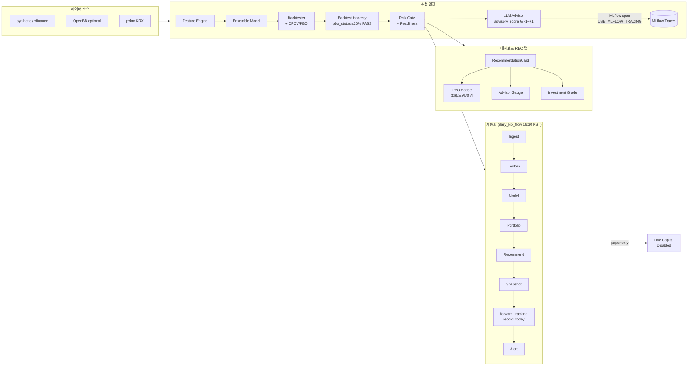
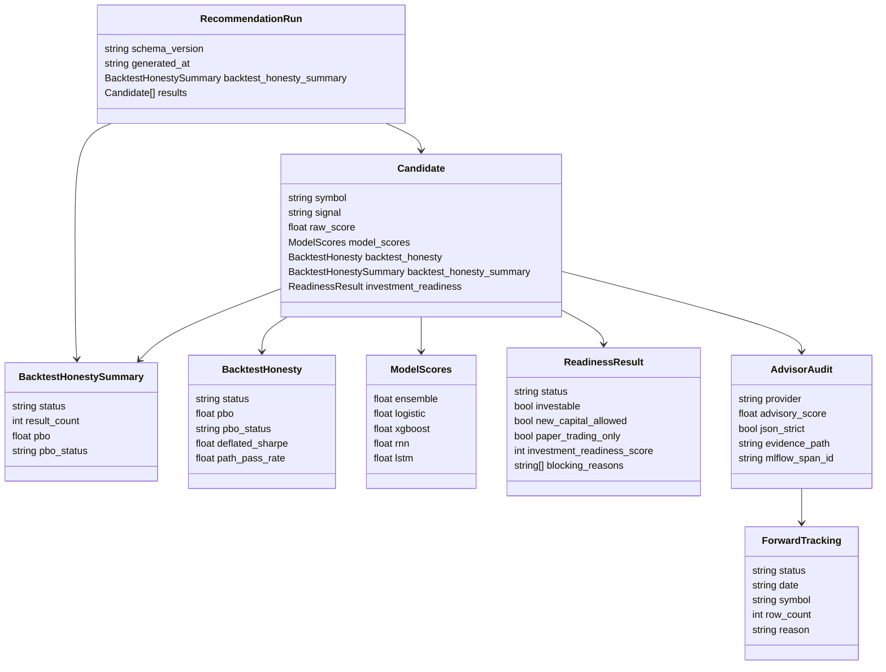
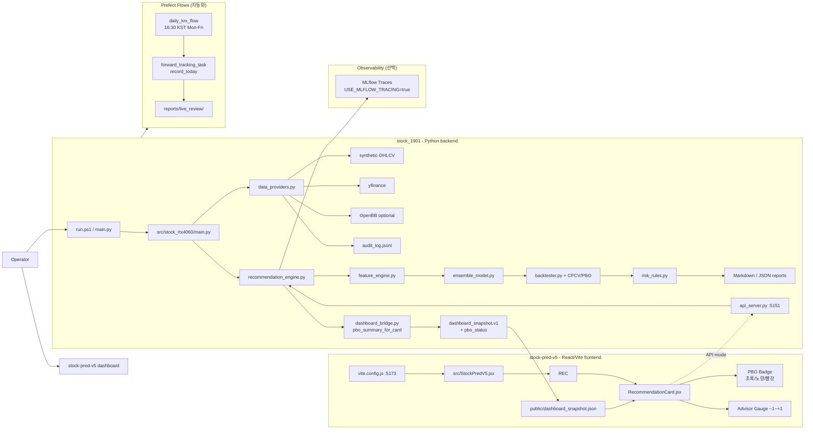
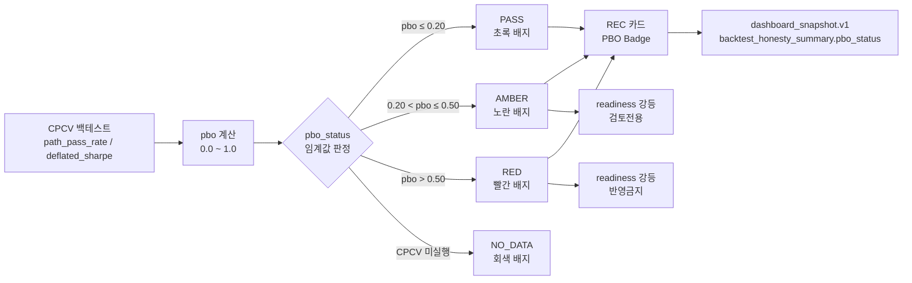
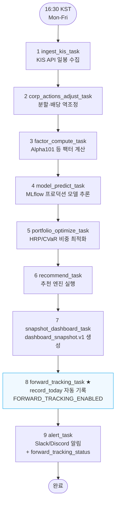
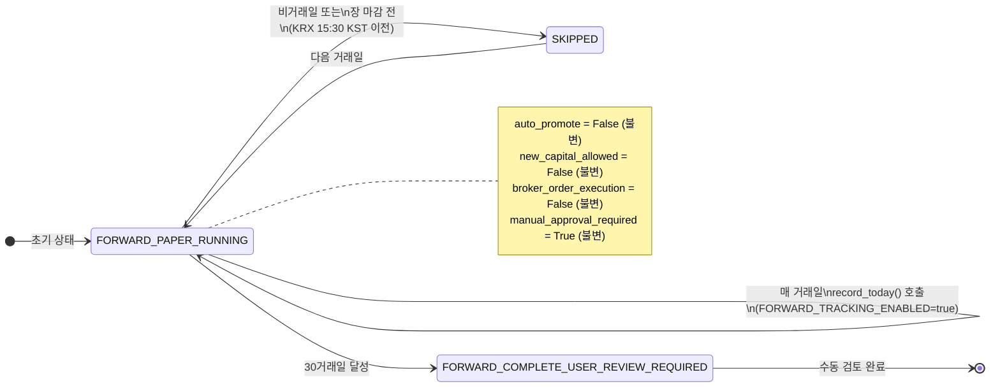

# Plan — README.md GitHub 업데이트
**Date:** 2026-05-29
**Type:** DOCS
**Branch:** main
**Scope:** README.md Wave 3 반영 + Mermaid 그래프 신규/수정

---

## 1. 현황 진단

### 1.1 README.md 기본 현황
- 총 **1,489줄**, `## ` 섹션 **35개**
- 기존 Mermaid 그래프: **16개** (flowchart, classDiagram, sequenceDiagram)
- Codex/Hermes 자동 추가 섹션: **7개** → 하단 1/3을 점령해 가독성 저해

### 1.2 Wave 3 미반영 항목 (코드 확인 완료)

| 기능 | 구현 위치 | README 반영 여부 |
|------|---------|----------------|
| `USE_MLFLOW_TRACING` flag | `advisors/claude_client.py:63` | ❌ 미반영 |
| `_wrap_with_mlflow_span()` | `advisors/claude_client.py:723` | ❌ 미반영 |
| `pbo` / `pbo_status` 필드 | `backtest_honesty.py:89,135` | ❌ 미반영 |
| `backtest_honesty_summary` per-candidate | `dashboard_bridge.py:264` | ❌ 미반영 |
| `PboBadge` React 컴포넌트 | `RecommendationCard.jsx` | ❌ 미반영 |
| `forward_tracking_task()` | `flows/daily_krx.py:207` | ❌ 미반영 |
| `FORWARD_TRACKING_ENABLED` flag | `flows/daily_krx.py:25` | ❌ 미반영 |
| `record_today()` 메서드 | `auto_forward_recorder.py` | ❌ 미반영 |

### 1.3 기존 그래프 업데이트 필요 항목

| 섹션 | 줄 | 누락 내용 |
|------|----|---------|
| `## Operating Flow` | 37-48 | forward_tracking, MLflow span 표시 없음 |
| `## Data Contract Type Graph` | 52-107 | `pbo`, `pbo_status`, `ForwardTracking` 클래스 없음 |
| `## 2. System Diagram` | 172-218 | PBO badge, MLflow tracing, forward_tracking 경로 없음 |

---

## 2. 업데이트 목표

1. 상단 3개 그래프를 Wave 3 현실에 맞게 수정
2. 신규 Mermaid 3개 추가 (PBO 흐름, 일별 KRX 플로우, AutoForward 상태 머신)
3. `## What It Does` 테이블에 Wave 3 기능 반영
4. Codex 자동 섹션 7개를 단일 Appendix로 접기

---

## 3. PR 계획

### PR-R1: 기존 그래프 3개 수정
**파일:** `README.md`
**변경 범위:** 줄 37-48, 52-107, 172-218

#### [수정 1] `## Operating Flow` (줄 37-48)
기존 단순 파이프라인 → **Wave 3 전체 흐름** 반영



#### [수정 2] `## Data Contract Type Graph` (줄 52-107)
Wave 3 신규 필드 및 클래스 추가



#### [수정 3] `## 2. System Diagram` (줄 172-218)
PBO badge + MLflow tracing + forward_tracking 경로 추가



---

### PR-R2: 신규 Mermaid 섹션 3개 추가

**파일:** `README.md` — `## 22. Wave 3 Upgrade` 섹션 내부에 삽입

#### [신규 1] PBO 판정 흐름도 (flowchart)



#### [신규 2] daily_krx_flow 9단계 (flowchart TD)



#### [신규 3] AutoForwardRecorder 상태 머신 (stateDiagram-v2)



---

### PR-R3: 구조 정리

**파일:** `README.md`

#### 작업 목록

| 번호 | 작업 | 상세 |
|------|------|------|
| 1 | Codex/Hermes 자동 섹션 축소 | 7개 섹션(`## Codex Documentation Update...`, `## Hermes Documentation Update...`) → `## Appendix — Auto-generated Documentation Logs` 하나로 접기 |
| 2 | `## What It Does` 테이블 업데이트 | Advisor layer 행: LiteLLM + MLflow tracing 추가<br/>Data and validation 행: PBO(backtest_honesty_summary) 추가 |
| 3 | `## 7. Dashboard` 구조 테이블 | `RecommendationCard.jsx`에 PBO Badge 행 추가 |
| 4 | `## 13. Validation Commands` | MLflow tracing 확인 커맨드 추가 |

---

## 4. 실행 순서 및 타임라인

```
Day 1 오전 (1h)
  PR-R1: 기존 그래프 3개 수정
    - Operating Flow
    - Data Contract classDiagram
    - System Diagram

Day 1 오후 (1h)
  PR-R2: 신규 섹션 3개 추가
    - PBO 판정 flowchart
    - daily_krx_flow 9단계 flowchart
    - AutoForwardRecorder stateDiagram

Day 2 (30min)
  PR-R3: 구조 정리
    - Codex 자동 섹션 축소
    - What It Does 테이블 업데이트
    - Dashboard 구조 테이블 업데이트
```

---

## 5. 검증 게이트

각 PR 전 확인:

```bash
# Mermaid syntax 검증 (Node.js)
npx @mermaid-js/mermaid-cli -i README.md -o /tmp/readme_check.svg

# 링크 유효성
grep -oP '\(\.\/[^)]+\)' README.md | tr -d '()' | while read f; do
  [ -e "$f" ] && echo "OK: $f" || echo "BROKEN: $f"
done

# 용어 일관성 (pbo_status 표기 통일)
grep -c "pbo_status" README.md
```

---

## 6. 변경 범위 요약

| PR | 변경 줄 (예상) | 그래프 수 | 리스크 |
|----|--------------|---------|--------|
| PR-R1 | ~120줄 교체 | 3개 수정 | 낮음 (기존 그래프 교체) |
| PR-R2 | ~100줄 추가 | 3개 신규 | 낮음 (additive) |
| PR-R3 | ~400줄 축소 | 0 | 중간 (Codex 섹션 축소) |
| **합계** | **~620줄** | **6개** | — |

---

## 7. 승인 체크리스트

- [ ] PR-R1 그래프 3개 Mermaid syntax 오류 없음
- [ ] PR-R2 신규 섹션 3개 기존 내용 삭제 없음 (additive)
- [ ] PR-R3 Codex 섹션 내용 Appendix에 보존됨 (삭제 아님)
- [ ] GitHub Actions CI green
- [ ] `## Current Operating Verdict` 상단 표 변경 없음 (운영 현황 불변)
