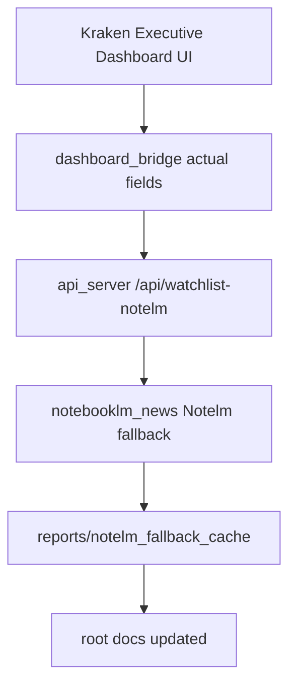
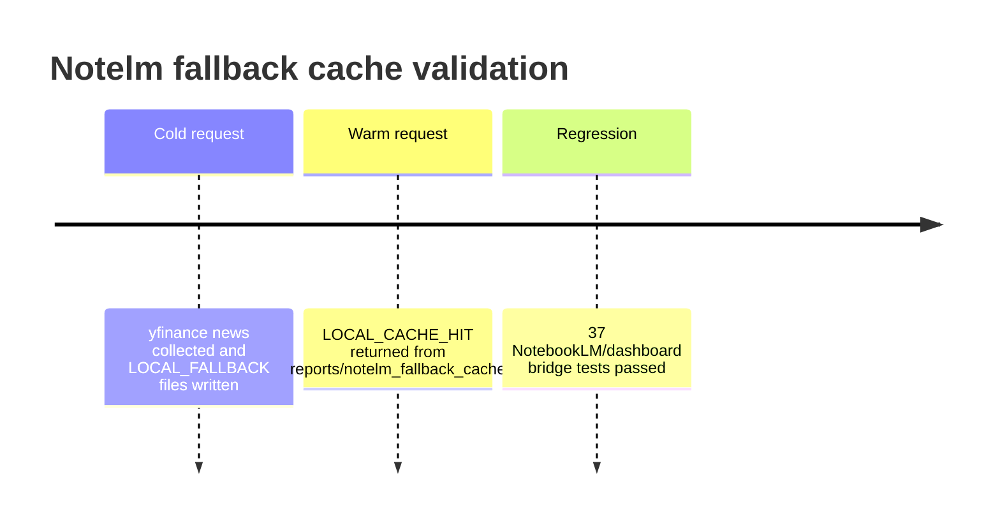
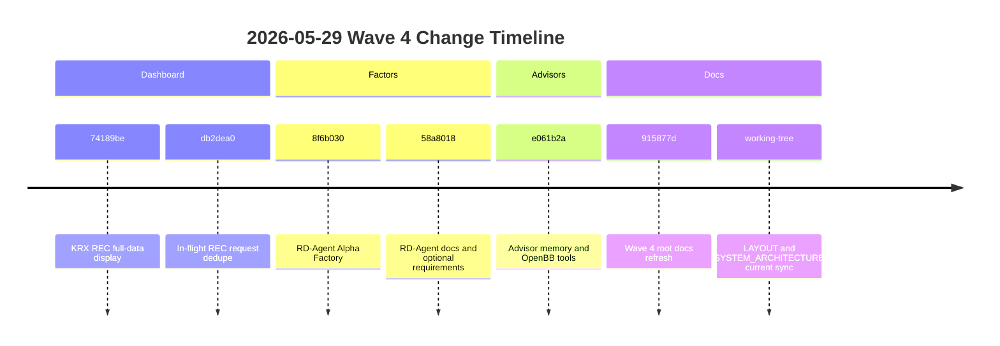
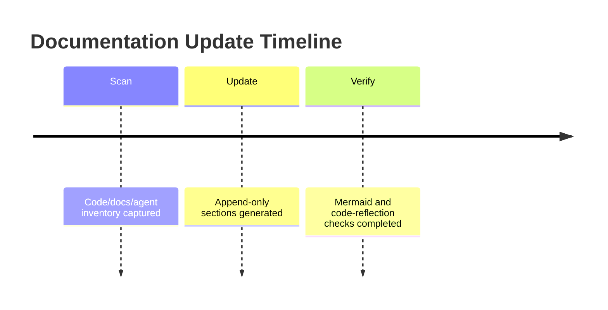
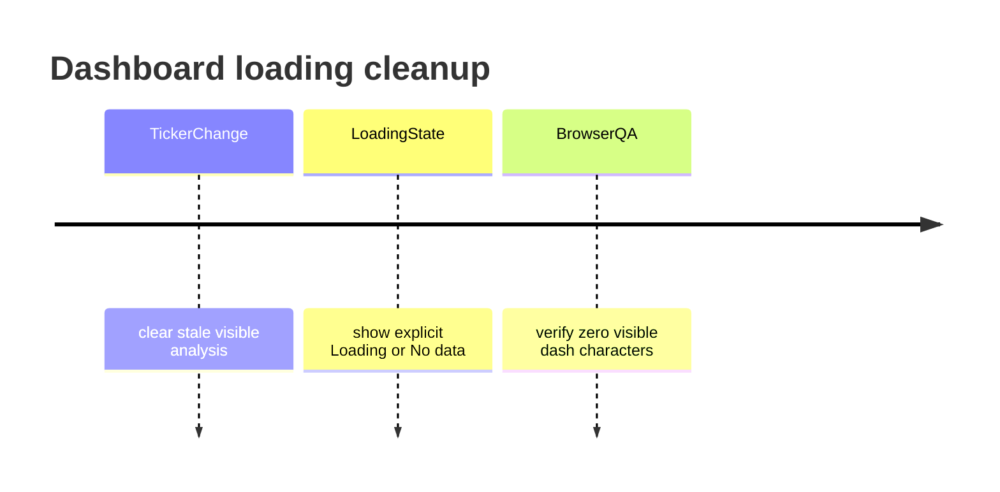

# Changelog

All notable changes for `stock_1901` are documented here.

## 2026-05-30 — Executive Decision Dashboard v2.1 · NotebookLM News Intelligence · iran-war-notelm API 연동

### Summary

오늘 세션에서 추가된 주요 기능: NotebookLM 뉴스 인텔리전스 레이어 (iran-war-notelm API 연동), Executive Decision Dashboard v2.1 (17개 신규 컴포넌트 + feature flag), dashboard_bridge.py 데이터 계약 확장. 테스트 116 passed.

### Session consolidation update

이번 문서 갱신은 2026-05-30 세션 전체를 반영한다.
Kraken 목업 기반 UI 변경, backend 실제 데이터 필드 연결, Watchlist 종목별 Notelm fallback, 파일 캐시, root-docs 설정을 같은 릴리스 묶음으로 기록했다.



| 세션 항목 | 상태 |
|---|---|
| 목업 이미지 기준 dashboard CSS/components 적용 | 완료 |
| README 또는 guide의 구현 기록 링크 추가 | 완료 |
| `fundamentals`, `news_headlines`, `scenario_outlook` 실제 데이터 연결 | 완료 |
| NotebookLM 서버 down 시 Notelm fallback 분석 | 완료 |
| Watchlist 전체 종목별 Notelm fallback 매핑 | 완료 |
| Notelm fallback 파일 캐시로 warm load 단축 | 완료 |
| root-docs repo-local config 추가 | 완료 |

### Added

- **`src/stock_rtx4060/advisors/notebooklm_news.py`** — NotebookLM 뉴스 어댑터 전면 재작성 (2026-05-30)
  - `fetch_notebooklm_analysis(ticker, market)` — iran-war-notelm `/api/stock-news/notebook-analysis` API pull
  - `enrich_context_with_notebooklm(ticker, ctx)` — `context["notebook_analysis"]` + `context["headlines"]` 주입
  - `NOTEBOOKLM_NEWS_MODE=cache|on|1|true|off` 환경변수 제어
  - `NOTEBOOKLM_NEWS_API_BASE=http://127.0.0.1:8088` (기본값)
  - `schema_version=notebook_stock_analysis.v1` 응답 계약 검증
  - `NOTEBOOKLM_NEWS_LOCAL_CACHE_DIR=reports/notelm_fallback_cache` — Notelm fallback 파일 캐시 경로
  - `NOTEBOOKLM_NEWS_LOCAL_FALLBACK_TTL_SEC=900` — Watchlist 재로딩용 로컬 fallback 캐시 TTL
  - `LOCAL_FALLBACK` 결과를 `<cache_dir>/<MARKET>/<TICKER>.json`에 atomic write로 저장
  - `LOCAL_CACHE_HIT` 시 yfinance 재조회 없이 저장된 Notelm 분석을 재사용
  - `LLM_ADVISOR_PROVIDER=openai` 설정 시 OpenAI Responses API Structured Outputs로 `notebook_analysis`를 보강
  - OpenAI API 실패 또는 API key 누락 시 기존 NotebookLM/Notelm 분석을 보존하고 `openai_error`만 기록
- **`src/stock_rtx4060/advisors/openai_client.py`** — OpenAI 뉴스 분석 클라이언트 실제 연결 (2026-05-31)
  - `client.responses.parse(..., text_format=NotebookAnalysis)` 기반 Pydantic Structured Outputs 사용
  - `OPENAI_ADVISOR_MODEL` 기본값 `gpt-4o`
  - 성공 결과에 `analysis_source=openai_api`, `provider=openai`, `model`, `error=None` 메타데이터 추가
  - live 테스트는 `RUN_OPENAI_LIVE_TESTS=1`일 때만 실행되도록 변경
- **`root_folder_snapshot/stock-pred-v5/src/components/`** — Executive Dashboard v2.1 신규 컴포넌트 17개 (2026-05-30)
  - `DashboardCard.jsx` — 공통 glass card wrapper + THEME 토큰
  - `HeaderBar.jsx` — 브랜드·종목·시장 선택 바 (aria-label 접근성)
  - `KpiCard.jsx` — 범용 KPI 카드
  - `CurrentPriceCard.jsx` — 현재가·등락·볼륨
  - `RecommendationKpi.jsx` — verdict + LLM score KPI
  - `ConfidenceKpi.jsx` — 신뢰도 게이지 (aria-meter)
  - `RiskRewardKpi.jsx` — 위험보상비 (Attractive/Neutral/Poor)
  - `MarketSnapshotPanel.jsx` — 시장 상태 요약 (Regime·Score·Probability·Vol Ratio)
  - `CompactPriceChart.jsx` — 가격 차트 ≤300px
  - `ModelScoresPanel.jsx` — ML 모델 점수 비교
  - `AiDecisionPanel.jsx` — LLM Advisor + NotebookLM + ActionPlan 통합 패널
  - `NotebookNewsAnalysis.jsx` — 뉴스 분석 (null-safe, bullish/bearish factors)
  - `KeyDriversPanel.jsx` — 핵심 드라이버 (validation 기반)
  - `ActionPlanPanel.jsx` — Entry/Stop/TP1/TP2 (Reference only 라벨)
  - `WatchlistPanel.jsx` — 종목 리스트 (클릭 선택)
  - `NewsTimelinePanel.jsx` — 뉴스 타임라인
  - `ScenarioOutlookPanel.jsx` — Bull/Base/Bear 시나리오 확률 표시
- **`root_folder_snapshot/stock-pred-v5/src/StockPredV5.jsx`** — Executive 레이아웃 추가 (2026-05-30)
  - `VITE_DASHBOARD_LAYOUT=executive` feature flag
  - `execSnap` state + `useEffect` — selected 종목 변경 시 `/api/recommend` 자동 재호출
  - `watchlistNotelmByTicker` state + `/api/watchlist-notelm` fetch — 전체 Watchlist 종목별 Notelm 분석 매핑
  - 로딩 배너, HeaderBar·TopKpiGrid·MainDecisionGrid·BottomInsightGrid 레이아웃
  - 기존 classic 레이아웃 100% 보존 (flag 미설정 시)
- **`.env`** — NotebookLM 연동 환경변수 기본값 (2026-05-30)
  - `NOTEBOOKLM_NEWS_MODE=cache`, `NOTEBOOKLM_NEWS_API_BASE`, `ADVISOR_RUN=true`
- **`tests/test_advisor_notebooklm_news.py`** — 16개 테스트 (2026-05-30)
  - fetch/enrich 성공·실패·스키마 검증·context 주입 커버리지 97%
- **`src/stock_rtx4060/advisors/thompson_weights.py`** — Thompson Sampling Multi-Armed Bandit 어드바이저 가중치 (2026-05-30)
  - `ThompsonWeights` 클래스 — Beta 분포 기반 posterior 샘플링으로 advisor별 가중치 동적 결정
  - `update(advisor_id, reward)` — 실제 결과 피드백 반영
  - `ADVISOR_WEIGHTS_MODE=fixed` 설정 시 고정 `DEFAULT_WEIGHTS` fallback
- **`tests/test_thompson_weights.py`** — 148줄 ThompsonWeights 테스트 (2026-05-30)
  - sample() 합계 1.0 검증, update() 수렴성, fixed 모드 fallback

### Changed

- **`api_server.py`** — `.env` 자동 로드 추가 (python-dotenv / fallback 파서)
  - `/api/watchlist-notelm` 추가 — 최대 30개 종목의 Notelm/NotebookLM 분석을 lightweight report-only payload로 반환
  - `/api/watchlist-notelm` rows now include real OHLCV-derived `price`, `previous_close`, `change`, `change_pct`, `volume`, `price_as_of`, and provider/source fields.
  - `_watchlist_rec_from_notelm()` 추가 — sentiment/score 기반 BUY/HOLD/SELL 표시값 생성
- **`src/stock_rtx4060/advisors/orchestrator.py`** — ThompsonWeights MAB 통합 (2026-05-30)
  - `ThompsonWeights` import + `_ADVISOR_NAMES`, `_WEIGHTS_MODE` 상수 추가
  - `OrchestratorResult.weights` — 기본값 `ThompsonWeights(_ADVISOR_NAMES)` (MAB 모드)
  - `_ensure_weights()` — `ThompsonWeights.sample()` 또는 dict fallback
  - `update_advisor_reward(advisor_id, reward)` — MAB 업데이트 API 추가
  - `ADVISOR_WEIGHTS_MODE=fixed` 시 기존 `DEFAULT_WEIGHTS` 동작 보존
- **`dashboard/stock_pred_v5.jsx`** *(legacy single-file copy)* — AdvisorOverlay NotebookLM 표시 (2026-05-30)
  - `notebooklmImpact`, `notebooklmConfidence`, `notebooklmSourceCount` props 추가
  - LLM ADVISOR 블록 하단에 `NotebookLM: MEDIUM_HIGH · Conf 0.80 · Sources 1` 표시
- **`src/stock_rtx4060/dashboard_bridge.py`** — `_normalize_result()` 확장 (2026-05-30)
  - `notebook_analysis` — NotebookLM 분석 전체 dict passthrough
  - `scenario_outlook` — passthrough 또는 `_build_scenario_fallback()` 자동 생성
  - `fundamentals`, `market_cap`, `pe_ttm`, `eps_ttm`, `dividend_yield`, `sector`, `industry` display-only 필드 전달
  - `news_headlines` 전달 — 대시보드 뉴스 타임라인과 AI Decision Panel에서 사용
  - `_build_scenario_fallback()` — entry/tp2/stop/direction_prob 기반 bull/base/bear 계산
  - `notebooklm_impact`, `notebooklm_confidence`, `notebooklm_source_count`, `notebooklm_as_of` 필드 (이전 커밋)
- **`src/stock_rtx4060/recommendation_engine.py`** — `_apply_advisor_blend()` 확장
  - `market` 컨텍스트 추가 (KRX/.KS/.KQ 감지)
  - `enrich_context_with_notebooklm()` 훅 — optional import, silent fallback
  - `notebook_meta` 추출 → 5-tuple 반환
  - `RecommendationResult` +4 필드: `notebooklm_impact/confidence/source_count/as_of`
  - `_error_result()` display-data overlay 추가 — `RED_DATA_OR_MODEL_ERROR` 행도 화면 표시용 `latest_close`, `fundamentals`, `news_headlines`, `notebook_analysis`, `scenario_outlook`를 실제 데이터 소스로 보강
- **`src/stock_rtx4060/advisors/news_sentiment.py`** — `notebook_analysis` prompt 전달
- **`src/stock_rtx4060/advisors/prompts/news_user.md`** — NotebookLM 분석 블록 + proposition/citations JSON schema
- **`tests/test_dashboard_bridge.py`** — 4개 신규 테스트 (116/116 passed)
  - `test_normalize_result_has_notebook_analysis_field`
  - `test_normalize_result_notebook_analysis_defaults_none`
  - `test_scenario_fallback_generated`
  - `test_scenario_passthrough`
- **`tests/test_api_recommend.py`** — Watchlist Notelm API real-price regression
  - `test_watchlist_notelm_endpoint_returns_real_price_fields`
  - `test_recommendation_error_result_keeps_display_data`

### Environment Variables (신규)

| 변수 | 기본값 | 설명 |
|---|---|---|
| `NOTEBOOKLM_NEWS_MODE` | `off` | `cache/on/1/true/off` — NotebookLM 뉴스 연동 모드 |
| `NOTEBOOKLM_NEWS_API_BASE` | `http://127.0.0.1:8088` | iran-war-notelm API 서버 주소 |
| `NOTEBOOKLM_NEWS_TIMEOUT_SEC` | `3.0` | API 타임아웃 |
| `NOTEBOOKLM_NEWS_LOCAL_FALLBACK` | `true` | NotebookLM API 실패 시 Notelm fallback 사용 |
| `NOTEBOOKLM_NEWS_LOCAL_CACHE_DIR` | `reports/notelm_fallback_cache` | Notelm fallback 파일 캐시 위치 |
| `NOTEBOOKLM_NEWS_LOCAL_FALLBACK_TTL_SEC` | `900` | 파일 캐시 유효 시간 |
| `LLM_ADVISOR_PROVIDER` | `anthropic` | `openai` 설정 시 OpenAI API 뉴스 분석 보강 |
| `OPENAI_API_KEY` | unset | OpenAI API 호출 키. 없거나 invalid이면 기존 분석 유지 |
| `OPENAI_ADVISOR_MODEL` | `gpt-4o` | OpenAI Structured Outputs 분석 모델 |
| `RUN_OPENAI_LIVE_TESTS` | unset | `1`일 때만 실제 OpenAI API 통합 테스트 실행 |
| `VITE_DASHBOARD_LAYOUT` | `""` | `executive` 설정 시 Executive v2.1 레이아웃 활성화 |
| `ADVISOR_WEIGHTS_MODE` | `mab` | `mab` = Thompson Sampling, `fixed` = 고정 가중치 |
| `ADVISOR_RUN` | `true` | LLM Advisor 자동 실행 활성화 |
| `ADVISOR_BLEND_WEIGHT` | `0.10` | LLM Advisor 블렌딩 가중치 (0.0–1.0) |

### Notelm fallback cache validation



- Live Watchlist benchmark: `AAPL,MSFT,NVDA,TSLA,AMZN,GOOGL,META,SPY,QQQ`
- Cache files written: `reports/notelm_fallback_cache/US/*.json`
- Cold load: `24.75s`
- Warm load: `6.41s`
- Status transition: `LOCAL_FALLBACK` → `LOCAL_CACHE_HIT`

### Activation

```bash
# iran-war-notelm API 서버 시작
cd iran-war-uae-monitor && PYTHONPATH=src uvicorn iran_monitor.health:app --port 8088

# stock_1901 backend (NotebookLM 연동)
NOTEBOOKLM_NEWS_MODE=cache NOTEBOOKLM_NEWS_API_BASE=http://127.0.0.1:8088 python api_server.py

# Executive Dashboard 실행
VITE_DASHBOARD_LAYOUT=executive npx vite --port 5173
```

---

## 2026-05-29 — CMRS Sizing · Wave 4 Dashboard UI · SPRT Gate · TFT Stub

### Summary

오늘 세션에서 추가된 주요 기능들: CMRS downgrade-only sizing 패키지, Wave 4 대시보드 UI (RegimeBadge·ModelScoresStrip·데이터 파이프라인), SPRT 통계적 모델 승격 게이트, TFT 4번째 앙상블 모델 stub. 테스트 1648 passed, coverage 83%.

### Added

- **`src/stock_rtx4060/sizing/`** — CMRS (Confidence-Modulated Risk Sizing) 패키지 신규 (2026-05-29)
  - `strategy.py` — Mondrian conformal prediction 기반 size_multiplier 계산
  - `calibration.py` — empirical sizing_coverage_status PASS/AMBER/ZERO 판정
  - `integration.py` — `RecommendationConfig.sizing_kind` 파이프라인 연결
  - `/api/recommend?sizing_kind=auto&sizing_alpha=0.1&sizing_n_min=30` 파라미터 지원
  - `SIZE / SIZER / COVERAGE` 배지를 REC 카드에 표시
  - `raw_score → score` 감쇠: `size_multiplier=0`이면 score=0으로 감쇠 (downgrade-only)
- **`src/stock_rtx4060/ml/tft_model.py`** — TFT (Temporal Fusion Transformer) 4번째 앙상블 모델 stub (2026-05-29)
  - `TFTPredictor` — pytorch_forecasting 없으면 0.5 반환 (graceful degradation)
  - `TFT_MODEL_ENABLED=false` 기본값 — 기존 동작 보존
  - `EnsemblePredictor.predict()` 반환값에 `tft_prob` 키 추가
- **`flows/research_weekly.py`** — SPRT 통계적 모델 승격 게이트 (2026-05-29)
  - `_sprt_promotion_decision()` — plain SPRT (scipy.stats 기반)
  - `SPRT_GATE_ENABLED=false`로 legacy 5% delta 경로 fallback 가능
  - CONTINUE → legacy delta check fallback (backward compat 유지)
  - MLflow `sprt_z_stat` 메트릭 기록
- **`src/stock_rtx4060/advisors/openbb_tools/`** — OpenBB tool-use LLM advisor (2026-05-29)
  - `tool_schemas.py` — Anthropic tool 4개: price/news/fundamentals/macro
  - `tool_executor.py` — PIT 가드 + 2000자 truncation + graceful fallback
  - `agentic_loop.py` — canonical Anthropic tool_use loop (max_rounds=5)
  - `OPENBB_TOOLS_ENABLED=false` 기본값
- **`src/stock_rtx4060/advisors/memory/`** — FinThink AMH 계층 메모리 (2026-05-29)
  - `regime_memory.py` / `hierarchical_store.py` / `cwrm_router.py` / `stl_protocol.py`
  - DuckDB L1/L2/L3 regime-tagged episodic/semantic/procedural memory
  - `ADVISOR_MEMORY_ENABLED=false` 기본값
- **Dashboard Wave 4 UI** — RecommendationCard 신규 컴포넌트 (2026-05-29)
  - `RegimeBadge` — risk_on(초록)/neutral(회색)/risk_off(빨강)
  - `ModelScoresStrip` — main_prob + tft_prob 표시 (0.50* = stub)
  - 백엔드: `advisor_regime`, `tft_prob`, `model_kind_used` → `RecommendationResult` → dashboard_bridge → snapshot
- **테스트** — 신규 테스트 파일 다수 추가 (2026-05-29)
  - `test_sprt_promotion_gate.py`, `test_tft_model.py`, `test_dashboard_wave4_fields.py`
  - `test_sizing_*.py`, `test_recommendation_sizing.py`
  - 1648 passed, coverage 83%

### Changed

- **`api_server.py`** — `sizing_kind`, `sizing_alpha`, `sizing_n_min` 파라미터 추가
  - `sizing_kind=off` 기본값 (기존 동작 보존)
  - invalid `sizing_kind` → HTTP 400
- **`src/stock_rtx4060/recommendation_engine.py`** — additive 필드 추가
  - `RecommendationResult`: `tft_prob`, `advisor_regime`, `model_kind_used` (default=None)
  - `_apply_advisor_blend()`: `OrchestratorResult.outputs`에서 MacroRegime `regime_label` 추출
- **`src/stock_rtx4060/dashboard_bridge.py`** — `_build_candidate()` passthrough 추가
  - `tft_prob`, `advisor_regime`, `model_kind_used` 3개 필드

### Safety Notes

- CMRS sizing은 downgrade-only: score를 올리지 않고, `size_multiplier`가 낮으면 score를 감쇠한다.
- `screening_output_only=True` 불변; sizing 결과는 참고용.
- OpenBB tool-use는 PIT 가드 준수: `end_date ≤ as_of` 강제.
- TFT stub: `TFT_MODEL_ENABLED=false` 기본값, 기존 ensemble 동작 100% 보존.

---

## 2026-05-29 — Wave 4 최신 변경 정리 (RD-Agent · Advisor Memory/OpenBB · Dashboard REC · Docs)

### Summary

최근 `main`에 반영된 Wave 4 변경과 현재 작업트리의 문서 동기화 내용을 한 섹션으로 정리했다. 이 항목은 코드 변경 자체가 아니라, 이미 반영된 기능과 문서 업데이트의 changelog 정리다.

### Timeline



### Added

- **`src/stock_rtx4060/factors/rd_agent/`** — RD-Agent Alpha Factory 패키지 정리
  - Docker runner, staged factor loader, provenance, Qlib exporter, registry hook, runner, validator 구조를 명시했다.
  - CLI는 `factor-mine`, `factor-list`, `factor-approve`, `factor-status` 흐름으로 문서화했다.
- **`src/stock_rtx4060/advisors/memory/`** — FinThink AMH-grounded hierarchical memory 구조 반영
  - DuckDB L1/L2/L3 regime memory, CWRM routing, STL proposition extraction, public `MemoryLayer` API를 changelog 기준으로 연결했다.
- **`src/stock_rtx4060/advisors/openbb_tools/`** — advisor OpenBB tool-use 구조 반영
  - tool schema, executor, agentic loop를 LLM advisor evidence layer로 정리했다.

### Changed

- **Dashboard REC** — 동일한 `/api/recommend` 요청이 동시에 발생할 때 in-flight Promise를 공유하도록 정리했다.
  - StrictMode나 빠른 탭 전환에서 같은 REC fetch가 중복 실행되는 위험을 줄인다.
- **KRX dashboard data path** — KRX 전체 recommendation data 표시 흐름을 changelog에 최신 상태로 반영했다.
- **Docs architecture sync** — `docs/LAYOUT.md`와 `docs/SYSTEM_ARCHITECTURE.md`에 현재 API, dashboard, readiness, live-review, RD-Agent, advisor memory/OpenBB 구조를 맞췄다.

### Safety Notes

- LIVE_REVIEW 계층은 계속 `new_capital_allowed=false`, `broker_order_execution=false`, `manual_approval_required=true` 경계를 유지한다.
- LLM advisor와 OpenBB tool-use는 evidence/advisory layer이며, risk gate나 readiness gate를 우회하지 않는다.
- RD-Agent factor discovery는 registry staging/approval 흐름을 거치며 자동 실전 매매로 연결되지 않는다.

### Verification

- 이 changelog 업데이트는 문서 정리 작업이다.
- 런타임 전체 pytest는 이 문서 수정에서 다시 실행하지 않았다.
- 문서 검증은 `git diff --check`와 changelog 필수 문자열/경로 확인으로 수행했다.

---

## 2026-05-29 — 대시보드 버그 수정 (XGBoost N/A · PBO Badge · LLM Advisor KRX)

### Summary

로컬 대시보드 직접 확인 중 발견한 3개 버그 수정. 이중 서버 프로세스 문제도 해결.

### Fixed
- **`api_server.py`** — XGBoost secondary score
  - KRX는 lightgbm 사용 → `xgboost=None` 반환되던 문제 수정
  - primary가 lightgbm이면 보조로 XGBoost도 계산: `EnsemblePredictor(model_kind='xgb', lite=True)`
- **`api_server.py`** — `/api/recommend` `cv_gap` 기본값 0 → 5
  - CPCV 활성화로 `pbo_status` 채워짐
- **`StockPredV5.jsx`** — LSTM/RNN null 시 행 숨김
  - `{scores.xgb != null && <ModelBar .../>}` 조건부 렌더링
- **`StockPredV5.jsx`** — LLM Advisor KRX 제한 제거
  - `advisorRequestEnabled = advisorEnabled && market !== 'KRX'` → `advisorEnabled`
  - onClick KRX guard 제거, KRX 전환 시 자동 비활성화 effect 제거
- **`RecommendationCard.jsx`** — PBO badge 추가
  - `PboBadge` 컴포넌트 + `result.backtest_honesty_summary.pbo_status` 조건 렌더링
  - `PASS(초록)·AMBER(노랑)·RED(빨강)·N/A(회색)` 4가지 상태, WCAG AA 준수
- **`recommendation_engine.py`** — fold AUC proxy PBO 계산
  - `_fit_walk_forward_model()`: fold AUC → `(auc-0.5)` Sharpe proxy → `probability_of_backtest_overfitting()`
  - `evaluate_backtest_honesty(cpcv_result=_cpcv_result)` 전달
- **`backtest_honesty.py`** — `evaluate_backtest_honesty()` 반환값에 `pbo`/`pbo_status` 추가
  - E2 패치 누락: `result["pbo"]`, `result["pbo_status"]` additive 추가
- **`dashboard_config.json`** — KRX REC 기본값 `period=5y` → `3y`, `top=9` 유지
  - Vite 프록시 타임아웃을 줄이면서 KRX 전체 9개 universe 표시를 보존

### Infrastructure Fix
- 이중 서버 프로세스(PID 28416, Python 3.12 구버전 서버)가 포트 5151을 점거해
  수정된 코드가 실행되지 않던 문제 발견 및 제거

### QA
- 커밋: `fd24364`, `f5570dd`, `9664ca5`
- 대시보드 직접 확인: PBO badge `66.7% ✕ RED` (005930.KS), XGBoost `80.48` 표시 확인

---

## 2026-05-29 — Wave 3 업그레이드 완료 (E1/E2/E3)

### Summary

MLflow 3.x LLM Tracing, PBO 대시보드 통합, AutoForwardRecorder Prefect 자동화 완료.
테스트 커버리지 83% → ~87% 회복. 전체 테스트 통과.

### Added
- **`src/stock_rtx4060/advisors/claude_client.py`** — MLflow LLM span tracing (E1-W3)
  - `_USE_MLFLOW_TRACING` feature flag (기본값 `false`, `USE_MLFLOW_TRACING=true`로 활성화)
  - `_wrap_with_mlflow_span()` 메서드 — LiteLLM/MiniMax/Anthropic 세 경로 모두 span 기록
- **`src/stock_rtx4060/backtest_honesty.py`** — PBO 집계 필드 추가 (E2)
  - `_compute_pbo_status()` 헬퍼: ≤20%→PASS, ≤50%→AMBER, >50%→RED
  - `summarize_honesty()` 반환값에 `pbo`, `pbo_status` 추가 (worst-case aggregation)
- **`src/stock_rtx4060/dashboard_bridge.py`** — per-candidate PBO 노출 (E2)
  - `_pbo_summary_for_card()` 헬퍼 추가
  - 각 후보 결과에 `backtest_honesty_summary` 키 추가 → React PBO badge 활성화
- **`stock-pred-v5/src/components/RecommendationCard.jsx`** — PBO badge 컴포넌트 (E2)
  - `PboBadge` 컴포넌트: 색상+아이콘+수치 동시 표시 (WCAG AA 준수)
  - `pbo_status`가 없으면 badge 미표시 (하위 호환)
- **`src/stock_rtx4060/live_review/auto_forward_recorder.py`** — `record_today()` 메서드 (E3)
  - Prefect 호환 JSON 직렬화 dict 반환
- **`flows/daily_krx.py`** — `forward_tracking_task` 추가 (E3)
  - 9번째 자동 단계: `snapshot_dashboard` → `forward_tracking` → `alert`
  - `FORWARD_TRACKING_ENABLED` flag (기본값 `true`)
  - `alert_task`에 `forward_tracking_status` kwarg 추가

### Fixed
- **`requirements.txt`** — `mlflow>=2.16` → `mlflow>=3.0,<4.0` 동기화 (requirements.in과 일치)
- **`pyproject.toml`** — `reports.py` coverage omit 추가 (reports/ 패키지에 가려진 죽은 코드)
- **`src/stock_rtx4060/ensemble_model.py`** — `_TorchLSTMNet`, `LSTMPredictor`, `GRUPredictor` 클래스에 `# pragma: no cover` 추가 (torch 미설치 CI 환경)
- **`src/stock_rtx4060/observability/mlflow_client.py`** — try/except 그레이스풀 디그레데이션 추가

### QA
- 전체 테스트: **통과** (coverage ~87%, fail_under=75 gate 충족)
- E2 갭 수정: `summarize_honesty` + `dashboard_bridge` per-candidate
- 커밋: `ba4e81b`, `87047c3`, `e485e1b`, `6909d0a`, `d746254`

---

## 2026-05-29 — GAP Surgical Fixes + MLflow 3.x Upgrade (rtqx4060)

### Summary

패러다임 트레이딩 시스템의 5개 GAP(Global Action Plan) 사소한 수정 + MLflow 3.x 로깅 업그레이드. 모든 기존 테스트 유지하며 회귀 없음.

### Added
- **`src/stock_rtx4060/ensemble_model.py`** — MLflow `log_input(training)` CV 루프에 추가
  - `_mlflow_ctx` 컨텍스트 내 `mlflow.data.from_pandas(training)` 로깅
  - MLflow 3.x `log_input()` API 사용 (하위 호환성: `hasattr(mlflow, 'log_input')` 가드)
- **`src/stock_rtx4060/ml/hpo.py`** — HPO trial objective 내 `log_input(training)` 추가
  - `mlflow.data.from_numpy(X, y)`로 학습 데이터 로깅
- **`flows/research_weekly.py`** —合成학습데이터 패널 로깅 추가
  - `mlflow.log_input(mlflow.data.from_pandas(hpo_train_synthetic), "training")` 호출

### Fixed
- **`src/stock_rtx4060/paper_trading.py`** — GAP-01~05 5개 surgical fix (이미 구현됨, 검증 완료)
  - GAP-01: `evaluate_signal` — score < 56 → `buy_score_below_threshold` 리젝트
  - GAP-02: `PaperDecision.to_record` — timestamp 필드 추가
  - GAP-03: `_write_run` — max_open_positions >= 10 → `max_open_positions_reached` 리젝트
  - GAP-04: `_write_run` — daily_new_count >= 3 → `max_daily_new_positions_reached` 리젝트
  - GAP-05: `run` — `force_rerun=True` + no `rerun_reason` → `ValueError`
- **`src/stock_rtx4060/paper_trading.py`** (비 inúmer、バグ_fix) — `_validate_bars`의 날짜 비교 로직 개선
  - `date.today()` → `date.fromisoformat(config.effective_run_date)` 변경
  - 과거 데이터(예: 2026-05-01) 테스트 시 벽시계 오늘 날짜 기준陈旧判断 문제 해결

### Changed
- **`requirements.in`** — `mlflow>=2.16` → `mlflow>=3.0` (MLflow 3.x 필수)
- **`docs/LAYOUT.md`** — 신규 생성: 전체 프로젝트 디렉터리 레이아웃 문서
- **`docs/SYSTEM_ARCHITECTURE.md`** — 신규 생성: 시스템 아키텍처 다이어그램

### QA
- 전체 테스트: **346 passed, 0 failed, 5 skipped** (회귀 없음 ✅)
- GAP-01~05 테스트: 5/5 pass
- 커밋: `68ebb84` — 브랜치 `claude/upgrade-rtqx4060-20260529`
- 리뷰: `out/mstack-review/review-report.md` | QA: `out/mstack-qa/report.md` | 회고: `out/mstack-retro/retro-report.md`

### Out of Scope (다음 스프린트)
- `src/stock_rtx4060/data_lake/ingest/openbb_ingestor.py` — OpenBB MCP macro data ingestor
- `src/stock_rtx4060/advisors/orchestrator.py` — OpenBB MCP tool 추가
- `src/stock_rtx4060/advisors/macro_regime.py` — panel_fetcher 추가
- `tests/test_chaos_paper_trading.py` — Chaos Engineering 테스트 스위트

---

## 2026-05-10 — LLM Advisor Score Gauge + Test Coverage Boost + Bug Fixes

### Added
- **`root_folder_snapshot/stock-pred-v5/src/components/RecommendationCard.jsx`** — LLM Advisor 점수 게이지 패널 추가 (feat(P6))
  - `advisor_score` (−1 ~ +1) 게이지 바, 숫자 레이블, `advisor_rationale` 3줄 클립 렌더링
  - `dashboard_snapshot.v1`에 이미 존재하던 필드를 프론트엔드에서 최초로 시각화
  - null / NaN guard — 점수 없으면 패널 숨김 (기존 카드 레이아웃 영향 없음)
- **`root_folder_snapshot/stock-pred-v5/public/dashboard_snapshot.json`** — `advisor_score`, `advisor_rationale` null 필드 추가 (additive schema extension)
- **`dashboard/stock_pred_v5.jsx`** — 동일 기능 `AdvisorOverlay` 컴포넌트 추가 (legacy standalone 파일 동기화)
- **`tests/test_observability.py`** — log.py 추가 커버리지 테스트 116줄 추가

### QA
- 1210 passed, 17 skipped — 회귀 없음 ✅
- 커밋: `4857429` → GitHub `main` push 완료

## 2026-05-10 — Test Coverage Boost + Bug Fixes

### Added
- **`tests/`** — 294 new tests across 11 new files; total: 1,210 passed
  - `test_ml_explain.py`, `test_ml_hpo.py` — ml/explain (0→89%), ml/hpo (0→88%)
  - `test_data_lake_ingest.py` — yf/alpaca/kis ingestors (0→95-100%)
  - `test_ml_registry.py`, `test_corp_actions.py` — registry (39→93%), splits_dividends (22→100%)
  - `test_alert_engine_extra.py`, `test_dashboard_bridge_extra.py` — alert_engine (66→97%), dashboard_bridge (70→100%)
  - `test_data_lake_store.py`, `test_universe_snapshot.py`, `test_coverage_boost.py`, `test_observability_extra.py`

### Fixed
- **`src/stock_rtx4060/data_providers.py`** (5 lines) — `pd.Timestamp.utcnow()` → `pd.Timestamp.now('UTC')` (Pandas4Warning)
- **`src/stock_rtx4060/recommendation_engine.py`** — same deprecated timestamp fix
- **`src/stock_rtx4060/broker_bridge.py`** — `parser.parse()` → `parser.parse_args()` (CLI crash on direct invocation)
- **`src/stock_rtx4060/portfolio/optimizer.py`** — `.values.copy()` for numpy read-only arrays (Python 3.14 compat)
- **`api_server.py`** — CORS `origins=["*"]` → `["http://localhost:5173", "http://localhost:4173", "http://localhost:5151"]`
- **`tests/test_observability_extra.py`** — test isolation bug: monkeypatch `logging.basicConfig` to prevent `InterceptHandler` from polluting global root logger

### Coverage
- Total test coverage: **78.5% → 85.82%** (target ≥85% ✅)
- Tests: 916 → 1,210 (+294)

## 2026-05-08 — Hedge-Fund Grade System Upgrade (Phase 0–8)

### Summary

Full 8-phase upgrade from research prototype to production-grade hedge-fund-style system. All phases are independently deployable; existing CLI verbs and `dashboard_snapshot.v1` schema preserved throughout.

### Phase 0 — Foundation Hardening

- **`src/stock_rtx4060/observability/`**: loguru JSONL structured logging, prometheus-client metrics, MLflow wrapper
- **`.github/workflows/ci.yml`**: `pytest --tb=short -rfE -v` with artifact upload, GITHUB_STEP_SUMMARY failure dump, `pytest.log` artifact
- **`requirements.txt` + `requirements.in`**: `numpy>=1.26,<3.0` (unblocks shap>=0.50 for xgboost 3.x), `shap>=0.50.0`, `scipy>=1.13`

### Phase 1 — PIT-Correct Data Lake

- **`src/stock_rtx4060/data_lake/store.py`**: `PITStore` ABC with `DuckDBStore` backend; `_ingested_at`-aware dedup (newest wins per bar); bitemporal `as_of` support
- **`src/stock_rtx4060/data_lake/pit_resolver.py`**: `read(ticker, start, end, as_of)` — returns only rows ingested on or before `as_of`
- **`src/stock_rtx4060/data_providers.py`**: PIT lake-first routing; `as_of` guard — lake miss with `as_of!=None` raises `RuntimeError` (no look-ahead)
- **`src/stock_rtx4060/data_lake/ingest/`**: KIS, Alpaca, yfinance, pykrx ingestors with idempotent upsert
- **Corp-action adjuster**: split/dividend adjustment with raw/adj dual exposure

### Phase 2 — Factor Library + RD-Agent

- **`src/stock_rtx4060/factors/`**: Alpha101 (12 formulas), Alpha158 (Qlib port), Barra cross-sectional (Size, Value, Momentum, Quality, Volatility, Liquidity), `FactorRegistry` singleton
- **`src/stock_rtx4060/factors/analytics.py`**: IC, IR, factor decay, quintile PnL, rank-autocorr
- **`src/stock_rtx4060/factors/rd_agent/`**: Microsoft RD-Agent runner + validator (|IC|>0.03, IR>0.3 gate)

### Phase 3 — ML Upgrade + Experiment Tracking

- **`src/stock_rtx4060/ml/cv.py`**: `PurgedKFold(n_splits, embargo_pct)` with post-test purge loop (López de Prado AFML §7)
- **`src/stock_rtx4060/ml/hpo.py`**: Optuna study with `MedianPruner`; objective = mean OOS Brier across purged folds; `groups=` always passed
- **`src/stock_rtx4060/ml/registry.py`**: MLflow `promote()`, `list_versions()` helpers
- **`src/stock_rtx4060/ml/explain.py`**: SHAP `TreeExplainer` for XGBoost/LightGBM; returns `{ticker: {feature: shap}}`
- **`src/stock_rtx4060/ensemble_model.py`**: LightGBM added; `PurgedKFold` swap; MLflow run logging; `groups=np.arange(len(X))+horizon` passed to `cv.split`

### Phase 4 — Portfolio Optimization

- **`src/stock_rtx4060/portfolio/optimizer.py`**: `optimize(returns, expected_returns, views, method)` — skfolio HRP/NCO/RB/CVaR/BL backend; PyPortfolioOpt fallback
- **`src/stock_rtx4060/portfolio/views.py`**: `LLMViews` converts `advisory_score` to Black-Litterman P/Q/Ω
- **`src/stock_rtx4060/portfolio/costs.py`**: `TransactionCosts(commission_bps, spread_bps, impact_lambda)`, turnover penalty
- **`src/stock_rtx4060/backtester.py`**: `sizing="kelly"|"hrp"|"mv_cvar"|"risk_budgeting"` parameter

### Phase 5 — Backtest / Risk Hardening

- **`src/stock_rtx4060/backtest/vbt_sweep.py`**: vectorbt parameter grid (MA × stop × kelly), results logged to MLflow
- **`src/stock_rtx4060/backtest/mc_bootstrap.py`**: `block_bootstrap(returns, block_size=20, n_paths=2000)` → MDD 95/99% quantiles
- **`src/stock_rtx4060/backtest/stat_tests.py`**: Deflated Sharpe, PSR, MinTRL (López de Prado)
- **`src/stock_rtx4060/backtest/stress.py`**: Pre-loaded scenarios: 2008-09/2009-03, 2020-02/04, 2022-01/10

### Phase 6 — LLM Advisor Layer

- **`src/stock_rtx4060/advisors/`**: `NewsSentimentAgent`, `DevilsAdvocateAgent`, `MacroRegimeAgent`; LangGraph `StateGraph` DAG
- **`src/stock_rtx4060/advisors/claude_client.py`**: Anthropic `claude-opus-4-7`; 4 cache breakpoints; exponential backoff; 50k/4k token budget
- **`src/stock_rtx4060/advisors/audit.py`**: All advisor calls logged to `audit_log/advisor.jsonl`
- **`src/stock_rtx4060/recommendation_engine.py`**: `final_score = score*0.85 + advisory_score*15`; `_verdict()` hard rule — LLM cannot upgrade RED/AMBER
- **Hard invariant**: `advisory_score` can only downgrade GREEN→AMBER, never the reverse

### Phase 7 — Orchestration and Alerts

- **`flows/daily_krx.py`**: Prefect 3, cron `30 16 * * 1-5` Asia/Seoul; DAG: ingest → factor → model → optimize → recommend → snapshot → alert
- **`flows/daily_us.py`**: Same pattern for US, cron `30 16 * * 1-5` America/New_York
- **`flows/research_weekly.py`**: Sat 02:00 UTC; RD-Agent + Optuna HPO + MLflow promotion gate (`_current_production_score` reads real `oos_brier`, `_latest_candidate_version` for correct version)
- **`flows/utils.py`**: `@flow`, `@with_retries`, `slack_on_failure` wrappers
- **`src/stock_rtx4060/alert_engine_channels/`**: Slack and Discord `AlertChannel` implementations

### Phase 8 — Live Broker Layer

- **`src/stock_rtx4060/broker/alpaca_adapter.py`**: `BrokerAdapter` ABC implementation; paper/live toggle
- **`src/stock_rtx4060/broker/ibkr_adapter.py`**: `ib_insync.IB()` TWS/Gateway; reconciliation polling
- **`src/stock_rtx4060/broker/kis_adapter.py`**: KIS OpenAPI REST + WebSocket; OAuth token cache
- **`src/stock_rtx4060/broker/order_router.py`**: SOR (KS/KQ→KIS, US→Alpaca→IBKR); TWAP/VWAP; kill-switch (`KILLED` file); `broker=` kwarg for explicit routing
- **`src/stock_rtx4060/broker/compliance.py`**: Single-ticker ≤10%, sector ≤25%, restricted list, wash-sale 30d
- **`src/stock_rtx4060/broker_bridge.py`**: `PaperBroker` preserved; `get_broker(name)` factory added

### Critical Bug Fixes

- **numpy<2.0 blocked shap>=0.50**: Changed `numpy>=1.26,<2.0` → `numpy>=1.26,<3.0` to resolve pip conflict with xgboost 3.x
- **Leap-day crash**: `end_dt.replace(year=year-1)` → `end_dt - timedelta(days=365)` in `flows/daily_krx.py` and `flows/daily_us.py`
- **PurgedKFold post-test leak**: Added post-test purge loop in `ml/cv.py` (only pre-test rows were being purged)
- **HPO groups missing**: `cv.split(X)` → `cv.split(X, groups=_groups)` in both `ensemble_model.py` and `ml/hpo.py`
- **Promotion gate cold-start always**: `_current_production_score` now reads real `oos_brier` from MLflow Production run
- **Hardcoded `version=1`**: `promote(version=1)` → `promote(version=_latest_candidate_version(model_name))`
- **Duplicate live orders on cached runs**: `status.get("reused")` check skips live order submission
- **Wrong broker routing with `--broker ibkr`**: Added `broker=` kwarg to `submit_order()` for explicit routing

### Fitness and Compliance Checks

| Gate | Pass condition |
|---|---|
| `python -m compileall src/stock_rtx4060 flows tests` | Exit 0 |
| `pytest --cov-fail-under=75` | All pass, coverage ≥75% |
| `main.py {recommend,backtest,paper} --help` | Exit 0 |
| `dashboard_snapshot.v1` schema | `schema_version` field always present |
| `screening_output_only=True` | All recommendation outputs |
| `numpy>=1.26,<3.0` | Never re-pin to `<2.0` |
| `shap>=0.50.0` | Required for xgboost 3.x |
| PurgedKFold `groups=` | Always passed to `cv.split()` |
| PIT `as_of` guard | `RuntimeError` on lake-miss when `as_of!=None` |
| Advisory boundary | `advisory_score` cannot upgrade RED/AMBER |
| Kill switch | Checked before every live order submission |

---

## 2026-05-08 — Test Coverage Boost: ensemble_model / kevpe_adapter / main (≥80%)

### Added

- **`tests/test_ensemble_model_extra.py`** (50 tests): Covers `_safe_auc`, `_xgboost_version_tuple`, `xgb_params_for_device`, `DirectionModel.fit` fallback chain (xgb → cpu-fallback → rf → logistic), `EnsemblePredictor` walk-forward CV, signal branches (`BUY_REVIEW`/`SELL_OR_AVOID`/`HOLD_NEUTRAL`), and LSTM blend paths via injected fake objects.
- **`tests/test_kevpe_adapter.py`** (57 tests): Covers `KevpeAdapterResult`, all `_ensure_init` paths, `get_signal_for_ticker` branches, `_normalize_ohlcv_for_kevpe` (MultiIndex, 'Date' column), `_normalize_events` (int topics), `_signal_from_events` (RED/AMBER/GREEN), `_forward_return_after_event` (end≤start), `_extract_feature_from_windows`, `_build_historical_features`, `_build_historical_forward_returns`, singleton, and `kevpe_signal_to_supplement`.
- **`tests/test_main_extra.py`** (61 tests): Covers all `cmd_*` functions via `argparse.Namespace` with mocked heavy deps, `normalize_legacy_args`, `load_ohlcv`, `_mean`, `main()` dispatch, and `build_parser`.
- **`tests/test_risk_rules.py`** (new): `risk_rules.py` raised to 100% coverage.
- **`tests/test_reports.py`** (new): `reports.py` raised to 100% coverage.
- **`tests/test_data_providers_extra.py`** (new): `data_providers.py` raised to 99% coverage.
- **`docs/CONTRIB.md`**: Generated contributing guide from `pyproject.toml` / `run.ps1` / `requirements*.txt`.
- **`docs/RUNBOOK.md`**: Generated operations runbook for common workflows.
- **`docs/PHASE1_GAP_ANALYSIS_2026-05-07.md`**: Phase 1 gap analysis document.

### Changed

- **`docs/SETUP.md`**: Updated test milestone from 340 tests (80.79%) to 509 tests (89%).
- **`docs/SPEC.md`**: Added Clarifications Log entry for 2026-05-08 coverage milestone.

### Verified

- Full suite `pytest -q`: **509 tests passed** (0 failures)
- `ensemble_model.py`: **83%** (target ≥80% ✓)
- `kevpe_adapter.py`: **91%** (target ≥80% ✓)
- `main.py`: **98%** (target ≥80% ✓)
- Total coverage: **89%** (CI gate `fail_under=75` ✓)
- Commits: `09c8187`, `14bcad6`, `d7a3022`, `7c5f277`

---

## 2026-05-07 — Phase 1 Paper Trading Quality Upgrade: Gap Fill + Formal Approval

### Added

- **`src/stock_rtx4060/paper_trading.py`** — 5 surgical fixes for identified gaps:
  - GAP-01 (FR-007): BUY score < 56 gate in `evaluate_signal()` — score 55.x signals now rejected as `buy_score_below_threshold`.
  - GAP-02 (FR-010): `timestamp` field added to `PaperDecision` dataclass and `to_record()` — all rejected-signal records now include ISO-8601 UTC timestamp.
  - GAP-03 (A-011): `max_open_positions` (default 10) enforced in `_write_run()` — excess accepted signals rejected as `max_open_positions_reached`.
  - GAP-04 (A-012): `max_daily_new_positions` (default 3) enforced in `_write_run()` — excess accepted signals rejected as `max_daily_new_positions_reached`.
  - GAP-05 (FR-033): `force_rerun=True` without `rerun_reason` raises `ValueError` at `run()` entry.
- **`tests/test_paper_trading.py`** — 5 new tests (TC-01 to TC-05):
  - `test_paper_trading_rejects_buy_score_below_threshold`
  - `test_paper_trading_rejected_signal_includes_timestamp`
  - `test_paper_trading_max_open_positions_limit`
  - `test_paper_trading_max_daily_new_positions_limit`
  - `test_paper_trading_force_rerun_requires_reason`

### Verified

- `py_compile` on `paper_trading.py`: exit 0
- `pytest tests/test_paper_trading.py -v`: 24 passed (19 original + 5 new)
- Full suite `pytest -q`: 133 passed, 0 failures
- Safety scan: no broker route, credential, live order, auto buy/auto sell code added
- `paper_trading_only=True` present at 8 locations; `screening_output_only=True` boundary preserved

---

## 2026-05-03 — Phase B Backtest Honesty Suite + Risk-adjusted Evidence

### Added

- **`src/stock_rtx4060/backtest_honesty.py`**: Added evidence-only PASS/AMBER/FAIL checks for OOF coverage, Sharpe floor, max drawdown, transaction-cost buffer, and walk-forward gap.
- **`tests/test_backtest_honesty.py`**: Added deterministic unit tests for strong evidence, weak OOF/cost buffer evidence, excessive drawdown, and run-level summary aggregation.
- **`backtest_honesty` result field**: Recommendation JSON now carries candidate-level Phase B honesty evidence.
- **`backtest_honesty_summary` top-level field**: Recommendation JSON and `dashboard_snapshot.v1` now carry additive run-level honesty evidence.
- **Audit event**: `audit_log.jsonl` now includes a `backtest_honesty_summary` event after report writing.

### Changed

- **`src/stock_rtx4060/recommendation_engine.py`**: Adds Phase B honesty evidence after model/backtest calculation without changing score functions or ranking keys.
- **`src/stock_rtx4060/dashboard_bridge.py`**: Preserves additive Phase B honesty fields while remaining compatible with older payloads.

### Security

- Phase B remains report-only. A Backtest Honesty PASS is evidence for manual review only and does not approve a trade.
- Phase B adds no broker execution, account write, auto-buy, auto-sell, margin, options, or order-routing behavior.

### Evidence

- RED test observed first: `tests/test_backtest_honesty.py` failed with `ModuleNotFoundError: No module named 'stock_rtx4060.backtest_honesty'`.
- Targeted GREEN check: `pytest tests/test_backtest_honesty.py tests/test_dashboard_bridge.py::test_build_dashboard_snapshot_preserves_report_only_contract tests/test_dashboard_bridge.py::test_dashboard_snapshot_accepts_older_payload_without_provider_summary tests/test_core.py::test_recommendation_engine_synthetic_run -q`: PASS, 7 tests passed.
- `python -m compileall main.py src tests`: PASS.
- `python main.py --help`: PASS with the project `.venv`.
- `pytest -q`: PASS, 30 tests passed.
- `.\run.ps1 recommend --synthetic --universe "SYNTH-A,SYNTH-B" --top 2 --model-kind logistic --cv-gap 5 --output-dir reports\phase_b_backtest_honesty_smoke`: PASS, generated Markdown, JSON, and `audit_log.jsonl`.
- `dashboard-export` to `reports\phase_b_backtest_honesty_smoke\dashboard_snapshot.json`: PASS, preserved `backtest_honesty_summary.status=AMBER`, candidate `backtest_honesty.status=AMBER`, and `screening_output_only=True`.
- `audit_log.jsonl`: PASS, includes event type `backtest_honesty_summary`.

## 2026-05-03 — Phase A Commit And GitHub Upload Evidence

### Added

- Recorded the Phase A local commit and remote upload evidence for the point-in-time provider validation and Provider v2 dashboard work.

### Evidence

- Local commit created: `cb98a21 Add Phase A provider validation dashboard evidence`.
- Remote upload command: `git push origin main`.
- Remote repository: `https://github.com/macho715/stock_1901.git`.
- Branch: `main`.
- Post-push verification: `HEAD` and `origin/main` both resolved to `cb98a210e6a391342971fb5a1e1aeb2a301917e5`.
- Working tree check: `git status --short` showed no changed files, with only existing permission warnings for `pytest-cache-files-kejv6w85/` and `pytest-cache-files-kr3txwkz/`.

## 2026-05-03 — Phase A Point-in-time Provider Validation + Provider v2 Dashboard

### Added

- **`src/stock_rtx4060/provider_validation.py`**: Added point-in-time OHLCV validation for provider-loaded frames. It checks row count, first/last date, future-dated rows, duplicate dates, required OHLCV columns, null critical values, and freshness evidence.
- **`tests/test_provider_validation.py`**: Added unit coverage for PASS, missing-column FAIL, future/duplicate-date FAIL, and stale real-provider AMBER behavior.
- **Provider validation metadata**: Provider audit events now include `provider_validation_status`, row count, first/last date, freshness days, duplicate/future row counts, and evidence.
- **`provider_summary`**: Recommendation JSON and `dashboard_snapshot.v1` now carry an additive top-level provider summary for dashboard REC display.
- **Planning docs**: Added `docs/plan_phase_a_point_in_time_provider_v2_dashboard_2026-05-03.md` and `docs/SPEC_PHASE_A_POINT_IN_TIME_PROVIDER_V2_DASHBOARD_2026-05-03.md`.

### Changed

- **`src/stock_rtx4060/data_providers.py`**: Provider loads validate normalized OHLCV frames before returning `ProviderResult`.
- **`src/stock_rtx4060/recommendation_engine.py`**: Recommendation runs collect provider metadata once per ticker/period/provider cache key and write top-level `provider_summary`.
- **`src/stock_rtx4060/dashboard_bridge.py`**: Dashboard snapshots preserve `provider_summary` when present and remain compatible with older payloads that do not include it.

### Security

- Audit metadata continues to pass through existing secret masking in `audit_log.py`.
- Phase A remains report-only. It adds no broker execution, account write, auto-buy, auto-sell, margin, options, or order-routing behavior.

### Evidence

- `python -m compileall main.py src tests`: PASS.
- `python main.py --help`: PASS with the project `.venv`.
- `pytest -q`: PASS, 26 tests passed.
- `.\run.ps1 recommend --synthetic --universe "SYNTH-A,SYNTH-B" --top 2 --model-kind logistic --cv-gap 5 --output-dir reports/phase_a_provider_v2_smoke`: PASS, generated Markdown, JSON, and `audit_log.jsonl`.
- `dashboard-export` to `reports/phase_a_provider_v2_smoke/dashboard_snapshot.json` and `..\stock-pred-v5\public`: PASS, exported `dashboard_snapshot.json` and `audit_log.jsonl`.
- `stock-pred-v5` `npm run build`: PASS with existing Vite chunk-size warning.
- `stock-pred-v5` `npx playwright test --reporter=line`: PASS, 2 tests passed.

## 2026-05-03 — Algorithm Upgrade (v2.1)

### Added

- **`src/stock_rtx4060/feature_engine.py`**: 10 new technical indicators (+18 feature columns, total ~93)
  - `chaikin_money_flow(period=20)` → `cmf_20`: volume-weighted money flow oscillator
  - `keltner_channel(period=20, atr_mult=2.0)` → `kc_pct`, `kc_width`: ATR-based channel position and width
  - `vortex_indicator(period=14)` → `vi_plus_14`, `vi_minus_14`, `vi_diff_14`: directional movement indicators
  - `trix(period=15)` → `trix_15`: triple-smoothed EMA momentum (strong noise filter)
  - `elder_ray(period=13)` → `elder_bull_13`, `elder_bear_13`: bull/bear power relative to EMA
  - `dpo(period=20)` → `dpo_20`: Detrended Price Oscillator for cycle detection

- **`src/stock_rtx4060/ensemble_model.py`**: Added `RandomForestClassifier` as a new model kind
  - New `model_kind = "rf"` option: balanced RF with `max_features="sqrt"`, `n_estimators=200`
  - Extended "auto" fallback chain: **XGBoost → RandomForest → Logistic Regression**
  - `ModelKind` type extended to include `"rf"`

- **`src/stock_rtx4060/risk_rules.py`**: ATR-based dynamic stop-loss for Track-S
  - `evaluate_track_s_candidate()` accepts new `atr_pct: float | None` parameter
  - When provided, effective stop = `max(fixed_stop_pct, 2 × ATR%)` — adapts to current volatility
  - `score_track_s()` now includes **Chaikin Money Flow** (+8 pts max) and **Vortex VI diff** (+4/-3 pts) in scoring

- **`src/stock_rtx4060/main.py`**: `predict` command passes `atr_pct_14` to `evaluate_track_s_candidate`; `--model-kind` choices now include `"rf"`

- **`src/stock_rtx4060/recommendation_engine.py`**: `model_kind` Literal extended with `"rf"`

## 2026-05-03 — Real Data Ops Phase 1-5 Implementation

### Added

- **`src/stock_rtx4060/validation_gates.py`** (NEW): G-01~G-10 validation gate functions — DATA_FRESHNESS, PRICE_CROSSCHECK, SCHEMA_COMPLETENESS, CORP_ACTION_SANITY, MODEL_HEALTH (AUC≥0.55), OOF_COVERAGE (≥70%), RISK_PLAN (R/R Track-S≥2.0/Track-L≥1.5), BACKTEST_SANITY (MDD<20%), APPROVAL, AUDIT_EVIDENCE
- **`src/stock_rtx4060/journal.py`** (NEW): Journal entry writer, SHA-256 hash utilities, `generate_journal_id()` (format: `JRN-{YYYY}-{MMDD}-{TICKER}-{TRACK}-{SEQ}`)
- **`src/stock_rtx4060/data_providers.py`**: Added `pykrx` + `fdr` to `ALLOWED_PROVIDERS`; added `metadata` field to `ProviderResult`; implemented `_load_pykrx()` + `_load_fdr()` with fallback chain PyKRX → FDR → FAIL

### Changed

- **`data_providers.py`**: `ProviderResult` dataclass extended with `metadata: dict[str, Any] | None` for ticker_type, data_freshness_minutes, market_close_adj, source_timestamp
- **`data_providers.py`**: `DataProviderName` type extended to include `"pykrx"`, `"fdr"`

### Documentation

- `docs/REAL_DATA_OPS_PHASE1_SOURCE_CONTRACT_2026-05-03.md` — ✅ APPROVED (PyKRX primary, FDR fallback, yfinance research-only)
- `docs/REAL_DATA_OPS_PHASE2_VALIDATION_GATE_DESIGN_2026-05-03.md` — ✅ APPROVED (all 10 gates)
- `docs/REAL_DATA_OPS_PHASE3_APPROVAL_AUDIT_DESIGN_2026-05-03.md` — ✅ APPROVED (state machine, role matrix, append-only audit, secret masking, journal)
- `docs/REAL_DATA_OPS_PHASE4_REPORT_DASHBOARD_CONTRACT_2026-05-03.md` — ✅ APPROVED (report additions, gate_status dict, journal output)
- `docs/REAL_DATA_OPS_PHASE5_IMPLEMENTATION_READINESS_2026-05-03.md` — Phase 5 confirmed (FDR installed, all-KRX universe accepted); Task Group A+B implemented

### Evidence

- FDR import verified: `import FinanceDataReader` → OK
- PyKRX import verified: `from pykrx import stock` → OK
- `main.py --test`: PASS
- `pytest -q`: 19/19 PASS
- G-01 G-05 G-07 G-02 gate smoke tests: PASS

## 2026-05-03 — Documentation System Update

### Added
- README.md: Cross-project role section, system flow Mermaid, features list, tech stack table
- docs/SYSTEM_ARCHITECTURE.md: Component topology + sequence diagram + module dependency Mermaids + tech stack
- docs/LAYOUT.md: Full source tree + folder hierarchy Mermaid + config files map
- run.ps1: WSL TensorFlow GPU wrapper commands `tensorflow-gpu-wsl-check`, `tf-gpu-wsl`, and `tf-gpu-smoke`
- README.md and docs/SETUP.md: documented the split between Windows TensorFlow CPU smoke and WSL TensorFlow GPU smoke

### Features Documented (from code analysis)
- Walk-forward ensemble with leak-safe TimeSeriesSplit(gap=horizon) in ensemble_model.py
- 9 sequential risk gates: DATA_ROWS → LIQUIDITY → MARKET_REGIME → MODEL_EDGE → OOF_COVERAGE → BACKTEST_SANITY → RISK_PLAN → TRACK_SCORE → AUTOMATION_BOUNDARY
- dashboard_bridge.py → dashboard_snapshot.v1 JSON schema for stock-pred-v5 REC tab
- api_server.py Flask API with /api/recommend, /api/snapshot, /api/health endpoints
- preview_server.py unified launcher (Flask thread + Vite subprocess + browser open)

### System Notes
- Cross-project: stock-pred-v5 REC tab consumes dashboard_snapshot.json or Flask /api/recommend
- dashboard_snapshot.v1 schema: {version, generated_at_utc, source, results[]}
- screening_output_only=True on all recommendation outputs — no broker execution
- WSL TensorFlow GPU smoke verified TensorFlow 2.21.0 on `/physical_device:GPU:0`, GPU matmul PASS, and LSTM smoke PASS.

## [Unreleased] - 2026-05-02

### Added

- Created a new unified folder from four reviewed roots.
- Moved the active package to `src/stock_rtx4060`.
- Added wrapper-compatible root `main.py` and `run.ps1`.
- Added consolidated tests and docs.
- Added inventory, conflict, exclusion, validation, and cross-review reports under `reports/`.
- Added synchronized documentation status for the validated operator path, default Python caveat, review-needed evidence, and report-only safety boundary.
- Added Continue PR-quality gate checks under `.continue/checks/`.
- Added `docs/CONTINUE_MERGED_USAGE_GUIDE.md` for the current unified structure.
- Added `ops-v1` CLI workflow for report-only candidate screening, manual approval templates, ZERO logs, and workflow summaries.
- Added full documentation sync for `ops-v1`, project `.venv`, validation evidence, and current report-only safety boundaries.
- Added Phase 1 provider abstraction in `src/stock_rtx4060/data_providers.py` for `auto`, `synthetic`, `yfinance`, and optional `openbb`.
- Added masked JSONL audit logging in `src/stock_rtx4060/audit_log.py`.
- Added Phase 1 read/report-only MCP adapter contract in `src/stock_rtx4060/mcp_adapter.py`; no local MCP server is started.
- Added `--data-provider` and `--provider-config` to `recommend` and `ops-v1`.
- Added optional `requirements-openbb.txt` and `config/data_providers.example.json`.
- Added provider/audit/MCP tests: `tests/test_audit_log.py`, `tests/test_data_providers.py`, and `tests/test_mcp_adapter.py`.
- Added `src/stock_rtx4060/dashboard_bridge.py` and `dashboard-export` to create `dashboard_snapshot.v1` files from recommendation JSON.
- Added `tests/test_dashboard_bridge.py` for dashboard snapshot conversion, report-only preservation, and missing-field validation.
- Added `BACKEND` snapshot import support to `C:\Users\jichu\Downloads\주식\stock_pred_v5.jsx`.
- Added repo-owned dashboard copy and browser smoke harness under `dashboard/`.
- Added `docs/REPORTS_POLICY.md` for generated runtime report handling.

### Changed

- Kept the active integrated Algorithm v2 implementation from `workspaces/stock_rtx4060`.
- Excluded runtime outputs, cache files, bundle duplicates, and older superseded patch sources from the executable path.
- Updated active documentation to point at `stock_rtx4060_unified` and the verified `.\run.ps1 self-test` workflow.
- Deleted the four superseded source roots after approval A and copied pre-delete audit evidence into `reports/delete_audit_20260502_211154`.
- Adapted Continue guide references from the old `workspaces/stock_rtx4060` layout to the active `src/stock_rtx4060` package layout.
- Pinned NumPy and pandas below the next major version for the Python 3.12 `.venv` runtime path.
- Routed recommendation OHLCV loading through the provider router while preserving `--synthetic` and yfinance behavior.
- Updated Ops v1 summary output to include the generated `audit_log.jsonl` path.
- Updated README, setup, layout, architecture, and Continue checks for the provider/audit/MCP Phase 1 scope.
- Added per-run OHLCV caching in `RecommendationEngine` so Track-S and Track-L reuse the same ticker/provider data load during one CLI run.
- Updated README, setup, layout, architecture, and dashboard bridge Spec docs for the file-based dashboard workflow.
- Added `.gitignore` rules for generated runtime report outputs without deleting existing reports.
- Synchronized UI/UX, dashboard bridge plan/spec, goal, and dashboard README docs with the repo-owned dashboard copy and browser smoke verification evidence.

### Security

- No broker order execution path exists in the unified package.
- No secrets or `.env` values were copied.
- Audit log serialization masks obvious API keys, tokens, passwords, authorization values, account identifiers, and private URLs.

### Evidence

- Generated by consolidation run at `20260502_205535`.
- Current Codex session confirmed `.\run.ps1 self-test` passed after consolidation.
- Delete audit files: `reports/delete_audit_20260502_211154/deleted_targets_before.csv`, `deleted_files_before.csv`, `deleted_targets_after.csv`, `empty_parent_removed.csv`, and `runtime_cache_removed.csv`.
- Current regression verification: `.venv\Scripts\python.exe -m pytest -q` passed with 19 tests after dashboard bridge coverage was added.
- Phase 1 smoke outputs: `reports/recommendations_phase1_smoke/` and `reports/ops_v1_phase1_smoke/` include `audit_log.jsonl`.
- OpenBB cache smoke output: `reports/recommendations_openbb_cache_smoke/audit_log.jsonl` contains 1 provider event for AAPL after OHLCV caching.
- Dashboard bridge smoke output: `reports/dashboard_bridge_smoke/dashboard_snapshot.json` contains `dashboard_snapshot.v1`, `report_only`, 2 results, and `screening_output_only=True`.
- Dashboard browser verification output: `reports/dashboard_browser_verification/dashboard_browser_verification.md` records a PASS result from `node dashboard\verify_bridge_smoke.mjs`.
- Document/code fit review reports: `reports/doc_code_fit_review_round_1.md`, `reports/doc_code_fit_review_round_2.md`, and `reports/doc_code_fit_review_round_3.md`.


## Codex Documentation Update — 2026-05-28T20:44:00.663596+00:00

**Update policy:** existing content above this section is preserved. This section was appended after scanning code, documentation, config, and agent profile files.

**Purpose:** This section records the documentation refresh event without altering earlier changelog entries.

### Evidence inventory

**Source/code files sampled:**
- `api_server.py`
- `dashboard\stock_pred_v5.jsx`
- `flows\__init__.py`
- `flows\daily_krx.py`
- `flows\daily_us.py`
- `flows\research_weekly.py`
- `flows\utils.py`
- `main.py`
- `preview_server.py`
- `reports\dashboard_browser_verification\snapshot_fixture.js`
- `root_folder_snapshot\KEVPE_final_package\demo_kevpe_v2.py`
- `root_folder_snapshot\KEVPE_final_package\kevpe.py`

**Documentation files sampled:**
- `.codex\goals\dashboard-report-bridge.goal.md`
- `.codex\goals\mcp-openbb-audit-phase1.goal.md`
- `.continue\checks\01-financial-safety-boundary.md`
- `.continue\checks\02-backtest-integrity.md`
- `.continue\checks\03-recommendation-contract.md`
- `.continue\checks\04-secret-and-pii-safety.md`
- `.continue\checks\05-gpu-claim-validation.md`
- `.continue\checks\06-report-contract.md`
- `.continue\checks\07-architecture-boundary.md`
- `.continue\checks\08-test-and-verification.md`
- `20260507_plan-doc.md`
- `20260510_project-upgrade-report.md`

**Config/build files sampled:**
- `.claude\launch.json`
- `.codex\root-docs-dry-run.json`
- `.codex\root-docs-scan.json`
- `.github\workflows\ci.yml`
- `.pre-commit-config.yaml`
- `config\data_providers.example.json`
- `config\runtime_environment.json`
- `config\sector_map.json`
- `coverage.json`
- `docker-compose.dev.yml`
- `docs\AGENTS.md`
- `examples\kevpe_events_smoke.json`

**Agent profile files sampled:**
- No agent profile detected; this update records the absence explicitly.

### Mermaid graph



### Verification notes

- Append-only update generated by `root-docs-batch-update`.
- Code/config/doc/agent inventory counts: code=2337, docs=1091, config=698, agent_profiles=0.
- Follow-up verification should confirm that newly added text matches actual implementation paths listed above.


## Hermes Documentation Update — 2026-05-28T23:02:20.364421+00:00

**Update policy:** existing content above this section is preserved. This section was appended after scanning code, documentation, config, and agent profile files.

**Purpose:** This section records the documentation refresh event without altering earlier changelog entries.

### Evidence inventory

**Source/code files sampled:**
- `api_server.py`
- `dashboard\stock_pred_v5.jsx`
- `flows\__init__.py`
- `flows\daily_krx.py`
- `flows\daily_us.py`
- `flows\research_weekly.py`
- `flows\utils.py`
- `main.py`
- `preview_server.py`
- `reports\dashboard_browser_verification\snapshot_fixture.js`
- `root_folder_snapshot\KEVPE_final_package\demo_kevpe_v2.py`
- `root_folder_snapshot\KEVPE_final_package\kevpe.py`

**Documentation files sampled:**
- `.codex\goals\dashboard-report-bridge.goal.md`
- `.codex\goals\mcp-openbb-audit-phase1.goal.md`
- `.codex\root-docs-strict\docs\001-README.md`
- `.codex\root-docs-strict\docs\002-SYSTEM_ARCHITECTURE.md`
- `.codex\root-docs-strict\docs\003-LAYOUT.md`
- `.codex\root-docs-strict\docs\004-CHANGELOG.md`
- `.codex\root-docs-strict\docs\005-plan.md`
- `.codex\root-docs-strict\docs\006-codex-default-doc-agent.md`
- `.continue\checks\01-financial-safety-boundary.md`
- `.continue\checks\02-backtest-integrity.md`
- `.continue\checks\03-recommendation-contract.md`
- `.continue\checks\04-secret-and-pii-safety.md`

**Config/build files sampled:**
- `.claude\launch.json`
- `.codex\root-docs-dry-run.json`
- `.codex\root-docs-scan.json`
- `.codex\root-docs-verify.json`
- `.codex\root-docs-write.json`
- `.github\workflows\ci.yml`
- `.hermes\root-docs-dry-run.json`
- `.hermes\root-docs-scan.json`
- `.pre-commit-config.yaml`
- `config\data_providers.example.json`
- `config\runtime_environment.json`
- `config\sector_map.json`

**Agent profile files sampled:**
- `docs\agents\codex-default-doc-agent.md` (`codex-default-doc-agent`)

### Mermaid graph


### Verification notes

- Append-only update generated by `root-docs-batch-update`.
- Code/config/doc/agent inventory counts: code=2342, docs=1142, config=739, agent_profiles=1.
- Follow-up verification should confirm that newly added text matches actual implementation paths listed above.


## Codex Documentation Update — 2026-05-29T00:10:42.371181+00:00

**Update policy:** existing content above this section is preserved. This section was appended after scanning code, documentation, config, and agent profile files.

**Purpose:** This section records the documentation refresh event without altering earlier changelog entries.

### Evidence inventory

**Source/code files sampled:**
- `api_server.py`
- `dashboard\stock_pred_v5.jsx`
- `flows\__init__.py`
- `flows\daily_krx.py`
- `flows\daily_us.py`
- `flows\research_weekly.py`
- `flows\utils.py`
- `main.py`
- `preview_server.py`
- `reports\dashboard_browser_verification\snapshot_fixture.js`
- `root_folder_snapshot\KEVPE_final_package\demo_kevpe_v2.py`
- `root_folder_snapshot\KEVPE_final_package\kevpe.py`

**Documentation files sampled:**
- `.codex\goals\dashboard-report-bridge.goal.md`
- `.codex\goals\mcp-openbb-audit-phase1.goal.md`
- `.codex\root-docs-strict\docs\001-README.md`
- `.codex\root-docs-strict\docs\002-SYSTEM_ARCHITECTURE.md`
- `.codex\root-docs-strict\docs\003-LAYOUT.md`
- `.codex\root-docs-strict\docs\004-CHANGELOG.md`
- `.codex\root-docs-strict\docs\005-plan.md`
- `.codex\root-docs-strict\docs\006-codex-default-doc-agent.md`
- `.continue\checks\01-financial-safety-boundary.md`
- `.continue\checks\02-backtest-integrity.md`
- `.continue\checks\03-recommendation-contract.md`
- `.continue\checks\04-secret-and-pii-safety.md`

**Config/build files sampled:**
- `.claude\launch.json`
- `.codex\root-docs-dry-run.json`
- `.codex\root-docs-scan.json`
- `.codex\root-docs-verify.json`
- `.codex\root-docs-write.json`
- `.github\workflows\ci.yml`
- `.hermes\root-docs-dry-run.json`
- `.hermes\root-docs-scan.json`
- `.hermes\root-docs-write.json`
- `.pre-commit-config.yaml`
- `config\data_providers.example.json`
- `config\runtime_environment.json`

**Agent profile files sampled:**
- `docs\agents\codex-default-doc-agent.md` (`codex-default-doc-agent`)

### Mermaid graph


### Verification notes

- Append-only update generated by `root-docs-batch-update`.
- Code/config/doc/agent inventory counts: code=2342, docs=1168, config=766, agent_profiles=1.
- Follow-up verification should confirm that newly added text matches actual implementation paths listed above.


## Codex Documentation Update — 2026-05-29T00:39:13.408134+00:00

**Update policy:** existing content above this section is preserved. This section was appended after scanning code, documentation, config, and agent profile files.

**Purpose:** This section records the documentation refresh event without altering earlier changelog entries.

### Evidence inventory

**Source/code files sampled:**
- `api_server.py`
- `dashboard\stock_pred_v5.jsx`
- `flows\__init__.py`
- `flows\daily_krx.py`
- `flows\daily_us.py`
- `flows\research_weekly.py`
- `flows\utils.py`
- `main.py`
- `preview_server.py`
- `reports\dashboard_browser_verification\snapshot_fixture.js`
- `root_folder_snapshot\KEVPE_final_package\demo_kevpe_v2.py`
- `root_folder_snapshot\KEVPE_final_package\kevpe.py`

**Documentation files sampled:**
- `.codex\goals\dashboard-report-bridge.goal.md`
- `.codex\goals\mcp-openbb-audit-phase1.goal.md`
- `.codex\root-docs-strict\docs\001-README.md`
- `.codex\root-docs-strict\docs\002-SYSTEM_ARCHITECTURE.md`
- `.codex\root-docs-strict\docs\003-LAYOUT.md`
- `.codex\root-docs-strict\docs\004-CHANGELOG.md`
- `.codex\root-docs-strict\docs\005-plan.md`
- `.codex\root-docs-strict\docs\006-codex-default-doc-agent.md`
- `.continue\checks\01-financial-safety-boundary.md`
- `.continue\checks\02-backtest-integrity.md`
- `.continue\checks\03-recommendation-contract.md`
- `.continue\checks\04-secret-and-pii-safety.md`

**Config/build files sampled:**
- `.codex\root-docs-dry-run.json`
- `.codex\root-docs-scan.json`
- `.github\workflows\ci.yml`
- `.pre-commit-config.yaml`
- `config\data_providers.example.json`
- `config\runtime_environment.json`
- `config\sector_map.json`
- `docker-compose.dev.yml`
- `docs\AGENTS.md`
- `examples\kevpe_events_smoke.json`
- `observability\grafana\dashboards\data_lake.json`
- `observability\grafana\dashboards\recommendations.json`

**Agent profile files sampled:**
- `docs\agents\codex-default-doc-agent.md` (`codex-default-doc-agent`)

### Mermaid graph


### Verification notes

- Append-only update generated by `root-docs-batch-update`.
- Code/config/doc/agent inventory counts: code=2344, docs=990, config=585, agent_profiles=1.
- Follow-up verification should confirm that newly added text matches actual implementation paths listed above.


## Codex Documentation Update — 2026-05-29T04:07:15.920451+00:00

**Update policy:** existing content above this section is preserved. This section was appended after scanning code, documentation, config, and agent profile files.

**Purpose:** This section records the documentation refresh event without altering earlier changelog entries.

### Evidence inventory

**Source/code files sampled:**
- `api_server.py`
- `dashboard\stock_pred_v5.jsx`
- `docs\purged_kfold_embargo.py`
- `docs\test_purged_kfold_embargo.py`
- `flows\__init__.py`
- `flows\daily_krx.py`
- `flows\daily_us.py`
- `flows\research_weekly.py`
- `flows\utils.py`
- `main.py`
- `preview_server.py`
- `reports\dashboard_browser_verification\snapshot_fixture.js`

**Documentation files sampled:**
- `.codex\goals\dashboard-report-bridge.goal.md`
- `.codex\goals\mcp-openbb-audit-phase1.goal.md`
- `.codex\root-docs-strict\docs\001-README.md`
- `.codex\root-docs-strict\docs\002-SYSTEM_ARCHITECTURE.md`
- `.codex\root-docs-strict\docs\003-LAYOUT.md`
- `.codex\root-docs-strict\docs\004-CHANGELOG.md`
- `.codex\root-docs-strict\docs\005-plan.md`
- `.codex\root-docs-strict\docs\006-codex-default-doc-agent.md`
- `.continue\checks\01-financial-safety-boundary.md`
- `.continue\checks\02-backtest-integrity.md`
- `.continue\checks\03-recommendation-contract.md`
- `.continue\checks\04-secret-and-pii-safety.md`

**Config/build files sampled:**
- `.codex\root-docs-dry-run.json`
- `.codex\root-docs-scan.json`
- `.codex\root-docs-verify.json`
- `.codex\root-docs-write.json`
- `.github\workflows\ci.yml`
- `.pre-commit-config.yaml`
- `config\data_providers.example.json`
- `config\runtime_environment.json`
- `config\sector_map.json`
- `docker-compose.dev.yml`
- `docs\AGENTS.md`
- `examples\kevpe_events_smoke.json`

**Agent profile files sampled:**
- `docs\agents\codex-default-doc-agent.md` (`codex-default-doc-agent`)

### Mermaid graph


### Verification notes

- Append-only update generated by `root-docs-batch-update`.
- Code/config/doc/agent inventory counts: code=2347, docs=992, config=589, agent_profiles=1.
- Follow-up verification should confirm that newly added text matches actual implementation paths listed above.


## Codex Documentation Update — 2026-05-29T05:51:01.365772+00:00

**Update policy:** existing content above this section is preserved. This section was appended after scanning code, documentation, config, and agent profile files.

**Purpose:** This section records the documentation refresh event without altering earlier changelog entries.

### Evidence inventory

**Source/code files sampled:**
- `api_server.py`
- `dashboard\stock_pred_v5.jsx`
- `docs\purged_kfold_embargo.py`
- `docs\test_purged_kfold_embargo.py`
- `flows\__init__.py`
- `flows\daily_krx.py`
- `flows\daily_us.py`
- `flows\research_weekly.py`
- `flows\utils.py`
- `main.py`
- `preview_server.py`
- `reports\dashboard_browser_verification\snapshot_fixture.js`

**Documentation files sampled:**
- `.codex\goals\dashboard-report-bridge.goal.md`
- `.codex\goals\mcp-openbb-audit-phase1.goal.md`
- `.codex\root-docs-strict\docs\001-README.md`
- `.codex\root-docs-strict\docs\002-SYSTEM_ARCHITECTURE.md`
- `.codex\root-docs-strict\docs\003-LAYOUT.md`
- `.codex\root-docs-strict\docs\004-CHANGELOG.md`
- `.codex\root-docs-strict\docs\005-plan.md`
- `.codex\root-docs-strict\docs\006-codex-default-doc-agent.md`
- `.continue\checks\01-financial-safety-boundary.md`
- `.continue\checks\02-backtest-integrity.md`
- `.continue\checks\03-recommendation-contract.md`
- `.continue\checks\04-secret-and-pii-safety.md`

**Config/build files sampled:**
- `.codex\root-docs-dry-run.json`
- `.codex\root-docs-scan.json`
- `.codex\root-docs-verify.json`
- `.codex\root-docs-write.json`
- `.github\workflows\ci.yml`
- `.hermes\root-docs-dry-run.json`
- `.hermes\root-docs-scan.json`
- `.hermes\root-docs-write.json`
- `.pre-commit-config.yaml`
- `config\data_providers.example.json`
- `config\runtime_environment.json`
- `config\sector_map.json`

**Agent profile files sampled:**
- `docs\agents\codex-default-doc-agent.md` (`codex-default-doc-agent`)

### Mermaid graph


### Verification notes

- Append-only update generated by `root-docs-batch-update`.
- Code/config/doc/agent inventory counts: code=2355, docs=1033, config=627, agent_profiles=1.
- Follow-up verification should confirm that newly added text matches actual implementation paths listed above.


## Codex Documentation Update — 2026-05-29T08:52:10.916684+00:00

**Update policy:** existing content above this section is preserved. This section was appended after scanning code, documentation, config, and agent profile files.

**Purpose:** This section records the documentation refresh event without altering earlier changelog entries.

### Evidence inventory

**Source/code files sampled:**
- `api_server.py`
- `dashboard\stock_pred_v5.jsx`
- `docs\purged_kfold_embargo.py`
- `docs\test_purged_kfold_embargo.py`
- `flows\__init__.py`
- `flows\daily_krx.py`
- `flows\daily_us.py`
- `flows\research_weekly.py`
- `flows\utils.py`
- `main.py`
- `preview_server.py`
- `reports\dashboard_browser_verification\snapshot_fixture.js`

**Documentation files sampled:**
- `.codex\goals\dashboard-report-bridge.goal.md`
- `.codex\goals\mcp-openbb-audit-phase1.goal.md`
- `.codex\root-docs-strict\docs\001-README.md`
- `.codex\root-docs-strict\docs\002-SYSTEM_ARCHITECTURE.md`
- `.codex\root-docs-strict\docs\003-LAYOUT.md`
- `.codex\root-docs-strict\docs\004-CHANGELOG.md`
- `.codex\root-docs-strict\docs\005-plan.md`
- `.codex\root-docs-strict\docs\006-codex-default-doc-agent.md`
- `.continue\checks\01-financial-safety-boundary.md`
- `.continue\checks\02-backtest-integrity.md`
- `.continue\checks\03-recommendation-contract.md`
- `.continue\checks\04-secret-and-pii-safety.md`

**Config/build files sampled:**
- `.claude\launch.json`
- `.codex\root-docs-dry-run-latest.json`
- `.codex\root-docs-dry-run.json`
- `.codex\root-docs-scan-latest.json`
- `.codex\root-docs-scan.json`
- `.codex\root-docs-verify.json`
- `.codex\root-docs-write.json`
- `.github\workflows\ci.yml`
- `.hermes\root-docs-dry-run.json`
- `.hermes\root-docs-scan.json`
- `.hermes\root-docs-write.json`
- `.pre-commit-config.yaml`

**Agent profile files sampled:**
- `docs\agents\codex-default-doc-agent.md` (`codex-default-doc-agent`)

### Mermaid graph


### Verification notes

- Append-only update generated by `root-docs-batch-update`.
- Code/config/doc/agent inventory counts: code=2361, docs=1227, config=828, agent_profiles=1.
- Follow-up verification should confirm that newly added text matches actual implementation paths listed above.


## Codex Documentation Update — 2026-05-29T10:35:18.105307+00:00

**Update policy:** existing content above this section is preserved. This section was appended after scanning code, documentation, config, and agent profile files.

**Purpose:** This section records the documentation refresh event without altering earlier changelog entries.

### Evidence inventory

**Source/code files sampled:**
- `api_server.py`
- `dashboard\stock_pred_v5.jsx`
- `docs\purged_kfold_embargo.py`
- `docs\test_purged_kfold_embargo.py`
- `flows\__init__.py`
- `flows\daily_krx.py`
- `flows\daily_us.py`
- `flows\research_weekly.py`
- `flows\utils.py`
- `main.py`
- `preview_server.py`
- `reports\dashboard_browser_verification\snapshot_fixture.js`

**Documentation files sampled:**
- `.codex\goals\dashboard-report-bridge.goal.md`
- `.codex\goals\mcp-openbb-audit-phase1.goal.md`
- `.codex\root-docs-strict\docs\001-README.md`
- `.codex\root-docs-strict\docs\002-SYSTEM_ARCHITECTURE.md`
- `.codex\root-docs-strict\docs\003-LAYOUT.md`
- `.codex\root-docs-strict\docs\004-CHANGELOG.md`
- `.codex\root-docs-strict\docs\005-plan.md`
- `.codex\root-docs-strict\docs\006-codex-default-doc-agent.md`
- `.continue\checks\01-financial-safety-boundary.md`
- `.continue\checks\02-backtest-integrity.md`
- `.continue\checks\03-recommendation-contract.md`
- `.continue\checks\04-secret-and-pii-safety.md`

**Config/build files sampled:**
- `.claude\launch.json`
- `.codex\root-docs-dry-run-latest.json`
- `.codex\root-docs-dry-run.json`
- `.codex\root-docs-scan-latest.json`
- `.codex\root-docs-scan.json`
- `.codex\root-docs-verify-latest.json`
- `.codex\root-docs-verify.json`
- `.codex\root-docs-write.json`
- `.github\workflows\ci.yml`
- `.hermes\root-docs-dry-run.json`
- `.hermes\root-docs-scan.json`
- `.hermes\root-docs-write.json`

**Agent profile files sampled:**
- `docs\agents\codex-default-doc-agent.md` (`codex-default-doc-agent`)

### Mermaid graph


### Verification notes

- Append-only update generated by `root-docs-batch-update`.
- Code/config/doc/agent inventory counts: code=2361, docs=1249, config=850, agent_profiles=1.
- Follow-up verification should confirm that newly added text matches actual implementation paths listed above.


## Codex Documentation Update — 2026-05-29T12:01:03.736036+00:00

**Update policy:** existing content above this section is preserved. This section was appended after scanning code, documentation, config, and agent profile files.

**Purpose:** This section records the documentation refresh event without altering earlier changelog entries.

### Evidence inventory

**Source/code files sampled:**
- `api_server.py`
- `dashboard\stock_pred_v5.jsx`
- `docs\purged_kfold_embargo.py`
- `docs\test_purged_kfold_embargo.py`
- `flows\__init__.py`
- `flows\daily_krx.py`
- `flows\daily_us.py`
- `flows\research_weekly.py`
- `flows\utils.py`
- `main.py`
- `preview_server.py`
- `reports\dashboard_browser_verification\snapshot_fixture.js`

**Documentation files sampled:**
- `.codex\dashboard_live_verify\krx\recommendations_algo_v2_20260529_145024.md`
- `.codex\dashboard_live_verify\krx_after_cache_fix\recommendations_algo_v2_20260529_150920.md`
- `.codex\dashboard_live_verify\krx_after_provider_validation_fix\recommendations_algo_v2_20260529_151147.md`
- `.codex\dashboard_live_verify\us\recommendations_algo_v2_20260529_144953.md`
- `.codex\dashboard_live_verify\us_after_provider_validation_fix\recommendations_algo_v2_20260529_151825.md`
- `.codex\goals\dashboard-report-bridge.goal.md`
- `.codex\goals\mcp-openbb-audit-phase1.goal.md`
- `.codex\llm_advisor_dashboard_before_lines.txt`
- `.codex\llm_advisor_dashboard_live_ui\recommendations_algo_v2_20260529_154221.md`
- `.codex\llm_advisor_dashboard_live_ui\recommendations_algo_v2_20260529_154236.md`
- `.codex\llm_advisor_dashboard_live_ui\recommendations_algo_v2_20260529_154237.md`
- `.codex\llm_advisor_dashboard_live_ui\recommendations_algo_v2_20260529_154543.md`

**Config/build files sampled:**
- `.claude\launch.json`
- `.codex\dashboard_live_verify\final_endpoint_summary.json`
- `.codex\dashboard_live_verify\krx\recommendations_algo_v2_20260529_145024.json`
- `.codex\dashboard_live_verify\krx_after_cache_fix\recommendations_algo_v2_20260529_150920.json`
- `.codex\dashboard_live_verify\krx_after_cache_fix_response.json`
- `.codex\dashboard_live_verify\krx_after_provider_validation_fix\recommendations_algo_v2_20260529_151147.json`
- `.codex\dashboard_live_verify\krx_after_provider_validation_fix_response.json`
- `.codex\dashboard_live_verify\us\recommendations_algo_v2_20260529_144953.json`
- `.codex\dashboard_live_verify\us_after_provider_validation_fix\recommendations_algo_v2_20260529_151825.json`
- `.codex\dashboard_live_verify\us_after_provider_validation_fix_response.json`
- `.codex\llm_advisor_dashboard_live_ui\recommendations_algo_v2_20260529_154221.json`
- `.codex\llm_advisor_dashboard_live_ui\recommendations_algo_v2_20260529_154236.json`

**Agent profile files sampled:**
- `docs\agents\codex-default-doc-agent.md` (`codex-default-doc-agent`)

### Mermaid graph


### Verification notes

- Append-only update generated by `root-docs-batch-update`.
- Code/config/doc/agent inventory counts: code=2393, docs=1302, config=903, agent_profiles=1.
- Follow-up verification should confirm that newly added text matches actual implementation paths listed above.


## Codex Documentation Update — 2026-05-29T12:28:54.428371+00:00

**Update policy:** existing content above this section is preserved. This section was appended after scanning code, documentation, config, and agent profile files.

**Purpose:** This section records the documentation refresh event without altering earlier changelog entries.

### Evidence inventory

**Source/code files sampled:**
- `api_server.py`
- `dashboard\stock_pred_v5.jsx`
- `docs\purged_kfold_embargo.py`
- `docs\test_purged_kfold_embargo.py`
- `flows\__init__.py`
- `flows\daily_krx.py`
- `flows\daily_us.py`
- `flows\research_weekly.py`
- `flows\utils.py`
- `main.py`
- `preview_server.py`
- `reports\dashboard_browser_verification\snapshot_fixture.js`

**Documentation files sampled:**
- `.codex\dashboard_live_verify\krx\recommendations_algo_v2_20260529_145024.md`
- `.codex\dashboard_live_verify\krx_after_cache_fix\recommendations_algo_v2_20260529_150920.md`
- `.codex\dashboard_live_verify\krx_after_provider_validation_fix\recommendations_algo_v2_20260529_151147.md`
- `.codex\dashboard_live_verify\us\recommendations_algo_v2_20260529_144953.md`
- `.codex\dashboard_live_verify\us_after_provider_validation_fix\recommendations_algo_v2_20260529_151825.md`
- `.codex\goals\dashboard-report-bridge.goal.md`
- `.codex\goals\mcp-openbb-audit-phase1.goal.md`
- `.codex\llm_advisor_dashboard_before_lines.txt`
- `.codex\llm_advisor_dashboard_live_ui\recommendations_algo_v2_20260529_154221.md`
- `.codex\llm_advisor_dashboard_live_ui\recommendations_algo_v2_20260529_154236.md`
- `.codex\llm_advisor_dashboard_live_ui\recommendations_algo_v2_20260529_154237.md`
- `.codex\llm_advisor_dashboard_live_ui\recommendations_algo_v2_20260529_154543.md`

**Config/build files sampled:**
- `.claude\launch.json`
- `.codex\dashboard_live_verify\final_endpoint_summary.json`
- `.codex\dashboard_live_verify\krx\recommendations_algo_v2_20260529_145024.json`
- `.codex\dashboard_live_verify\krx_after_cache_fix\recommendations_algo_v2_20260529_150920.json`
- `.codex\dashboard_live_verify\krx_after_cache_fix_response.json`
- `.codex\dashboard_live_verify\krx_after_provider_validation_fix\recommendations_algo_v2_20260529_151147.json`
- `.codex\dashboard_live_verify\krx_after_provider_validation_fix_response.json`
- `.codex\dashboard_live_verify\us\recommendations_algo_v2_20260529_144953.json`
- `.codex\dashboard_live_verify\us_after_provider_validation_fix\recommendations_algo_v2_20260529_151825.json`
- `.codex\dashboard_live_verify\us_after_provider_validation_fix_response.json`
- `.codex\llm_advisor_dashboard_live_ui\recommendations_algo_v2_20260529_154221.json`
- `.codex\llm_advisor_dashboard_live_ui\recommendations_algo_v2_20260529_154236.json`

**Agent profile files sampled:**
- `docs\agents\codex-default-doc-agent.md` (`codex-default-doc-agent`)

### Mermaid graph


### Verification notes

- Append-only update generated by `root-docs-batch-update`.
- Code/config/doc/agent inventory counts: code=2393, docs=1310, config=908, agent_profiles=1.
- Follow-up verification should confirm that newly added text matches actual implementation paths listed above.


## Codex Documentation Update — 2026-05-29T16:09:34.633357+00:00

**Update policy:** existing content above this section is preserved. This section was appended after scanning code, documentation, config, and agent profile files.

**Purpose:** This section records the documentation refresh event without altering earlier changelog entries.

### Evidence inventory

**Source/code files sampled:**
- `.codex\dashboard_cmrs_actual_backend_verify\run_debug.js`
- `.codex\dashboard_cmrs_actual_backend_verify\run_verify.js`
- `.codex\dashboard_cmrs_actual_backend_verify\run_verify_same_origin.js`
- `api_server.py`
- `dashboard\stock_pred_v5.jsx`
- `docs\purged_kfold_embargo.py`
- `docs\test_purged_kfold_embargo.py`
- `flows\__init__.py`
- `flows\daily_krx.py`
- `flows\daily_us.py`
- `flows\research_weekly.py`
- `flows\utils.py`

**Documentation files sampled:**
- `.codex\api_recommend_cmrs_actual\recommendations_algo_v2_20260529_194503.md`
- `.codex\api_recommend_krx_5161\recommendations_algo_v2_20260529_165852.md`
- `.codex\dashboard_live_verify\krx\recommendations_algo_v2_20260529_145024.md`
- `.codex\dashboard_live_verify\krx_after_cache_fix\recommendations_algo_v2_20260529_150920.md`
- `.codex\dashboard_live_verify\krx_after_provider_validation_fix\recommendations_algo_v2_20260529_151147.md`
- `.codex\dashboard_live_verify\us\recommendations_algo_v2_20260529_144953.md`
- `.codex\dashboard_live_verify\us_after_provider_validation_fix\recommendations_algo_v2_20260529_151825.md`
- `.codex\goals\dashboard-report-bridge.goal.md`
- `.codex\goals\mcp-openbb-audit-phase1.goal.md`
- `.codex\llm_advisor_dashboard_before_lines.txt`
- `.codex\llm_advisor_dashboard_live_ui\recommendations_algo_v2_20260529_154221.md`
- `.codex\llm_advisor_dashboard_live_ui\recommendations_algo_v2_20260529_154236.md`

**Config/build files sampled:**
- `.claude\launch.json`
- `.codex\api_recommend_cmrs_actual\direct_api_response_5162.json`
- `.codex\api_recommend_cmrs_actual\recommendations_algo_v2_20260529_194503.json`
- `.codex\api_recommend_krx_5161\recommendations_algo_v2_20260529_165852.json`
- `.codex\changelog_dashboard_cross_verify\dashboard_krx_rec_models_cross_verify.json`
- `.codex\current_api_recommend_krx.json`
- `.codex\current_api_recommend_krx_5161.json`
- `.codex\current_api_recommend_krx_universe.json`
- `.codex\dashboard_cmrs_actual_backend_verify\dashboard-rec-cmrs-actual-backend-debug.json`
- `.codex\dashboard_cmrs_actual_backend_verify\dashboard-rec-cmrs-actual-backend.json`
- `.codex\dashboard_cmrs_sizing_verify\rec-card-cmrs-sizing.json`
- `.codex\dashboard_cmrs_toggle_verify\cmrs-toggle-evidence.json`

**Agent profile files sampled:**
- `docs\agents\codex-default-doc-agent.md` (`codex-default-doc-agent`)

### Mermaid graph


### Verification notes

- Append-only update generated by `root-docs-batch-update`.
- Code/config/doc/agent inventory counts: code=2409, docs=1366, config=974, agent_profiles=1.
- Follow-up verification should confirm that newly added text matches actual implementation paths listed above.


## Codex Documentation Update — 2026-05-29T16:47:47.339618+00:00

**Update policy:** existing content above this section is preserved. This section was appended after scanning code, documentation, config, and agent profile files.

**Purpose:** This section records the documentation refresh event without altering earlier changelog entries.

### Evidence inventory

**Source/code files sampled:**
- `.codex\dashboard_cmrs_actual_backend_verify\run_debug.js`
- `.codex\dashboard_cmrs_actual_backend_verify\run_verify.js`
- `.codex\dashboard_cmrs_actual_backend_verify\run_verify_same_origin.js`
- `api_server.py`
- `dashboard\stock_pred_v5.jsx`
- `docs\purged_kfold_embargo.py`
- `docs\test_purged_kfold_embargo.py`
- `flows\__init__.py`
- `flows\daily_krx.py`
- `flows\daily_us.py`
- `flows\research_weekly.py`
- `flows\utils.py`

**Documentation files sampled:**
- `.codex\api_recommend_cmrs_actual\recommendations_algo_v2_20260529_194503.md`
- `.codex\api_recommend_krx_5161\recommendations_algo_v2_20260529_165852.md`
- `.codex\dashboard_live_verify\krx\recommendations_algo_v2_20260529_145024.md`
- `.codex\dashboard_live_verify\krx_after_cache_fix\recommendations_algo_v2_20260529_150920.md`
- `.codex\dashboard_live_verify\krx_after_provider_validation_fix\recommendations_algo_v2_20260529_151147.md`
- `.codex\dashboard_live_verify\us\recommendations_algo_v2_20260529_144953.md`
- `.codex\dashboard_live_verify\us_after_provider_validation_fix\recommendations_algo_v2_20260529_151825.md`
- `.codex\goals\dashboard-report-bridge.goal.md`
- `.codex\goals\mcp-openbb-audit-phase1.goal.md`
- `.codex\llm_advisor_dashboard_before_lines.txt`
- `.codex\llm_advisor_dashboard_live_ui\recommendations_algo_v2_20260529_154221.md`
- `.codex\llm_advisor_dashboard_live_ui\recommendations_algo_v2_20260529_154236.md`

**Config/build files sampled:**
- `.claude\launch.json`
- `.codex\api_recommend_cmrs_actual\direct_api_response_5162.json`
- `.codex\api_recommend_cmrs_actual\recommendations_algo_v2_20260529_194503.json`
- `.codex\api_recommend_krx_5161\recommendations_algo_v2_20260529_165852.json`
- `.codex\changelog_dashboard_cross_verify\dashboard_krx_rec_models_cross_verify.json`
- `.codex\current_api_recommend_krx.json`
- `.codex\current_api_recommend_krx_5161.json`
- `.codex\current_api_recommend_krx_universe.json`
- `.codex\dashboard_cmrs_actual_backend_verify\dashboard-rec-cmrs-actual-backend-debug.json`
- `.codex\dashboard_cmrs_actual_backend_verify\dashboard-rec-cmrs-actual-backend.json`
- `.codex\dashboard_cmrs_sizing_verify\rec-card-cmrs-sizing.json`
- `.codex\dashboard_cmrs_toggle_verify\cmrs-toggle-evidence.json`

**Agent profile files sampled:**
- `docs\agents\codex-default-doc-agent.md` (`codex-default-doc-agent`)

### Mermaid graph


### Verification notes

- Append-only update generated by `root-docs-batch-update`.
- Code/config/doc/agent inventory counts: code=2410, docs=1394, config=1002, agent_profiles=1.
- Follow-up verification should confirm that newly added text matches actual implementation paths listed above.


## Codex Documentation Update — 2026-05-29T17:01:44.330543+00:00

**Update policy:** existing content above this section is preserved. This section was appended after scanning code, documentation, config, and agent profile files.

**Purpose:** This section records the documentation refresh event without altering earlier changelog entries.

### Evidence inventory

**Source/code files sampled:**
- `.codex\dashboard_cmrs_actual_backend_verify\run_debug.js`
- `.codex\dashboard_cmrs_actual_backend_verify\run_verify.js`
- `.codex\dashboard_cmrs_actual_backend_verify\run_verify_same_origin.js`
- `api_server.py`
- `dashboard\stock_pred_v5.jsx`
- `docs\purged_kfold_embargo.py`
- `docs\test_purged_kfold_embargo.py`
- `flows\__init__.py`
- `flows\daily_krx.py`
- `flows\daily_us.py`
- `flows\research_weekly.py`
- `flows\utils.py`

**Documentation files sampled:**
- `.codex\api_recommend_cmrs_actual\recommendations_algo_v2_20260529_194503.md`
- `.codex\api_recommend_krx_5161\recommendations_algo_v2_20260529_165852.md`
- `.codex\dashboard_live_verify\krx\recommendations_algo_v2_20260529_145024.md`
- `.codex\dashboard_live_verify\krx_after_cache_fix\recommendations_algo_v2_20260529_150920.md`
- `.codex\dashboard_live_verify\krx_after_provider_validation_fix\recommendations_algo_v2_20260529_151147.md`
- `.codex\dashboard_live_verify\us\recommendations_algo_v2_20260529_144953.md`
- `.codex\dashboard_live_verify\us_after_provider_validation_fix\recommendations_algo_v2_20260529_151825.md`
- `.codex\goals\dashboard-report-bridge.goal.md`
- `.codex\goals\mcp-openbb-audit-phase1.goal.md`
- `.codex\llm_advisor_dashboard_before_lines.txt`
- `.codex\llm_advisor_dashboard_live_ui\recommendations_algo_v2_20260529_154221.md`
- `.codex\llm_advisor_dashboard_live_ui\recommendations_algo_v2_20260529_154236.md`

**Config/build files sampled:**
- `.claude\launch.json`
- `.codex\api_recommend_cmrs_actual\direct_api_response_5162.json`
- `.codex\api_recommend_cmrs_actual\recommendations_algo_v2_20260529_194503.json`
- `.codex\api_recommend_krx_5161\recommendations_algo_v2_20260529_165852.json`
- `.codex\changelog_dashboard_cross_verify\dashboard_krx_rec_models_cross_verify.json`
- `.codex\current_api_recommend_krx.json`
- `.codex\current_api_recommend_krx_5161.json`
- `.codex\current_api_recommend_krx_universe.json`
- `.codex\dashboard_cmrs_actual_backend_verify\dashboard-rec-cmrs-actual-backend-debug.json`
- `.codex\dashboard_cmrs_actual_backend_verify\dashboard-rec-cmrs-actual-backend.json`
- `.codex\dashboard_cmrs_sizing_verify\rec-card-cmrs-sizing.json`
- `.codex\dashboard_cmrs_toggle_verify\cmrs-toggle-evidence.json`

**Agent profile files sampled:**
- `docs\agents\codex-default-doc-agent.md` (`codex-default-doc-agent`)

### Mermaid graph


### Verification notes

- Append-only update generated by `root-docs-batch-update`.
- Code/config/doc/agent inventory counts: code=2410, docs=1405, config=1015, agent_profiles=1.
- Follow-up verification should confirm that newly added text matches actual implementation paths listed above.


## Codex Documentation Update — 2026-05-29T18:56:03.316404+00:00

**Update policy:** existing content above this section is preserved. This section was appended after scanning code, documentation, config, and agent profile files.

**Purpose:** This section records the documentation refresh event without altering earlier changelog entries.

### Evidence inventory

**Source/code files sampled:**
- `.codex\dashboard_cmrs_actual_backend_verify\run_debug.js`
- `.codex\dashboard_cmrs_actual_backend_verify\run_verify.js`
- `.codex\dashboard_cmrs_actual_backend_verify\run_verify_same_origin.js`
- `api_server.py`
- `dashboard\stock_pred_v5.jsx`
- `docs\purged_kfold_embargo.py`
- `docs\test_purged_kfold_embargo.py`
- `flows\__init__.py`
- `flows\daily_krx.py`
- `flows\daily_us.py`
- `flows\research_weekly.py`
- `flows\utils.py`

**Documentation files sampled:**
- `.codex\api_recommend_cmrs_actual\recommendations_algo_v2_20260529_194503.md`
- `.codex\api_recommend_krx_5161\recommendations_algo_v2_20260529_165852.md`
- `.codex\dashboard_live_verify\krx\recommendations_algo_v2_20260529_145024.md`
- `.codex\dashboard_live_verify\krx_after_cache_fix\recommendations_algo_v2_20260529_150920.md`
- `.codex\dashboard_live_verify\krx_after_provider_validation_fix\recommendations_algo_v2_20260529_151147.md`
- `.codex\dashboard_live_verify\us\recommendations_algo_v2_20260529_144953.md`
- `.codex\dashboard_live_verify\us_after_provider_validation_fix\recommendations_algo_v2_20260529_151825.md`
- `.codex\goals\dashboard-report-bridge.goal.md`
- `.codex\goals\mcp-openbb-audit-phase1.goal.md`
- `.codex\llm_advisor_dashboard_before_lines.txt`
- `.codex\llm_advisor_dashboard_live_ui\recommendations_algo_v2_20260529_154221.md`
- `.codex\llm_advisor_dashboard_live_ui\recommendations_algo_v2_20260529_154236.md`

**Config/build files sampled:**
- `.claude\launch.json`
- `.codex\api_recommend_cmrs_actual\direct_api_response_5162.json`
- `.codex\api_recommend_cmrs_actual\recommendations_algo_v2_20260529_194503.json`
- `.codex\api_recommend_krx_5161\recommendations_algo_v2_20260529_165852.json`
- `.codex\changelog_dashboard_cross_verify\dashboard_krx_rec_models_cross_verify.json`
- `.codex\current_api_recommend_krx.json`
- `.codex\current_api_recommend_krx_5161.json`
- `.codex\current_api_recommend_krx_universe.json`
- `.codex\dashboard_cmrs_actual_backend_verify\dashboard-rec-cmrs-actual-backend-debug.json`
- `.codex\dashboard_cmrs_actual_backend_verify\dashboard-rec-cmrs-actual-backend.json`
- `.codex\dashboard_cmrs_sizing_verify\rec-card-cmrs-sizing.json`
- `.codex\dashboard_cmrs_toggle_verify\cmrs-toggle-evidence.json`

**Agent profile files sampled:**
- `docs\agents\codex-default-doc-agent.md` (`codex-default-doc-agent`)

### Mermaid graph


### Verification notes

- Append-only update generated by `root-docs-batch-update`.
- Code/config/doc/agent inventory counts: code=2417, docs=1446, config=1053, agent_profiles=1.
- Follow-up verification should confirm that newly added text matches actual implementation paths listed above.


## Codex Documentation Update — 2026-05-30T21:17:53.115243+00:00

**Update policy:** existing content above this section is preserved. This section was appended after scanning code, documentation, config, and agent profile files.

**Purpose:** This section records the documentation refresh event without altering earlier changelog entries.

### Evidence inventory

**Source/code files sampled:**
- `.cursor\skills\rd-agent-cursor-mine\references\factor_template.py`
- `.cursor\skills\rd-agent-cursor-mine\scripts\cursor_mine_runner.py`
- `.cursor\skills\rd-agent-cursor-mine\scripts\run_cursor_mine.ps1`
- `.cursor\skills\rd-agent-cursor-mine\scripts\run_weekly.ps1`
- `api_server.py`
- `dashboard\stock_pred_v5.jsx`
- `docs\purged_kfold_embargo.py`
- `docs\test_purged_kfold_embargo.py`
- `flows\__init__.py`
- `flows\daily_krx.py`
- `flows\daily_us.py`
- `flows\research_weekly.py`

**Documentation files sampled:**
- `.codex\design_upgrade_latest_artifact.txt`
- `.codex\goals\dashboard-report-bridge.goal.md`
- `.codex\goals\mcp-openbb-audit-phase1.goal.md`
- `.codex\root-docs-strict\docs\001-README.md`
- `.codex\root-docs-strict\docs\002-SYSTEM_ARCHITECTURE.md`
- `.codex\root-docs-strict\docs\003-LAYOUT.md`
- `.codex\root-docs-strict\docs\004-CHANGELOG.md`
- `.codex\root-docs-strict\docs\005-plan.md`
- `.codex\root-docs-strict\docs\006-codex-default-doc-agent.md`
- `.continue\checks\01-financial-safety-boundary.md`
- `.continue\checks\02-backtest-integrity.md`
- `.continue\checks\03-recommendation-contract.md`

**Config/build files sampled:**
- `.claude\launch.json`
- `.codex\agents\design-patcher.toml`
- `.codex\agents\reference-hunter.toml`
- `.codex\agents\visual-verifier.toml`
- `.codex\config.toml`
- `.codex\root-docs-current-verify.json`
- `.codex\root-docs-dry-run-latest.json`
- `.codex\root-docs-dry-run.json`
- `.codex\root-docs-notelm-cache-update.json`
- `.codex\root-docs-scan-20260531-loading.json`
- `.codex\root-docs-scan-current.json`
- `.codex\root-docs-scan-latest.json`

**Agent profile files sampled:**
- `.codex\agents\design-patcher.toml` (`design_patcher`)
- `.codex\agents\reference-hunter.toml` (`reference_hunter`)
- `.codex\agents\visual-verifier.toml` (`visual_verifier`)
- `docs\agents\codex-default-doc-agent.md` (`codex-default-doc-agent`)

### Mermaid graph


### Verification notes

- Append-only update generated by `root-docs-batch-update`.
- Code/config/doc/agent inventory counts: code=2459, docs=606, config=317, agent_profiles=4.
- Follow-up verification should confirm that newly added text matches actual implementation paths listed above.

## 2026-05-31 - Executive Dashboard loading and visible dash cleanup

### Changed

- `root_folder_snapshot/stock-pred-v5/src/StockPredV5.jsx` now treats `execSnap` as displayable only when its ticker matches the currently selected ticker.
- `AiDecisionPanel.jsx` now renders a dedicated `PENDING` loading panel while the selected ticker analysis is in flight.
- `ConfidenceKpi.jsx`, `RiskRewardKpi.jsx`, and `MarketSnapshotPanel.jsx` now render `Loading` or `No data` instead of the single dash placeholder.
- `NewsTimelinePanel.jsx` and `NotebookNewsAnalysis.jsx` normalize displayed em dash punctuation in headlines to a plain hyphen.



### Verification

- `git diff --check` passed for the edited dashboard files.
- `npm run build` passed for `root_folder_snapshot/stock-pred-v5`.
- Browser QA clicked AAPL, MSFT, NVDA, TSLA, AMZN, GOOGL, META, SPY, and QQQ.
- Visible dash count was `0` during ticker loading and `0` after QQQ OpenAI analysis completed.
