# Component Layout

<!-- root-pinned: keep this file at C:\Users\jichu\Downloads\주식\COMPONENT_LAYOUT.md -->

이 문서는 주식 프로그램의 컴포넌트 배치를 설명합니다.

용어부터 정리합니다.

| 용어 | 일반적으로 맞는 사용처 | 이 프로젝트에서의 의미 |
|---|---|---|
| 컴포넌트 레이아웃 | 화면을 구성하는 UI 컴포넌트의 배치, 계층, 역할을 설명할 때 적합 | `stock-pred-v5` React 대시보드의 화면 구성 |
| 시스템 컴포넌트 구조 | 백엔드, 프론트엔드, API, 데이터 공급자, 저장소 같은 시스템 부품 관계를 설명할 때 적합 | `stock_rtx4060_unified`와 `stock-pred-v5`의 연결 구조 |
| 컴포넌트 아키텍처 | 컴포넌트 간 책임, 의존성, 데이터 흐름까지 설명할 때 적합 | 추천 엔진, Flask API, dashboard snapshot, REC 패널의 관계 |

결론: 사용자가 말한 “컴포넌트 레이아웃”은 UI 문서명으로는 맞습니다.  
다만 이 문서는 UI와 백엔드 연결까지 함께 다루므로, 정확한 제목은 **Component Layout** 또는 **Dashboard Component Layout**이 적합합니다.

## 1. One-page Summary

| 영역 | 실제 경로 | 핵심 역할 |
|---|---|---|
| Backend engine | `stock_rtx4060_unified/` | 추천 계산, 데이터 공급자 호출, risk gate, report, audit log, API 제공 |
| API server | `stock_rtx4060_unified/api_server.py` | `/api/symbol`, `/api/recommend`, `/api/snapshot`, `/api/health` 제공; `.env` 자동 로드 |
| Dashboard app (classic) | `stock-pred-v5/` | React/Vite 화면, US/KRX 시장 토글, 차트, 모델 점수, REC 추천 패널 |
| **Dashboard app (executive)** | `stock-pred-v5/` + `VITE_DASHBOARD_LAYOUT=executive` | **Executive Decision Dashboard v2.1 — HeaderBar/KPI/AiPanel/Watchlist/Scenario (Added 2026-05-30)** |
| Main dashboard component | `stock-pred-v5/src/StockPredV5.jsx` | 전체 화면 레이아웃; EXEC_LAYOUT flag; execSnap auto-fetch useEffect |
| Recommendation panel | `stock-pred-v5/src/components/RecommendationPanel.jsx` | FILE/API 추천 snapshot 로드, Audit/Approval/Provider 요약, 추천 카드 목록 |
| Recommendation card | `stock-pred-v5/src/components/RecommendationCard.jsx` | 개별 추천 후보 카드 렌더링; LLM Advisor 점수 게이지 포함 (Updated: 2026-05-10) |
| **AI Decision Panel** | `stock-pred-v5/src/components/AiDecisionPanel.jsx` | **LLM Advisor + NotebookLM 뉴스 + Action Plan 통합 패널 (Added 2026-05-30)** |
| **NotebookLM News** | `stock-pred-v5/src/components/NotebookNewsAnalysis.jsx` | **bullish/bearish factors + sentiment + sources (null-safe) (Added 2026-05-30)** |
| **Scenario Panel** | `stock-pred-v5/src/components/ScenarioOutlookPanel.jsx` | **Bull/Base/Bear 시나리오 확률 표시 (Added 2026-05-30)** |
| Risk badge | `stock-pred-v5/src/components/RiskGateBadge.jsx` | 추천 verdict 시각 표시 |
| KEVPE badge | `stock-pred-v5/src/components/KevpeBadge.jsx` | KEVPE 이벤트가 있을 때 regime/score 표시 |
| File bridge | `stock-pred-v5/public/dashboard_snapshot.json` | FILE 모드 REC 입력 |
| API bridge | `http://127.0.0.1:5151/api/recommend` | API 모드 REC 입력 |
| **NotebookLM API** | `http://127.0.0.1:8088/api/stock-news/notebook-analysis` | **iran-war-notelm stock_news API (Added 2026-05-30)** |
| **Thompson MAB** | `advisors/thompson_weights.py` | **Beta 분포 advisor 가중치 동적 결정 (Added 2026-05-30)** |

## 2. System Component Map

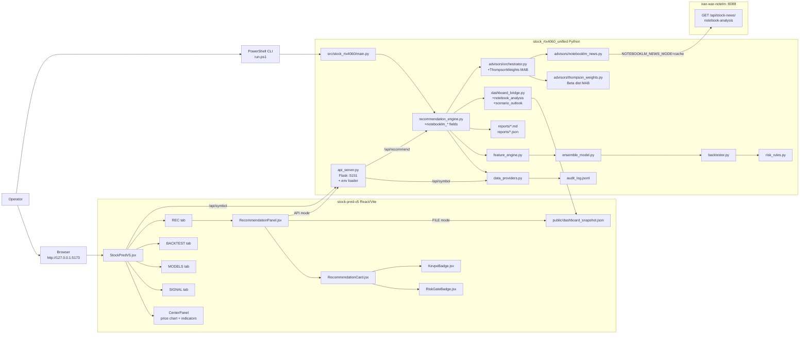

## 2-A. Executive Decision Dashboard v2.1 (Added: 2026-05-30)

`VITE_DASHBOARD_LAYOUT=executive` 환경변수 설정 시 활성화되는 새 레이아웃.
기존 classic 레이아웃은 flag 미설정 시 100% 보존.

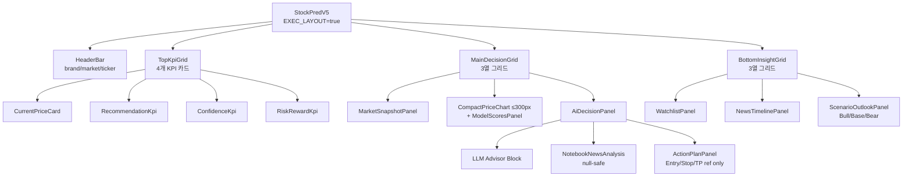

### 자동 데이터 fetch

종목 변경 시 `useEffect`가 `/api/recommend?universe={ticker}` 를 자동 호출해 `execSnap` state를 채움.
`execSnap`이 `AiDecisionPanel`, KPI 카드, `ScenarioOutlookPanel`에 전달됨.

### dashboard_snapshot.v1 신규 필드 (2026-05-30)

| 필드 | 타입 | 출처 |
|---|---|---|
| `notebook_analysis` | dict \| null | `RecommendationResult.notebook_analysis` passthrough |
| `scenario_outlook` | dict \| null | passthrough 또는 `_build_scenario_fallback()` 자동 생성 |
| `notebooklm_impact` | str \| null | `MEDIUM_HIGH` 등 NotebookLM market impact |
| `notebooklm_confidence` | float \| null | 0.0–1.0 |
| `notebooklm_source_count` | int \| null | 분석에 사용된 뉴스 수 |
| `notebooklm_as_of` | str \| null | ISO timestamp |

### 안전 경계 (변경 없음)

Executive 레이아웃도 동일 안전 경계 적용:
- 브로커 실행 버튼 없음
- ActionPlanPanel: "Reference only · Manual review required" 라벨
- ScenarioOutlookPanel: "Report-only · No broker execution" 라벨

---

## 3. Dashboard Screen Layout

`stock-pred-v5/src/StockPredV5.jsx`가 화면 전체의 기준 컴포넌트입니다.

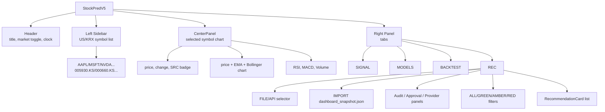

### Main layout responsibilities

| Component/function | File | Role |
|---|---|---|
| `StockPredV5` | `stock-pred-v5/src/StockPredV5.jsx` | Top-level state: market, selected ticker, cache, tab, REC source |
| `fetchSymbol(symbol)` | `StockPredV5.jsx` | Loads OHLCV from local `/api/symbol`; if real provider data fails, the dashboard shows an error instead of synthetic prices |
| `fetchModelEvidence(symbol)` | `StockPredV5.jsx` | Loads backend model evidence from `/api/model-scores`; failure is shown as unavailable, not replaced by browser simulation |
| `CenterPanel` | `StockPredV5.jsx` | Main selected-symbol price, indicators, and chart view |
| `SignalTab` | `StockPredV5.jsx` | RSI/MACD/Bollinger/EMA summary plus backend model evidence signal |
| `ModelsTab` | `StockPredV5.jsx` | Backend main model score plus details for the backend model selected for the ticker |
| `BacktestTab` | `StockPredV5.jsx` | Client-side dry-run equity curve and trade list |
| `BenchmarkPanel` | `StockPredV5.jsx` | Client-side symbol scan table |
| `RecommendationPanel` | `src/components/RecommendationPanel.jsx` | Backend recommendation snapshot viewer |

## 4. REC Tab Layout

The REC tab is the bridge between the Python recommendation engine and the React dashboard.

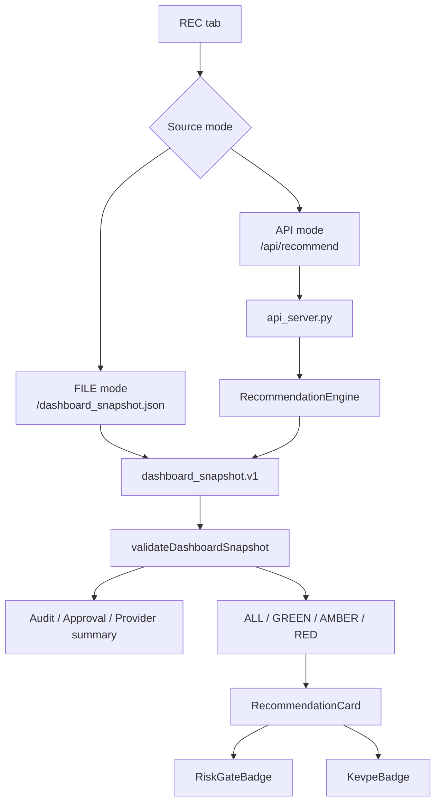

### REC source rules

| Market | REC data source | Reason |
|---|---|---|
| US | FILE or API | FILE can show exported `public/dashboard_snapshot.json`; API can run live recommendation |
| KRX | API forced | Prevents KRX screen from showing stale US snapshot |

### REC display blocks

| Block | Source | Meaning |
|---|---|---|
| Source controls | `RecommendationPanel.jsx` | FILE/API and IMPORT controls |
| Source info | `snapshot.config` | Universe, track, timestamp |
| AUDIT panel | API mode: `snapshot.provider_summary`; FILE mode: `/audit_log.jsonl` | Provider event visibility |
| APPROVAL panel | snapshot disclaimer or public approval CSV | Manual review status |
| PROVIDER panel | `snapshot.provider_summary` first, audit fallback second | Current provider, ticker, model, device |
| Filter tabs | `snapshot.results` | ALL, GREEN, AMBER, RED counts |
| Recommendation cards | `snapshot.results[]` | Candidate rank, verdict, score, entry/stop/target/risk |

## 5. API Component Layout

`stock_rtx4060_unified/api_server.py` is the dashboard-facing API server.

```mermaid
flowchart TD
    API[api_server.py] --> Health[/api/health]
    API --> Symbol[/api/symbol]
    API --> Recommend[/api/recommend]
    API --> Snapshot[/api/snapshot]

    Symbol --> YF[yfinance download<br/>OHLCV records]
    Recommend --> Config[RecommendationConfig]
    Config --> Engine[RecommendationEngine.run]
    Engine --> Reports[Markdown/JSON reports]
    Engine --> BuildSnapshot[build_dashboard_snapshot]
    Snapshot --> BuildSnapshot
    BuildSnapshot --> JSON[dashboard_snapshot.v1]
```

### API endpoints

| Endpoint | Used by | Output |
|---|---|---|
| `/api/health` | Operator / smoke check | API status JSON |
| `/api/symbol?symbol=AAPL&period=6mo` | Main dashboard chart | OHLCV records with `source=YFINANCE` |
| `/api/recommend?universe=...` | REC API mode | `dashboard_snapshot.v1` |
| `/api/snapshot?path=...` | Existing JSON preview | `dashboard_snapshot.v1` from stored recommendation JSON |

## 6. Backend Recommendation Components

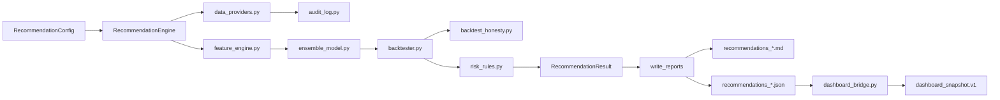

| Backend component | Responsibility |
|---|---|
| `RecommendationConfig` | Universe, track, period, provider, model, output directory |
| `RecommendationEngine` | Orchestrates data load, feature build, model, backtest, risk gates, ranking |
| `data_providers.py` | Selects `synthetic`, `yfinance`, `openbb`, `pykrx`, `fdr`, or `auto` |
| `audit_log.py` | Writes masked JSONL evidence |
| `feature_engine.py` | Builds OHLCV-based features |
| `ensemble_model.py` | Model training and walk-forward prediction logic |
| `backtester.py` | Backtest metrics |
| `backtest_honesty.py` | Phase B honesty checks |
| `risk_rules.py` | Verdict and position-risk gates |
| `dashboard_bridge.py` | Converts recommendation report JSON into dashboard snapshot |

## 7. Data Flow By Screen

### Main chart screen

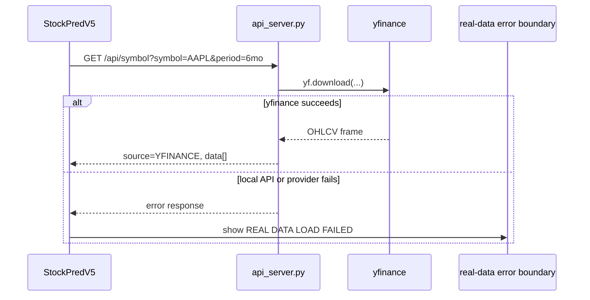

### REC screen

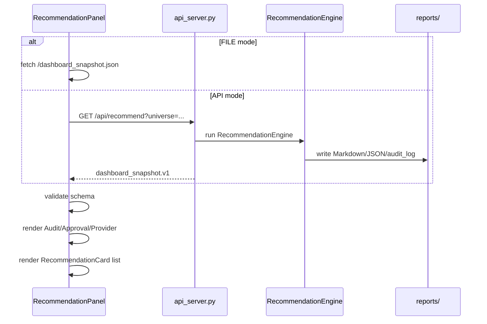

## 8. Component State Boundaries

| State | Owner | Notes |
|---|---|---|
| `market` | `StockPredV5` | `US` or `KRX`; controls symbol list, currency, REC source behavior |
| `selected` | `StockPredV5` | Current ticker shown in center chart |
| `cache` | `StockPredV5` | Browser-side OHLCV cache per symbol |
| `tab` | `StockPredV5` | `SIGNAL`, `MODELS`, `BACKTEST`, `REC` |
| `recSource` | `StockPredV5` | FILE or API; KRX forces API to avoid stale US file |
| `snapshot` | `RecommendationPanel` | Loaded `dashboard_snapshot.v1` object |
| `auditSummary` | `RecommendationPanel` | API mode uses snapshot provider summary; FILE mode can use public audit log |
| `approvalSummary` | `RecommendationPanel` | Manual review status, not order approval |
| `filtered` | `RecommendationPanel` | Rendered recommendation subset |

## 9. Safety Layout

This dashboard is a screening interface.

| Boundary | Rule |
|---|---|
| Broker execution | Not present |
| Auto buy/sell | Not present |
| Account credentials | Not handled |
| Recommendation output | `screening_output_only`, manual review required |
| REC button behavior | Loads recommendation data; does not submit orders |
| Approval panel | Displays review status; does not approve trades by itself |

## 10. Observability Stack Layout — Added 2026-05-10

풀옵션 기동 시 다음 6개 서비스가 동시에 실행됩니다.

| 서비스 | 기본 포트 | Docker 컨테이너 | 역할 |
|--------|-----------|----------------|------|
| Vite React Dashboard | 5173 | — (로컬 프로세스) | 메인 대시보드 UI |
| Flask API Server | 5151 | — (로컬 프로세스) | OHLCV·모델 스코어·추천 API |
| MLflow Tracking | 5000 | `stock1901_mlflow` | 실험 추적, 모델 레지스트리 |
| Prefect Server | 4200 | `stock1901_prefect` | Flow 스케줄·실행 관리 |
| Prometheus | 9090 | `stock1901_prometheus` | 메트릭 수집 |
| Grafana | 3000 (기본) / 3001 (충돌 시) | `stock1901_grafana` | 메트릭 시각화 |

> ⚠️ `open-webui` 등 외부 컨테이너가 포트 3000을 선점하면 Grafana는 3001로 기동.
> 워크어라운드: `docs/RUNBOOK.md` → "Grafana 포트 충돌 워크어라운드" 참조.

### CORS 허용 오리진 (api_server.py — 2026-05-10 수정)

```python
origins = [
    "http://localhost:5173",   # Vite dev
    "http://localhost:4173",   # Vite preview
    "http://localhost:5151",   # Flask self
]
```

기존 `origins=["*"]` 와일드카드는 보안 이슈로 제거됨.

## 11. Where To Add New Components

| Need | Add here | Reason |
|---|---|---|
| New dashboard tab | `stock-pred-v5/src/StockPredV5.jsx` | Tab ownership is currently in top-level dashboard component |
| New reusable REC visual | `stock-pred-v5/src/components/` | REC card/badge components already live there |
| New backend API endpoint | `stock_rtx4060_unified/api_server.py` | Dashboard-facing Flask API lives there |
| New recommendation field | `stock_rtx4060_unified/src/stock_rtx4060/recommendation_engine.py` and `dashboard_bridge.py` | Field must exist in source report and snapshot contract |
| New provider evidence | `data_providers.py` and `audit_log.py` | Provider and audit are coupled by evidence |
| New dashboard snapshot test | `stock_rtx4060_unified/tests/test_dashboard_bridge.py` | Snapshot contract is tested there |
| New browser behavior test | `stock-pred-v5/tests/` | Existing dashboard tests live in frontend project |

## 11. Naming Guidance

Use these terms consistently:

| Preferred term | Avoid when possible | Reason |
|---|---|---|
| Component Layout | UI component placement and hierarchy | Correct for this document |
| System Architecture | Component layout when describing backend/API/data flow | Architecture is broader than visual layout |
| Dashboard Snapshot | raw recommendation JSON | Snapshot is the browser contract |
| REC panel | recommendation dashboard generally | Matches current tab name |
| Provider Summary | live status | Avoid claiming exchange-level realtime unless verified |
| Report-only recommendation | buy/sell instruction | Safety boundary |

## 12. Current Known Layout Notes

| Note | Meaning |
|---|---|
| KRX REC uses API mode | Prevents KRX screen from showing stale US file snapshot |
| US REC can use FILE mode | FILE mode reads `public/dashboard_snapshot.json` |
| Main chart uses `/api/symbol` first | Local backend data path is preferred over browser proxy |
| Fallback symbol list | Used only to keep the selector usable when `/api/universe` fails |
| `YFINANCE` badge means local API yfinance data | This is provider data, not direct exchange streaming |

## 13. Detailed Dashboard Layout Grid

The visible dashboard has four practical layout regions.

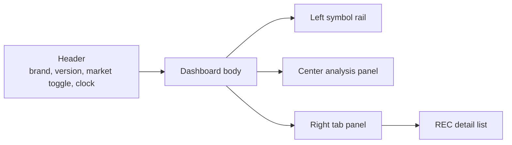

| Screen region | Owner in code | Main content | User action |
|---|---|---|---|
| Header | `StockPredV5` JSX block | `STOCK·PRED`, version, market selector, UTC/NYC/KST clock, benchmark/export buttons | Switch `US` / `KRX`, open benchmark, export JSON/MD |
| Left symbol rail | `StockPredV5` symbol loop | Backend universe ticker list first; fallback symbols only when `/api/universe` is unavailable | Select ticker |
| Center analysis panel | `CenterPanel` | Selected ticker price, source badge, OHLCV chart, RSI, MACD, volume | Read selected ticker technical view |
| Right tab panel | `StockPredV5` tab switch | `SIGNAL`, `MODELS`, `BACKTEST`, `REC` | Switch analysis mode |
| REC detail list | `RecommendationPanel` + `RecommendationCard` | Backend recommendation snapshot, audit/provider/approval summary, ranked candidates | Read report-only recommendation evidence |

## 14. Header Component Detail

The header is not a separate exported component. It is inline JSX inside `StockPredV5`.

| Element | State/source | Behavior |
|---|---|---|
| App title | Static text in `StockPredV5.jsx` | Displays `STOCK·PRED` and `v5.0` |
| Market toggle | `market` state | `US` uses `US_SYMBOLS`; `KRX` uses `KRX_SYMBOLS` |
| Clock | `clock` state from `setInterval` | Shows UTC, New York, and Korea time |
| Benchmark button | `runBenchmark` | Scans current market symbol list client-side |
| JSON export | `exportJSON` | Downloads selected ticker analysis payload |
| MD export | `exportMD` | Downloads selected ticker Markdown summary |

Important rule:

| Rule | Reason |
|---|---|
| Market toggle must reset `selected` to the first ticker of the target market | Prevents US-selected state from leaking into KRX chart or KRX-selected state from leaking into US chart |
| KRX market must force REC API mode | Prevents KRX REC tab from reading stale US `public/dashboard_snapshot.json` |

## 15. Left Symbol Rail Detail

The symbol rail uses `/api/universe` as the primary ticker source.
The US/KRX lists in `StockPredV5.jsx` are fallback continuity lists used only when the universe API is unavailable.

### US symbols

| Symbol | Display name |
|---|---|
| `AAPL` | Apple Inc. |
| `MSFT` | Microsoft |
| `NVDA` | NVIDIA |
| `TSLA` | Tesla |
| `AMZN` | Amazon |
| `GOOGL` | Alphabet |
| `META` | Meta |
| `SPY` | S&P 500 ETF |
| `QQQ` | Nasdaq 100 ETF |

### KRX symbols

| Symbol | Display name |
|---|---|
| `005930.KS` | 삼성전자 |
| `000660.KS` | SK하이닉스 |
| `005380.KS` | 현대차 |
| `005490.KS` | POSCO홀딩스 |
| `035420.KS` | NAVER |
| `035720.KS` | 카카오 |
| `051910.KS` | LG화학 |
| `006400.KS` | 삼성SDI |
| `003670.KS` | 포스코퓨처엠 |

### Symbol rail data behavior

| Step | Code owner | Behavior |
|---:|---|---|
| 1 | `useEffect([market])` | Iterates over the current market's symbol list |
| 2 | `fetchSymbol(s.symbol)` | Requests OHLCV data |
| 3 | `enrich(res.data)` | Calculates indicators for last-price display |
| 4 | `setSidebarSnap` | Stores latest close, percent change, and source |
| 5 | Symbol row renderer | Shows price, percent change, and backend/API error state when real provider data is unavailable |

## 16. Center Panel Detail

`CenterPanel` is the primary single-symbol analysis view.

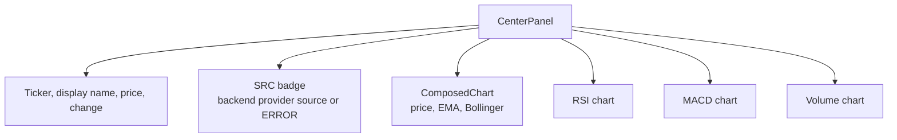

| Field | Source | Display meaning |
|---|---|---|
| Price | Last enriched OHLCV row | Latest close from loaded source |
| Change | Last close minus previous close | Absolute and percent move |
| `SRC` | `cur.source` | `YFINANCE` or backend provider source |
| EMA | `ema()` / `enrich()` | Short and medium moving averages |
| Bollinger | `bollinger()` / `enrich()` | 20-period band view |
| RSI | `rsi()` / `enrich()` | Momentum state |
| MACD | `macd()` / `enrich()` | Trend/momentum cross view |
| Volume | Raw OHLCV volume | Recent participation |

Source color rule:

| Source | Badge color | Meaning |
|---|---|---|
| `YFINANCE` | Green | Local API successfully returned yfinance data |
| `ERROR` | Red/Amber error panel | Backend/provider did not return enough real OHLCV rows |

## 17. Right Tab Panel Detail

The right panel is controlled by `tab` state in `StockPredV5`.

| Tab | Component/function | Input | Output |
|---|---|---|---|
| `SIGNAL` | `SignalTab` | `last`, backend `scores`, `ens`, `sig`, `feat`, `modelEvidence` | Current technical context plus backend model evidence signal |
| `MODELS` | `ModelsTab` | backend `scores`, `ens`, `sig`, `modelEvidence` | Backend main score, selected model details, and evidence metrics |
| `BACKTEST` | `BacktestTab` | `backtest`, `market`, `fmtMoney` | Client-side equity curve, stats, recent trades |
| `REC` | `RecommendationPanel` | `jsonPath` or `apiUrl`, `currency`, `accent` | Backend recommendation list and operational summary |

Important distinction:

| Area | Calculation location | Purpose |
|---|---|---|
| `SIGNAL`, `MODELS` | Python backend through `/api/model-scores` | Primary model evidence for selected ticker |
| `BACKTEST`, `BENCHMARK` | Browser-side functions in `StockPredV5.jsx` | Phase 1 dry-run/demo scope retained for later backend conversion |
| `REC` | Python backend through snapshot/API | Auditable report-only recommendation evidence |

## 18. Browser-side Analysis Functions

These functions live in `StockPredV5.jsx`.

| Function | Role |
|---|---|
| `fetchSymbol(symbol)` | Loads chart data from local API first; generated fallback prices are not automatically rendered |
| `fetchModelEvidence(symbol)` | Loads selected ticker model evidence from `/api/model-scores` |
| `ema(v, p)` | Calculates exponential moving average |
| `sma(v, p)` | Calculates simple moving average |
| `rsi(v, p)` | Calculates RSI |
| `macd(v)` | Calculates MACD line, signal, histogram |
| `bollinger(v, p, k)` | Calculates Bollinger upper/middle/lower bands |
| `enrich(raw)` | Adds EMA, RSI, MACD, Bollinger fields to OHLCV rows |
| `features(en, idx)` | Builds browser-side technical feature vector |
| `lrPredict(f)` | Browser-side logistic-style signal score |
| `xgbPredict(f)` | Browser-side dry-run XGBoost-style score used only by BACKTEST/BENCHMARK |
| `lstmPredict(en, idx)` | Browser-side dry-run LSTM-style score used only by BACKTEST/BENCHMARK |
| `rnnPredict(en, idx)` | Browser-side Elman RNN demo score used by BACKTEST/BENCHMARK dry-run only |
| `ensembleScore(s)` | Browser-side dry-run ensemble score, not primary SIGNAL/MODELS evidence |
| `signalFromScore(s)` | Converts dashboard scores to `BUY`, `HOLD`, or `SELL`; primary SIGNAL/MODELS display must match backend visible thresholds `BUY >= 56 · HOLD 45-55 · SELL <= 44` |
| `runBacktest(en)` | Browser-side dry-run backtest for selected ticker |

These browser-side model functions are visual/informational helpers for BACKTEST/BENCHMARK dry-run behavior.
They are not the primary SIGNAL/MODELS model evidence and are not the same as the backend `RecommendationEngine` risk-gated recommendation workflow.

## 19. RecommendationPanel Internal Layout

`RecommendationPanel.jsx` owns the REC tab's backend-output UI.

```mermaid
flowchart TD
    Panel[RecommendationPanel] --> Load[load()]
    Panel --> Operational[loadOperationalFiles()]
    Panel --> Import[handleImportFile()]
    Load --> FileFetch[fetchDashboardSnapshot(jsonPath)]
    Load --> ApiFetch[fetch(apiUrl)]
    FileFetch --> Validate[validateDashboardSnapshot]
    ApiFetch --> Validate
    Validate --> SnapshotState[snapshot state]
    SnapshotState --> ProviderSummary[providerSummary]
    SnapshotState --> VerdictCounts[verdictCounts]
    SnapshotState --> Filtered[filtered results]
    Filtered --> CardList[RecommendationCard list]
```

| Internal function/state | Meaning |
|---|---|
| `fetchDashboardSnapshot(jsonPath)` | Reads `public/dashboard_snapshot.json` or another fixed JSON path |
| `fetchOptionalText(path)` | Reads optional public `audit_log.jsonl` and `approval_journal_template.csv` |
| `parseAuditLog(text)` | Counts audit events, provider events, successful events |
| `parseCsvRows(text)` | Parses approval CSV rows for the approval panel |
| `summarizeApproval(text, snapshot)` | Calculates manual review status |
| `validateDashboardSnapshot(data)` | Requires object, `schema_version=dashboard_snapshot.v1`, and `results[]` |
| `load()` | Selects FILE or API source and sets `snapshot` |
| `loadOperationalFiles()` | FILE mode reads public operational files; API mode uses snapshot provider summary |
| `handleImportFile(event)` | Allows user-selected `dashboard_snapshot.json` import |
| `filtered` | Applies ALL/GREEN/AMBER/RED filter and score/RR sorting |
| `verdictCounts` | Counts GREEN, AMBER, RED results |
| `providerSummary` | Shows provider, status, first ticker, model, device |

## 20. RecommendationCard Detail

`RecommendationCard.jsx` renders one backend recommendation result.

| Field family | Example fields | Source |
|---|---|---|
| Identity | `ticker`, `track`, `verdict`, `candidate_label` | `dashboard_snapshot.v1 results[]` |
| Ranking | `rank`, `score`, `probability`, `expected_value_pct` | Snapshot result |
| Trade plan evidence | `entry`, `stop`, `tp1`, `tp2`, `risk_reward` | Snapshot result |
| Risk sizing evidence | `risk_budget_pct`, `max_position_pct`, `suggested_quantity`, `suggested_position_value` | Snapshot result |
| Model evidence | `model_accuracy`, `model_auc`, `oof_coverage` | Snapshot result |
| Backtest evidence | `backtest_return_pct`, `backtest_sharpe`, `backtest_mdd_pct`, `profit_factor` | Snapshot result |
| Validation evidence | `validations[]`, `confirmations_passed`, `confirmations_total` | Snapshot result |
| KEVPE evidence | `kevpe_*` fields | Snapshot result when available |

Verdict coloring:

| Verdict family | Visual treatment |
|---|---|
| `ELIGIBLE_RECOMMENDATION` | Green recommendation badge |
| `ACCUMULATE_RECOMMENDATION` | Green accumulation badge |
| `AMBER_*` | Amber review-only badge |
| `RED_*` | Red blocked/not-recommended badge |
| `ZERO_*` | Red/blocked risk failure badge |

## 21. Snapshot Contract Detail

`dashboard_snapshot.v1` is the contract between backend and dashboard.

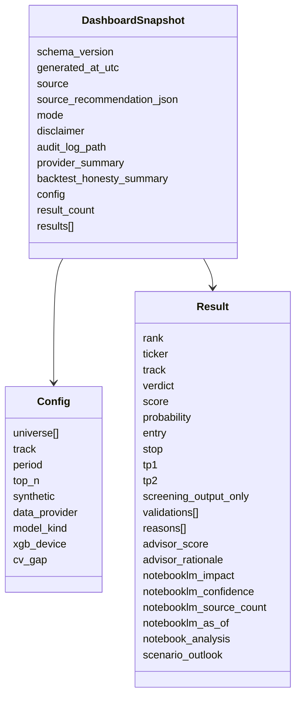

### Additive Fields (Added 2026-05-30)

| 필드 | 타입 | 출처 | 설명 |
|---|---|---|---|
| `advisor_score` | float \| null | `_apply_advisor_blend()` | LLM Advisor 블렌딩 점수 [-1,+1] |
| `advisor_rationale` | str \| null | orchestrator outputs | Advisor 종합 근거 (240자 이내) |
| `notebooklm_impact` | str \| null | NotebookLM analysis | `LOW/MEDIUM/MEDIUM_HIGH/HIGH` |
| `notebooklm_confidence` | float \| null | NotebookLM analysis | 0.0–1.0 |
| `notebooklm_source_count` | int \| null | NotebookLM sources | 분석에 사용된 뉴스 수 |
| `notebooklm_as_of` | str \| null | NotebookLM cache | ISO 8601 timestamp |
| `notebook_analysis` | dict \| null | NotebookLM full analysis | summary/bullish_factors/bearish_factors/sentiment/score |
| `scenario_outlook` | dict \| null | passthrough or fallback | bull/base/bear: range/return/probability |

Minimum REC requirements:

| Required item | Why |
|---|---|
| `schema_version = dashboard_snapshot.v1` | Allows frontend validation |
| `results` array | REC cards require iterable candidates |
| `config.universe` | Shows source ticker set and prevents US/KRX confusion |
| `config.data_provider` | Shows whether source is synthetic/yfinance/openbb/etc. |
| `screening_output_only = true` per result | Preserves no-order safety boundary |
| `provider_summary` when available | Feeds Provider panel without stale public audit logs |

## 22. US And KRX REC Routing

The dashboard must not show US recommendation output while the user is on KRX.

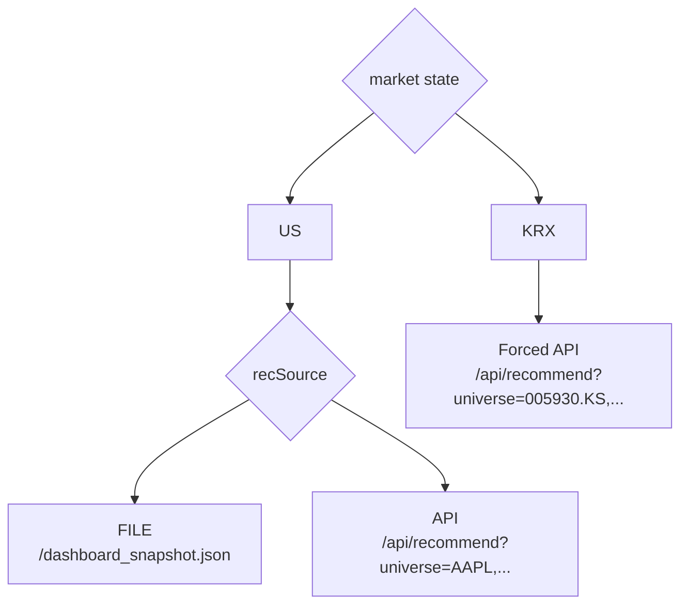

| Market | REC behavior | Current code point |
|---|---|---|
| US | User can choose FILE or API | `effectiveRecSource = recSource` |
| KRX | FILE button disabled and API forced | `effectiveRecSource = market === "KRX" ? "api" : recSource` |
| KRX API universe | All `KRX_SYMBOLS` joined into query string | `recUniverse = symbols.map(...).join(",")` |
| KRX API provider | `data_provider=yfinance` | `recApiUrl` query params |
| KRX output dir | `reports/api_recommend_krx` | `recApiUrl` query params |

## 23. Vite And API Runtime Layout

The dashboard runtime has two local servers.

| Server | Path | Port | Command |
|---|---|---:|---|
| React/Vite dashboard | `stock-pred-v5/` | `5173` | `npm run dev -- --host 127.0.0.1 --port 5173` |
| Flask recommendation API | `stock_rtx4060_unified/` | `5151` | `.venv\Scripts\python.exe api_server.py --host 127.0.0.1 --port 5151` |

`stock-pred-v5/vite.config.js` defines:

| Config item | Value |
|---|---|
| `server.port` | `5173` |
| `server.proxy["/api"].target` | `http://127.0.0.1:5151` |
| `build.outDir` | `dist` |
| `build.target` | `es2020` |

This means browser code calls `/api/...`, and Vite forwards it to Flask at `127.0.0.1:5151`.

## 24. Error And Fallback Layout

| Failure | Owner | User-visible result |
|---|---|---|
| `/api/symbol` not running | `fetchSymbol` | Shows `REAL DATA LOAD FAILED` |
| Backend chart API fails | `fetchSymbol` | Shows `REAL DATA LOAD FAILED`; it does not create synthetic prices |
| FILE snapshot missing | `RecommendationPanel.load()` | Shows REC source error with retry |
| API recommendation fails | `RecommendationPanel.load()` | Shows `API error: ...` |
| Imported JSON invalid | `validateDashboardSnapshot` | Shows import error |
| Public audit file stale | `RecommendationPanel` | API mode ignores public audit and uses snapshot provider summary |
| KRX selected but FILE snapshot is US | `StockPredV5` | KRX forces API, FILE disabled |

## 25. Validation Checklist

Use this checklist after changing dashboard layout or backend API.

| Check | Command or action | Expected result |
|---|---|---|
| Backend syntax | `cd stock_rtx4060_unified; .\.venv\Scripts\python.exe -m py_compile api_server.py` | No syntax error |
| Frontend build | `cd stock-pred-v5; npm run build` | Vite build succeeds |
| API health | `Invoke-WebRequest http://127.0.0.1:5151/api/health` | HTTP 200 |
| Main chart data | `GET /api/symbol?symbol=AAPL&period=6mo` | `source=YFINANCE`, `data[]` present |
| US REC file mode | Open dashboard, US, REC, FILE | Reads `/dashboard_snapshot.json` |
| KRX REC API mode | Open dashboard, KRX, REC | Shows `.KS` tickers, not `AAPL/NVDA/QQQ` |
| Provider panel | KRX REC | Shows `yfinance · 005930.KS · logistic · cpu` or current KRX first ticker |
| Safety text | REC footer/disclaimer | Shows screening/manual review boundary |

## 26. Change Impact Rules

| If you change | Also check |
|---|---|
| `US_SYMBOLS` or `KRX_SYMBOLS` | Sidebar, `recUniverse`, API REC output |
| `fetchSymbol` | Main chart source badge and real-data error boundary |
| `api_server.py /api/symbol` | `StockPredV5` chart data path |
| `api_server.py /api/recommend` | `RecommendationPanel` API mode |
| `dashboard_bridge.py` snapshot fields | `validateDashboardSnapshot`, `RecommendationCard`, `tests/test_dashboard_bridge.py` |
| `RecommendationCard` fields | Snapshot result field names |
| `RiskGateBadge` verdict mapping | Backend verdict strings |
| `KevpeBadge` | `kevpe_*` fields in snapshot results |
| Vite proxy | All `/api/...` calls from dashboard |

## 27. Component Ownership Summary

| Component | Owns | Must not own |
|---|---|---|
| `StockPredV5` | Layout, market state, selected ticker, tab state, browser chart calculations | Backend risk-gated recommendation logic |
| `RecommendationPanel` | Snapshot loading, REC filtering/sorting, operational summary | Provider fetching or backend model execution |
| `RecommendationCard` | One candidate's visual presentation | Snapshot validation or API calls |
| `RiskGateBadge` | Verdict label/color mapping | Risk rule calculation |
| `KevpeBadge` | KEVPE visual display | KEVPE event generation |
| `api_server.py` | Dashboard-facing HTTP endpoints | Browser rendering |
| `RecommendationEngine` | Recommendation calculation and report writing | React state or DOM behavior |
| `dashboard_bridge.py` | Snapshot contract conversion | Report ranking logic |

## 28. Glossary

| Term | Meaning |
|---|---|
| Dashboard | React/Vite UI in `stock-pred-v5` |
| REC | Recommendation tab in the dashboard |
| FILE mode | Browser reads `public/dashboard_snapshot.json` |
| API mode | Browser asks Flask `/api/recommend` to run recommendation and return snapshot |
| Snapshot | `dashboard_snapshot.v1` JSON contract consumed by REC |
| Provider | Data source such as `yfinance`, `synthetic`, `openbb`, `pykrx`, or `fdr` |
| Provider summary | Run-level provider evidence included in snapshot |
| Audit log | JSONL event file written by backend provider/recommendation runs |
| Approval journal | Manual review CSV/template; not broker approval |
| Screening output | Recommendation evidence for human review, not an order instruction |
| Synthetic backend mode | Backend-only test/demo provider; the dashboard no longer auto-generates synthetic chart prices |

## 29. SIGNAL Tab Box-by-box Function Inventory

This section explains every visible box in the screenshot-like `SIGNAL` view.

The implementation is in `stock-pred-v5/src/StockPredV5.jsx`, mainly `SignalTab`, `IndRow`, `ModelBar`, and the top-level `StockPredV5` action buttons.

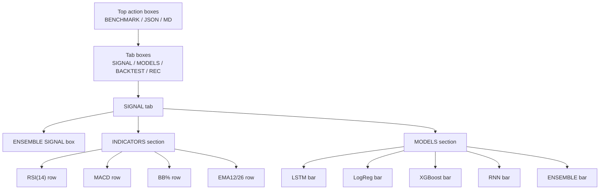

### 29.1 Top action boxes

| Box | Code owner | Function | Input | Output / visible effect | Notes |
|---|---|---|---|---|---|
| `BENCHMARK` | `runBenchmark()` and `BenchmarkPanel` | Scans all symbols in the selected market using browser-side model functions | Current `market`, `symbols`, `fetchSymbol`, `enrich`, `features`, model score functions | Opens benchmark panel with ranked symbol rows, model scores, ENS score, and signal | It is a client-side scan, not the backend risk-gated recommendation engine |
| `JSON` | `exportJSON()` | Exports current selected ticker analysis as JSON | `market`, `selected`, `cur.source`, `last`, indicators, model scores, backtest summary | Downloads a local JSON file | This exports current browser analysis, not backend REC report JSON |
| `MD` | `exportMD()` | Exports current selected ticker analysis as Markdown | Same selected ticker state plus formatted signal and metrics | Downloads a Markdown summary | This is a local dashboard summary, not `recommendations_algo_v2_*.md` |

### 29.2 Main tab boxes

| Box | Code owner | Function | What it shows |
|---|---|---|---|
| `SIGNAL` | `SignalTab` | Shows the current selected ticker's backend signal summary | Backend BUY/HOLD/SELL, score, indicators, backend model evidence, weak-quality warning when needed |
| `MODELS` | `ModelsTab` | Shows backend model evidence and model-quality details | Backend main score, selected model details, model_accuracy, model_auc, oof_coverage, weak-quality warning when needed |
| `BACKTEST` | `BacktestTab` | Shows client-side dry-run backtest | ML vs buy-and-hold equity curve, returns, alpha, Sharpe, win rate, recent trades |
| `REC` | `RecommendationPanel` | Shows backend recommendation report snapshot | FILE/API source, audit, approval, provider, ranked recommendation cards |

Tab state rule:

| State | Meaning |
|---|---|
| `tab = "SIGNAL"` | Renders `SignalTab` |
| `tab = "MODELS"` | Renders `ModelsTab` |
| `tab = "BACKTEST"` | Renders `BacktestTab` |
| `tab = "REC"` | Renders `RecommendationPanel` |

## 30. ENSEMBLE SIGNAL Box Detail

The large box at the top of the `SIGNAL` tab is the immediate summary of backend model evidence for the selected ticker.

| Visible item | Code/source | Function |
|---|---|---|
| `ENSEMBLE SIGNAL` label | Static label in `SignalTab` | Names the signal summary box |
| `BUY` / `HOLD` / `SELL` | Backend score signal from `/api/model-scores` aligned with `_score_signal()` | Converts backend model score into a readable signal |
| `SCORE 80 / 100` | Backend main model score | Shows backend score on 0-100 scale |
| Horizontal score bar | `width: ${ens}%` | Visualizes score strength |
| Threshold tick near 44 | Backend-aligned marker at 44% | SELL/HOLD threshold guide |
| Threshold tick near 56 | Backend-aligned marker at 56% | HOLD/BUY threshold guide |
| `BUY >= 56 · HOLD 45-55 · SELL <= 44` | Static visible threshold text | Shows the same primary threshold rule as backend `_score_signal()` |
| `모델 품질 낮음: 검토 전용` | Weak-quality warning based on backend evidence | Tells the user the model evidence is review-only when quality is weak |
| Border color | `sigColor` | Green for BUY, amber for HOLD, red for SELL |

Signal threshold rules:

| Score range | Signal | Meaning |
|---:|---|---|
| `score <= 44` | `SELL` | Backend low-score signal |
| `45` to `55` | `HOLD` | Backend neutral signal |
| `score >= 56` | `BUY` | Backend high-score signal |

Weak-quality warning:

| Evidence field | Weak-quality display rule |
|---|---|
| `model_auc` | Show `모델 품질 낮음: 검토 전용` when backend evidence classifies AUC as weak |
| `model_accuracy` | Show `모델 품질 낮음: 검토 전용` when backend evidence classifies accuracy as weak |
| `oof_coverage` | Show `모델 품질 낮음: 검토 전용` when backend evidence classifies coverage as weak |

Important boundary:

| Rule | Explanation |
|---|---|
| This box is backend model evidence | It is still not the backend `RecommendationEngine` REC verdict |
| `BUY` here is a visible dashboard signal | It is not broker order execution and not a guaranteed recommendation |
| Weak model quality means review-only | The dashboard must not present weak evidence as high-confidence buy guidance |
| REC tab is the risk-gated backend recommendation area | Use REC for audit-backed screening output |

## 31. INDICATORS Box Detail

The `INDICATORS` section is built from four `IndRow` rows.

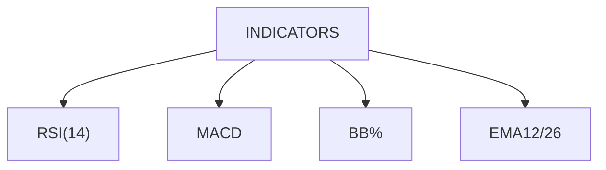

| Row box | Code/source | Value shown | State shown | Bar | Function |
|---|---|---|---|---|---|
| `RSI(14)` | `last.rsi` from `rsi(c, 14)` inside `enrich()` | RSI value rounded to 2 decimals | `OVERBOUGHT`, `OVERSOLD`, or `NEUTRAL` | Yes, 0-100 scale | Momentum/overbought/oversold view |
| `MACD` | `last.macdHist` from `macd()` inside `enrich()` | MACD histogram rounded to 4 decimals | `BULLISH` when histogram > 0, otherwise `BEARISH` | No | Trend/momentum direction view |
| `BB%` | `feat.bbPos * 100` | Position inside Bollinger band as percent | `UPPER`, `MIDDLE`, or `LOWER` | Yes, 0-100 scale | Shows whether price is near upper/lower Bollinger band |
| `EMA12/26` | `last.ema12 - last.ema26` | Difference between EMA12 and EMA26 | `GOLDEN` when EMA12 > EMA26, otherwise `DEATH` | No | Short/medium trend cross view |

### RSI row rules

| Condition | State | Color logic |
|---|---|---|
| `last.rsi > 70` | `OVERBOUGHT` | Red |
| `last.rsi < 30` | `OVERSOLD` | Green |
| Otherwise | `NEUTRAL` | Muted text color |

### MACD row rules

| Condition | State | Meaning |
|---|---|---|
| `last.macdHist > 0` | `BULLISH` | MACD line is above signal line |
| `last.macdHist <= 0` | `BEARISH` | MACD line is below or equal to signal line |

### BB% row rules

| Condition | State | Meaning |
|---|---|---|
| `bbPos > 0.8` | `UPPER` | Price is close to upper Bollinger band |
| `bbPos < 0.2` | `LOWER` | Price is close to lower Bollinger band |
| Otherwise | `MIDDLE` | Price is inside middle band area |

### EMA12/26 row rules

| Condition | State | Meaning |
|---|---|---|
| `last.ema12 > last.ema26` | `GOLDEN` | Short EMA is above medium EMA |
| `last.ema12 <= last.ema26` | `DEATH` | Short EMA is below or equal to medium EMA |

## 32. MODELS Box Detail In SIGNAL Tab

The lower `MODELS` section in the `SIGNAL` tab uses `ModelBar` rows for backend model evidence.

| Row box | Code/source | Weight in ensemble | Color token | Function |
|---|---|---:|---|---|
| Backend main model | `/api/model-scores` backend score | Backend-defined | Current `accent` color | Primary evidence for SIGNAL/MODELS |
| `model_accuracy` | `/api/model-scores` evidence | Evidence metric | Evidence color | Accuracy evidence used to explain quality |
| `model_auc` | `/api/model-scores` evidence | Evidence metric | Evidence color | AUC evidence used to explain quality |
| `oof_coverage` | `/api/model-scores` evidence | Evidence metric | Evidence color | Out-of-fold coverage evidence used to explain quality |
| Weak-quality warning | Backend evidence classification | N/A | Warning color | Shows `모델 품질 낮음: 검토 전용` when evidence is weak |

Primary visible threshold:

```text
BUY >= 56 · HOLD 45-55 · SELL <= 44
```

Model score visual behavior:

| Visual element | Function |
|---|---|
| Numeric value on the right | Shows the model score from 0 to 100 |
| Horizontal color bar | Width equals score percent |
| `ENSEMBLE` row weight styling | Uses stronger font/height to show final combined score |

Important boundary:

| Rule | Explanation |
|---|---|
| SIGNAL/MODELS model rows come from `/api/model-scores` | They show backend walk-forward model evidence for the selected ticker |
| Weak evidence warning is visible in SIGNAL/MODELS | The UI shows `모델 품질 낮음: 검토 전용` when backend evidence is weak |
| Backend model evidence failure is visible | The UI shows `MODEL EVIDENCE UNAVAILABLE` and does not silently substitute browser simulation |
| Browser-side model helpers remain demo-only | BACKTEST/BENCHMARK still use them until a later backend conversion phase |

## 33. Individual Box Function Table For The Screenshot

This table maps each visible box in the provided screenshot to its function.

| Visual box | Shows | User reads it as | Code function/state | Actionable meaning |
|---|---|---|---|---|
| `BENCHMARK` button | Benchmark command | Scan all symbols in current market | `runBenchmark()` | Opens full benchmark ranking panel |
| `JSON` button | JSON export command | Save selected ticker analysis as JSON | `exportJSON()` | Creates local browser-exported analysis file |
| `MD` button | Markdown export command | Save selected ticker analysis as Markdown | `exportMD()` | Creates local browser-exported Markdown brief |
| `SIGNAL` tab | Active signal view | Current selected ticker backend evidence summary | `tab === "SIGNAL"` | Shows signal, indicators, backend evidence rows, and weak-quality warning when needed |
| `MODELS` tab | Backend model evidence view | Backend score, evidence metrics, threshold guide | `tab === "MODELS"` | Shows model_accuracy, model_auc, oof_coverage, and weak-quality warning when needed |
| `BACKTEST` tab | Backtest view | Client-side dry-run performance | `tab === "BACKTEST"` | Shows ML vs buy-and-hold test |
| `REC` tab | Recommendation view | Backend report-only recommendation | `tab === "REC"` | Shows audited backend candidate list |
| `ENSEMBLE SIGNAL` box | BUY/HOLD/SELL and score | Backend model evidence signal | Backend-aligned score signal | Quick report-only review summary |
| Score bar | Score strength | How far signal leans toward BUY/SELL | `width: ${ens}%` | Visual intensity indicator |
| `RSI(14)` row | RSI value and state | Momentum/overbought/oversold | `rsi()` and `IndRow` | Detect momentum extremes |
| `MACD` row | MACD histogram and state | Trend/momentum direction | `macd()` and `IndRow` | Detect bullish/bearish momentum |
| `BB%` row | Bollinger band position | Position within volatility band | `bollinger()` and `features()` | Detect upper/lower band pressure |
| `EMA12/26` row | EMA spread and cross state | Short vs medium trend | `ema()` and `IndRow` | Detect golden/death trend state |
| `LSTM` row | Backend LSTM score when `/api/model-scores` returns it | Backend `model_scores.lstm` | `scores.lstm` | Primary MODELS evidence when TensorFlow/LSTM is enabled |
| `LogReg` row | Logistic-style score | Weighted indicator score | `lrPredict()` | One input to ensemble |
| `XGBoost` row | Backend XGBoost score when `/api/model-scores` returns it | Backend `model_scores.xgboost` | `scores.xgb` | Primary MODELS evidence when XGBoost is selected by `auto` or `xgb` |
| `RNN` row | Recurrent score | Recent-sequence score | `rnnPredict()` | One input to ensemble |
| `ENSEMBLE` row | Final weighted score | Combined browser score | `ensembleScore()` | Drives BUY/HOLD/SELL in SIGNAL tab |

## 34. Box Interaction And Refresh Rules

| User action | Affected boxes | Refresh behavior |
|---|---|---|
| Change selected ticker in left rail | Center panel, SIGNAL, MODELS, BACKTEST | `selected` changes, `fetchSymbol` loads or uses cached data |
| Change `US` to `KRX` | Left rail, currency, REC route, selected ticker | `market` changes, selected ticker resets, benchmark resets, KRX REC forces API |
| Click `SIGNAL` | Right panel | Renders `SignalTab` without backend call |
| Click `MODELS` | Right panel | Renders `ModelsTab` without backend call |
| Click `BACKTEST` | Right panel | Renders `BacktestTab` from browser-side `runBacktest` result |
| Click `REC` | Right panel | Loads FILE snapshot or calls `/api/recommend` depending on market/source mode |
| Click `BENCHMARK` | Main area | Runs browser-side scan over the active market symbol list |
| Click `JSON` | Browser download | Exports selected ticker analysis from current browser state |
| Click `MD` | Browser download | Exports selected ticker Markdown from current browser state |

## 35. What Each Box Does Not Do

| Box | Does not do |
|---|---|
| `BUY` signal box | Does not place broker orders |
| `BENCHMARK` | Does not run backend risk gates |
| `JSON` / `MD` | Does not export backend recommendation reports |
| `SIGNAL` model bars | Do not prove out-of-fold backend model edge |
| `BACKTEST` tab | Does not replace backend backtest honesty checks |
| `REC` tab | Does not approve a trade; it displays report-only screening output |
| `APPROVAL` panel in REC | Does not submit approval to a broker |

## 36. Box-level Verification Checklist

Use this checklist when changing any visible box.

| Box group | Verify |
|---|---|
| Top action boxes | `BENCHMARK`, `JSON`, `MD` buttons are visible and do not overlap |
| Main tab boxes | `SIGNAL`, `MODELS`, `BACKTEST`, `REC` switch without blank panel |
| Signal box | BUY/HOLD/SELL text, score, and bar match `ens` |
| Indicator rows | RSI, MACD, BB%, EMA values appear and state labels match code thresholds |
| Model rows | LSTM, LogReg, XGBoost, RNN, ENSEMBLE values appear with bars |
| US mode | REC FILE/API behavior does not show KRX-only universe unless API is called with KRX symbols |
| KRX mode | REC API mode shows `.KS` tickers and does not show `AAPL`, `NVDA`, or `QQQ` |
| Source badge | Backend provider source or `ERROR` clearly indicates the current chart data state |

## 37. MODELS Tab Box-by-box Function Inventory

The `MODELS` tab explains backend model evidence for the selected ticker.
It is an evidence-review panel, not a backend training screen and not an order screen.

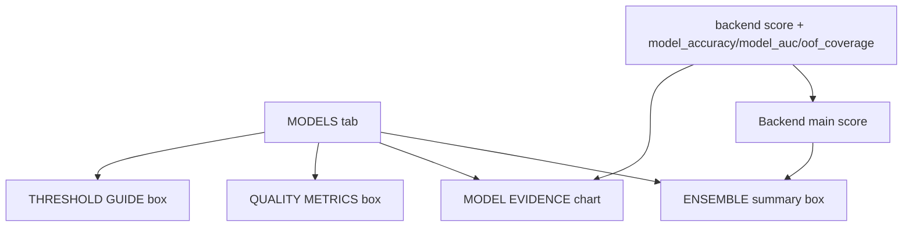

| Box | Shows | Source in dashboard code | User meaning | Important boundary |
|---|---|---|---|---|
| `ENSEMBLE` summary box | Backend score and signal text | `/api/model-scores` evidence mapped through backend-aligned signal rules | Shows backend model evidence for the selected ticker | It is still review-only evidence |
| `MODEL EVIDENCE` chart | Backend score and available evidence metrics | `modelEvidence` in `ModelsTab` | Shows what the backend returned | It must not invent replacement browser-only model metrics |
| `model_accuracy` row | Accuracy evidence when available | `/api/model-scores` evidence | Helps explain model quality | Weak accuracy can trigger `모델 품질 낮음: 검토 전용` |
| `model_auc` row | AUC evidence when available | `/api/model-scores` evidence | Helps explain model separation quality | Weak AUC can trigger `모델 품질 낮음: 검토 전용` |
| `oof_coverage` row | Out-of-fold coverage when available | `/api/model-scores` evidence | Helps explain validation coverage | Weak coverage can trigger `모델 품질 낮음: 검토 전용` |
| Reference line `56` | Upper guide line | Backend-aligned guide | Shows BUY threshold | It must replace old primary 65 guidance |
| Reference line `44` | Lower guide line | Backend-aligned guide | Shows SELL threshold | It must replace old primary 35 guidance |
| Threshold text | `BUY >= 56 · HOLD 45-55 · SELL <= 44` | Static visible label | Explains the backend signal rule | This label is required for primary backend evidence |
| Weak-quality warning | `모델 품질 낮음: 검토 전용` | Backend evidence quality classification | Warns that evidence is review-only | It is not a broker/order/account action |

MODELS tab does not do these actions:

| Not performed | Reason |
|---|---|
| It does not train a backend model | It displays backend evidence already returned by `/api/model-scores` |
| It does not run `pytest`, `main.py`, or XGBoost GPU checks | Those checks belong to the Python backend and validation reports |
| It does not approve recommendations | Approval remains manual and appears in the REC area |
| It does not call the recommendation API | REC handles backend recommendation loading |
| It does not place broker orders or touch accounts | SIGNAL/MODELS are report-only and review-only |

## 38. BACKTEST Tab Box-by-box Function Inventory

The `BACKTEST` tab shows a browser-side dry-run comparison.
It compares a local ML-style signal path against buy-and-hold.

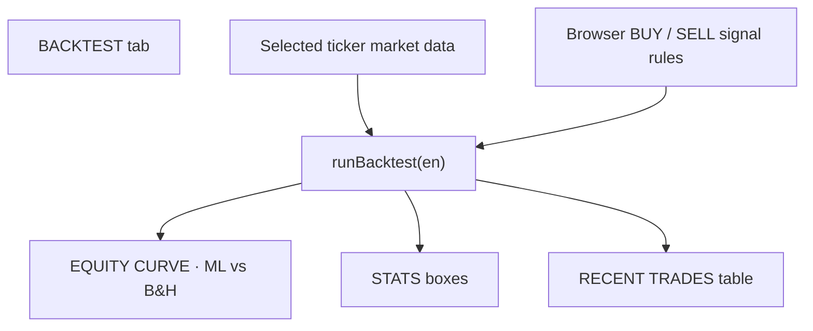

| Box | Shows | Source in dashboard code | User meaning | Important boundary |
|---|---|---|---|---|
| `EQUITY CURVE · ML vs B&H` | ML line and buy-and-hold line | `backtest.eq` | Visual performance comparison | Browser-side dry-run only |
| ML equity line | Strategy value over time | `ml` values in `eq` | Shows simulated signal-following account value | Does not guarantee future performance |
| B&H equity line | Buy-and-hold value over time | `bh` values in `eq` | Shows passive comparison path | Uses selected ticker data only |
| Initial value reference | Starting capital line | `backtest.initial` | Shows the baseline | Not an investment amount recommendation |
| `STATS` grid | Summary metrics | `backtest` object | Shows numeric dry-run outcome | Not a backend audit gate |
| `RECENT TRADES (last 12)` | Latest simulated trades | `backtest.trades.slice(-12)` | Shows when UI logic bought or sold | Not broker execution |

BACKTEST stat boxes:

| Stat box | Field | Shows | User meaning |
|---|---|---|---|
| `ML RETURN` | `backtest.mlRet * 100` | Strategy return percent | How the UI signal path performed |
| `B&H RETURN` | `backtest.bhRet * 100` | Buy-and-hold return percent | Passive benchmark performance |
| `ALPHA` | `backtest.alpha * 100` | ML return minus B&H return | Whether UI logic beat buy-and-hold |
| `SHARPE` | `backtest.sharpe` | Risk-adjusted score | Rough return-per-volatility signal |
| `WIN RATE` | `backtest.winRate * 100` | Completed winning trade percent | Share of profitable simulated trades |
| `TRADES` | `backtest.totalTrades` and `backtest.completedTrades` | Total and completed trade count | How active the dry-run was |
| `ML FINAL` | `backtest.finalVal` | Final strategy value | End value for the ML-style path |
| `B&H FINAL` | `backtest.bhFinal` | Final buy-and-hold value | End value for passive holding |

RECENT TRADES row fields:

| Row field | Meaning |
|---|---|
| Date | Date of simulated BUY or SELL event |
| Action | Browser-side `BUY` or `SELL` event |
| Price | Selected ticker price at event |
| Score | Signal score at event |

BACKTEST tab does not do these actions:

| Not performed | Reason |
|---|---|
| It does not replace backend backtest honesty checks | Backend reports carry validation evidence separately |
| It does not create orders | Rows are simulated events only |
| It does not account for every real brokerage fee or tax rule | The dashboard dry-run is for visual comparison |
| It does not validate point-in-time data | Point-in-time validation belongs to backend provider gates |

## 39. REC Tab Box-by-box Function Inventory

The `REC` tab displays backend recommendation reports.
This is the main area for report-only stock candidate review.

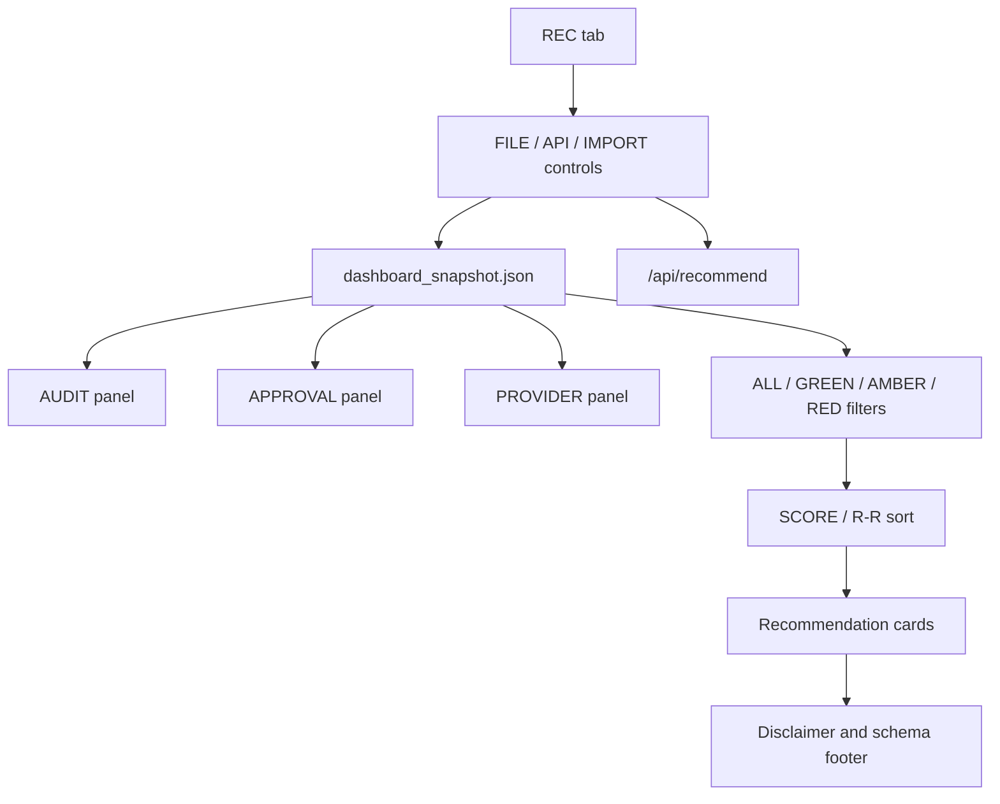

REC source and loading controls:

| Box | Shows | Source in dashboard code | User meaning | Important boundary |
|---|---|---|---|---|
| `FILE` button | Fixed file mode | `sourceMode === "file"` | Loads `public/dashboard_snapshot.json` | Uses the bundled public snapshot |
| `API` button | Backend API mode | `sourceMode === "api"` | Calls backend recommendation API | Requires API server to be running |
| `IMPORT` button | Local file upload | File input and `FileReader` | Lets user pick a real `dashboard_snapshot.json` | Import stays inside browser state |
| Source label | `IMPORTED`, `FIXED FILE`, or `API` | `importedFileName`, `sourceMode` | Shows where REC data came from | Prevents confusing file mode and API mode |
| Loading state | Loading message | `loading` state | Shows REC data is being loaded | Does not imply successful data validation |
| Error state | Error message | `error` state | Shows file/API/snapshot failure | User must fix source or backend |

REC operational summary panels:

| Panel | Shows | Source in dashboard code | User meaning |
|---|---|---|---|
| `AUDIT` | Event count, provider event count, latest ticker/status | `auditSummary` from `audit_log.jsonl` | Shows whether backend data-call evidence exists |
| `APPROVAL` | Manual review state and pending count | `approvalSummary` from approval journal and snapshot | Shows manual approval boundary |
| `PROVIDER` | Provider name, status, latest ticker | `auditSummary.latestProvider` and snapshot data | Shows which data-provider path fed REC |

REC filtering and sorting boxes:

| Box | Function |
|---|---|
| `ALL` | Shows every recommendation result in the snapshot |
| `GREEN` | Shows only `ELIGIBLE_RECOMMENDATION` and `ACCUMULATE_RECOMMENDATION` style results |
| `AMBER` | Shows review-only or watchlist candidates |
| `RED` | Shows blocked or failed candidates |
| `SORT SCORE` | Sorts cards by recommendation score |
| `SORT R/R` | Sorts cards by risk/reward ratio |

REC recommendation card boxes:

| Card box | Shows | Source field | User meaning |
|---|---|---|---|
| Ticker header | Symbol | `ticker` | Candidate being reviewed |
| Verdict badge | ELIGIBLE, ACCUMULATE, AMBER, RED, ZERO | `verdict` through `RiskGateBadge` | Gate result category |
| KEVPE badge | KEVPE regime, score, expected return, CI | `kevpe_available`, `kevpe_*` fields | Event package context if available |
| Score | Recommendation score | `recommendation_score` | Ranking strength |
| Track | Track-S or Track-L | `track` | Short-term or long-term screen |
| `Prob` | Model probability | `model_probability` | Model-side probability evidence |
| `EV` | Expected value percent | `expected_value_pct` | Estimated expected value field |
| `Entry` | Entry reference | `entry` | Reference price used by report |
| `Stop` | Stop level | `stop` | Risk boundary in the report |
| `TP2` | Target price 2 | `tp2` | Higher target reference |
| `R/R` | Risk/reward ratio | `risk_reward` | Reward compared with risk |
| `Max Pos` | Maximum position percent | `max_position_pct` | Sizing cap field |
| `Qty` | Suggested quantity | `suggested_quantity` | Analysis quantity, not an order |
| `Validations` | Passed and total confirmations | `confirmations_passed`, `confirmations_total` | Validation coverage summary |

REC footer boxes:

| Footer item | Shows | Meaning |
|---|---|---|
| Disclaimer | Snapshot disclaimer or screening boundary | Confirms report-only use |
| Schema | `schema_version` | Confirms expected snapshot format |
| Source | Snapshot source/provider fields | Helps trace data origin |

REC market mode rules:

| Market mode | REC behavior |
|---|---|
| US | FILE or API can be selected |
| KRX | API mode is forced so KRX data does not show stale US file results |
| KRX ticker display | `.KS` tickers should appear when API returns Korean market candidates |
| US ticker guard | `AAPL`, `NVDA`, `QQQ` should not appear in KRX REC results unless explicitly returned by a mixed-universe API call |

REC tab does not do these actions:

| Not performed | Reason |
|---|---|
| It does not place trades | It displays report-only screening outputs |
| It does not approve candidates automatically | Manual approval remains required |
| It does not create provider data by itself | It reads a snapshot or calls the backend API |
| It does not guarantee real-time data | Real-time behavior depends on the API server and provider response |

## 40. All Right-panel Tabs At A Glance

| Tab | Main purpose | Primary boxes | Data source | Backend call? | Trading boundary |
|---|---|---|---|---|---|
| `SIGNAL` | Quick selected-ticker backend signal evidence | Backend signal, indicators, backend evidence rows, weak-quality warning | `/api/model-scores` plus selected ticker chart data | Yes, through model evidence fetch | Report-only review |
| `MODELS` | Explain backend model evidence | Backend score, evidence metrics, threshold guide, weak-quality warning | `/api/model-scores` | Yes, through model evidence fetch | Report-only review |
| `BACKTEST` | Compare UI signal path vs buy-and-hold | Equity curve, stat boxes, recent trades | Browser-side backtest object | No | Dry-run simulation only |
| `REC` | Show backend recommendation reports | Source controls, audit/approval/provider, filters, cards | Snapshot file or API | Yes, in API mode | Report-only screening |

Cross-tab flow:

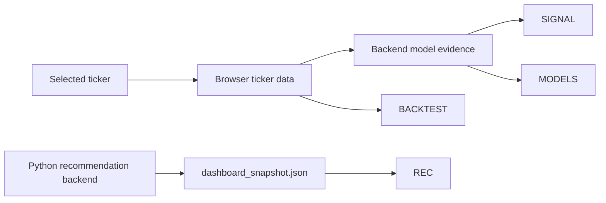

## 41. Full Box-level Verification Checklist By Tab

Use this checklist after changing dashboard layout, data bridge code, or exported snapshot format.

| Tab | Box group | Verify |
|---|---|---|
| SIGNAL | Top signal box | BUY/HOLD/SELL text, numeric score, and bar width match backend model evidence |
| SIGNAL | Indicators | RSI, MACD, BB%, EMA labels and values render without overlap |
| SIGNAL | Model evidence rows | Backend evidence rows render and show `모델 품질 낮음: 검토 전용` when evidence is weak |
| SIGNAL | Threshold text | `BUY >= 56 · HOLD 45-55 · SELL <= 44` appears for primary backend evidence |
| MODELS | Evidence summary | Final score and signal match backend model evidence |
| MODELS | Evidence metrics | `model_accuracy`, `model_auc`, and `oof_coverage` appear when backend returns them |
| MODELS | Reference lines | 56 and 44 guide lines appear in the chart |
| MODELS | Weak-quality warning | `모델 품질 낮음: 검토 전용` appears when backend evidence is weak |
| BACKTEST | Equity curve | ML and B&H lines render and do not overlap labels |
| BACKTEST | Stat boxes | ML RETURN, B&H RETURN, ALPHA, SHARPE, WIN RATE, TRADES, ML FINAL, B&H FINAL appear |
| BACKTEST | Recent trades | Last 12 trades render or an empty state is visible |
| REC | Source controls | FILE, API, IMPORT, and source label behave as expected |
| REC | Snapshot validation | Invalid snapshot shows error instead of blank panel |
| REC | Audit panel | `audit_log.jsonl` summary appears when exported |
| REC | Approval panel | Manual review and pending approval summary appear |
| REC | Provider panel | Provider name/status/latest ticker appear when available |
| REC | Filters | ALL, GREEN, AMBER, RED counts match result groups |
| REC | Sort controls | SCORE and R/R sorting reorder cards predictably |
| REC | Recommendation cards | Ticker, verdict, KEVPE, score, track, probability, EV, entry, stop, TP2, R/R, max position, quantity, validations appear |
| REC | Footer | Disclaimer, schema, and source are visible |
| REC | KRX mode | KRX API mode does not show stale US fixed-file results |

## 42. API-first Real Data Patch

This section records the approved A-option patch: API-first real data, synthetic default blocking, and static FILE warning.

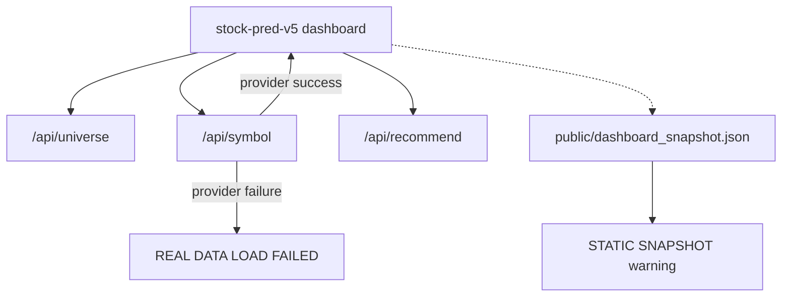

| Area | Previous behavior | Current behavior |
|---|---|---|
| Chart data | Previously allowed browser proxy/generated fallback behavior | Local backend `/api/symbol` only; failure shows a real-data error |
| Synthetic prices | Could appear automatically as `SYN` | Not automatically rendered in the dashboard chart |
| REC default | FILE mode could be the first REC source | API mode is the default REC source |
| FILE mode | Fixed public snapshot could look like normal REC data | UI shows `STATIC SNAPSHOT` warning |
| Universe list | Frontend hardcoded US/KRX lists drove the selector | Backend `/api/universe` is the primary source; `public/dashboard_config.json` provides outage-only fallback lists |
| Initial ticker | `AAPL` could appear before backend universe loaded | Initial selection follows the first API universe symbol; fallback first symbol is used only on universe API failure |
| REC API defaults | Hidden inside the request builder | API mode shows the request defaults loaded from `public/dashboard_config.json` |
| API target | Vite proxy target was hardcoded in config | `VITE_API_URL` can override the default `http://127.0.0.1:5151` |

Runtime config now owns fallback symbols, chart period, model-score defaults, REC defaults, signal thresholds, and model-quality warning thresholds.

Verification focus:

| Check | Expected result |
|---|---|
| `/api/universe?market=US` | Returns backend-owned US symbols |
| `/api/universe?market=KRX` | Returns backend-owned KRX symbols |
| Chart API failure | Center panel shows `REAL DATA LOAD FAILED` |
| REC FILE mode | Shows `STATIC SNAPSHOT` warning |
| REC API mode | Calls `/api/recommend` through `VITE_API_URL` or the Vite proxy and shows request defaults |

## 43. Implementation Evidence Update - 2026-05-05

This append-only update records the final dashboard behavior and verification evidence for the 2026-05-05 implementation pass.

| Area | Final behavior or evidence |
|---|---|
| SIGNAL weak model quality | Shows `모델 품질 낮음: 검토 전용` when `model_auc < 0.50`, `model_accuracy < 0.50`, or `oof_coverage < 0.70` |
| MODELS weak model quality | Shows `모델 품질 낮음: 검토 전용` when `model_auc < 0.50`, `model_accuracy < 0.50`, or `oof_coverage < 0.70` |
| Signal thresholds | Displays `BUY >= 56 · HOLD 45-55 · SELL <= 44` |
| Browser evidence | Screenshots and JSON outputs are stored under `output/playwright` |
| Browser tests | Playwright tests passed |
| Build check | `npm run build` passed |
| Trading boundary | No broker, order, or account behavior was added or changed |
| Dependencies | No dependency change was made |

## 44. Hedge-Fund Upgrade — New Component Architecture (P0–P8, 2026-05-08)

This section documents the new components added by the 8-phase hedge-fund-grade upgrade. All existing sections above remain valid; this section describes the new system layer.

### 44.1 Full Architecture Overview (P0–P8)

```mermaid
flowchart LR
    subgraph Sources
        KIS[KIS OpenAPI]
        ALP[Alpaca paper/live]
        IB[IBKR ib_insync]
        YF[yfinance/pykrx/FDR]
        NEWS[RSS/SEC-EDGAR/NaverNews]
    end
    subgraph P1["P1: PIT Data Lake"]
        DUC[(DuckDB+Parquet<br/>bitemporal)]
        PIT[pit_resolver.as_of]
        CA[corp_actions adjuster]
        UNI[universe snapshots]
    end
    subgraph P2P3["P2-3: Research"]
        FZ[factor_zoo Alpha101/158]
        RDA[RD-Agent auto-mining]
        ENS[LGBM/XGB/LR ensemble]
        MLF[(MLflow registry)]
        OPT[Optuna HPO]
    end
    subgraph P4P5["P4-5: Portfolio + Risk"]
        SKF[skfolio HRP/NCO/CVaR]
        BT[backtester + vectorbt sweep]
        STR[stress 2008/2020/2022]
    end
    subgraph P6["P6: LLM Advisor"]
        CL[claude-opus-4-7]
        NA[NewsSentiment]
        DA[DevilsAdvocate]
        MA[MacroRegime]
        ADJ[advisory_score -1..+1]
    end
    subgraph Decision
        RE[RecommendationEngine<br/>GREEN / AMBER / RED]
    end
    subgraph P7P8["P7-8: Ops + Exec"]
        PRE[Prefect daily/weekly flows]
        OR[OrderRouter kill-switch]
    end

    Sources --> P1 --> P2P3 --> P4P5 --> Decision
    NEWS --> P6 --> Decision
    Decision --> P7P8
    P7P8 --> ALP & IB & KIS
    MLF -.audit.-> Decision
```

### 44.2 Prefect Flow Layout (P7)

| Flow | File | Schedule | DAG steps |
|---|---|---|---|
| `daily_krx_flow` | `flows/daily_krx.py` | 16:30 KST Mon–Fri | ingest_kis → corp_actions → factor_compute → model_predict → optimize → recommend → snapshot → alert |
| `daily_us_flow` | `flows/daily_us.py` | 16:30 ET Mon–Fri | ingest_alpaca → factor_compute → model_predict → optimize → recommend → snapshot → alert |
| `research_weekly_flow` | `flows/research_weekly.py` | Sat 02:00 UTC | factor_mining → hpo → promotion_gate |

```mermaid
flowchart LR
    Prefect[Prefect scheduler] --> KRX[daily_krx_flow<br/>16:30 KST]
    Prefect --> US[daily_us_flow<br/>16:30 ET]
    Prefect --> RW[research_weekly_flow<br/>Sat 02:00 UTC]

    KRX --> Ingest[ingest_kis_task]
    Ingest --> Factor[factor_compute_task]
    Factor --> Predict[model_predict_task]
    Predict --> Opt[portfolio_optimize_task]
    Opt --> Rec[recommend_task]
    Rec --> Snap[snapshot_dashboard_task]
    Snap --> Alert[alert_task]

    RW --> Mining[factor_mining_task]
    Mining --> HPO[hpo_task]
    HPO --> Gate[promotion_gate_task]
    Gate -->|delta > 5%| MLflow[(MLflow Production)]
```

### 44.3 LLM Advisor Layer (P6)

```mermaid
flowchart LR
    subgraph Advisors["advisors/orchestrator.py LangGraph DAG"]
        NS[NewsSentimentAgent<br/>RSS/SEC/NaverNews]
        DA[DevilsAdvocateAgent<br/>SHAP factor counter-arg]
        MA[MacroRegimeAgent<br/>T10Y2Y/VIX/DXY]
        WA[weighted_average<br/>advisory_score -1..+1]
    end
    NS --> WA
    DA --> WA
    MA --> WA
    WA --> RE[RecommendationEngine]
    WA --> AUD[audit_log/advisor.jsonl]

    RE -->|score*0.85 + advisory*15| Final[final_score 0..100]
    Final -->|threshold unchanged| Verdict[GREEN / AMBER / RED]
```

Boundary rule: `advisory_score` **never overrides** the deterministic gate. LLM can only downgrade GREEN→AMBER. RED stays RED.

### 44.4 Broker Layer (P8)

```mermaid
flowchart TD
    Paper[paper CLI --broker paper] --> PaperBroker[PaperBroker ← preserved]
    CLI[--broker alpaca/ibkr/kis] --> Router[OrderRouter SOR]

    Router --> Check{KILLED file?}
    Check -->|yes| Block[reject all orders]
    Check -->|no| Compliance[compliance.py pre-gate]
    Compliance -->|pass| SOR{ticker suffix}
    SOR -->|*.KS/*.KQ| KIS[KISAdapter]
    SOR -->|US primary| Alpaca[AlpacaAdapter]
    SOR -->|US fallback| IBKR[IBKRAdapter]

    Router --> Reconcile[reconciliation.py 60s diff]
    Reconcile -->|mismatch| Pause[pause new orders + alert]
```

| Adapter | File | Paper env | Live env |
|---|---|---|---|
| Alpaca | `broker/alpaca_adapter.py` | `paper=True` | `paper=False` |
| IBKR | `broker/ibkr_adapter.py` | TWS port 7497 | TWS port 7496 |
| KIS | `broker/kis_adapter.py` | mock mode | `~/.config/stock_1901/kis.toml` |

### 44.5 PIT Data Lake (P1)

```mermaid
flowchart TD
    LP[load_ohlcv_with_provider] --> LakeFirst{lake hit?}
    LakeFirst -->|hit| PIT[pit_resolver.read<br/>as_of filter]
    LakeFirst -->|miss + as_of is None| LiveFetch[live provider fallback]
    LakeFirst -->|miss + as_of != None| Error[RuntimeError<br/>no look-ahead allowed]
    LiveFetch --> WriteThrough[write_through to DuckDB]
    WriteThrough --> PIT
    PIT --> Result[ProviderResult]
```

### 44.6 Component Ownership Update (P0–P8)

| Component | File | Added responsibility |
|---|---|---|
| `PITStore` / `DuckDBStore` | `data_lake/store.py` | Bitemporal OHLCV; `_ingested_at`-aware dedup |
| `PurgedKFold` | `ml/cv.py` | Embargo-based CV; post-test purge loop |
| `FactorRegistry` | `factors/factor_zoo.py` | 70+ factor catalog; `register/compute_all` |
| `portfolio.optimize()` | `portfolio/optimizer.py` | skfolio HRP/NCO/CVaR/BL; PyPortfolioOpt fallback |
| `AdvisoryOrchestrator` | `advisors/orchestrator.py` | LangGraph DAG; advisory score aggregation |
| `OrderRouter` | `broker/order_router.py` | SOR + TWAP/VWAP; kill-switch; broker routing |
| `daily_krx_flow` | `flows/daily_krx.py` | End-to-end KRX daily automation |
| `research_weekly_flow` | `flows/research_weekly.py` | Research automation + MLflow promotion gate |

### 44.7 Fitness and Compliance Checks

Run these after any component change:

```bash
# Syntax
python -m compileall src/stock_rtx4060 flows tests

# Tests
PYTHONPATH=.:src pytest --cov=stock_rtx4060 --cov-fail-under=75 --tb=short -q

# CLI invariants
PYTHONPATH=.:src python main.py recommend --help
PYTHONPATH=.:src python main.py backtest --help
PYTHONPATH=.:src python main.py paper --help

# Dashboard snapshot schema still valid
PYTHONPATH=.:src python -c "
from stock_rtx4060.dashboard_bridge import build_dashboard_snapshot
import json
snap = build_dashboard_snapshot({'results': [], 'config': {}})
assert snap['schema_version'] == 'dashboard_snapshot.v1'
print('schema OK')
"

# Dependency conflicts
pip check
```

| Gate | Pass condition |
|---|---|
| `compileall` | Exit 0 |
| `pytest --cov-fail-under=75` | All pass, ≥75% coverage |
| CLI help for all subcommands | Exit 0 |
| `screening_output_only=True` | On every recommendation result |
| `dashboard_snapshot.v1` | `schema_version` always present |
| `numpy>=1.26,<3.0` | Never re-pinned to `<2.0` |
| `shap>=0.50.0` | xgboost 3.x compat |
| Advisory boundary | Score ∈ [-1,+1]; no GREEN/AMBER upgrade |
| Kill switch | Checked before every live order |
| PIT as_of guard | `RuntimeError` on lake-miss with `as_of!=None` |
| PurgedKFold groups | `groups=` always passed to `cv.split()` |
| Audit log | No existing event names removed |
| `pip check` | No broken requirements |

### 44.8 Change Impact Extension (P0–P8 additions)

| If you change | Also check |
|---|---|
| `data_lake/store.py` | `pit_resolver.py`, `data_providers.py` PIT guard, `tests/test_data_lake_store.py` |
| `ml/cv.py` PurgedKFold | `ensemble_model.py` groups array, `ml/hpo.py` groups array |
| `portfolio/optimizer.py` | `backtester.py` sizing parameter, `portfolio/views.py` LLMViews |
| `advisors/orchestrator.py` | `recommendation_engine.py` advisory blend, `advisors/audit.py` log format |
| `broker/order_router.py` | Compliance gates, `main.py cmd_paper_run` reused guard, kill-switch path |
| `flows/research_weekly.py` | `_current_production_score`, `_latest_candidate_version`, `tests/test_research_weekly_flow.py` |
| `recommendation_engine.py` `_verdict()` | Advisory boundary rule; never allow LLM to upgrade verdict |

---

## 44. Implementation Evidence Update - 2026-05-06

This append-only update records the dashboard API real-data stabilization pass.

The latest contract is:

| Component | Current behavior |
|---|---|
| Runtime config | `stock-pred-v5/public/dashboard_config.json` owns fallback lists, chart provider defaults, model-score defaults, REC defaults, signal thresholds, and model-quality warning thresholds |
| Universe selector | `/api/universe` is primary; fallback lists are screen-continuity data only |
| Chart API | `/api/symbol` is the only active chart data source; KRX `.KS` and `.KQ` symbols request `pykrx` first |
| KRX chart runtime | `005930.KS` returned `provider=pykrx`, `row_count=729`, and `last_date=2026-05-06` through `http://127.0.0.1:5174/api/symbol?...` |
| Model evidence | `/api/model-scores` uses `model_kind=auto` by default and sends `use_lstm=1`; XGBoost/LSTM rows display backend evidence when available |
| REC API | API mode shows request defaults from runtime config; current model default is `model_kind=auto` |
| REC FILE | FILE mode reads `public/dashboard_snapshot.json` as a static saved snapshot |
| Error wording | Network/API fetch failure and provider/insufficient-row failure use separate user-facing explanations |

This update supersedes older examples in this document that mention KRX provider as `data_provider=yfinance` or model default as `logistic`.
Those older lines are retained for historical context, but the current dashboard contract is the table above.

Evidence files:

| File | Meaning |
|---|---|
| `output/playwright/dashboard-api-fallback-boundary-2026-05-06.json` | API/fallback boundary evidence |
| `output/playwright/dashboard-hardcoding-removal-2026-05-06.json` | Runtime config and hardcoding-removal evidence |
| `output/playwright/xgboost-lstm-applied-2026-05-06.json` | XGBoost/LSTM evidence |
| `output/playwright/krx-chart-provider-fix-2026-05-06.json` | KRX chart provider and error wording evidence |
| `docs/DASHBOARD_API_REALDATA_UPDATE_SUMMARY_2026-05-06.md` | Human-readable summary |

## 45. Investment Readiness Component Layout - 2026-05-07

This append-only update records the component layout for the dashboard's investment-readiness grade.

The grade is a screen-level review aid.
It does not approve broker execution.
It does not remove the manual review boundary.

```mermaid
flowchart TD
    StockPredV5["stock-pred-v5/src/StockPredV5.jsx"]
    SignalGrade["실제 투자 반영 가능 등급"]
    DataFreshness["DATA FRESHNESS"]
    ModelQuality["MODEL QUALITY"]
    BacktestGate["BACKTEST"]
    RiskGate["RISK PLAN"]
    ManualReview["MANUAL REVIEW"]

    RecPanel["src/components/RecommendationPanel.jsx"]
    ProviderSummary["snapshot.provider_summary"]
    RecCard["src/components/RecommendationCard.jsx"]
    CandidateGrade["INVESTMENT GRADE"]

    StockPredV5 --> SignalGrade
    SignalGrade --> DataFreshness
    SignalGrade --> ModelQuality
    SignalGrade --> BacktestGate
    SignalGrade --> RiskGate
    SignalGrade --> ManualReview

    RecPanel --> ProviderSummary
    ProviderSummary --> RecCard
    RecCard --> CandidateGrade
    CandidateGrade --> DataFreshness
    CandidateGrade --> ModelQuality
    CandidateGrade --> BacktestGate
    CandidateGrade --> RiskGate
    CandidateGrade --> ManualReview
```

### Component responsibilities

| Component | File | Current role |
|---|---|---|
| Selected ticker readiness panel | `stock-pred-v5/src/StockPredV5.jsx` | Builds `실제 투자 반영 가능 등급` for the active chart ticker. |
| Recommendation readiness builder | `stock-pred-v5/src/components/RecommendationCard.jsx` | Builds per-candidate `INVESTMENT GRADE` from provider summary and result evidence. |
| REC provider summary handoff | `stock-pred-v5/src/components/RecommendationPanel.jsx` | Passes `snapshot.provider_summary` into every candidate card. |
| REC readiness regression | `stock-pred-v5/tests/dashboard-api-fallback-boundary.spec.js` | Verifies candidate cards show comparable readiness grades. |
| SIGNAL readiness regression | `stock-pred-v5/tests/model-quality-warning.spec.js` | Verifies the selected ticker readiness panel and evidence gates. |

### Grade labels

| Grade | User-facing meaning |
|---|---|
| `반영 금지` | Do not reflect this candidate into an investment workflow. |
| `검토 전용` | Use as review material only. |
| `조건부 반영 가능` | Candidate can enter manual investment review, but it is not a buy/sell order. |

### Box-level verification additions

| Tab | Box group | Verify |
|---|---|---|
| SIGNAL | Investment readiness panel | `실제 투자 반영 가능 등급` appears with DATA FRESHNESS, MODEL QUALITY, BACKTEST, RISK PLAN, and MANUAL REVIEW gates. |
| REC | Candidate readiness block | Each recommendation card can show `INVESTMENT GRADE`. |
| REC | Candidate grade labels | Grade text is one of `반영 금지`, `검토 전용`, or `조건부 반영 가능`. |
| REC | Manual boundary | Candidate grade does not imply broker/order/account execution. |

Latest verification commands recorded for this layout:

```powershell
cd C:\Users\jichu\Downloads\주식\stock-pred-v5
npx playwright test tests/dashboard-api-fallback-boundary.spec.js -g "REC candidate cards show" --reporter=line
npx playwright test tests/dashboard-api-fallback-boundary.spec.js tests/model-quality-warning.spec.js tests/kevpe-dashboard.spec.js --reporter=line
npm run build
```

Latest browser evidence:

| File | Meaning |
|---|---|
| `stock-pred-v5/test-results/dashboard-rec-investment-grade-20260507.png` | REC tab rendered `INVESTMENT GRADE`; `REAL DATA LOAD FAILED` and loading state were not present in the captured state. |
