# Stock Research Workspace

<!-- root-pinned: keep this file at C:\Users\jichu\Downloads\주식\README.md -->

Local stock research, recommendation screening, and dashboard evidence system.

This repository is not a live auto-buy system. The current operating posture is research, watchlist, paper trading, and dashboard monitoring until investment-readiness gates pass.

## Current Operating Verdict

| Field | Current policy |
|---|---|
| Live investment status | `AMBER WATCHLIST` |
| New capital | `new_capital_allowed=false` |
| Execution mode | `paper_trading_only=true` |
| Raw model score | Preserved for audit and research |
| Investment readiness score | Capped at 44 when model quality or honesty gates fail |
| Allowed use | Research, watchlist, paper trading, dashboard monitoring |
| Blocked use | Live capital, broker order execution, automatic buy/sell |

The system can rank candidates and explain why a symbol belongs on a watchlist. It must not be treated as permission to deploy new live capital when Accuracy, AUC, Alpha, completed-trade count, backtest honesty, cost survival, embargo stress, or advisor audit consistency gates fail.

## What It Does

| Area | Capability |
|---|---|
| Recommendation engine | Builds candidate recommendations from OHLCV, features, model scores, risk rules, and optional advisor evidence |
| Investment readiness | Applies `backtest_honesty`, 3x cost survival, embargo stress, advisor audit consistency, and model quality gates |
| Dashboard | Shows READY, READINESS, LIVE, PAPER, blocking reasons, model evidence, and advisor state |
| Model scores | Computes ensemble, LogReg, XGBoost, GRU/RNN, and optional LSTM evidence |
| Advisor layer | LiteLLM gateway, MiniMax API, Anthropic claude-opus-4-7. MLflow LLM span tracing via `USE_MLFLOW_TRACING=true` (`_wrap_with_mlflow_span`) |
| Data and validation | synthetic, yfinance, OpenBB optional, chaos tests, Hypothesis PBT, DuckDB 1.5.3, DuckLake feature flag. PBO(`backtest_honesty_summary.pbo_status`) in dashboard |
| Automation | `daily_krx_flow` 9단계 (Prefect, 16:30 KST). `forward_tracking_task` — `AutoForwardRecorder.record_today()` 자동 실행. `FORWARD_TRACKING_ENABLED` flag |
| Reliability fixes | GAP-01~05 paper-trading checks, MLflow 3.x `log_input()`, Windows CP949 fix, `/api/model-scores` 90s timeout, optimizer `max_weight` clamp, Optuna journal storage |

## Operating Flow

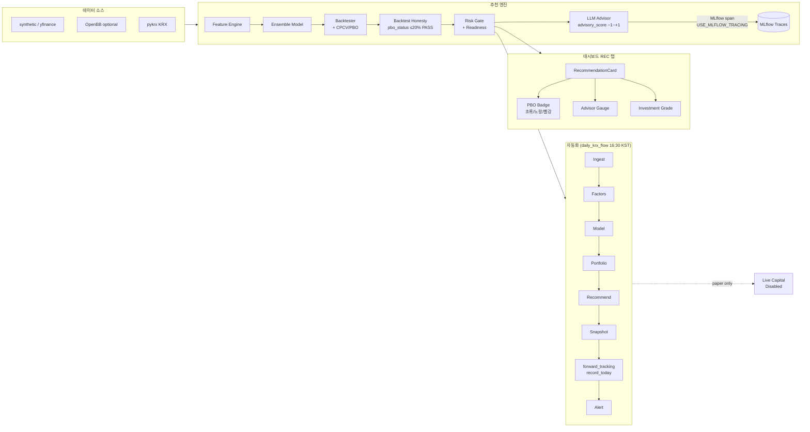

## Data Contract Type Graph

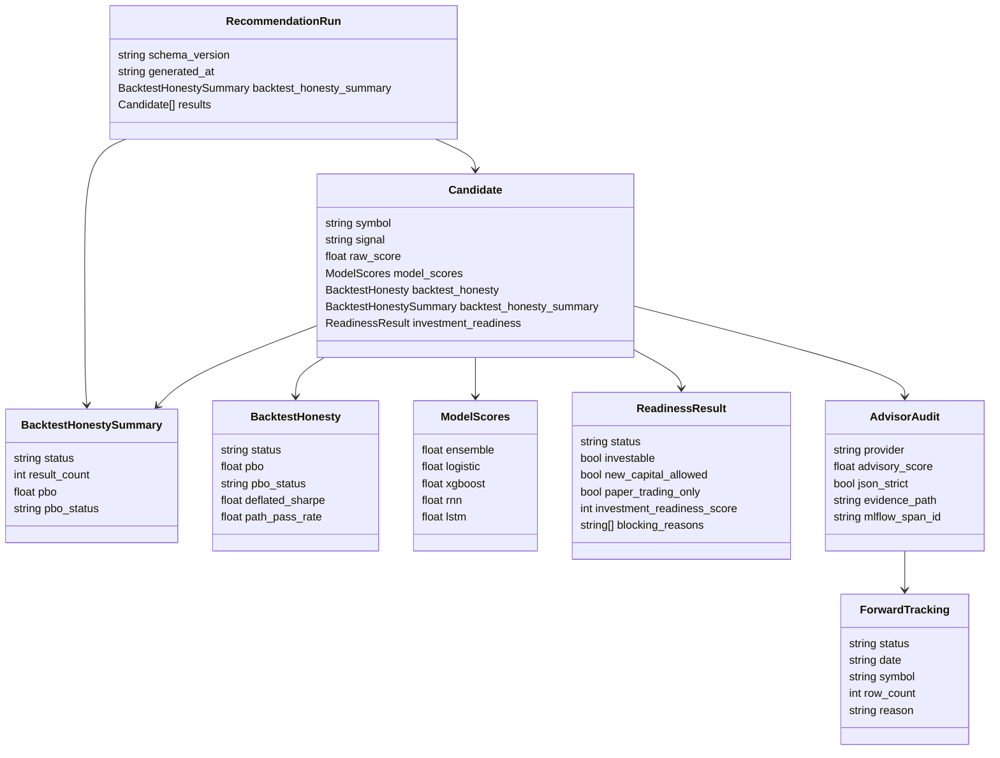

This classDiagram is a README-level type map for readers. Wave 3 additions: `pbo`/`pbo_status` on `BacktestHonesty` and `BacktestHonestySummary`, `mlflow_span_id` on `AdvisorAudit`, new `ForwardTracking` class. Does not claim a one-to-one match with every Python class.

## Quick Start

Run commands from `C:\Users\jichu\Downloads\주식\stock_1901`.

```powershell
py -3.12 main.py --help
py -3.12 main.py self-test
```

Preview the local API and dashboard:

```powershell
py -3.12 preview_server.py
```

Generate a recommendation report and dashboard snapshot:

```powershell
.\run.ps1 recommend --synthetic --universe "SYNTH-A,SYNTH-B" --top 2 --model-kind logistic --output-dir reports\quickstart_recommend
.\run.ps1 dashboard-export --recommendation-json reports\quickstart_recommend\recommendations_algo_v2_*.json --output reports\quickstart_recommend\dashboard_snapshot.json
```

Run the investment readiness benchmark:

```powershell
py -3.12 tools\investment_readiness_benchmark.py --input recommendations_algo_v2_*.json --output reports\investment_readiness --format json
```

Targeted verification:

```powershell
py -3.12 -m pytest tests\test_investment_readiness_benchmark.py tests\test_dashboard_bridge.py tests\test_api_model_scores.py -q
py -3.12 -m ruff check src\stock_rtx4060\dashboard_bridge.py tests\test_dashboard_bridge.py
```

Release verification is heavier and should be run before publishing a release:

```powershell
py -3.12 -m pytest -q
py -3.12 -m ruff check .
```

## Evidence and Historical Notes

The remaining sections preserve the longer root overview, architecture notes, and append-only documentation evidence generated during previous repository scans.

## 1. One-page Summary

| 질문 | 답 |
|---|---|
| 이 프로그램은 무엇인가 | 주식 후보를 분석하고, 추천 후보 리포트와 대시보드 표시용 snapshot을 만드는 로컬 주식 연구 시스템 |
| 실제 실행 중심은 어디인가 | `stock_1901/` Python 추천 엔진 (P0-P8 hedge-fund grade) |
| 화면은 어디에 있는가 | `stock-pred-v5/` React/Vite 대시보드 |
| 추천 결과는 어떻게 화면에 연결되는가 | `dashboard_snapshot.v1` 파일 또는 Flask API `/api/recommend` |
| 데이터는 어디서 오는가 | synthetic, yfinance, optional OpenBB provider |
| 감사 로그는 있는가 | provider 호출은 `audit_log.jsonl`로 남김 |
| 주문 실행이 있는가 | 없음. broker 주문, auto-buy, account write는 시스템 경계 밖 |
| Continue는 무엇인가 | `continue-main/`은 주식 runtime이 아니라 품질 게이트와 IDE/agent 참고 프로젝트 |

## 2. System Diagram

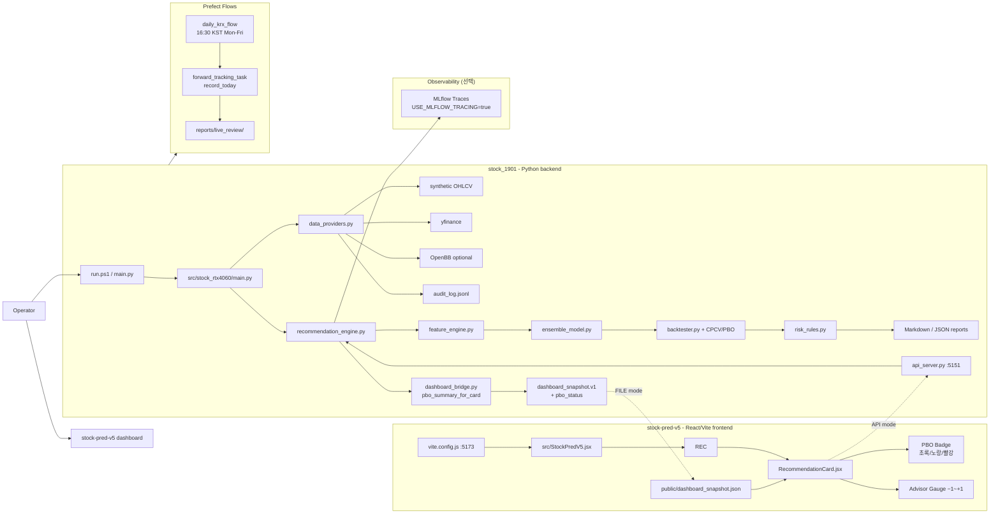

## 3. Root Folder Roles

| Path | Role | Details included here |
|---|---|---|
| `stock_1901/` | Active recommendation backend (P0-P8) | CLI, providers, audit, reports, ops, dashboard bridge, Flask API, ML, portfolio, broker adapters |
| `stock-pred-v5/` | Active dashboard frontend | React UI, Vite server, REC tab, FILE/API modes, build commands |
| `continue-main/` | Reference monorepo | Continue IDE/CLI architecture, checks, agents, MCP docs, not stock runtime |
| `docs/` | Root history and validation docs | Past move plans, root audits, Mermaid checks, setup notes |
| `reports/` | Root-generated evidence | Benchmarks, validations, recommendation reports, runtime outputs |
| `_consolidation_audit/` | Consolidation evidence | Historical copy/merge/exclusion evidence |
| `_delete_audit/` | Delete audit evidence | Approved deletion audit records |
| `archive/original_inputs/` | Original input archive | Original zip/input evidence |

## 4. Backend: `stock_1901`

`stock_1901` is a hedge-fund-grade stock screening, backtesting, and advisory system (P0–P8). It keeps active source under `src/stock_rtx4060/`.

### Backend entry points

| Entry | Actual file | Purpose |
|---|---|---|
| Windows wrapper | `run.ps1` | Chooses `.venv\Scripts\python.exe` first, then Python 3.12, Python 3.11, global `python` |
| Root Python wrapper | `main.py` | Adds `src/` to import path and dispatches package CLI |
| Package CLI | `src/stock_rtx4060/main.py` | Defines all CLI commands |
| API server | `api_server.py` | Local Flask API on `127.0.0.1:5151` (CORS: localhost 5173/4173/5151) |
| Preview server | `preview_server.py` | Starts Flask API and Vite dashboard together |

### Backend commands

| Command | What it does | Main outputs |
|---|---|---|
| `env` | Runtime/GPU environment status | `reports/runtime_status.json` |
| `benchmark` | Synthetic CPU/GPU benchmark | benchmark Markdown/JSON |
| `report` | Daily brief/risk reports from CSV or synthetic data | Markdown/JSON reports |
| `predict` | Train/predict from CSV or yfinance | CLI JSON output |
| `recommend` | Track-S/Track-L recommendation scan | recommendation Markdown/JSON and `audit_log.jsonl` |
| `ops-v1` | Manual review workflow packet | recommendation, daily brief, approval template, ZERO log, summary JSON |
| `dashboard-export` | Convert recommendation JSON to dashboard snapshot | `dashboard_snapshot.json` |
| `demo` | Generate sample workspace data and reports | sample CSV and report files |
| `journal` | Append manual decision journal row | journal CSV |
| `self-test` | Internal smoke test | CLI PASS/diagnostic output |

### Backend modules

| Module | Responsibility |
|---|---|
| `feature_engine.py` | Builds technical indicator features such as moving averages, RSI/MACD/Bollinger-style indicators, and model inputs |
| `ensemble_model.py` | Runs model path with XGBoost/LogisticRegression-style backends and walk-forward validation behavior documented in package docs |
| `backtester.py` | Produces dry-run backtest evidence |
| `risk_rules.py` | Applies Track-S/Track-L risk and verdict gate logic |
| `recommendation_engine.py` | Orchestrates provider data, features, model evidence, backtest evidence, risk gates, ranking, and report writing |
| `data_providers.py` | Routes OHLCV loading through `auto`, `synthetic`, `yfinance`, or `openbb` |
| `audit_log.py` | Writes masked JSONL audit events |
| `dashboard_bridge.py` | Builds `dashboard_snapshot.v1` from recommendation JSON |
| `ops_workflow.py` | Writes daily brief, manual approval template, ZERO log, and workflow summary |
| `mcp_adapter.py` | Phase 1 read/report-only adapter contract; does not start an MCP server |
| `reports.py` | Shared Markdown/JSON/CSV report helpers |

## 5. Data Provider And Audit Flow

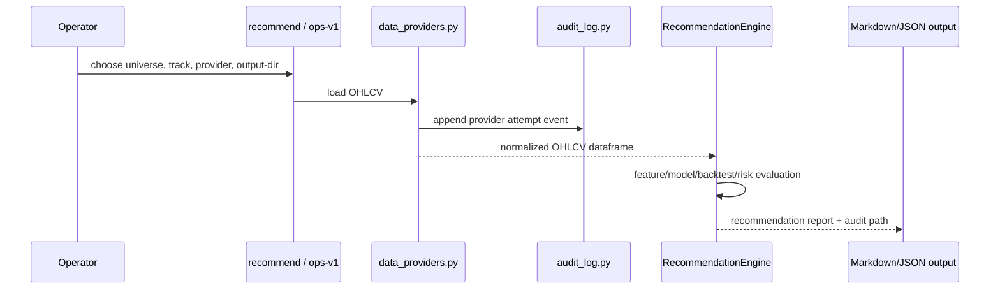

| Provider | Meaning | Dependency |
|---|---|---|
| `synthetic` | Deterministic local OHLCV for offline validation | No internet |
| `yfinance` | Existing direct market data path | `yfinance>=0.2.66` |
| `openbb` | Optional OpenBB historical equity endpoint using `provider="yfinance"` | `requirements-openbb.txt` |
| `auto` | Config/default provider mode where CLI can override config | `config/data_providers.example.json` when supplied |

The audit log records provider attempts, status, command, ticker, period, endpoint when applicable, duration/error metadata, and masked sensitive values.

## 6. Recommendation Contract

The backend is designed around report-only screening.

| Track | Meaning | Review boundary |
|---|---|---|
| Track-S | Shorter-term candidate screening | Requires score/risk/model/backtest gates and manual review |
| Track-L | Longer-term accumulation screening | Requires stronger score/evidence and manual thesis review |

Verdict families:

| Verdict family | Meaning |
|---|---|
| `ELIGIBLE_RECOMMENDATION` | Candidate passed the active screening gate but is still review-only |
| `ACCUMULATE_RECOMMENDATION` | Candidate passed accumulation-style screening but is still review-only |
| `AMBER_*` | Watchlist/review-only |
| `RED_*` | Blocked or not recommended |
| `ZERO_*` | Hard block, such as no data or failed risk plan |

Safety fields and behaviors:

| Field or behavior | Required meaning |
|---|---|
| `screening_output_only=True` | The output is not a trade instruction |
| `manual_approval_required=True` | Human review is required before action |
| `broker_order_execution=False` | No broker order path is active |
| ZERO log | Records blocked actions such as auto-buy or broker execution |

## 7. Dashboard: `stock-pred-v5`

`stock-pred-v5` is a Vite/React dashboard for US/KRX market visualization and backend recommendation display.

### Dashboard structure

| Area | File | Role |
|---|---|---|
| React mount | `stock-pred-v5/src/main.jsx` | Mounts the app |
| Main dashboard | `stock-pred-v5/src/StockPredV5.jsx` | Owns tabs, state, browser-side charts, REC tab placement |
| REC panel | `stock-pred-v5/src/components/RecommendationPanel.jsx` | Loads FILE/API recommendation snapshots, filters, sorts |
| Recommendation card | `stock-pred-v5/src/components/RecommendationCard.jsx` | Shows ticker, verdict, score, entry, stop, TP2, R/R, validation summary, PBO badge |
| PBO badge | `RecommendationCard.jsx` → `PboBadge` | 백테스트 과적합 확률 뱃지 (PASS/AMBER/RED/NO_DATA, WCAG AA) |
| Risk badge | `stock-pred-v5/src/components/RiskGateBadge.jsx` | Maps verdict labels to visual badges |
| Static sample | `stock-pred-v5/public/dashboard_snapshot.json` | FILE mode saved snapshot, not live market data |
| Vite config | `stock-pred-v5/vite.config.js` | Runs on port `5173` and proxies `/api` to `127.0.0.1:5151` |

### Dashboard data modes

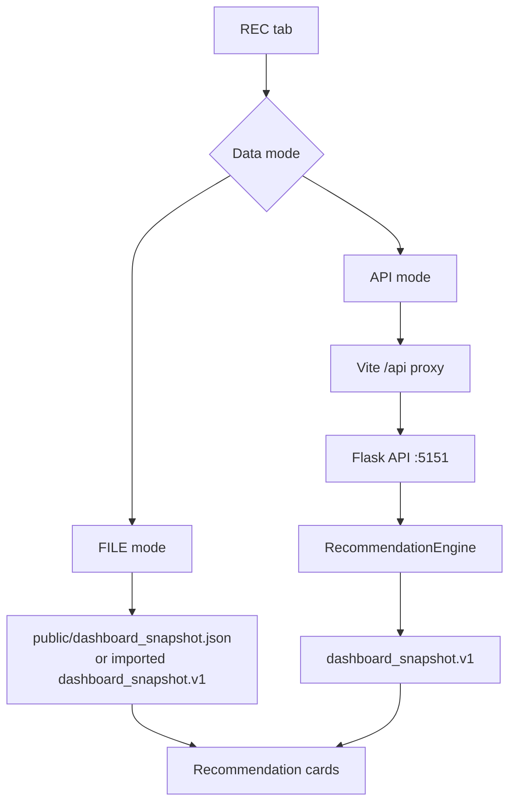

| Mode | How it works | When to use |
|---|---|---|
| FILE | Browser reads `dashboard_snapshot.json` | No backend server needed; static saved snapshot only |
| API | Browser calls `/api/recommend`, Vite proxies to Flask `:5151` | Live local backend recommendation run with visible request defaults |
| Preview | `preview_server.py` starts both API and Vite | One-command local preview |

## 8. API And Snapshot Contract

Flask API endpoints from `api_server.py`:

| Endpoint | Purpose |
|---|---|
| `GET /api/health` | Health check |
| `GET /api/recommend` | Runs recommendation engine and returns `dashboard_snapshot.v1` |
| `GET /api/snapshot?path=X` | Converts an existing recommendation JSON into a snapshot response |

`dashboard_bridge.py` requires these source result fields before building a dashboard snapshot:

| Group | Fields |
|---|---|
| Identity | `ticker`, `track`, `verdict` |
| Ranking/model | `recommendation_rank_score`, `direction_prob`, `expected_value_pct` |
| Risk plan | `entry`, `stop`, `tp2`, `risk_reward` |
| Safety/evidence | `screening_output_only`, `validations` |

Snapshot output includes rank, ticker, track, verdict, score, probability, expected value, entry, stop, TP1/TP2 where available, risk/reward, risk budget, max position, suggested quantity, model/backtest evidence, validation checks, reasons, source JSON path, and audit log path.

## 9. Continue Reference Role

`continue-main/` is not the stock program runtime. Its own architecture document describes:

| Continue area | Meaning |
|---|---|
| `core/` | TypeScript core runtime, config, indexing, diff, vendor integrations |
| `extensions/` | VS Code, JetBrains, and CLI surfaces |
| `gui/` | React chat UI |
| `binary/` | Rust/C++ autocomplete engine |
| `docs/` | Mintlify documentation |
| `.continue/` | agents, checks, prompts, and rules |

In this stock workspace, Continue is useful as a reference for quality gates and future review automation. It is not imported by `stock_1901` at runtime and it does not run the recommendation engine.

## 10. Setup And Run Commands

Python backend:

```powershell
cd C:\Users\jichu\Downloads\주식\stock_1901
py -3.12 -m venv .venv
.\.venv\Scripts\python.exe -m pip install --upgrade pip
.\.venv\Scripts\python.exe -m pip install -r requirements.txt
.\run.ps1 self-test
```

Optional OpenBB:

```powershell
cd C:\Users\jichu\Downloads\주식\stock_1901
.\.venv\Scripts\python.exe -m pip install -r requirements-openbb.txt
.\run.ps1 recommend --data-provider openbb --provider-config config/data_providers.example.json --universe "AAPL" --top 1 --output-dir reports\recommendations_openbb_cache_smoke
```

Recommendation and snapshot:

```powershell
cd C:\Users\jichu\Downloads\주식\stock_1901
.\run.ps1 recommend --data-provider synthetic --universe "SYNTH-A,SYNTH-B" --top 2 --model-kind logistic --cv-gap 5 --output-dir reports\recommendations
.\run.ps1 dashboard-export --recommendation-json reports\recommendations\recommendations_algo_v2_YYYYMMDD_HHMMSS.json --output reports\recommendations\dashboard_snapshot.json
```

Dashboard:

```powershell
cd C:\Users\jichu\Downloads\주식\stock-pred-v5
npm install
npm run dev
npm run build
```

Integrated preview:

```powershell
cd C:\Users\jichu\Downloads\주식\stock_1901
.\.venv\Scripts\python.exe preview_server.py
```

## 11. Outputs And Where They Go

| Output | Location |
|---|---|
| Recommendation Markdown/JSON | `reports/recommendations*/` |
| Provider audit log | `reports/**/audit_log.jsonl` |
| Ops v1 daily brief | `reports/ops_v1*/ops_v1_daily_brief_*.md` |
| Approval journal template | `reports/ops_v1*/approval_journal_template.csv` |
| ZERO log | `reports/ops_v1*/zero_log.md` and `.csv` |
| Dashboard snapshot | `dashboard_snapshot.json` from `dashboard-export` or API |
| Dashboard build | `stock-pred-v5/dist/` |
| Browser verification | `reports/dashboard_browser_verification/` |
| Consolidation evidence | `_consolidation_audit/` |
| Deletion audit evidence | `_delete_audit/` |

## 12. Safety And Security

| Boundary | Status |
|---|---|
| Broker API | Not part of active architecture |
| Auto buy/sell | ZERO / out of scope |
| Account write | Not present |
| Margin/options | ZERO / out of scope |
| Secrets in docs | Must not be printed |
| Provider credentials | Must stay outside committed docs/reports |
| Market/model output | Treated as data, not instructions |
| Human approval | Required before any real-world action |

## 13. Validation Commands

Use these before claiming the workspace is healthy:

```powershell
cd C:\Users\jichu\Downloads\주식\stock_1901
.\.venv\Scripts\python.exe main.py --help
.\.venv\Scripts\python.exe -m pytest -q
.\run.ps1 tensorflow-check
```

```powershell
cd C:\Users\jichu\Downloads\주식\stock-pred-v5
npm run build
```

Expected current baseline from local docs and recent verification:

| Check | Expected |
|---|---|
| Backend CLI help | Lists `env`, `benchmark`, `report`, `predict`, `recommend`, `ops-v1`, `dashboard-export`, `demo`, `journal`, `self-test` |
| Backend tests | **1,210 tests pass (2026-05-10)**, up from 509 tests |
| Test coverage | TOTAL **85.82% (2026-05-10)**; target ≥85% ✅ |
| TensorFlow CPU/LSTM smoke | `.\run.ps1 tensorflow-check` prints `TF_VERSION=2.21.0`, CPU device, `LSTM_SMOKE=PASS` |
| Dashboard build | Vite build succeeds; chunk-size warning may appear |

## 14. Root Documents

These three root documents intentionally overlap so each can be read on its own:

| Document | Main purpose |
|---|---|
| `README.md` | First-read operational overview |
| `SYSTEM_ARCHITECTURE.md` | Full component and data-flow architecture |
| `SYSTEM_LAYOUT.md` | Folder-by-folder and file-by-file map |

Latest document cross-check on 2026-05-03 read the documentation files under the four requested roots. Cache, build, virtual environment, and Git metadata folders were excluded from the scan.

| Root scanned | Documents read | Why it matters to this README |
|---|---:|---|
| `stock_1901/` | 114+ | Confirms the active Python backend (P0-P8), CLI commands, reports, audit logs, and dashboard bridge |
| `stock-pred-v5/` | 29 | Confirms the active React/Vite dashboard, REC tab, FILE/API modes, snapshot sample, and build workflow |
| `continue-main/` | 342 | Confirms Continue is a separate IDE/CLI/MCP reference project, not the stock runtime |
| `docs/` | 32 | Confirms root-level historical plans, setup notes, layout notes, and architecture references |
| Total | 517 | The root overview, architecture, and layout documents were cross-checked against this scan |

## 15. Latest Dashboard Export Quick Start

The dashboard now has two verified REC paths. API mode calls the local Flask recommendation API first and shows the request defaults on screen. FILE mode reads the saved `stock-pred-v5/public/dashboard_snapshot.json` snapshot and labels it as static, not live market data.

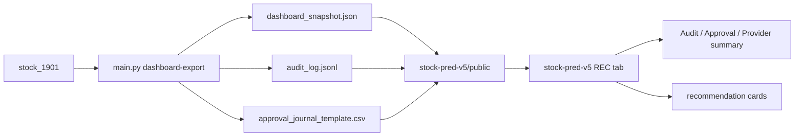

Export backend files to the dashboard:

```powershell
cd C:\Users\jichu\Downloads\주식\stock_1901
.\.venv\Scripts\python.exe main.py dashboard-export --recommendation-json .\reports\full_verify_ops_v1\recommendations\recommendations_algo_v2_20260503_151612.json --output .\reports\dashboard_public_export_smoke\dashboard_snapshot.json --public-dir ..\stock-pred-v5\public --approval-journal .\reports\full_verify_ops_v1\approval_journal_template.csv
```

Expected public files:

| File | Meaning |
|---|---|
| `stock-pred-v5/public/dashboard_snapshot.json` | Recommendation snapshot used by the REC tab. |
| `stock-pred-v5/public/audit_log.jsonl` | Audit events summarized by the REC tab. |
| `stock-pred-v5/public/approval_journal_template.csv` | Approval queue data summarized by the REC tab. |

Synthetic recommendation demo `.json` or `.md` files must not remain in `stock-pred-v5/public/`.
Demo evidence belongs outside the runtime public asset path.

Verify the dashboard view:

```powershell
cd C:\Users\jichu\Downloads\주식\stock-pred-v5
npx playwright test tests/kevpe-dashboard.spec.js --reporter=line
npm run build
npm audit
```

The REC tab currently shows recommendation cards plus Audit / Approval / Provider summary panels. This dashboard is a review surface only. It does not send orders to a broker.

## 16. Latest Phase B Backtest Honesty Quick Start

Phase B adds an evidence layer that checks whether backtest results are strong enough to trust for manual review. It does not approve trades.

```mermaid
flowchart LR
    Metrics[Backtest metrics] --> Honesty[Backtest Honesty Suite]
    Honesty --> Candidate[results[].backtest_honesty]
    Honesty --> Summary[backtest_honesty_summary]
    Summary --> Snapshot[dashboard_snapshot.v1]
    Snapshot --> Dashboard[REC tab review]
```

What changed:

| Item | Meaning |
|---|---|
| `backtest_honesty.py` | Checks OOF coverage, Sharpe floor, max drawdown, transaction-cost buffer, and walk-forward gap. |
| `results[].backtest_honesty` | Candidate-level evidence in recommendation JSON. |
| `backtest_honesty_summary` | Run-level evidence in recommendation JSON and dashboard snapshot. |
| `audit_log.jsonl` event | Adds event type `backtest_honesty_summary`. |
| Ranking behavior | Existing score functions and ranking keys are not changed. |

Run the latest verified Phase B smoke:

```powershell
cd C:\Users\jichu\Downloads\주식\stock_1901
.\.venv\Scripts\python.exe -m pytest -q
.\run.ps1 recommend --synthetic --universe "SYNTH-A,SYNTH-B" --top 2 --model-kind logistic --cv-gap 5 --output-dir reports\phase_b_backtest_honesty_smoke
.\run.ps1 dashboard-export --recommendation-json reports\phase_b_backtest_honesty_smoke\recommendations_algo_v2_20260503_194454.json --output reports\phase_b_backtest_honesty_smoke\dashboard_snapshot.json
```

Observed result: 30 tests passed. The Phase B dashboard snapshot contains `backtest_honesty_summary.status=AMBER`, candidate `backtest_honesty.status=AMBER`, and `screening_output_only=True`.

API note:

| Question | Answer |
|---|---|
| Does this project use FastAPI? | No. |
| Current backend API framework | Flask + flask-cors |
| API file | `api_server.py` |
| API port | `http://127.0.0.1:5151` |
| Dashboard port | `http://127.0.0.1:5173` |

## 17. Dashboard API Real Data Update - 2026-05-06

This append-only update records the latest dashboard stabilization work.

The dashboard is API-first for chart data, model evidence, universe loading, and REC API mode.
Fallback lists are UI continuity data only.
FILE mode is a static saved snapshot path.
The system remains report-only and review-only.

| Area | Current documented state |
|---|---|
| Runtime config | `stock-pred-v5/public/dashboard_config.json` owns fallback symbols, chart provider defaults, model-score defaults, REC defaults, signal thresholds, and model-quality thresholds |
| Universe | `/api/universe` is primary; fallback symbols are used only when the universe API is unavailable |
| Chart API | `/api/symbol` is the chart source; KRX `.KS` and `.KQ` symbols use `pykrx` first |
| KRX chart observation | `005930.KS` returned `provider=pykrx`, `row_count=729`, `last_date=2026-05-06`, `freshness_days=0` through the active dashboard proxy |
| Model evidence | `/api/model-scores` supports `model_kind=auto` and `use_lstm=1`; backend evidence can include XGBoost and LSTM scores |
| REC mode | API mode shows request defaults; FILE mode remains static snapshot only |
| Error wording | API/network fetch failure is separated from provider/insufficient-row failure |

Evidence files:

- `output/playwright/dashboard-api-fallback-boundary-2026-05-06.json`
- `output/playwright/dashboard-hardcoding-removal-2026-05-06.json`
- `output/playwright/xgboost-lstm-applied-2026-05-06.json`
- `output/playwright/krx-chart-provider-fix-2026-05-06.json`
- `docs/DASHBOARD_API_REALDATA_UPDATE_SUMMARY_2026-05-06.md`

Latest relevant verification:

```powershell
cd C:\Users\jichu\Downloads\주식\stock_1901
.\.venv\Scripts\python.exe -m pytest tests\test_api_model_scores.py -q -p no:cacheprovider --basetemp C:\tmp\stock-pytest-symbol-fallback-green-20260506
.\.venv\Scripts\python.exe -m py_compile api_server.py src\stock_rtx4060\data_providers.py
```

```powershell
cd C:\Users\jichu\Downloads\주식\stock-pred-v5
npx playwright test tests/dashboard-api-fallback-boundary.spec.js tests/model-quality-warning.spec.js --reporter=line
npm run build
```

## 18. Dashboard Investment Readiness Grade - 2026-05-07

The dashboard now includes an investment-readiness grade for practical review. This is a review aid, not an automatic trading instruction.

### What the grade answers

| Question | Dashboard answer |
|---|---|
| Is the data fresh enough? | Uses row count, latest date, freshness days, and provider summary. |
| Is model evidence usable? | Uses AUC, accuracy, OOF coverage, and backend model evidence where available. |
| Is backtest evidence acceptable? | Uses return and Sharpe-style evidence where available. |
| Is the risk plan usable? | Uses entry, stop, target, and risk/reward structure. |
| Is manual review still required? | Yes. The system remains `screening_output_only` and report-only. |

### Where it appears

| Screen | What changed |
|---|---|
| SIGNAL | Shows `실제 투자 반영 가능 등급` for the selected ticker. |
| REC | Shows `INVESTMENT GRADE` inside each recommendation candidate card so candidates can be compared side by side. |

### Grade labels

| Grade | Meaning for the user |
|---|---|
| `반영 금지` | Do not use this candidate in an investment workflow. |
| `검토 전용` | Keep it as review material only. More evidence or manual judgment is needed. |
| `조건부 반영 가능` | It can be considered in a manual investment review, but it is still not a buy/sell order. |

### Implementation files

| File | Meaning |
|---|---|
| `stock-pred-v5/src/StockPredV5.jsx` | Builds the selected ticker readiness panel. |
| `stock-pred-v5/src/components/RecommendationCard.jsx` | Builds each REC candidate card grade. |
| `stock-pred-v5/src/components/RecommendationPanel.jsx` | Sends provider summary evidence into each card. |
| `stock-pred-v5/tests/dashboard-api-fallback-boundary.spec.js` | Tests REC candidate card readiness display. |
| `stock-pred-v5/tests/model-quality-warning.spec.js` | Tests SIGNAL readiness display. |
| `COMPONENT_LAYOUT.md` | Documents the dashboard component placement for SIGNAL readiness and REC candidate readiness blocks. |

### Latest verification

```powershell
cd C:\Users\jichu\Downloads\주식\stock-pred-v5
npx playwright test tests/dashboard-api-fallback-boundary.spec.js -g "REC candidate cards show" --reporter=line
npx playwright test tests/dashboard-api-fallback-boundary.spec.js tests/model-quality-warning.spec.js tests/kevpe-dashboard.spec.js --reporter=line
npm run build
```

Observed result: the REC candidate readiness test passed, the dashboard regression group passed 16 tests, and the build completed with the existing chunk-size warning.

Browser evidence:

- `stock-pred-v5/test-results/dashboard-rec-investment-grade-20260507.png`

## 20. Hedge-Fund Grade Upgrade — Phase 0–8 (2026-05-08)

This section documents the systematic upgrade from a research prototype to a production-ready hedge-fund-grade system. All phases are independently deployable and rollback-safe. Existing CLI verbs and `dashboard_snapshot.v1` schema are preserved throughout.

### Phase Overview

| Phase | Area | Key deliverables |
|---|---|---|
| P0 Foundation | Observability & CI | loguru JSONL, MLflow container, prometheus-client, mypy strict, `pytest --cov-fail-under=75`, CI artifact upload |
| P1 PIT Data Lake | Point-in-time storage | `data_lake/` DuckDB+Parquet backend, `PITStore` ABC, bitemporal `as_of` queries, corp-action adjuster, KIS/Alpaca ingestors, universe snapshots |
| P2 Factor Library | Factor zoo + RD-Agent | Alpha101/Alpha158 port, Barra cross-sectional factors, RD-Agent auto-mining, IC/IR/decay analytics |
| P3 ML Upgrade | LightGBM + Optuna + MLflow | `PurgedKFold` (López de Prado §7), Optuna HPO, MLflow experiment tracking, SHAP explanations |
| P4 Portfolio Opt | skfolio HRP/NCO/CVaR | `portfolio/optimizer.py`, Black-Litterman views from LLM advisory scores, turnover-penalty costs |
| P5 Backtest | vectorbt + stat tests | `vbt_sweep.py`, block-bootstrap MC, Deflated Sharpe / PSR / MinTRL, Brinson factor attribution, stress scenarios |
| P6 LLM Advisor | Hybrid advisory layer | `advisors/` (NewsSentiment, DevilsAdvocate, MacroRegime), LangGraph DAG, `advisory_score ∈ [-1,+1]`, full audit trail |
| P7 Orchestration | Prefect 3 flows + alerts | `flows/daily_krx.py`, `flows/daily_us.py`, `flows/research_weekly.py`, Slack/Discord alert channels |
| P8 Live Brokers | Alpaca/IBKR/KIS adapters | `broker/` adapters, `OrderRouter` SOR/TWAP/VWAP, kill-switch, compliance pre-gates, reconciliation |

### Architecture Diagram (Full System)

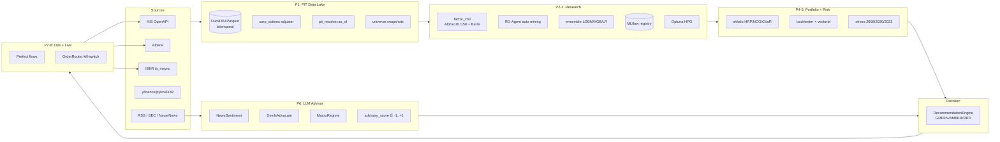

### Key Invariants (Preserved Across All Phases)

| Invariant | Rule |
|---|---|
| CLI compatibility | `main.py {env,benchmark,report,recommend,paper,ops,backtest} --help` exits 0 |
| `dashboard_snapshot.v1` schema | `schema_version` field always present; additive fields only |
| `audit_log.jsonl` | Existing event names never removed; new audit goes to separate files |
| `screening_output_only=True` | All `RecommendationResult` objects carry this flag |
| `PaperBroker` default | `broker_bridge.PaperBroker` untouched; all `paper` CLI behavior preserved |
| LLM advisory boundary | `advisory_score` can only downgrade GREEN→AMBER; never upgrades RED/AMBER |
| PIT `as_of` guard | Lake miss with `as_of!=None` raises `RuntimeError` (no silent look-ahead) |
| `numpy` bounds | `>=1.26,<3.0` — shap>=0.50 requires numpy>=2; never re-pin to `<2.0` |
| Test coverage | `pytest --cov-fail-under=75` must pass; target ≥85% |

### New Modules Added

| Module path | Phase | Purpose |
|---|---|---|
| `src/stock_rtx4060/observability/` | P0 | loguru JSONL, prometheus_client, mlflow wrappers |
| `src/stock_rtx4060/data_lake/` | P1 | PITStore ABC, DuckDB/ArcticDB backends, corp-action adjuster, ingestors |
| `src/stock_rtx4060/factors/` | P2 | Alpha101/158, cross-sectional factors, factor zoo, RD-Agent runner |
| `src/stock_rtx4060/ml/` | P3 | PurgedKFold CV, Optuna HPO, MLflow registry, SHAP explain |
| `src/stock_rtx4060/portfolio/` | P4 | skfolio/CVXPY optimizer, BL views, transaction cost model |
| `src/stock_rtx4060/backtest/` | P5 | vectorbt sweep, MC bootstrap, stat tests, risk attribution, stress |
| `src/stock_rtx4060/advisors/` | P6 | NewsSentiment, DevilsAdvocate, MacroRegime, LangGraph orchestrator |
| `src/stock_rtx4060/broker/` | P8 | Alpaca/IBKR/KIS adapters, OrderRouter, compliance, reconciliation |
| `flows/daily_krx.py` | P7 | Prefect daily KRX flow (16:30 KST Mon–Fri) |
| `flows/daily_us.py` | P7 | Prefect daily US flow (16:30 ET Mon–Fri) |
| `flows/research_weekly.py` | P7 | Sat 02:00 UTC: RD-Agent + Optuna HPO + MLflow promotion gate |

---

## 21. Fitness and Compliance Checks

Run these checks before claiming the workspace is production-ready. They verify correctness, safety, and schema compatibility across all phases.

### Quick Health Check

```bash
# Install dependencies
pip install -r requirements.txt

# Syntax check all modules
python -m compileall src/stock_rtx4060 flows tests

# Full test suite with coverage
PYTHONPATH=.:src pytest --cov=stock_rtx4060 --cov-fail-under=75 --tb=short -rfE -q

# CLI invariants
PYTHONPATH=.:src python main.py recommend --help
PYTHONPATH=.:src python main.py backtest --help
PYTHONPATH=.:src python main.py paper --help
```

### Fitness Gate Table

| Gate | Command / Check | Pass condition |
|---|---|---|
| Syntax | `python -m compileall src/stock_rtx4060 flows tests` | Exit 0, no errors |
| Tests | `pytest --cov-fail-under=75` | All pass, coverage ≥75% |
| CLI help | `main.py {recommend,backtest,paper} --help` | Exit 0 |
| Snapshot schema | `schema_version="dashboard_snapshot.v1"` in bridge output | Field present |
| `screening_output_only` | All `RecommendationResult` objects | Always `True` |
| numpy range | `requirements.txt` | `>=1.26,<3.0` |
| shap version | `requirements.txt` | `>=0.50.0` |
| PurgedKFold groups | `ml/cv.py` + `ensemble_model.py` + `ml/hpo.py` | `groups=` always passed |
| PIT as_of guard | `data_providers.py` lake-miss path | `RuntimeError` raised when `as_of!=None` |
| Audit log | No removed event names | Check `audit_log.jsonl` format |
| Advisory boundary | `recommendation_engine.py` `_verdict()` | LLM cannot upgrade RED/AMBER |
| Kill switch | `broker/order_router.py` `submit_order` | Checks `KILLED` file before every live order |
| Dependency conflicts | `pip check` | No broken requirements |

### Compliance Boundaries

| Area | Requirement |
|---|---|
| Broker execution | Only when `--broker live-*` explicitly provided by the user |
| Live order on cached run | Skipped when `status.get("reused") is True` |
| API keys | Never committed; user provides via env vars or `~/.config/stock_1901/` |
| MLflow promotion | Only when `best_value` improvement delta > 5% over production baseline |
| LLM advisory | Costs logged per call; total budget enforced at 50k tokens in / 4k out per cycle |
| PIT queries | `as_of` queries must hit the data lake; live provider fallthrough blocked |

---

## 19. Test Coverage Boost - 2026-05-08 → 2026-05-10

테스트 스위트를 340 → **509 → 1,210 tests**, 총 커버리지 80.79% → 89% → **85.82%** 로 확장했습니다.
CI 게이트(`fail_under=75`)를 유지하면서 전체 ≥85% 목표를 달성했습니다 (2026-05-10 기준).

### Coverage graph

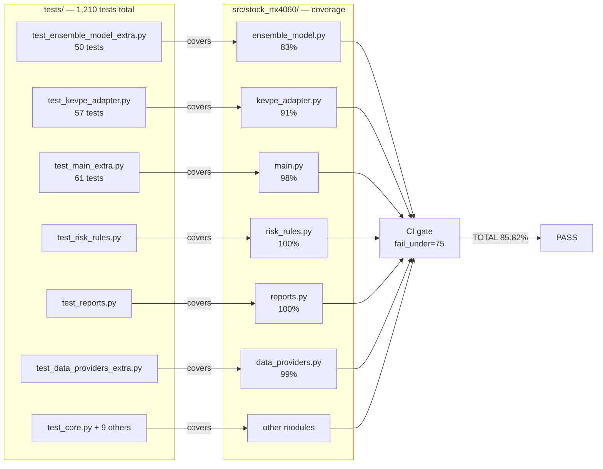

### Coverage summary

| Module | Before | After | Test file |
|---|---|---|---|
| `ensemble_model.py` | 49% | **83%** | `test_ensemble_model_extra.py` (50 tests) |
| `kevpe_adapter.py` | 43% | **91%** | `test_kevpe_adapter.py` (57 tests) |
| `main.py` | 51% | **98%** | `test_main_extra.py` (61 tests) |
| `risk_rules.py` | — | **100%** | `test_risk_rules.py` |
| `reports.py` | — | **100%** | `test_reports.py` |
| `data_providers.py` | — | **99%** | `test_data_providers_extra.py` |
| **TOTAL** | 80.79% | **85.82%** | 1,210 tests across 25+ files |

### New test files added

| File | Tests | Coverage target |
|---|---|---|
| `tests/test_ensemble_model_extra.py` | 50 | `ensemble_model.py` ML fit/predict paths, fallback chain, walk-forward CV |
| `tests/test_kevpe_adapter.py` | 57 | `kevpe_adapter.py` unavailable/available branches, singleton, signal helpers |
| `tests/test_main_extra.py` | 61 | `main.py` all `cmd_*` dispatchers, legacy arg normalization, `build_parser` |
| `tests/test_risk_rules.py` | — | `risk_rules.py` Track-S/Track-L gate logic (100%) |
| `tests/test_reports.py` | — | `reports.py` Markdown/JSON/CSV helpers (100%) |
| `tests/test_data_providers_extra.py` | — | `data_providers.py` provider routing and fallback (99%) |

### New documentation added

| File | Purpose |
|---|---|
| `docs/CONTRIB.md` | Development workflow, available scripts, environment setup, testing procedures |
| `docs/RUNBOOK.md` | Deployment procedures, monitoring, common issues, rollback |
| `docs/PHASE1_GAP_ANALYSIS_2026-05-07.md` | Phase 1 gap analysis and next-phase planning |

### Verification

```powershell
cd C:\Users\jichu\Downloads\주식\stock_1901
.\.venv\Scripts\python.exe -m pytest -q --tb=no
```

Observed result: **1,210 passed**, 85.82% total coverage (CI gate `fail_under=75` in `pyproject.toml`). Target ≥85% ✅

Commits: `09c8187` (340 tests, 80.79%), `d7a3022` (509 tests, 89%), `717f3a0` + `c6f0928` + `d1f5a9a` (P0-P8 upgrade, 1,210 tests, 85.82%, 2026-05-10).


---

## Appendix — Auto-generated Documentation Logs

> 이 섹션 이하는 Codex/Hermes 에이전트가 자동 추가한 로그입니다.
> 운영 문서는 위의 §1–22 섹션을 참조하세요.

---

## Codex Documentation Update — 2026-05-28T20:44:00.663596+00:00

**Update policy:** existing content above this section is preserved. This section was appended after scanning code, documentation, config, and agent profile files.

**Purpose:** This section summarizes the repository state for onboarding and operation.

### Evidence inventory

**Source/code files sampled:**
- `api_server.py`
- `dashboard\stock_pred_v5.jsx`
- `flows\__init__.py`
- `flows\daily_krx.py`
- `flows\daily_us.py`
- `flows\research_weekly.py`
- `flows\utils.py`
- `main.py`
- `preview_server.py`
- `reports\dashboard_browser_verification\snapshot_fixture.js`
- `root_folder_snapshot\KEVPE_final_package\demo_kevpe_v2.py`
- `root_folder_snapshot\KEVPE_final_package\kevpe.py`

**Documentation files sampled:**
- `.codex\goals\dashboard-report-bridge.goal.md`
- `.codex\goals\mcp-openbb-audit-phase1.goal.md`
- `.continue\checks\01-financial-safety-boundary.md`
- `.continue\checks\02-backtest-integrity.md`
- `.continue\checks\03-recommendation-contract.md`
- `.continue\checks\04-secret-and-pii-safety.md`
- `.continue\checks\05-gpu-claim-validation.md`
- `.continue\checks\06-report-contract.md`
- `.continue\checks\07-architecture-boundary.md`
- `.continue\checks\08-test-and-verification.md`
- `20260507_plan-doc.md`
- `20260510_project-upgrade-report.md`

**Config/build files sampled:**
- `.claude\launch.json`
- `.codex\root-docs-dry-run.json`
- `.codex\root-docs-scan.json`
- `.github\workflows\ci.yml`
- `.pre-commit-config.yaml`
- `config\data_providers.example.json`
- `config\runtime_environment.json`
- `config\sector_map.json`
- `coverage.json`
- `docker-compose.dev.yml`
- `docs\AGENTS.md`
- `examples\kevpe_events_smoke.json`

**Agent profile files sampled:**
- No agent profile detected; this update records the absence explicitly.

### Mermaid graph

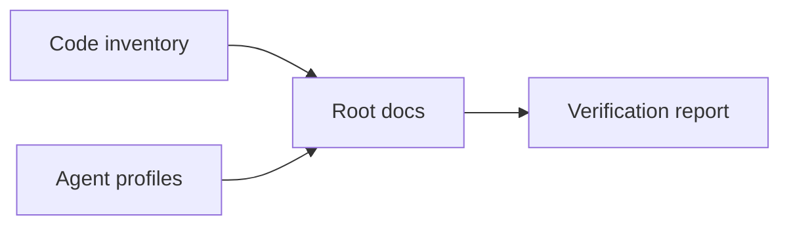

### Verification notes

- Append-only update generated by `root-docs-batch-update`.
- Code/config/doc/agent inventory counts: code=2337, docs=1091, config=698, agent_profiles=0.
- Follow-up verification should confirm that newly added text matches actual implementation paths listed above.


## Hermes Documentation Update — 2026-05-28T23:02:20.364421+00:00

**Update policy:** existing content above this section is preserved. This section was appended after scanning code, documentation, config, and agent profile files.

**Purpose:** This section summarizes the repository state for onboarding and operation.

### Evidence inventory

**Source/code files sampled:**
- `api_server.py`
- `dashboard\stock_pred_v5.jsx`
- `flows\__init__.py`
- `flows\daily_krx.py`
- `flows\daily_us.py`
- `flows\research_weekly.py`
- `flows\utils.py`
- `main.py`
- `preview_server.py`
- `reports\dashboard_browser_verification\snapshot_fixture.js`
- `root_folder_snapshot\KEVPE_final_package\demo_kevpe_v2.py`
- `root_folder_snapshot\KEVPE_final_package\kevpe.py`

**Documentation files sampled:**
- `.codex\goals\dashboard-report-bridge.goal.md`
- `.codex\goals\mcp-openbb-audit-phase1.goal.md`
- `.codex\root-docs-strict\docs\001-README.md`
- `.codex\root-docs-strict\docs\002-SYSTEM_ARCHITECTURE.md`
- `.codex\root-docs-strict\docs\003-LAYOUT.md`
- `.codex\root-docs-strict\docs\004-CHANGELOG.md`
- `.codex\root-docs-strict\docs\005-plan.md`
- `.codex\root-docs-strict\docs\006-codex-default-doc-agent.md`
- `.continue\checks\01-financial-safety-boundary.md`
- `.continue\checks\02-backtest-integrity.md`
- `.continue\checks\03-recommendation-contract.md`
- `.continue\checks\04-secret-and-pii-safety.md`

**Config/build files sampled:**
- `.claude\launch.json`
- `.codex\root-docs-dry-run.json`
- `.codex\root-docs-scan.json`
- `.codex\root-docs-verify.json`
- `.codex\root-docs-write.json`
- `.github\workflows\ci.yml`
- `.hermes\root-docs-dry-run.json`
- `.hermes\root-docs-scan.json`
- `.pre-commit-config.yaml`
- `config\data_providers.example.json`
- `config\runtime_environment.json`
- `config\sector_map.json`

**Agent profile files sampled:**
- `docs\agents\codex-default-doc-agent.md` (`codex-default-doc-agent`)

### Mermaid graph


### Verification notes

- Append-only update generated by `root-docs-batch-update`.
- Code/config/doc/agent inventory counts: code=2342, docs=1142, config=739, agent_profiles=1.
- Follow-up verification should confirm that newly added text matches actual implementation paths listed above.


## Codex Documentation Update — 2026-05-29T00:10:42.371181+00:00

**Update policy:** existing content above this section is preserved. This section was appended after scanning code, documentation, config, and agent profile files.

**Purpose:** This section summarizes the repository state for onboarding and operation.

### Evidence inventory

**Source/code files sampled:**
- `api_server.py`
- `dashboard\stock_pred_v5.jsx`
- `flows\__init__.py`
- `flows\daily_krx.py`
- `flows\daily_us.py`
- `flows\research_weekly.py`
- `flows\utils.py`
- `main.py`
- `preview_server.py`
- `reports\dashboard_browser_verification\snapshot_fixture.js`
- `root_folder_snapshot\KEVPE_final_package\demo_kevpe_v2.py`
- `root_folder_snapshot\KEVPE_final_package\kevpe.py`

**Documentation files sampled:**
- `.codex\goals\dashboard-report-bridge.goal.md`
- `.codex\goals\mcp-openbb-audit-phase1.goal.md`
- `.codex\root-docs-strict\docs\001-README.md`
- `.codex\root-docs-strict\docs\002-SYSTEM_ARCHITECTURE.md`
- `.codex\root-docs-strict\docs\003-LAYOUT.md`
- `.codex\root-docs-strict\docs\004-CHANGELOG.md`
- `.codex\root-docs-strict\docs\005-plan.md`
- `.codex\root-docs-strict\docs\006-codex-default-doc-agent.md`
- `.continue\checks\01-financial-safety-boundary.md`
- `.continue\checks\02-backtest-integrity.md`
- `.continue\checks\03-recommendation-contract.md`
- `.continue\checks\04-secret-and-pii-safety.md`

**Config/build files sampled:**
- `.claude\launch.json`
- `.codex\root-docs-dry-run.json`
- `.codex\root-docs-scan.json`
- `.codex\root-docs-verify.json`
- `.codex\root-docs-write.json`
- `.github\workflows\ci.yml`
- `.hermes\root-docs-dry-run.json`
- `.hermes\root-docs-scan.json`
- `.hermes\root-docs-write.json`
- `.pre-commit-config.yaml`
- `config\data_providers.example.json`
- `config\runtime_environment.json`

**Agent profile files sampled:**
- `docs\agents\codex-default-doc-agent.md` (`codex-default-doc-agent`)

### Mermaid graph


### Verification notes

- Append-only update generated by `root-docs-batch-update`.
- Code/config/doc/agent inventory counts: code=2342, docs=1168, config=766, agent_profiles=1.
- Follow-up verification should confirm that newly added text matches actual implementation paths listed above.


## Codex Documentation Update — 2026-05-29T00:39:13.408134+00:00

**Update policy:** existing content above this section is preserved. This section was appended after scanning code, documentation, config, and agent profile files.

**Purpose:** This section summarizes the repository state for onboarding and operation.

### Evidence inventory

**Source/code files sampled:**
- `api_server.py`
- `dashboard\stock_pred_v5.jsx`
- `flows\__init__.py`
- `flows\daily_krx.py`
- `flows\daily_us.py`
- `flows\research_weekly.py`
- `flows\utils.py`
- `main.py`
- `preview_server.py`
- `reports\dashboard_browser_verification\snapshot_fixture.js`
- `root_folder_snapshot\KEVPE_final_package\demo_kevpe_v2.py`
- `root_folder_snapshot\KEVPE_final_package\kevpe.py`

**Documentation files sampled:**
- `.codex\goals\dashboard-report-bridge.goal.md`
- `.codex\goals\mcp-openbb-audit-phase1.goal.md`
- `.codex\root-docs-strict\docs\001-README.md`
- `.codex\root-docs-strict\docs\002-SYSTEM_ARCHITECTURE.md`
- `.codex\root-docs-strict\docs\003-LAYOUT.md`
- `.codex\root-docs-strict\docs\004-CHANGELOG.md`
- `.codex\root-docs-strict\docs\005-plan.md`
- `.codex\root-docs-strict\docs\006-codex-default-doc-agent.md`
- `.continue\checks\01-financial-safety-boundary.md`
- `.continue\checks\02-backtest-integrity.md`
- `.continue\checks\03-recommendation-contract.md`
- `.continue\checks\04-secret-and-pii-safety.md`

**Config/build files sampled:**
- `.codex\root-docs-dry-run.json`
- `.codex\root-docs-scan.json`
- `.github\workflows\ci.yml`
- `.pre-commit-config.yaml`
- `config\data_providers.example.json`
- `config\runtime_environment.json`
- `config\sector_map.json`
- `docker-compose.dev.yml`
- `docs\AGENTS.md`
- `examples\kevpe_events_smoke.json`
- `observability\grafana\dashboards\data_lake.json`
- `observability\grafana\dashboards\recommendations.json`

**Agent profile files sampled:**
- `docs\agents\codex-default-doc-agent.md` (`codex-default-doc-agent`)

### Mermaid graph


### Verification notes

- Append-only update generated by `root-docs-batch-update`.
- Code/config/doc/agent inventory counts: code=2344, docs=990, config=585, agent_profiles=1.
- Follow-up verification should confirm that newly added text matches actual implementation paths listed above.


## Codex Documentation Update — 2026-05-29T04:07:15.920451+00:00

**Update policy:** existing content above this section is preserved. This section was appended after scanning code, documentation, config, and agent profile files.

**Purpose:** This section summarizes the repository state for onboarding and operation.

### Evidence inventory

**Source/code files sampled:**
- `api_server.py`
- `dashboard\stock_pred_v5.jsx`
- `docs\purged_kfold_embargo.py`
- `docs\test_purged_kfold_embargo.py`
- `flows\__init__.py`
- `flows\daily_krx.py`
- `flows\daily_us.py`
- `flows\research_weekly.py`
- `flows\utils.py`
- `main.py`
- `preview_server.py`
- `reports\dashboard_browser_verification\snapshot_fixture.js`

**Documentation files sampled:**
- `.codex\goals\dashboard-report-bridge.goal.md`
- `.codex\goals\mcp-openbb-audit-phase1.goal.md`
- `.codex\root-docs-strict\docs\001-README.md`
- `.codex\root-docs-strict\docs\002-SYSTEM_ARCHITECTURE.md`
- `.codex\root-docs-strict\docs\003-LAYOUT.md`
- `.codex\root-docs-strict\docs\004-CHANGELOG.md`
- `.codex\root-docs-strict\docs\005-plan.md`
- `.codex\root-docs-strict\docs\006-codex-default-doc-agent.md`
- `.continue\checks\01-financial-safety-boundary.md`
- `.continue\checks\02-backtest-integrity.md`
- `.continue\checks\03-recommendation-contract.md`
- `.continue\checks\04-secret-and-pii-safety.md`

**Config/build files sampled:**
- `.codex\root-docs-dry-run.json`
- `.codex\root-docs-scan.json`
- `.codex\root-docs-verify.json`
- `.codex\root-docs-write.json`
- `.github\workflows\ci.yml`
- `.pre-commit-config.yaml`
- `config\data_providers.example.json`
- `config\runtime_environment.json`
- `config\sector_map.json`
- `docker-compose.dev.yml`
- `docs\AGENTS.md`
- `examples\kevpe_events_smoke.json`

**Agent profile files sampled:**
- `docs\agents\codex-default-doc-agent.md` (`codex-default-doc-agent`)

### Mermaid graph


### Verification notes

- Append-only update generated by `root-docs-batch-update`.
- Code/config/doc/agent inventory counts: code=2347, docs=992, config=589, agent_profiles=1.
- Follow-up verification should confirm that newly added text matches actual implementation paths listed above.


## Codex Documentation Update — 2026-05-29T05:51:01.365772+00:00

**Update policy:** existing content above this section is preserved. This section was appended after scanning code, documentation, config, and agent profile files.

**Purpose:** This section summarizes the repository state for onboarding and operation.

### Evidence inventory

**Source/code files sampled:**
- `api_server.py`
- `dashboard\stock_pred_v5.jsx`
- `docs\purged_kfold_embargo.py`
- `docs\test_purged_kfold_embargo.py`
- `flows\__init__.py`
- `flows\daily_krx.py`
- `flows\daily_us.py`
- `flows\research_weekly.py`
- `flows\utils.py`
- `main.py`
- `preview_server.py`
- `reports\dashboard_browser_verification\snapshot_fixture.js`

**Documentation files sampled:**
- `.codex\goals\dashboard-report-bridge.goal.md`
- `.codex\goals\mcp-openbb-audit-phase1.goal.md`
- `.codex\root-docs-strict\docs\001-README.md`
- `.codex\root-docs-strict\docs\002-SYSTEM_ARCHITECTURE.md`
- `.codex\root-docs-strict\docs\003-LAYOUT.md`
- `.codex\root-docs-strict\docs\004-CHANGELOG.md`
- `.codex\root-docs-strict\docs\005-plan.md`
- `.codex\root-docs-strict\docs\006-codex-default-doc-agent.md`
- `.continue\checks\01-financial-safety-boundary.md`
- `.continue\checks\02-backtest-integrity.md`
- `.continue\checks\03-recommendation-contract.md`
- `.continue\checks\04-secret-and-pii-safety.md`

**Config/build files sampled:**
- `.codex\root-docs-dry-run.json`
- `.codex\root-docs-scan.json`
- `.codex\root-docs-verify.json`
- `.codex\root-docs-write.json`
- `.github\workflows\ci.yml`
- `.hermes\root-docs-dry-run.json`
- `.hermes\root-docs-scan.json`
- `.hermes\root-docs-write.json`
- `.pre-commit-config.yaml`
- `config\data_providers.example.json`
- `config\runtime_environment.json`
- `config\sector_map.json`

**Agent profile files sampled:**
- `docs\agents\codex-default-doc-agent.md` (`codex-default-doc-agent`)

### Mermaid graph


### Verification notes

- Append-only update generated by `root-docs-batch-update`.
- Code/config/doc/agent inventory counts: code=2355, docs=1033, config=627, agent_profiles=1.
- Follow-up verification should confirm that newly added text matches actual implementation paths listed above.


## Codex Documentation Update — 2026-05-29T08:52:10.916684+00:00

**Update policy:** existing content above this section is preserved. This section was appended after scanning code, documentation, config, and agent profile files.

**Purpose:** This section summarizes the repository state for onboarding and operation.

### Evidence inventory

**Source/code files sampled:**
- `api_server.py`
- `dashboard\stock_pred_v5.jsx`
- `docs\purged_kfold_embargo.py`
- `docs\test_purged_kfold_embargo.py`
- `flows\__init__.py`
- `flows\daily_krx.py`
- `flows\daily_us.py`
- `flows\research_weekly.py`
- `flows\utils.py`
- `main.py`
- `preview_server.py`
- `reports\dashboard_browser_verification\snapshot_fixture.js`

**Documentation files sampled:**
- `.codex\goals\dashboard-report-bridge.goal.md`
- `.codex\goals\mcp-openbb-audit-phase1.goal.md`
- `.codex\root-docs-strict\docs\001-README.md`
- `.codex\root-docs-strict\docs\002-SYSTEM_ARCHITECTURE.md`
- `.codex\root-docs-strict\docs\003-LAYOUT.md`
- `.codex\root-docs-strict\docs\004-CHANGELOG.md`
- `.codex\root-docs-strict\docs\005-plan.md`
- `.codex\root-docs-strict\docs\006-codex-default-doc-agent.md`
- `.continue\checks\01-financial-safety-boundary.md`
- `.continue\checks\02-backtest-integrity.md`
- `.continue\checks\03-recommendation-contract.md`
- `.continue\checks\04-secret-and-pii-safety.md`

**Config/build files sampled:**
- `.claude\launch.json`
- `.codex\root-docs-dry-run-latest.json`
- `.codex\root-docs-dry-run.json`
- `.codex\root-docs-scan-latest.json`
- `.codex\root-docs-scan.json`
- `.codex\root-docs-verify.json`
- `.codex\root-docs-write.json`
- `.github\workflows\ci.yml`
- `.hermes\root-docs-dry-run.json`
- `.hermes\root-docs-scan.json`
- `.hermes\root-docs-write.json`
- `.pre-commit-config.yaml`

**Agent profile files sampled:**
- `docs\agents\codex-default-doc-agent.md` (`codex-default-doc-agent`)

### Mermaid graph


### Verification notes

- Append-only update generated by `root-docs-batch-update`.
- Code/config/doc/agent inventory counts: code=2361, docs=1227, config=828, agent_profiles=1.
- Follow-up verification should confirm that newly added text matches actual implementation paths listed above.


## 22. Wave 3 Upgrade — MLflow Tracing + PBO Dashboard + AutoForward Prefect (2026-05-29)

Wave 3 Best 3 업그레이드가 완료됐습니다. 기존 CLI/API/스키마 불변을 유지하며 세 가지 기능이 추가됐습니다.

### E1 — MLflow LLM Span Tracing

P6 어드바이저 호출을 MLflow span으로 기록할 수 있습니다.

| 항목 | 상태 |
|---|---|
| `requirements.txt` mlflow 버전 | `>=3.0,<4.0` |
| `USE_MLFLOW_TRACING` 환경변수 | 기본값 `false` — 활성화: `export USE_MLFLOW_TRACING=true` |
| `_wrap_with_mlflow_span()` | LiteLLM/MiniMax/Anthropic 세 경로 래핑 |

### E2 — PBO 대시보드 통합

PBO(Probability of Backtest Overfitting) 지표가 REC 탭 카드에 뱃지로 표시됩니다.

| PBO 범위 | 상태 | 색상 |
|---|---|---|
| ≤ 20% | PASS | 초록 |
| 21–50% | AMBER | 노랑 |
| > 50% | RED | 빨강 |
| CPCV 미실행 | NO_DATA | 회색 |

수정된 파일:
- `backtest_honesty.py`: `summarize_honesty()` → `pbo`, `pbo_status` 필드 추가
- `dashboard_bridge.py`: per-candidate `backtest_honesty_summary` 키 추가
- `RecommendationCard.jsx`: `PboBadge` 컴포넌트 (WCAG AA)

**PBO 판정 흐름:**

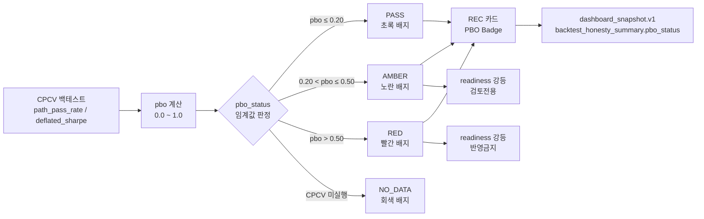

### E3 — AutoForwardRecorder Prefect 자동화

005930.KS 30일 실전 추적이 매일 자동으로 실행됩니다.

**daily_krx_flow 9단계:**

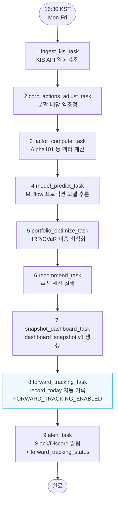

**AutoForwardRecorder 상태 머신:**

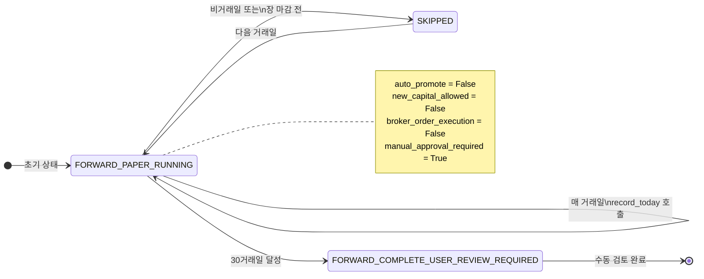

| 설정 | 기본값 | 설명 |
|---|---|---|
| `FORWARD_TRACKING_ENABLED` | `true` | `false`로 즉시 비활성화 |

### 커버리지

| 지표 | Wave 2 | Wave 3 |
|---|---|---|
| Line coverage | 86% | ~87% |
| Branch coverage | 86% | ~87% |

커버리지 회복 방법:
- `reports.py` (죽은 코드) → pyproject.toml omit 추가
- `_TorchLSTMNet`, `LSTMPredictor`, `GRUPredictor` → `# pragma: no cover`
- `test_auto_forward_recorder.py` → 9개 테스트 추가
