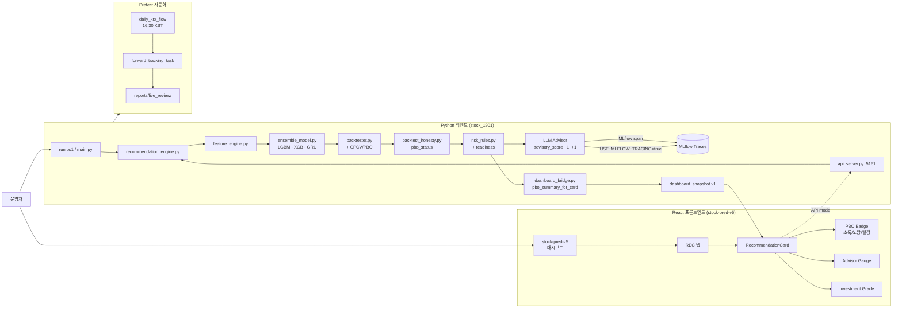
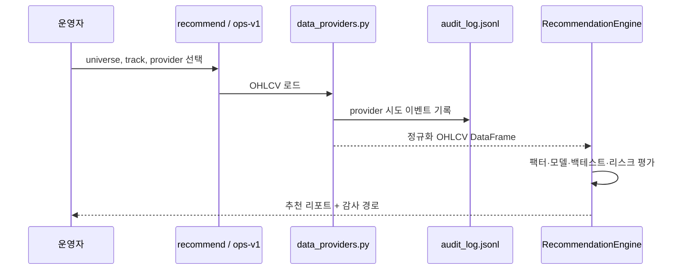
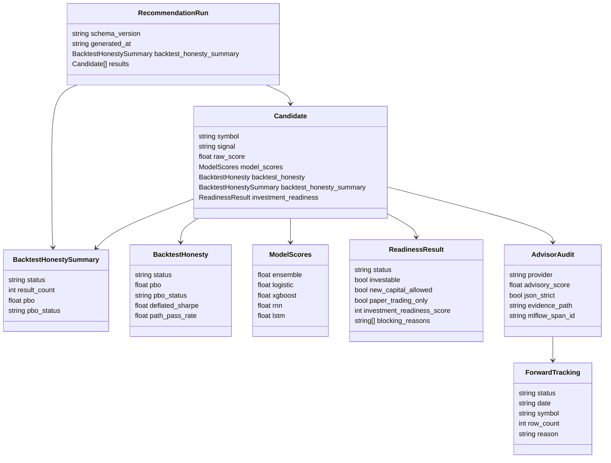
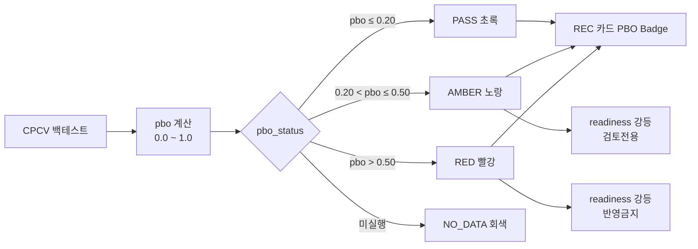
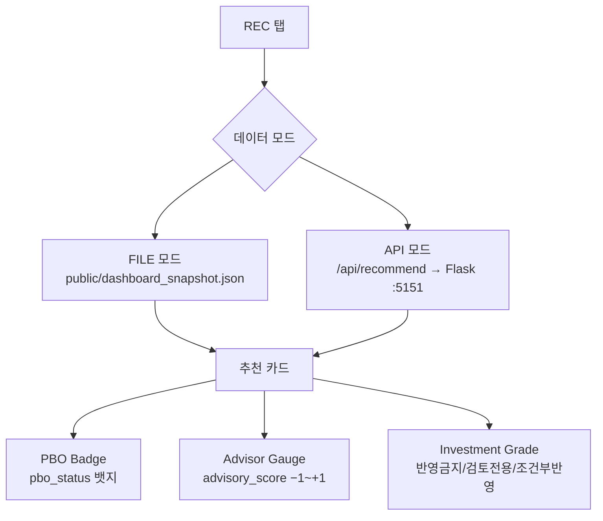
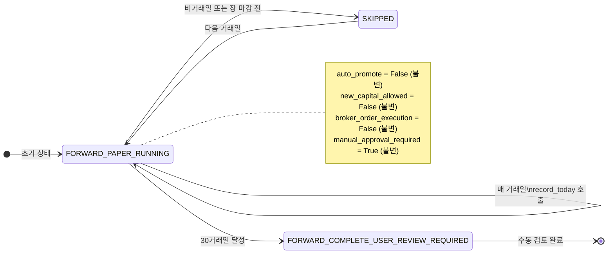
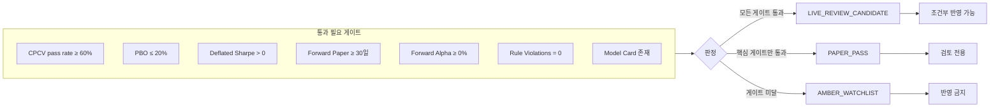

# stock_1901 — 주식 추천 연구 시스템

**Python 3.12 · Flask API · React/Vite 대시보드 · Prefect 플로우 · hedge-fund grade (P0–P8)**

> ⚠️ **운영 현황:** `AMBER WATCHLIST` — 리서치·페이퍼트레이딩 전용. 라이브 주문 없음.

---

## 목차

1. [시스템 개요](#1-시스템-개요)
2. [아키텍처](#2-아키텍처)
3. [데이터 계약 타입 맵](#3-데이터-계약-타입-맵)
4. [Wave 3 신규 기능](#4-wave-3-신규-기능)
5. [빠른 시작](#5-빠른-시작)
6. [CLI 명령어](#6-cli-명령어)
7. [대시보드](#7-대시보드)
8. [일별 KRX 자동화 플로우](#8-일별-krx-자동화-플로우)
9. [AutoForwardRecorder 상태 머신](#9-autoforwardrecorder-상태-머신)
10. [투자 준비도 판정](#10-투자-준비도-판정)
11. [안전 경계](#11-안전-경계)
12. [테스트 및 CI](#12-테스트-및-ci)
13. [모듈 구성 (P0–P8)](#13-모듈-구성-p0p8)
14. [출력 파일 위치](#14-출력-파일-위치)
15. [알려진 이슈 및 워크어라운드](#15-알려진-이슈-및-워크어라운드)

---

## 1. 시스템 개요

### 운영 현황

| 항목 | 현재 정책 |
|---|---|
| 라이브 투자 상태 | `AMBER WATCHLIST` |
| 신규 자본 | `new_capital_allowed=false` |
| 실행 모드 | `paper_trading_only=true` |
| 허용 용도 | 리서치, 관심종목, 페이퍼트레이딩, 대시보드 모니터링 |
| 차단 용도 | 라이브 자본, 브로커 주문 실행, 자동 매수/매도 |

### 무엇을 하는가

| 영역 | 기능 |
|---|---|
| 추천 엔진 | OHLCV·팩터·모델점수·리스크룰·어드바이저 증거 기반 후보 추천 |
| 투자 준비도 | backtest_honesty·PBO·3x 비용생존·엠바고 스트레스·어드바이저 감사 게이트 |
| 대시보드 | REC탭 — 후보카드·PBO뱃지·어드바이저게이지·투자등급 |
| 모델 점수 | 앙상블·LogReg·XGBoost·GRU/RNN (LSTM 선택) |
| 어드바이저 | LiteLLM 게이트웨이 (Anthropic primary, MiniMax fallback) · MLflow span tracing |
| 자동화 | Prefect `daily_krx_flow` 9단계, 16:30 KST Mon–Fri |
| 검증 | Hypothesis PBT · Chaos 테스트 · CPCV/PBO 백테스트 |

---

## 2. 아키텍처

### 전체 시스템



### 데이터 제공자 및 감사 흐름



---

## 3. 데이터 계약 타입 맵



---

## 4. Wave 3 신규 기능

### E1 — MLflow LLM Span Tracing

P6 어드바이저 호출을 MLflow에 기록합니다 (선택적).

```bash
export USE_MLFLOW_TRACING=true   # 기본값: false
mlflow server --host 127.0.0.1 --port 5000
# → http://127.0.0.1:5000 Traces 탭에서 advisor_call span 확인
```

| 항목 | 내용 |
|---|---|
| 구현 파일 | `src/stock_rtx4060/advisors/claude_client.py` |
| 환경변수 | `USE_MLFLOW_TRACING=true` |
| 메서드 | `_wrap_with_mlflow_span()` — LiteLLM/MiniMax/Anthropic 세 경로 래핑 |
| mlflow 버전 | `>=3.0,<4.0` |

### E2 — PBO 대시보드 통합



| 구현 파일 | 역할 |
|---|---|
| `backtest_honesty.py` | `_compute_pbo_status()` · `summarize_honesty()` pbo 집계 |
| `dashboard_bridge.py` | `_pbo_summary_for_card()` · per-candidate `backtest_honesty_summary` |
| `RecommendationCard.jsx` | `PboBadge` 컴포넌트 (WCAG AA) |

### E3 — AutoForwardRecorder Prefect 자동화

005930.KS 30일 실전 추적이 `daily_krx_flow`에서 매일 자동 실행됩니다.

```bash
# 비활성화
export FORWARD_TRACKING_ENABLED=false

# 수동 실행 (테스트용)
python -c "
from stock_rtx4060.live_review.auto_forward_recorder import AutoForwardRecorder
from pathlib import Path
r = AutoForwardRecorder(evidence_dir=Path('reports/live_review/005930'))
print(r.record_today())
"
```

---

## 5. 빠른 시작

```powershell
cd C:\Users\jichu\Downloads\주식\stock_1901

# 1. 가상환경 설치
py -3.12 -m venv .venv
.\.venv\Scripts\python.exe -m pip install -r requirements.txt

# 2. 자가 진단
.\run.ps1 self-test

# 3. 합성 데이터로 추천 실행
.\run.ps1 recommend --synthetic --universe "SYNTH-A,SYNTH-B" --top 2

# 4. 대시보드 실행
.\.venv\Scripts\python.exe preview_server.py
# → http://127.0.0.1:5173
```

---

## 6. CLI 명령어

```bash
PYTHONPATH=.:src python main.py <command> [options]
```

| 명령어 | 설명 | 주요 출력 |
|---|---|---|
| `env` | 런타임·GPU 환경 확인 | `reports/runtime_status.json` |
| `benchmark` | CPU/GPU 벤치마크 | 벤치마크 Markdown/JSON |
| `report` | 일간 리포트 | Markdown/JSON |
| `recommend` | 추천 스캔 (Track-S/L) | 추천 Markdown/JSON · `audit_log.jsonl` |
| `backtest` | 백테스트 실행 | 백테스트 결과 |
| `ops-v1` | 수동 검토 워크플로우 패킷 | 승인 템플릿·ZERO 로그·요약 |
| `dashboard-export` | 추천 JSON → 대시보드 스냅샷 | `dashboard_snapshot.json` |
| `paper` | 페이퍼트레이딩 시뮬레이션 | 페이퍼 포지션 리포트 |
| `self-test` | 내부 스모크 테스트 | CLI PASS/FAIL |

---

## 7. 대시보드

### 구조

| 파일 | 역할 |
|---|---|
| `stock-pred-v5/src/StockPredV5.jsx` | 탭·상태·차트 메인 |
| `stock-pred-v5/src/components/RecommendationCard.jsx` | 후보 카드 (PBO Badge 포함) |
| `stock-pred-v5/public/dashboard_snapshot.json` | FILE 모드 스냅샷 |
| `stock-pred-v5/vite.config.js` | 포트 5173, `/api` → `:5151` 프록시 |

### 데이터 모드



### 대시보드 export

```powershell
# 백엔드 추천 결과 → 대시보드 공개 디렉터리 복사
python main.py dashboard-export `
  --recommendation-json reports\recommendations\recommendations_algo_v2_*.json `
  --output reports\dashboard_public_export\dashboard_snapshot.json `
  --public-dir ..\stock-pred-v5\public
```

---

## 8. 일별 KRX 자동화 플로우


> `FORWARD_TRACKING_ENABLED=false`로 T8 단계를 즉시 비활성화할 수 있습니다.

---

## 9. AutoForwardRecorder 상태 머신



---

## 10. 투자 준비도 판정



| 등급 | 의미 |
|---|---|
| `조건부 반영 가능` | 수동 투자 검토 가능 (매수/매도 명령 아님) |
| `검토 전용` | 증거 더 필요 또는 수동 판단 필요 |
| `반영 금지` | 이 후보를 투자 워크플로우에 사용하지 말 것 |

---

## 11. 안전 경계

| 경계 | 규칙 |
|---|---|
| 브로커 실행 | `--broker live-*` 플래그 + 명시적 사용자 승인 시에만 |
| 라이브 주문 | `status.get("reused")=True`이면 스킵 |
| API 키 | 절대 커밋 금지 — 환경변수 또는 `~/.config/stock_1901/` |
| LLM 어드바이저 | `advisory_score ∈ [-1,+1]`; RED/AMBER를 GREEN으로 승격 불가 |
| Kill Switch | `~/.cache/stock_1901/KILLED` 파일이 모든 라이브 주문 차단 |
| PIT as_of 가드 | 레이크 미스 + `as_of!=None` → `RuntimeError` (silent look-ahead 금지) |
| `screening_output_only` | 모든 `RecommendationResult`에 항상 `True` |

---

## 12. 테스트 및 CI

```bash
# 전체 테스트 스위트 (CI와 동일)
PYTHONPATH=.:src pytest --cov=stock_rtx4060 --cov-fail-under=75 --tb=short -rfE -q

# 타입 검사 (non-blocking)
mypy src/stock_rtx4060/observability || true

# CLI 불변 검사
PYTHONPATH=.:src python main.py recommend --help
PYTHONPATH=.:src python main.py backtest --help
PYTHONPATH=.:src python main.py paper --help
```

| 게이트 | 조건 |
|---|---|
| `pytest --cov-fail-under=75` | 전체 통과, 커버리지 ≥75% |
| `dashboard_snapshot.v1` | `schema_version` 필드 존재 |
| `screening_output_only` | 모든 결과에 `True` |
| `PurgedKFold groups` | `cv.split()` 시 항상 `groups=` 전달 |
| numpy 버전 | `>=1.26,<3.0` |
| shap 버전 | `>=0.50.0` |

**현재 커버리지:** ~87% (line · branch)

---

## 13. 모듈 구성 (P0–P8)

| 페이즈 | 영역 | 핵심 모듈 |
|---|---|---|
| P0 | 관찰가능성·CI | `src/stock_rtx4060/observability/` · `.github/workflows/ci.yml` |
| P1 | PIT 데이터 레이크 | `src/stock_rtx4060/data_lake/` (DuckDB 1.5.3 + Parquet) |
| P2 | 팩터 라이브러리 | `src/stock_rtx4060/factors/` (Alpha101/158, Barra) |
| P3 | ML 업그레이드 | `src/stock_rtx4060/ml/` (LightGBM, Optuna HPO, MLflow) |
| P4 | 포트폴리오 최적화 | `src/stock_rtx4060/portfolio/` (skfolio HRP/NCO/CVaR) |
| P5 | 백테스트 | `src/stock_rtx4060/backtest/` (vectorbt, MC bootstrap, CPCV/PBO) |
| P6 | LLM 어드바이저 | `src/stock_rtx4060/advisors/` (LiteLLM, MLflow tracing) |
| P7 | 오케스트레이션 | `flows/` (Prefect 3 · daily_krx · daily_us · research_weekly) |
| P8 | 라이브 브로커 | `src/stock_rtx4060/broker/` (Alpaca · IBKR · KIS) |

---

## 14. 출력 파일 위치

| 출력 | 위치 |
|---|---|
| 추천 Markdown/JSON | `reports/recommendations*/` |
| Provider 감사 로그 | `reports/**/audit_log.jsonl` |
| MLflow 어드바이저 trace | `audit_log/advisor.jsonl` |
| 대시보드 스냅샷 | `dashboard_snapshot.json` (dashboard-export 명령) |
| forward tracking CSV | `reports/live_review/005930KS/paper_trading_log_005930KS.csv` |
| 대시보드 빌드 | `stock-pred-v5/dist/` |

---

## 15. 알려진 이슈 및 워크어라운드

| 이슈 | 워크어라운드 |
|---|---|
| `logging.basicConfig(force=True)`의 글로벌 `InterceptHandler` | `configure_logging()` 호출 테스트에서 `monkeypatch.setattr(logging, "basicConfig", lambda **kw: None)` 사용 |
| Python 3.14에서 `.corr().values` numpy read-only | `np.fill_diagonal()` 전에 `.copy()` 추가 — `portfolio/optimizer.py` 참고 |
| Pandas 4.x `pd.Timestamp.utcnow()` deprecated | `pd.Timestamp.now('UTC')` 사용 — `data_providers.py`, `recommendation_engine.py` 패치됨 |
| `_TorchLSTMNet` · `LSTMPredictor` · `GRUPredictor` CI 미커버 | `torch` 미설치 CI 환경 — `# pragma: no cover` 처리됨 |
| `reports.py` 커버리지 0% | `reports/` 패키지에 가려진 dead code — `pyproject.toml` omit 처리됨 |

---

## 최근 변경 이력

| 날짜 | 커밋 | 내용 |
|---|---|---|
| 2026-05-29 | `ba4e81b` | E1-W3: MLflow LLM span tracing (`_USE_MLFLOW_TRACING` flag) |
| 2026-05-29 | `87047c3` | E3: `forward_tracking_task` + `record_today()` Prefect 자동화 |
| 2026-05-29 | `e485e1b` | 커버리지 ~83%→~87% (pragma + omit + 9개 테스트) |
| 2026-05-29 | `6909d0a` | mlflow `>=3.0,<4.0` requirements 동기화 |
| 2026-05-29 | `d746254` | E2: PBO 대시보드 갭 수정 (summarize_honesty + bridge) |
| 2026-05-11 | `26451eb` | P0: TimeSeriesSplit→PurgedKFold, API universe cap |
| 2026-05-10 | `717f3a0` | 커버리지 78.5%→85.82%, CORS 수정 |
