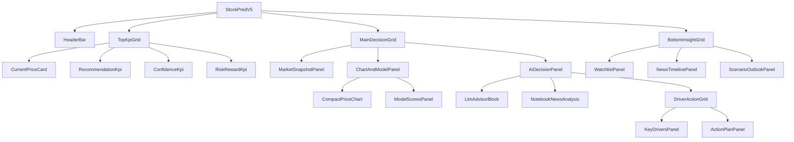

# STOCKPRED Executive Decision Dashboard v2.1 — 최종 검증 설계 문서

작성일: 2026-05-30
기준 시간대: Asia/Dubai
기준 이미지: `ChatGPT Image 2026년 5월 30일 오후 06_41_50.png`
이미지 크기: `1672 × 941 px`
대상 프로젝트: `stock_1901`
대상 UI: `root_folder_snapshot/stock-pred-v5` React/Vite dashboard
판정: **GO, 단 데이터 계약 확장은 AMBER**

---

## 0. Executive Summary

### 판정

**GO — 이미지와 동일한 “Executive Decision Dashboard” 구조로 구현하는 것이 최적안이다.**

### 이유

현재 화면 문제는 차트가 중앙 공간을 과도하게 점유하여 의사결정 정보가 분산되는 것이다.
기준 이미지는 이 문제를 다음 방식으로 해결한다.

1. 상단에는 4개 KPI만 배치한다.
2. 중앙 차트는 260–300px로 제한한다.
3. 우측 상단에 AI Decision Panel을 크게 배치한다.
4. NotebookLM 뉴스 분석, Key Drivers, Action Plan을 AI 패널 안에 통합한다.
5. 하단은 Watchlist, News Timeline, Scenario Outlook으로 나눈다.

### 최종안 이름

```text
STOCKPRED Executive Decision Dashboard v2.1
```

### 구현 원칙

```text
차트 중심 화면이 아니라,
AI 판단 + 근거 + 실행계획 중심 화면으로 재구성한다.
```

---

## 1. 기준 이미지 분석

### 1.1 이미지 메타

| Item | Value |
|---|---:|
| Width | 1672 px |
| Height | 941 px |
| Aspect | 16:9 계열 |
| Theme | Dark navy |
| Card style | Glass card |
| Accent | Cyan / Green / Amber / Red |
| Density | High |

### 1.2 이미지 구조

```text
┌──────────────────────────────────────────────────────────────────────────────┐
│ HeaderBar                                                                    │
│ STOCKPRED | ticker selector | market selector | market status | icons         │
├──────────────────────────────────────────────────────────────────────────────┤
│ TopKpiGrid                                                                   │
│ Current Price | Recommendation | Confidence | Risk / Reward                  │
├────────────────────┬─────────────────────────────┬───────────────────────────┤
│ Market Snapshot    │ Price Chart                 │ AI Decision Panel          │
│                    │ Model Scores                │ LLM + NotebookLM + Plan    │
├────────────────────┼─────────────────────────────┼───────────────────────────┤
│ Watchlist          │ News Timeline               │ Scenario Outlook           │
└────────────────────┴─────────────────────────────┴───────────────────────────┘
```

### 1.3 이미지 좌표 기반 영역

| Region | X | Y | W | H |
|---|---:|---:|---:|---:|
| Header | 22 | 18 | 1600 | 55 |
| KPI row | 22 | 80 | 1602 | 135 |
| Main grid | 22 | 227 | 1602 | 448 |
| Bottom grid | 22 | 686 | 1602 | 220 |
| Market Snapshot | 22 | 227 | 256 | 448 |
| Chart stack | 290 | 227 | 515 | 448 |
| AI Panel | 819 | 227 | 805 | 448 |
| Watchlist | 22 | 686 | 423 | 220 |
| News Timeline | 458 | 686 | 465 | 220 |
| Scenario Outlook | 933 | 686 | 691 | 220 |

> 좌표는 구현용 기준값이다. 실제 CSS는 responsive grid로 구현한다.

---

## 2. 교차 검증 결과

### 2.1 LAYOUT.md 기준

`LAYOUT.md`는 실제 활성 React/Vite 대시보드가 아래 경로에 있음을 명시한다.

```text
root_folder_snapshot/stock-pred-v5/src/StockPredV5.jsx
root_folder_snapshot/stock-pred-v5/src/components/
```

따라서 이미지형 전체 레이아웃은 `StockPredV5.jsx`에서 shell을 구성하고, 반복 가능한 카드/패널은 `src/components/`로 분리한다.

### 2.2 COMPONENT_LAYOUT.md 기준

`COMPONENT_LAYOUT.md`는 현재 기본 구조를 다음으로 정의한다.

```text
StockPredV5
├─ Header
├─ Left Sidebar
├─ CenterPanel
└─ Right Panel
```

이미지형 최종 구조는 이를 다음처럼 재배치한다.

```text
StockPredV5
├─ HeaderBar
├─ TopKpiGrid
├─ MainDecisionGrid
│  ├─ MarketSnapshotPanel
│  ├─ ChartAndModelPanel
│  └─ AiDecisionPanel
└─ BottomInsightGrid
   ├─ WatchlistPanel
   ├─ NewsTimelinePanel
   └─ ScenarioOutlookPanel
```

즉, 기존 컴포넌트 구조를 폐기하지 않는다.
기존 구조를 **executive decision layout**으로 재배열한다.

### 2.3 기존 책임 경계와의 일치

| Existing role | 유지 여부 | v2.1 매핑 |
|---|---|---|
| `StockPredV5` owns layout | 유지 | DashboardShell |
| `StockPredV5` owns market state | 유지 | HeaderBar selector |
| `StockPredV5` owns selected ticker | 유지 | Watchlist row click |
| `CenterPanel` shows chart | 축소 | CompactPriceChart |
| `Right Panel` shows tabs | 보존 | Detail mode |
| `RecommendationPanel` owns REC | 유지 | REC 상세 view |
| `RecommendationCard` owns candidate card | 유지 | 하단/상세용 |
| `dashboard_bridge.py` owns snapshot | 유지 | field 확장 |

### 2.4 안전 경계와의 일치

이미지의 `BUY`, `ENTRY`, `STOP LOSS`, `TAKE PROFIT` 표현은 UI상 강하다.
따라서 실제 구현에서는 아래 문구가 반드시 있어야 한다.

```text
Report-only. Manual review required. No broker execution.
```

그리고 다음 기능은 추가하지 않는다.

```text
auto buy
auto sell
broker order
account credential
irreversible tool execution
```

---

## 3. 현재 이미지의 UX 장점과 보완점

### 3.1 장점

| Item | Verdict |
|---|---|
| 정보 위계 | 좋음 |
| AI 판단 가시성 | 좋음 |
| 그래프 크기 | 적정 |
| 근거 표시 | 좋음 |
| 하단 요약 | 좋음 |
| 색상 의미 | 명확 |

### 3.2 보완 필요

| Issue | Fix |
|---|---|
| `BUY` 오해 가능 | report-only label |
| 한글/영문 혼합 밀도 | label hierarchy |
| 작은 텍스트 | 12px 최소 |
| 색상 의존 | icon + text |
| NotebookLM 미연동 시 | empty state |
| 모바일 대응 | vertical stack |

---

## 4. 최적 디자인안

### 4.1 최종 채택안

**Option A — Executive Decision Dashboard**

이유:

1. 사용자가 지적한 차트 과대 문제를 직접 해결한다.
2. 의사결정 정보가 첫 화면에 집중된다.
3. NotebookLM 뉴스 분석이 AI 판단과 연결된다.
4. 기존 REC tab과 snapshot 구조를 유지한다.
5. 코드 변경 범위가 명확하다.

### 4.2 비채택안

| Option | Reason |
|---|---|
| Chart-first | 기존 문제 반복 |
| Tab-only | 핵심 정보 숨김 |
| Full Bloomberg clone | 과밀 |
| Mobile-first only | desktop 비효율 |

---

## 5. 최종 Layout Spec

### 5.1 Desktop 기준

```css
.dashboard-shell {
  min-height: 100vh;
  padding: 22px;
  background: #020916;
  color: #d4e1ec;
  font-family: "Inter", "Pretendard", "JetBrains Mono", sans-serif;
}

.header-bar {
  height: 56px;
  display: grid;
  grid-template-columns: 1fr auto auto auto auto;
  align-items: center;
  gap: 14px;
}

.top-kpi-grid {
  display: grid;
  grid-template-columns: 1fr 1fr 0.95fr 1.45fr;
  gap: 16px;
  margin-top: 16px;
}

.main-decision-grid {
  display: grid;
  grid-template-columns: 0.95fr 1.9fr 2.85fr;
  gap: 14px;
  margin-top: 14px;
  min-height: 448px;
}

.bottom-insight-grid {
  display: grid;
  grid-template-columns: 1.35fr 1.45fr 2.2fr;
  gap: 14px;
  margin-top: 14px;
  min-height: 220px;
}
```

### 5.2 차트 축소 기준

```css
.chart-stack {
  display: grid;
  grid-template-rows: 286px 160px;
  gap: 12px;
}

.price-chart-card {
  min-height: 286px;
  max-height: 300px;
}

.price-chart-body {
  height: 218px;
}

.model-score-card {
  height: 160px;
}
```

### 5.3 AI Panel 기준

```css
.ai-decision-panel {
  min-height: 448px;
  display: grid;
  grid-template-rows: 136px 154px 1fr;
  gap: 10px;
}
```

---

## 6. Component Architecture

### 6.1 신규 컴포넌트

| Component | Path |
|---|---|
| `DashboardCard` | `src/components/DashboardCard.jsx` |
| `HeaderBar` | `src/components/HeaderBar.jsx` |
| `KpiCard` | `src/components/KpiCard.jsx` |
| `CurrentPriceCard` | `src/components/CurrentPriceCard.jsx` |
| `RecommendationKpi` | `src/components/RecommendationKpi.jsx` |
| `ConfidenceKpi` | `src/components/ConfidenceKpi.jsx` |
| `RiskRewardKpi` | `src/components/RiskRewardKpi.jsx` |
| `MarketSnapshotPanel` | `src/components/MarketSnapshotPanel.jsx` |
| `CompactPriceChart` | `src/components/CompactPriceChart.jsx` |
| `ModelScoresPanel` | `src/components/ModelScoresPanel.jsx` |
| `AiDecisionPanel` | `src/components/AiDecisionPanel.jsx` |
| `NotebookNewsAnalysis` | `src/components/NotebookNewsAnalysis.jsx` |
| `KeyDriversPanel` | `src/components/KeyDriversPanel.jsx` |
| `ActionPlanPanel` | `src/components/ActionPlanPanel.jsx` |
| `WatchlistPanel` | `src/components/WatchlistPanel.jsx` |
| `NewsTimelinePanel` | `src/components/NewsTimelinePanel.jsx` |
| `ScenarioOutlookPanel` | `src/components/ScenarioOutlookPanel.jsx` |

### 6.2 기존 컴포넌트 유지

| Existing | Treatment |
|---|---|
| `RecommendationPanel.jsx` | 유지 |
| `RecommendationCard.jsx` | 유지 |
| `RiskGateBadge.jsx` | 재사용 |
| `KevpeBadge.jsx` | 재사용 |
| `StockPredV5.jsx` | shell 재구성 |

### 6.3 컴포넌트 트리



---

## 7. Data Contract

### 7.1 기존 데이터 사용

| UI field | Existing source |
|---|---|
| Current Price | `/api/symbol` |
| Change | OHLCV latest - previous |
| Chart | OHLCV records |
| Volume | OHLCV volume |
| Model Scores | `/api/model-scores` |
| Recommendation | `dashboard_snapshot.v1.results[]` |
| Entry/Stop/TP | `RecommendationResult` |
| Risk/Reward | `risk_reward` |

### 7.2 확장 데이터

```json
{
  "notebooklm_impact": "MEDIUM_HIGH",
  "notebooklm_confidence": 0.78,
  "notebooklm_source_count": 32,
  "notebooklm_as_of": "2026-05-30T10:20:00+04:00",
  "notebook_analysis": {
    "summary": "AAPL news flow remains moderately bullish.",
    "bullish_factors": [
      "iPhone 16 demand outpaces expectations",
      "Services revenue hitting new highs",
      "AI integration across product roadmap"
    ],
    "bearish_factors": [
      "China macro concerns",
      "Regulatory pressure on App Store",
      "USD strength impacts margins"
    ],
    "sentiment": "Bullish",
    "sentiment_score": 0.62,
    "source_labels": [
      "Earnings Call",
      "News",
      "Analyst Reports",
      "Filings"
    ]
  },
  "scenario_outlook": {
    "bull": {
      "range": "$215 - $230",
      "return": "+10% - +18%",
      "probability": 0.30
    },
    "base": {
      "range": "$190 - $210",
      "return": "-3% - +8%",
      "probability": 0.50
    },
    "bear": {
      "range": "$160 - $175",
      "return": "-18% - -10%",
      "probability": 0.20
    }
  }
}
```

### 7.3 null-safe fallback

```jsx
const notebook = result?.notebook_analysis ?? null;
const scenario = result?.scenario_outlook ?? buildScenarioFallback(result);
```

---

## 8. 주요 컴포넌트 상세 설계

## 8.1 DashboardCard

### 역할

공통 glass card wrapper.

### Props

```ts
type DashboardCardProps = {
  title?: string;
  subtitle?: string;
  right?: React.ReactNode;
  children: React.ReactNode;
  className?: string;
};
```

### JSX

```jsx
function DashboardCard({ title, subtitle, right, children, className = "" }) {
  return (
    <section className={`dashboard-card ${className}`}>
      {(title || right) && (
        <header className="card-header">
          <div>
            {title && <h2 className="card-title">{title}</h2>}
            {subtitle && <span className="card-subtitle">{subtitle}</span>}
          </div>
          {right && <div className="card-right">{right}</div>}
        </header>
      )}
      <div className="card-body">{children}</div>
    </section>
  );
}
```

---

## 8.2 HeaderBar

### 역할

상단 브랜드와 선택 컨트롤.

### 구성

```text
Logo
App title
Ticker selector
Market selector
Market status
Notification icon
User icon
```

### 접근성

- ticker selector: `aria-label="Select ticker"`
- market selector: `aria-label="Select market"`
- status: `aria-live="polite"`

---

## 8.3 Top KPI Cards

### 8.3.1 CurrentPriceCard

| Field | Data |
|---|---|
| price | latest close |
| change | latest - previous |
| market cap | optional |
| volume | latest volume |
| sparkline | recent close |

### 8.3.2 RecommendationKpi

| Field | Data |
|---|---|
| verdict | advisor / recommendation |
| label | AI Consensus |
| badge | Bullish / Neutral / Bearish |
| icon | trend arrow |

### 8.3.3 ConfidenceKpi

| Field | Data |
|---|---|
| confidence | advisor confidence |
| gauge | radial |
| label | high / medium / low |

### 8.3.4 RiskRewardKpi

| Field | Data |
|---|---|
| risk_reward | result.risk_reward |
| scale | 1–5 |
| label | Attractive / Neutral / Poor |

---

## 8.4 MarketSnapshotPanel

### 역할

좌측 중단의 시장 상태 요약.

### Items

```text
Market Regime
Volatility
Volume
Put/Call Ratio
```

### 데이터

```jsx
const marketSnapshot = {
  regime: result?.advisor_regime ?? "neutral",
  volatility: market?.vix ?? null,
  volume: quote?.volume,
  volumeRatio: result?.volume_ratio_20d,
  putCall: market?.put_call_ratio ?? null
};
```

### Empty state

```text
Market data unavailable
```

---

## 8.5 CompactPriceChart

### 역할

중앙 차트를 축소하여 핵심 가격 흐름만 보여준다.

### 필수 제한

```text
chart body <= 240px
card <= 300px
```

### 시간 버튼

```text
1D | 1W | 1M | 3M | 1Y | YTD
```

### 구현 지침

- `ResponsiveContainer` 사용
- 축 label 과밀 방지
- legend 최소화
- tooltip은 유지
- expand 버튼 추가

---

## 8.6 ModelScoresPanel

### 역할

차트 아래 모델 점수 요약.

### 구조

```text
LR | XGB | LSTM | RNN
```

### 표기

- model name
- score %
- mini sparkline
- backend evidence badge

### 주의

브라우저 demo model과 backend model evidence를 혼동하지 않는다.

---

## 8.7 AiDecisionPanel

### 역할

화면 최우선 판단 영역.

### 내부 구조

```text
LLM Advisor
NotebookLM News Analysis
Key Drivers + Action Plan
```

### JSX

```jsx
function AiDecisionPanel({ result, notebookAnalysis, actionPlan }) {
  return (
    <DashboardCard
      title="AI DECISION PANEL"
      subtitle="AI 의사결정 패널"
      right={<ModelBadge label="Powered by GPT-4o" />}
      className="ai-decision-panel"
    >
      <section className="llm-advisor-row">
        <VerdictGauge value={result?.advisor_score} verdict={result?.verdict} />
        <ConfidenceGauge value={result?.confidence ?? result?.notebooklm_confidence} />
        <RationaleText text={result?.advisor_rationale} />
      </section>

      <NotebookNewsAnalysis analysis={notebookAnalysis} />

      <section className="driver-action-grid">
        <KeyDriversPanel drivers={result?.key_drivers} />
        <ActionPlanPanel plan={actionPlan} />
      </section>
    </DashboardCard>
  );
}
```

---

## 8.8 NotebookNewsAnalysis

### 역할

뉴스 근거를 호재/악재/심리/출처로 압축한다.

### 표시

```text
BULLISH FACTORS
BEARISH FACTORS
SENTIMENT
SOURCES
```

### Empty State

```jsx
if (!analysis) {
  return (
    <EmptyState
      title="NotebookLM analysis unavailable"
      message="뉴스 분석 데이터가 아직 없습니다."
    />
  );
}
```

### Source chips

```text
Sources 32
Earnings Call 7
News 14
Analyst Reports 8
Filings 3
```

---

## 8.9 ActionPlanPanel

### 역할

ENTRY / STOP / TP1 / TP2 표시.

### Safety label

```text
Reference only · Manual review required
```

### 색상

| Field | Tone |
|---|---|
| Entry | green |
| Stop | red |
| TP1 | green |
| TP2 | green |

---

## 8.10 ScenarioOutlookPanel

### 역할

Bull / Base / Bear 시나리오 비교.

### 구조

```text
Bull Case
Base Case
Bear Case
```

### 각 카드

```text
range
expected return
bullet drivers
probability
```

---

## 9. Styling Tokens

```js
export const DASHBOARD_THEME = {
  bg: "#020916",
  panel: "rgba(9, 20, 36, 0.94)",
  panel2: "rgba(12, 28, 48, 0.92)",
  panelHi: "rgba(18, 42, 70, 0.92)",
  border: "#1a2a38",
  borderHi: "#284057",
  text: "#d4e1ec",
  textDim: "#8a9bad",
  textMuted: "#536476",
  cyan: "#20d6d2",
  green: "#00ff88",
  red: "#ff4d57",
  amber: "#ffb020",
  blue: "#2f8cff",
  purple: "#a86bff"
};
```

---

## 10. CSS Implementation

```css
.dashboard-card {
  background:
    linear-gradient(180deg, rgba(12, 28, 48, 0.94), rgba(6, 15, 28, 0.94));
  border: 1px solid #1a2a38;
  border-radius: 8px;
  box-shadow: 0 8px 28px rgba(0, 0, 0, 0.28);
  overflow: hidden;
}

.card-header {
  height: 42px;
  padding: 0 16px;
  display: flex;
  align-items: center;
  justify-content: space-between;
  border-bottom: 1px solid rgba(40, 64, 87, 0.55);
}

.card-title {
  font-size: 13px;
  font-weight: 800;
  letter-spacing: 0.04em;
  text-transform: uppercase;
  margin: 0;
}

.card-subtitle {
  font-size: 11px;
  color: #536476;
  margin-left: 8px;
}

.card-body {
  padding: 14px 16px;
}

.metric-large {
  font-size: 30px;
  font-weight: 800;
  line-height: 1.1;
}

.metric-medium {
  font-size: 22px;
  font-weight: 800;
}
```

---

## 11. Responsive Rules

### 11.1 Tablet

```css
@media (max-width: 1280px) {
  .top-kpi-grid {
    grid-template-columns: repeat(2, 1fr);
  }

  .main-decision-grid {
    grid-template-columns: 1fr;
  }

  .bottom-insight-grid {
    grid-template-columns: 1fr;
  }

  .chart-stack {
    grid-template-rows: auto auto;
  }

  .price-chart-body {
    height: 240px;
  }
}
```

### 11.2 Mobile

```css
@media (max-width: 768px) {
  .dashboard-shell {
    padding: 12px;
  }

  .header-bar {
    grid-template-columns: 1fr;
    height: auto;
  }

  .top-kpi-grid {
    grid-template-columns: 1fr;
  }

  .market-snapshot-panel {
    display: grid;
    grid-template-columns: repeat(2, 1fr);
  }

  .ai-decision-panel {
    grid-template-rows: auto;
  }
}
```

---

## 12. Implementation Plan

### Phase 0 — Feature flag

```env
VITE_DASHBOARD_LAYOUT=executive
```

기본값은 기존 layout.
새 layout은 flag로 켠다.

### Phase 1 — Static shell

1. `DashboardCard.jsx`
2. `HeaderBar.jsx`
3. `KpiCard.jsx`
4. `StockPredV5.jsx` shell grid
5. mock data로 이미지와 동일 배치

### Phase 2 — Existing data binding

1. `/api/symbol` → CurrentPriceCard / CompactPriceChart
2. `/api/model-scores` → ModelScoresPanel
3. snapshot result → RecommendationKpi / ActionPlanPanel
4. existing `advisor_score` → LLM Advisor

### Phase 3 — NotebookLM data binding

1. `notebook_analysis` snapshot field 추가
2. `dashboard_bridge.py` passthrough
3. `NotebookNewsAnalysis` 렌더
4. null-safe fallback

### Phase 4 — Scenario generation

1. `scenario_outlook` field 추가
2. 없으면 UI fallback 생성
3. Bull/Base/Bear probability 합계 1.00 검증

### Phase 5 — Regression

1. `npm run build`
2. `pytest tests/test_dashboard_bridge.py`
3. browser smoke
4. a11y smoke

---

## 13. File Change Plan

### Frontend

```text
root_folder_snapshot/stock-pred-v5/src/StockPredV5.jsx
root_folder_snapshot/stock-pred-v5/src/components/DashboardCard.jsx
root_folder_snapshot/stock-pred-v5/src/components/HeaderBar.jsx
root_folder_snapshot/stock-pred-v5/src/components/KpiCard.jsx
root_folder_snapshot/stock-pred-v5/src/components/CurrentPriceCard.jsx
root_folder_snapshot/stock-pred-v5/src/components/RecommendationKpi.jsx
root_folder_snapshot/stock-pred-v5/src/components/ConfidenceKpi.jsx
root_folder_snapshot/stock-pred-v5/src/components/RiskRewardKpi.jsx
root_folder_snapshot/stock-pred-v5/src/components/MarketSnapshotPanel.jsx
root_folder_snapshot/stock-pred-v5/src/components/CompactPriceChart.jsx
root_folder_snapshot/stock-pred-v5/src/components/ModelScoresPanel.jsx
root_folder_snapshot/stock-pred-v5/src/components/AiDecisionPanel.jsx
root_folder_snapshot/stock-pred-v5/src/components/NotebookNewsAnalysis.jsx
root_folder_snapshot/stock-pred-v5/src/components/KeyDriversPanel.jsx
root_folder_snapshot/stock-pred-v5/src/components/ActionPlanPanel.jsx
root_folder_snapshot/stock-pred-v5/src/components/WatchlistPanel.jsx
root_folder_snapshot/stock-pred-v5/src/components/NewsTimelinePanel.jsx
root_folder_snapshot/stock-pred-v5/src/components/ScenarioOutlookPanel.jsx
```

### Backend

```text
src/stock_rtx4060/recommendation_engine.py
src/stock_rtx4060/dashboard_bridge.py
tests/test_dashboard_bridge.py
```

### Legacy sync

```text
dashboard/stock_pred_v5.jsx
```

---

## 14. Data Fallback Rules

| Missing data | UI fallback |
|---|---|
| `advisor_score` | Show HOLD / Review |
| `advisor_rationale` | "AI rationale unavailable" |
| `notebook_analysis` | Empty state |
| `notebooklm_source_count` | Show `0` |
| `scenario_outlook` | Generate fallback |
| `risk_reward` | Show `—` |
| `modelEvidence` | Show unavailable |
| chart data | REAL DATA LOAD FAILED |

---

## 15. Accessibility DoD

| Component | DoD |
|---|---|
| HeaderBar | labelled selectors |
| KPI Card | aria-label for values |
| Chart | summary fallback |
| Gauge | aria-valuenow |
| Timeline | keyboard rows |
| Scenario | headings |
| Action Plan | text + color |
| Risk scale | text labels |

### Gauge example

```jsx
<div
  role="meter"
  aria-label="Advisor confidence"
  aria-valuemin={0}
  aria-valuemax={100}
  aria-valuenow={Math.round(confidence * 100)}
>
```

---

## 16. React Performance Requirements

### Required

1. Component split.
2. `React.memo` for pure cards.
3. `useMemo` for derived series.
4. `useCallback` for row click handlers.
5. Dedupe ticker fetch.
6. Lazy chart import if bundle grows.
7. Avoid inline heavy object creation in chart loops.

### Example

```jsx
const chartSeries = useMemo(() => {
  return buildCompactChartSeries(enrichedData, timeframe);
}, [enrichedData, timeframe]);
```

---

## 17. Validation Plan

### 17.1 Frontend

```powershell
cd C:\Users\jichu\Downloads\주식\stock_1901\root_folder_snapshot\stock-pred-v5
npm run build
npm run dev -- --host 127.0.0.1 --port 5173
```

### 17.2 Backend

```powershell
cd C:\Users\jichu\Downloads\주식\stock_1901
python api_server.py --host 127.0.0.1 --port 5151
```

### 17.3 API

```powershell
Invoke-WebRequest http://127.0.0.1:5151/api/health
Invoke-WebRequest "http://127.0.0.1:5151/api/symbol?symbol=AAPL&period=6mo"
Invoke-WebRequest "http://127.0.0.1:5151/api/recommend?universe=AAPL,MSFT,NVDA&track=BOTH"
```

### 17.4 Regression

```powershell
cd C:\Users\jichu\Downloads\주식\stock_1901
python -m pytest tests/test_dashboard_bridge.py tests/test_risk_rules.py tests/test_reports.py -q
```

### 17.5 Visual smoke

1. Browser opens at `http://127.0.0.1:5173`.
2. Header visible.
3. KPI cards visible.
4. Chart card height <= 300px.
5. AI panel above fold.
6. NotebookLM panel visible or empty state.
7. Watchlist/News/Scenario visible.
8. No broker/order button visible.

---

## 18. Acceptance Criteria

| No | Criteria | Pass |
|---:|---|---|
| 1 | Layout | image-match |
| 2 | Chart | <=300px |
| 3 | AI Panel | above-fold |
| 4 | NotebookLM | visible |
| 5 | Action Plan | visible |
| 6 | Watchlist | visible |
| 7 | News Timeline | visible |
| 8 | Scenario | visible |
| 9 | Null safety | no crash |
| 10 | Safety | no order |

---

## 19. Risk Register

| Risk | Level | Mitigation |
|---|---|---|
| Screenshot-only clone | M | bind real data |
| Chart too small | M | expand toggle |
| AI over-trust | H | report-only label |
| Snapshot missing fields | M | fallback |
| Mobile clutter | M | stack layout |
| Bundle increase | M | lazy chart |
| A11y gap | M | smoke test |

---

## 20. Final Gate

| Gate | Verdict |
|---|---|
| Image match | GO |
| Layout docs match | GO |
| Component docs match | GO |
| Chart issue resolved | GO |
| Data contract | AMBER |
| NotebookLM live data | AMBER |
| A11y tested | AMBER |
| Safety boundary | GO |

---

## 21. ZERO Conditions

| Step | Reason | Risk | Required input | Next |
|---|---|---|---|---|
| Data | snapshot schema absent | fake UI | sample JSON | mock |
| API | health fail | blank UI | API log | restart |
| Safety | order action added | financial risk | remove action | stop |
| A11y | keyboard fail | blocked users | smoke log | fix |

---

## 22. Codex / Hermes Implementation Prompt

```text
Implement STOCKPRED Executive Decision Dashboard v2.1 from the reference image.

Target:
- root_folder_snapshot/stock-pred-v5/src/StockPredV5.jsx
- root_folder_snapshot/stock-pred-v5/src/components/
- src/stock_rtx4060/dashboard_bridge.py
- src/stock_rtx4060/recommendation_engine.py
- tests/test_dashboard_bridge.py

Requirements:
1. Preserve existing behavior and REC tab.
2. Do not add broker execution, order buttons, or account actions.
3. Add feature flag VITE_DASHBOARD_LAYOUT=executive.
4. Implement HeaderBar, TopKpiGrid, MainDecisionGrid, BottomInsightGrid.
5. Reduce chart height to <=300px.
6. Add AI Decision Panel with LLM Advisor, NotebookLM News Analysis, Key Drivers, Action Plan.
7. Add Watchlist, News Timeline, Scenario Outlook bottom row.
8. Add null-safe fallback for notebook_analysis and scenario_outlook.
9. Extend dashboard_snapshot.v1 in a backward-compatible way.
10. Run npm build and dashboard smoke.
11. Run pytest tests/test_dashboard_bridge.py tests/test_risk_rules.py tests/test_reports.py -q.
12. Return changed files, commands, results, and screenshot evidence.
```

---

## 23. Final Recommendation

최종 디자인안은 **Executive Decision Dashboard v2.1**이다.

이 설계는 다음을 동시에 만족한다.

```text
사용자 편의성
정보 가시성
AI 판단 근거
차트 과대 문제 해결
기존 코드 구조 유지
기존 REC 안전 경계 유지
향후 NotebookLM 확장 가능
```

가장 중요한 구현 기준은 하나다.

```text
Price Chart는 compact evidence,
AI Decision Panel은 primary decision area.
```
