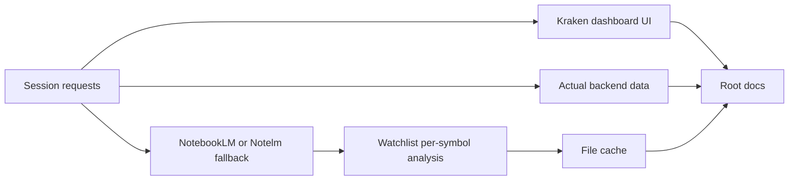
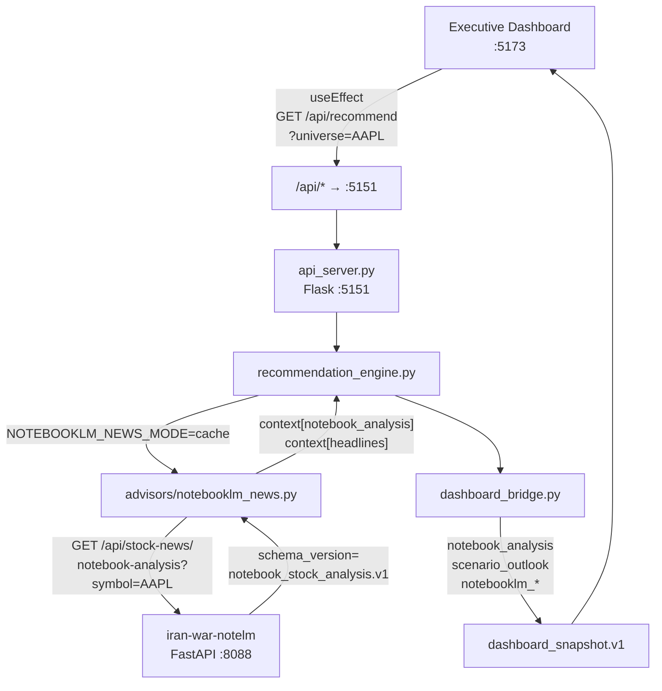
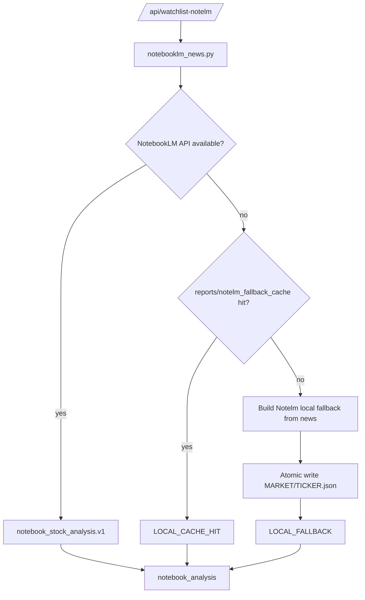
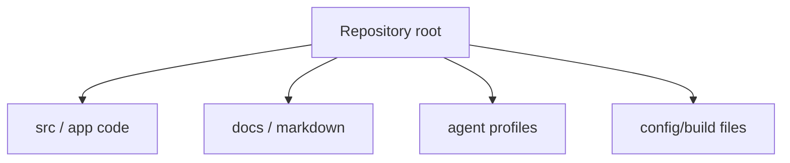
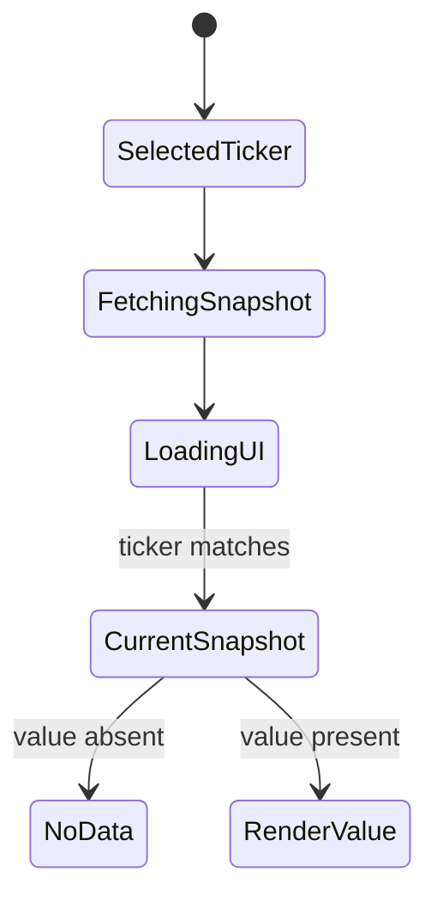
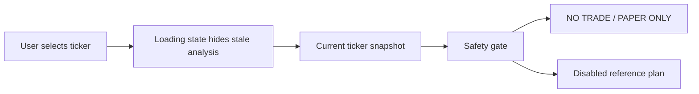

# STOCKPRED Executive Decision Dashboard v2.1
## 디자인 변경 상세 + 데이터 연결 가이드

작성일: 2026-05-30  
대상: `root_folder_snapshot/stock-pred-v5`  
브랜치: `claude/upgrade-investment-system-2Mc7x`

---

## 목차

1. [레이아웃 변경 개요](#1-레이아웃-변경-개요)
2. [화면 구조 상세](#2-화면-구조-상세)
3. [17개 신규 컴포넌트 명세](#3-17개-신규-컴포넌트-명세)
4. [feature flag 활성화](#4-feature-flag-활성화)
5. [데이터 연결 구조](#5-데이터-연결-구조)
6. [자동 fetch 동작](#6-자동-fetch-동작)
7. [AI Decision Panel 데이터 흐름](#7-ai-decision-panel-데이터-흐름)
8. [NotebookLM 뉴스 연동](#8-notebooklm-뉴스-연동)
9. [Scenario Outlook 생성 로직](#9-scenario-outlook-생성-로직)
10. [dashboard_snapshot.v1 데이터 계약](#10-dashboard_snapshotv1-데이터-계약)
11. [환경변수 레퍼런스](#11-환경변수-레퍼런스)
12. [전체 실행 명령](#12-전체-실행-명령)
13. [각 패널 데이터 없을 때 fallback](#13-각-패널-데이터-없을-때-fallback)
14. [검증 체크리스트](#14-검증-체크리스트)

---

## 구현 기록 링크

Kraken dark fintech 목업 적용 구현 기록은 별도 문서에 보존한다.

- 구현 기록: [`KRAKEN_DASHBOARD_REDESIGN_IMPLEMENTATION_20260530.md`](KRAKEN_DASHBOARD_REDESIGN_IMPLEMENTATION_20260530.md)
- actual-data 계획: [`../plan_20260530_actual_dashboard_data.md`](../plan_20260530_actual_dashboard_data.md)
- 최신 검증 캡처: [`../artifacts/dashboard-redesign/stockpred-actual-data-dashboard-20260530.png`](../artifacts/dashboard-redesign/stockpred-actual-data-dashboard-20260530.png)
- 최초 목업 검증 캡처: [`../artifacts/dashboard-redesign/stockpred-kraken-dashboard-20260530.png`](../artifacts/dashboard-redesign/stockpred-kraken-dashboard-20260530.png)

최신 backend field pass:

- `fundamentals`, `news_headlines`, `scenario_outlook`는 backend snapshot 결과에서 온다.
- NotebookLM 서버가 없으면 `news_headlines`는 yfinance news로 보강하고, `notebook_analysis`는 Notelm rule-based fallback으로 채운다.
- Notelm fallback은 `iran-war-notelm`의 Phase 2 원칙과 동일하게 NotebookLM query 실패 시 keyword score 기반 분석을 생성한다.
- Executive 자동 추천 요청은 `dashboard_config.json`의 recommendation 기본값을 따른다.

### 2026-05-30 세션 전체 구현 매트릭스

| 요청 | 반영 위치 | 현재 상태 |
|---|---|---|
| 목업 이미지와 동일한 Kraken dark fintech dashboard | `root_folder_snapshot/stock-pred-v5/src/components/*`, `StockPredV5.jsx` | 구현 및 build 검증 |
| 구현 기록 문서화와 링크 추가 | `docs/KRAKEN_DASHBOARD_REDESIGN_IMPLEMENTATION_20260530.md`, `README.md`, 이 가이드 | 반영 |
| backend snapshot의 `fundamentals/news/scenario` 실제 데이터화 | `src/stock_rtx4060/dashboard_bridge.py`, `recommendation_engine.py` | additive field pass |
| 추천 오류 행의 표시 데이터 실제 데이터화 | `src/stock_rtx4060/recommendation_engine.py` | `RED_DATA_OR_MODEL_ERROR`에서도 latest price/fundamentals/news/scenario overlay |
| NotebookLM 서버 down 시 Notelm fallback | `src/stock_rtx4060/advisors/notebooklm_news.py` | `analysis_source=notelm_fallback` |
| Watchlist 전체 종목별 Notelm fallback 매핑 | `api_server.py`, `StockPredV5.jsx`, `WatchlistPanel.jsx` | `/api/watchlist-notelm` |
| Watchlist 전체 종목 가격 실제 데이터화 | `api_server.py`, `StockPredV5.jsx`, `WatchlistPanel.jsx` | `/api/watchlist-notelm` OHLCV latest fields |
| 첫 Watchlist 로딩 개선용 파일 캐시 | `reports/notelm_fallback_cache/<MARKET>/<TICKER>.json` | `LOCAL_FALLBACK` → `LOCAL_CACHE_HIT` |
| root docs 일괄 갱신 설정 | `.root-docs-batch-update.toml` | repo-local target mapping 생성 |



---

## 1. 레이아웃 변경 개요

### 기존 (Classic Layout)

```text
┌─────────────────────────────────────────────┐
│ Header (brand + market toggle + clock)       │
├──────────┬──────────────────────────────────┤
│ Symbol   │ Center: 차트 (전체 높이 점유)    │
│ sidebar  │                                  │
│ (좌)     │                                  │
│          ├──────────────────────────────────┤
│          │ Right: SIGNAL/MODELS/BACKTEST/REC│
└──────────┴──────────────────────────────────┘
```

**문제:** 차트가 중앙 공간을 과대 점유 → AI 판단 정보가 탭 뒤에 숨겨짐

### 신규 Executive Layout (v2.1)

```text
┌─────────────────────────────────────────────────────┐
│ HeaderBar  STOCKPRED v2.1 | AAPL | US/KRX | REPORT  │
├──────────┬──────────────────┬───────────────────────┤
│ Current  │ AI Recommendation│ Confidence │ R/R       │
│ Price    │ verdict + score  │ gauge       │ ratio     │
├──────────┼──────────────────┼───────────────────────┤
│ Market   │ Price Chart      │ AI DECISION PANEL      │
│ Snapshot │ ≤300px           │ LLM Advisor            │
│          ├──────────────────┤ NotebookLM News        │
│ Regime   │ Model Scores     │ Action Plan            │
│ Score    │ (ML evidence)    │ Entry/Stop/TP          │
│ Prob     │                  │                        │
│ Vol Ratio│                  │                        │
├──────────┼──────────────────┼───────────────────────┤
│ Watchlist│ News Timeline    │ Scenario Outlook       │
│ AAPL$312 │ NotebookLM 뉴스  │ Bull/Base/Bear         │
│ MSFT$450 │ 타임라인         │ 확률 + 수익률          │
└──────────┴──────────────────┴───────────────────────┘
```

**핵심 원칙:**
- 차트는 compact evidence (≤300px)
- AI Decision Panel이 primary decision area (가장 큰 영역)
- 모든 핵심 정보가 첫 화면에 노출

---

## 2. 화면 구조 상세

### 2.1 Grid CSS 구조

```css
/* HeaderBar */
height: 52px;
grid-template-columns: auto 1fr auto auto auto auto;

/* TopKpiGrid — 4개 KPI 카드 */
display: grid;
grid-template-columns: 1fr 1fr 0.95fr 1.45fr;
gap: 16px;
margin-bottom: 14px;

/* MainDecisionGrid — 좌:중:우 = 1:2:3 비율 */
display: grid;
grid-template-columns: 0.95fr 1.9fr 2.85fr;
gap: 14px;
min-height: 448px;

/* BottomInsightGrid — 3열 */
display: grid;
grid-template-columns: 1.35fr 1.45fr 2.2fr;
gap: 14px;
min-height: 220px;

/* Price Chart 제한 */
max-height: 300px;
chart-body: 220px;
```

### 2.2 색상 토큰 (THEME)

```js
export const THEME = {
  bg:       "#020916",           // 전체 배경
  panel:    "rgba(9,20,36,0.94)",// 카드 배경
  panel2:   "rgba(12,28,48,0.92)",
  border:   "#1a2a38",
  borderHi: "#284057",
  text:     "#d4e1ec",
  textDim:  "#8a9bad",
  textMuted:"#536476",
  cyan:     "#20d6d2",           // 브랜드 accent
  green:    "#00ff88",           // 매수/bullish/pass
  red:      "#ff4d57",           // 매도/bearish/fail
  amber:    "#ffb020",           // 경고/중립
  blue:     "#2f8cff",           // 정보
  purple:   "#a86bff",           // 기타
};
```

---

## 3. 17개 신규 컴포넌트 명세

모든 컴포넌트 경로: `root_folder_snapshot/stock-pred-v5/src/components/`

### 3.1 DashboardCard.jsx — 공통 wrapper

```jsx
// 모든 패널의 기반 카드
<DashboardCard title="AI DECISION PANEL" subtitle="Powered by LLM + NotebookLM">
  {children}
</DashboardCard>
```

| Prop | 타입 | 설명 |
|---|---|---|
| `title` | string | 카드 제목 (uppercase) |
| `subtitle` | string | 보조 제목 (muted) |
| `right` | ReactNode | 우측 상단 배지/버튼 |
| `style` | object | 추가 CSS override |

---

### 3.2 HeaderBar.jsx — 최상단 네비게이션

```jsx
<HeaderBar
  market={market}           // "US" | "KRX"
  onMarketChange={setMarket}
  ticker={selected}         // "AAPL"
  onTickerChange={setSelected}
  symbols={execSymbols}     // [{symbol, name, price}]
  accent={accent}           // C.us | C.krx
/>
```

**데이터 연결:**
- `market` ← `StockPredV5` state
- `ticker` ← `selected` state
- `symbols` ← `/api/universe` 응답을 가공한 배열

---

### 3.3 CurrentPriceCard.jsx — 현재가 KPI

```jsx
<CurrentPriceCard
  price={last?.close}        // 숫자
  change={chg}               // last.close - prev.close
  changePct={chgPct}         // % 변화율
  volume={last?.volume}      // 거래량
  currency="$"               // "$" | "₩"
/>
```

**데이터 연결:**
```js
const last = cache[selected]?.data?.slice(-1)[0];   // OHLCV 마지막 행
const prev = cache[selected]?.data?.slice(-2)[0];   // 전날 행
const chg  = last && prev ? last.close - prev.close : null;
const chgPct = prev?.close ? (chg / prev.close * 100) : null;
```

---

### 3.4 RecommendationKpi.jsx — AI 추천 KPI

```jsx
<RecommendationKpi
  verdict={snap?.verdict}           // "ELIGIBLE_RECOMMENDATION" 등
  advisorScore={snap?.advisor_score} // -1.0 ~ +1.0
/>
```

**verdict → 색상 매핑:**

| verdict | 색상 |
|---|---|
| `ELIGIBLE_RECOMMENDATION` | green |
| `ACCUMULATE_RECOMMENDATION` | green |
| `AMBER_REVIEW_ONLY` | amber |
| `AMBER_WATCHLIST` | amber |
| `RED_NOT_RECOMMENDED` | red |
| `RED_DATA_INSUFFICIENT` | red |

---

### 3.5 ConfidenceKpi.jsx — 신뢰도 게이지

```jsx
<ConfidenceKpi
  confidence={snap?.notebooklm_confidence ?? snap?.probability}
  label="Confidence"
/>
```

- `notebooklm_confidence` 우선, 없으면 `direction_prob` fallback
- `aria-meter` 접근성 속성 포함
- 70%+ → green, 50%+ → amber, <50% → red

---

### 3.6 RiskRewardKpi.jsx — 위험보상비

```jsx
<RiskRewardKpi riskReward={snap?.risk_reward} />
```

| R/R | 등급 | 색상 |
|---|---|---|
| ≥ 2.5× | Attractive | green |
| 1.5–2.5× | Neutral | amber |
| < 1.5× | Poor | red |

---

### 3.7 MarketSnapshotPanel.jsx — 시장 상태

```jsx
<MarketSnapshotPanel result={snap} />
```

**표시 항목:**

| 라벨 | snap 필드 | 비고 |
|---|---|---|
| REGIME | `snap.advisor_regime` | risk_on/neutral/risk_off |
| MODEL SCORE | `snap.score` | 0-100 |
| PROBABILITY | `snap.probability` | % |
| VOL RATIO 20D | `snap.volume_ratio_20d` | ×배 |
| OOF COVERAGE | `snap.oof_coverage` | % |
| EXPECTED VAL | `snap.expected_value_pct` | % |

---

### 3.8 CompactPriceChart.jsx — 압축 차트 (≤300px)

```jsx
<CompactPriceChart
  ohlcvRecords={cache[selected]?.data || []}
  currency={currency}
/>
```

- Recharts `ComposedChart` 사용
- `ohlcvRecords.slice(-60)` — 최근 60일
- Bar: volume (배경), Line: close (시안색)
- `max-height: 300px` 강제

---

### 3.9 ModelScoresPanel.jsx — ML 모델 점수

```jsx
<ModelScoresPanel modelEvidence={modelEvidenceCache[modelEvidenceCacheKey]} />
```

- `modelEvidence` 없으면 "Backend evidence unavailable" 표시
- `/api/model-scores?symbol=AAPL` 응답 데이터 직접 표시

---

### 3.10 AiDecisionPanel.jsx — AI 의사결정 통합 패널

```jsx
<AiDecisionPanel result={snap} />
```

내부 구성:
1. **LLM Advisor** — advisor_score 바 + rationale
2. **NotebookNewsAnalysis** — notebook_analysis 뉴스 분석
3. **ActionPlanPanel** — Entry/Stop/TP1/TP2

---

### 3.11 NotebookNewsAnalysis.jsx — 뉴스 분석

```jsx
<NotebookNewsAnalysis
  analysis={snap?.notebook_analysis}
  compact={true}
/>
```

`analysis` 없으면 empty state: "NotebookLM analysis unavailable"

**표시 구조:**

```text
▲ BULLISH
  • iPhone 16 demand outpaces expectations
  • Services revenue hitting new highs

▼ BEARISH
  • China macro concerns
  • Regulatory pressure on App Store

[Earnings Call] [News] [Analyst Reports] [Filings]
```

---

### 3.12 KeyDriversPanel.jsx — 핵심 드라이버

```jsx
<KeyDriversPanel result={snap} />
```

- `snap.validations` 배열에서 PASS/FAIL 항목 추출
- PASS → ▲ green, FAIL → ▼ red
- 최대 5개 표시

---

### 3.13 ActionPlanPanel.jsx — 실행 계획

```jsx
<ActionPlanPanel result={snap} />
```

| 항목 | snap 필드 | 색상 |
|---|---|---|
| ENTRY | `snap.entry` | green |
| STOP | `snap.stop` | red |
| TP1 | `snap.tp1` | green |
| TP2 | `snap.tp2` | green |

**항상 표시:** `Reference only · Manual review required`

---

### 3.14 WatchlistPanel.jsx — 종목 리스트

```jsx
<WatchlistPanel
  symbols={execSymbols}      // [{symbol, name, price, changePct}]
  selected={selected}        // 현재 선택 종목
  onSelect={setSelected}     // 클릭 핸들러
/>
```

클릭 시 → `setSelected(s.symbol)` → `useEffect` 자동 재호출

---

### 3.15 NewsTimelinePanel.jsx — 뉴스 타임라인

```jsx
<NewsTimelinePanel headlines={headlines} />
```

`headlines` 구성:
```js
const headlines = snap?.notebook_analysis
  ? [{ title: snap.notebook_analysis.summary, source: "NotebookLM", published_at: snap.notebooklm_as_of }]
  : [];
```

---

### 3.16 ScenarioOutlookPanel.jsx — 시나리오 전망

```jsx
<ScenarioOutlookPanel scenario={snap?.scenario_outlook} />
```

**표시 구조:**

```text
┌──────────┬──────────┬──────────┐
│  Bull    │  Base    │  Bear    │
│  Case    │  Case    │  Case    │
├──────────┼──────────┼──────────┤
│ $200+    │ $180-195 │ $160     │
│ +10.0%   │ +3.5%    │ -8.0%   │
│ ████ 30% │ ████ 50% │ ███ 20% │
└──────────┴──────────┴──────────┘
Report-only · Manual review required
```

---

### 3.17 KpiCard.jsx — 범용 KPI 카드

```jsx
<KpiCard
  label="LABEL"
  value="$312.06"
  sub="부가 정보"
  accent={THEME.cyan}
  icon="📈"
/>
```

범용 카드로 커스텀 KPI 추가 시 사용.

---

## 4. feature flag 활성화

### 개발 서버 (Vite)

```bash
# Executive 레이아웃 활성화
VITE_DASHBOARD_LAYOUT=executive npx vite --port 5173

# Classic 레이아웃 (기존)
npx vite --port 5173
```

### 프로덕션 빌드

```bash
# Executive 빌드
VITE_DASHBOARD_LAYOUT=executive npm run build

# Classic 빌드
npm run build
```

### .env 파일로 고정

```env
# root_folder_snapshot/stock-pred-v5/.env.local
VITE_DASHBOARD_LAYOUT=executive
VITE_API_URL=http://127.0.0.1:5151
```

### 코드 진입점

```js
// StockPredV5.jsx line 19
const EXEC_LAYOUT = import.meta.env.VITE_DASHBOARD_LAYOUT === "executive";
```

`EXEC_LAYOUT=true` → Executive 레이아웃 return (기존 레이아웃 건너뜀)
`EXEC_LAYOUT=false` → 기존 Classic 레이아웃 그대로 실행

---

## 5. 데이터 연결 구조

### 5.1 전체 데이터 흐름



### 5.2 `/api/recommend` 요청 파라미터

```js
// StockPredV5.jsx — execSnap useEffect
const params = new URLSearchParams({
  universe: selected,           // "AAPL"
  market: mkt,                  // "US" | "KRX"
  top: "1",                     // 1개만 요청
  period: "1y",                 // 1년 데이터
  data_provider: mkt === "KRX" ? "pykrx" : "yfinance",
  output_dir: `reports/exec_rec_${mkt.toLowerCase()}`,
});
fetch(`${API_BASE}/api/recommend?${params}`)
```

### 5.3 응답에서 snap 추출

```js
.then(data => {
  const result = data?.results?.[0] ?? null;  // 첫 번째 후보
  setExecSnap(result);                         // React state 업데이트
})
```

---

## 6. 자동 fetch 동작

### 트리거 조건

```js
useEffect(() => {
  if (!EXEC_LAYOUT || !selected) return;  // flag 꺼져있거나 종목 없으면 skip
  // ... fetch
}, [selected, EXEC_LAYOUT]);              // selected 바뀔 때마다 실행
```

### 트리거 시점

| 이벤트 | 트리거 여부 |
|---|---|
| 페이지 최초 로딩 | ✅ (selected 초기값 설정 후) |
| WatchlistPanel 종목 클릭 | ✅ |
| HeaderBar 셀렉터 변경 | ✅ |
| 시장(US/KRX) 전환 | ✅ (selected 리셋됨) |
| 동일 종목 재클릭 | ❌ (selected 변경 없음) |

### 로딩 상태

```jsx
{execSnapLoading && (
  <div style={{ background: "rgba(32,214,210,0.07)", border: "1px solid rgba(32,214,210,0.2)" }}>
    ⟳ Loading AI analysis for {selected}…
  </div>
)}
```

### Race condition 방지

```js
let cancelled = false;
fetch(...)
  .then(data => {
    if (cancelled) return;   // 이전 요청 응답 무시
    setExecSnap(...);
  });
return () => { cancelled = true; };  // cleanup: 다음 effect 실행 전 취소
```

---

## 7. AI Decision Panel 데이터 흐름

### 7.1 LLM Advisor 블록

```js
// AiDecisionPanel.jsx → snap에서 직접 읽음
const score    = snap?.advisor_score;     // -1.0 ~ +1.0
const rationale = snap?.advisor_rationale; // 최대 240자
const verdict  = snap?.verdict;           // "ELIGIBLE_RECOMMENDATION" 등
```

**score → 시각화:**
- 중앙 기준선(0) 기준으로 좌우 바 렌더링
- score ≥ 0 → green 바 (오른쪽)
- score < 0 → red 바 (왼쪽)

### 7.2 NotebookLM 블록

```js
// snap.notebook_analysis 구조
{
  summary: "AAPL news flow remains moderately bullish.",
  bullish_factors: ["iPhone 16 demand...", "Services revenue..."],
  bearish_factors: ["China macro concerns...", "Regulatory pressure..."],
  sentiment: "bullish",         // bullish|bearish|neutral|mixed
  sentiment_score: 0.62,        // -1.0 ~ +1.0
  source_labels: ["Earnings Call", "News", "Analyst Reports"]
}
```

**백엔드 생성 경로:**
```
iran-war-notelm :8088
  → cache HIT: storage/stock_news_cache/US/AAPL.json
  → schema_version: notebook_stock_analysis.v1
  → analysis.{summary, bullish_factors, bearish_factors, sentiment_score}
  ↓
advisors/notebooklm_news.py
  → enrich_context_with_notebooklm()
  → ctx["notebook_analysis"] = {...}
  ↓
recommendation_engine.py
  → RecommendationResult.notebook_analysis
  ↓
dashboard_bridge.py
  → _normalize_result() → result["notebook_analysis"] passthrough
  ↓
dashboard_snapshot.v1.results[0].notebook_analysis
```

### 7.3 Action Plan 블록

```js
// snap에서 직접 읽음
snap.entry    // 진입 기준가
snap.stop     // 손절 기준가
snap.tp1      // 1차 목표가
snap.tp2      // 2차 목표가
```

**안전 경계:** 항상 "Reference only · Manual review required" 표시

---

## 8. NotebookLM 뉴스 연동

### 8.1 iran-war-notelm 서버 시작

```bash
cd C:\Users\jichu\Downloads\주식\.codex-inspect\iran-war-notelm\iran-war-uae-monitor
PYTHONPATH=src uvicorn iran_monitor.health:app --host 127.0.0.1 --port 8088
```

**엔드포인트 확인:**
```bash
curl http://127.0.0.1:8088/health
curl "http://127.0.0.1:8088/api/stock-news/notebook-analysis?symbol=AAPL&market=US"
```

### 8.2 stock_1901 .env 설정

```env
# stock_1901/.env
NOTEBOOKLM_NEWS_MODE=cache          # cache|on|off
NOTEBOOKLM_NEWS_API_BASE=http://127.0.0.1:8088
NOTEBOOKLM_NEWS_TIMEOUT_SEC=3
NOTEBOOKLM_NEWS_LOCAL_FALLBACK=true # 8088 down -> notelm_fallback analysis
NOTEBOOKLM_NEWS_LOCAL_CACHE_DIR=reports/notelm_fallback_cache
NOTEBOOKLM_NEWS_LOCAL_FALLBACK_TTL_SEC=900
ADVISOR_RUN=true
ADVISOR_BLEND_WEIGHT=0.10
```

### 8.3 캐시 파일 구조

```json
// storage/stock_news_cache/US/AAPL.json
{
  "schema_version": "notebook_stock_analysis.v1",
  "symbol": "AAPL",
  "market": "US",
  "as_of": "2026-05-30T14:00:00+04:00",
  "analysis": {
    "summary": "moderately bullish",
    "bullish_factors": ["AI demand", "iPhone cycle"],
    "bearish_factors": ["China macro"],
    "sentiment": "bullish",
    "sentiment_score": 0.40,
    "market_impact": "MEDIUM_HIGH",
    "confidence": 0.80,
    "recommended_llm_instruction": "verify against momentum"
  },
  "sources": [
    {
      "source_id": "s1",
      "title": "AAPL news",
      "url": "https://reuters.com/...",
      "source": "Reuters",
      "relevance": 0.90
    }
  ],
  "cache": {
    "status": "HIT",
    "ttl_seconds": 900,
    "generated_at": "2026-05-30T14:00:00+04:00"
  }
}
```

**캐시 TTL 갱신 (수동):**
```python
from pathlib import Path
import json
from datetime import datetime, timezone

cache = Path("storage/stock_news_cache/US/AAPL.json")
data = json.loads(cache.read_text(encoding="utf-8"))
data["cache"]["generated_at"] = datetime.now(timezone.utc).isoformat()
data["as_of"] = datetime.now(timezone.utc).isoformat()
cache.write_text(json.dumps(data, indent=2), encoding="utf-8")
```

### 8.3-A Notelm fallback 파일 캐시

NotebookLM API 서버가 꺼져 있거나 `:8088` 호출이 실패하면 `advisors/notebooklm_news.py`는 Notelm-style local fallback 분석을 만든다.
이 fallback 결과는 첫 생성 후 파일 캐시에 저장되며, Watchlist 재요청은 TTL 안에서 파일 캐시를 먼저 읽는다.



| 항목 | 계약 |
|---|---|
| 저장 경로 | `reports/notelm_fallback_cache/<MARKET>/<TICKER>.json` |
| 기본 TTL | `900`초 |
| 경로 환경변수 | `NOTEBOOKLM_NEWS_LOCAL_CACHE_DIR` |
| TTL 환경변수 | `NOTEBOOKLM_NEWS_LOCAL_FALLBACK_TTL_SEC` |
| cold 상태값 | `LOCAL_FALLBACK` |
| warm 상태값 | `LOCAL_CACHE_HIT` |
| Watchlist 검증 | 9개 종목 cold `24.75s` → warm `6.41s` |

캐시 파일은 `symbol`, `market`, `schema_version`, `cache.generated_at`을 확인한 뒤 사용한다.
만료되었거나 스키마가 맞지 않으면 파일을 무시하고 fallback 분석을 다시 생성한다.

### 8.4 데이터가 dashboard에 표시되는 경로

```
iran-war-notelm API :8088
    ↓ (cache HIT, 15분 TTL)
advisors/notebooklm_news.fetch_notebooklm_analysis("AAPL")
    ↓ schema_version 검증
advisors/notebooklm_news.enrich_context_with_notebooklm("AAPL", ctx)
    → ctx["notebook_analysis"] = {summary, bullish_factors, ...}
    → ctx["headlines"] = [{source, title, url, ...}]
    ↓
recommendation_engine._apply_advisor_blend()
    → RecommendationResult.notebook_analysis = {...}
    → RecommendationResult.notebooklm_impact = "MEDIUM_HIGH"
    ↓
dashboard_bridge._normalize_result()
    → snapshot.results[0].notebook_analysis = {...}
    → snapshot.results[0].notebooklm_impact = "MEDIUM_HIGH"
    ↓
StockPredV5 execSnap = snapshot.results[0]
    ↓
AiDecisionPanel result={execSnap}
    → NotebookNewsAnalysis analysis={execSnap.notebook_analysis}
        → bullish_factors 표시
        → bearish_factors 표시
        → sentiment/sentiment_score 표시
```

### 8.5 Watchlist 전체 종목 Notelm 경로

```
StockPredV5 recUniverse
    ↓
GET /api/watchlist-notelm?universe=AAPL,MSFT,...&market=US
    ↓
api_server.api_watchlist_notelm()
    ↓
ThreadPoolExecutor(max_workers<=6)
    ↓
enrich_context_with_notebooklm(symbol, {"market": market})
    ↓
NotebookLM API 성공: notebooklm analysis
NotebookLM API 실패: Notelm fallback or LOCAL_CACHE_HIT
    ↓
WatchlistPanel rows
    → AI Rec
    → Confidence
    → title: analysis_source + news count
```

`/api/watchlist-notelm`은 full recommendation engine을 종목 수만큼 실행하지 않는다.
대시보드 Watchlist 표시에 필요한 뉴스 분석 payload만 반환한다.
가격과 등락도 같은 endpoint에서 `load_ohlcv_with_provider(..., synthetic=False)`로 가져온 최신 OHLCV에서 계산한다.
따라서 non-selected Watchlist 종목도 프론트 차트 캐시가 없다는 이유로 가격이 `—`로 남지 않는다.

---

## 9. Scenario Outlook 생성 로직

### 9.1 데이터 있을 때 (passthrough)

`snapshot.results[0].scenario_outlook` 이 있으면 그대로 표시.

### 9.2 데이터 없을 때 (자동 fallback)

`dashboard_bridge._build_scenario_fallback(result)` 자동 호출:

```python
def _build_scenario_fallback(result: dict) -> dict:
    entry = result.get("entry") or result.get("latest_close") or 0.0
    tp2   = result.get("tp2") or 0.0
    stop  = result.get("stop") or 0.0
    prob  = result.get("direction_prob") or 0.5

    bull_prob = round(max(0.10, min(0.50, prob * 0.65)), 2)
    bear_prob = round(max(0.10, min(0.40, (1 - prob) * 0.60)), 2)
    base_prob = round(max(0.10, 1.0 - bull_prob - bear_prob), 2)

    bull_ret = round((tp2 - entry) / entry * 100, 1) if entry > 0 and tp2 > 0 else 10.0
    bear_ret = round((stop - entry) / entry * 100, 1) if entry > 0 and stop > 0 else -8.0

    return {
        "bull": {"range": f"${tp2:.0f}+", "return": f"+{bull_ret:.1f}%", "probability": bull_prob},
        "base": {"range": f"${entry:.0f} - ${tp2 * 0.6 + entry * 0.4:.0f}", "return": f"+{bull_ret * 0.4:.1f}%", "probability": base_prob},
        "bear": {"range": f"${stop:.0f}", "return": f"{bear_ret:.1f}%", "probability": bear_prob},
    }
```

---

## 10. dashboard_snapshot.v1 데이터 계약

### 10.1 기존 필드 (변경 없음)

```json
{
  "schema_version": "dashboard_snapshot.v1",
  "results": [{
    "ticker": "AAPL",
    "verdict": "ELIGIBLE_RECOMMENDATION",
    "score": 68.5,
    "probability": 0.59,
    "entry": 308.0,
    "stop": 300.0,
    "tp1": 320.0,
    "tp2": 330.0,
    "risk_reward": 2.7,
    "advisor_score": 0.28,
    "advisor_rationale": "...",
    "screening_output_only": true
  }]
}
```

### 10.2 신규 필드 (2026-05-30 추가, 모두 additive)

```json
{
  "results": [{
    "notebooklm_impact": "MEDIUM_HIGH",
    "notebooklm_confidence": 0.80,
    "notebooklm_source_count": 1,
    "notebooklm_as_of": "2026-05-30T14:00:00+04:00",
    "notebook_analysis": {
      "summary": "moderately bullish",
      "bullish_factors": ["AI demand", "iPhone cycle"],
      "bearish_factors": ["China macro"],
      "ticker_relevance": 0.9,
      "sentiment": "bullish",
      "sentiment_score": 0.40,
      "market_impact": "MEDIUM_HIGH",
      "confidence": 0.80,
      "recommended_llm_instruction": "verify against momentum",
      "notebook": {"notebook_id": "nb_001", "source_count": 1},
      "as_of": "2026-05-30T14:00:00+04:00"
    },
    "scenario_outlook": {
      "bull": {"range": "$330+", "return": "+7.1%", "probability": 0.38},
      "base": {"range": "$308 - $322", "return": "+2.8%", "probability": 0.43},
      "bear": {"range": "$300", "return": "-2.6%", "probability": 0.19}
    }
  }]
}
```

**backward compatibility:** 기존 필드 모두 유지. 새 필드는 없으면 null.

---

## 11. 환경변수 레퍼런스

### 11.1 stock_1901 Backend

| 변수 | 기본값 | 설명 |
|---|---|---|
| `NOTEBOOKLM_NEWS_MODE` | `off` | `cache\|on\|1\|true\|off` |
| `NOTEBOOKLM_NEWS_API_BASE` | `http://127.0.0.1:8088` | iran-war-notelm 주소 |
| `NOTEBOOKLM_NEWS_TIMEOUT_SEC` | `3.0` | HTTP 타임아웃 |
| `NOTEBOOKLM_NEWS_LOCAL_FALLBACK` | `true` | NotebookLM 실패 시 Notelm fallback 생성 |
| `NOTEBOOKLM_NEWS_LOCAL_CACHE_DIR` | `reports/notelm_fallback_cache` | Notelm fallback 파일 캐시 경로 |
| `NOTEBOOKLM_NEWS_LOCAL_FALLBACK_TTL_SEC` | `900` | 파일 캐시 TTL |
| `ADVISOR_RUN` | `true` (`.env`) | LLM Advisor 자동 실행 |
| `ADVISOR_BLEND_WEIGHT` | `0.10` | score 블렌딩 가중치 |
| `ADVISOR_WEIGHTS_MODE` | `mab` | `mab`=Thompson Sampling, `fixed`=고정 |

### 11.2 iran-war-notelm Server

| 변수 | 기본값 | 설명 |
|---|---|---|
| `STOCK_NEWS_ENABLED` | `true` | 뉴스 수집 활성화 |
| `STOCK_NEWS_TTL_SEC` | `900` | 캐시 TTL (15분) |
| `STOCK_NEWS_MAX_ARTICLES` | `12` | 최대 기사 수 |
| `STOCK_NEWS_CACHE_DIR` | `storage/stock_news_cache` | 캐시 경로 |
| `NOTEBOOKLM_QUERY_TIMEOUT_SEC` | `90` | NotebookLM 쿼리 타임아웃 |

### 11.3 Frontend (Vite)

| 변수 | 기본값 | 설명 |
|---|---|---|
| `VITE_DASHBOARD_LAYOUT` | `""` | `executive` 설정 시 v2.1 활성화 |
| `VITE_API_URL` | `http://127.0.0.1:5151` | Flask API 주소 |

---

## 12. 전체 실행 명령

### 12.1 최소 실행 (classic 레이아웃)

```bash
# 1. Flask API 시작
cd C:\Users\jichu\Downloads\주식\stock_1901
python api_server.py --port 5151

# 2. Dashboard 시작
cd root_folder_snapshot\stock-pred-v5
npx vite --port 5173
# → http://127.0.0.1:5173
```

### 12.2 Executive 레이아웃 (NotebookLM 없이)

```bash
# 1. Flask API (.env 로드됨)
cd C:\Users\jichu\Downloads\주식\stock_1901
python api_server.py --port 5151

# 2. Executive Dashboard
cd root_folder_snapshot\stock-pred-v5
VITE_DASHBOARD_LAYOUT=executive npx vite --port 5173
```

### 12.3 완전 연동 (NotebookLM 포함)

```bash
# Terminal 1: iran-war-notelm API
cd C:\Users\jichu\Downloads\주식\.codex-inspect\iran-war-notelm\iran-war-uae-monitor
PYTHONPATH=src uvicorn iran_monitor.health:app --host 127.0.0.1 --port 8088

# Terminal 2: stock_1901 Backend
cd C:\Users\jichu\Downloads\주식\stock_1901
# .env: NOTEBOOKLM_NEWS_MODE=cache, NOTEBOOKLM_NEWS_API_BASE=http://127.0.0.1:8088
python api_server.py --port 5151

# Terminal 3: Executive Dashboard
cd root_folder_snapshot\stock-pred-v5
VITE_DASHBOARD_LAYOUT=executive npx vite --port 5173
```

### 12.4 통합 smoke 테스트

```bash
# API 헬스체크
curl http://127.0.0.1:5151/api/health
curl http://127.0.0.1:8088/health

# NotebookLM 캐시 확인
curl "http://127.0.0.1:8088/api/stock-news/notebook-analysis?symbol=AAPL&market=US"

# 추천 엔진 (NotebookLM 포함)
cd C:\Users\jichu\Downloads\주식\stock_1901
PYTHONPATH=src NOTEBOOKLM_NEWS_MODE=cache NOTEBOOKLM_NEWS_API_BASE=http://127.0.0.1:8088 \
python -c "
from stock_rtx4060.advisors.notebooklm_news import enrich_context_with_notebooklm
ctx = enrich_context_with_notebooklm('AAPL', {'market': 'US'})
print('enriched:', ctx['notebooklm_enriched'])
print('impact:', ctx.get('notebook_analysis', {}).get('market_impact'))
"
```

---

## 13. 각 패널 데이터 없을 때 fallback

| 패널 | 데이터 없을 때 | 처리 |
|---|---|---|
| CurrentPriceCard | `last = null` | `—` 표시 |
| RecommendationKpi | `snap = null` | `—` 표시 |
| ConfidenceKpi | confidence null | `—`, progress bar 비움 |
| RiskRewardKpi | risk_reward null | `—` 표시 |
| MarketSnapshotPanel | snap null | 모든 행 `—` |
| CompactPriceChart | ohlcvRecords 빈 배열 | "No chart data" |
| ModelScoresPanel | modelEvidence null | "Backend evidence unavailable" |
| AiDecisionPanel → LLM | advisor_score null | 바 숨김, rationale "unavailable" |
| NotebookNewsAnalysis | analysis null | 📰 empty state + 안내 메시지 |
| KeyDriversPanel | validations [] | "No driver data" |
| ActionPlanPanel | entry/stop null | `—` 표시, 안전 문구 유지 |
| WatchlistPanel | symbols [] | "No symbols" |
| NewsTimelinePanel | headlines [] | "No news data · Enable NotebookLM for live news" |
| ScenarioOutlookPanel | scenario null | "Scenario data unavailable" |

---

## 14. 검증 체크리스트

### 14.1 레이아웃

- [ ] HeaderBar: 브랜드 / 종목 셀렉터 / US·KRX 버튼 / REPORT ONLY 표시
- [ ] 4개 KPI 카드: 가격 / 추천 / 신뢰도 / R/R 모두 렌더링
- [ ] Price Chart height ≤ 300px
- [ ] AI Decision Panel: LLM Advisor 바 + rationale 표시
- [ ] Watchlist: 종목 가격 표시, 클릭 시 종목 전환
- [ ] Scenario Outlook: Bull/Base/Bear 3칸 표시
- [ ] Footer: `dashboard_snapshot.v1 · screening_output_only · Report-only · No broker execution`

### 14.2 데이터 연결

- [ ] 종목 변경 시 로딩 배너 표시
- [ ] `/api/recommend` 자동 호출 확인 (DevTools Network)
- [ ] `snap.verdict` → RecommendationKpi 색상 반영
- [ ] `snap.advisor_score` → LLM Advisor 바 방향/크기
- [ ] `snap.notebook_analysis` → NotebookNewsAnalysis 표시
- [ ] `snap.scenario_outlook` 없을 때 fallback 자동 생성 확인

### 14.3 안전 경계

- [ ] 브로커 주문 버튼 없음
- [ ] Action Plan에 "Reference only" 문구 표시
- [ ] Scenario에 "Report-only" 문구 표시
- [ ] advisor_score ∈ [-1, +1] 범위 초과 없음

### 14.4 NotebookLM 연동

```bash
# iran-war-notelm 서버 응답 확인
curl "http://127.0.0.1:8088/api/stock-news/notebook-analysis?symbol=AAPL" | python -m json.tool | grep -E "schema_version|sentiment|market_impact|cache"

# stock_1901 어댑터 확인
NOTEBOOKLM_NEWS_MODE=cache python -c "
from src.stock_rtx4060.advisors.notebooklm_news import fetch_notebooklm_analysis
p = fetch_notebooklm_analysis('AAPL')
print('OK' if p else 'FAIL')
"
```

### 14.5 npm build 성공

```bash
cd root_folder_snapshot\stock-pred-v5
VITE_DASHBOARD_LAYOUT=executive npm run build
# → ✓ built in X.XXs (경고만 있고 에러 없어야 함)
```

---

## 부록: 컴포넌트 import 순서 (StockPredV5.jsx)

```jsx
import RecommendationPanel from "./components/RecommendationPanel";

// Executive Dashboard v2.1 imports
import HeaderBar from "./components/HeaderBar";
import KpiCard from "./components/KpiCard";
import CurrentPriceCard from "./components/CurrentPriceCard";
import RecommendationKpi from "./components/RecommendationKpi";
import ConfidenceKpi from "./components/ConfidenceKpi";
import RiskRewardKpi from "./components/RiskRewardKpi";
import MarketSnapshotPanel from "./components/MarketSnapshotPanel";
import CompactPriceChart from "./components/CompactPriceChart";
import ModelScoresPanel from "./components/ModelScoresPanel";
import AiDecisionPanel from "./components/AiDecisionPanel";
import WatchlistPanel from "./components/WatchlistPanel";
import NewsTimelinePanel from "./components/NewsTimelinePanel";
import ScenarioOutlookPanel from "./components/ScenarioOutlookPanel";

const EXEC_LAYOUT = import.meta.env.VITE_DASHBOARD_LAYOUT === "executive";
```

---

*작성: 2026-05-30 | 브랜치: `claude/upgrade-investment-system-2Mc7x` | 버전: v2.1.0*


## Codex Documentation Update — 2026-05-30T21:17:53.115243+00:00

**Update policy:** existing content above this section is preserved. This section was appended after scanning code, documentation, config, and agent profile files.

**Purpose:** This section maps the detected repository layout and documentation surface.

### Evidence inventory

**Source/code files sampled:**
- `.cursor\skills\rd-agent-cursor-mine\references\factor_template.py`
- `.cursor\skills\rd-agent-cursor-mine\scripts\cursor_mine_runner.py`
- `.cursor\skills\rd-agent-cursor-mine\scripts\run_cursor_mine.ps1`
- `.cursor\skills\rd-agent-cursor-mine\scripts\run_weekly.ps1`
- `api_server.py`
- `dashboard\stock_pred_v5.jsx`
- `docs\purged_kfold_embargo.py`
- `docs\test_purged_kfold_embargo.py`
- `flows\__init__.py`
- `flows\daily_krx.py`
- `flows\daily_us.py`
- `flows\research_weekly.py`

**Documentation files sampled:**
- `.codex\design_upgrade_latest_artifact.txt`
- `.codex\goals\dashboard-report-bridge.goal.md`
- `.codex\goals\mcp-openbb-audit-phase1.goal.md`
- `.codex\root-docs-strict\docs\001-README.md`
- `.codex\root-docs-strict\docs\002-SYSTEM_ARCHITECTURE.md`
- `.codex\root-docs-strict\docs\003-LAYOUT.md`
- `.codex\root-docs-strict\docs\004-CHANGELOG.md`
- `.codex\root-docs-strict\docs\005-plan.md`
- `.codex\root-docs-strict\docs\006-codex-default-doc-agent.md`
- `.continue\checks\01-financial-safety-boundary.md`
- `.continue\checks\02-backtest-integrity.md`
- `.continue\checks\03-recommendation-contract.md`

**Config/build files sampled:**
- `.claude\launch.json`
- `.codex\agents\design-patcher.toml`
- `.codex\agents\reference-hunter.toml`
- `.codex\agents\visual-verifier.toml`
- `.codex\config.toml`
- `.codex\root-docs-current-verify.json`
- `.codex\root-docs-dry-run-latest.json`
- `.codex\root-docs-dry-run.json`
- `.codex\root-docs-notelm-cache-update.json`
- `.codex\root-docs-scan-20260531-loading.json`
- `.codex\root-docs-scan-current.json`
- `.codex\root-docs-scan-latest.json`

**Agent profile files sampled:**
- `.codex\agents\design-patcher.toml` (`design_patcher`)
- `.codex\agents\reference-hunter.toml` (`reference_hunter`)
- `.codex\agents\visual-verifier.toml` (`visual_verifier`)
- `docs\agents\codex-default-doc-agent.md` (`codex-default-doc-agent`)

### Mermaid graph



### Verification notes

- Append-only update generated by `root-docs-batch-update`.
- Code/config/doc/agent inventory counts: code=2459, docs=606, config=317, agent_profiles=4.
- Follow-up verification should confirm that newly added text matches actual implementation paths listed above.

## Dashboard Runtime Note - 2026-05-31 Ticker Loading and Placeholder Policy

When a user changes the selected ticker in Executive Dashboard v2.1, the UI must not show the previous ticker's LLM or OpenAI analysis while the new `/api/recommend` request is pending.

The current implementation follows this policy:

- Show `Loading AI analysis for <ticker>` at the dashboard level while the selected ticker request is pending.
- Show the AI Decision Panel `PENDING` loading state until the new snapshot ticker matches the selected ticker.
- Show `Loading` for transient KPI and Market Snapshot values.
- Show `No data` only when loading has finished and the current snapshot lacks the value.
- Do not use a single `—` glyph as a missing-data placeholder in the visible executive dashboard.



Verified browser behavior: AAPL, MSFT, NVDA, TSLA, AMZN, GOOGL, META, SPY, and QQQ were selected in the running dashboard. The visible `—` count stayed at `0` during loading, and it stayed at `0` after QQQ OpenAI analysis completed.


## Codex Documentation Update — 2026-05-30T22:14:11.815406+00:00

**Update policy:** existing content above this section is preserved. This section was appended after scanning code, documentation, config, and agent profile files.

**Purpose:** This section maps the detected repository layout and documentation surface.

### Evidence inventory

**Source/code files sampled:**
- `.codex\dashboard_safety_runtime\.vite\deps\chunk-3UH5YVBD.js`
- `.codex\dashboard_safety_runtime\.vite\deps\chunk-ZQJNXTLV.js`
- `.codex\dashboard_safety_runtime\.vite\deps\react-dom_client.js`
- `.codex\dashboard_safety_runtime\.vite\deps\react.js`
- `.codex\dashboard_safety_runtime\.vite\deps\recharts.js`
- `.codex\dashboard_safety_runtime\main.jsx`
- `.cursor\skills\rd-agent-cursor-mine\references\factor_template.py`
- `.cursor\skills\rd-agent-cursor-mine\scripts\cursor_mine_runner.py`
- `.cursor\skills\rd-agent-cursor-mine\scripts\run_cursor_mine.ps1`
- `.cursor\skills\rd-agent-cursor-mine\scripts\run_weekly.ps1`
- `api_server.py`
- `dashboard\stock_pred_v5.jsx`

**Documentation files sampled:**
- `.codex\design_upgrade_latest_artifact.txt`
- `.codex\goals\dashboard-report-bridge.goal.md`
- `.codex\goals\mcp-openbb-audit-phase1.goal.md`
- `.codex\root-docs-strict\docs\001-README.md`
- `.codex\root-docs-strict\docs\002-SYSTEM_ARCHITECTURE.md`
- `.codex\root-docs-strict\docs\003-LAYOUT.md`
- `.codex\root-docs-strict\docs\004-CHANGELOG.md`
- `.codex\root-docs-strict\docs\005-plan.md`
- `.codex\root-docs-strict\docs\006-codex-default-doc-agent.md`
- `.continue\checks\01-financial-safety-boundary.md`
- `.continue\checks\02-backtest-integrity.md`
- `.continue\checks\03-recommendation-contract.md`

**Config/build files sampled:**
- `.claude\launch.json`
- `.codex\agents\design-patcher.toml`
- `.codex\agents\reference-hunter.toml`
- `.codex\agents\visual-verifier.toml`
- `.codex\config.toml`
- `.codex\dashboard_safety_runtime\.vite\deps\_metadata.json`
- `.codex\dashboard_safety_runtime\.vite\deps\package.json`
- `.codex\root-docs-current-verify.json`
- `.codex\root-docs-dry-run-latest.json`
- `.codex\root-docs-dry-run.json`
- `.codex\root-docs-notelm-cache-update.json`
- `.codex\root-docs-scan-20260531-loading.json`

**Agent profile files sampled:**
- `.codex\agents\design-patcher.toml` (`design_patcher`)
- `.codex\agents\reference-hunter.toml` (`reference_hunter`)
- `.codex\agents\visual-verifier.toml` (`visual_verifier`)
- `docs\agents\codex-default-doc-agent.md` (`codex-default-doc-agent`)

### Mermaid graph


### Verification notes

- Append-only update generated by `root-docs-batch-update`.
- Code/config/doc/agent inventory counts: code=2466, docs=610, config=332, agent_profiles=4.
- Follow-up verification should confirm that newly added text matches actual implementation paths listed above.

## Executive Dashboard Safety Gate Port - 2026-05-30T22:14Z

The active Executive Dashboard now displays safety gate state in the same Kraken-style dashboard surface used by the user-facing Vite app.

Display rules:
- Hard blocked snapshots render `NO TRADE / PAPER ONLY`.
- Confidence is capped at `<=50%` and labeled `Blocked by risk gate`.
- Risk/reward changes from an actionable ratio to `No trade`.
- The AI Decision Panel shows `RISK GATE ACTIVE - NO TRADE / PAPER ONLY`.
- The Action Plan shows `REFERENCE PLAN - DISABLED BY RISK GATE`.
- The selected Watchlist row shows `NO TRADE` after the new ticker snapshot finishes loading.

Verification evidence:
- `npm run build` passed in `root_folder_snapshot/stock-pred-v5`.
- Browser verification on `http://127.0.0.1:5173/` confirmed AAPL and MSFT completed into the safety gate view.


