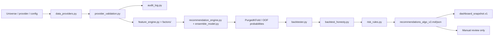

# 주식 투자정보 생성 알고리즘 조사 문서

작성일: 2026-05-29  
작업 위치: `C:\Users\jichu\Downloads\주식\stock_1901`  
상태: 조사 및 설계 문서  
범위: 투자정보 보고서 생성 알고리즘. 자동매매, 브로커 주문, 계좌 조작, 개인화 투자조언은 제외한다.

## 1. 결론

이 프로젝트의 안전한 방향은 "매수/매도 지시"가 아니라 "수동 검토용 투자정보 보고서"를 만드는 알고리즘이다.

따라서 알고리즘은 아래 4가지를 반드시 분리해야 한다.

| 구분 | 의미 | 출력에서의 처리 |
|---|---|---|
| 원자료 신뢰도 | 데이터가 충분하고 시점에 맞는가 | 데이터 신선도, 공급자, 결측, 감사 로그 |
| 신호 점수 | 기술적 지표, 팩터, ML이 만든 후보 점수 | `raw_score` 또는 기존 추천 점수 |
| 투자준비도 | 실제 검토 후보로 올릴 만큼 검증됐는가 | 별도 `investment_readiness_score` |
| 실행 여부 | 실제 주문 또는 계좌 행동인가 | 항상 제외. `screening_output_only=True` 유지 |

핵심 원칙은 간단하다.

```text
입력: 시점일치 데이터, 가격/재무/공시/거시/뉴스 정보
처리: 누수 방지 피처, 팩터/ML 점수, OOF 백테스트, 비용/리스크 검증
출력: 수동 검토용 보고서, 근거, 리스크, 감사 로그
```

## 2. 로컬 문서 확인 범위

현재 세션에서 문서 인벤토리와 핵심 본문을 확인했다.

| 확인 항목 | 결과 |
|---|---:|
| 1차 프로젝트 문서 스캔 | 541개 |
| 알고리즘 또는 안전 경계 키워드가 있는 문서 | 495개 |
| Markdown heading이 있는 문서 | 528개 |
| 확인된 heading 수 | 4,644개 |

깊게 확인한 핵심 문서는 다음과 같다.

| 문서 | 의미 |
|---|---|
| `README.md` | 전체 워크스페이스 개요, 추천 엔진, 대시보드, 보고서 경계 |
| `docs/SYSTEM_ARCHITECTURE.md` | 데이터 흐름, 추천 엔진, 백테스트, 대시보드 스냅샷 구조 |
| `docs/SPEC.md` | provider, audit, MCP, report-only 안전 계약 |
| `.continue/checks/*.md` | 금융 안전, 백테스트 무결성, 추천 계약, 보고서 계약 |
| `20260529_spec-investment-readiness-benchmark.md` | 투자준비도 벤치마크 계약 |
| `reports/automation_logs/investment_readiness_20260529_021721.md` | 최신 실행 상태와 한계 |
| 최근 `reports/investment_readiness*` | 실제 후보 점수, AMBER/FAIL 사례, backtest honesty 상태 |

보존용 `root_folder_snapshot/` 문서는 현재 계약보다 우선하지 않는다. 현재 설계 기준은 `stock_1901/`의 루트 문서, `docs/`, `.continue/checks/`, `src/stock_rtx4060/`, 최신 `reports/`이다.

## 3. 현재 프로젝트에서 확인한 파이프라인

현재 코드 기준 파이프라인은 아래와 같다.



현재 존재하는 알고리즘 계열은 다음과 같다.

| 계열 | 현재 코드 근거 | 문서에서의 권장 역할 |
|---|---|---|
| 기술적 지표 | `feature_engine.py` | 단기/중기 가격 구조, 추세, 변동성, 유동성 설명 |
| 팩터 투자 | `factors/alpha101.py`, `factors/cross_sectional.py`, `factors/factor_zoo.py` | 시장/가치/규모/수익성/투자/모멘텀 노출 설명 |
| ML 분류 | `ensemble_model.py`, `ml/lightgbm_model.py`, `ml/hpo.py` | 방향 확률과 불확실성 추정 |
| 누수 방지 검증 | `ml/cv.py`, `recommendation_engine.py` | PurgedKFold, gap, OOF 확률 유지 |
| 백테스트 정직성 | `backtest_honesty.py` | OOF coverage, Sharpe, MDD, 비용 버퍼, walk-forward gap |
| 리스크 계획 | `risk_rules.py`, `validation_gates.py` | stop, target, R/R, risk budget, position cap |
| 포트폴리오 최적화 | `portfolio/optimizer.py` | 후보 선정 이후의 노출/리스크 예산 검토 |
| LLM advisor | `advisors/` | 보조 의견. 점수 상향 근거로 쓰지 않고 audit 필요 |

## 4. 알고리즘 설계 원칙

### 4.1 데이터 계층

알고리즘은 원자료를 먼저 검증해야 한다.

필수 필드:

| 필드 | 의미 |
|---|---|
| `ticker` | 종목 식별자 |
| `market` | KRX, NYSE, NASDAQ 등 시장 |
| `provider` | synthetic, yfinance, pykrx, FDR, OpenBB 등 |
| `available_at` | 예측 시점에 실제로 사용 가능했던 시각 |
| `as_of` | 평가 기준 시각 |
| `row_count` | 최소 학습/검증에 충분한 행 수 |
| `audit_log_path` | provider 시도와 실패 이유를 추적할 로그 |

권장 게이트:

| 게이트 | PASS 조건 |
|---|---|
| DATA_FRESHNESS | 시장별 허용 stale 범위 이내 |
| SCHEMA_COMPLETENESS | open, high, low, close, volume 필수 컬럼 존재 |
| PRICE_CROSSCHECK | 가능하면 두 공급자 가격 차이 허용 범위 이내 |
| CORP_ACTION_SANITY | split, dividend, sudden drop 조정 확인 |
| PROVIDER_AUDIT | provider attempt와 결과가 JSONL로 남음 |

중요한 규칙:

```text
예측 시점에 공개되지 않은 재무제표, 수정치, 미래 가격, 사후 추정치를 넣지 않는다.
```

### 4.2 피처 계층

피처는 설명 가능한 그룹으로 나눈다.

| 그룹 | 예시 | 목적 |
|---|---|---|
| 가격 추세 | SMA, EMA, MACD, breakout | 방향성 확인 |
| 변동성/위험 | ATR, drawdown, Bollinger width | 손절/목표가와 위험 예산 |
| 거래량/유동성 | volume ratio, dollar volume, VWAP | 체결 가능성과 비용 위험 |
| 팩터 | size, value, profitability, investment, momentum | 구조적 노출 설명 |
| 거시/시장상태 | 금리, CPI, 시장 지수, 변동성 지표 | regime 판단 |
| 뉴스/공시 | 감성, 이벤트, 공시 종류 | 보조 근거와 리스크 플래그 |

현재 코드의 `feature_lag=1` 방향은 맞다. 같은 날 종가로 신호를 만들고 같은 종가로 실행했다고 가정하면 누수가 생길 수 있으므로, 피처는 예측 대상보다 앞선 시점까지만 써야 한다.

### 4.3 예측 계층

추천 점수는 단일 모델 하나로 만들지 않는다.

권장 구조:

```text
raw_model_score =
  trend_score
  + factor_score
  + model_edge_score
  + liquidity_score
  + risk_reward_score
  + backtest_quality_score
```

현재 Track-S와 Track-L 구분은 유지한다.

| 트랙 | 목적 | 주요 기준 |
|---|---|---|
| Track-S | 단기/중기 후보 선별 | 방향 확률, 단기 추세, R/R 2.0 이상, OOF coverage |
| Track-L | 장기 누적 후보 선별 | 장기 추세, drawdown 위치, 변동성 안정성, R/R 1.5 이상 |

ML은 아래 조건을 만족해야 한다.

| 항목 | 필수 처리 |
|---|---|
| 전처리 | fold 내부에서만 fit |
| 분할 | 무작위 K-fold 금지. 시간순 split, PurgedKFold, embargo 사용 |
| 예측 확률 | in-sample 확률이 아니라 OOF 확률을 backtest에 사용 |
| 모델 품질 | accuracy, AUC, calibration, OOF coverage 분리 표기 |
| 최종 모델 | 최신 예측용으로만 사용. 검증 성과로 표시하지 않음 |

### 4.4 백테스트 계층

백테스트는 "좋아 보이는 결과"를 만드는 단계가 아니다. 후보를 탈락시키는 검증 단계다.

필수 검증:

| 검증 | 의미 |
|---|---|
| OOF coverage | 검증 구간에서 실제 out-of-fold 확률이 충분한가 |
| Sharpe floor | 샤프가 최소 기준보다 낮지 않은가 |
| Max drawdown | 허용 손실폭을 넘지 않는가 |
| Transaction cost buffer | 비용 차감 후에도 약한 양의 버퍼가 있는가 |
| Walk-forward gap | horizon보다 충분한 gap 또는 embargo가 있는가 |
| Trial log | 몇 개의 전략/파라미터를 시도했는지 기록했는가 |

현재 최신 실행 보고서는 "research screening은 가능하지만 direct trading은 불가"로 보는 것이 맞다. 3년 yfinance 실행에서 후보는 나왔지만 여러 후보의 `backtest_honesty`가 AMBER였고, 1년 yfinance 실행은 데이터 행 수 부족으로 RED가 나왔다.

### 4.5 투자준비도 계층

기존 추천 점수와 투자준비도 점수는 분리해야 한다.

권장 출력:

| 필드 | 의미 |
|---|---|
| `raw_score` | 기존 추천 엔진의 점수 |
| `investment_readiness_score` | 엄격한 투자정보 검토 점수 |
| `ready_for_manual_review` | 수동 검토 후보 여부 |
| `new_capital_allowed` | 실전 자금 반영 가능 여부. 기본값 false |
| `paper_trading_only` | 모델 품질이 약한 경우 true |
| `blocking_reasons` | 막힌 이유 |

권장 판정:

| 조건 | 결과 |
|---|---|
| 데이터 부족 | `BLOCKED_DATA` |
| `backtest_honesty.status != PASS` | `WATCHLIST_ONLY` |
| 3x 비용 stress 실패 | `COST_STRESS_FAIL` |
| `cv_gap < horizon` | `EMBARGO_STRESS_FAIL` |
| accuracy < 0.50 또는 AUC < 0.50 | `AMBER_WATCHLIST`, `new_capital_allowed=false` |
| advisor score가 있는데 audit 없음 | `ADVISOR_AUDIT_FAIL` |
| 안전 경계 누락 | `FAIL_REPORT_CONTRACT` |

최종 처리 규칙:

| Gate | 실패 조건 | 처리 | Live 투자 | Research |
|---|---:|---|---|---|
| Accuracy | `< 50.00%` | `AMBER_WATCHLIST` | 제외 | 유지 |
| AUC | `< 0.50` | `AMBER_WATCHLIST` | 제외 | 유지 |
| Alpha | `< 0.00%` | `AMBER_WATCHLIST` | 제외 | 유지 |
| Completed Trades | `< 50` | `AMBER_WATCHLIST` | 제외 | 유지 |

대시보드 구현 규칙:

| 필드 | 값 |
|---|---|
| `live_queue_action` | `HARD_BLOCK` |
| `research_queue_action` | `AMBER_WATCHLIST` |
| `live_investable` | `false` |
| `new_capital_allowed` | `false` |
| `paper_trading_only` | `true` |
| `ready_for_manual_review` | `false` |
| `dashboard_warning` | `true` |
| `investment_readiness_score` | `44` 이하로 cap |

대시보드 문구:

```text
AMBER WATCHLIST
Model failed one or more readiness gates.
New capital is not allowed.
Paper trading and monitoring only.
```

예외적으로 아래 조건은 연구 후보에도 남기지 않고 `HARD_FAIL`로 처리한다.

| 조건 | 처리 |
|---|---|
| `screening_output_only` 누락 | `HARD_FAIL` |
| Broker order execution 가능성 있음 | `HARD_FAIL` |
| Provider audit 없음 | `HARD_FAIL` |
| Point-in-time 불명확 | `HARD_FAIL` |
| Backtest honesty 누락 | `HARD_FAIL` |
| 데이터 누수 의심 | `HARD_FAIL` |
| 수익 보장/자동매매 표현 포함 | `HARD_FAIL` |

중요한 규칙:

```text
높은 raw_score는 투자준비도 PASS가 아니다.
투자준비도 PASS도 매수 지시가 아니다.
하나 이상의 readiness gate 실패 시 Live 투자 후보에서는 제외하고 Research universe에는 AMBER WATCHLIST로 보관한다.
신규 자금 투입은 금지하고 Paper trading과 모니터링만 허용한다.
```

### 4.6 포트폴리오 계층

종목 점수 상위 N개를 바로 "매수"로 바꾸면 안 된다.

후보가 충분히 검증된 뒤에만 다음 정보를 보고서에 추가한다.

| 항목 | 목적 |
|---|---|
| 상관/공분산 | 포트폴리오 쏠림 확인 |
| shrinkage covariance | 표본 공분산 불안정성 완화 |
| HRP/NCO/risk budgeting | 리스크 기여도 균형 |
| CVaR 또는 stress loss | 꼬리위험 확인 |
| sector/market cap cap | 특정 섹터 또는 대형주 쏠림 제한 |
| turnover/ADV cap | 거래비용과 체결위험 제한 |

현재 `portfolio/optimizer.py`는 강한 기능을 갖고 있지만, 추천 verdict와 직접 결합된 흐름은 약하다. 문서와 후속 구현에서는 "후보 스코어링"과 "포트폴리오 검토"를 별도 단계로 둬야 한다.

## 5. 권장 알고리즘

아래 알고리즘을 표준으로 문서화한다.

### 5.1 실행 흐름

```text
1. universe를 입력받는다.
2. provider별 OHLCV와 보조 데이터를 불러온다.
3. provider validation과 audit log를 만든다.
4. available_at/as_of 기준으로 point-in-time 데이터를 고정한다.
5. feature_lag를 적용해 피처를 만든다.
6. Track-S와 Track-L별 horizon을 정한다.
7. PurgedKFold 또는 시간순 walk-forward split을 만든다.
8. fold 내부에서 전처리와 모델 학습을 수행한다.
9. OOF 확률로 dry-run backtest를 실행한다.
10. backtest honesty와 비용 stress를 실행한다.
11. risk plan, R/R, position cap을 계산한다.
12. raw_score를 만든다.
13. investment_readiness_score를 별도로 만든다.
14. report-only Markdown/JSON과 dashboard_snapshot.v1을 쓴다.
15. 사람이 검토할 blocking reasons와 audit evidence를 함께 보여준다.
```

### 5.2 의사코드

```python
def build_investment_information(universe, as_of, provider_config):
    raw_data = load_provider_data(universe, provider_config)
    provider_report = validate_provider_data(raw_data, as_of=as_of)
    write_audit_log(provider_report)

    if provider_report.has_red:
        return report_blocked("BLOCKED_DATA", provider_report)

    features = build_features(raw_data, feature_lag=1, as_of=as_of)
    model_result = purged_walk_forward_predict(features)
    backtest = run_oof_backtest(model_result.oof_probabilities)
    honesty = evaluate_backtest_honesty(backtest, model_result)
    risk_plan = build_risk_plan(raw_data, model_result)

    raw_score = score_candidate(features, model_result, backtest, risk_plan)
    readiness = evaluate_readiness(
        raw_score=raw_score,
        provider_report=provider_report,
        model_result=model_result,
        backtest=backtest,
        honesty=honesty,
        risk_plan=risk_plan,
    )

    return write_report_only_output(raw_score, readiness)
```

### 5.3 투자준비도 점수 예시

```text
investment_readiness_score =
  20 * data_quality
  + 20 * model_quality
  + 20 * backtest_honesty
  + 15 * cost_survival
  + 10 * embargo_quality
  + 10 * risk_plan_quality
  + 5 * audit_completeness
```

하드 블록은 점수와 무관하게 우선한다.

| 하드 블록 | 이유 |
|---|---|
| `screening_output_only` 누락 | 보고서 계약 위반 |
| provider audit 없음 | 재현 불가 |
| point-in-time 불명확 | 미래정보 누수 위험 |
| `backtest_honesty` 누락 | 검증 불충분 |
| 3x cost stress 실패 | 실전 비용 반영 취약 |
| advisor audit 누락 | LLM 근거 추적 불가 |

## 6. 보고서 출력 계약

보고서 첫 부분에는 반드시 아래 문장을 둔다.

```text
본 보고서는 투자정보 검토용 산출물이다.
본 보고서는 매수, 매도, 보유, 자동매매, 계좌 조작, 수익 보장을 의미하지 않는다.
모든 후보는 수동 검토가 필요하다.
```

추천 결과 JSON에는 최소한 아래 필드가 있어야 한다.

| 필드 | 필수 여부 |
|---|---|
| `schema_version` | 필수 |
| `generated_at_utc` | 필수 |
| `provider_summary` | 필수 |
| `audit_log_path` | 필수 |
| `screening_output_only` | 필수 |
| `manual_approval_required` | 필수 |
| `broker_order_execution` | 필수, false |
| `results[].raw_score` | 필수 |
| `results[].investment_readiness_score` | 권장 |
| `results[].blocking_reasons` | 필수 |
| `results[].backtest_honesty` | 필수 |
| `results[].validations` | 필수 |

## 7. 현재 코드와 문서의 보강 필요점

| 보강점 | 이유 | 권장 조치 |
|---|---|---|
| `_validation_checks`와 `validation_gates.py` 관계 정리 | 게이트 체계가 두 곳에 나뉨 | 공통 gate registry 문서화 |
| `model_uri` 실제 사용 경로 명확화 | 설정은 있으나 추천 경로 연결 증거가 약함 | registry load 성공/실패 audit 추가 |
| provider fallback 신뢰도 점수화 | fallback 데이터로 후보가 생성될 수 있음 | provider trust score 추가 |
| PIT fundamental join 강화 | 구조는 있으나 재무/추정치 시점 통제가 더 필요함 | `available_at` 필수화 |
| trial log 추가 | backtest overfitting 방지 | 전략/파라미터 시도 횟수 기록 |
| portfolio optimizer 연결 분리 | 추천과 실행이 섞일 위험 | report-only portfolio review 단계로 분리 |
| advisor audit strict화 | LLM 점수 추적 필요 | advisor score 사용 시 audit 필수 |

## 8. 외부 근거

| 주제 | 근거 |
|---|---|
| Robo-adviser와 자동화 투자정보 한계 | [Investor Bulletin: Robo-Advisers](https://www.investor.gov/introduction-investing/general-resources/news-alerts/alerts-bulletins/investor-bulletins-45), [SEC Automated Investment Advice](https://www.sec.gov/about/divisions-offices/office-strategic-hub-innovation-financial-technology-finhub/automated-investment-advice) |
| 예측 데이터 분석과 이해상충 | [SEC predictive data analytics proposal](https://www.sec.gov/newsroom/press-releases/2023-140) |
| AI 위험관리와 모니터링 | [NIST AI RMF 1.0](https://www.nist.gov/publications/artificial-intelligence-risk-management-framework-ai-rmf-10), [NIST AI RMF Playbook](https://www.nist.gov/itl/ai-risk-management-framework/nist-ai-rmf-playbook) |
| 팩터 투자 데이터와 구성 | [Kenneth French Data Library](https://mba.tuck.dartmouth.edu/pages/faculty/ken.french/data_library.html), [Fama/French 5 Factors description](https://mba.tuck.dartmouth.edu/pages/faculty/ken.french/data_library/f-f_5_factors_2x3.html) |
| 포트폴리오 선택 | [Markowitz, Portfolio Selection](https://ideas.repec.org/a/bla/jfinan/v7y1952i1p77-91.html), [Black-Litterman Global Portfolio Optimization](https://www.tandfonline.com/doi/abs/10.2469/faj.v48.n5.28) |
| 백테스트 과최적화 | [Bailey et al., Pseudo-Mathematics and Financial Charlatanism](https://papers.ssrn.com/sol3/papers.cfm?abstract_id=2308659), [Bailey et al., The Probability of Backtest Overfitting](https://papers.ssrn.com/sol3/papers.cfm?abstract_id=2326253) |
| 시계열 검증과 데이터 누수 | [scikit-learn common pitfalls](https://scikit-learn.org/stable/common_pitfalls.html), [TimeSeriesSplit](https://scikit-learn.org/stable/modules/generated/sklearn.model_selection.TimeSeriesSplit.html) |
| 거시 데이터와 API | [Federal Reserve DDP and FRED partnership](https://www.federalreserve.gov/data/data-download-fred-information.htm) |
| AI 투자 사기/과장 경고 | [FINRA AI and Investment Fraud](https://www.finra.org/investors/insights/artificial-intelligence-and-investment-fraud), [CFTC AI trading bot warning](https://www.cftc.gov/PressRoom/PressReleases/8854-24) |

## 9. 최종 정책 문장

이 프로젝트의 투자정보 생성 알고리즘은 아래 정책을 따라야 한다.

```text
본 시스템은 시점일치 데이터와 누수통제된 시계열 검증에 기반해
수동 검토용 투자정보 보고서를 생성한다.
본 시스템은 거래집행, 개인화 투자판단, 수익보장, 자동매매를 제공하지 않는다.
```
