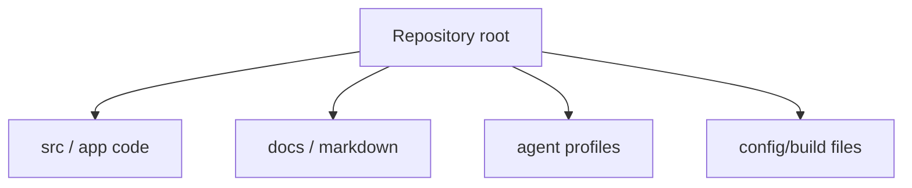

# Layout

## Source Tree

```
stock_1901/                          # Updated 2026-05-10 (formerly stock_rtx4060_unified)
├── README.md
├── CHANGELOG.md
├── CLAUDE.md                        # AI assistant guidance (P0-P8 invariants)
├── main.py                          # CLI entry point
├── api_server.py                    # Flask API :5151 (CORS: localhost 5173/4173/5151)
├── run.ps1
├── pyproject.toml                   # Project metadata + ruff config
├── requirements.txt                 # Core runtime dependencies
├── requirements-openbb.txt          # OpenBB optional dependencies
├── requirements-gpu-wsl.txt         # WSL2/CUDA GPU dependencies
├── requirements-dev.txt             # Development dependencies
├── config/
│   ├── data_providers.example.json
│   └── runtime_environment.json     # Runtime lock
├── flows/                           # P7 Prefect orchestration
│   ├── daily_krx.py                 # KRX daily flow (16:30 KST Mon-Fri)
│   ├── daily_us.py                  # US daily flow (16:30 ET Mon-Fri)
│   └── research_weekly.py           # Weekly HPO + MLflow promotion gate
├── src/stock_rtx4060/
│   ├── __init__.py
│   ├── main.py                      # CLI parser + command dispatcher
│   ├── recommendation_engine.py     # RecommendationEngine orchestrator
│   ├── feature_engine.py            # 60+ technical indicators
│   ├── ensemble_model.py            # LightGBM/XGBoost/LR ensemble, PurgedKFold
│   ├── backtester.py                # Dry-run trade simulation + Deflated Sharpe/PSR
│   ├── backtest_honesty.py          # Phase B evidence-only backtest honesty checks
│   ├── benchmark.py                 # Benchmark runner
│   ├── risk_rules.py                # Track-S / Track-L risk gate logic
│   ├── dashboard_bridge.py          # dashboard_snapshot.v1 builder
│   ├── data_providers.py            # yfinance/openbb/synthetic/PIT router
│   ├── data_cache.py                # SQLite OHLCV cache (USE_DATA_CACHE env)
│   ├── provider_validation.py       # point-in-time OHLCV provider checks
│   ├── hw_profile.py                # GPU detection (nvidia-smi)
│   ├── audit_log.py                 # Masked JSONL audit writer
│   ├── ops_workflow.py              # Ops v1 daily brief + manual approval
│   ├── mcp_adapter.py               # Phase 1 read/report-only MCP adapter
│   ├── reports.py                   # Shared Markdown/JSON/CSV helpers
│   ├── alert_engine.py              # Alert dispatch (Slack/Discord)
│   ├── observability/               # P0 — loguru JSONL, prometheus_client, MLflow
│   │   ├── __init__.py
│   │   ├── logging_config.py
│   │   └── metrics.py
│   ├── data_lake/                   # P1 — PIT bitemporal storage
│   │   ├── __init__.py
│   │   ├── pit_store.py             # PITStore ABC
│   │   ├── duckdb_backend.py        # DuckDB+Parquet backend
│   │   ├── corp_actions.py          # Corp-action adjuster
│   │   └── ingestors/               # KIS/Alpaca ingestors
│   ├── factors/                     # P2 — Factor zoo
│   │   ├── __init__.py
│   │   ├── alpha101.py              # Alpha101/158 port
│   │   ├── barra.py                 # Cross-sectional Barra factors
│   │   ├── factor_zoo.py            # Factor registry + IC/IR/decay analytics
│   │   └── rd_agent.py              # RD-Agent auto-mining runner
│   ├── ml/                          # P3 — ML upgrade
│   │   ├── __init__.py
│   │   ├── cv.py                    # PurgedKFold(n_splits, embargo_pct)
│   │   ├── hpo.py                   # Optuna HPO study
│   │   └── explain.py               # SHAP explanations
│   ├── portfolio/                   # P4 — Portfolio optimization
│   │   ├── __init__.py
│   │   └── optimizer.py             # skfolio HRP/NCO/CVaR, BL views
│   ├── backtest/                    # P5 — Advanced backtesting
│   │   ├── __init__.py
│   │   ├── vbt_sweep.py             # vectorbt parameter sweep
│   │   ├── mc_bootstrap.py          # Block-bootstrap Monte Carlo
│   │   └── stat_tests.py            # Deflated Sharpe, PSR, MinTRL
│   ├── advisors/                    # P6 — LLM advisory layer
│   │   ├── __init__.py
│   │   ├── news_sentiment.py        # NewsSentiment advisor
│   │   ├── devils_advocate.py       # DevilsAdvocate advisor
│   │   ├── macro_regime.py          # MacroRegime advisor
│   │   └── langgraph_dag.py         # LangGraph orchestrator
│   └── broker/                      # P8 — Live broker adapters
│       ├── __init__.py
│       ├── alpaca_adapter.py        # Alpaca adapter
│       ├── ibkr_adapter.py          # IBKR ib_insync adapter
│       ├── kis_adapter.py           # KIS OpenAPI adapter
│       ├── order_router.py          # SOR/TWAP/VWAP + kill-switch
│       └── reconciliation.py        # Position reconciliation
├── dashboard/
│   ├── stock_pred_v5.jsx            # Repo-owned dashboard source copy
│   ├── bridge_smoke.html
│   └── verify_bridge_smoke.mjs
├── tests/                           # 1,210 tests — 85.82% coverage (2026-05-10)
│   ├── test_core.py                 # Ops v1 workflow regression tests
│   ├── test_backtest_honesty.py     # Phase B backtest honesty tests
│   ├── test_data_providers.py       # Provider routing tests
│   ├── test_data_providers_extra.py # Extended data_providers coverage (99%)
│   ├── test_provider_validation.py  # Provider validation tests
│   ├── test_audit_log.py            # Audit masking tests
│   ├── test_mcp_adapter.py          # MCP boundary tests
│   ├── test_dashboard_bridge.py     # Dashboard bridge tests
│   ├── test_reports.py              # reports.py coverage (100%)
│   ├── test_risk_rules.py           # risk_rules.py coverage (100%)
│   ├── test_ensemble_model_extra.py # ensemble_model.py extended coverage (~85%)
│   ├── test_kevpe_adapter.py        # kevpe_adapter.py coverage (91%)
│   ├── test_main_extra.py           # main.py extended coverage (98%)
│   ├── test_observability.py        # P0 observability coverage
│   ├── test_data_lake.py            # P1 PITStore/DuckDB coverage
│   ├── test_factors.py              # P2 factor zoo coverage
│   ├── test_ml_cv.py                # P3 PurgedKFold coverage
│   ├── test_ml_hpo.py               # P3 Optuna HPO coverage
│   ├── test_ml_explain.py           # P3 SHAP coverage
│   ├── test_portfolio.py            # P4 optimizer coverage
│   ├── test_backtest_vbt.py         # P5 vectorbt sweep coverage
│   ├── test_advisors.py             # P6 LLM advisor coverage
│   ├── test_alert_engine.py         # alert_engine.py coverage (97%)
│   └── test_broker.py               # P8 broker adapter coverage
├── docs/
│   ├── LAYOUT.md                # This file — source tree + conventions
│   ├── SYSTEM_ARCHITECTURE.md   # Architecture overview
│   ├── SPEC.md                 # Algorithm specification
│   ├── SETUP.md                # Setup guide
│   ├── AGENTS.md               # Agent-facing project guidance
│   ├── UIUX.md                 # UI/UX design notes
│   ├── REPORTS_POLICY.md       # Report output policy
│   ├── CONTRIB.md              # Development workflow, scripts, environment setup, testing procedures
│   ├── RUNBOOK.md              # Deployment procedures, monitoring, common issues, rollback
│   ├── PHASE1_GAP_ANALYSIS_2026-05-07.md  # Phase 1 gap analysis and next-phase planning
│   └── plan*.md / SPEC*.md     # Feature plans and specs
├── .continue/checks/           # Flat Continue PR-quality check files
│   ├── 01-financial-safety-boundary.md
│   ├── 02-backtest-integrity.md
│   ├── 03-recommendation-contract.md
│   ├── 04-secret-and-pii-safety.md
│   ├── 05-gpu-claim-validation.md
│   ├── 06-report-contract.md
│   ├── 07-architecture-boundary.md
│   └── 08-test-and-verification.md
├── examples/
├── reports/                     # Runtime output + validation logs
├── review_needed/              # Quarantined source evidence (not active docs)
├── archive/original_inputs/    # Archive of original inputs
├── workspaces/
└── tools/
```

## Active Package Modules

`src/stock_rtx4060/` — all active Python source.

| File | Purpose |
|---|---|
| `main.py` | CLI argument parser and command dispatcher (`recommend`, `benchmark`, `ops-v1`, `env`, `dashboard-export`). |
| `recommendation_engine.py` | `RecommendationEngine` — candidate scoring, OHLCV caching, report generation. |
| `feature_engine.py` | 60+ technical indicators: SMA, EMA, RSI, MACD, ATR, Bollinger, volume delta, etc. |
| `ensemble_model.py` | XGBoost + LogisticRegression ensemble with OOF CV, `TimeSeriesSplit(gap=horizon)`. |
| `backtester.py` | Dry-run trade simulation: entry/exit logic, P&L, Sharpe, MDD. |
| `backtest_honesty.py` | Phase B evidence-only checks for OOF coverage, Sharpe floor, max drawdown, cost buffer, and walk-forward gap. |
| `benchmark.py` | Benchmark smoke runner. |
| `risk_rules.py` | Track-S / Track-L risk gate rules: stop, take-profit, risk budget, position cap. |
| `dashboard_bridge.py` | Converts recommendation JSON into `dashboard_snapshot.v1` for frontend file import. |
| `data_providers.py` | OHLCV provider router: `auto`, `synthetic`, `yfinance`, optional `openbb`. |
| `provider_validation.py` | Point-in-time OHLCV checks for row count, date range, duplicate/future rows, required columns, nulls, and freshness evidence. |
| `hw_profile.py` | GPU detection via `nvidia-smi`; device selection and VRAM logging. |
| `audit_log.py` | Masked JSONL audit event writer; provider attempt events. |
| `ops_workflow.py` | Ops v1 daily brief, manual approval template, ZERO log, summary generation. |
| `mcp_adapter.py` | Phase 1 read/report-only MCP adapter contract. Does not start an MCP server. |
| `reports.py` | Shared Markdown, JSON, CSV report helpers. |

## File Naming Conventions

- Python modules: `snake_case` (`recommendation_engine.py`, `feature_engine.py`, `risk_rules.py`)
- Entry point: `main.py` (root-level CLI dispatcher)
- Benchmark: `benchmark.py`
- API / preview: `api_server.py`, `preview_server.py` (root-level if present)
- Recommendation configs: `RecommendationConfig` dataclass defined in `recommendation_engine.py`

## Configuration Files

| File | Controls | Format |
|---|---|---|
| `requirements.txt` | Core runtime dependencies | pip |
| `requirements-openbb.txt` | OpenBB optional provider | pip |
| `requirements-gpu-wsl.txt` | WSL2/CUDA GPU deps | pip |
| `requirements-dev.txt` | Development deps | pip |
| `pyproject.toml` | Project metadata + ruff config | TOML |
| `config/data_providers.example.json` | Non-secret provider config example | JSON |
| `.env` (optional, not committed) | API keys, debug flags | key=val |

## Key Entry Points

| Entry | Command | Purpose |
|---|---|---|
| `main.py` | `python main.py --recommend --universe AAPL --track S` | Run recommendation scan |
| `main.py` | `python main.py --benchmark --synthetic --benchmark-rows 1200` | Benchmark smoke test |
| `main.py` | `python main.py --recommend --synthetic --universe SYNTH-A --track BOTH --top 5 --output-dir reports` | Offline smoke |
| `main.py` | `python main.py --recommend --universe AAPL,MSFT,NVDA --track BOTH --period 3y --top 5` | Live yfinance scan |
| `main.py` | `python main.py --ticker AAPL --period 5y --horizon 5` | Single-ticker pipeline |
| `main.py` | `python main.py --ops-v1` | Ops v1 manual approval workflow |
| `main.py` | `python main.py --dashboard-export --output-dir reports` | Dashboard snapshot export |
| `main.py` | `python main.py --env` | Runtime environment status |
| `preview_server.py` | `python preview_server.py` | Flask + Vite unified launcher |
| `api_server.py` | `python api_server.py --port 5151` | Flask API server |

## Generated Output

| Pattern | Source command |
|---|---|
| `reports/recommendations*/` | `recommend` smoke / live runs |
| `reports/ops_v1*/` | `ops-v1` manual approval workflow runs |
| `reports/runtime_status.json` | `env` command |
| `reports/**/audit_log.jsonl` | Provider attempt audit events from `recommend` and `ops-v1` |
| `reports/**/dashboard_snapshot.json` | Dashboard bridge snapshot from `dashboard-export`, including additive `provider_summary` and `backtest_honesty_summary` when present |

## Continue Checks

Flat checks under `.continue/checks/`. Do not create nested folders. Current set:

- `01-financial-safety-boundary.md`
- `02-backtest-integrity.md`
- `03-recommendation-contract.md`
- `04-secret-and-pii-safety.md`
- `05-gpu-claim-validation.md`
- `06-report-contract.md`
- `07-architecture-boundary.md`
- `08-test-and-verification.md`

## External Dashboard File

`C:\Users\jichu\Downloads\주식\stock_pred_v5.jsx` is the live dashboard. It imports `dashboard_snapshot.v1` files via a `BACKEND` button and shows backend evidence in a dedicated tab.

The repo-owned copy is at `dashboard/stock_pred_v5.jsx` so dashboard source changes are tracked by repo `git status`.

## Reports Policy

See `docs/REPORTS_POLICY.md` for distinguishing review evidence from generated runtime output. Existing report files must not be deleted without explicit approval.


## Codex Documentation Update — 2026-05-28T20:44:00.663596+00:00

**Update policy:** existing content above this section is preserved. This section was appended after scanning code, documentation, config, and agent profile files.

**Purpose:** This section maps the detected repository layout and documentation surface.

### Evidence inventory

**Source/code files sampled:**
- `api_server.py`
- `dashboard\stock_pred_v5.jsx`
- `flows\__init__.py`
- `flows\daily_krx.py`
- `flows\daily_us.py`
- `flows\research_weekly.py`
- `flows\utils.py`
- `main.py`
- `preview_server.py`
- `reports\dashboard_browser_verification\snapshot_fixture.js`
- `root_folder_snapshot\KEVPE_final_package\demo_kevpe_v2.py`
- `root_folder_snapshot\KEVPE_final_package\kevpe.py`

**Documentation files sampled:**
- `.codex\goals\dashboard-report-bridge.goal.md`
- `.codex\goals\mcp-openbb-audit-phase1.goal.md`
- `.continue\checks\01-financial-safety-boundary.md`
- `.continue\checks\02-backtest-integrity.md`
- `.continue\checks\03-recommendation-contract.md`
- `.continue\checks\04-secret-and-pii-safety.md`
- `.continue\checks\05-gpu-claim-validation.md`
- `.continue\checks\06-report-contract.md`
- `.continue\checks\07-architecture-boundary.md`
- `.continue\checks\08-test-and-verification.md`
- `20260507_plan-doc.md`
- `20260510_project-upgrade-report.md`

**Config/build files sampled:**
- `.claude\launch.json`
- `.codex\root-docs-dry-run.json`
- `.codex\root-docs-scan.json`
- `.github\workflows\ci.yml`
- `.pre-commit-config.yaml`
- `config\data_providers.example.json`
- `config\runtime_environment.json`
- `config\sector_map.json`
- `coverage.json`
- `docker-compose.dev.yml`
- `docs\AGENTS.md`
- `examples\kevpe_events_smoke.json`

**Agent profile files sampled:**
- No agent profile detected; this update records the absence explicitly.

### Mermaid graph



### Verification notes

- Append-only update generated by `root-docs-batch-update`.
- Code/config/doc/agent inventory counts: code=2337, docs=1091, config=698, agent_profiles=0.
- Follow-up verification should confirm that newly added text matches actual implementation paths listed above.


## Hermes Documentation Update — 2026-05-28T23:02:20.364421+00:00

**Update policy:** existing content above this section is preserved. This section was appended after scanning code, documentation, config, and agent profile files.

**Purpose:** This section maps the detected repository layout and documentation surface.

### Evidence inventory

**Source/code files sampled:**
- `api_server.py`
- `dashboard\stock_pred_v5.jsx`
- `flows\__init__.py`
- `flows\daily_krx.py`
- `flows\daily_us.py`
- `flows\research_weekly.py`
- `flows\utils.py`
- `main.py`
- `preview_server.py`
- `reports\dashboard_browser_verification\snapshot_fixture.js`
- `root_folder_snapshot\KEVPE_final_package\demo_kevpe_v2.py`
- `root_folder_snapshot\KEVPE_final_package\kevpe.py`

**Documentation files sampled:**
- `.codex\goals\dashboard-report-bridge.goal.md`
- `.codex\goals\mcp-openbb-audit-phase1.goal.md`
- `.codex\root-docs-strict\docs\001-README.md`
- `.codex\root-docs-strict\docs\002-SYSTEM_ARCHITECTURE.md`
- `.codex\root-docs-strict\docs\003-LAYOUT.md`
- `.codex\root-docs-strict\docs\004-CHANGELOG.md`
- `.codex\root-docs-strict\docs\005-plan.md`
- `.codex\root-docs-strict\docs\006-codex-default-doc-agent.md`
- `.continue\checks\01-financial-safety-boundary.md`
- `.continue\checks\02-backtest-integrity.md`
- `.continue\checks\03-recommendation-contract.md`
- `.continue\checks\04-secret-and-pii-safety.md`

**Config/build files sampled:**
- `.claude\launch.json`
- `.codex\root-docs-dry-run.json`
- `.codex\root-docs-scan.json`
- `.codex\root-docs-verify.json`
- `.codex\root-docs-write.json`
- `.github\workflows\ci.yml`
- `.hermes\root-docs-dry-run.json`
- `.hermes\root-docs-scan.json`
- `.pre-commit-config.yaml`
- `config\data_providers.example.json`
- `config\runtime_environment.json`
- `config\sector_map.json`

**Agent profile files sampled:**
- `docs\agents\codex-default-doc-agent.md` (`codex-default-doc-agent`)

### Mermaid graph


### Verification notes

- Append-only update generated by `root-docs-batch-update`.
- Code/config/doc/agent inventory counts: code=2342, docs=1142, config=739, agent_profiles=1.
- Follow-up verification should confirm that newly added text matches actual implementation paths listed above.


## Codex Documentation Update — 2026-05-29T00:10:42.371181+00:00

**Update policy:** existing content above this section is preserved. This section was appended after scanning code, documentation, config, and agent profile files.

**Purpose:** This section maps the detected repository layout and documentation surface.

### Evidence inventory

**Source/code files sampled:**
- `api_server.py`
- `dashboard\stock_pred_v5.jsx`
- `flows\__init__.py`
- `flows\daily_krx.py`
- `flows\daily_us.py`
- `flows\research_weekly.py`
- `flows\utils.py`
- `main.py`
- `preview_server.py`
- `reports\dashboard_browser_verification\snapshot_fixture.js`
- `root_folder_snapshot\KEVPE_final_package\demo_kevpe_v2.py`
- `root_folder_snapshot\KEVPE_final_package\kevpe.py`

**Documentation files sampled:**
- `.codex\goals\dashboard-report-bridge.goal.md`
- `.codex\goals\mcp-openbb-audit-phase1.goal.md`
- `.codex\root-docs-strict\docs\001-README.md`
- `.codex\root-docs-strict\docs\002-SYSTEM_ARCHITECTURE.md`
- `.codex\root-docs-strict\docs\003-LAYOUT.md`
- `.codex\root-docs-strict\docs\004-CHANGELOG.md`
- `.codex\root-docs-strict\docs\005-plan.md`
- `.codex\root-docs-strict\docs\006-codex-default-doc-agent.md`
- `.continue\checks\01-financial-safety-boundary.md`
- `.continue\checks\02-backtest-integrity.md`
- `.continue\checks\03-recommendation-contract.md`
- `.continue\checks\04-secret-and-pii-safety.md`

**Config/build files sampled:**
- `.claude\launch.json`
- `.codex\root-docs-dry-run.json`
- `.codex\root-docs-scan.json`
- `.codex\root-docs-verify.json`
- `.codex\root-docs-write.json`
- `.github\workflows\ci.yml`
- `.hermes\root-docs-dry-run.json`
- `.hermes\root-docs-scan.json`
- `.hermes\root-docs-write.json`
- `.pre-commit-config.yaml`
- `config\data_providers.example.json`
- `config\runtime_environment.json`

**Agent profile files sampled:**
- `docs\agents\codex-default-doc-agent.md` (`codex-default-doc-agent`)

### Mermaid graph


### Verification notes

- Append-only update generated by `root-docs-batch-update`.
- Code/config/doc/agent inventory counts: code=2342, docs=1168, config=766, agent_profiles=1.
- Follow-up verification should confirm that newly added text matches actual implementation paths listed above.


## Codex Documentation Update — 2026-05-29T00:39:13.408134+00:00

**Update policy:** existing content above this section is preserved. This section was appended after scanning code, documentation, config, and agent profile files.

**Purpose:** This section maps the detected repository layout and documentation surface.

### Evidence inventory

**Source/code files sampled:**
- `api_server.py`
- `dashboard\stock_pred_v5.jsx`
- `flows\__init__.py`
- `flows\daily_krx.py`
- `flows\daily_us.py`
- `flows\research_weekly.py`
- `flows\utils.py`
- `main.py`
- `preview_server.py`
- `reports\dashboard_browser_verification\snapshot_fixture.js`
- `root_folder_snapshot\KEVPE_final_package\demo_kevpe_v2.py`
- `root_folder_snapshot\KEVPE_final_package\kevpe.py`

**Documentation files sampled:**
- `.codex\goals\dashboard-report-bridge.goal.md`
- `.codex\goals\mcp-openbb-audit-phase1.goal.md`
- `.codex\root-docs-strict\docs\001-README.md`
- `.codex\root-docs-strict\docs\002-SYSTEM_ARCHITECTURE.md`
- `.codex\root-docs-strict\docs\003-LAYOUT.md`
- `.codex\root-docs-strict\docs\004-CHANGELOG.md`
- `.codex\root-docs-strict\docs\005-plan.md`
- `.codex\root-docs-strict\docs\006-codex-default-doc-agent.md`
- `.continue\checks\01-financial-safety-boundary.md`
- `.continue\checks\02-backtest-integrity.md`
- `.continue\checks\03-recommendation-contract.md`
- `.continue\checks\04-secret-and-pii-safety.md`

**Config/build files sampled:**
- `.codex\root-docs-dry-run.json`
- `.codex\root-docs-scan.json`
- `.github\workflows\ci.yml`
- `.pre-commit-config.yaml`
- `config\data_providers.example.json`
- `config\runtime_environment.json`
- `config\sector_map.json`
- `docker-compose.dev.yml`
- `docs\AGENTS.md`
- `examples\kevpe_events_smoke.json`
- `observability\grafana\dashboards\data_lake.json`
- `observability\grafana\dashboards\recommendations.json`

**Agent profile files sampled:**
- `docs\agents\codex-default-doc-agent.md` (`codex-default-doc-agent`)

### Mermaid graph


### Verification notes

- Append-only update generated by `root-docs-batch-update`.
- Code/config/doc/agent inventory counts: code=2344, docs=990, config=585, agent_profiles=1.
- Follow-up verification should confirm that newly added text matches actual implementation paths listed above.


## Codex Documentation Update — 2026-05-29T04:07:15.920451+00:00

**Update policy:** existing content above this section is preserved. This section was appended after scanning code, documentation, config, and agent profile files.

**Purpose:** This section maps the detected repository layout and documentation surface.

### Evidence inventory

**Source/code files sampled:**
- `api_server.py`
- `dashboard\stock_pred_v5.jsx`
- `docs\purged_kfold_embargo.py`
- `docs\test_purged_kfold_embargo.py`
- `flows\__init__.py`
- `flows\daily_krx.py`
- `flows\daily_us.py`
- `flows\research_weekly.py`
- `flows\utils.py`
- `main.py`
- `preview_server.py`
- `reports\dashboard_browser_verification\snapshot_fixture.js`

**Documentation files sampled:**
- `.codex\goals\dashboard-report-bridge.goal.md`
- `.codex\goals\mcp-openbb-audit-phase1.goal.md`
- `.codex\root-docs-strict\docs\001-README.md`
- `.codex\root-docs-strict\docs\002-SYSTEM_ARCHITECTURE.md`
- `.codex\root-docs-strict\docs\003-LAYOUT.md`
- `.codex\root-docs-strict\docs\004-CHANGELOG.md`
- `.codex\root-docs-strict\docs\005-plan.md`
- `.codex\root-docs-strict\docs\006-codex-default-doc-agent.md`
- `.continue\checks\01-financial-safety-boundary.md`
- `.continue\checks\02-backtest-integrity.md`
- `.continue\checks\03-recommendation-contract.md`
- `.continue\checks\04-secret-and-pii-safety.md`

**Config/build files sampled:**
- `.codex\root-docs-dry-run.json`
- `.codex\root-docs-scan.json`
- `.codex\root-docs-verify.json`
- `.codex\root-docs-write.json`
- `.github\workflows\ci.yml`
- `.pre-commit-config.yaml`
- `config\data_providers.example.json`
- `config\runtime_environment.json`
- `config\sector_map.json`
- `docker-compose.dev.yml`
- `docs\AGENTS.md`
- `examples\kevpe_events_smoke.json`

**Agent profile files sampled:**
- `docs\agents\codex-default-doc-agent.md` (`codex-default-doc-agent`)

### Mermaid graph


### Verification notes

- Append-only update generated by `root-docs-batch-update`.
- Code/config/doc/agent inventory counts: code=2347, docs=992, config=589, agent_profiles=1.
- Follow-up verification should confirm that newly added text matches actual implementation paths listed above.


## Codex Documentation Update — 2026-05-29T05:51:01.365772+00:00

**Update policy:** existing content above this section is preserved. This section was appended after scanning code, documentation, config, and agent profile files.

**Purpose:** This section maps the detected repository layout and documentation surface.

### Evidence inventory

**Source/code files sampled:**
- `api_server.py`
- `dashboard\stock_pred_v5.jsx`
- `docs\purged_kfold_embargo.py`
- `docs\test_purged_kfold_embargo.py`
- `flows\__init__.py`
- `flows\daily_krx.py`
- `flows\daily_us.py`
- `flows\research_weekly.py`
- `flows\utils.py`
- `main.py`
- `preview_server.py`
- `reports\dashboard_browser_verification\snapshot_fixture.js`

**Documentation files sampled:**
- `.codex\goals\dashboard-report-bridge.goal.md`
- `.codex\goals\mcp-openbb-audit-phase1.goal.md`
- `.codex\root-docs-strict\docs\001-README.md`
- `.codex\root-docs-strict\docs\002-SYSTEM_ARCHITECTURE.md`
- `.codex\root-docs-strict\docs\003-LAYOUT.md`
- `.codex\root-docs-strict\docs\004-CHANGELOG.md`
- `.codex\root-docs-strict\docs\005-plan.md`
- `.codex\root-docs-strict\docs\006-codex-default-doc-agent.md`
- `.continue\checks\01-financial-safety-boundary.md`
- `.continue\checks\02-backtest-integrity.md`
- `.continue\checks\03-recommendation-contract.md`
- `.continue\checks\04-secret-and-pii-safety.md`

**Config/build files sampled:**
- `.codex\root-docs-dry-run.json`
- `.codex\root-docs-scan.json`
- `.codex\root-docs-verify.json`
- `.codex\root-docs-write.json`
- `.github\workflows\ci.yml`
- `.hermes\root-docs-dry-run.json`
- `.hermes\root-docs-scan.json`
- `.hermes\root-docs-write.json`
- `.pre-commit-config.yaml`
- `config\data_providers.example.json`
- `config\runtime_environment.json`
- `config\sector_map.json`

**Agent profile files sampled:**
- `docs\agents\codex-default-doc-agent.md` (`codex-default-doc-agent`)

### Mermaid graph


### Verification notes

- Append-only update generated by `root-docs-batch-update`.
- Code/config/doc/agent inventory counts: code=2355, docs=1033, config=627, agent_profiles=1.
- Follow-up verification should confirm that newly added text matches actual implementation paths listed above.
