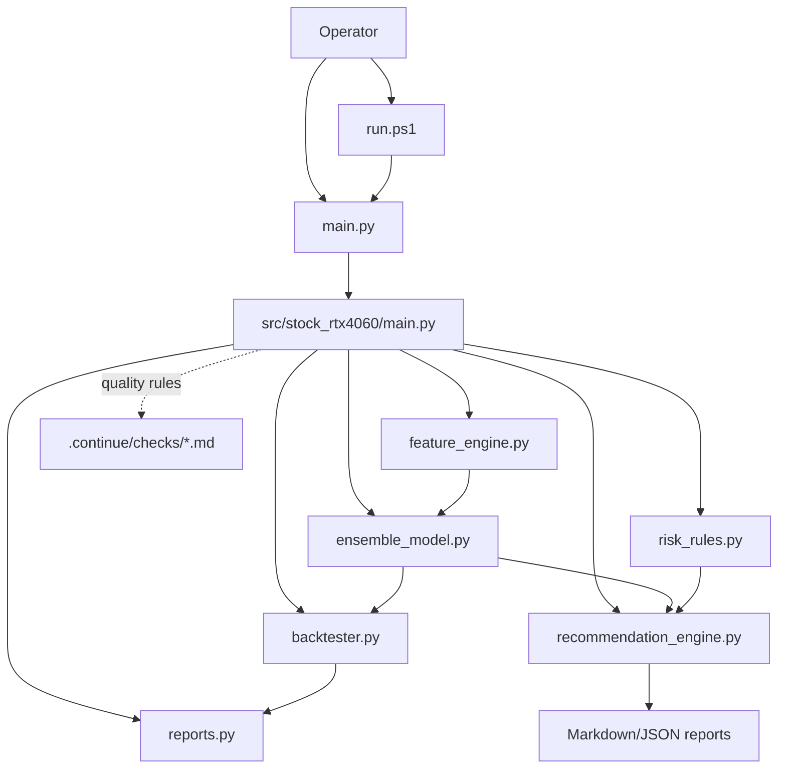
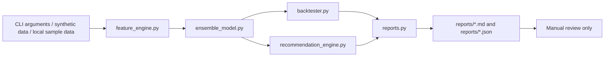

# SYSTEM_ARCHITECTURE

## Overview

The unified folder is a local Python CLI package. The active code lives under `src/stock_rtx4060`.

The architecture is intentionally report-only. It produces Markdown/JSON screening reports and dry-run validation evidence. It does not expose a web server, broker order router, or live trading dashboard.

## Data Flow

## Core Components

| Component | Path | Purpose |
|---|---|---|
| Root wrapper | `main.py` | Adds `src/` to `sys.path` and dispatches to the package CLI. |
| Windows runner | `run.ps1` | Selects a working Python runtime and runs CLI commands. |
| CLI | `src/stock_rtx4060/main.py` | Handles `self-test`, `recommend`, and compatibility command forms. |
| Features | `src/stock_rtx4060/feature_engine.py` | Builds feature inputs for model/backtest paths. |
| Model | `src/stock_rtx4060/ensemble_model.py` | Provides the model path used by recommendation and validation. |
| Backtest | `src/stock_rtx4060/backtester.py` | Runs dry-run portfolio/backtest calculations. |
| Recommendation | `src/stock_rtx4060/recommendation_engine.py` | Produces screening verdicts and recommendation evidence. |
| Risk rules | `src/stock_rtx4060/risk_rules.py` | Applies risk-plan checks. |
| Reports | `src/stock_rtx4060/reports.py` | Writes Markdown and JSON output. |
| Tests | `tests/test_core.py` | Verifies core CLI/package behavior. |
| Continue checks | `.continue/checks/*.md` | Advisory PR-quality gates for financial safety, model integrity, reports, architecture, secrets, GPU claims, and verification evidence. |

## Boundary

The system is report-only. It has no broker API and no web server.

Continue does not change runtime behavior. It is a review-time quality gate for changes to this local CLI package.

## Validation State

| Check | Current Result |
|---|---|
| `.\run.ps1 self-test` | PASS in the current Codex session |
| `python -m compileall .` | PASS |
| `python main.py --help` | PASS |
| Default `python main.py self-test` | AMBER because Python 3.14 lacks pandas |
| Python 3.12 pytest | PASS, 5 tests passed |
