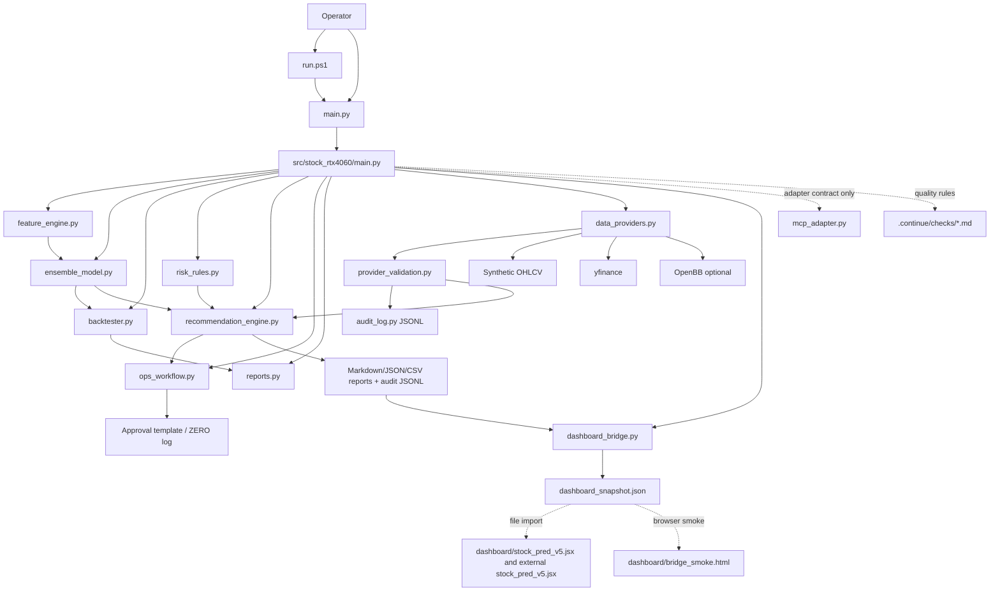
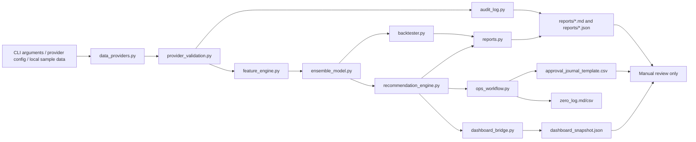
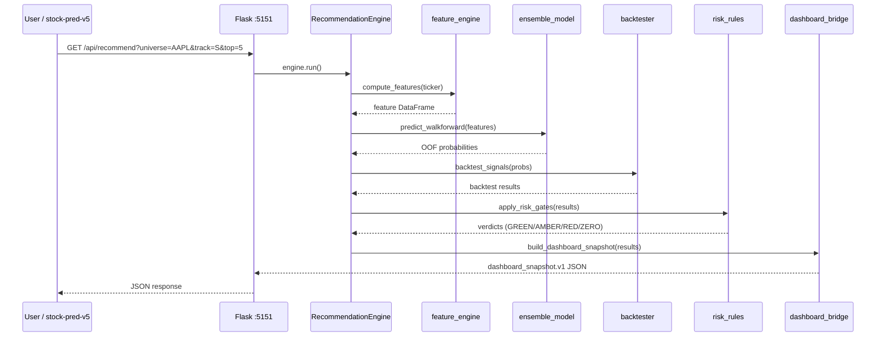
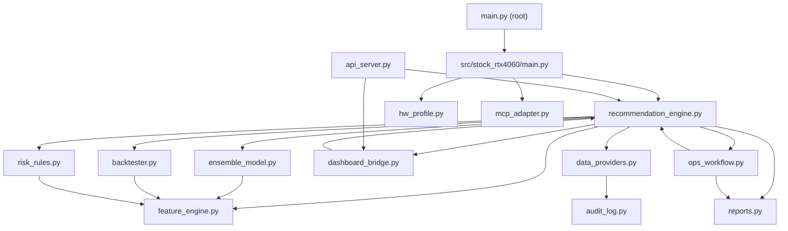

# SYSTEM_ARCHITECTURE

## Overview

The unified folder is a local Python CLI package. The active code lives under `src/stock_rtx4060`.

The architecture is intentionally report-only. It produces Markdown/JSON screening reports and dry-run validation evidence. It does not expose a web server, broker order router, or live trading dashboard.



## Data Flow



## Core Components

| Component | Path | Purpose |
|---|---|---|
| Root wrapper | `main.py` | Adds `src/` to `sys.path` and dispatches to the package CLI. |
| Windows runner | `run.ps1` | Selects a working Python runtime and runs CLI commands. |
| CLI | `src/stock_rtx4060/main.py` | Handles `self-test`, `recommend`, `ops-v1`, and compatibility command forms. |
| Features | `src/stock_rtx4060/feature_engine.py` | Builds feature inputs for model/backtest paths. |
| Model | `src/stock_rtx4060/ensemble_model.py` | Provides the model path used by recommendation and validation. |
| Backtest | `src/stock_rtx4060/backtester.py` | Runs dry-run portfolio/backtest calculations. |
| Recommendation | `src/stock_rtx4060/recommendation_engine.py` | Produces screening verdicts and recommendation evidence. |
| Dashboard bridge | `src/stock_rtx4060/dashboard_bridge.py` | Converts recommendation JSON into `dashboard_snapshot.v1` for dashboard file import. |
| Ops workflow | `src/stock_rtx4060/ops_workflow.py` | Produces the Ops v1 daily brief, manual approval template, ZERO log, and workflow summary. |
| Risk rules | `src/stock_rtx4060/risk_rules.py` | Applies risk-plan checks. |
| Reports | `src/stock_rtx4060/reports.py` | Writes Markdown and JSON output. |
| Provider router | `src/stock_rtx4060/data_providers.py` | Selects `synthetic`, `yfinance`, `openbb`, or `auto` OHLCV provider. |
| Provider validation | `src/stock_rtx4060/provider_validation.py` | Checks OHLCV row count, date range, future rows, duplicate dates, required columns, nulls, and freshness evidence. |
| Audit log | `src/stock_rtx4060/audit_log.py` | Writes masked append-only JSONL provider/workflow events. |
| MCP adapter contract | `src/stock_rtx4060/mcp_adapter.py` | Defines read/report-only Phase 1 MCP workflow contract. It does not start a server. |
| Tests | `tests/test_core.py`, `tests/test_audit_log.py`, `tests/test_data_providers.py`, `tests/test_mcp_adapter.py`, `tests/test_dashboard_bridge.py` | Verify core CLI/package behavior, provider routing, audit masking, MCP boundary, and dashboard snapshot conversion. |
| Continue checks | `.continue/checks/*.md` | Advisory PR-quality gates for financial safety, model integrity, reports, architecture, secrets, GPU claims, and verification evidence. |

## Boundary

The system is report-only. It has no broker API and no mandatory web server.

`ops-v1` is an orchestration command, not a trading command. It creates files for human review and journal follow-up only.

Continue does not change runtime behavior. It is a review-time quality gate for changes to this local CLI package.

Phase 1 MCP work is an adapter contract only. `src/stock_rtx4060/mcp_adapter.py` allows future read/report mapping for `recommend` and `ops-v1`; it does not bind a port, start a server, or expose broker/account/order capabilities.

The dashboard bridge is file-based. `dashboard-export` reads an existing `recommendations_algo_v2_*.json` file and writes `dashboard_snapshot.json`. `dashboard/stock_pred_v5.jsx` and the external `stock_pred_v5.jsx` import that file from the browser through the `BACKEND` button. Browser-side simulated scores stay separate from backend report snapshots.

Browser verification uses `dashboard/bridge_smoke.html` plus `node dashboard\verify_bridge_smoke.mjs`. The harness renders `dashboard_snapshot.v1` in Chrome through Playwright CLI and writes evidence under `reports/dashboard_browser_verification/`.

## Provider And Audit Flow

| Step | Component | Output |
|---:|---|---|
| 1 | `src/stock_rtx4060/main.py` | Parses `--data-provider` and optional `--provider-config`. |
| 2 | `src/stock_rtx4060/data_providers.py` | Loads OHLCV from synthetic, yfinance, or optional OpenBB. |
| 3 | `src/stock_rtx4060/provider_validation.py` | Adds point-in-time OHLCV validation metadata. |
| 4 | `src/stock_rtx4060/audit_log.py` | Appends masked JSONL provider attempt events with validation evidence. |
| 5 | `src/stock_rtx4060/recommendation_engine.py` | Builds recommendation Markdown/JSON and records `audit_log_path` plus `provider_summary`. |
| 6 | `src/stock_rtx4060/ops_workflow.py` | Includes `audit_log` in Ops v1 returned paths and summary JSON. |

`RecommendationEngine` caches OHLCV data by ticker, period, synthetic flag, data provider, and provider config within one CLI run. This keeps Track-S and Track-L from making duplicate provider calls for the same ticker.

Phase A provider validation is evidence-only. A provider validation PASS does not approve a trade and does not bypass the existing risk gates.

## Validation State

| Check | Current Result |
|---|---|
| `.\run.ps1 self-test` | PASS in the current Codex session |
| `python -m compileall .` | PASS |
| `python main.py --help` | AMBER with global Python if dependencies are missing; PASS with `.venv\Scripts\python.exe main.py --help` |
| Global `python main.py self-test` | AMBER unless the global interpreter is explicitly prepared |
| Project `.venv` pytest | PASS, 26 tests passed after Phase A provider validation coverage |
| Ops v1 clean smoke | PASS, `AMZN,AAPL` generated review artifacts with `error_count=0` |
| Phase 1 recommendation smoke | PASS, generated Markdown, JSON, and `audit_log.jsonl` under `reports/recommendations_phase1_smoke` |
| Phase 1 Ops v1 smoke | PASS, generated Ops v1 artifacts and `audit_log.jsonl` under `reports/ops_v1_phase1_smoke` |
| OpenBB cache smoke | PASS, `reports/recommendations_openbb_cache_smoke/audit_log.jsonl` contains 1 AAPL provider event |
| Dashboard bridge smoke | PASS, `reports/dashboard_bridge_smoke/dashboard_snapshot.json` contains `dashboard_snapshot.v1`, `report_only`, 2 results, and `screening_output_only=True` |
| Dashboard browser verification | PASS, `reports/dashboard_browser_verification/dashboard_browser_verification.md` and `backend_snapshot_smoke.png` generated |
| Phase A provider validation smoke | PASS, `reports/phase_a_provider_v2_smoke/dashboard_snapshot.json` contains `provider_summary.status=PASS` and `screening_output_only=True` |

---

# System Architecture

## Purpose
Report-only stock-candidate screening engine. Walk-forward ensemble ML, 9 risk gates, two-track output (Track-S short-term / Track-L long-term). Outputs dashboard_snapshot.v1 JSON for stock-pred-v5 REC tab.

## Runtime Components

| Component | File | Role |
|-----------|------|------|
| CLI Entry | `main.py` (root) | Prepends `src/` to `sys.path`, dispatches to package CLI |
| Package CLI | `src/stock_rtx4060/main.py` | Subcommands: `self-test`, `recommend`, `ops-v1`, `benchmark`, `dashboard-export`, `demo`, `journal` |
| Orchestrator | `src/stock_rtx4060/recommendation_engine.py` | RecommendationEngine, RecommendationConfig, run() |
| Feature Engine | `src/stock_rtx4060/feature_engine.py` | TechnicalIndicators, 60+ indicators, feature_lag=1 shift |
| Ensemble Model | `src/stock_rtx4060/ensemble_model.py` | XGBoost + LogisticRegression fallback, TimeSeriesSplit(gap=horizon) |
| Backtester | `src/stock_rtx4060/backtester.py` | Dry-run trade simulation |
| Risk Rules | `src/stock_rtx4060/risk_rules.py` | GREEN/AMBER/RED/ZERO gate logic, position sizing |
| Dashboard Bridge | `src/stock_rtx4060/dashboard_bridge.py` | Converts recommendation JSON to dashboard_snapshot.v1 |
| API Server | `api_server.py` (root) | Flask server (port 5151) for stock-pred-v5 integration |
| Reports Writer | `src/stock_rtx4060/reports.py` | Markdown + JSON output writers |
| Data Providers | `src/stock_rtx4060/data_providers.py` | Provider router: synthetic / yfinance / openbb / auto |
| Audit Log | `src/stock_rtx4060/audit_log.py` | JSONL append-only event log with secret masking |
| Ops Workflow | `src/stock_rtx4060/ops_workflow.py` | Daily brief + manual approval template + ZERO log |
| HW Profile | `src/stock_rtx4060/hw_profile.py` | nvidia-smi probe, TensorFlow GPU check, RuntimeStatus |
| MCP Adapter | `src/stock_rtx4060/mcp_adapter.py` | Phase 1 read/report-only adapter contract (no server, no broker) |

## Component Topology

```mermaid
flowchart TD
    subgraph Input["CLI / API Input"]
        U[Universe Tickers] --> RE
        P[Period / Horizon] --> RE
        M[Model Kind / Provider] --> RE
    end
    subgraph Pipeline["Core Pipeline"]
        RE[recommendation_engine.py] --> FE[feature_engine.py]
        FE --> EM[ensemble_model.py]
        EM --> BT[backtester.py]
        BT --> RR[risk_rules.py]
        RR --> DB[dashboard_bridge.py]
    end
    subgraph Output["Output"]
        DB --> SNAP[dashboard_snapshot.json]
        RR --> RPT[Markdown / JSON Report]
        RR --> OPS[ops_workflow.py]
    end
    subgraph API["Flask API"]
        API[/api/recommend] --> RE
        API --> DB
        API --> SNAP[dashboard_snapshot.json]
    end
```

The Flask API (`api_server.py` at root, port 5151) reads recommendation results from both `recommendation_engine.py` and `dashboard_bridge.py` to serve the `/api/recommend` endpoint consumed by the stock-pred-v5 REC tab.

## Request Sequence (recommend flow)



## Module Dependency Map



## Technology Stack

| Layer | Technology | Version | Notes |
|-------|------------|---------|-------|
| Runtime | Python | 3.11+ | CLI entry point |
| ML | XGBoost | >=3.1 | CPU/GPU, gap-aware CV, version-aware device params |
| ML | scikit-learn | >=1.1 | LogisticRegression fallback with scaling + imputation |
| Data | pandas | >=2.2 | DataFrame operations |
| Data | numpy | >=1.26 | Array operations |
| Data | yfinance | >=0.2.66 | Default OHLCV price data |
| API | Flask | >=3.0 | REST endpoints (port 5151) |
| API | flask-cors | >=4.0 | CORS for localhost:5173 |
| Charts | tabulate | >=0.9 | Markdown table output |
| Optional | OpenBB | latest | `obb.equity.price.historical` when installed |

## Cross-Project Interface

- **stock-pred-v5 REC tab** fetches `dashboard_snapshot.json` (FILE mode) or `/api/recommend` (API mode)
- Vite proxy maps `/api` → `http://127.0.0.1:5151` so no CORS issues on browser side
- `dashboard_snapshot.v1` schema:
  ```json
  {
    "version": "dashboard_snapshot.v1",
    "generated_at_utc": "YYYY-MM-DDTHH:MM:SSZ",
    "source": "stock_rtx4060_unified",
    "screening_output_only": true,
    "results": [
      {
        "ticker": "AAPL",
        "track": "S",
        "verdict": "GREEN",
        "score": 82.50,
        "entry": 185.00,
        "stop": 177.60,
        "tp2": 203.50,
        "risk_reward": 2.91,
        "validations": { ... }
      }
    ]
  }
  ```
- Walk-forward ensemble: TimeSeriesSplit(gap=horizon) ensures no label leakage
- Feature lag: `feature_lag=1` shifts features so model never sees the bar it predicts from
- Kelly sizing (fraction=0.25) and suggested quantity are analysis fields only; never connected to an order router
