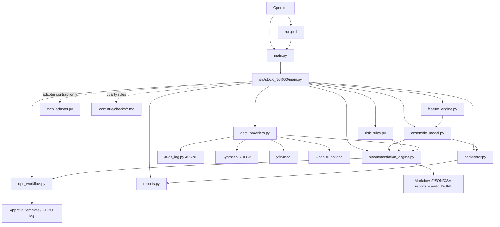
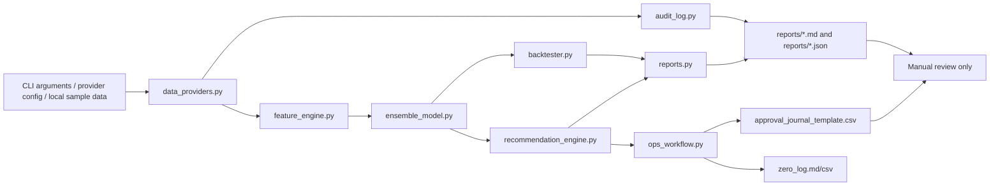

# SYSTEM_ARCHITECTURE

## Overview

The unified folder is a local Python CLI package. The active code lives under `src/stock_rtx4060`.

The architecture is intentionally report-only. It produces Markdown/JSON screening reports and dry-run validation evidence. It does not expose a web server, broker order router, or live trading dashboard.

## Data Flow

## Core Components

| Component | Path | Purpose |
|---|---|---|
| Root wrapper | `main.py` | Adds `src/` to `sys.path` and dispatches to the package CLI. |
| Windows runner | `run.ps1` | Selects a working Python runtime and runs CLI commands. |
| CLI | `src/stock_rtx4060/main.py` | Handles `self-test`, `recommend`, `ops-v1`, and compatibility command forms. |
| Features | `src/stock_rtx4060/feature_engine.py` | Builds feature inputs for model/backtest paths. |
| Model | `src/stock_rtx4060/ensemble_model.py` | Provides the model path used by recommendation and validation. |
| Backtest | `src/stock_rtx4060/backtester.py` | Runs dry-run portfolio/backtest calculations. |
| Recommendation | `src/stock_rtx4060/recommendation_engine.py` | Produces screening verdicts and recommendation evidence. |
| Ops workflow | `src/stock_rtx4060/ops_workflow.py` | Produces the Ops v1 daily brief, manual approval template, ZERO log, and workflow summary. |
| Risk rules | `src/stock_rtx4060/risk_rules.py` | Applies risk-plan checks. |
| Reports | `src/stock_rtx4060/reports.py` | Writes Markdown and JSON output. |
| Provider router | `src/stock_rtx4060/data_providers.py` | Selects `synthetic`, `yfinance`, `openbb`, or `auto` OHLCV provider. |
| Audit log | `src/stock_rtx4060/audit_log.py` | Writes masked append-only JSONL provider/workflow events. |
| MCP adapter contract | `src/stock_rtx4060/mcp_adapter.py` | Defines read/report-only Phase 1 MCP workflow contract. It does not start a server. |
| Tests | `tests/test_core.py`, `tests/test_audit_log.py`, `tests/test_data_providers.py`, `tests/test_mcp_adapter.py` | Verify core CLI/package behavior, provider routing, audit masking, and MCP boundary. |
| Continue checks | `.continue/checks/*.md` | Advisory PR-quality gates for financial safety, model integrity, reports, architecture, secrets, GPU claims, and verification evidence. |

## Boundary

The system is report-only. It has no broker API and no web server.

`ops-v1` is an orchestration command, not a trading command. It creates files for human review and journal follow-up only.

Continue does not change runtime behavior. It is a review-time quality gate for changes to this local CLI package.

Phase 1 MCP work is an adapter contract only. `src/stock_rtx4060/mcp_adapter.py` allows future read/report mapping for `recommend` and `ops-v1`; it does not bind a port, start a server, or expose broker/account/order capabilities.

## Provider And Audit Flow

| Step | Component | Output |
|---:|---|---|
| 1 | `src/stock_rtx4060/main.py` | Parses `--data-provider` and optional `--provider-config`. |
| 2 | `src/stock_rtx4060/data_providers.py` | Loads OHLCV from synthetic, yfinance, or optional OpenBB. |
| 3 | `src/stock_rtx4060/audit_log.py` | Appends masked JSONL provider attempt events. |
| 4 | `src/stock_rtx4060/recommendation_engine.py` | Builds recommendation Markdown/JSON and records `audit_log_path`. |
| 5 | `src/stock_rtx4060/ops_workflow.py` | Includes `audit_log` in Ops v1 returned paths and summary JSON. |

`RecommendationEngine` caches OHLCV data by ticker, period, synthetic flag, data provider, and provider config within one CLI run. This keeps Track-S and Track-L from making duplicate provider calls for the same ticker.

## Validation State

| Check | Current Result |
|---|---|
| `.\run.ps1 self-test` | PASS in the current Codex session |
| `python -m compileall .` | PASS |
| `python main.py --help` | AMBER with global Python if dependencies are missing; PASS with `.venv\Scripts\python.exe main.py --help` |
| Global `python main.py self-test` | AMBER unless the global interpreter is explicitly prepared |
| Project `.venv` pytest | PASS, 15 tests passed after OHLCV cache coverage |
| Ops v1 clean smoke | PASS, `AMZN,AAPL` generated review artifacts with `error_count=0` |
| Phase 1 recommendation smoke | PASS, generated Markdown, JSON, and `audit_log.jsonl` under `reports/recommendations_phase1_smoke` |
| Phase 1 Ops v1 smoke | PASS, generated Ops v1 artifacts and `audit_log.jsonl` under `reports/ops_v1_phase1_smoke` |
| OpenBB cache smoke | PASS, `reports/recommendations_openbb_cache_smoke/audit_log.jsonl` contains 1 AAPL provider event |
