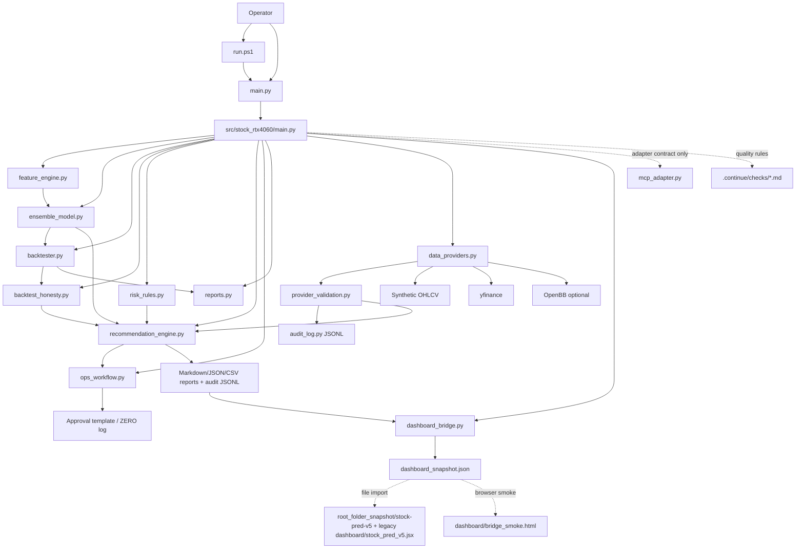
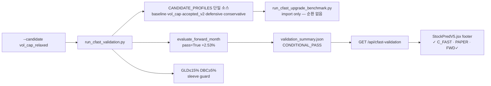
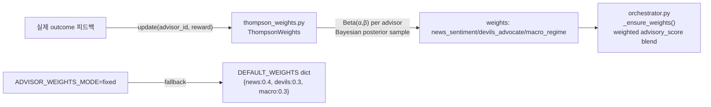
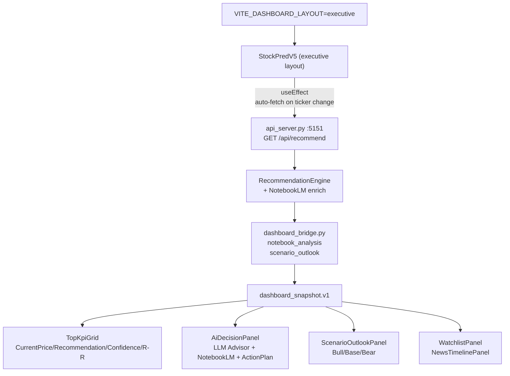
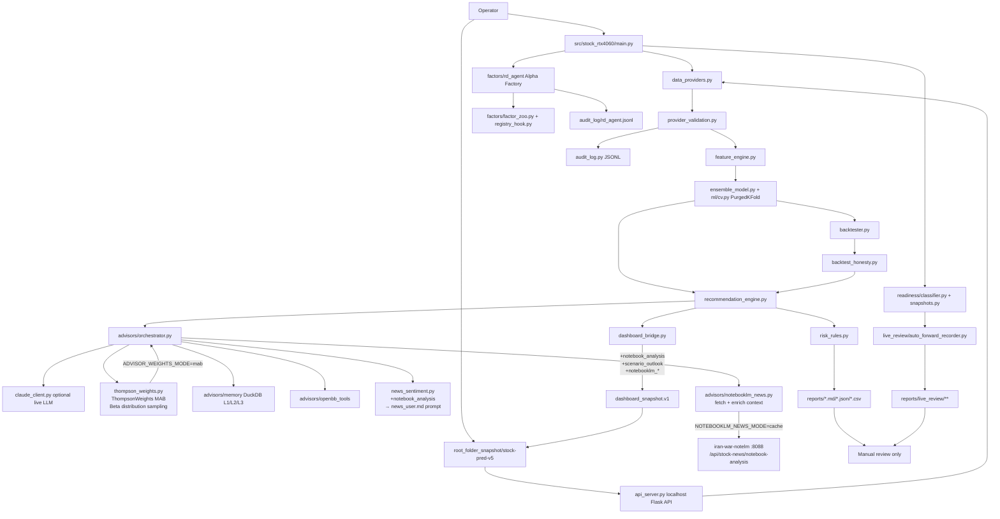
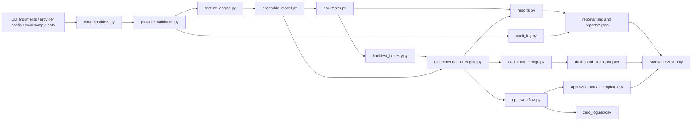
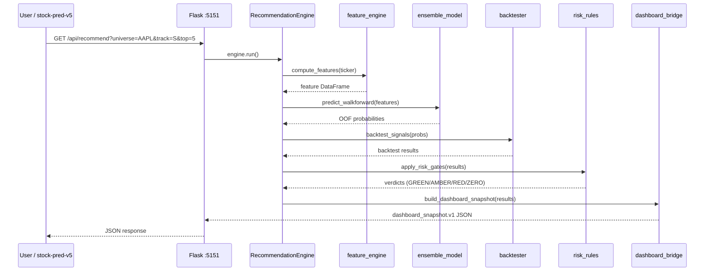
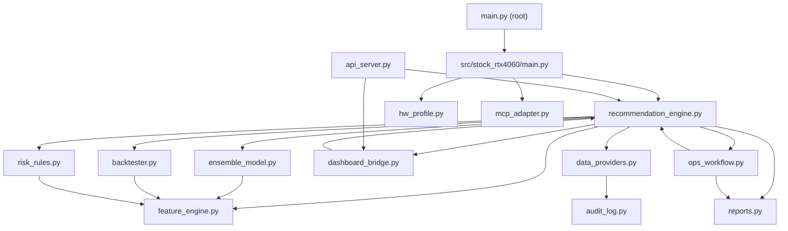
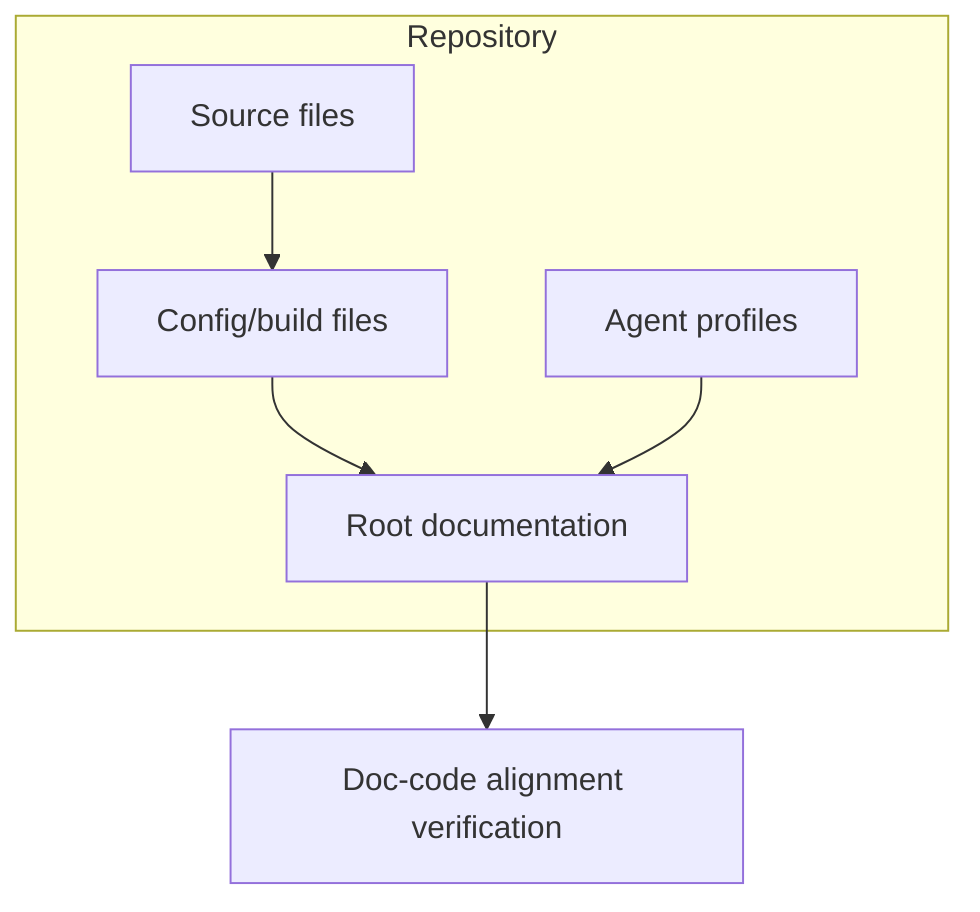

# SYSTEM_ARCHITECTURE

## Overview

The unified folder is a local Python CLI package. The active code lives under `src/stock_rtx4060`.

The architecture is intentionally report-only. It produces Markdown/JSON screening reports, dashboard snapshots, dry-run validation evidence, and paper-only forward evidence. It includes an optional local Flask API and Vite/React dashboard for operator review, but it must not enable broker order execution or automatic capital deployment.



## Architecture Update — 2026-05-31 (Quant1901 통합 + Safety Gate + 자동화 대시보드)

### Quant1901 보조 백테스트 레이어 (Added 2026-05-31)

```mermaid
flowchart LR
    Dashboard[Executive Dashboard v2.1] -->|auto fetch ticker change| API[/api/quant1901]
    API --> Runner[quant1901_runner.py\nP5 Backtest Plugin]
    Runner --> Bundle[quant1901_executor.py\nEMA·RSI·HTF·kill-switch]
    Runner -->|dashboard_snapshot.v1| Panel[BACKEND Panel\nQuant1901EvidenceCard]
    Panel -->|BLOCKED_RISK_HALT\nNOT_PASS\nCONDITIONAL_PASS| UI[대시보드 자동 표시]
```

**Key constraints (불변)**:
- `execution_controls.live_trading_allowed = False` (항상)
- `execution_controls.broker_execution_allowed = False` (항상)
- `screening_output_only = True`
- 결과는 보조 검증 증거; 주 추천 verdict를 업그레이드하지 않음

### Dashboard Safety Gate (Added 2026-05-31)

| 상태 | 조건 | 표시 |
|---|---|---|
| Hard blocked | HARD_BLOCKERS ∩ evidence_flags ≠ ∅ | NO TRADE / PAPER ONLY (Confidence ≤ 50) |
| Soft warning | SOFT_WARNINGS ∩ evidence_flags ≠ ∅ | WATCH ONLY / REVIEW (Confidence ≤ 65) |
| Clean | 블로커 없음 | 원본 AI 추천 유지 |

HARD_BLOCKERS (11개): `BACKTEST_HONESTY_NOT_PASS`, `ACCURACY_BELOW_50`, `AUC_BELOW_0_50`, `COMPLETED_TRADES_BELOW_50`, `SYNTHETIC_DATA_SOURCE`, `STALE_DATA`, `TARGET_RETURN_SHORTFALL`, `OPTIMIZER_FAILURE`, `VALIDATION_FAILED`, `BROKER_EXECUTION_NOT_ALLOWED`, `LIVE_TRADING_NOT_ALLOWED`

### New API Endpoints (Added 2026-05-31)

| Endpoint | 역할 |
|---|---|
| `GET /api/quant1901?ticker=X&period=2y&optimize=0` | Quant1901 보조 백테스트 실행 → dashboard_snapshot.v1 반환 |
| `GET /api/cfast-validation` | C_fast 검증 상태 조회 (read-only) — `validation_summary.json` 요약: `c_fast_verdict`, `forward_month_gate`, `promotion_status`, `regime_diagnostics` (Added 2026-05-31) |

### New CLI Subcommands (Added 2026-05-31)

```bash
python -m stock_rtx4060.main quant1901-backtest --ticker 005930.KS --period 2y --optimize
python -m stock_rtx4060.main recommend --quant1901 --quant1901-optimize
```

### C_fast Validation + --candidate CLI (Added 2026-05-31)



**검증 결과 (vol_cap_relaxed, 2026-05-31):**

| metric | 값 | 목표 |
|--------|-----|------|
| C_fast verdict | `CONDITIONAL_PASS_PAPER_TRADING_CANDIDATE` | ✅ |
| x2 ann_return | 13.06% | ≥10% ✅ |
| forward_month_gate | pass=True, +2.53% | ✅ |
| promotion_blockers | [] | ✅ |

---

## Architecture Update — 2026-05-30 (NotebookLM News Intelligence + Executive Dashboard v2.1 + Thompson Sampling MAB)

### Thompson Sampling MAB — Advisor Weighting



| 환경변수 | 기본값 | 동작 |
|---|---|---|
| `ADVISOR_WEIGHTS_MODE` | `mab` | `mab`=Thompson Sampling, `fixed`=고정 가중치 |
| `ADVISOR_RUN` | `true` (`.env`) | LLM Advisor 자동 실행 |
| `ADVISOR_BLEND_WEIGHT` | `0.10` (`.env`) | 최종 score 블렌딩 가중치 |

### Changed Modules Summary (2026-05-30)

| 모듈 | 변경 내용 |
|---|---|
| `advisors/thompson_weights.py` | **신규** — ThompsonWeights MAB 클래스 |
| `advisors/orchestrator.py` | ThompsonWeights 통합, `_ensure_weights()`, `update_advisor_reward()` |
| `advisors/notebooklm_news.py` | **전면 재작성** — fetch_notebooklm_analysis() + enrich_context_with_notebooklm() |
| `advisors/news_sentiment.py` | `notebook_analysis` → prompt render 전달 |
| `advisors/prompts/news_user.md` | NotebookLM 분석 블록 + proposition/citations JSON schema |
| `recommendation_engine.py` | market context + NLM enrich hook + 4 notebooklm_* 필드 + 5-tuple return |
| `dashboard_bridge.py` | `notebook_analysis` passthrough + `scenario_outlook` fallback |
| `api_server.py` | `.env` 자동 로드 (dotenv / fallback parser) |
| `dashboard/stock_pred_v5.jsx` | AdvisorOverlay notebooklm props 추가 |

### NotebookLM News Intelligence Layer

```mermaid
flowchart LR
    NLM["iran-war-notelm\nFastAPI :8088"]
    NLM_EP["GET /api/stock-news/\nnotebook-analysis?symbol=AAPL"]
    NLM --> NLM_EP

    ADAPTER["advisors/notebooklm_news.py\nfetch_notebooklm_analysis()\nenrich_context_with_notebooklm()"]
    NLM_EP -->|cache HIT JSON\nschema_version=notebook_stock_analysis.v1| ADAPTER

    ENGINE["recommendation_engine.py\n_apply_advisor_blend()"]
    ADAPTER -->|context[notebook_analysis]\ncontext[headlines]| ENGINE

    BRIDGE["dashboard_bridge.py\n_normalize_result()"]
    ENGINE -->|notebooklm_impact\nnotebook_analysis\nscenario_outlook| BRIDGE

    SNAP["dashboard_snapshot.v1\n+notebook_analysis\n+scenario_outlook\n+notebooklm_*"]
    BRIDGE --> SNAP

    UI["Executive Dashboard v2.1\nAiDecisionPanel\nScenarioOutlookPanel"]
    SNAP --> UI
```

### Executive Dashboard v2.1



## Current Architecture — 2026-05-29

The current system has five operator-facing surfaces (Updated: 2026-05-30):

| Surface | Path | Role | Safety boundary |
|---|---|---|---|
| Python CLI | `src/stock_rtx4060/main.py` | Runs `recommend`, `dashboard-export`, `paper-status`, `factor-*`, `ops-v1`, `benchmark`, and `env`. | Report-only output under `reports/` and audit logs. |
| Local API | `api_server.py` | Serves `/api/recommend`, `/api/snapshot`, `/api/universe`, `/api/symbol`, `/api/model-scores`, `/api/paper-status`, and `/api/health`. | Local dashboard integration only; no broker/order route. |
| Dashboard UI (classic) | `root_folder_snapshot/stock-pred-v5` | Vite/React dashboard. REC tab can use API mode or file snapshot mode. | Shows readiness and warnings; does not place orders. |
| Dashboard UI (executive) | `stock-pred-v5` + `VITE_DASHBOARD_LAYOUT=executive` | Executive Decision Dashboard v2.1 — auto-fetches `/api/recommend` on ticker change. | Report-only; no broker/order buttons; ActionPlan labeled "Reference only". |
| Forward evidence | `src/stock_rtx4060/live_review/auto_forward_recorder.py` | Records daily forward-paper evidence until review pack generation. | `auto_promote=false`, `new_capital_allowed=false`, `broker_order_execution=false`, `manual_approval_required=true`. |
| **NotebookLM API** | `iran-war-notelm/iran-war-uae-monitor` `:8088` | Stock news → NotebookLM analysis → `GET /api/stock-news/notebook-analysis`. | Read-only advisory data; no order route. |



## Safety And Promotion Boundary — 2026-05-29

Live-review and paper-trading code is intentionally additive. It does not replace the legacy paper status API and it does not enable capital deployment.

| State / layer | Allowed | Forbidden |
|---|---|---|
| `AMBER_WATCHLIST` | Research monitoring and dashboard display. | New capital and broker execution. |
| `PAPER_PASS` | Paper-only evidence and readiness snapshot generation. | Automatic live promotion. |
| `FORWARD_PAPER_RUNNING` | Daily forward paper logs and review pack preparation. | Auto-promote, new capital, broker execution. |
| `LIVE_REVIEW_CANDIDATE` | Manual review candidate only. | Automatic order placement. |

The invariant is enforced across `src/stock_rtx4060/readiness/classifier.py`, `src/stock_rtx4060/readiness/snapshots.py`, `src/stock_rtx4060/paper_trading.py`, and `src/stock_rtx4060/live_review/auto_forward_recorder.py`.

## Data Flow



## Core Components

| Component | Path | Purpose |
|---|---|---|
| Root wrapper | `main.py` | Adds `src/` to `sys.path` and dispatches to the package CLI. |
| Windows runner | `run.ps1` | Selects a working Python runtime and runs CLI commands. |
| CLI | `src/stock_rtx4060/main.py` | Handles `recommend`, `paper-status`, `dashboard-export`, `factor-mine`, `factor-list`, `factor-approve`, `factor-status`, `ops-v1`, `benchmark`, `env`, and compatibility command forms. |
| Local API | `api_server.py` | Serves dashboard-facing local endpoints including `/api/recommend`, `/api/snapshot`, `/api/universe`, `/api/symbol`, `/api/model-scores`, `/api/paper-status`, and `/api/health`. |
| Features | `src/stock_rtx4060/feature_engine.py` | Builds feature inputs for model/backtest paths. |
| Model | `src/stock_rtx4060/ensemble_model.py`, `src/stock_rtx4060/ml/cv.py` | Provides model scoring and leakage-aware OOF validation with PurgedKFold support. |
| Backtest | `src/stock_rtx4060/backtester.py` | Runs dry-run portfolio/backtest calculations. |
| Backtest honesty | `src/stock_rtx4060/backtest_honesty.py` | Adds evidence-only OOF, Sharpe, MDD, transaction-cost buffer, and walk-forward gap checks. |
| Recommendation | `src/stock_rtx4060/recommendation_engine.py` | Produces screening verdicts and recommendation evidence. |
| Dashboard bridge | `src/stock_rtx4060/dashboard_bridge.py` | Converts recommendation JSON into `dashboard_snapshot.v1` for dashboard file import. |
| Dashboard UI | `root_folder_snapshot/stock-pred-v5` | Full Vite/React dashboard workspace for REC, model evidence, readiness warnings, and backend snapshot review. |
| Ops workflow | `src/stock_rtx4060/ops_workflow.py` | Produces the Ops v1 daily brief, manual approval template, ZERO log, and workflow summary. |
| Risk rules | `src/stock_rtx4060/risk_rules.py` | Applies risk-plan checks. |
| Reports | `src/stock_rtx4060/reports.py` | Writes Markdown and JSON output. |
| Provider router | `src/stock_rtx4060/data_providers.py` | Selects `synthetic`, `yfinance`, `openbb`, or `auto` OHLCV provider. |
| Provider validation | `src/stock_rtx4060/provider_validation.py` | Checks OHLCV row count, date range, future rows, duplicate dates, required columns, nulls, and freshness evidence. |
| Audit log | `src/stock_rtx4060/audit_log.py` | Writes masked append-only JSONL provider/workflow events. |
| Advisor layer | `src/stock_rtx4060/advisors/` | Optional LLM advisor orchestration, prompts, audit, and blend evidence. |
| Advisor memory | `src/stock_rtx4060/advisors/memory/` | Optional DuckDB-backed L1/L2/L3 regime memory, CWRM routing, and STL proposition extraction. |
| Advisor OpenBB tools | `src/stock_rtx4060/advisors/openbb_tools/` | Optional OpenBB tool-use schemas and executor for advisor evidence gathering. |
| RD-Agent Alpha Factory | `src/stock_rtx4060/factors/rd_agent/` | Optional factor mining, Qlib export, provenance, validation, and registry staging/approval. |
| Readiness gates | `src/stock_rtx4060/readiness/` | Builds readiness snapshots and classifies live-review eligibility while keeping capital/order flags disabled. |
| Paper trading | `src/stock_rtx4060/paper_trading.py` | Preserves legacy paper API and adds forward paper log summary helpers. |
| Live review recorder | `src/stock_rtx4060/live_review/auto_forward_recorder.py` | Records 30-day forward-paper evidence and generates review packs without auto-promotion. |
| MCP adapter contract | `src/stock_rtx4060/mcp_adapter.py` | Defines read/report-only Phase 1 MCP workflow contract. It does not start a server. |
| Tests | `tests/test_core.py`, `tests/test_dashboard_bridge.py`, `tests/test_live_review_readiness.py`, `tests/test_auto_forward_recorder.py`, `tests/test_rd_agent_*.py`, `tests/test_advisor_*.py`, `tests/test_openbb_*.py` | Verify core CLI/package behavior, dashboard snapshots, live-review gates, RD-Agent, advisor memory, and OpenBB tool boundaries. |
| Continue checks | `.continue/checks/*.md` | Advisory PR-quality gates for financial safety, model integrity, reports, architecture, secrets, GPU claims, and verification evidence. |

## Boundary

The system is report-only. Broker adapter modules may exist for architectural staging, but runtime recommendation, readiness, paper, and live-review flows must keep broker order execution disabled.

The local Flask API is optional and operator-facing. It serves dashboard data and recommendation snapshots on localhost; it is not a broker API and must not expose account-writing or order-writing routes.

`ops-v1` is an orchestration command, not a trading command. It creates files for human review and journal follow-up only.

Continue does not change runtime behavior. It is a review-time quality gate for changes to this local CLI package.

Phase 1 MCP work is an adapter contract only. `src/stock_rtx4060/mcp_adapter.py` allows future read/report mapping for `recommend` and `ops-v1`; it does not bind a port, start a server, or expose broker/account/order capabilities.

The dashboard bridge is file-based for snapshot export and API-compatible for local review. `dashboard-export` reads an existing `recommendations_algo_v2_*.json` file and writes `dashboard_snapshot.json`. The full dashboard workspace under `root_folder_snapshot/stock-pred-v5` can consume `/api/recommend` or imported `dashboard_snapshot.v1` files. The legacy single-file copy under `dashboard/stock_pred_v5.jsx` is still tracked for compatibility.

Browser verification uses `dashboard/bridge_smoke.html` plus `node dashboard\verify_bridge_smoke.mjs`. The harness renders `dashboard_snapshot.v1` in Chrome through Playwright CLI and writes evidence under `reports/dashboard_browser_verification/`.

## Provider And Audit Flow

| Step | Component | Output |
|---:|---|---|
| 1 | `src/stock_rtx4060/main.py` | Parses `--data-provider` and optional `--provider-config`. |
| 2 | `src/stock_rtx4060/data_providers.py` | Loads OHLCV from synthetic, yfinance, or optional OpenBB. |
| 3 | `src/stock_rtx4060/provider_validation.py` | Adds point-in-time OHLCV validation metadata. |
| 4 | `src/stock_rtx4060/audit_log.py` | Appends masked JSONL provider attempt events with validation evidence. |
| 5 | `src/stock_rtx4060/recommendation_engine.py` | Builds recommendation Markdown/JSON and records `audit_log_path` plus `provider_summary`. |
| 6 | `src/stock_rtx4060/ops_workflow.py` | Includes `audit_log` in Ops v1 returned paths and summary JSON. |

`RecommendationEngine` caches OHLCV data by ticker, period, synthetic flag, data provider, and provider config within one CLI run. This keeps Track-S and Track-L from making duplicate provider calls for the same ticker.

Phase A provider validation is evidence-only. A provider validation PASS does not approve a trade and does not bypass the existing risk gates.

Phase B backtest honesty is evidence-only. A Backtest Honesty PASS does not approve a trade, does not change ranking keys, and does not bypass risk gates.

## Backtest Honesty Flow

| Step | Component | Output |
|---:|---|---|
| 1 | `src/stock_rtx4060/backtester.py` | Produces return, Sharpe, Sortino, MDD, and profit-factor metrics. |
| 2 | `src/stock_rtx4060/backtest_honesty.py` | Evaluates OOF coverage, Sharpe floor, max drawdown, transaction-cost buffer, and walk-forward gap. |
| 3 | `src/stock_rtx4060/recommendation_engine.py` | Writes candidate-level `backtest_honesty` and top-level `backtest_honesty_summary`. |
| 4 | `src/stock_rtx4060/audit_log.py` | Appends `backtest_honesty_summary` JSONL event. |
| 5 | `src/stock_rtx4060/dashboard_bridge.py` | Preserves `backtest_honesty_summary` in `dashboard_snapshot.v1`. |

## Validation State

This table contains historical validation evidence retained from earlier architecture passes. For current release status, prefer the latest local pytest/coverage run, GitHub Actions result, and the most recent pushed `main` commit evidence. Do not treat older validation rows as proof for newly added RD-Agent, advisor memory/OpenBB, readiness, live-review, or dashboard changes unless those checks were rerun in the current session.

| Check | Current Result |
|---|---|
| `.\run.ps1 self-test` | PASS in the current Codex session |
| `python -m compileall .` | PASS |
| `python main.py --help` | AMBER with global Python if dependencies are missing; PASS with `.venv\Scripts\python.exe main.py --help` |
| Global `python main.py self-test` | AMBER unless the global interpreter is explicitly prepared |
| Project `.venv` pytest | PASS, 26 tests passed after Phase A provider validation coverage |
| Ops v1 clean smoke | PASS, `AMZN,AAPL` generated review artifacts with `error_count=0` |
| Phase 1 recommendation smoke | PASS, generated Markdown, JSON, and `audit_log.jsonl` under `reports/recommendations_phase1_smoke` |
| Phase 1 Ops v1 smoke | PASS, generated Ops v1 artifacts and `audit_log.jsonl` under `reports/ops_v1_phase1_smoke` |
| OpenBB cache smoke | PASS, `reports/recommendations_openbb_cache_smoke/audit_log.jsonl` contains 1 AAPL provider event |
| Dashboard bridge smoke | PASS, `reports/dashboard_bridge_smoke/dashboard_snapshot.json` contains `dashboard_snapshot.v1`, `report_only`, 2 results, and `screening_output_only=True` |
| Dashboard browser verification | PASS, `reports/dashboard_browser_verification/dashboard_browser_verification.md` and `backend_snapshot_smoke.png` generated |
| Phase A provider validation smoke | PASS, `reports/phase_a_provider_v2_smoke/dashboard_snapshot.json` contains `provider_summary.status=PASS` and `screening_output_only=True` |
| Phase B targeted tests | PASS, 7 tests passed for backtest honesty, dashboard bridge compatibility, and synthetic recommendation JSON evidence |
| Phase B full regression | PASS, 30 tests passed |
| Phase B smoke | PASS, `reports/phase_b_backtest_honesty_smoke/dashboard_snapshot.json` contains `backtest_honesty_summary.status=AMBER`, candidate `backtest_honesty.status=AMBER`, and `screening_output_only=True` |
| Overall test coverage (2026-05-10) | **85.82%** — 1,210 tests, 0 failures. explain.py 89%, hpo.py 88%, yf/alpaca/kis ingestors 95–100%. portfolio/optimizer.py Python 3.14 numpy read-only array compat confirmed. |

---

# System Architecture

## Purpose
Report-only stock-candidate screening engine. Walk-forward ensemble ML, 9 risk gates, two-track output (Track-S short-term / Track-L long-term). Outputs dashboard_snapshot.v1 JSON for stock-pred-v5 REC tab.

## Runtime Components

| Component | File | Role |
|-----------|------|------|
| CLI Entry | `main.py` (root) | Prepends `src/` to `sys.path`, dispatches to package CLI |
| Package CLI | `src/stock_rtx4060/main.py` | Subcommands: `recommend`, `paper-status`, `ops-v1`, `benchmark`, `dashboard-export`, `env`, `factor-mine`, `factor-list`, `factor-approve`, `factor-status` |
| Orchestrator | `src/stock_rtx4060/recommendation_engine.py` | RecommendationEngine, RecommendationConfig, run() |
| Feature Engine | `src/stock_rtx4060/feature_engine.py` | TechnicalIndicators, 60+ indicators, feature_lag=1 shift |
| Ensemble Model | `src/stock_rtx4060/ensemble_model.py` | XGBoost + LogisticRegression fallback, leakage-aware OOF CV with PurgedKFold support |
| Backtester | `src/stock_rtx4060/backtester.py` | Dry-run trade simulation |
| Risk Rules | `src/stock_rtx4060/risk_rules.py` | GREEN/AMBER/RED/ZERO gate logic, position sizing |
| Dashboard Bridge | `src/stock_rtx4060/dashboard_bridge.py` | Converts recommendation JSON to dashboard_snapshot.v1 |
| API Server | `api_server.py` (root) | Flask server (port 5151 by default) for stock-pred-v5 integration. CORS is restricted to local dashboard origins on `localhost` and `127.0.0.1` dev ports 5173, 5174, 5175, 4173, and 5151. |
| Reports Writer | `src/stock_rtx4060/reports.py` | Markdown + JSON output writers |
| Data Providers | `src/stock_rtx4060/data_providers.py` | Provider router: synthetic / yfinance / openbb / auto. Data Lake ingestors (yf/alpaca/kis) are production-ready with ≥94% test coverage (2026-05-10). |
| Audit Log | `src/stock_rtx4060/audit_log.py` | JSONL append-only event log with secret masking |
| Ops Workflow | `src/stock_rtx4060/ops_workflow.py` | Daily brief + manual approval template + ZERO log |
| HW Profile | `src/stock_rtx4060/hw_profile.py` | nvidia-smi probe, TensorFlow GPU check, RuntimeStatus |
| MCP Adapter | `src/stock_rtx4060/mcp_adapter.py` | Phase 1 read/report-only adapter contract (no server, no broker) |
| LLM Advisors | `src/stock_rtx4060/advisors/` | Optional news, macro, devil's advocate, memory, OpenBB tool, and live LLM advisory evidence |
| RD-Agent | `src/stock_rtx4060/factors/rd_agent/` | Optional factor discovery, validation, provenance, and registry approval |
| Readiness | `src/stock_rtx4060/readiness/` | Snapshot and classifier gates for watchlist, paper, and live-review candidate states |
| Live Review | `src/stock_rtx4060/live_review/auto_forward_recorder.py` | Forward paper recorder with no auto-promotion and no broker execution |

## Component Topology

```mermaid
flowchart TD
    subgraph Input["CLI / API Input"]
        U[Universe Tickers] --> RE
        P[Period / Horizon] --> RE
        M[Model Kind / Provider] --> RE
    end
    subgraph Pipeline["Core Pipeline"]
        RE[recommendation_engine.py] --> FE[feature_engine.py]
        FE --> EM[ensemble_model.py]
        EM --> BT[backtester.py]
        BT --> RR[risk_rules.py]
        RR --> DB[dashboard_bridge.py]
    end
    subgraph Output["Output"]
        DB --> SNAP[dashboard_snapshot.json]
        RR --> RPT[Markdown / JSON Report]
        RR --> OPS[ops_workflow.py]
    end
    subgraph ApiServer["Flask API"]
        ApiRecommend[/api/recommend] --> RE
        ApiRecommend --> DB
        ApiRecommend --> SNAP[dashboard_snapshot.json]
    end
```

The Flask API (`api_server.py` at root, port 5151) reads recommendation results from both `recommendation_engine.py` and `dashboard_bridge.py` to serve the `/api/recommend` endpoint consumed by the stock-pred-v5 REC tab.

## Request Sequence (recommend flow)



## Module Dependency Map



## Technology Stack

| Layer | Technology | Version | Notes |
|-------|------------|---------|-------|
| Runtime | Python | 3.11+ | CLI entry point |
| ML | XGBoost | >=3.1 | CPU/GPU, gap-aware CV, version-aware device params |
| ML | scikit-learn | >=1.1 | LogisticRegression fallback with scaling + imputation |
| Data | pandas | >=2.2 | DataFrame operations |
| Data | numpy | >=1.26 | Array operations |
| Data | yfinance | >=0.2.66 | Default OHLCV price data |
| API | Flask | >=3.0 | REST endpoints (port 5151) |
| API | flask-cors | >=4.0 | CORS for local dashboard origins on localhost/127.0.0.1 dev ports |
| Charts | tabulate | >=0.9 | Markdown table output |
| Optional | OpenBB | latest | `obb.equity.price.historical` when installed |

## Cross-Project Interface

- **stock-pred-v5 REC tab** fetches `dashboard_snapshot.json` (FILE mode) or `/api/recommend` (API mode)
- Vite can proxy `/api` to the local Flask server, and direct local API URLs are also allowed through the explicit localhost/127.0.0.1 CORS allowlist.
- `dashboard_snapshot.v1` schema:
  ```json
  {
    "version": "dashboard_snapshot.v1",
    "generated_at_utc": "YYYY-MM-DDTHH:MM:SSZ",
    "source": "stock_rtx4060_unified",
    "screening_output_only": true,
    "results": [
      {
        "ticker": "AAPL",
        "track": "S",
        "verdict": "GREEN",
        "score": 82.50,
        "entry": 185.00,
        "stop": 177.60,
        "tp2": 203.50,
        "risk_reward": 2.91,
        "investment_readiness_status": "AMBER_WATCHLIST",
        "new_capital_allowed": false,
        "paper_trading_only": true,
        "validations": { ... }
      }
    ]
  }
  ```
- Walk-forward / OOF ensemble: leakage-aware PurgedKFold and embargo controls protect label horizon boundaries
- Feature lag: `feature_lag=1` shifts features so model never sees the bar it predicts from
- Kelly sizing (fraction=0.25) and suggested quantity are analysis fields only; never connected to an order router


## Codex Documentation Update — 2026-05-28T20:44:00.663596+00:00

**Update policy:** existing content above this section is preserved. This section was appended after scanning code, documentation, config, and agent profile files.

**Purpose:** This section reflects detected source, config, and agent components as an architecture inventory.

### Evidence inventory

**Source/code files sampled:**
- `api_server.py`
- `dashboard\stock_pred_v5.jsx`
- `flows\__init__.py`
- `flows\daily_krx.py`
- `flows\daily_us.py`
- `flows\research_weekly.py`
- `flows\utils.py`
- `main.py`
- `preview_server.py`
- `reports\dashboard_browser_verification\snapshot_fixture.js`
- `root_folder_snapshot\KEVPE_final_package\demo_kevpe_v2.py`
- `root_folder_snapshot\KEVPE_final_package\kevpe.py`

**Documentation files sampled:**
- `.codex\goals\dashboard-report-bridge.goal.md`
- `.codex\goals\mcp-openbb-audit-phase1.goal.md`
- `.continue\checks\01-financial-safety-boundary.md`
- `.continue\checks\02-backtest-integrity.md`
- `.continue\checks\03-recommendation-contract.md`
- `.continue\checks\04-secret-and-pii-safety.md`
- `.continue\checks\05-gpu-claim-validation.md`
- `.continue\checks\06-report-contract.md`
- `.continue\checks\07-architecture-boundary.md`
- `.continue\checks\08-test-and-verification.md`
- `20260507_plan-doc.md`
- `20260510_project-upgrade-report.md`

**Config/build files sampled:**
- `.claude\launch.json`
- `.codex\root-docs-dry-run.json`
- `.codex\root-docs-scan.json`
- `.github\workflows\ci.yml`
- `.pre-commit-config.yaml`
- `config\data_providers.example.json`
- `config\runtime_environment.json`
- `config\sector_map.json`
- `coverage.json`
- `docker-compose.dev.yml`
- `docs\AGENTS.md`
- `examples\kevpe_events_smoke.json`

**Agent profile files sampled:**
- No agent profile detected; this update records the absence explicitly.

### Mermaid graph



### Verification notes

- Append-only update generated by `root-docs-batch-update`.
- Code/config/doc/agent inventory counts: code=2337, docs=1091, config=698, agent_profiles=0.
- Follow-up verification should confirm that newly added text matches actual implementation paths listed above.


## Hermes Documentation Update — 2026-05-28T23:02:20.364421+00:00

**Update policy:** existing content above this section is preserved. This section was appended after scanning code, documentation, config, and agent profile files.

**Purpose:** This section reflects detected source, config, and agent components as an architecture inventory.

### Evidence inventory

**Source/code files sampled:**
- `api_server.py`
- `dashboard\stock_pred_v5.jsx`
- `flows\__init__.py`
- `flows\daily_krx.py`
- `flows\daily_us.py`
- `flows\research_weekly.py`
- `flows\utils.py`
- `main.py`
- `preview_server.py`
- `reports\dashboard_browser_verification\snapshot_fixture.js`
- `root_folder_snapshot\KEVPE_final_package\demo_kevpe_v2.py`
- `root_folder_snapshot\KEVPE_final_package\kevpe.py`

**Documentation files sampled:**
- `.codex\goals\dashboard-report-bridge.goal.md`
- `.codex\goals\mcp-openbb-audit-phase1.goal.md`
- `.codex\root-docs-strict\docs\001-README.md`
- `.codex\root-docs-strict\docs\002-SYSTEM_ARCHITECTURE.md`
- `.codex\root-docs-strict\docs\003-LAYOUT.md`
- `.codex\root-docs-strict\docs\004-CHANGELOG.md`
- `.codex\root-docs-strict\docs\005-plan.md`
- `.codex\root-docs-strict\docs\006-codex-default-doc-agent.md`
- `.continue\checks\01-financial-safety-boundary.md`
- `.continue\checks\02-backtest-integrity.md`
- `.continue\checks\03-recommendation-contract.md`
- `.continue\checks\04-secret-and-pii-safety.md`

**Config/build files sampled:**
- `.claude\launch.json`
- `.codex\root-docs-dry-run.json`
- `.codex\root-docs-scan.json`
- `.codex\root-docs-verify.json`
- `.codex\root-docs-write.json`
- `.github\workflows\ci.yml`
- `.hermes\root-docs-dry-run.json`
- `.hermes\root-docs-scan.json`
- `.pre-commit-config.yaml`
- `config\data_providers.example.json`
- `config\runtime_environment.json`
- `config\sector_map.json`

**Agent profile files sampled:**
- `docs\agents\codex-default-doc-agent.md` (`codex-default-doc-agent`)

### Mermaid graph


### Verification notes

- Append-only update generated by `root-docs-batch-update`.
- Code/config/doc/agent inventory counts: code=2342, docs=1142, config=739, agent_profiles=1.
- Follow-up verification should confirm that newly added text matches actual implementation paths listed above.


## Codex Documentation Update — 2026-05-29T00:10:42.371181+00:00

**Update policy:** existing content above this section is preserved. This section was appended after scanning code, documentation, config, and agent profile files.

**Purpose:** This section reflects detected source, config, and agent components as an architecture inventory.

### Evidence inventory

**Source/code files sampled:**
- `api_server.py`
- `dashboard\stock_pred_v5.jsx`
- `flows\__init__.py`
- `flows\daily_krx.py`
- `flows\daily_us.py`
- `flows\research_weekly.py`
- `flows\utils.py`
- `main.py`
- `preview_server.py`
- `reports\dashboard_browser_verification\snapshot_fixture.js`
- `root_folder_snapshot\KEVPE_final_package\demo_kevpe_v2.py`
- `root_folder_snapshot\KEVPE_final_package\kevpe.py`

**Documentation files sampled:**
- `.codex\goals\dashboard-report-bridge.goal.md`
- `.codex\goals\mcp-openbb-audit-phase1.goal.md`
- `.codex\root-docs-strict\docs\001-README.md`
- `.codex\root-docs-strict\docs\002-SYSTEM_ARCHITECTURE.md`
- `.codex\root-docs-strict\docs\003-LAYOUT.md`
- `.codex\root-docs-strict\docs\004-CHANGELOG.md`
- `.codex\root-docs-strict\docs\005-plan.md`
- `.codex\root-docs-strict\docs\006-codex-default-doc-agent.md`
- `.continue\checks\01-financial-safety-boundary.md`
- `.continue\checks\02-backtest-integrity.md`
- `.continue\checks\03-recommendation-contract.md`
- `.continue\checks\04-secret-and-pii-safety.md`

**Config/build files sampled:**
- `.claude\launch.json`
- `.codex\root-docs-dry-run.json`
- `.codex\root-docs-scan.json`
- `.codex\root-docs-verify.json`
- `.codex\root-docs-write.json`
- `.github\workflows\ci.yml`
- `.hermes\root-docs-dry-run.json`
- `.hermes\root-docs-scan.json`
- `.hermes\root-docs-write.json`
- `.pre-commit-config.yaml`
- `config\data_providers.example.json`
- `config\runtime_environment.json`

**Agent profile files sampled:**
- `docs\agents\codex-default-doc-agent.md` (`codex-default-doc-agent`)

### Mermaid graph


### Verification notes

- Append-only update generated by `root-docs-batch-update`.
- Code/config/doc/agent inventory counts: code=2342, docs=1168, config=766, agent_profiles=1.
- Follow-up verification should confirm that newly added text matches actual implementation paths listed above.


## Codex Documentation Update — 2026-05-29T00:39:13.408134+00:00

**Update policy:** existing content above this section is preserved. This section was appended after scanning code, documentation, config, and agent profile files.

**Purpose:** This section reflects detected source, config, and agent components as an architecture inventory.

### Evidence inventory

**Source/code files sampled:**
- `api_server.py`
- `dashboard\stock_pred_v5.jsx`
- `flows\__init__.py`
- `flows\daily_krx.py`
- `flows\daily_us.py`
- `flows\research_weekly.py`
- `flows\utils.py`
- `main.py`
- `preview_server.py`
- `reports\dashboard_browser_verification\snapshot_fixture.js`
- `root_folder_snapshot\KEVPE_final_package\demo_kevpe_v2.py`
- `root_folder_snapshot\KEVPE_final_package\kevpe.py`

**Documentation files sampled:**
- `.codex\goals\dashboard-report-bridge.goal.md`
- `.codex\goals\mcp-openbb-audit-phase1.goal.md`
- `.codex\root-docs-strict\docs\001-README.md`
- `.codex\root-docs-strict\docs\002-SYSTEM_ARCHITECTURE.md`
- `.codex\root-docs-strict\docs\003-LAYOUT.md`
- `.codex\root-docs-strict\docs\004-CHANGELOG.md`
- `.codex\root-docs-strict\docs\005-plan.md`
- `.codex\root-docs-strict\docs\006-codex-default-doc-agent.md`
- `.continue\checks\01-financial-safety-boundary.md`
- `.continue\checks\02-backtest-integrity.md`
- `.continue\checks\03-recommendation-contract.md`
- `.continue\checks\04-secret-and-pii-safety.md`

**Config/build files sampled:**
- `.codex\root-docs-dry-run.json`
- `.codex\root-docs-scan.json`
- `.github\workflows\ci.yml`
- `.pre-commit-config.yaml`
- `config\data_providers.example.json`
- `config\runtime_environment.json`
- `config\sector_map.json`
- `docker-compose.dev.yml`
- `docs\AGENTS.md`
- `examples\kevpe_events_smoke.json`
- `observability\grafana\dashboards\data_lake.json`
- `observability\grafana\dashboards\recommendations.json`

**Agent profile files sampled:**
- `docs\agents\codex-default-doc-agent.md` (`codex-default-doc-agent`)

### Mermaid graph


### Verification notes

- Append-only update generated by `root-docs-batch-update`.
- Code/config/doc/agent inventory counts: code=2344, docs=990, config=585, agent_profiles=1.
- Follow-up verification should confirm that newly added text matches actual implementation paths listed above.


## Codex Documentation Update — 2026-05-29T04:07:15.920451+00:00

**Update policy:** existing content above this section is preserved. This section was appended after scanning code, documentation, config, and agent profile files.

**Purpose:** This section reflects detected source, config, and agent components as an architecture inventory.

### Evidence inventory

**Source/code files sampled:**
- `api_server.py`
- `dashboard\stock_pred_v5.jsx`
- `docs\purged_kfold_embargo.py`
- `docs\test_purged_kfold_embargo.py`
- `flows\__init__.py`
- `flows\daily_krx.py`
- `flows\daily_us.py`
- `flows\research_weekly.py`
- `flows\utils.py`
- `main.py`
- `preview_server.py`
- `reports\dashboard_browser_verification\snapshot_fixture.js`

**Documentation files sampled:**
- `.codex\goals\dashboard-report-bridge.goal.md`
- `.codex\goals\mcp-openbb-audit-phase1.goal.md`
- `.codex\root-docs-strict\docs\001-README.md`
- `.codex\root-docs-strict\docs\002-SYSTEM_ARCHITECTURE.md`
- `.codex\root-docs-strict\docs\003-LAYOUT.md`
- `.codex\root-docs-strict\docs\004-CHANGELOG.md`
- `.codex\root-docs-strict\docs\005-plan.md`
- `.codex\root-docs-strict\docs\006-codex-default-doc-agent.md`
- `.continue\checks\01-financial-safety-boundary.md`
- `.continue\checks\02-backtest-integrity.md`
- `.continue\checks\03-recommendation-contract.md`
- `.continue\checks\04-secret-and-pii-safety.md`

**Config/build files sampled:**
- `.codex\root-docs-dry-run.json`
- `.codex\root-docs-scan.json`
- `.codex\root-docs-verify.json`
- `.codex\root-docs-write.json`
- `.github\workflows\ci.yml`
- `.pre-commit-config.yaml`
- `config\data_providers.example.json`
- `config\runtime_environment.json`
- `config\sector_map.json`
- `docker-compose.dev.yml`
- `docs\AGENTS.md`
- `examples\kevpe_events_smoke.json`

**Agent profile files sampled:**
- `docs\agents\codex-default-doc-agent.md` (`codex-default-doc-agent`)

### Mermaid graph


### Verification notes

- Append-only update generated by `root-docs-batch-update`.
- Code/config/doc/agent inventory counts: code=2347, docs=992, config=589, agent_profiles=1.
- Follow-up verification should confirm that newly added text matches actual implementation paths listed above.


## Codex Documentation Update — 2026-05-29T05:51:01.365772+00:00

**Update policy:** existing content above this section is preserved. This section was appended after scanning code, documentation, config, and agent profile files.

**Purpose:** This section reflects detected source, config, and agent components as an architecture inventory.

### Evidence inventory

**Source/code files sampled:**
- `api_server.py`
- `dashboard\stock_pred_v5.jsx`
- `docs\purged_kfold_embargo.py`
- `docs\test_purged_kfold_embargo.py`
- `flows\__init__.py`
- `flows\daily_krx.py`
- `flows\daily_us.py`
- `flows\research_weekly.py`
- `flows\utils.py`
- `main.py`
- `preview_server.py`
- `reports\dashboard_browser_verification\snapshot_fixture.js`

**Documentation files sampled:**
- `.codex\goals\dashboard-report-bridge.goal.md`
- `.codex\goals\mcp-openbb-audit-phase1.goal.md`
- `.codex\root-docs-strict\docs\001-README.md`
- `.codex\root-docs-strict\docs\002-SYSTEM_ARCHITECTURE.md`
- `.codex\root-docs-strict\docs\003-LAYOUT.md`
- `.codex\root-docs-strict\docs\004-CHANGELOG.md`
- `.codex\root-docs-strict\docs\005-plan.md`
- `.codex\root-docs-strict\docs\006-codex-default-doc-agent.md`
- `.continue\checks\01-financial-safety-boundary.md`
- `.continue\checks\02-backtest-integrity.md`
- `.continue\checks\03-recommendation-contract.md`
- `.continue\checks\04-secret-and-pii-safety.md`

**Config/build files sampled:**
- `.codex\root-docs-dry-run.json`
- `.codex\root-docs-scan.json`
- `.codex\root-docs-verify.json`
- `.codex\root-docs-write.json`
- `.github\workflows\ci.yml`
- `.hermes\root-docs-dry-run.json`
- `.hermes\root-docs-scan.json`
- `.hermes\root-docs-write.json`
- `.pre-commit-config.yaml`
- `config\data_providers.example.json`
- `config\runtime_environment.json`
- `config\sector_map.json`

**Agent profile files sampled:**
- `docs\agents\codex-default-doc-agent.md` (`codex-default-doc-agent`)

### Mermaid graph


### Verification notes

- Append-only update generated by `root-docs-batch-update`.
- Code/config/doc/agent inventory counts: code=2355, docs=1033, config=627, agent_profiles=1.
- Follow-up verification should confirm that newly added text matches actual implementation paths listed above.


## Codex Documentation Update — 2026-05-29T08:52:10.916684+00:00

**Update policy:** existing content above this section is preserved. This section was appended after scanning code, documentation, config, and agent profile files.

**Purpose:** This section reflects detected source, config, and agent components as an architecture inventory.

### Evidence inventory

**Source/code files sampled:**
- `api_server.py`
- `dashboard\stock_pred_v5.jsx`
- `docs\purged_kfold_embargo.py`
- `docs\test_purged_kfold_embargo.py`
- `flows\__init__.py`
- `flows\daily_krx.py`
- `flows\daily_us.py`
- `flows\research_weekly.py`
- `flows\utils.py`
- `main.py`
- `preview_server.py`
- `reports\dashboard_browser_verification\snapshot_fixture.js`

**Documentation files sampled:**
- `.codex\goals\dashboard-report-bridge.goal.md`
- `.codex\goals\mcp-openbb-audit-phase1.goal.md`
- `.codex\root-docs-strict\docs\001-README.md`
- `.codex\root-docs-strict\docs\002-SYSTEM_ARCHITECTURE.md`
- `.codex\root-docs-strict\docs\003-LAYOUT.md`
- `.codex\root-docs-strict\docs\004-CHANGELOG.md`
- `.codex\root-docs-strict\docs\005-plan.md`
- `.codex\root-docs-strict\docs\006-codex-default-doc-agent.md`
- `.continue\checks\01-financial-safety-boundary.md`
- `.continue\checks\02-backtest-integrity.md`
- `.continue\checks\03-recommendation-contract.md`
- `.continue\checks\04-secret-and-pii-safety.md`

**Config/build files sampled:**
- `.claude\launch.json`
- `.codex\root-docs-dry-run-latest.json`
- `.codex\root-docs-dry-run.json`
- `.codex\root-docs-scan-latest.json`
- `.codex\root-docs-scan.json`
- `.codex\root-docs-verify.json`
- `.codex\root-docs-write.json`
- `.github\workflows\ci.yml`
- `.hermes\root-docs-dry-run.json`
- `.hermes\root-docs-scan.json`
- `.hermes\root-docs-write.json`
- `.pre-commit-config.yaml`

**Agent profile files sampled:**
- `docs\agents\codex-default-doc-agent.md` (`codex-default-doc-agent`)

### Mermaid graph


### Verification notes

- Append-only update generated by `root-docs-batch-update`.
- Code/config/doc/agent inventory counts: code=2361, docs=1227, config=828, agent_profiles=1.
- Follow-up verification should confirm that newly added text matches actual implementation paths listed above.


## Codex Documentation Update — 2026-05-29T10:35:18.105307+00:00

**Update policy:** existing content above this section is preserved. This section was appended after scanning code, documentation, config, and agent profile files.

**Purpose:** This section reflects detected source, config, and agent components as an architecture inventory.

### Evidence inventory

**Source/code files sampled:**
- `api_server.py`
- `dashboard\stock_pred_v5.jsx`
- `docs\purged_kfold_embargo.py`
- `docs\test_purged_kfold_embargo.py`
- `flows\__init__.py`
- `flows\daily_krx.py`
- `flows\daily_us.py`
- `flows\research_weekly.py`
- `flows\utils.py`
- `main.py`
- `preview_server.py`
- `reports\dashboard_browser_verification\snapshot_fixture.js`

**Documentation files sampled:**
- `.codex\goals\dashboard-report-bridge.goal.md`
- `.codex\goals\mcp-openbb-audit-phase1.goal.md`
- `.codex\root-docs-strict\docs\001-README.md`
- `.codex\root-docs-strict\docs\002-SYSTEM_ARCHITECTURE.md`
- `.codex\root-docs-strict\docs\003-LAYOUT.md`
- `.codex\root-docs-strict\docs\004-CHANGELOG.md`
- `.codex\root-docs-strict\docs\005-plan.md`
- `.codex\root-docs-strict\docs\006-codex-default-doc-agent.md`
- `.continue\checks\01-financial-safety-boundary.md`
- `.continue\checks\02-backtest-integrity.md`
- `.continue\checks\03-recommendation-contract.md`
- `.continue\checks\04-secret-and-pii-safety.md`

**Config/build files sampled:**
- `.claude\launch.json`
- `.codex\root-docs-dry-run-latest.json`
- `.codex\root-docs-dry-run.json`
- `.codex\root-docs-scan-latest.json`
- `.codex\root-docs-scan.json`
- `.codex\root-docs-verify-latest.json`
- `.codex\root-docs-verify.json`
- `.codex\root-docs-write.json`
- `.github\workflows\ci.yml`
- `.hermes\root-docs-dry-run.json`
- `.hermes\root-docs-scan.json`
- `.hermes\root-docs-write.json`

**Agent profile files sampled:**
- `docs\agents\codex-default-doc-agent.md` (`codex-default-doc-agent`)

### Mermaid graph


### Verification notes

- Append-only update generated by `root-docs-batch-update`.
- Code/config/doc/agent inventory counts: code=2361, docs=1249, config=850, agent_profiles=1.
- Follow-up verification should confirm that newly added text matches actual implementation paths listed above.


## Codex Documentation Update — 2026-05-29T12:01:03.736036+00:00

**Update policy:** existing content above this section is preserved. This section was appended after scanning code, documentation, config, and agent profile files.

**Purpose:** This section reflects detected source, config, and agent components as an architecture inventory.

### Evidence inventory

**Source/code files sampled:**
- `api_server.py`
- `dashboard\stock_pred_v5.jsx`
- `docs\purged_kfold_embargo.py`
- `docs\test_purged_kfold_embargo.py`
- `flows\__init__.py`
- `flows\daily_krx.py`
- `flows\daily_us.py`
- `flows\research_weekly.py`
- `flows\utils.py`
- `main.py`
- `preview_server.py`
- `reports\dashboard_browser_verification\snapshot_fixture.js`

**Documentation files sampled:**
- `.codex\dashboard_live_verify\krx\recommendations_algo_v2_20260529_145024.md`
- `.codex\dashboard_live_verify\krx_after_cache_fix\recommendations_algo_v2_20260529_150920.md`
- `.codex\dashboard_live_verify\krx_after_provider_validation_fix\recommendations_algo_v2_20260529_151147.md`
- `.codex\dashboard_live_verify\us\recommendations_algo_v2_20260529_144953.md`
- `.codex\dashboard_live_verify\us_after_provider_validation_fix\recommendations_algo_v2_20260529_151825.md`
- `.codex\goals\dashboard-report-bridge.goal.md`
- `.codex\goals\mcp-openbb-audit-phase1.goal.md`
- `.codex\llm_advisor_dashboard_before_lines.txt`
- `.codex\llm_advisor_dashboard_live_ui\recommendations_algo_v2_20260529_154221.md`
- `.codex\llm_advisor_dashboard_live_ui\recommendations_algo_v2_20260529_154236.md`
- `.codex\llm_advisor_dashboard_live_ui\recommendations_algo_v2_20260529_154237.md`
- `.codex\llm_advisor_dashboard_live_ui\recommendations_algo_v2_20260529_154543.md`

**Config/build files sampled:**
- `.claude\launch.json`
- `.codex\dashboard_live_verify\final_endpoint_summary.json`
- `.codex\dashboard_live_verify\krx\recommendations_algo_v2_20260529_145024.json`
- `.codex\dashboard_live_verify\krx_after_cache_fix\recommendations_algo_v2_20260529_150920.json`
- `.codex\dashboard_live_verify\krx_after_cache_fix_response.json`
- `.codex\dashboard_live_verify\krx_after_provider_validation_fix\recommendations_algo_v2_20260529_151147.json`
- `.codex\dashboard_live_verify\krx_after_provider_validation_fix_response.json`
- `.codex\dashboard_live_verify\us\recommendations_algo_v2_20260529_144953.json`
- `.codex\dashboard_live_verify\us_after_provider_validation_fix\recommendations_algo_v2_20260529_151825.json`
- `.codex\dashboard_live_verify\us_after_provider_validation_fix_response.json`
- `.codex\llm_advisor_dashboard_live_ui\recommendations_algo_v2_20260529_154221.json`
- `.codex\llm_advisor_dashboard_live_ui\recommendations_algo_v2_20260529_154236.json`

**Agent profile files sampled:**
- `docs\agents\codex-default-doc-agent.md` (`codex-default-doc-agent`)

### Mermaid graph


### Verification notes

- Append-only update generated by `root-docs-batch-update`.
- Code/config/doc/agent inventory counts: code=2393, docs=1302, config=903, agent_profiles=1.
- Follow-up verification should confirm that newly added text matches actual implementation paths listed above.


## Codex Documentation Update — 2026-05-29T12:28:54.428371+00:00

**Update policy:** existing content above this section is preserved. This section was appended after scanning code, documentation, config, and agent profile files.

**Purpose:** This section reflects detected source, config, and agent components as an architecture inventory.

### Evidence inventory

**Source/code files sampled:**
- `api_server.py`
- `dashboard\stock_pred_v5.jsx`
- `docs\purged_kfold_embargo.py`
- `docs\test_purged_kfold_embargo.py`
- `flows\__init__.py`
- `flows\daily_krx.py`
- `flows\daily_us.py`
- `flows\research_weekly.py`
- `flows\utils.py`
- `main.py`
- `preview_server.py`
- `reports\dashboard_browser_verification\snapshot_fixture.js`

**Documentation files sampled:**
- `.codex\dashboard_live_verify\krx\recommendations_algo_v2_20260529_145024.md`
- `.codex\dashboard_live_verify\krx_after_cache_fix\recommendations_algo_v2_20260529_150920.md`
- `.codex\dashboard_live_verify\krx_after_provider_validation_fix\recommendations_algo_v2_20260529_151147.md`
- `.codex\dashboard_live_verify\us\recommendations_algo_v2_20260529_144953.md`
- `.codex\dashboard_live_verify\us_after_provider_validation_fix\recommendations_algo_v2_20260529_151825.md`
- `.codex\goals\dashboard-report-bridge.goal.md`
- `.codex\goals\mcp-openbb-audit-phase1.goal.md`
- `.codex\llm_advisor_dashboard_before_lines.txt`
- `.codex\llm_advisor_dashboard_live_ui\recommendations_algo_v2_20260529_154221.md`
- `.codex\llm_advisor_dashboard_live_ui\recommendations_algo_v2_20260529_154236.md`
- `.codex\llm_advisor_dashboard_live_ui\recommendations_algo_v2_20260529_154237.md`
- `.codex\llm_advisor_dashboard_live_ui\recommendations_algo_v2_20260529_154543.md`

**Config/build files sampled:**
- `.claude\launch.json`
- `.codex\dashboard_live_verify\final_endpoint_summary.json`
- `.codex\dashboard_live_verify\krx\recommendations_algo_v2_20260529_145024.json`
- `.codex\dashboard_live_verify\krx_after_cache_fix\recommendations_algo_v2_20260529_150920.json`
- `.codex\dashboard_live_verify\krx_after_cache_fix_response.json`
- `.codex\dashboard_live_verify\krx_after_provider_validation_fix\recommendations_algo_v2_20260529_151147.json`
- `.codex\dashboard_live_verify\krx_after_provider_validation_fix_response.json`
- `.codex\dashboard_live_verify\us\recommendations_algo_v2_20260529_144953.json`
- `.codex\dashboard_live_verify\us_after_provider_validation_fix\recommendations_algo_v2_20260529_151825.json`
- `.codex\dashboard_live_verify\us_after_provider_validation_fix_response.json`
- `.codex\llm_advisor_dashboard_live_ui\recommendations_algo_v2_20260529_154221.json`
- `.codex\llm_advisor_dashboard_live_ui\recommendations_algo_v2_20260529_154236.json`

**Agent profile files sampled:**
- `docs\agents\codex-default-doc-agent.md` (`codex-default-doc-agent`)

### Mermaid graph

```mermaid
flowchart TB
  subgraph Repository
    SRC[Source files] --> CFG[Config/build files]
    CFG --> DOC[Root documentation]
    AG[Agent profiles] --> DOC
  end
  DOC --> QA[Doc-code alignment verification]
```

### Verification notes

- Append-only update generated by `root-docs-batch-update`.
- Code/config/doc/agent inventory counts: code=2393, docs=1310, config=908, agent_profiles=1.
- Follow-up verification should confirm that newly added text matches actual implementation paths listed above.


## Codex Documentation Update — 2026-05-29T16:09:34.633357+00:00

**Update policy:** existing content above this section is preserved. This section was appended after scanning code, documentation, config, and agent profile files.

**Purpose:** This section reflects detected source, config, and agent components as an architecture inventory.

### Evidence inventory

**Source/code files sampled:**
- `.codex\dashboard_cmrs_actual_backend_verify\run_debug.js`
- `.codex\dashboard_cmrs_actual_backend_verify\run_verify.js`
- `.codex\dashboard_cmrs_actual_backend_verify\run_verify_same_origin.js`
- `api_server.py`
- `dashboard\stock_pred_v5.jsx`
- `docs\purged_kfold_embargo.py`
- `docs\test_purged_kfold_embargo.py`
- `flows\__init__.py`
- `flows\daily_krx.py`
- `flows\daily_us.py`
- `flows\research_weekly.py`
- `flows\utils.py`

**Documentation files sampled:**
- `.codex\api_recommend_cmrs_actual\recommendations_algo_v2_20260529_194503.md`
- `.codex\api_recommend_krx_5161\recommendations_algo_v2_20260529_165852.md`
- `.codex\dashboard_live_verify\krx\recommendations_algo_v2_20260529_145024.md`
- `.codex\dashboard_live_verify\krx_after_cache_fix\recommendations_algo_v2_20260529_150920.md`
- `.codex\dashboard_live_verify\krx_after_provider_validation_fix\recommendations_algo_v2_20260529_151147.md`
- `.codex\dashboard_live_verify\us\recommendations_algo_v2_20260529_144953.md`
- `.codex\dashboard_live_verify\us_after_provider_validation_fix\recommendations_algo_v2_20260529_151825.md`
- `.codex\goals\dashboard-report-bridge.goal.md`
- `.codex\goals\mcp-openbb-audit-phase1.goal.md`
- `.codex\llm_advisor_dashboard_before_lines.txt`
- `.codex\llm_advisor_dashboard_live_ui\recommendations_algo_v2_20260529_154221.md`
- `.codex\llm_advisor_dashboard_live_ui\recommendations_algo_v2_20260529_154236.md`

**Config/build files sampled:**
- `.claude\launch.json`
- `.codex\api_recommend_cmrs_actual\direct_api_response_5162.json`
- `.codex\api_recommend_cmrs_actual\recommendations_algo_v2_20260529_194503.json`
- `.codex\api_recommend_krx_5161\recommendations_algo_v2_20260529_165852.json`
- `.codex\changelog_dashboard_cross_verify\dashboard_krx_rec_models_cross_verify.json`
- `.codex\current_api_recommend_krx.json`
- `.codex\current_api_recommend_krx_5161.json`
- `.codex\current_api_recommend_krx_universe.json`
- `.codex\dashboard_cmrs_actual_backend_verify\dashboard-rec-cmrs-actual-backend-debug.json`
- `.codex\dashboard_cmrs_actual_backend_verify\dashboard-rec-cmrs-actual-backend.json`
- `.codex\dashboard_cmrs_sizing_verify\rec-card-cmrs-sizing.json`
- `.codex\dashboard_cmrs_toggle_verify\cmrs-toggle-evidence.json`

**Agent profile files sampled:**
- `docs\agents\codex-default-doc-agent.md` (`codex-default-doc-agent`)

### Mermaid graph

```mermaid
flowchart TB
  subgraph Repository
    SRC[Source files] --> CFG[Config/build files]
    CFG --> DOC[Root documentation]
    AG[Agent profiles] --> DOC
  end
  DOC --> QA[Doc-code alignment verification]
```

### Verification notes

- Append-only update generated by `root-docs-batch-update`.
- Code/config/doc/agent inventory counts: code=2409, docs=1366, config=974, agent_profiles=1.
- Follow-up verification should confirm that newly added text matches actual implementation paths listed above.


## Codex Documentation Update — 2026-05-29T16:47:47.339618+00:00

**Update policy:** existing content above this section is preserved. This section was appended after scanning code, documentation, config, and agent profile files.

**Purpose:** This section reflects detected source, config, and agent components as an architecture inventory.

### Evidence inventory

**Source/code files sampled:**
- `.codex\dashboard_cmrs_actual_backend_verify\run_debug.js`
- `.codex\dashboard_cmrs_actual_backend_verify\run_verify.js`
- `.codex\dashboard_cmrs_actual_backend_verify\run_verify_same_origin.js`
- `api_server.py`
- `dashboard\stock_pred_v5.jsx`
- `docs\purged_kfold_embargo.py`
- `docs\test_purged_kfold_embargo.py`
- `flows\__init__.py`
- `flows\daily_krx.py`
- `flows\daily_us.py`
- `flows\research_weekly.py`
- `flows\utils.py`

**Documentation files sampled:**
- `.codex\api_recommend_cmrs_actual\recommendations_algo_v2_20260529_194503.md`
- `.codex\api_recommend_krx_5161\recommendations_algo_v2_20260529_165852.md`
- `.codex\dashboard_live_verify\krx\recommendations_algo_v2_20260529_145024.md`
- `.codex\dashboard_live_verify\krx_after_cache_fix\recommendations_algo_v2_20260529_150920.md`
- `.codex\dashboard_live_verify\krx_after_provider_validation_fix\recommendations_algo_v2_20260529_151147.md`
- `.codex\dashboard_live_verify\us\recommendations_algo_v2_20260529_144953.md`
- `.codex\dashboard_live_verify\us_after_provider_validation_fix\recommendations_algo_v2_20260529_151825.md`
- `.codex\goals\dashboard-report-bridge.goal.md`
- `.codex\goals\mcp-openbb-audit-phase1.goal.md`
- `.codex\llm_advisor_dashboard_before_lines.txt`
- `.codex\llm_advisor_dashboard_live_ui\recommendations_algo_v2_20260529_154221.md`
- `.codex\llm_advisor_dashboard_live_ui\recommendations_algo_v2_20260529_154236.md`

**Config/build files sampled:**
- `.claude\launch.json`
- `.codex\api_recommend_cmrs_actual\direct_api_response_5162.json`
- `.codex\api_recommend_cmrs_actual\recommendations_algo_v2_20260529_194503.json`
- `.codex\api_recommend_krx_5161\recommendations_algo_v2_20260529_165852.json`
- `.codex\changelog_dashboard_cross_verify\dashboard_krx_rec_models_cross_verify.json`
- `.codex\current_api_recommend_krx.json`
- `.codex\current_api_recommend_krx_5161.json`
- `.codex\current_api_recommend_krx_universe.json`
- `.codex\dashboard_cmrs_actual_backend_verify\dashboard-rec-cmrs-actual-backend-debug.json`
- `.codex\dashboard_cmrs_actual_backend_verify\dashboard-rec-cmrs-actual-backend.json`
- `.codex\dashboard_cmrs_sizing_verify\rec-card-cmrs-sizing.json`
- `.codex\dashboard_cmrs_toggle_verify\cmrs-toggle-evidence.json`

**Agent profile files sampled:**
- `docs\agents\codex-default-doc-agent.md` (`codex-default-doc-agent`)

### Mermaid graph

```mermaid
flowchart TB
  subgraph Repository
    SRC[Source files] --> CFG[Config/build files]
    CFG --> DOC[Root documentation]
    AG[Agent profiles] --> DOC
  end
  DOC --> QA[Doc-code alignment verification]
```

### Verification notes

- Append-only update generated by `root-docs-batch-update`.
- Code/config/doc/agent inventory counts: code=2410, docs=1394, config=1002, agent_profiles=1.
- Follow-up verification should confirm that newly added text matches actual implementation paths listed above.


## Codex Documentation Update — 2026-05-29T17:01:44.330543+00:00

**Update policy:** existing content above this section is preserved. This section was appended after scanning code, documentation, config, and agent profile files.

**Purpose:** This section reflects detected source, config, and agent components as an architecture inventory.

### Evidence inventory

**Source/code files sampled:**
- `.codex\dashboard_cmrs_actual_backend_verify\run_debug.js`
- `.codex\dashboard_cmrs_actual_backend_verify\run_verify.js`
- `.codex\dashboard_cmrs_actual_backend_verify\run_verify_same_origin.js`
- `api_server.py`
- `dashboard\stock_pred_v5.jsx`
- `docs\purged_kfold_embargo.py`
- `docs\test_purged_kfold_embargo.py`
- `flows\__init__.py`
- `flows\daily_krx.py`
- `flows\daily_us.py`
- `flows\research_weekly.py`
- `flows\utils.py`

**Documentation files sampled:**
- `.codex\api_recommend_cmrs_actual\recommendations_algo_v2_20260529_194503.md`
- `.codex\api_recommend_krx_5161\recommendations_algo_v2_20260529_165852.md`
- `.codex\dashboard_live_verify\krx\recommendations_algo_v2_20260529_145024.md`
- `.codex\dashboard_live_verify\krx_after_cache_fix\recommendations_algo_v2_20260529_150920.md`
- `.codex\dashboard_live_verify\krx_after_provider_validation_fix\recommendations_algo_v2_20260529_151147.md`
- `.codex\dashboard_live_verify\us\recommendations_algo_v2_20260529_144953.md`
- `.codex\dashboard_live_verify\us_after_provider_validation_fix\recommendations_algo_v2_20260529_151825.md`
- `.codex\goals\dashboard-report-bridge.goal.md`
- `.codex\goals\mcp-openbb-audit-phase1.goal.md`
- `.codex\llm_advisor_dashboard_before_lines.txt`
- `.codex\llm_advisor_dashboard_live_ui\recommendations_algo_v2_20260529_154221.md`
- `.codex\llm_advisor_dashboard_live_ui\recommendations_algo_v2_20260529_154236.md`

**Config/build files sampled:**
- `.claude\launch.json`
- `.codex\api_recommend_cmrs_actual\direct_api_response_5162.json`
- `.codex\api_recommend_cmrs_actual\recommendations_algo_v2_20260529_194503.json`
- `.codex\api_recommend_krx_5161\recommendations_algo_v2_20260529_165852.json`
- `.codex\changelog_dashboard_cross_verify\dashboard_krx_rec_models_cross_verify.json`
- `.codex\current_api_recommend_krx.json`
- `.codex\current_api_recommend_krx_5161.json`
- `.codex\current_api_recommend_krx_universe.json`
- `.codex\dashboard_cmrs_actual_backend_verify\dashboard-rec-cmrs-actual-backend-debug.json`
- `.codex\dashboard_cmrs_actual_backend_verify\dashboard-rec-cmrs-actual-backend.json`
- `.codex\dashboard_cmrs_sizing_verify\rec-card-cmrs-sizing.json`
- `.codex\dashboard_cmrs_toggle_verify\cmrs-toggle-evidence.json`

**Agent profile files sampled:**
- `docs\agents\codex-default-doc-agent.md` (`codex-default-doc-agent`)

### Mermaid graph

```mermaid
flowchart TB
  subgraph Repository
    SRC[Source files] --> CFG[Config/build files]
    CFG --> DOC[Root documentation]
    AG[Agent profiles] --> DOC
  end
  DOC --> QA[Doc-code alignment verification]
```

### Verification notes

- Append-only update generated by `root-docs-batch-update`.
- Code/config/doc/agent inventory counts: code=2410, docs=1405, config=1015, agent_profiles=1.
- Follow-up verification should confirm that newly added text matches actual implementation paths listed above.


## Codex Documentation Update — 2026-05-29T18:56:03.316404+00:00

**Update policy:** existing content above this section is preserved. This section was appended after scanning code, documentation, config, and agent profile files.

**Purpose:** This section reflects detected source, config, and agent components as an architecture inventory.

### Evidence inventory

**Source/code files sampled:**
- `.codex\dashboard_cmrs_actual_backend_verify\run_debug.js`
- `.codex\dashboard_cmrs_actual_backend_verify\run_verify.js`
- `.codex\dashboard_cmrs_actual_backend_verify\run_verify_same_origin.js`
- `api_server.py`
- `dashboard\stock_pred_v5.jsx`
- `docs\purged_kfold_embargo.py`
- `docs\test_purged_kfold_embargo.py`
- `flows\__init__.py`
- `flows\daily_krx.py`
- `flows\daily_us.py`
- `flows\research_weekly.py`
- `flows\utils.py`

**Documentation files sampled:**
- `.codex\api_recommend_cmrs_actual\recommendations_algo_v2_20260529_194503.md`
- `.codex\api_recommend_krx_5161\recommendations_algo_v2_20260529_165852.md`
- `.codex\dashboard_live_verify\krx\recommendations_algo_v2_20260529_145024.md`
- `.codex\dashboard_live_verify\krx_after_cache_fix\recommendations_algo_v2_20260529_150920.md`
- `.codex\dashboard_live_verify\krx_after_provider_validation_fix\recommendations_algo_v2_20260529_151147.md`
- `.codex\dashboard_live_verify\us\recommendations_algo_v2_20260529_144953.md`
- `.codex\dashboard_live_verify\us_after_provider_validation_fix\recommendations_algo_v2_20260529_151825.md`
- `.codex\goals\dashboard-report-bridge.goal.md`
- `.codex\goals\mcp-openbb-audit-phase1.goal.md`
- `.codex\llm_advisor_dashboard_before_lines.txt`
- `.codex\llm_advisor_dashboard_live_ui\recommendations_algo_v2_20260529_154221.md`
- `.codex\llm_advisor_dashboard_live_ui\recommendations_algo_v2_20260529_154236.md`

**Config/build files sampled:**
- `.claude\launch.json`
- `.codex\api_recommend_cmrs_actual\direct_api_response_5162.json`
- `.codex\api_recommend_cmrs_actual\recommendations_algo_v2_20260529_194503.json`
- `.codex\api_recommend_krx_5161\recommendations_algo_v2_20260529_165852.json`
- `.codex\changelog_dashboard_cross_verify\dashboard_krx_rec_models_cross_verify.json`
- `.codex\current_api_recommend_krx.json`
- `.codex\current_api_recommend_krx_5161.json`
- `.codex\current_api_recommend_krx_universe.json`
- `.codex\dashboard_cmrs_actual_backend_verify\dashboard-rec-cmrs-actual-backend-debug.json`
- `.codex\dashboard_cmrs_actual_backend_verify\dashboard-rec-cmrs-actual-backend.json`
- `.codex\dashboard_cmrs_sizing_verify\rec-card-cmrs-sizing.json`
- `.codex\dashboard_cmrs_toggle_verify\cmrs-toggle-evidence.json`

**Agent profile files sampled:**
- `docs\agents\codex-default-doc-agent.md` (`codex-default-doc-agent`)

### Mermaid graph

```mermaid
flowchart TB
  subgraph Repository
    SRC[Source files] --> CFG[Config/build files]
    CFG --> DOC[Root documentation]
    AG[Agent profiles] --> DOC
  end
  DOC --> QA[Doc-code alignment verification]
```

### Verification notes

- Append-only update generated by `root-docs-batch-update`.
- Code/config/doc/agent inventory counts: code=2417, docs=1446, config=1053, agent_profiles=1.
- Follow-up verification should confirm that newly added text matches actual implementation paths listed above.
