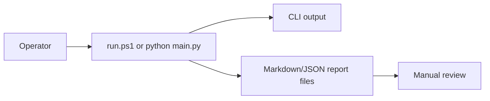

# UIUX

The current user experience is CLI plus Markdown/JSON reports. A browser dashboard is not implemented.

## Current User Flow

## Output Surfaces

| Surface | Current Status |
|---|---|
| CLI help | Available through `python main.py --help`. |
| Self-test output | Available through `.\run.ps1 self-test`. |
| Recommendation reports | Markdown and JSON files under `reports/`. |
| Browser dashboard | Not implemented in the unified folder. |
| Broker order screen | Not implemented and out of scope. |

The report files are the main review surface. They should stay readable without requiring a web app.
