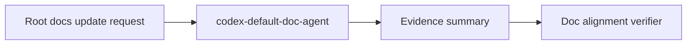

# Agent Codex-Default-Doc-Agent

## Codex Agent Documentation Update — 2026-05-28T20:44:00.663596+00:00

**Agent source:** `.codex/agents/<not-detected>`
**Detected name:** `codex-default-doc-agent`
**Source fingerprint:** `none`

### Responsibility

This agent participates in root documentation update orchestration. It must return summaries, changed-file evidence, and verification findings only.

### Mermaid lane graph

### Output contract

- Updated or reviewed file paths.
- Evidence from actual code/config/doc files.
- PASS/FAIL and unresolved risks.

## Hermes Agent Documentation Update — 2026-05-28T23:02:20.364421+00:00

**Agent source:** `docs\agents\codex-default-doc-agent.md`  
**Detected name:** `codex-default-doc-agent`  
**Source fingerprint:** `61c7fe164c58`

### Responsibility

This agent participates in root documentation update orchestration. It must return summaries, changed-file evidence, and verification findings only.

### Mermaid lane graph

### Output contract

- Updated or reviewed file paths.
- Evidence from actual code/config/doc files.
- PASS/FAIL and unresolved risks.

## Codex Agent Documentation Update — 2026-05-29T00:10:42.371181+00:00

**Agent source:** `docs\agents\codex-default-doc-agent.md`  
**Detected name:** `codex-default-doc-agent`  
**Source fingerprint:** `13bf0495a492`

### Responsibility

This agent participates in root documentation update orchestration. It must return summaries, changed-file evidence, and verification findings only.

### Mermaid lane graph

### Output contract

- Updated or reviewed file paths.
- Evidence from actual code/config/doc files.
- PASS/FAIL and unresolved risks.

## Codex Agent Documentation Update — 2026-05-29T00:39:13.408134+00:00

**Agent source:** `docs\agents\codex-default-doc-agent.md`  
**Detected name:** `codex-default-doc-agent`  
**Source fingerprint:** `73d7259ea32b`

### Responsibility

This agent participates in root documentation update orchestration. It must return summaries, changed-file evidence, and verification findings only.

### Mermaid lane graph

### Output contract

- Updated or reviewed file paths.
- Evidence from actual code/config/doc files.
- PASS/FAIL and unresolved risks.
