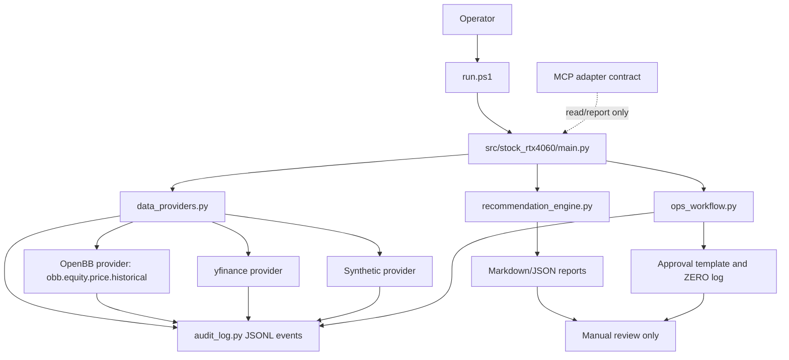

# MCP + OpenBB + Audit Log Phase 1 Plan

Date: 2026-05-02
Target folder: `C:\Users\jichu\Downloads\주식\stock_rtx4060_unified`
Status: Phase 1 implemented in the current codebase; verification evidence recorded under `reports/phase1_mcp_openbb_audit_implementation.md`

## Phase 1: Business Review

### 1.1 Problem Definition

Current state: `stock_rtx4060_unified` is a local, report-only CLI that uses `yfinance` or deterministic synthetic data, writes recommendation and Ops v1 review artifacts, and keeps broker execution out of scope.

Target state: add a first upgrade layer that can collect market data through an optional OpenBB-backed provider path, expose only a safe read/report MCP adapter contract, and write structured audit logs for every data source attempt and workflow decision.

Impact scope:

| Area | Current evidence | Expected impact |
|---|---|---|
| CLI commands | `recommend`, `ops-v1`, `predict`, `report`, `env`, `benchmark`, `journal`, `self-test` exist in `src/stock_rtx4060/main.py` | `recommend` and `ops-v1` gain safer data-source selection and audit evidence first |
| Data loading | `recommendation_engine.load_ohlcv()` currently uses `yfinance` or `--synthetic` | introduce provider abstraction without removing current fallback |
| Reports | `RecommendationEngine.write_reports()` and `ops_workflow.py` write Markdown/JSON/CSV artifacts | add audit log paths to generated summaries |
| Tests | `tests/test_core.py` covers core package, recommendation, and Ops v1 workflow | add deterministic tests for provider fallback and audit events |
| Safety boundary | current docs and outputs state `screening_output_only`, `manual_approval_required`, `broker_order_execution=False` | preserve this boundary; MCP must not enable broker write actions |

### 1.2 Proposed Options

| Option | Description | Effort (days) | Risk | Cost (AED) |
|---|---|---:|---|---|
| A | Minimal OpenBB adapter only. Add optional OpenBB loading behind a config path, keep reports mostly unchanged. | 2-3 | Low technical risk, but weak audit value | 0 repo cost; external data costs not assumed |
| B | Recommended and approved first upgrade. Add data provider abstraction, optional OpenBB provider, safe MCP adapter contract, and structured audit log emitted by `recommend` and `ops-v1`. | 5-7 | Medium, because provider errors and audit schema must not break existing CLI | 0 repo cost; external data costs not assumed |
| C | Broad agent/data platform. Add MCP server runtime, OpenBB, GraphRAG evidence store, and multi-agent orchestration together. | 10-15 | High blast radius and higher chance of breaking current stable CLI | 0 repo cost; external service costs not assumed |

### 1.3 Recommendation And Rationale

Approved option: Option B.

Reason:
1. It improves source provenance and auditability without changing the report-only safety boundary.
2. It keeps the current `yfinance` and `--synthetic` paths as fallback, so existing tests and offline validation can remain stable.
3. It prepares MCP integration as a safe adapter contract first, instead of exposing external tools before audit logging exists.

Rollback strategy: keep current `yfinance` and `--synthetic` behavior as fallback; if OpenBB or audit logging fails, return AMBER/RED data-state evidence rather than enabling a recommendation without provenance.

### 1.4 Approval Record

- [x] Phase 1 approval

Approved decisions:

| Decision | Approved value | Reason |
|---|---|---|
| OpenBB dependency mode | Optional | Offline `--synthetic` validation and current `yfinance` fallback must keep working without OpenBB. |
| MCP implementation mode | Adapter contract only in Phase 1 | No local MCP server is added until provider and audit logging behavior is stable. |
| First OpenBB endpoint | `obb.equity.price.historical(symbol=..., provider="yfinance")` | Official OpenBB docs describe this endpoint as historical OHLCV data for equities, including open, high, low, close, and volume. |
| Provider selection interface | Both CLI flag and config | Use `--data-provider synthetic|yfinance|openbb|auto`; optional config provides defaults; CLI overrides config. |
| Audit log format | JSONL primary, optional CSV summary | JSONL is append-friendly for event logs; CSV summary may be generated for report review but is not required for the first pass. |

Reference checked:

- OpenBB official docs: `https://docs.openbb.co/platform/reference/equity/price/historical`
- OpenBB quickstart example: `obb.equity.price.historical(symbol="AAPL", provider="yfinance").to_df()`

## Phase 2: Engineering Review

### 2.1 Mermaid Diagram



### 2.2 Planned File Changes

These implementation changes are now present in the current codebase.

| File | Change type | Description |
|---|---|---|
| `src/stock_rtx4060/data_providers.py` | create | Provider abstraction for `synthetic`, `yfinance`, `openbb`, and `auto`. |
| `src/stock_rtx4060/audit_log.py` | create | JSONL audit event writer, event schema, duration/status/error fields, and secret masking. |
| `src/stock_rtx4060/recommendation_engine.py` | modify | Replace direct `load_ohlcv()` logic with provider router while preserving current behavior. |
| `src/stock_rtx4060/ops_workflow.py` | modify | Include audit artifact paths in Ops v1 summary output. |
| `src/stock_rtx4060/main.py` | modify | Add `--data-provider` and optional `--provider-config` to `recommend` and `ops-v1`. |
| `tests/test_core.py` | modify | Keep current regression tests and add provider/audit workflow assertions. |
| `tests/test_data_providers.py` | create | Unit tests for provider selection, fallback, and OpenBB absence. |
| `tests/test_audit_log.py` | create | Unit tests for JSONL event serialization and secret masking. |
| `requirements-openbb.txt` | create | Optional OpenBB dependency file. Base `requirements.txt` remains unchanged unless separately approved. |
| `config/data_providers.example.json` | create | Example provider defaults with no secrets. |
| `docs/SPEC.md` | modify | Keep approved decisions and acceptance criteria aligned with implementation. |
| `docs/SETUP.md` | modify | Document optional OpenBB setup and provider selection. |
| `docs/SYSTEM_ARCHITECTURE.md` | modify | Document provider router, audit log, and MCP adapter contract after implementation. |
| `README.md` | modify | Add operator usage examples only after implementation exists. |
| `CHANGELOG.md` | modify | Add Phase 1 implementation notes after code changes are verified. |

Implementation evidence:

- `src/stock_rtx4060/data_providers.py`
- `src/stock_rtx4060/audit_log.py`
- `src/stock_rtx4060/mcp_adapter.py`
- `tests/test_audit_log.py`
- `tests/test_data_providers.py`
- `tests/test_mcp_adapter.py`
- `requirements-openbb.txt`
- `config/data_providers.example.json`

Post-implementation verification:

- `.venv\Scripts\python.exe -m pytest -q -p no:cacheprovider` passed with 15 tests after OHLCV cache coverage.
- `reports/recommendations_openbb_cache_smoke/audit_log.jsonl` contains 1 successful OpenBB provider event for AAPL.

### 2.3 Dependency And Execution Order

1. Create `audit_log.py` first.
2. Create `data_providers.py` with synthetic and yfinance behavior matching current runtime.
3. Add tests for provider selection and audit event writing.
4. Wire provider router into `recommendation_engine.py`.
5. Wire audit artifact paths into `ops_workflow.py`.
6. Add CLI flags to `src/stock_rtx4060/main.py`.
7. Add optional OpenBB provider path guarded by import availability.
8. Add optional dependency documentation and `requirements-openbb.txt`.
9. Patch docs after implementation and tests.

Parallel lanes:

| Lane | Scope | Can run in parallel? |
|---|---|---|
| A | `audit_log.py` and `tests/test_audit_log.py` | Yes, independent of provider adapter. |
| B | `data_providers.py` and provider tests | Yes, after audit schema is agreed. |
| C | Docs update | Partially; final docs must wait for code paths. |
| D | CLI and workflow integration | No; depends on provider router and audit writer. |

### 2.4 Test Strategy

Unit tests:

- `audit_log.py`: event schema, JSONL writing, secret masking, no plaintext fake secrets.
- `data_providers.py`: provider parsing, default provider, CLI override over config, OpenBB missing fallback.
- OpenBB adapter: mocked `obb.equity.price.historical(...).to_df()` response, no real network required.

Integration tests:

- `RecommendationEngine` with `synthetic` provider writes recommendation report and audit JSONL.
- `ops-v1` workflow writes recommendation, daily brief, approval template, ZERO log, summary JSON, and audit JSONL.
- OpenBB absence does not break `--synthetic`.

Regression checks:

```powershell
python main.py --help
python -m compileall main.py src tests
.\.venv\Scripts\python.exe -m pytest -q
.\run.ps1 recommend --synthetic --universe "SYNTH-A,SYNTH-B" --top 2 --model-kind logistic --cv-gap 5 --output-dir reports/recommendations_phase1_smoke
.\run.ps1 ops-v1 --synthetic --universe "SYNTH-A,SYNTH-B" --top 2 --model-kind logistic --cv-gap 5 --output-dir reports/ops_v1_phase1_smoke
```

### 2.5 Risks And Mitigations

| Risk | Impact | Mitigation |
|---|---|---|
| OpenBB import changes or unavailable package | Breaks provider path | Keep OpenBB optional and test absence path. |
| Provider output schema mismatch | OHLCV normalization failure | Normalize into existing `Open`, `High`, `Low`, `Close`, `Volume` frame contract. |
| Audit logs leak secrets | Security issue | Central masking helper and fake-secret tests. |
| MCP scope drift | Tooling could look like trading automation | Phase 1 is adapter contract only; no MCP server or broker tools. |
| CLI compatibility break | Existing operator commands fail | Preserve defaults and run existing smoke tests. |
| Pytest temp permissions on Windows | Incomplete regression evidence | Use a verified writable temp path or document environment failure separately. |

## Coordinator Input Packet

### Objective

Implement the first upgrade slice for `stock_rtx4060_unified`: OpenBB-ready data provider abstraction, MCP-safe read/report adapter contract, and structured audit logs for recommendation workflows.

### Non-Negotiables

| Rule | Requirement |
|---|---|
| Report-only boundary | No broker API, no order execution, no auto-buy, no margin/options enablement |
| Existing CLI preservation | `.\run.ps1 self-test`, `python main.py --help`, and existing `recommend` / `ops-v1` commands must remain usable |
| Offline validation | `--synthetic` must continue to work without internet or OpenBB |
| Secret safety | API keys, tokens, account IDs, and `.env` values must not be printed into audit logs |
| Auditability | Every provider attempt must record source, status, timestamp, ticker, command, and failure reason when available |
| Failure mode | Missing provider data must become AMBER/RED evidence, not silent success |

### Acceptance Criteria

| No | Acceptance criterion |
|---:|---|
| 1 | Existing tests still pass after the change |
| 2 | `recommend --synthetic` still produces deterministic reports |
| 3 | `ops-v1 --synthetic` still produces recommendation, daily brief, approval template, ZERO log, and summary JSON |
| 4 | A new audit JSONL artifact is generated for `recommend` and `ops-v1` runs |
| 5 | Audit output masks secrets and does not contain broker/account credentials |
| 6 | OpenBB absence does not break default synthetic validation |
| 7 | Documentation explains that MCP is read/report-only adapter contract in this phase |

### Required Evidence

| Evidence | Path or command |
|---|---|
| Help output | `python main.py --help` |
| Compile check | `python -m compileall main.py src tests` |
| Regression tests | `.\.venv\Scripts\python.exe -m pytest -q` |
| Synthetic recommendation smoke | `.\run.ps1 recommend --synthetic --universe "SYNTH-A,SYNTH-B" --top 2 --model-kind logistic --cv-gap 5 --output-dir reports/recommendations_phase1_smoke` |
| Ops v1 smoke | `.\run.ps1 ops-v1 --synthetic --universe "SYNTH-A,SYNTH-B" --top 2 --model-kind logistic --cv-gap 5 --output-dir reports/ops_v1_phase1_smoke` |
| Audit artifact review | Verify generated audit JSONL exists and contains no secrets |
