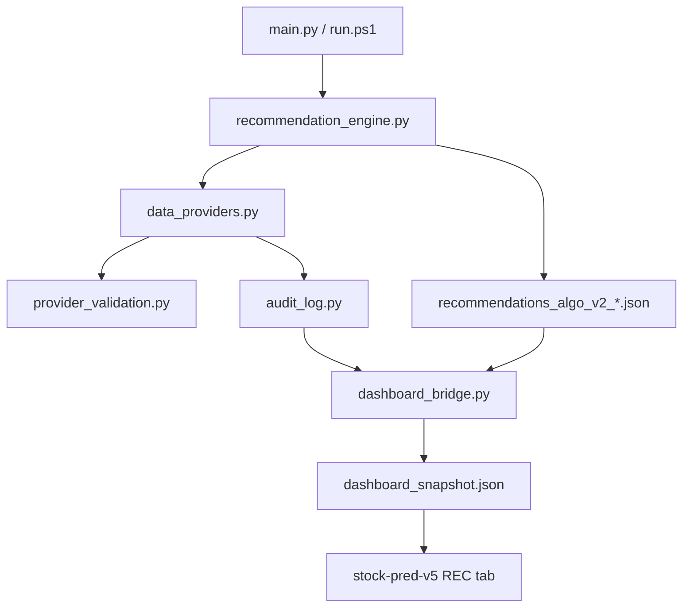
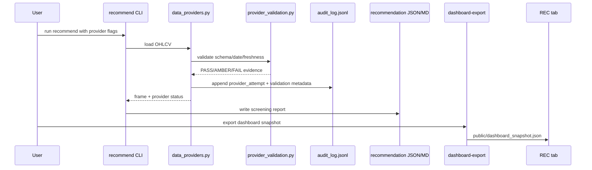

# Phase A Implementation Plan — Point-in-time Data Gate + Provider v2 Dashboard

Date: 2026-05-03

Target folder: `C:\Users\jichu\Downloads\주식\stock_rtx4060_unified`

Status: Approved for Phase A implementation on 2026-05-03.

Source baseline:

| Area | Verified file |
|---|---|
| CLI entrypoint | `main.py`, `src/stock_rtx4060/main.py` |
| Provider router | `src/stock_rtx4060/data_providers.py` |
| Audit log | `src/stock_rtx4060/audit_log.py` |
| Recommendation engine | `src/stock_rtx4060/recommendation_engine.py` |
| Dashboard bridge | `src/stock_rtx4060/dashboard_bridge.py` |
| Provider tests | `tests/test_data_providers.py` |
| Dashboard bridge tests | `tests/test_dashboard_bridge.py` |
| Existing Phase 1 spec | `docs/SPEC.md`, `docs/SPEC_REAL_DATA_OPS_UPGRADE_2026-05-03.md` |

## Overview

Purpose: add a Phase A implementation plan for point-in-time data validation and provider status dashboard evidence while keeping the system report-only and preserving the existing synthetic, yfinance, OpenBB, PyKRX, FDR, audit JSONL, and `dashboard-export` workflows.

## Goals

| ID | Goal | Why it matters |
|---|---|---|
| G-001 | Add a point-in-time data validation gate before model scoring. | The recommendation report should show whether the OHLCV frame is usable for the requested as-of context. |
| G-002 | Extend provider metadata into a v2 provider status contract. | The operator should see provider used, endpoint, freshness, fallback, row count, date range, and validation status. |
| G-003 | Export provider status into the dashboard snapshot. | The REC dashboard should show data-provider health without reading raw logs manually. |
| G-004 | Preserve current report-only boundary. | No broker execution, account write, or personalized advice should be introduced. |
| G-005 | Keep OpenBB optional and synthetic validation offline. | Existing smoke tests must not require internet or OpenBB installation. |

## Scope

### In Scope

| Area | Included work |
|---|---|
| Data validation gate | Add point-in-time checks for index/date order, last bar date, rows, OHLCV schema, nulls, duplicate dates, and future-dated rows. |
| Provider metadata | Extend `ProviderResult.metadata` usage with row count, first date, last date, source timestamp when available, freshness status, and fallback reason. |
| Audit events | Add provider validation status fields to existing JSONL audit events without exposing secrets. |
| Recommendation output | Add provider validation evidence to result reasons, validations, or top-level JSON metadata. |
| Dashboard snapshot | Add provider summary fields to `dashboard_snapshot.v1` or a compatible additive section. |
| Dashboard public export | Keep exporting `dashboard_snapshot.json`, `audit_log.jsonl`, and optional `approval_journal_template.csv`; include provider summary in the snapshot. |
| Tests | Add unit tests for point-in-time validation, provider metadata normalization, dashboard snapshot fields, and current regression commands. |
| Documentation | Patch README, CHANGELOG, SYSTEM_ARCHITECTURE, LAYOUT, SETUP, and relevant dashboard docs after implementation. |

### Out of Scope

| Area | Excluded work |
|---|---|
| Broker integration | No order placement, no auto-buy, no auto-sell, no broker API. |
| Paid data credentials | No paid provider keys or private URLs are added. |
| New MCP server runtime | Current MCP work remains adapter/read-report only unless separately approved. |
| Dashboard trading controls | No order button, broker button, margin/options control, or execution workflow. |
| TimesFM, Qlib, RD-Agent | Research sandbox ideas remain outside Phase A. |
| TensorFlow/LSTM production path | TensorFlow GPU remains separate from this data/provider dashboard phase. |

## Constraints

| Constraint | Source / reason |
|---|---|
| Existing CLI commands must remain available. | `README.md` and `docs/SPEC.md` list `recommend`, `ops-v1`, `dashboard-export`, `env`, `benchmark`, `journal`, `self-test`. |
| `screening_output_only=True` must remain in recommendation and dashboard outputs. | `RecommendationResult` and `dashboard_bridge.py` enforce this boundary. |
| OpenBB must remain optional. | `requirements-openbb.txt` exists separately from base `requirements.txt`. |
| Synthetic provider must remain deterministic and offline. | `data_providers.py` and tests cover synthetic provider behavior. |
| Audit logs must mask secrets. | `audit_log.py` and `tests/test_audit_log.py` cover masking. |
| AMBER-first freshness behavior is approved for Phase A. | Provider-specific threshold refinement remains a future follow-up. |
| 가정: Dashboard v2 fields should be additive to `dashboard_snapshot.v1`, not a breaking schema rename. | Current dashboard tests and REC workflow depend on `dashboard_snapshot.v1`. |

## Phase 1 — Business Review

### 1.1 Problem Definition

Current state: provider calls are auditable, but the recommendation report and dashboard do not yet show a dedicated point-in-time data-quality gate for each provider load.

Target state: every recommendation run records whether the provider data was valid for the requested run context, and the REC dashboard shows provider health in one screen.

### 1.2 Implementation Options

| Option | Description | Effort | Risk | Cost |
|---|---|---:|---|---:|
| A | Add a small validation helper inside `data_providers.py` and pass metadata through existing outputs. | Low | Validation logic may become crowded in one module. | AED 0 |
| B | Create `src/stock_rtx4060/provider_validation.py` and keep provider routing separate from point-in-time checks. | Medium | Requires more wiring, but isolates the gate. | AED 0 |
| C | Add full provider health store and dashboard state file. | High | Adds storage scope not yet approved. | AED 0 |

### 1.3 Recommendation

Recommended option: Option B.

Reason: `data_providers.py` already routes six provider names and writes audit events. A separate `provider_validation.py` keeps point-in-time checks testable without turning the provider router into a large policy module.

Rollback strategy: keep provider validation additive; if validation fails unexpectedly, return AMBER/RED evidence without removing existing provider loading behavior.

### 1.4 Approval Request

- [x] Phase A Option B approved for implementation

## Phase 2 — Engineering Review

### 2.1 Component Diagram

### 2.2 Runtime Flow

### 2.3 Planned File Changes

| File | Change type | Plan |
|---|---|---|
| `src/stock_rtx4060/provider_validation.py` | create | Add point-in-time OHLCV validation contract and result dataclass. |
| `src/stock_rtx4060/data_providers.py` | modify | Call provider validation after normalization; attach metadata to `ProviderResult` and audit events. |
| `src/stock_rtx4060/recommendation_engine.py` | modify | Preserve provider validation evidence in reasons, validations, or top-level JSON metadata without changing ranking rules prematurely. |
| `src/stock_rtx4060/dashboard_bridge.py` | modify | Add provider summary section to `dashboard_snapshot.v1` as additive fields. |
| `src/stock_rtx4060/main.py` | modify if needed | Add optional CLI flags only if validation thresholds need operator control. |
| `tests/test_provider_validation.py` | create | Test PASS/AMBER/FAIL cases for schema, nulls, duplicate dates, future rows, stale data, and row count. |
| `tests/test_data_providers.py` | modify | Assert provider audit events include validation metadata while OpenBB remains optional. |
| `tests/test_dashboard_bridge.py` | modify | Assert dashboard snapshot includes provider status and keeps `screening_output_only`. |
| `README.md` | modify after code | Document provider v2 dashboard workflow and smoke command. |
| `CHANGELOG.md` | modify after code | Add Phase A implementation and verification evidence. |
| `docs/SYSTEM_ARCHITECTURE.md` | modify after code | Add provider validation gate to diagrams and component table. |
| `docs/LAYOUT.md` | modify after code | Add new provider validation module and tests. |
| `docs/SETUP.md` | modify after code | Add smoke command and optional provider notes if needed. |

### 2.4 Proposed Validation Contract

| Field | Meaning | Source |
|---|---|---|
| `status` | `PASS`, `AMBER`, or `FAIL` for the provider-loaded frame. | New provider validation result. |
| `row_count` | Number of OHLCV rows after normalization. | `len(frame)`. |
| `first_date` | First index date if date index exists. | Normalized OHLCV index. |
| `last_date` | Last index date if date index exists. | Normalized OHLCV index. |
| `future_rows` | Count of rows dated after the run timestamp. | Derived check. |
| `duplicate_dates` | Count of duplicated date index entries. | Derived check. |
| `missing_ohlcv_columns` | Missing required OHLCV columns. | Existing normalized frame contract. |
| `null_critical_values` | Null count in required OHLCV fields. | Derived check. |
| `freshness_days` | Days between run date and last OHLCV row. | Derived check. |
| `fallback_reason` | Provider fallback reason if present. | Existing `ProviderResult.fallback_reason`. |

가정: initial freshness threshold should default to AMBER instead of FAIL for synthetic data, because synthetic data is an offline validation path.

### 2.5 Dependency and Order

| Step | Depends on | Can run in parallel |
|---:|---|---|
| 1. Add `provider_validation.py` tests and contract. | Approval of this plan. | Yes, independent of dashboard UI. |
| 2. Wire validation into `data_providers.py`. | Step 1 contract. | No, provider result shape is shared. |
| 3. Add audit metadata tests. | Step 2. | Yes with report wiring tests after contract is fixed. |
| 4. Add recommendation JSON provider status evidence. | Step 2. | Yes with dashboard bridge work. |
| 5. Add dashboard snapshot provider summary. | Step 4 payload shape. | No, depends on report payload. |
| 6. Patch docs. | Code and tests. | Yes, after file paths and commands are final. |
| 7. Run 3-round review. | All implementation changes. | Yes, doc/code/test review can be batched. |

### 2.6 Test Strategy

| Test level | Command or test | Required result |
|---|---|---|
| Unit | `pytest tests/test_provider_validation.py -q` | Provider validation PASS/AMBER/FAIL behavior is deterministic. |
| Unit | `pytest tests/test_data_providers.py -q` | Synthetic/yfinance/OpenBB mocked provider paths keep audit metadata and optional OpenBB behavior. |
| Unit | `pytest tests/test_dashboard_bridge.py -q` | Snapshot keeps report-only schema and adds provider summary. |
| Regression | `python -m compileall main.py src tests` | Package compiles. |
| Regression | `python main.py --help` | CLI remains available. |
| Regression | `pytest -q` | Existing tests and new tests pass. |
| Smoke | `.\run.ps1 recommend --synthetic --universe "SYNTH-A,SYNTH-B" --top 2 --model-kind logistic --cv-gap 5 --output-dir reports/phase_a_provider_v2_smoke` | Markdown, JSON, audit JSONL, provider validation evidence are generated. |
| Smoke | `.\run.ps1 dashboard-export --recommendation-json reports/phase_a_provider_v2_smoke/recommendations_algo_v2_YYYYMMDD_HHMMSS.json --output reports/phase_a_provider_v2_smoke/dashboard_snapshot.json --public-dir ..\stock-pred-v5\public` | Public dashboard snapshot includes provider status. |
| UI smoke | `cd ..\stock-pred-v5; npx playwright test tests/kevpe-dashboard.spec.js --reporter=line` | Existing REC dashboard test still passes. |

## Tasks

| ID | Task | Output |
|---|---|---|
| T-001 | Confirm baseline `recommend`, provider, audit, and dashboard bridge behavior. | Short verification note in implementation report. |
| T-002 | Create point-in-time provider validation contract. | `src/stock_rtx4060/provider_validation.py`. |
| T-003 | Add validation unit tests. | `tests/test_provider_validation.py`. |
| T-004 | Wire validation into provider loads after OHLCV normalization. | Patched `data_providers.py`. |
| T-005 | Add provider validation metadata to audit JSONL. | Updated audit event metadata assertions. |
| T-006 | Persist provider status into recommendation JSON. | Patched `recommendation_engine.py`. |
| T-007 | Export provider summary to dashboard snapshot. | Patched `dashboard_bridge.py`. |
| T-008 | Confirm dashboard REC panel can read the additive provider fields. | Dashboard test or source check. |
| T-009 | Update docs after implementation. | README, CHANGELOG, architecture, layout, setup docs. |
| T-010 | Run 3 review rounds. | File consistency, execution consistency, documentation consistency evidence. |

## Risks

| Risk | Impact | Mitigation |
|---|---|---|
| Provider-specific freshness thresholds may need refinement | Gate could treat different markets with the same default threshold. | Use Phase A AMBER-first behavior now and refine thresholds later if needed. |
| Provider metadata differs by source | OpenBB, yfinance, PyKRX, FDR may expose different timestamps. | Normalize only common fields and keep provider-specific metadata optional. |
| Dashboard schema drift | REC tab could fail if required fields change. | Add fields only; do not rename `dashboard_snapshot.v1` or existing keys. |
| Audit log grows too verbose | Operator may lose important provider status in noise. | Keep summary fields compact and dashboard-readable. |
| Synthetic data freshness | Synthetic last date may not represent real market freshness. | Mark synthetic as offline validation data, not real provider freshness. |
| False confidence | Provider PASS does not mean recommendation is safe to trade. | Preserve `screening_output_only` and manual approval text. |

## Review Criteria

| Round | Scope | Required result |
|---:|---|---|
| 1 | Coverage check | Every new planned module, CLI behavior, report field, and dashboard field has a test or smoke command. |
| 2 | Consistency check | Provider status names match across code, audit JSONL, recommendation JSON, dashboard snapshot, README, and architecture docs. |
| 3 | Risk and hallucination check | No unimplemented provider, broker function, credential, paid data source, or execution workflow is documented as available. |

## Deliverables

| Deliverable | Path |
|---|---|
| Plan document | `docs/plan_phase_a_point_in_time_provider_v2_dashboard_2026-05-03.md` |
| Future implementation report | `reports/phase_a_point_in_time_provider_v2_implementation.md` |
| Future smoke output | `reports/phase_a_provider_v2_smoke/` |
| Future dashboard public export evidence | `reports/phase_a_provider_v2_smoke/dashboard_snapshot.json` and `..\stock-pred-v5\public\dashboard_snapshot.json` |

## Approval Readiness

Status: approved and implemented for Phase A; verification evidence is recorded in the current Codex session output.

Required approval before coding:

- [x] Approve Option B: create `provider_validation.py` and wire it through providers, audit, recommendation JSON, and dashboard snapshot.
- [x] Approve AMBER-first freshness behavior for unapproved thresholds.
- [x] Approve additive dashboard fields under existing `dashboard_snapshot.v1` rather than creating a breaking `v2` schema.
