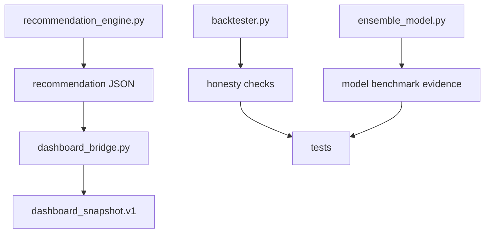

# Phase B Plan - Backtest Honesty Suite + Risk-adjusted Model Benchmark

Status: Approved and implemented for Phase B Option B.

Date: 2026-05-03

Owner: Codex planning pass using `mstack-plan`.

## Phase 1 - Business Review

### 1.1 Problem Definition

Current state: Phase A already adds point-in-time provider validation and Provider v2 dashboard evidence.

Target state: Phase B should make model and backtest results harder to over-trust by adding honesty checks before a model or strategy is described as strong.

Impact scope:

| Area | Current behavior | Phase B target |
|---|---|---|
| Backtest output | Reports return performance fields such as return, Sharpe, Sortino, MDD, and profit factor. | Add explicit honesty checks for leakage, overfit risk, transaction-cost buffer, and robustness evidence. |
| Model comparison | Existing model choices include logistic, XGBoost, RandomForest, and auto fallback. | Compare models with risk-adjusted metrics, not only direction probability or accuracy. |
| Recommendation boundary | Output remains `screening_output_only`. | Preserve report-only boundary and add stronger warnings when benchmark evidence is weak. |
| Dashboard | Provider summary is visible through `dashboard_snapshot.v1`. | Add benchmark honesty summary only as additive dashboard evidence. |

### 1.2 Options

| Option | Description | Effort (days) | Risk | Cost (AED) |
|---|---|---:|---|---:|
| A | Documentation-only Phase B plan. Describe honesty metrics and dashboard fields, but do not implement. | 0.5 | Low, but no runtime protection. | 0 |
| B | Minimal honesty gate. Add deterministic checks for transaction-cost buffer, MDD threshold, Sharpe floor, OOF coverage, and walk-forward gap evidence. | 2-3 | Medium. Touches recommendation and report contracts. | 0 |
| C | Full benchmark harness. Add model comparison runner for logistic, XGBoost, RandomForest, optional LSTM/TimesFM sandbox, cost buffer, robustness seeds, and dashboard comparison output. | 5-8 | High. Larger runtime, dependencies, and report surface. | 0 plus optional external provider/model cost |

### 1.3 Recommendation

Recommended option: Option B.

Reason:

1. It improves real decision safety without adding broker execution or heavy new dependencies.
2. It builds directly on existing fields: OOF coverage, Sharpe, MDD, model metrics, risk plan, and dashboard export.
3. It keeps TimesFM, Qlib, RD-Agent, and LSTM as later sandbox work instead of mixing research experiments into the core path.

Rollback strategy: keep all Phase B fields additive; if a new honesty check is unstable, mark it `AMBER` and keep existing recommendation output valid.

### 1.4 Approval Request

- [x] Phase 1 approval: proceed with Phase B Option B.

## Coordinator Input Packet

| Field | Content |
|---|---|
| objective | Add a report-only Backtest Honesty Suite and risk-adjusted model benchmark evidence to reduce overfit, leakage, and false-confidence risk. |
| non-negotiables | No broker execution, no auto-buy/sell, no credential handling, no claim that backtest honesty means a ticker is safe to buy. |
| acceptance criteria | Existing CLI commands remain available; `pytest -q` passes; synthetic smoke generates Markdown, JSON, audit JSONL, and benchmark honesty evidence; dashboard snapshot remains backward-compatible. |
| option set | A documentation-only, B minimal honesty gate, C full benchmark harness. |
| required evidence | Unit tests for honesty checks, regression test for recommendation JSON, smoke report showing honesty summary, dashboard export check. |
| test expectations | `python -m compileall main.py src tests`, `python main.py --help`, `pytest -q`, synthetic `recommend` smoke, `dashboard-export` smoke. |

## Phase 2 Preview - Engineering Review

Phase 2 is approved and implemented for Option B.

Likely file changes after approval:

| File | Change type | Purpose |
|---|---|---|
| `src/stock_rtx4060/backtest_honesty.py` | create | Add deterministic honesty checks. |
| `src/stock_rtx4060/recommendation_engine.py` | modify | Attach candidate-level `backtest_honesty` and top-level `backtest_honesty_summary` without changing ranking keys. |
| `src/stock_rtx4060/dashboard_bridge.py` | modify | Preserve additive `backtest_honesty_summary` in `dashboard_snapshot.v1`. |
| `tests/test_backtest_honesty.py` | create | Unit-test PASS/AMBER/FAIL honesty outcomes. |
| `tests/test_dashboard_bridge.py` | modify | Confirm backward compatibility and additive dashboard field. |
| `README.md`, `CHANGELOG.md`, `docs/SYSTEM_ARCHITECTURE.md`, `docs/LAYOUT.md`, `docs/SETUP.md` | modify | Document verified commands and report-only limits after implementation. |

## Risks

| Risk | Impact | Mitigation |
|---|---|---|
| Over-strict thresholds | Useful candidates may be marked too cautious. | Start with evidence-only AMBER behavior and document thresholds. |
| Backtest metric overconfidence | Users may treat improved benchmark fields as buy signals. | Preserve `screening_output_only` and manual approval wording. |
| Runtime cost | More benchmark checks may slow `recommend`. | Keep Phase B Option B deterministic and lightweight. |
| Dashboard schema drift | REC tab may break if existing keys are renamed. | Add fields only; do not rename `dashboard_snapshot.v1` keys. |

## Decision

Phase B Option B was approved by the operator and implemented with additive evidence-only fields.

Approved open-question resolutions:

| Open question | Approved resolution |
|---|---|
| Threshold source | Use existing `RecommendationConfig` thresholds where available and add lightweight configurable defaults for Phase B. |
| Evidence location | Store both candidate-level `backtest_honesty` and top-level `backtest_honesty_summary`. |
| Transaction-cost buffer | Use a fixed configurable default `transaction_cost_buffer_pct=0.50` for Phase B. |
| Audit JSONL | Add `backtest_honesty_summary` event after report writing. |
