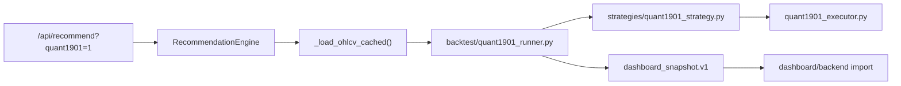

# Quant1901 Integration Design

Date: 2026-05-31
Target: `C:\Users\jichu\Downloads\주식\stock_1901`
Status: Design updated against current local implementation; standalone runner/CLI verified, RecommendationEngine passthrough still pending

## Verdict

Quant1901은 기존 `stock_rtx4060` 추천 시스템을 대체하지 않는다.
기존 엔진 위에 선택형 보조 검증 레이어로 병합한다.
기본값은 OFF이며, 실행해도 report-only와 paper/backtest-only 경계를 유지한다.

최신 병합 방향은 `Strategy C — Backtest Plugin (P5)`를 우선하고, `Strategy A — Thin Wrapper Import`를 보조 안전 래퍼로 결합하는 것이다.
`Strategy B — Factor Zoo`는 PIT/as_of, HTF warmup, factor category 이슈가 해결될 때까지 후순위로 둔다.

## Goal

`quant1901_executable_bundle`의 실행 가능한 검증 기능을 기존 시스템에 흡수한다.
사용자는 기존 `/api/recommend`와 CLI 흐름에서 Quant1901 보조 백테스트를 명시적으로 켤 수 있어야 한다.
Quant1901 결과는 추천 승격 근거가 아니라 추가 검증 증거로만 사용한다.

## Current Evidence

현재 번들은 아래 파일로 구성되어 있다.

- `quant1901_executor.py`
- `README_QUANT1901.md`
- `tests/test_quant1901_executor.py`
- `run_quant1901.ps1`, `.cmd`, `.bat`, `.sh`
- `quant1901_executor.pyz`

확인된 핵심 기능은 다음과 같다.

- OHLCV 정규화
- EMA, RSI, 변동성 z-score 기반 신호 생성
- closed-bar higher-timeframe 정렬
- raw signal을 한 봉 늦게 실행하는 look-ahead 방지
- drawdown, daily loss, rolling VaR 기반 risk halt
- summary JSON, equity curve CSV, simulated orders CSV 출력
- synthetic data 기반 오프라인 smoke 검증

현재 세션 검증 결과:

```powershell
.\.venv\Scripts\python.exe -m py_compile quant1901_executable_bundle\quant1901_executor.py
.\.venv\Scripts\python.exe -m pytest -q quant1901_executable_bundle\tests\test_quant1901_executor.py
```

결과: `4 passed`, py_compile 통과.

추가로 현재 로컬 작업트리에서 아래 통합 시도 파일을 확인했다.

- `src/stock_rtx4060/backtest/quant1901_runner.py`
- `src/stock_rtx4060/strategies/quant1901_strategy.py`
- `src/stock_rtx4060/factors/quant1901_trend_factor.py`

현재 세션 직접 확인 결과:

- 세 파일의 `py_compile`은 통과했다.
- `PYTHONPATH=src` 기준 `Quant1901Runner` import는 통과했다.
- `quant1901_runner.py`는 현재 bundle 경로를 `Path(__file__).parents[3] / "quant1901_executable_bundle"`로 계산한다.
- `optimize=True` 경로는 현재 번들의 `optimize_parameters()`를 사용한다.
- `tests/test_quant1901_runner.py`는 12개 테스트를 통과했다.
- `tests/test_dashboard_safety_gate.js`는 11개 테스트를 통과했다.
- runner, dashboard bridge, backtester sizing, main extra 묶음은 96개 pytest를 통과했다.

현재 로컬 구현 범위:

- 완료됨: P5 단독 `Quant1901Runner`, A안 thin wrapper, standalone CLI `quant1901-backtest`, P5 runner 테스트.
- 아직 남음: 기존 `RecommendationEngine` 결과에 `quant1901` additive field를 붙이는 작업, dashboard bridge passthrough, `/api/recommend` 또는 대시보드 API 경유 파라미터 연결, README/dashboard guide의 "계획됨" 문구 정정.

## Architecture

### Recommended Approach: Strategy C + A

우선 구현 경로는 `Strategy C — Backtest Plugin (P5)`다.
`src/stock_rtx4060/backtest/quant1901_runner.py`가 Quant1901 실행 결과를 `dashboard_snapshot.v1` 호환 payload로 변환한다.
기존 `RecommendationEngine`, `Backtester`, `dashboard_snapshot.v1` 계약은 유지한다.
Quant1901은 선택 실행되는 보조 검증 모듈로만 동작한다.

`Strategy A — Thin Wrapper Import`는 C 러너 내부에서 방어 레이어로 사용한다.
번들 import 경로, paper-only guard, OHLCV column normalization을 한 곳에서 고정한다.

권장 모듈 경계:

| 모듈 | 역할 |
|---|---|
| `src/stock_rtx4060/backtest/quant1901_runner.py` | P5 backtest plugin, policy verdict, `dashboard_snapshot.v1` 변환 |
| `src/stock_rtx4060/strategies/quant1901_strategy.py` | A안 thin wrapper, bundle import guard, OHLCV normalization |
| `src/stock_rtx4060/factors/quant1901_trend_factor.py` | B안 후보. 현재는 후순위이며 블로커 해소 전 promotion 금지 |
| `quant1901_executable_bundle/quant1901_executor.py` | 원본 실행 로직. 현 단계에서는 복사보다 wrapper로 사용 |

## Data Flow



현재 실행 가능한 standalone CLI 흐름:

```powershell
python -m stock_rtx4060.main quant1901-backtest --synthetic --rows 360 --seed 1901 --ticker SYNTH1901 --optimize
python -m stock_rtx4060.main quant1901-backtest --ticker 005930.KS --period 2y --optimize
python -m stock_rtx4060.main quant1901-backtest --csv data.csv --ticker 005930 --optimize
```

향후 기존 추천 흐름에 붙일 CLI 옵션:

```powershell
.\run.ps1 recommend --synthetic --universe "SYNTH-A,SYNTH-B" --top 2 --quant1901 --quant1901-optimize
```

## API Contract

기존 추천 API 또는 대시보드 API 경유 추천 실행에 선택 파라미터를 추가한다.

| 파라미터 | 값 | 기본값 | 의미 |
|---|---|---|---|
| `quant1901` | `0` 또는 `1` | `0` | Quant1901 보조 검증 실행 여부 |
| `quant1901_optimize` | `0` 또는 `1` | `0` | EMA fast/slow grid search 실행 여부 |

HTTP API가 있는 경로에서는 유효하지 않은 값을 400 응답으로 처리한다.
CLI 경로에서는 argparse validation 또는 명확한 error exit로 처리한다.
미지정 또는 `0`이면 기존 응답과 호환되어야 한다.

## Result Contract

Recommendation Engine 연동 시에는 `RecommendationResult.to_dict()` 결과에 additive field를 추가한다.
P5 plugin 단독 실행 시에는 `quant1901_runner.py`가 직접 `dashboard_snapshot.v1` payload를 반환한다.

```json
{
  "quant1901": {
    "status": "SKIPPED",
    "metrics": null,
    "output_paths": {},
    "error": null,
    "execution_guard": {
      "live_orders_enabled": false,
      "broker_adapter": "disabled"
    }
  }
}
```

상태값:

| status | 의미 |
|---|---|
| `SKIPPED` | 기본 OFF 또는 데이터 조건 미충족으로 실행하지 않음 |
| `OK` | 보조 검증 실행 완료 |
| `ERROR` | Quant1901 실행 실패. 추천 엔진 전체 실패로 승격하지 않음 |

`metrics`는 summary JSON의 핵심 수치를 담는다.
`output_paths`는 summary, equity curve, orders, optimization 경로를 담는다.
`orders`는 항상 simulated/paper-only 기록으로만 해석한다.

P5 plugin 단독 snapshot은 아래 policy block을 포함한다.

```json
{
  "schema_version": "dashboard_snapshot.v1",
  "source": "quant1901_runner",
  "mode": "report_only",
  "results": [{
    "track": "quant1901",
    "execution_controls": {
      "live_trading_allowed": false,
      "broker_execution_allowed": false,
      "mode": "paper_backtest_only"
    },
    "policy_verdicts": {
      "C_fast": "CONDITIONAL_PASS_PAPER_TRADING_CANDIDATE"
    },
    "screening_output_only": true
  }]
}
```

## Dashboard Contract

`dashboard_snapshot.v1` schema version은 유지한다.
Recommendation Engine 경유 시에는 `results[].quant1901`만 additive field로 통과시킨다.
P5 plugin 단독 snapshot은 `source="quant1901_runner"`와 `track="quant1901"`로 식별한다.

프론트엔드는 이 필드가 없거나 `status="SKIPPED"`이면 기존 UI를 그대로 표시한다.
표시가 필요하면 “Quant1901 보조 검증” 또는 “paper/backtest-only evidence”로 보여준다.
추천 승격, 투자 가능, 실거래 가능 같은 의미로 표시하지 않는다.

## Output Policy

기본 출력 위치:

```text
reports/quant1901/
```

API 또는 추천 실행에서 `output_dir`이 지정된 경우:

```text
<output_dir>/quant1901/<ticker>/<track>/
```

생성 파일:

| 파일 | 의미 |
|---|---|
| `quant1901_summary.json` | 핵심 metric과 execution guard |
| `quant1901_equity_curve.csv` | OHLCV, raw_signal, position, strategy_return, equity, drawdown, risk_halt |
| `quant1901_orders.csv` | simulated order ledger |
| `quant1901_optimization.csv` | optional EMA grid search 결과 |

## Safety Contract

아래 조건은 구현 후 반드시 유지한다.

- `screening_output_only=true`
- `new_capital_allowed=false`
- `broker_order_execution=false`
- `live_orders_enabled=false`
- `broker_adapter="disabled"`
- Quant1901 orders는 broker order가 아니다.
- Quant1901 실패는 추천 결과 전체를 실패시키지 않는다.
- Quant1901 결과는 RED/AMBER를 GREEN으로 승격하지 않는다.

## Implementation Tasks

완료된 작업:

1. `quant1901_runner.py`의 bundle path를 repo root 기준 `parents[3]`로 수정했다.
2. `optimize=True` 경로는 번들의 `optimize_parameters()`를 사용하도록 수정했다.
3. `Quant1901Runner.run(... optimize=False)` synthetic smoke를 테스트로 검증했다.
4. `Quant1901Runner.run(... optimize=True)` synthetic smoke를 테스트로 검증했다.
5. standalone CLI `python -m stock_rtx4060.main quant1901-backtest`를 추가했다.
6. `tests/test_quant1901_runner.py`에 12개 안전/계약 테스트를 추가했다.

남은 병합 작업:

1. 005930.KS 실데이터 경로를 실행 검증한다. `load_ohlcv_with_provider()` 호출 시 현재 함수 시그니처에 맞는 `period` 또는 provider 옵션을 사용한다.
2. P5 plugin 단독 snapshot을 dashboard BACKEND import로 검증한다.
3. `RecommendationConfig`에 `quant1901_enabled`와 `quant1901_optimize`를 추가한다.
4. `RecommendationResult`에 `quant1901` additive field를 추가한다.
5. 기존 추천 API 경로에 `quant1901` 파라미터 검증을 추가한다.
6. CLI `recommend` 명령에 `--quant1901`, `--quant1901-optimize` 옵션을 추가한다.
7. `dashboard_bridge.py`에서 engine 경유 `result.get("quant1901")`을 snapshot으로 passthrough한다.
8. README, dashboard guide, changelog를 구현 상태에 맞춰 갱신한다.

## Test Plan

최소 검증:

```powershell
.\.venv\Scripts\python.exe -m py_compile src\stock_rtx4060\backtest\quant1901_runner.py src\stock_rtx4060\strategies\quant1901_strategy.py src\stock_rtx4060\factors\quant1901_trend_factor.py
$env:PYTHONPATH="src"; .\.venv\Scripts\python.exe -c "from stock_rtx4060.backtest.quant1901_runner import Quant1901Runner"
.\.venv\Scripts\python.exe -m pytest -q tests\test_quant1901_runner.py
node tests\test_dashboard_safety_gate.js
```

회귀 검증:

```powershell
.\.venv\Scripts\python.exe -m pytest -q
.\.venv\Scripts\ruff.exe check .
```

API 검증:

- `/api/recommend` 기본 요청은 기존 응답과 호환된다.
- `/api/recommend?quant1901=0`은 기존 응답과 호환된다.
- `/api/recommend?quant1901=1`은 `results[].quant1901.status`와 출력 경로를 포함한다.
- 잘못된 `quant1901` 값은 400을 반환한다.

P5 plugin 검증:

- `Quant1901Runner.run(... optimize=False)`는 `dashboard_snapshot.v1` payload를 반환한다.
- `execution_controls.live_trading_allowed=false`를 유지한다.
- `execution_controls.broker_execution_allowed=false`를 유지한다.
- `policy_verdicts.C_fast`를 포함한다.
- `optimize=True`는 `optimize_parameters()` 기반으로 동작한다.

안전 검증:

- 모든 추천 결과는 `screening_output_only=true`를 유지한다.
- Quant1901 summary는 `live_orders_enabled=false`를 포함한다.
- Quant1901 orders CSV는 `paper_only=true`를 포함한다.
- dashboard snapshot은 `schema_version="dashboard_snapshot.v1"`을 유지한다.

## Not In Scope

- 기존 `Backtester` 교체
- broker adapter 연결
- live order 실행
- 신규 자본 허용
- Quant1901 결과로 추천 등급 자동 승격

## Open Items For Implementation

- Recommendation Engine 경유 결과에 `quant1901` additive field를 붙여야 한다.
- `dashboard_bridge.py`에서 `result.get("quant1901")`을 snapshot으로 passthrough해야 한다.
- 기존 추천 CLI/API에 `quant1901` 옵션을 연결해야 한다.
- 005930.KS 실데이터 검증을 실행해야 한다.
- 프론트 UI에 Quant1901 badge를 표시할지, JSON evidence만 보존할지 결정해야 한다.
- Quant1901 metric을 dashboard card에 노출할 경우 표시 문구는 “보조 검증”으로 제한해야 한다.
- 전체 회귀 테스트 시간에 따라 우선 `Quant1901Runner` smoke와 API 계약 테스트를 먼저 실행할 수 있다.
