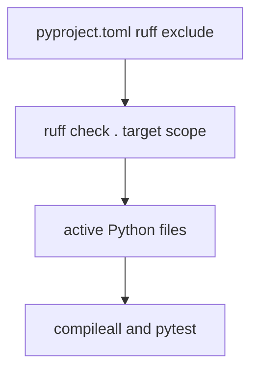

# Ruff Cleanup Plan

## Phase 1: Business Review

### 1.1 Problem

현재 상태: `ruff check .`가 실행 코드와 스냅샷/레거시 복사본을 함께 검사해 1,381개 오류를 보고한다.
목표 상태: 활성 실행 코드의 lint 오류를 줄이고, 스냅샷/산출물 폴더는 명시적으로 검사 범위에서 제외한다.

영향 범위:
- 전체 `ruff check .`: 1,381 errors.
- 활성 코드 범위 `api_server.py flows src tests tools`: 368 errors.

### 1.2 Options

| 옵션 | 설명 | 공수(일) | 리스크 | 비용(AED) |
|------|------|---------|--------|----------|
| A | `root_folder_snapshot`, `archive`, `reports`, `review_needed`, `workspaces`, `logs`를 ruff 제외하고 활성 코드만 정리 | 0.5 | 스냅샷 코드의 lint 상태는 별도 관리 필요 | 0 |
| B | 저장소 전체 1,381개 오류를 모두 수정 | 2-4 | 스냅샷/외부 증거 파일까지 대량 변경되어 비교 근거가 훼손될 수 있음 | 0 |
| C | ruff 설정을 완화해 오류를 숨김 | 0.2 | 실제 활성 코드 품질 개선이 적음 | 0 |

### 1.3 Recommendation

추천: 옵션 A.
이유: 실행 코드 품질은 개선하면서, 스냅샷/레거시 증거 파일은 원본성을 보존할 수 있다.
롤백: `pyproject.toml` 제외 설정과 ruff 자동 수정 diff를 되돌린다.

### 1.4 Approval

[x] Phase 1 승인: 사용자가 "범위를 정해서 lint 수정 작업을 시작"하라고 요청했으므로 옵션 A로 시작한다.

## Phase 2: Engineering Review

### 2.1 Mermaid

### 2.2 File Changes

| 파일 | 변경 유형 | 설명 |
|------|----------|------|
| `pyproject.toml` | modify | 스냅샷/산출물/레거시 폴더를 ruff 검사에서 제외 |
| `api_server.py`, `flows/`, `src/`, `tests/`, `tools/` | modify | ruff 자동 수정 가능한 import, unused import, datetime alias 등을 우선 정리 |

### 2.3 Order

1. ruff 제외 범위를 `pyproject.toml`에 기록한다.
2. `ruff check api_server.py flows src tests tools --fix`를 실행한다.
3. 남은 오류를 유형별로 다시 분류한다.
4. `compileall`, `run.ps1 self-test`, `pytest`로 회귀 검증한다.

### 2.4 Tests

- Unit/regression: `py -3.12 -m pytest -q`
- Syntax: `python -m compileall main.py src tests`
- Smoke: `.\run.ps1 self-test`
- Lint: `py -3.12 -m ruff check .`

### 2.5 Risks

- 자동 수정이 import 순서를 바꿀 수 있다. 완화: 전체 pytest를 다시 실행한다.
- Windows 전용 경로/권한 처리가 다시 깨질 수 있다. 완화: 이전 실패 테스트를 전체 pytest에 포함한다.
- 스냅샷 폴더 제외가 과도할 수 있다. 완화: 제외 폴더를 `pyproject.toml`에 명시해 추적 가능하게 한다.
