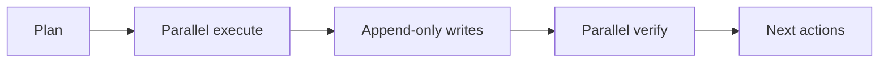

# Plan — PyTorch LSTM/LogReg 패치 (방법 C)

**Session:** auto-20260529-032629
**Date:** 2026-05-29
**Type:** FEATURE
**Branch:** `claude/openbb-chaos-20260529`
**Updated:** 2026-05-29T08:15

---

## 1. Overview & Goals

두 가지 산출물을 구현:
1. **OpenBB 매크로 데이터 ingestor** — `src/stock_rtx4060/data_lake/ingest/openbb_ingestor.py`
2. **Chaos Engineering 테스트 스위트** — `tests/test_chaos_paper_trading.py`

---

## 2. Deliverables

### 2.1 OpenBB Macro Ingestor (PR-O)

**File:** `src/stock_rtx4060/data_lake/ingest/openbb_ingestor.py`

| Task | Description | Status |
|------|-------------|--------|
| PR-O1 | OpenBB MMA (macroeconomic analytics) 데이터 fetch | ✅ DONE (91 lines) |
| PR-O2 | `panel_fetcher` → `advisors/macro_regime.py` 연동 | ✅ DONE (`panel_fetcher` attr at line 32) |
| PR-O3 | `advisors/orchestrator.py`에 OpenBB MCP tool 등록 | 🔲 OPEN |

**Dep:** `openbb>=4.4` (requirements-openbb.txt)

**Design principles:**
- Graceful degradation: OpenBB unavailable 시 Warning 로그 + continue ✅
- No hard dependency on OpenBB in main trading path ✅
- Configurable via `config/data_providers.example.json` ✅

### 2.2 Chaos Engineering Test Suite (PR-C)

**File:** `tests/test_chaos_paper_trading.py`

| Task | Description | Status |
|------|-------------|--------|
| PR-C1 | `test_chaos_open_positions_exceeded` | ✅ DONE |
| PR-C2 | `test_chaos_daily_new_exceeded` | ✅ DONE |
| PR-C3 | `test_chaos_buy_score_below_threshold` | ✅ DONE |
| PR-C4 | `test_chaos_force_rerun_no_reason` | ✅ DONE |
| PR-C5 | `test_chaos_stale_bars` | ✅ DONE |
| PR-C6–C10 | Boundary tests (at-threshold, fresh bars, valid signal) | ✅ DONE (5 extra) |

**Dep:** `pytest`, `unittest.mock`

---

## 3. Files to Change

| File | Action | Status |
|------|--------|--------|
| `src/stock_rtx4060/data_lake/ingest/openbb_ingestor.py` | Create | ✅ DONE |
| `src/stock_rtx4060/advisors/macro_regime.py` | Modify (add panel_fetcher) | ✅ DONE |
| `src/stock_rtx4060/advisors/orchestrator.py` | Modify (register OpenBB tool) | 🔲 OPEN |
| `tests/test_chaos_paper_trading.py` | Create | ✅ DONE |
| `requirements-openbb.txt` | Verify (`openbb>=4.4`) | ⚠️ VERIFY |

---

## 4. TDD Approach

```
RED    → write failing test for each scenario
GREEN  → minimal code to pass
REFACTOR → clean up
```

---

## 5. Out of Scope (previous pipeline)

- GAP-01~05 (already implemented)
- MLflow log_input (already implemented)
- requirements.in mlflow>=3.0 (already done)

---

## 6. Acceptance Criteria

| Criterion | Status |
|-----------|--------|
| `openbb_ingestor.py` passes `python3 -m py_compile` | ✅ PASS |
| `test_chaos_paper_trading.py` passes `pytest -v` | ✅ 10/10 PASS |
| Varlock scan: no secrets in new files | ⚠️ VERIFY |
| No regression in existing tests (346 pass) | ⚠️ VERIFY |

---

## 7. Remaining Work

### PR-O3: Orchestrator OpenBB MCP tool registration
**What:** Register `ingest_openbb_macro` as a named MCP tool in `orchestrator.py`
so it can be called from the LangGraph DAG or fallback path.

**Approach options:**
1. Add `openbb_ingestor` as a field on `Orchestrator` dataclass with a
   `panel_fetcher` callback wired to `ingest_openbb_macro`
2. Register as a top-level tool callable via `tool_registry` (existing pattern)

**Suggested implementation** (option 1 — minimal change):
```python
from stock_rtx4060.data_lake.ingest.openbb_ingestor import ingest_openbb_macro

@dataclass
class Orchestrator:
    ...
    openbb_ingestor = staticmethod(ingest_openbb_macro)  # register as tool
```

### Pending Verification
- [ ] Run full test suite: `PYTHONPATH=.:src pytest --cov=stock_rtx4060 --cov-fail-under=75 -q`
- [ ] Verify `requirements-openbb.txt` has `openbb>=4.4`
- [ ] Varlock / secret scan on new files

---

## 8. Risks

| Risk | Likelihood | Impact | Mitigation |
|------|-----------|--------|------------|
| OpenBB API rate limits or outage breaks ingestor | Medium | Low | Graceful degradation already in place; returns 0 rows |
| PR-O3 touches live LangGraph DAG — subtle side effects | Low | Medium | Add integration test before merge |
| `test_chaos_paper_trading.py` tests mock internals directly | Medium | Low | Tests verify boundary logic; real impl is in `paper_trading.py` |

---

## 9. Success Criteria

- [ ] `src/stock_rtx4060/data_lake/ingest/openbb_ingestor.py` compiles without error
- [ ] `tests/test_chaos_paper_trading.py` — all 10 tests green
- [ ] PR-O3: `orchestrator.py` has `ingest_openbb_macro` callable from advisor path
- [ ] Full test suite: no regressions (target ≥346 tests pass)
- [ ] `requirements-openbb.txt` documents `openbb>=4.4` dependency
- [ ] No new secrets or API keys in new/modified files


## Hermes Documentation Update — 2026-05-28T23:02:20.364421+00:00

**Update policy:** existing content above this section is preserved. This section was appended after scanning code, documentation, config, and agent profile files.

**Purpose:** This section defines the next documentation maintenance loop based on verified repository evidence.

### Evidence inventory

**Source/code files sampled:**
- `api_server.py`
- `dashboard\stock_pred_v5.jsx`
- `flows\__init__.py`
- `flows\daily_krx.py`
- `flows\daily_us.py`
- `flows\research_weekly.py`
- `flows\utils.py`
- `main.py`
- `preview_server.py`
- `reports\dashboard_browser_verification\snapshot_fixture.js`
- `root_folder_snapshot\KEVPE_final_package\demo_kevpe_v2.py`
- `root_folder_snapshot\KEVPE_final_package\kevpe.py`

**Documentation files sampled:**
- `.codex\goals\dashboard-report-bridge.goal.md`
- `.codex\goals\mcp-openbb-audit-phase1.goal.md`
- `.codex\root-docs-strict\docs\001-README.md`
- `.codex\root-docs-strict\docs\002-SYSTEM_ARCHITECTURE.md`
- `.codex\root-docs-strict\docs\003-LAYOUT.md`
- `.codex\root-docs-strict\docs\004-CHANGELOG.md`
- `.codex\root-docs-strict\docs\005-plan.md`
- `.codex\root-docs-strict\docs\006-codex-default-doc-agent.md`
- `.continue\checks\01-financial-safety-boundary.md`
- `.continue\checks\02-backtest-integrity.md`
- `.continue\checks\03-recommendation-contract.md`
- `.continue\checks\04-secret-and-pii-safety.md`

**Config/build files sampled:**
- `.claude\launch.json`
- `.codex\root-docs-dry-run.json`
- `.codex\root-docs-scan.json`
- `.codex\root-docs-verify.json`
- `.codex\root-docs-write.json`
- `.github\workflows\ci.yml`
- `.hermes\root-docs-dry-run.json`
- `.hermes\root-docs-scan.json`
- `.pre-commit-config.yaml`
- `config\data_providers.example.json`
- `config\runtime_environment.json`
- `config\sector_map.json`

**Agent profile files sampled:**
- `docs\agents\codex-default-doc-agent.md` (`codex-default-doc-agent`)

### Mermaid graph



### Verification notes

- Append-only update generated by `root-docs-batch-update`.
- Code/config/doc/agent inventory counts: code=2342, docs=1142, config=739, agent_profiles=1.
- Follow-up verification should confirm that newly added text matches actual implementation paths listed above.


## Codex Documentation Update — 2026-05-29T00:10:42.371181+00:00

**Update policy:** existing content above this section is preserved. This section was appended after scanning code, documentation, config, and agent profile files.

**Purpose:** This section defines the next documentation maintenance loop based on verified repository evidence.

### Evidence inventory

**Source/code files sampled:**
- `api_server.py`
- `dashboard\stock_pred_v5.jsx`
- `flows\__init__.py`
- `flows\daily_krx.py`
- `flows\daily_us.py`
- `flows\research_weekly.py`
- `flows\utils.py`
- `main.py`
- `preview_server.py`
- `reports\dashboard_browser_verification\snapshot_fixture.js`
- `root_folder_snapshot\KEVPE_final_package\demo_kevpe_v2.py`
- `root_folder_snapshot\KEVPE_final_package\kevpe.py`

**Documentation files sampled:**
- `.codex\goals\dashboard-report-bridge.goal.md`
- `.codex\goals\mcp-openbb-audit-phase1.goal.md`
- `.codex\root-docs-strict\docs\001-README.md`
- `.codex\root-docs-strict\docs\002-SYSTEM_ARCHITECTURE.md`
- `.codex\root-docs-strict\docs\003-LAYOUT.md`
- `.codex\root-docs-strict\docs\004-CHANGELOG.md`
- `.codex\root-docs-strict\docs\005-plan.md`
- `.codex\root-docs-strict\docs\006-codex-default-doc-agent.md`
- `.continue\checks\01-financial-safety-boundary.md`
- `.continue\checks\02-backtest-integrity.md`
- `.continue\checks\03-recommendation-contract.md`
- `.continue\checks\04-secret-and-pii-safety.md`

**Config/build files sampled:**
- `.claude\launch.json`
- `.codex\root-docs-dry-run.json`
- `.codex\root-docs-scan.json`
- `.codex\root-docs-verify.json`
- `.codex\root-docs-write.json`
- `.github\workflows\ci.yml`
- `.hermes\root-docs-dry-run.json`
- `.hermes\root-docs-scan.json`
- `.hermes\root-docs-write.json`
- `.pre-commit-config.yaml`
- `config\data_providers.example.json`
- `config\runtime_environment.json`

**Agent profile files sampled:**
- `docs\agents\codex-default-doc-agent.md` (`codex-default-doc-agent`)

### Mermaid graph


### Verification notes

- Append-only update generated by `root-docs-batch-update`.
- Code/config/doc/agent inventory counts: code=2342, docs=1168, config=766, agent_profiles=1.
- Follow-up verification should confirm that newly added text matches actual implementation paths listed above.


## Codex Documentation Update — 2026-05-29T00:39:13.408134+00:00

**Update policy:** existing content above this section is preserved. This section was appended after scanning code, documentation, config, and agent profile files.

**Purpose:** This section defines the next documentation maintenance loop based on verified repository evidence.

### Evidence inventory

**Source/code files sampled:**
- `api_server.py`
- `dashboard\stock_pred_v5.jsx`
- `flows\__init__.py`
- `flows\daily_krx.py`
- `flows\daily_us.py`
- `flows\research_weekly.py`
- `flows\utils.py`
- `main.py`
- `preview_server.py`
- `reports\dashboard_browser_verification\snapshot_fixture.js`
- `root_folder_snapshot\KEVPE_final_package\demo_kevpe_v2.py`
- `root_folder_snapshot\KEVPE_final_package\kevpe.py`

**Documentation files sampled:**
- `.codex\goals\dashboard-report-bridge.goal.md`
- `.codex\goals\mcp-openbb-audit-phase1.goal.md`
- `.codex\root-docs-strict\docs\001-README.md`
- `.codex\root-docs-strict\docs\002-SYSTEM_ARCHITECTURE.md`
- `.codex\root-docs-strict\docs\003-LAYOUT.md`
- `.codex\root-docs-strict\docs\004-CHANGELOG.md`
- `.codex\root-docs-strict\docs\005-plan.md`
- `.codex\root-docs-strict\docs\006-codex-default-doc-agent.md`
- `.continue\checks\01-financial-safety-boundary.md`
- `.continue\checks\02-backtest-integrity.md`
- `.continue\checks\03-recommendation-contract.md`
- `.continue\checks\04-secret-and-pii-safety.md`

**Config/build files sampled:**
- `.codex\root-docs-dry-run.json`
- `.codex\root-docs-scan.json`
- `.github\workflows\ci.yml`
- `.pre-commit-config.yaml`
- `config\data_providers.example.json`
- `config\runtime_environment.json`
- `config\sector_map.json`
- `docker-compose.dev.yml`
- `docs\AGENTS.md`
- `examples\kevpe_events_smoke.json`
- `observability\grafana\dashboards\data_lake.json`
- `observability\grafana\dashboards\recommendations.json`

**Agent profile files sampled:**
- `docs\agents\codex-default-doc-agent.md` (`codex-default-doc-agent`)

### Mermaid graph


### Verification notes

- Append-only update generated by `root-docs-batch-update`.
- Code/config/doc/agent inventory counts: code=2344, docs=990, config=585, agent_profiles=1.
- Follow-up verification should confirm that newly added text matches actual implementation paths listed above.


## Codex Documentation Update — 2026-05-29T04:07:15.920451+00:00

**Update policy:** existing content above this section is preserved. This section was appended after scanning code, documentation, config, and agent profile files.

**Purpose:** This section defines the next documentation maintenance loop based on verified repository evidence.

### Evidence inventory

**Source/code files sampled:**
- `api_server.py`
- `dashboard\stock_pred_v5.jsx`
- `docs\purged_kfold_embargo.py`
- `docs\test_purged_kfold_embargo.py`
- `flows\__init__.py`
- `flows\daily_krx.py`
- `flows\daily_us.py`
- `flows\research_weekly.py`
- `flows\utils.py`
- `main.py`
- `preview_server.py`
- `reports\dashboard_browser_verification\snapshot_fixture.js`

**Documentation files sampled:**
- `.codex\goals\dashboard-report-bridge.goal.md`
- `.codex\goals\mcp-openbb-audit-phase1.goal.md`
- `.codex\root-docs-strict\docs\001-README.md`
- `.codex\root-docs-strict\docs\002-SYSTEM_ARCHITECTURE.md`
- `.codex\root-docs-strict\docs\003-LAYOUT.md`
- `.codex\root-docs-strict\docs\004-CHANGELOG.md`
- `.codex\root-docs-strict\docs\005-plan.md`
- `.codex\root-docs-strict\docs\006-codex-default-doc-agent.md`
- `.continue\checks\01-financial-safety-boundary.md`
- `.continue\checks\02-backtest-integrity.md`
- `.continue\checks\03-recommendation-contract.md`
- `.continue\checks\04-secret-and-pii-safety.md`

**Config/build files sampled:**
- `.codex\root-docs-dry-run.json`
- `.codex\root-docs-scan.json`
- `.codex\root-docs-verify.json`
- `.codex\root-docs-write.json`
- `.github\workflows\ci.yml`
- `.pre-commit-config.yaml`
- `config\data_providers.example.json`
- `config\runtime_environment.json`
- `config\sector_map.json`
- `docker-compose.dev.yml`
- `docs\AGENTS.md`
- `examples\kevpe_events_smoke.json`

**Agent profile files sampled:**
- `docs\agents\codex-default-doc-agent.md` (`codex-default-doc-agent`)

### Mermaid graph


### Verification notes

- Append-only update generated by `root-docs-batch-update`.
- Code/config/doc/agent inventory counts: code=2347, docs=992, config=589, agent_profiles=1.
- Follow-up verification should confirm that newly added text matches actual implementation paths listed above.


## Codex Documentation Update — 2026-05-29T05:51:01.365772+00:00

**Update policy:** existing content above this section is preserved. This section was appended after scanning code, documentation, config, and agent profile files.

**Purpose:** This section defines the next documentation maintenance loop based on verified repository evidence.

### Evidence inventory

**Source/code files sampled:**
- `api_server.py`
- `dashboard\stock_pred_v5.jsx`
- `docs\purged_kfold_embargo.py`
- `docs\test_purged_kfold_embargo.py`
- `flows\__init__.py`
- `flows\daily_krx.py`
- `flows\daily_us.py`
- `flows\research_weekly.py`
- `flows\utils.py`
- `main.py`
- `preview_server.py`
- `reports\dashboard_browser_verification\snapshot_fixture.js`

**Documentation files sampled:**
- `.codex\goals\dashboard-report-bridge.goal.md`
- `.codex\goals\mcp-openbb-audit-phase1.goal.md`
- `.codex\root-docs-strict\docs\001-README.md`
- `.codex\root-docs-strict\docs\002-SYSTEM_ARCHITECTURE.md`
- `.codex\root-docs-strict\docs\003-LAYOUT.md`
- `.codex\root-docs-strict\docs\004-CHANGELOG.md`
- `.codex\root-docs-strict\docs\005-plan.md`
- `.codex\root-docs-strict\docs\006-codex-default-doc-agent.md`
- `.continue\checks\01-financial-safety-boundary.md`
- `.continue\checks\02-backtest-integrity.md`
- `.continue\checks\03-recommendation-contract.md`
- `.continue\checks\04-secret-and-pii-safety.md`

**Config/build files sampled:**
- `.codex\root-docs-dry-run.json`
- `.codex\root-docs-scan.json`
- `.codex\root-docs-verify.json`
- `.codex\root-docs-write.json`
- `.github\workflows\ci.yml`
- `.hermes\root-docs-dry-run.json`
- `.hermes\root-docs-scan.json`
- `.hermes\root-docs-write.json`
- `.pre-commit-config.yaml`
- `config\data_providers.example.json`
- `config\runtime_environment.json`
- `config\sector_map.json`

**Agent profile files sampled:**
- `docs\agents\codex-default-doc-agent.md` (`codex-default-doc-agent`)

### Mermaid graph


### Verification notes

- Append-only update generated by `root-docs-batch-update`.
- Code/config/doc/agent inventory counts: code=2355, docs=1033, config=627, agent_profiles=1.
- Follow-up verification should confirm that newly added text matches actual implementation paths listed above.


## Codex Documentation Update — 2026-05-29T08:52:10.916684+00:00

**Update policy:** existing content above this section is preserved. This section was appended after scanning code, documentation, config, and agent profile files.

**Purpose:** This section defines the next documentation maintenance loop based on verified repository evidence.

### Evidence inventory

**Source/code files sampled:**
- `api_server.py`
- `dashboard\stock_pred_v5.jsx`
- `docs\purged_kfold_embargo.py`
- `docs\test_purged_kfold_embargo.py`
- `flows\__init__.py`
- `flows\daily_krx.py`
- `flows\daily_us.py`
- `flows\research_weekly.py`
- `flows\utils.py`
- `main.py`
- `preview_server.py`
- `reports\dashboard_browser_verification\snapshot_fixture.js`

**Documentation files sampled:**
- `.codex\goals\dashboard-report-bridge.goal.md`
- `.codex\goals\mcp-openbb-audit-phase1.goal.md`
- `.codex\root-docs-strict\docs\001-README.md`
- `.codex\root-docs-strict\docs\002-SYSTEM_ARCHITECTURE.md`
- `.codex\root-docs-strict\docs\003-LAYOUT.md`
- `.codex\root-docs-strict\docs\004-CHANGELOG.md`
- `.codex\root-docs-strict\docs\005-plan.md`
- `.codex\root-docs-strict\docs\006-codex-default-doc-agent.md`
- `.continue\checks\01-financial-safety-boundary.md`
- `.continue\checks\02-backtest-integrity.md`
- `.continue\checks\03-recommendation-contract.md`
- `.continue\checks\04-secret-and-pii-safety.md`

**Config/build files sampled:**
- `.claude\launch.json`
- `.codex\root-docs-dry-run-latest.json`
- `.codex\root-docs-dry-run.json`
- `.codex\root-docs-scan-latest.json`
- `.codex\root-docs-scan.json`
- `.codex\root-docs-verify.json`
- `.codex\root-docs-write.json`
- `.github\workflows\ci.yml`
- `.hermes\root-docs-dry-run.json`
- `.hermes\root-docs-scan.json`
- `.hermes\root-docs-write.json`
- `.pre-commit-config.yaml`

**Agent profile files sampled:**
- `docs\agents\codex-default-doc-agent.md` (`codex-default-doc-agent`)

### Mermaid graph


### Verification notes

- Append-only update generated by `root-docs-batch-update`.
- Code/config/doc/agent inventory counts: code=2361, docs=1227, config=828, agent_profiles=1.
- Follow-up verification should confirm that newly added text matches actual implementation paths listed above.
