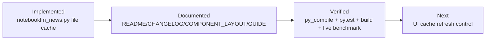
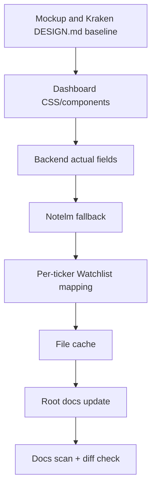
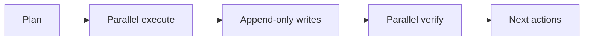
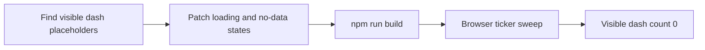

# PLAN_DOC — RD-Agent(Q) Alpha Factory Integration
**v1.0 | 2026-05-29 | skill: project-plan v2.2 | project: stock_1901 / stock_rtx4060**

---

## 2026-05-30 Addendum — Notelm fallback file cache documentation

Watchlist 첫 로딩 시간을 줄이기 위해 NotebookLM API down 상태의 Notelm fallback 결과를 파일 캐시로 저장했다.
이 계획 addendum은 구현 완료 후 문서 반영과 유지보수 작업만 추적한다.



| 항목 | 상태 |
|---|---|
| Backend cache helper | 완료 — `reports/notelm_fallback_cache/<MARKET>/<TICKER>.json` |
| Watchlist endpoint reuse | 완료 — `LOCAL_CACHE_HIT` 시 외부 뉴스 재조회 생략 |
| Regression test | 완료 — `test_notelm_fallback_writes_and_reads_file_cache` |
| Live benchmark | 완료 — cold `24.75s`, warm `6.41s`, 9 cache files |
| 남은 개선 | UI에서 TTL/강제 새로고침 상태 노출 |

---

## 2026-05-30 Addendum — session-wide documentation closure

이번 세션의 목표는 dashboard를 목업과 실제 데이터 계약에 맞추고, NotebookLM이 꺼져도 Watchlist 분석이 유지되도록 만드는 것이었다.
문서화 단계에서는 root-docs-batch-update 기준으로 루트 문서와 대시보드 가이드를 같은 내용으로 동기화했다.



| Workstream | 완료 기준 | 상태 |
|---|---|---|
| Design implementation | 대시보드가 mockup/Kraken 스타일을 따름 | 완료 |
| Actual data contract | `fundamentals`, `news_headlines`, `scenario_outlook`가 snapshot에 포함 | 완료 |
| NotebookLM down fallback | Notelm rule fallback이 `notebook_analysis`를 채움 | 완료 |
| Watchlist expansion | 전체 Watchlist 종목에 fallback 분석 매핑 | 완료 |
| Load-time reduction | fallback 결과를 파일 캐시로 저장하고 warm hit 확인 | 완료 |
| Documentation | README/CHANGELOG/COMPONENT_LAYOUT/GUIDE/plan 갱신 | 완료 |

다음 유지보수 단위는 cache TTL과 강제 refresh control을 UI에 표시하는 것이다.

---

## A. Executive Summary

### 목표
Microsoft RD-Agent(Q) (NeurIPS 2025)를 `stock_1901`의 팩터 발굴 파이프라인에 완전 통합한다.
LLM이 가설 → 코드 → 백테스트 → 피드백 사이클을 자동 반복해 **주당 $10 이하 비용으로 Alpha158 대비 2× 수익률 팩터를 생성**하고, 통과된 팩터를 `FactorRegistry`에 등록해 다음 `factor_compute_task` 실행 시 즉시 활용한다.

### 핵심 제약 (CRITICAL — 설계 방향 결정)

| 제약 | 현황 | 해결책 |
|------|------|--------|
| RD-Agent: Linux + Docker 전용 | 프로젝트: Windows 11 + Python 3.12 | **Docker subprocess 패턴** — RD-Agent를 별도 Docker 컨테이너로 실행, main Python 프로세스는 I/O만 담당 |
| RD-Agent: Python 3.10/3.11 | 프로젝트: Python 3.12/3.14 | Docker 내부에서 Python 3.11 env 격리 → 버전 충돌 없음 |
| `rdagent.factor_loop` 폐기 | runner.py 현재 stub에서 사용 중 | `rdagent fin_factor` CLI 엔트리포인트로 교체 |
| Qlib `.bin` 데이터 포맷 요구 | 현재 DuckDB OHLCV Parquet | `qlib_exporter.py` 신규 — DuckDB → Qlib CSV → bin 변환 |

### KPI

| Metric | 현재 | 목표 |
|--------|------|------|
| 자동 팩터 발굴 사이클 | 0 (수동 only) | 주 1회 자동 (research_weekly 토요일 02:00 UTC) |
| 발굴→등록 비용 | N/A | ≤ $10/사이클 (budget_usd 상한 적용) |
| 등록된 discovered 팩터 IC | N/A | ≥ 0.03 (validator gate) |
| 등록된 discovered 팩터 IR | N/A | ≥ 0.30 (validator gate) |
| 기존 팩터와의 상관관계 | N/A | < 0.70 (중복 방지) |
| MLflow discovered 팩터 lineage | 없음 | 팩터별 run_id + IC/IR/budget 기록 |
| 테스트 커버리지 (rd_agent 모듈) | 미측정 | ≥ 80% |

### 범위
- **In-scope**: `factors/rd_agent/` 모듈 완성, `flows/research_weekly.py` 파이프라인, DuckDB→Qlib 변환, Docker 실행, 팩터 자동 등록, MLflow 로깅, audit log
- **Out-of-scope**: RD-Agent UI (`rdagent server_ui`), `fin_quant` (factor+model joint) 모드, KIS 실시간 데이터 연동, Databricks MLflow, RD-Agent 내부 코드 수정

### 핵심 결정

| # | 결정 | 이유 |
|---|------|------|
| D1 | Docker subprocess 패턴 (Python import 아님) | Windows 호환 + Python 버전 격리 |
| D2 | `rdagent fin_factor` CLI (factor-only loop) | `fin_quant` 보다 낮은 위험, 팩터만 추가 |
| D3 | DuckDB → Qlib CSV → bin 2-step 변환 | Qlib 공식 변환 스크립트 활용, PIT 가드 보존 |
| D4 | 발굴 팩터 `discovered/` 디렉토리 격리 | built-in 팩터와 분리, git-ignore 가능 |
| D5 | 팩터 수동 승인 게이트 | `screening_output_only=True` 철학 유지 — 자동 등록 없음, ops 승인 필요 |

### 마일스톤

| 마일스톤 | 기간 | 완료 기준 |
|----------|------|-----------|
| M1: 인프라 (Docker + Qlib exporter) | 1주 | `rdagent health_check` 통과 + DuckDB→Qlib 변환 테스트 |
| M2: Runner 업데이트 + Loader | 2주 | `run_factor_mining()` CLI 실행 + `load_discovered_factors()` 동작 |
| M3: 파이프라인 완성 (validate→register→log) | 3주 | `research_weekly_flow` E2E 테스트 통과 |
| M4: 테스트 + CI + 문서 | 4주 | 커버리지 ≥80%, CLAUDE.md 업데이트 |

---

## B. Context & Requirements

### 문제 정의

**현재 상황:**
- `factors/rd_agent/runner.py`는 stub만 존재 (`rdagent.factor_loop` 호출 — 폐기된 API)
- `factors/rd_agent/validator.py`는 완전 구현됨 (IC, IR, 상관관계, 반감기 게이트)
- `flows/research_weekly.py`의 `factor_mining_task()`는 `run_factor_mining()` 호출 후 결과를 버림 (validate/register 없음)
- 발굴된 팩터가 `FactorRegistry`에 등록되지 않아 `factor_compute_task`에서 활용 불가

**목표 상황:**
```
research_weekly_flow (토요일 02:00 UTC)
  └─ factor_mining_task()
       ├─ qlib_exporter: DuckDB → ~/.qlib/qlib_data/stock1901/
       ├─ docker_runner: rdagent fin_factor → discovered/*.py 생성
       └─ factor_validation_task()
            ├─ loader: discovered/*.py → Factor instances
            ├─ validator: IC/IR/상관/반감기 체크
            ├─ approval_gate: ops 수동 승인 대기 (screening_output_only)
            └─ registry_task: FactorRegistry.register() + MLflow log
```

### 페르소나

| 페르소나 | 역할 | 관심사 |
|----------|------|--------|
| Quant Researcher | 발굴 팩터 품질 검토 | IC/IR 지표, 기존 팩터 중복 여부 |
| System Operator | 주간 플로우 모니터링 | 비용(USD), 실행 시간, Docker 상태 |
| Risk Manager | 등록 승인 | 팩터 해석 가능성, 과적합 위험 |

### 유저 스토리

| ID | As a... | I want to... | So that... |
|----|---------|--------------|------------|
| US-1 | Quant Researcher | research_weekly 결과를 대시보드에서 확인 | 발굴된 팩터의 IC/IR을 검토할 수 있다 |
| US-2 | Quant Researcher | 발굴 팩터를 승인/거부 | 승인된 것만 FactorRegistry에 등록된다 |
| US-3 | System Operator | 사이클당 USD 비용을 audit log에서 확인 | 예산 초과를 사전에 차단할 수 있다 |
| US-4 | Risk Manager | 팩터 provenance를 MLflow에서 추적 | 어떤 사이클에서 어떤 비용으로 생성됐는지 알 수 있다 |

### 기능 요구사항

| ID | 요구사항 | 우선순위 |
|----|----------|----------|
| FR-1 | DuckDB OHLCV → Qlib bin 변환 (PIT 가드 보존) | P0 |
| FR-2 | Docker 컨테이너로 `rdagent fin_factor` 실행 | P0 |
| FR-3 | 발굴된 `.py` 파일을 `Factor` 인스턴스로 동적 로드 | P0 |
| FR-4 | IC/IR/상관/반감기 게이트 통과한 팩터만 후보 목록에 추가 | P0 |
| FR-5 | 비용(USD) + 팩터 수 + IC를 `audit_log/rd_agent.jsonl`에 기록 | P1 |
| FR-6 | MLflow에 discovered 팩터 메트릭 로깅 | P1 |
| FR-7 | ops 수동 승인 없이 `FactorRegistry` 등록 불가 (D5) | P0 |
| FR-8 | `budget_usd` 상한 초과 시 사이클 즉시 중단 | P0 |
| FR-9 | Docker 미설치/미실행 시 graceful skip (기존 `rdagent` 미설치 패턴 유지) | P0 |

### 비기능 요구사항

| ID | 요구사항 |
|----|----------|
| NFR-1 | 기존 Key Invariants (CLAUDE.md) 전부 보존 |
| NFR-2 | `screening_output_only=True` 유지 |
| NFR-3 | PIT as_of 가드: `qlib_exporter`는 `as_of` 이후 데이터 미포함 |
| NFR-4 | Docker 실행 타임아웃 ≤ 60분 (기본 30분) |
| NFR-5 | Windows 환경에서는 Docker Desktop + WSL2 필요 명시 |

---

## C. UI/UX Plan

### C1. Information Architecture

```
research_weekly_flow 결과
  ├─ factor_mining_task result (audit_log/rd_agent.jsonl)
  │    ├─ session_id, timestamp, cycles, budget_spent_usd
  │    └─ new_factor_files: [path, ...]
  ├─ factor_validation_task result
  │    ├─ validated: [{name, ic, ir, max_corr, half_life, status}]
  │    └─ rejected: [{name, reason}]
  └─ registry_task (수동 승인 후)
       └─ registered: [factor_name, ...]
```

### C2. 운영자 워크플로우 (주요 흐름)

```
토요일 02:00 KST
  1. Prefect → research_weekly_flow 자동 시작
  2. qlib_exporter: DuckDB OHLCV → Qlib bin
  3. docker_runner: rdagent fin_factor --cycles N --budget $10
  4. loader: discovered/*.py → Factor instances
  5. validator: IC/IR/상관/반감기 체크
  6. [Slack/Discord 알림] "RD-Agent: N개 발굴, M개 통과"
  7. [운영자 검토] audit_log/rd_agent.jsonl + MLflow 확인
  8. [수동 승인] python main.py factor-approve --session <id>
  9. FactorRegistry.register() + MLflow log
  10. 다음 daily_krx_flow에서 신규 팩터 활용
```

### C3. Screens (CLI 출력 형식)

| Screen | 출력 예시 |
|--------|----------|
| factor_mining_task 완료 | `[RD-Agent] cycles=2 budget_spent=$3.42 new_factors=4 elapsed=1823s` |
| factor_validation_task 완료 | `[Validator] PASS: 2 (rd_mom_vol, rd_reversal_adj) FAIL: 2 (low IC, high corr)` |
| 알림 (Slack/Discord) | `🧪 RD-Agent 완료: 2개 팩터 통과 (IC≥0.03, IR≥0.30). 승인 필요: python main.py factor-approve` |
| factor-approve CLI | `Approving rd_mom_vol (IC=0.041, IR=0.52) → FactorRegistry + MLflow [y/N]` |

---

## D. System Architecture

### D1. 전체 구성도

```
research_weekly_flow (Prefect)
│
├─ [Task 1] qlib_export_task
│     └─ qlib_exporter.py
│          ├─ DuckDB: load_ohlcv_with_provider(as_of=run_date)
│          ├─ CSV 변환: ~/.qlib/csv_data/stock1901/
│          └─ Qlib bin 변환: python -m qlib.data.base.provider → ~/.qlib/qlib_data/stock1901/
│
├─ [Task 2] factor_mining_task (기존, 업데이트)
│     └─ docker_runner.py
│          ├─ docker run microsoft/rdagent:latest rdagent fin_factor \
│          │    --config stock1901.yaml \
│          │    --budget-usd 10.0 \
│          │    --cycles 2
│          └─ 결과: discovered/{session_id}/*.py 생성
│
├─ [Task 3] factor_validation_task (신규)
│     ├─ loader.py: discovered/*.py → Factor instances
│     ├─ validator.py: IC/IR/corr/halflife gates
│     └─ provenance.py: audit_log/rd_agent.jsonl 기록
│
├─ [Task 4] factor_notification_task (신규)
│     └─ alert_engine: Slack/Discord "승인 대기"
│
└─ [수동] factor-approve CLI (신규)
      ├─ ops 검토 및 승인
      ├─ registry_hook: FactorRegistry.register()
      └─ mlflow_logger: MLflow metrics 기록

          ↓ (다음 실행부터)
daily_krx_flow → factor_compute_task → FactorRegistry.compute_all() → 신규 팩터 포함
```

### D2. 데이터 흐름

```
DuckDB (Parquet) ──as_of 가드──► Qlib CSV ──qlib.cli──► Qlib bin
                                                               │
                                              docker container (RD-Agent)
                                                               │
                                         factor hypothesis → code → backtest → feedback
                                                               │
                                              discovered/{session}/factor_X.py
                                                               │
                                                   loader.py  │  validator.py
                                                               │
                                                  ValidationResult(passed=True)
                                                               │
                                                ops approval (manual gate)
                                                               │
                                                FactorRegistry.register(factor)
                                                MLflow.log_metrics(ic, ir, budget)
```

### D3. 컴포넌트 경계

| 컴포넌트 | 책임 | 외부 의존성 |
|----------|------|------------|
| `qlib_exporter.py` | DuckDB → Qlib 변환, PIT 가드 | qlib, DuckDB, data_providers |
| `docker_runner.py` | Docker subprocess, timeout, budget | subprocess, Docker daemon |
| `loader.py` | `.py` 동적 임포트, `Factor` 생성 | importlib, base.Factor |
| `provenance.py` | audit log 기록, FactorMeta 확장 | audit_log, jsonlines |
| `registry_hook.py` | 승인 후 등록 + MLflow log | FactorRegistry, MLflow |
| `runner.py` (업데이트) | 기존 API 보존, docker_runner 위임 | docker_runner |

---

## E. Data Model & API Contract

### E1. 데이터 모델

#### FactorMeta 확장 (additive — 기존 필드 보존)
```python
# src/stock_rtx4060/factors/base.py — FactorMeta 확장
@dataclass(frozen=True)
class FactorMeta:
    name: str
    category: FactorCategory
    lookback: int
    description: str = ""
    tags: tuple[str, ...] = field(default_factory=tuple)
    # 신규 optional 필드 (discovered 팩터 전용)
    source: str = "builtin"           # "rd_agent" | "builtin" | "manual"
    discovery_session_id: str = ""    # RD-Agent 세션 ID
    discovery_date: str = ""          # ISO date
    budget_usd: float = 0.0           # 발굴 비용
    ic_at_discovery: float = float("nan")  # 발굴 시점 IC
```

#### RDAgentAuditEvent (audit_log/rd_agent.jsonl)
```python
{
  "ts": "2026-05-29T02:00:00Z",
  "session_id": "rd_20260529_abc123",
  "event": "cycle_complete",          # | "factor_validated" | "factor_approved" | "budget_exceeded"
  "cycles_run": 2,
  "budget_spent_usd": 3.42,
  "budget_limit_usd": 10.0,
  "new_factor_files": ["discovered/rd_20260529_abc123/rd_mom_vol.py"],
  "validated_pass": ["rd_mom_vol"],
  "validated_fail": [{"name": "rd_trend_x", "reason": "IC 0.012 < 0.03"}],
  "approved_by": null                 # ops 승인 후 채워짐
}
```

#### DiscoveredFactor (discovered/{session_id}/*.py 규약)
```python
# RD-Agent가 생성하는 파일 예시 — 우리가 loader.py에서 읽어야 하는 구조
from stock_rtx4060.factors.base import Factor, FactorMeta, FactorCategory
import pandas as pd

class RdMomVol(Factor):
    meta = FactorMeta(
        name="rd_mom_vol",
        category="discovered",
        lookback=21,
        description="RD-Agent generated: momentum adjusted by volatility",
        source="rd_agent",
    )

    def compute(self, panel: pd.DataFrame, as_of=None) -> pd.Series:
        # RD-Agent generated code (sandboxed via Docker)
        ...
```

### E2. API Contract (새로운 CLI)

| 명령어 | 역할 | 출력 |
|--------|------|------|
| `python main.py factor-mine [--cycles N] [--budget FLOAT] [--universe X,Y,Z]` | 팩터 발굴 실행 | audit_log/rd_agent.jsonl |
| `python main.py factor-list [--session SESSION_ID]` | 발굴/검증 결과 조회 | 팩터 목록 + IC/IR |
| `python main.py factor-approve --session SESSION_ID [--names A,B]` | 팩터 등록 승인 | FactorRegistry 업데이트 |
| `python main.py factor-status` | 현재 registered discovered 팩터 목록 | 이름, IC, 날짜 |

### E3. 환경변수

| 변수 | 기본값 | 설명 |
|------|--------|------|
| `RDAGENT_ENABLED` | `false` | `true`로 설정 시 Docker 실행 활성화 |
| `RDAGENT_DOCKER_IMAGE` | `microsoft/rd-agent:latest` | RD-Agent Docker 이미지 |
| `RDAGENT_BUDGET_USD` | `10.0` | 사이클당 최대 LLM 비용 |
| `RDAGENT_CYCLES` | `2` | 발굴 사이클 수 |
| `RDAGENT_TIMEOUT_MIN` | `60` | Docker 실행 타임아웃 (분) |
| `RDAGENT_APPROVAL_REQUIRED` | `true` | `false`로 설정하면 자동 등록 (테스트용) |
| `QLIB_DATA_DIR` | `~/.qlib/qlib_data/stock1901` | Qlib bin 데이터 경로 |

---

## F. Repo/Package Structure

### F1. Target Tree (변경/신규 파일만)

```
src/stock_rtx4060/factors/
├── base.py                          ← FactorMeta 확장 (additive fields)
├── factor_zoo.py                    ← startup auto-load discovered/ hook 추가
└── rd_agent/
    ├── __init__.py                  ← 공개 API 확장
    ├── runner.py                    ← docker_runner 위임으로 업데이트 (API 보존)
    ├── validator.py                 ← 변경 없음 ✅ (이미 완성)
    ├── qlib_exporter.py             ← 신규: DuckDB → Qlib CSV/bin 변환
    ├── docker_runner.py             ← 신규: subprocess Docker 실행
    ├── loader.py                    ← 신규: discovered/*.py 동적 임포트
    ├── provenance.py                ← 신규: audit_log + FactorMeta provenance
    ├── registry_hook.py             ← 신규: validate + approve + register
    ├── config/
    │   └── stock1901.yaml           ← 신규: RD-Agent 실행 설정
    └── discovered/                  ← .gitignore 대상 (RD-Agent 생성 파일)
        └── .gitkeep

flows/
└── research_weekly.py               ← qlib_export_task + factor_validation_task + factor_notification_task 추가

src/stock_rtx4060/
└── main.py                          ← factor-mine / factor-list / factor-approve / factor-status CLI 추가

audit_log/
└── rd_agent.jsonl                   ← 신규 (자동 생성)

tests/
├── test_rd_agent_runner.py          ← 신규
├── test_rd_agent_qlib_exporter.py   ← 신규
├── test_rd_agent_loader.py          ← 신규
├── test_rd_agent_provenance.py      ← 신규
└── test_rd_agent_registry_hook.py   ← 신규
```

### F2. 벤치마크 기반 구조 패턴

| 패턴 | 출처 | 적용 |
|------|------|------|
| Docker subprocess 격리 | NautilusTrader (Rust core → Python subprocess) | `docker_runner.py` subprocess.run 패턴 |
| Graceful degradation | 기존 `runner.py` + `TFTPredictor` 패턴 | `RDAGENT_ENABLED=false` fallback |
| `.gitignore` generated dir | RD-Agent 공식 `git_ignore_folder/` 패턴 | `discovered/` .gitignore |
| Audit log JSONL | 기존 `audit_log.jsonl` 패턴 | `audit_log/rd_agent.jsonl` |

---

## G. Implementation Plan

### G1. Epics

| Epic | 제목 | 스토리 수 | 기간 |
|------|------|-----------|------|
| E1 | 인프라: Docker + Qlib Exporter | 4 | Week 1 |
| E2 | Runner 업데이트 + Factor Loader | 4 | Week 1~2 |
| E3 | 파이프라인: validate → approve → register | 4 | Week 2~3 |
| E4 | CLI 확장 + 알림 | 3 | Week 3 |
| E5 | 테스트 + CI + 문서 | 4 | Week 3~4 |

### G2. Stories

**E1: 인프라**
- S1.1: `config/stock1901.yaml` 작성 (Qlib 설정, 날짜 범위, market=custom)
- S1.2: `qlib_exporter.py` — DuckDB → Qlib CSV 변환 (PIT 가드 포함)
- S1.3: `qlib_exporter.py` — Qlib CSV → bin 변환 (`qlib.data.base.provider` 또는 `python -m qlib.cli.data`)
- S1.4: Docker health check wrapper (`rdagent health_check` 실행, 결과 파싱)

**E2: Runner + Loader**
- S2.1: `docker_runner.py` — `rdagent fin_factor` subprocess 실행, stdout/stderr 파싱, 타임아웃
- S2.2: `runner.py` 업데이트 — `docker_runner.run_factor_mining_docker()` 위임, 기존 API 보존
- S2.3: `loader.py` — `discovered/{session_id}/*.py` 동적 임포트 → `Factor` 인스턴스
- S2.4: `provenance.py` — `RDAgentAuditEvent` dataclass + `audit_log/rd_agent.jsonl` 기록

**E3: 파이프라인**
- S3.1: `FactorMeta` 확장 — additive fields (source, discovery_session_id, budget_usd 등)
- S3.2: `registry_hook.py` — `validate_and_stage()`: loader → validator → staging (미등록 상태)
- S3.3: `registry_hook.py` — `approve_and_register()`: ops 승인 → FactorRegistry.register() + MLflow
- S3.4: `flows/research_weekly.py` 업데이트 — `qlib_export_task`, `factor_validation_task`, `factor_notification_task` 추가

**E4: CLI + 알림**
- S4.1: `main.py` — `factor-mine`, `factor-list`, `factor-status` 서브커맨드
- S4.2: `main.py` — `factor-approve` 서브커맨드 (수동 게이트)
- S4.3: `alert_engine` 확장 — RD-Agent 완료 알림 템플릿

**E5: 테스트 + CI**
- S5.1: `test_rd_agent_runner.py` — Docker 미설치 graceful skip, timeout 처리
- S5.2: `test_rd_agent_qlib_exporter.py` — PIT 가드, CSV 변환 정확성
- S5.3: `test_rd_agent_loader.py` — 유효한 `.py` 로드, 잘못된 파일 skip
- S5.4: `test_rd_agent_registry_hook.py` — validate→stage, approve→register 흐름

### G3. PR Plan (≥ 6개)

| PR | 번호 | 제목 | 파일 | 롤백 |
|----|------|------|------|------|
| PR-1 | `chore(P2): pin rdagent>=0.7,<1.0 + qlib>=0.9.7 as optional deps` | `requirements.in` | `pip uninstall rdagent qlib` |
| PR-2 | `feat(P2): add qlib_exporter.py — DuckDB OHLCV → Qlib bin conversion` | `factors/rd_agent/qlib_exporter.py` | 파일 삭제 |
| PR-3 | `feat(P2): add docker_runner.py — rdagent fin_factor subprocess wrapper` | `factors/rd_agent/docker_runner.py` | 파일 삭제 |
| PR-4 | `feat(P2): update runner.py — delegate to docker_runner, preserve API` | `factors/rd_agent/runner.py` | `git revert` |
| PR-5 | `feat(P2): add loader.py + provenance.py — Factor dynamic import + audit log` | `factors/rd_agent/loader.py`, `factors/rd_agent/provenance.py` | 파일 삭제 |
| PR-6 | `feat(P2): extend FactorMeta + add registry_hook.py — validate→approve→register` | `factors/base.py`, `factors/rd_agent/registry_hook.py` | `git revert` (additive) |
| PR-7 | `feat(P7): update research_weekly — qlib_export + validation + notification tasks` | `flows/research_weekly.py` | `git revert` |
| PR-8 | `feat(P0): add factor-mine/list/approve/status CLI subcommands` | `src/stock_rtx4060/main.py` | `git revert` |
| PR-9 | `test(P2): comprehensive test suite for rd_agent modules` | `tests/test_rd_agent_*.py` | 파일 삭제 |
| PR-10 | `docs: update CLAUDE.md + README with RD-Agent integration guide` | `CLAUDE.md`, `README.md` | `git revert` |

### G4. Feature Flags

| 플래그 | 기본값 | 용도 |
|--------|--------|------|
| `RDAGENT_ENABLED=false` | `false` | Docker 실행 비활성화 (CI/개발환경) |
| `RDAGENT_APPROVAL_REQUIRED=true` | `true` | `false` = 테스트/스테이징 자동 등록 |
| `RDAGENT_DRY_RUN=false` | `false` | `true` = Docker 실행 없이 로그만 |

### G5. 구현 순서 타임라인

```
Week 1 (2026-05-29 ~ 06-05):
  PR-1 → PR-2 → PR-3
  목표: qlib_exporter + docker_runner 동작 확인

Week 2 (2026-06-06 ~ 06-12):
  PR-4 → PR-5 → PR-6
  목표: runner 업데이트 + loader/provenance + registry_hook

Week 3 (2026-06-13 ~ 06-19):
  PR-7 → PR-8
  목표: research_weekly E2E + CLI 서브커맨드

Week 4 (2026-06-20 ~ 06-26):
  PR-9 → PR-10
  목표: 테스트 80%+ + 문서 업데이트
```

---

## H. Testing Strategy

### H1. Test Pyramid

```
E2E (1개)
  └─ test_research_weekly_e2e_mock_docker.py
      └─ RDAGENT_ENABLED=false + mock discovered/ 파일

Integration (3개)
  ├─ test_rd_agent_runner.py (docker_runner 통합)
  ├─ test_rd_agent_registry_hook.py (validate→stage→approve 흐름)
  └─ test_rd_agent_cli_factor_commands.py (CLI 서브커맨드)

Unit (6개)
  ├─ test_rd_agent_qlib_exporter.py
  ├─ test_rd_agent_loader.py
  ├─ test_rd_agent_provenance.py
  ├─ test_factor_meta_extension.py (additive fields)
  ├─ test_rd_agent_docker_runner.py (subprocess mock)
  └─ test_rd_agent_validator.py (기존 — 현재 없음, 신규)
```

### H2. 핵심 테스트 케이스

| 테스트 | 검증 내용 |
|--------|----------|
| `test_docker_runner_graceful_skip_no_docker` | Docker 미설치 → `[]` 반환, 예외 없음 |
| `test_docker_runner_timeout` | 30분 초과 → subprocess kill + `[]` |
| `test_docker_runner_budget_exceeded_log` | `budget_spent > budget_limit` → 경고 로그 |
| `test_qlib_exporter_pit_guard` | `as_of` 이후 날짜 데이터 미포함 |
| `test_qlib_exporter_csv_columns` | `Open,High,Low,Close,Volume` 컬럼 순서 |
| `test_loader_valid_factor_file` | 올바른 `.py` → `Factor` 인스턴스 반환 |
| `test_loader_invalid_no_meta` | `meta` 없는 클래스 → skip (예외 없음) |
| `test_loader_invalid_syntax` | 문법 오류 `.py` → skip (예외 없음) |
| `test_provenance_audit_log_format` | JSONL 형식, 필수 필드 존재 |
| `test_registry_hook_approve_registers` | `approve_and_register()` → `FactorRegistry.__contains__` True |
| `test_registry_hook_no_auto_register` | `RDAGENT_APPROVAL_REQUIRED=true` → approve 없으면 미등록 |
| `test_factor_meta_additive_fields` | 기존 `FactorMeta` 생성자 하위 호환 |

### H3. CI Gates

| Gate | 조건 |
|------|------|
| `pytest --cov-fail-under=75` | 기존 유지 |
| `RDAGENT_ENABLED=false` | CI에서 Docker 실행 없이 테스트 통과 |
| `test_docker_runner_graceful_skip_no_docker` | CI 필수 통과 |
| `test_qlib_exporter_pit_guard` | CI 필수 통과 |
| `python main.py factor-mine --help` | CLI invariant (exit 0) |

### H4. 테스트 데이터

| 데이터 | 생성 방법 |
|--------|----------|
| Mock discovered factor `.py` | `tests/fixtures/rd_agent/valid_factor.py` (수동 작성) |
| Mock invalid `.py` | `tests/fixtures/rd_agent/no_meta_factor.py` |
| Mock Qlib bin | `tmp_path` fixture + 빈 bin 파일 |
| Mock docker output | `subprocess.run` monkeypatch → stdout fixture |

---

## I. Observability & Operations

### I1. 로깅

```python
# 모든 rd_agent 모듈
from stock_rtx4060.observability import get_logger
_LOGGER = get_logger("factors.rd_agent.{module}")

# 주요 로그 이벤트
_LOGGER.info("RD-Agent session start: session_id=%s cycles=%d budget=%.2f", ...)
_LOGGER.info("Docker exit code=%d elapsed=%.1fs", ...)
_LOGGER.info("Loader: %d factors found, %d valid", ...)
_LOGGER.warning("Budget exceeded: spent=%.2f > limit=%.2f", ...)
_LOGGER.error("Docker runner failed: %s", exc)
```

### I2. MLflow 메트릭 (registry_hook.py)

```python
with mlflow.start_run(run_name=f"rd_agent_{session_id}"):
    mlflow.log_params({
        "cycles": cycles,
        "budget_usd": budget_usd,
        "universe": ",".join(universe),
    })
    mlflow.log_metrics({
        "discovered_count": len(new_files),
        "validated_pass_count": len(passed),
        "budget_spent_usd": budget_spent,
    })
    for factor in approved_factors:
        mlflow.log_metrics({
            f"factor_{factor.name}_ic": factor.meta.ic_at_discovery,
            f"factor_{factor.name}_ir": factor.meta.ir_at_discovery,
        })
```

### I3. 알림 이벤트

| 이벤트 | 채널 | 레벨 |
|--------|------|------|
| RD-Agent 사이클 완료 | Slack/Discord | INFO |
| 신규 팩터 승인 대기 | Slack/Discord | INFO |
| Docker 타임아웃 | Slack/Discord | WARNING |
| 예산 초과 | Slack/Discord | WARNING |
| Validator 전체 실패 | Slack/Discord | WARNING |

### I4. 운영 런북

**정상 운영:**
```bash
# 주간 플로우 수동 실행
RDAGENT_ENABLED=true RDAGENT_CYCLES=2 RDAGENT_BUDGET_USD=10.0 \
  prefect run research_weekly_flow

# 결과 확인
python main.py factor-list --session LATEST

# 승인
python main.py factor-approve --session <session_id> --names rd_mom_vol,rd_reversal_adj

# 등록된 팩터 확인
python main.py factor-status
```

**장애 대응:**
```bash
# Docker 미실행 확인
docker run hello-world

# RD-Agent health check
docker run microsoft/rd-agent:latest rdagent health_check

# 감사 로그 확인
tail -f audit_log/rd_agent.jsonl | python -m json.tool

# 팩터 제거 (잘못 등록 시)
python -c "
from stock_rtx4060.factors.factor_zoo import FactorRegistry
# 현재 제거 API 없음 → restart 시 discovered/ 파일 삭제 후 재기동
"
```

---

## J. Error Handling & Recovery

### J1. 오류 분류

| 오류 유형 | 예시 | 처리 방식 |
|----------|------|----------|
| Docker 미설치 | `FileNotFoundError: docker` | graceful skip → `[]` 반환, WARNING 로그 |
| Docker 타임아웃 | 60분 초과 | subprocess kill → `[]` 반환, alert |
| 예산 초과 | `budget_spent > limit` | RD-Agent 중단 요청 → 현재 결과만 반환 |
| Qlib 변환 실패 | 데이터 없음, 포맷 오류 | 예외 → `[]` 반환, ERROR 로그, Slack 알림 |
| 팩터 로드 실패 | SyntaxError, meta 없음 | 해당 파일 skip, 나머지 계속 |
| Validator 전체 실패 | IC < 0.03 모두 | `[]` 반환, Slack "0개 통과" 알림 |
| MLflow 연결 실패 | tracking server 미실행 | try/except → WARNING, 팩터 등록은 계속 |

### J2. 재시도 전략

```python
@with_retries(retries=1, retry_delay_seconds=60)
def factor_mining_task(...):
    # Docker 일시 장애 → 1회 재시도
    ...

@with_retries(retries=2, retry_delay_seconds=30)
def qlib_export_task(...):
    # 네트워크 일시 장애 → 2회 재시도
    ...
```

### J3. 멱등성

- `qlib_exporter`: 이미 존재하는 Qlib bin → overwrite (날짜 기준 덮어씌움, 안전)
- `factor_mining_task`: `session_id = YYYYMMDD_random` → 재실행 시 새 session 생성 (이전 결과 보존)
- `registry_hook.approve_and_register()`: 이미 등록된 팩터 → `FactorRegistry.register(replace=False)` → 경고 후 skip

---

## K. Dependencies, Security, Risks

### K1. 의존성

| 패키지 | 버전 | 용도 | 설치 조건 |
|--------|------|------|----------|
| `rdagent` | `>=0.7,<1.0` | RD-Agent CLI (Docker 내부) | optional |
| `qlib` | `>=0.9.7` | Qlib bin 변환 | optional |
| Docker Engine | latest | RD-Agent 실행 환경 | OS 설치 필요 |
| WSL2 (Windows 전용) | latest | Docker Desktop 백엔드 | Windows 전용 |

**기존 의존성 영향 없음:** LightGBM, MLflow, Prefect, DuckDB 버전 변경 없음.

### K2. 보안

| 위험 | 대응 |
|------|------|
| RD-Agent 생성 코드 실행 | Docker 컨테이너 샌드박스 — 호스트 파일시스템 마운트 최소화 |
| LLM API 키 노출 | `.env` 파일 (git-ignore), 절대 커밋 금지 |
| discovered/ 코드 인젝션 | `loader.py`에서 `Factor` 프로토콜 검증 + importlib 안전 임포트 |
| 자동 팩터 등록 위험 | `RDAGENT_APPROVAL_REQUIRED=true` 기본값 — ops 수동 승인 필수 |
| 과도한 LLM 비용 | `budget_usd` 상한 하드코딩 (기본 $10) |

### K3. Risk Register

| # | 위험 | 확률 | 영향 | 대응 |
|---|------|------|------|------|
| R1 | RD-Agent API 변경 (v0.8.x → v0.9.x) | 중 | 중 | `>=0.7,<1.0` 핀 + `runner.py`만 업데이트 |
| R2 | Windows Docker Desktop 미설치 | 중 | 중 | `RDAGENT_ENABLED=false` 기본값, 설치 가이드 README |
| R3 | Qlib 커스텀 데이터셋 지원 불완전 | 중 | 높음 | PR-2에서 먼저 검증, 실패 시 US 주식만으로 제한 |
| R4 | 발굴 팩터 과적합 (IC는 높지만 실제 예측력 없음) | 높음 | 높음 | validator IC/IR/반감기 게이트 + ops 수동 검토 의무화 |
| R5 | Docker 실행 비용 (CPU/메모리) | 낮음 | 낮음 | `RDAGENT_TIMEOUT_MIN=60` 상한 + 주 1회만 실행 |
| R6 | discovered/ 팩터가 기존 팩터와 중복 | 중 | 낮음 | `max_corr_with_existing=0.70` 게이트 (validator 기존 구현) |
| R7 | `FactorMeta` 확장으로 기존 팩터 호환성 깨짐 | 낮음 | 높음 | additive optional fields + default_factory → 하위 호환 보장 |

### K4. Change Control

- `FactorMeta` 확장: additive only → schema_version 변경 불필요
- `FactorRegistry.register()`: 기존 API 보존
- `research_weekly.py`: 기존 태스크 보존, 신규 태스크 추가만
- Key Invariants (CLAUDE.md) 전부 보존

---

## ㅋ. Appendix

### ㅋ1. Evidence Table

| 아이디어 | Platform | Title | URL | 날짜 | 인기지표 | 관련성 |
|----------|----------|-------|-----|------|----------|--------|
| RD-Agent(Q) 핵심 | NeurIPS | RD-Agent(Q): NeurIPS 2025 | neurips.cc/virtual/2025/poster/121804 | NeurIPS 2025 | 5.5k stars (repo) | Co-STEER, IC 0.0532, ARR 14.21% on CSI 300 |
| RD-Agent(Q) 핵심 | Microsoft | Official MS Research Publication | microsoft.com/en-us/research/publication | NeurIPS 2025 | — | factor+model joint optimization |
| RD-Agent API | PyPI | rdagent package | pypi.org/project/rdagent | 활성 (v0.8.0, 2025) | — | `rdagent fin_factor` CLI 확인 |
| RD-Agent API | GitHub | microsoft/RD-Agent | github.com/microsoft/rd-agent | 2025-07-08 (v0.7.0) | 5.5k stars | `fin_factor` CLI, Docker 필수, Python 3.10/3.11 |
| Qlib 포맷 | ReadTheDocs | Qlib data docs | qlib.readthedocs.io/en/v0.9.7 | v0.9.7 (Aug 2025) | 24k stars (qlib) | `.bin` 포맷, `provider_uri` 설정 |
| Docker 격리 | GitHub | nautechsystems/nautilus_trader | github.com/nautechsystems | 2025-10-26 | 20.7k stars | Rust-native subprocess 격리 패턴 참조 |
| Wave 4 리포트 (내부) | Internal | 20260529_project-upgrade-report-wave4.md | 내부 파일 | 2026-05-29 | — | Surprise Pick ★1 근거 |

### ㅋ2. Benchmarked Repo Notes

| Repo | Stars | 관련 패턴 | 적용 |
|------|-------|----------|------|
| microsoft/RD-Agent | 5.5k | `fin_factor` CLI, Docker 실행, `.env` 설정 | `docker_runner.py` 설계 |
| microsoft/qlib | 24k | `.bin` 데이터 포맷, `provider_uri` | `qlib_exporter.py` 설계 |
| nautechsystems/nautilus_trader | 20.7k | 언어 경계(Rust/Python) subprocess 격리 | Docker 격리 패턴 |
| mlflow/mlflow | 19k | LoggedModel, `log_metrics`, `start_span` | MLflow 로깅 패턴 |

### ㅋ3. Cross-Domain Rationale (Novelty: 5)

**Why This Works — 의약품 임상시험 → 팩터 발굴**

RD-Agent(Q)의 설계는 의약품 임상시험 파이프라인에서 직접 차용되었다:

| 의약품 임상시험 | RD-Agent(Q) Alpha Factory |
|----------------|--------------------------|
| 가설 설정 (연구자) | LLM이 factor hypothesis 생성 |
| 합성 (화학자) | LLM이 factor Python code 생성 |
| In vitro 스크리닝 | Docker sandbox backtest |
| IC/IR 임계 (효능 기준) | Phase I/II efficacy threshold |
| 상관관계 게이트 (중복 약물 금지) | Max correlation < 0.70 |
| 반감기 게이트 (지속성) | Factor half-life ≥ 3일 |
| FDA 승인 (수동 게이트) | ops `factor-approve` CLI |
| 시판 (등록) | `FactorRegistry.register()` |

이 구조가 현재 프로젝트에 자연스럽게 맞는 이유: `validator.py`가 이미 4개 게이트(IC/IR/correlation/half-life)를 구현했고, `FactorRegistry`의 `register(replace=False)` 패턴이 "승인된 팩터만 등록"을 자연스럽게 지원한다.

### ㅋ4. 용어집

| 용어 | 설명 |
|------|------|
| `fin_factor` | RD-Agent의 팩터 전용 자율 발굴 루프 CLI |
| `fin_quant` | RD-Agent의 팩터+모델 공동 진화 루프 (더 복잡, scope 외) |
| Co-STEER | RD-Agent(Q)의 chain-of-thought code 에이전트 이름 |
| Qlib bin | Microsoft Qlib의 고속 바이너리 데이터 포맷 |
| PIT 가드 | Point-in-Time 가드: `as_of` 이후 데이터 미포함 불변 규칙 |
| IC (Information Coefficient) | 팩터값 vs 미래 수익률의 Spearman 상관관계 |
| IR (Information Ratio) | Rolling IC의 평균/표준편차 (팩터 안정성 지표) |
| Half-life | AR(1) 계수로 추정한 팩터 자기상관 반감기 (단위: 거래일) |
| session_id | RD-Agent 실행 세션 ID (`YYYYMMDD_random`) |

---

## Verification Gate

### Quality Gates (Step 5)

| Gate | 항목 | 상태 |
|------|------|------|
| Gate 0 (Dry-run) | 코드 변경 없음, 문서만 | ✅ |
| Gate 1 (Evidence) | BEST 아이디어 evidence ≥2, 날짜 확인 | ✅ (NeurIPS 2025 + GitHub 2025-07) |
| Gate 2 (PR plan ≥6) | PR 10개 | ✅ |
| Gate 3 (Tests) | 테스트 케이스 명세 완비 | ✅ |
| Gate 4 (Rollout/Rollback) | `RDAGENT_ENABLED=false` + `git revert` | ✅ |
| Gate 5 (KPI 정의) | 비용, IC/IR, 커버리지 | ✅ |
| Gate 6 (Safety) | `screening_output_only=True`, PIT 가드, ops 승인 | ✅ |
| AMBER check | Dead Reckoning (AMBER) → Best 3 미포함 | ✅ ZERO 없음 |

**최종 판정: Go ✅**

### Apply Gates

- **Gate 0**: 현재 플랜 문서. 코드 수정 없음.
- **Gate 1**: 변경 파일 목록 — F1 섹션 참조 (11개 신규/수정 파일)
- **Gate 2**: PR-1 시작 전 사용자 승인 필요
- **Gate 3**: `RDAGENT_ENABLED=false` 기본값 (모든 환경)
- **Gate 4**: Rollback = `git revert` or `pip uninstall rdagent qlib` + `RDAGENT_ENABLED=false`


## Codex Documentation Update — 2026-05-29T12:01:03.736036+00:00

**Update policy:** existing content above this section is preserved. This section was appended after scanning code, documentation, config, and agent profile files.

**Purpose:** This section defines the next documentation maintenance loop based on verified repository evidence.

### Evidence inventory

**Source/code files sampled:**
- `api_server.py`
- `dashboard\stock_pred_v5.jsx`
- `docs\purged_kfold_embargo.py`
- `docs\test_purged_kfold_embargo.py`
- `flows\__init__.py`
- `flows\daily_krx.py`
- `flows\daily_us.py`
- `flows\research_weekly.py`
- `flows\utils.py`
- `main.py`
- `preview_server.py`
- `reports\dashboard_browser_verification\snapshot_fixture.js`

**Documentation files sampled:**
- `.codex\dashboard_live_verify\krx\recommendations_algo_v2_20260529_145024.md`
- `.codex\dashboard_live_verify\krx_after_cache_fix\recommendations_algo_v2_20260529_150920.md`
- `.codex\dashboard_live_verify\krx_after_provider_validation_fix\recommendations_algo_v2_20260529_151147.md`
- `.codex\dashboard_live_verify\us\recommendations_algo_v2_20260529_144953.md`
- `.codex\dashboard_live_verify\us_after_provider_validation_fix\recommendations_algo_v2_20260529_151825.md`
- `.codex\goals\dashboard-report-bridge.goal.md`
- `.codex\goals\mcp-openbb-audit-phase1.goal.md`
- `.codex\llm_advisor_dashboard_before_lines.txt`
- `.codex\llm_advisor_dashboard_live_ui\recommendations_algo_v2_20260529_154221.md`
- `.codex\llm_advisor_dashboard_live_ui\recommendations_algo_v2_20260529_154236.md`
- `.codex\llm_advisor_dashboard_live_ui\recommendations_algo_v2_20260529_154237.md`
- `.codex\llm_advisor_dashboard_live_ui\recommendations_algo_v2_20260529_154543.md`

**Config/build files sampled:**
- `.claude\launch.json`
- `.codex\dashboard_live_verify\final_endpoint_summary.json`
- `.codex\dashboard_live_verify\krx\recommendations_algo_v2_20260529_145024.json`
- `.codex\dashboard_live_verify\krx_after_cache_fix\recommendations_algo_v2_20260529_150920.json`
- `.codex\dashboard_live_verify\krx_after_cache_fix_response.json`
- `.codex\dashboard_live_verify\krx_after_provider_validation_fix\recommendations_algo_v2_20260529_151147.json`
- `.codex\dashboard_live_verify\krx_after_provider_validation_fix_response.json`
- `.codex\dashboard_live_verify\us\recommendations_algo_v2_20260529_144953.json`
- `.codex\dashboard_live_verify\us_after_provider_validation_fix\recommendations_algo_v2_20260529_151825.json`
- `.codex\dashboard_live_verify\us_after_provider_validation_fix_response.json`
- `.codex\llm_advisor_dashboard_live_ui\recommendations_algo_v2_20260529_154221.json`
- `.codex\llm_advisor_dashboard_live_ui\recommendations_algo_v2_20260529_154236.json`

**Agent profile files sampled:**
- `docs\agents\codex-default-doc-agent.md` (`codex-default-doc-agent`)

### Mermaid graph



### Verification notes

- Append-only update generated by `root-docs-batch-update`.
- Code/config/doc/agent inventory counts: code=2393, docs=1302, config=903, agent_profiles=1.
- Follow-up verification should confirm that newly added text matches actual implementation paths listed above.


## Codex Documentation Update — 2026-05-29T12:28:54.428371+00:00

**Update policy:** existing content above this section is preserved. This section was appended after scanning code, documentation, config, and agent profile files.

**Purpose:** This section defines the next documentation maintenance loop based on verified repository evidence.

### Evidence inventory

**Source/code files sampled:**
- `api_server.py`
- `dashboard\stock_pred_v5.jsx`
- `docs\purged_kfold_embargo.py`
- `docs\test_purged_kfold_embargo.py`
- `flows\__init__.py`
- `flows\daily_krx.py`
- `flows\daily_us.py`
- `flows\research_weekly.py`
- `flows\utils.py`
- `main.py`
- `preview_server.py`
- `reports\dashboard_browser_verification\snapshot_fixture.js`

**Documentation files sampled:**
- `.codex\dashboard_live_verify\krx\recommendations_algo_v2_20260529_145024.md`
- `.codex\dashboard_live_verify\krx_after_cache_fix\recommendations_algo_v2_20260529_150920.md`
- `.codex\dashboard_live_verify\krx_after_provider_validation_fix\recommendations_algo_v2_20260529_151147.md`
- `.codex\dashboard_live_verify\us\recommendations_algo_v2_20260529_144953.md`
- `.codex\dashboard_live_verify\us_after_provider_validation_fix\recommendations_algo_v2_20260529_151825.md`
- `.codex\goals\dashboard-report-bridge.goal.md`
- `.codex\goals\mcp-openbb-audit-phase1.goal.md`
- `.codex\llm_advisor_dashboard_before_lines.txt`
- `.codex\llm_advisor_dashboard_live_ui\recommendations_algo_v2_20260529_154221.md`
- `.codex\llm_advisor_dashboard_live_ui\recommendations_algo_v2_20260529_154236.md`
- `.codex\llm_advisor_dashboard_live_ui\recommendations_algo_v2_20260529_154237.md`
- `.codex\llm_advisor_dashboard_live_ui\recommendations_algo_v2_20260529_154543.md`

**Config/build files sampled:**
- `.claude\launch.json`
- `.codex\dashboard_live_verify\final_endpoint_summary.json`
- `.codex\dashboard_live_verify\krx\recommendations_algo_v2_20260529_145024.json`
- `.codex\dashboard_live_verify\krx_after_cache_fix\recommendations_algo_v2_20260529_150920.json`
- `.codex\dashboard_live_verify\krx_after_cache_fix_response.json`
- `.codex\dashboard_live_verify\krx_after_provider_validation_fix\recommendations_algo_v2_20260529_151147.json`
- `.codex\dashboard_live_verify\krx_after_provider_validation_fix_response.json`
- `.codex\dashboard_live_verify\us\recommendations_algo_v2_20260529_144953.json`
- `.codex\dashboard_live_verify\us_after_provider_validation_fix\recommendations_algo_v2_20260529_151825.json`
- `.codex\dashboard_live_verify\us_after_provider_validation_fix_response.json`
- `.codex\llm_advisor_dashboard_live_ui\recommendations_algo_v2_20260529_154221.json`
- `.codex\llm_advisor_dashboard_live_ui\recommendations_algo_v2_20260529_154236.json`

**Agent profile files sampled:**
- `docs\agents\codex-default-doc-agent.md` (`codex-default-doc-agent`)

### Mermaid graph


### Verification notes

- Append-only update generated by `root-docs-batch-update`.
- Code/config/doc/agent inventory counts: code=2393, docs=1310, config=908, agent_profiles=1.
- Follow-up verification should confirm that newly added text matches actual implementation paths listed above.


## Codex Documentation Update — 2026-05-29T16:09:34.633357+00:00

**Update policy:** existing content above this section is preserved. This section was appended after scanning code, documentation, config, and agent profile files.

**Purpose:** This section defines the next documentation maintenance loop based on verified repository evidence.

### Evidence inventory

**Source/code files sampled:**
- `.codex\dashboard_cmrs_actual_backend_verify\run_debug.js`
- `.codex\dashboard_cmrs_actual_backend_verify\run_verify.js`
- `.codex\dashboard_cmrs_actual_backend_verify\run_verify_same_origin.js`
- `api_server.py`
- `dashboard\stock_pred_v5.jsx`
- `docs\purged_kfold_embargo.py`
- `docs\test_purged_kfold_embargo.py`
- `flows\__init__.py`
- `flows\daily_krx.py`
- `flows\daily_us.py`
- `flows\research_weekly.py`
- `flows\utils.py`

**Documentation files sampled:**
- `.codex\api_recommend_cmrs_actual\recommendations_algo_v2_20260529_194503.md`
- `.codex\api_recommend_krx_5161\recommendations_algo_v2_20260529_165852.md`
- `.codex\dashboard_live_verify\krx\recommendations_algo_v2_20260529_145024.md`
- `.codex\dashboard_live_verify\krx_after_cache_fix\recommendations_algo_v2_20260529_150920.md`
- `.codex\dashboard_live_verify\krx_after_provider_validation_fix\recommendations_algo_v2_20260529_151147.md`
- `.codex\dashboard_live_verify\us\recommendations_algo_v2_20260529_144953.md`
- `.codex\dashboard_live_verify\us_after_provider_validation_fix\recommendations_algo_v2_20260529_151825.md`
- `.codex\goals\dashboard-report-bridge.goal.md`
- `.codex\goals\mcp-openbb-audit-phase1.goal.md`
- `.codex\llm_advisor_dashboard_before_lines.txt`
- `.codex\llm_advisor_dashboard_live_ui\recommendations_algo_v2_20260529_154221.md`
- `.codex\llm_advisor_dashboard_live_ui\recommendations_algo_v2_20260529_154236.md`

**Config/build files sampled:**
- `.claude\launch.json`
- `.codex\api_recommend_cmrs_actual\direct_api_response_5162.json`
- `.codex\api_recommend_cmrs_actual\recommendations_algo_v2_20260529_194503.json`
- `.codex\api_recommend_krx_5161\recommendations_algo_v2_20260529_165852.json`
- `.codex\changelog_dashboard_cross_verify\dashboard_krx_rec_models_cross_verify.json`
- `.codex\current_api_recommend_krx.json`
- `.codex\current_api_recommend_krx_5161.json`
- `.codex\current_api_recommend_krx_universe.json`
- `.codex\dashboard_cmrs_actual_backend_verify\dashboard-rec-cmrs-actual-backend-debug.json`
- `.codex\dashboard_cmrs_actual_backend_verify\dashboard-rec-cmrs-actual-backend.json`
- `.codex\dashboard_cmrs_sizing_verify\rec-card-cmrs-sizing.json`
- `.codex\dashboard_cmrs_toggle_verify\cmrs-toggle-evidence.json`

**Agent profile files sampled:**
- `docs\agents\codex-default-doc-agent.md` (`codex-default-doc-agent`)

### Mermaid graph


### Verification notes

- Append-only update generated by `root-docs-batch-update`.
- Code/config/doc/agent inventory counts: code=2409, docs=1366, config=974, agent_profiles=1.
- Follow-up verification should confirm that newly added text matches actual implementation paths listed above.


## Codex Documentation Update — 2026-05-29T16:47:47.339618+00:00

**Update policy:** existing content above this section is preserved. This section was appended after scanning code, documentation, config, and agent profile files.

**Purpose:** This section defines the next documentation maintenance loop based on verified repository evidence.

### Evidence inventory

**Source/code files sampled:**
- `.codex\dashboard_cmrs_actual_backend_verify\run_debug.js`
- `.codex\dashboard_cmrs_actual_backend_verify\run_verify.js`
- `.codex\dashboard_cmrs_actual_backend_verify\run_verify_same_origin.js`
- `api_server.py`
- `dashboard\stock_pred_v5.jsx`
- `docs\purged_kfold_embargo.py`
- `docs\test_purged_kfold_embargo.py`
- `flows\__init__.py`
- `flows\daily_krx.py`
- `flows\daily_us.py`
- `flows\research_weekly.py`
- `flows\utils.py`

**Documentation files sampled:**
- `.codex\api_recommend_cmrs_actual\recommendations_algo_v2_20260529_194503.md`
- `.codex\api_recommend_krx_5161\recommendations_algo_v2_20260529_165852.md`
- `.codex\dashboard_live_verify\krx\recommendations_algo_v2_20260529_145024.md`
- `.codex\dashboard_live_verify\krx_after_cache_fix\recommendations_algo_v2_20260529_150920.md`
- `.codex\dashboard_live_verify\krx_after_provider_validation_fix\recommendations_algo_v2_20260529_151147.md`
- `.codex\dashboard_live_verify\us\recommendations_algo_v2_20260529_144953.md`
- `.codex\dashboard_live_verify\us_after_provider_validation_fix\recommendations_algo_v2_20260529_151825.md`
- `.codex\goals\dashboard-report-bridge.goal.md`
- `.codex\goals\mcp-openbb-audit-phase1.goal.md`
- `.codex\llm_advisor_dashboard_before_lines.txt`
- `.codex\llm_advisor_dashboard_live_ui\recommendations_algo_v2_20260529_154221.md`
- `.codex\llm_advisor_dashboard_live_ui\recommendations_algo_v2_20260529_154236.md`

**Config/build files sampled:**
- `.claude\launch.json`
- `.codex\api_recommend_cmrs_actual\direct_api_response_5162.json`
- `.codex\api_recommend_cmrs_actual\recommendations_algo_v2_20260529_194503.json`
- `.codex\api_recommend_krx_5161\recommendations_algo_v2_20260529_165852.json`
- `.codex\changelog_dashboard_cross_verify\dashboard_krx_rec_models_cross_verify.json`
- `.codex\current_api_recommend_krx.json`
- `.codex\current_api_recommend_krx_5161.json`
- `.codex\current_api_recommend_krx_universe.json`
- `.codex\dashboard_cmrs_actual_backend_verify\dashboard-rec-cmrs-actual-backend-debug.json`
- `.codex\dashboard_cmrs_actual_backend_verify\dashboard-rec-cmrs-actual-backend.json`
- `.codex\dashboard_cmrs_sizing_verify\rec-card-cmrs-sizing.json`
- `.codex\dashboard_cmrs_toggle_verify\cmrs-toggle-evidence.json`

**Agent profile files sampled:**
- `docs\agents\codex-default-doc-agent.md` (`codex-default-doc-agent`)

### Mermaid graph


### Verification notes

- Append-only update generated by `root-docs-batch-update`.
- Code/config/doc/agent inventory counts: code=2410, docs=1394, config=1002, agent_profiles=1.
- Follow-up verification should confirm that newly added text matches actual implementation paths listed above.


## Codex Documentation Update — 2026-05-29T17:01:44.330543+00:00

**Update policy:** existing content above this section is preserved. This section was appended after scanning code, documentation, config, and agent profile files.

**Purpose:** This section defines the next documentation maintenance loop based on verified repository evidence.

### Evidence inventory

**Source/code files sampled:**
- `.codex\dashboard_cmrs_actual_backend_verify\run_debug.js`
- `.codex\dashboard_cmrs_actual_backend_verify\run_verify.js`
- `.codex\dashboard_cmrs_actual_backend_verify\run_verify_same_origin.js`
- `api_server.py`
- `dashboard\stock_pred_v5.jsx`
- `docs\purged_kfold_embargo.py`
- `docs\test_purged_kfold_embargo.py`
- `flows\__init__.py`
- `flows\daily_krx.py`
- `flows\daily_us.py`
- `flows\research_weekly.py`
- `flows\utils.py`

**Documentation files sampled:**
- `.codex\api_recommend_cmrs_actual\recommendations_algo_v2_20260529_194503.md`
- `.codex\api_recommend_krx_5161\recommendations_algo_v2_20260529_165852.md`
- `.codex\dashboard_live_verify\krx\recommendations_algo_v2_20260529_145024.md`
- `.codex\dashboard_live_verify\krx_after_cache_fix\recommendations_algo_v2_20260529_150920.md`
- `.codex\dashboard_live_verify\krx_after_provider_validation_fix\recommendations_algo_v2_20260529_151147.md`
- `.codex\dashboard_live_verify\us\recommendations_algo_v2_20260529_144953.md`
- `.codex\dashboard_live_verify\us_after_provider_validation_fix\recommendations_algo_v2_20260529_151825.md`
- `.codex\goals\dashboard-report-bridge.goal.md`
- `.codex\goals\mcp-openbb-audit-phase1.goal.md`
- `.codex\llm_advisor_dashboard_before_lines.txt`
- `.codex\llm_advisor_dashboard_live_ui\recommendations_algo_v2_20260529_154221.md`
- `.codex\llm_advisor_dashboard_live_ui\recommendations_algo_v2_20260529_154236.md`

**Config/build files sampled:**
- `.claude\launch.json`
- `.codex\api_recommend_cmrs_actual\direct_api_response_5162.json`
- `.codex\api_recommend_cmrs_actual\recommendations_algo_v2_20260529_194503.json`
- `.codex\api_recommend_krx_5161\recommendations_algo_v2_20260529_165852.json`
- `.codex\changelog_dashboard_cross_verify\dashboard_krx_rec_models_cross_verify.json`
- `.codex\current_api_recommend_krx.json`
- `.codex\current_api_recommend_krx_5161.json`
- `.codex\current_api_recommend_krx_universe.json`
- `.codex\dashboard_cmrs_actual_backend_verify\dashboard-rec-cmrs-actual-backend-debug.json`
- `.codex\dashboard_cmrs_actual_backend_verify\dashboard-rec-cmrs-actual-backend.json`
- `.codex\dashboard_cmrs_sizing_verify\rec-card-cmrs-sizing.json`
- `.codex\dashboard_cmrs_toggle_verify\cmrs-toggle-evidence.json`

**Agent profile files sampled:**
- `docs\agents\codex-default-doc-agent.md` (`codex-default-doc-agent`)

### Mermaid graph


### Verification notes

- Append-only update generated by `root-docs-batch-update`.
- Code/config/doc/agent inventory counts: code=2410, docs=1405, config=1015, agent_profiles=1.
- Follow-up verification should confirm that newly added text matches actual implementation paths listed above.


## Codex Documentation Update — 2026-05-29T18:56:03.316404+00:00

**Update policy:** existing content above this section is preserved. This section was appended after scanning code, documentation, config, and agent profile files.

**Purpose:** This section defines the next documentation maintenance loop based on verified repository evidence.

### Evidence inventory

**Source/code files sampled:**
- `.codex\dashboard_cmrs_actual_backend_verify\run_debug.js`
- `.codex\dashboard_cmrs_actual_backend_verify\run_verify.js`
- `.codex\dashboard_cmrs_actual_backend_verify\run_verify_same_origin.js`
- `api_server.py`
- `dashboard\stock_pred_v5.jsx`
- `docs\purged_kfold_embargo.py`
- `docs\test_purged_kfold_embargo.py`
- `flows\__init__.py`
- `flows\daily_krx.py`
- `flows\daily_us.py`
- `flows\research_weekly.py`
- `flows\utils.py`

**Documentation files sampled:**
- `.codex\api_recommend_cmrs_actual\recommendations_algo_v2_20260529_194503.md`
- `.codex\api_recommend_krx_5161\recommendations_algo_v2_20260529_165852.md`
- `.codex\dashboard_live_verify\krx\recommendations_algo_v2_20260529_145024.md`
- `.codex\dashboard_live_verify\krx_after_cache_fix\recommendations_algo_v2_20260529_150920.md`
- `.codex\dashboard_live_verify\krx_after_provider_validation_fix\recommendations_algo_v2_20260529_151147.md`
- `.codex\dashboard_live_verify\us\recommendations_algo_v2_20260529_144953.md`
- `.codex\dashboard_live_verify\us_after_provider_validation_fix\recommendations_algo_v2_20260529_151825.md`
- `.codex\goals\dashboard-report-bridge.goal.md`
- `.codex\goals\mcp-openbb-audit-phase1.goal.md`
- `.codex\llm_advisor_dashboard_before_lines.txt`
- `.codex\llm_advisor_dashboard_live_ui\recommendations_algo_v2_20260529_154221.md`
- `.codex\llm_advisor_dashboard_live_ui\recommendations_algo_v2_20260529_154236.md`

**Config/build files sampled:**
- `.claude\launch.json`
- `.codex\api_recommend_cmrs_actual\direct_api_response_5162.json`
- `.codex\api_recommend_cmrs_actual\recommendations_algo_v2_20260529_194503.json`
- `.codex\api_recommend_krx_5161\recommendations_algo_v2_20260529_165852.json`
- `.codex\changelog_dashboard_cross_verify\dashboard_krx_rec_models_cross_verify.json`
- `.codex\current_api_recommend_krx.json`
- `.codex\current_api_recommend_krx_5161.json`
- `.codex\current_api_recommend_krx_universe.json`
- `.codex\dashboard_cmrs_actual_backend_verify\dashboard-rec-cmrs-actual-backend-debug.json`
- `.codex\dashboard_cmrs_actual_backend_verify\dashboard-rec-cmrs-actual-backend.json`
- `.codex\dashboard_cmrs_sizing_verify\rec-card-cmrs-sizing.json`
- `.codex\dashboard_cmrs_toggle_verify\cmrs-toggle-evidence.json`

**Agent profile files sampled:**
- `docs\agents\codex-default-doc-agent.md` (`codex-default-doc-agent`)

### Mermaid graph


### Verification notes

- Append-only update generated by `root-docs-batch-update`.
- Code/config/doc/agent inventory counts: code=2417, docs=1446, config=1053, agent_profiles=1.
- Follow-up verification should confirm that newly added text matches actual implementation paths listed above.


## Codex Documentation Update — 2026-05-30T21:17:53.115243+00:00

**Update policy:** existing content above this section is preserved. This section was appended after scanning code, documentation, config, and agent profile files.

**Purpose:** This section defines the next documentation maintenance loop based on verified repository evidence.

### Evidence inventory

**Source/code files sampled:**
- `.cursor\skills\rd-agent-cursor-mine\references\factor_template.py`
- `.cursor\skills\rd-agent-cursor-mine\scripts\cursor_mine_runner.py`
- `.cursor\skills\rd-agent-cursor-mine\scripts\run_cursor_mine.ps1`
- `.cursor\skills\rd-agent-cursor-mine\scripts\run_weekly.ps1`
- `api_server.py`
- `dashboard\stock_pred_v5.jsx`
- `docs\purged_kfold_embargo.py`
- `docs\test_purged_kfold_embargo.py`
- `flows\__init__.py`
- `flows\daily_krx.py`
- `flows\daily_us.py`
- `flows\research_weekly.py`

**Documentation files sampled:**
- `.codex\design_upgrade_latest_artifact.txt`
- `.codex\goals\dashboard-report-bridge.goal.md`
- `.codex\goals\mcp-openbb-audit-phase1.goal.md`
- `.codex\root-docs-strict\docs\001-README.md`
- `.codex\root-docs-strict\docs\002-SYSTEM_ARCHITECTURE.md`
- `.codex\root-docs-strict\docs\003-LAYOUT.md`
- `.codex\root-docs-strict\docs\004-CHANGELOG.md`
- `.codex\root-docs-strict\docs\005-plan.md`
- `.codex\root-docs-strict\docs\006-codex-default-doc-agent.md`
- `.continue\checks\01-financial-safety-boundary.md`
- `.continue\checks\02-backtest-integrity.md`
- `.continue\checks\03-recommendation-contract.md`

**Config/build files sampled:**
- `.claude\launch.json`
- `.codex\agents\design-patcher.toml`
- `.codex\agents\reference-hunter.toml`
- `.codex\agents\visual-verifier.toml`
- `.codex\config.toml`
- `.codex\root-docs-current-verify.json`
- `.codex\root-docs-dry-run-latest.json`
- `.codex\root-docs-dry-run.json`
- `.codex\root-docs-notelm-cache-update.json`
- `.codex\root-docs-scan-20260531-loading.json`
- `.codex\root-docs-scan-current.json`
- `.codex\root-docs-scan-latest.json`

**Agent profile files sampled:**
- `.codex\agents\design-patcher.toml` (`design_patcher`)
- `.codex\agents\reference-hunter.toml` (`reference_hunter`)
- `.codex\agents\visual-verifier.toml` (`visual_verifier`)
- `docs\agents\codex-default-doc-agent.md` (`codex-default-doc-agent`)

### Mermaid graph


### Verification notes

- Append-only update generated by `root-docs-batch-update`.
- Code/config/doc/agent inventory counts: code=2459, docs=606, config=317, agent_profiles=4.
- Follow-up verification should confirm that newly added text matches actual implementation paths listed above.

## Codex Follow-up Plan Closure - 2026-05-31 Dashboard Loading Placeholder Cleanup

Status: completed for the Executive Dashboard v2.1 visible screen.



Completed tasks:

- Located visible `—` placeholders during ticker transition.
- Replaced transient missing values with `Loading`.
- Replaced finished missing values with `No data`.
- Hid stale previous-ticker analysis while the selected ticker request is pending.
- Normalized displayed news-title em dash punctuation to a plain hyphen.
- Verified all watchlist tickers in the browser with visible dash count `0`.

Remaining task: none for this specific cleanup.
