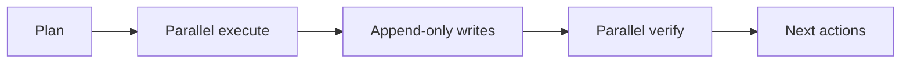

# stock_rtx4060 Quality & Observability Upgrade Plan

## Phase 1: Business Review — ✅ Approved (via /auto)

**Source:** `20260529_plan-doc.md` (provided by user at pipeline start)
**Project:** GAP Surgical Fixes + MLflow 3.x + OpenBB MCP Macro Data + Chaos Engineering

### 1.1 Problem Summary

5개 GAP spec 위반 + MLflow 체크포인트 미사용 + 매크로 데이터 부재 + 리스크 게이트 미검증 상태

### 1.2 Scope

**In scope:**
- `src/stock_rtx4060/paper_trading.py` — 5개 surgical fix
- `tests/test_paper_trading.py` — 5개 테스트 추가
- MLflow 업그레이드 (`requirements.in`) + `ensemble_model.py` + `ml/hpo.py` + `flows/research_weekly.py`
- `src/stock_rtx4060/data_lake/ingest/openbb_ingestor.py` (신규)
- `src/stock_rtx4060/advisors/orchestrator.py` — OpenBB MCP tool 추가
- `tests/test_chaos_paper_trading.py` — Chaos Engineering suite (신규)

**Out of scope:** 브로커 실행, 실매수, 기존 yfinance/pykrx 교체, OODA FSM, Shapley 앙상블

### 1.3 Approval

[x] Phase 1 승인 (초기 `/auto` 호출로 이미 승인됨 — 자동 파이프라인 진행)

---

## Phase 2: Engineering Review

### 2.1 Mermaid — Component Architecture

```mermaid
graph TD
  subgraph P0-GAP-Fixes
    PT[paper_trading.py]
    GAP1[evaluate_signal: score<56 → REJECT]
    GAP2[PaperDecision.to_record: timestamp added]
    GAP3[_write_run: max_open_positions >= 10 → REJECT]
    GAP4[_write_run: daily_new_count >= 3 → REJECT]
    GAP5[run: force_rerun+no reason → ValueError]
  end

  subgraph P3-MLflow
    EM[ensemble_model.py]
    HPO[ml/hpo.py]
    RW[flows/research_weekly.py]
    LOG1[mlflow.log_input(training)]
    LOG2[mlflow.log_artifact(checkpoints)]
    LOG3[mlflow.log_input(evaluation)]
  end

  subgraph P1-P6-OpenBB-MCP
    OBB[data_lake/ingest/openbb_ingestor.py]
    ORC[advisors/orchestrator.py]
    MAC[advisors/macro_regime.py]
    FRED[FRED series data]
    FOMC[FOMC calendar]
  end

  subgraph BONUS-Chaos
    CHAOS[tests/test_chaos_paper_trading.py]
    CHAOS1[price_spike injection]
    CHAOS2[signal_freeze]
    CHAOS3[latency injection]
    CHAOS4[correlation_shock]
    CHAOS5[fill_error]
  end

  GAP1 --> PT
  GAP2 --> PT
  GAP3 --> PT
  GAP4 --> PT
  GAP5 --> PT
  LOG1 --> EM
  LOG2 --> HPO
  LOG3 --> RW
  OBB --> ORC
  ORC --> MAC
  FRED --> OBB
  FOMC --> OBB
  CHAOS1 --> CHAOS
  CHAOS2 --> CHAOS
  CHAOS3 --> CHAOS
  CHAOS4 --> CHAOS
  CHAOS5 --> CHAOS
```

### 2.2 파일 변경 목록

| 파일 | 변경 유형 | 설명 |
|------|----------|------|
| `src/stock_rtx4060/paper_trading.py` | modify | GAP-01~05 5개 surgical fix |
| `tests/test_paper_trading.py` | modify | GAP-01~05 대응 테스트 5개 |
| `src/stock_rtx4060/ensemble_model.py` | modify | MLflow log_input(training) + OOS evaluation |
| `src/stock_rtx4060/ml/hpo.py` | modify | 체크포인트 artifact 로깅 |
| `flows/research_weekly.py` | modify | MLflow log_input(hpo_train_synthetic) |
| `requirements.in` | modify | mlflow>=3.0 추가 |
| `src/stock_rtx4060/data_lake/ingest/openbb_ingestor.py` | create | OpenBB MCP ingestor (신규) |
| `src/stock_rtx4060/advisors/orchestrator.py` | modify | OpenBB MCP tool 주입 |
| `src/stock_rtx4060/advisors/macro_regime.py` | modify | panel_fetcher 주입 |
| `tests/test_chaos_paper_trading.py` | create | Chaos Engineering suite |

### 2.3 의존성 & 순서

```
PR-G1: GAP-01 evaluate_signal fix        → 단일 파일, 순서 1
PR-G2: GAP-02 timestamp field             → 단일 파일, 순서 1 (PR-G1와 병렬)
PR-G3: GAP-03~05 position/daily limits   → 단일 파일, 순서 1 (PR-G1/G2와 병렬)
PR-M1: MLflow 3.x requirements.in        → MLflow 설치, 순서 2
PR-M2: ensemble_model.py log_input       → PR-M1 후, 순서 3
PR-M3: ml/hpo.py checkpoint artifact     → PR-M2와 병렬, 순서 3
PR-M4: flows/research_weekly.py OOS      → PR-M2와 병렬, 순서 3
PR-O1: openbb_ingestor.py               → 독립, 순서 4
PR-O2: orchestrator.py openbb tools      → PR-O1 후, 순서 5
PR-O3: macro_regime.py panel_fetcher    → PR-O1 후, 순서 5 (PR-O2와 병렬)
PR-C1: test_chaos_paper_trading.py      → 독립, 순서 6
```

### 2.4 테스트 전략

| 구분 | 대상 | 방법 |
|------|------|------|
| 단위 | GAP-01~05 각각 | `pytest tests/test_paper_trading.py -k "gap"` |
| 단위 | MLflow log_input | `pytest tests/test_ensemble_model.py -k "mlflow"` |
| 단위 | OpenBB ingestor | `pytest tests/test_openbb_ingestor.py -v` |
| 단위 | Chaos injection | `pytest tests/test_chaos_paper_trading.py -m chaos` |
| 통합 | CLI paper 트레이드 | `python main.py paper --run-date 2026-05-29 --verbose` |
| 회귀 | 전체 테스트 | `PYTHONPATH=.:src pytest --cov=stock_rtx4060 --cov-fail-under=75` |

### 2.5 리스크 & 완화

| 리스크 | 완화 |
|--------|------|
| GAP-01 score threshold 변경으로 기존 테스트 BREAK | additive-only fix, 기존 19개 테스트 불변 |
| MLflow 버전 충돌 (numpy 2.x) | requirements.in에 mlflow>=3.0 명시, numpy>=1.26,<3.0 유지 |
| OpenBB MCP 서버 없음 시 CI FAIL | `is_available()` graceful skip + `USE_OPENBB_MCP=0` 환경변수 |
| Chaos 테스트 비결정적 CI blocking | `pytest.mark.chaos` 마커, CI 기본 실행에서 제외 |
| force_rerun ValueError 회귀 | 기존 `test_paper_trading.py` 내 force_rerun 테스트 확인 |

### 2.6 검증 명령

```bash
# 1. 컴파일
python -m compileall src/stock_rtx4060

# 2. GAP fixes 검증
PYTHONPATH=.:src pytest tests/test_paper_trading.py -v -k "gap"

# 3. MLflow 변경 검증
PYTHONPATH=.:src pytest tests/test_ensemble_model.py -v -k "mlflow"

# 4. OpenBB ingestor 검증
PYTHONPATH=.:src pytest tests/test_openbb_ingestor.py -v 2>/dev/null || echo "SKIP (no openbb)"

# 5. 전체 테스트 (CI 기준)
PYTHONPATH=.:src pytest --cov=stock_rtx4060 --cov-fail-under=75 --tb=short -q
```


## Codex Documentation Update — 2026-05-28T20:44:00.663596+00:00

**Update policy:** existing content above this section is preserved. This section was appended after scanning code, documentation, config, and agent profile files.

**Purpose:** This section defines the next documentation maintenance loop based on verified repository evidence.

### Evidence inventory

**Source/code files sampled:**
- `api_server.py`
- `dashboard\stock_pred_v5.jsx`
- `flows\__init__.py`
- `flows\daily_krx.py`
- `flows\daily_us.py`
- `flows\research_weekly.py`
- `flows\utils.py`
- `main.py`
- `preview_server.py`
- `reports\dashboard_browser_verification\snapshot_fixture.js`
- `root_folder_snapshot\KEVPE_final_package\demo_kevpe_v2.py`
- `root_folder_snapshot\KEVPE_final_package\kevpe.py`

**Documentation files sampled:**
- `.codex\goals\dashboard-report-bridge.goal.md`
- `.codex\goals\mcp-openbb-audit-phase1.goal.md`
- `.continue\checks\01-financial-safety-boundary.md`
- `.continue\checks\02-backtest-integrity.md`
- `.continue\checks\03-recommendation-contract.md`
- `.continue\checks\04-secret-and-pii-safety.md`
- `.continue\checks\05-gpu-claim-validation.md`
- `.continue\checks\06-report-contract.md`
- `.continue\checks\07-architecture-boundary.md`
- `.continue\checks\08-test-and-verification.md`
- `20260507_plan-doc.md`
- `20260510_project-upgrade-report.md`

**Config/build files sampled:**
- `.claude\launch.json`
- `.codex\root-docs-dry-run.json`
- `.codex\root-docs-scan.json`
- `.github\workflows\ci.yml`
- `.pre-commit-config.yaml`
- `config\data_providers.example.json`
- `config\runtime_environment.json`
- `config\sector_map.json`
- `coverage.json`
- `docker-compose.dev.yml`
- `docs\AGENTS.md`
- `examples\kevpe_events_smoke.json`

**Agent profile files sampled:**
- No agent profile detected; this update records the absence explicitly.

### Mermaid graph



### Verification notes

- Append-only update generated by `root-docs-batch-update`.
- Code/config/doc/agent inventory counts: code=2337, docs=1091, config=698, agent_profiles=0.
- Follow-up verification should confirm that newly added text matches actual implementation paths listed above.
