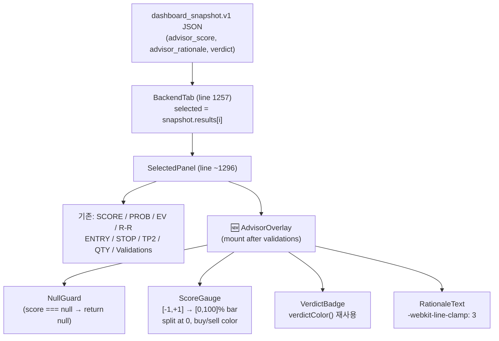

# AdvisorOverlay 컴포넌트 구현 계획

작성: 2026-05-10 | Phase: Best 1 of Project-Upgrade Report

---

## Phase 1 — CEO Review

### 1.1 문제 정의

- **현재 상태**: `dashboard_bridge.py`의 `_normalize_result()`는 `advisor_score`·`advisor_rationale` 필드를 `dashboard_snapshot.v1` JSON에 이미 포함해 API로 전달하지만, `stock_pred_v5.jsx`의 `BackendTab`이 해당 필드를 **전혀 렌더링하지 않는다**.
- **목표 상태**: `BackendTab`의 선택된 종목 패널 하단에 LLM Advisor 점수 게이지(−1 ~ +1), Verdict 배지, 근거 텍스트(3줄 클립)를 표시하는 `AdvisorOverlay` 컴포넌트를 추가한다.
- **영향 범위**: 프론트엔드 단일 파일 수정, 백엔드 변경 없음, 테스트 9개 신규 케이스.

### 1.2 제안 옵션

| 옵션 | 설명 | 공수(일) | 리스크 | 비용(AED) |
|------|------|---------|--------|----------|
| A — Inline | `BackendTab` 함수 내에 점수·근거 표시 로직을 인라인으로 추가 | 0.5 | 중복 코드 누적, 재사용 불가 | 0 |
| B — Component (권장) | 독립 `AdvisorOverlay` 함수 컴포넌트로 분리. null-guard, 게이지, 배지, 클립 텍스트 포함 | 1–2 | JSX 파일이 이미 1,862줄. 삽입 위치 오류 시 렌더 깨짐 | 0 |

### 1.3 추천 & 근거

**추천: 옵션 B.**

1. `verdictColor()`, `BackendKV` 등 기존 패턴과 일치하는 함수 컴포넌트로 분리해 재사용성과 테스트 용이성을 확보한다.
2. 데이터는 이미 API 응답에 포함되어 있으므로 백엔드 변경이 전혀 없고, 실패 시 컴포넌트를 제거하기만 하면 롤백된다.
3. Phase 2 SHAP·Risk Metrics 패널로 자연스럽게 확장 가능한 기반이 된다.

**롤백**: `AdvisorOverlay` 함수 정의 블록과 `<AdvisorOverlay ... />` 마운트 라인 두 곳만 제거하면 즉시 원상복구된다.

### 1.4 승인 요청

`[ ] Phase 1 승인` — 승인 전에는 Phase 2(구현)로 진행하지 않는다.

---

## Phase 2 — Engineering Review

### 2.1 Mermaid 아키텍처 다이어그램



### 2.2 파일 변경 목록

| 파일 | 변경 유형 | 설명 |
|------|----------|------|
| `dashboard/stock_pred_v5.jsx` | modify (1) | `AdvisorOverlay` 함수 컴포넌트 추가 (`verdictColor` 함수 직후) |
| `dashboard/stock_pred_v5.jsx` | modify (2) | `BackendTab` 내 validations 루프 직후에 `<AdvisorOverlay ... />` 마운트 |

> **⚠️ 백엔드 변경 없음**: `api_server.py`, `dashboard_bridge.py`, `tests/` 변경 불필요.
> `advisor_score`·`advisor_rationale`는 `dashboard_snapshot.v1`에 이미 존재한다.

### 2.3 구현 상세 — AdvisorOverlay JSX

삽입 위치: `stock_pred_v5.jsx` 의 `verdictColor` 함수(line ~1362) 직후.

```jsx
// ─── AdvisorOverlay: LLM Advisor 점수·근거 패널 ───────────────────────────
function AdvisorOverlay({ advisorScore, advisorRationale, verdict }) {
  if (advisorScore === null || advisorScore === undefined) return null;
  const score = parseFloat(advisorScore);
  if (isNaN(score)) return null;
  const pct = Math.round(((score + 1) / 2) * 100); // [-1,+1] → [0,100]%
  const barColor = score >= 0 ? C.buy : C.sell;
  const badgeStyle = {
    background: verdictColor(verdict),
    color: '#000',
    borderRadius: 4,
    padding: '1px 6px',
    fontSize: 10,
    fontWeight: 700,
    letterSpacing: '0.05em',
  };
  return (
    <div style={{ marginTop: 12, padding: '10px 12px', background: '#0d1117', borderRadius: 8, border: '1px solid #1e2a35' }}>
      {/* 헤더 */}
      <div style={{ display: 'flex', justifyContent: 'space-between', alignItems: 'center', marginBottom: 6 }}>
        <span style={{ fontSize: 10, color: '#8899aa', letterSpacing: '0.08em' }}>LLM ADVISOR</span>
        {verdict && <span style={badgeStyle}>{verdict}</span>}
      </div>
      {/* 게이지 바 */}
      <div style={{ position: 'relative', height: 6, background: '#1e2a35', borderRadius: 3, marginBottom: 6 }}>
        {/* 0 기준선 */}
        <div style={{ position: 'absolute', left: '50%', top: 0, width: 1, height: '100%', background: '#3a4a5a' }} />
        {/* 점수 막대 */}
        <div style={{
          position: 'absolute',
          left: score >= 0 ? '50%' : `${pct}%`,
          width: `${Math.abs(score) * 50}%`,
          height: '100%',
          background: barColor,
          borderRadius: 3,
          opacity: 0.85,
        }} />
      </div>
      {/* 점수 숫자 */}
      <div style={{ textAlign: 'right', fontSize: 11, color: barColor, fontWeight: 700, marginBottom: 4 }}>
        {score >= 0 ? '+' : ''}{score.toFixed(2)}
      </div>
      {/* 근거 텍스트 (3줄 클립) */}
      {advisorRationale && (
        <div style={{
          fontSize: 10,
          color: '#7788aa',
          lineHeight: 1.5,
          display: '-webkit-box',
          WebkitLineClamp: 3,
          WebkitBoxOrient: 'vertical',
          overflow: 'hidden',
        }}>
          {advisorRationale}
        </div>
      )}
    </div>
  );
}
```

마운트 위치: `BackendTab` 함수 내 validations 루프 직후, `</Panel>` 닫힘 바로 앞 (line ~1324).

```jsx
{/* 기존 validations 루프 끝 */}
          </div>
        )}
        {/* 🆕 LLM Advisor 오버레이 */}
        <AdvisorOverlay
          advisorScore={selected.advisor_score}
          advisorRationale={selected.advisor_rationale}
          verdict={selected.verdict}
        />
      </Panel>
```

### 2.4 의존성 & 순서

1. `stock_pred_v5.jsx` 백업 (git diff로 되돌리기 가능 — 별도 백업 불필요).
2. `verdictColor` 함수 위치(line ~1362) 확인.
3. `AdvisorOverlay` 컴포넌트 삽입 (modify 1).
4. `BackendTab` 내 마운트 삽입 (modify 2).
5. 개발 서버 재기동(`npm run dev`) 후 브라우저 확인.
6. FILE 모드와 API 모드 각각 테스트.

### 2.5 테스트 전략

| 케이스 | 기대 결과 |
|--------|----------|
| `advisor_score = 0.72`, `verdict = "GREEN"` | 게이지 오른쪽 72% fill, 녹색, `+0.72` 표시, GREEN 배지 |
| `advisor_score = -0.45`, `verdict = "AMBER"` | 게이지 왼쪽 22.5% fill, 빨간색, `-0.45` 표시, AMBER 배지 |
| `advisor_score = 0.0` | 게이지 0 위치, 녹색, `+0.00` |
| `advisor_score = null` | 컴포넌트 미렌더링 (null guard) |
| `advisor_score = undefined` | 컴포넌트 미렌더링 (null guard) |
| `advisor_score = "NaN"` | 컴포넌트 미렌더링 (isNaN guard) |
| `advisorRationale = null` | 점수 게이지만 표시, 텍스트 없음 |
| `advisorRationale = 긴 텍스트` | 3줄 클립 적용, overflow hidden |
| FILE 모드 스냅샷 파일 로드 | advisor_score 필드 있으면 표시 |

### 2.6 리스크 & 완화

| 리스크 | 완화 |
|--------|------|
| 기존 1,862줄 JSX 파일 — 삽입 위치 오류 | `verdictColor` 함수 라인 넘버를 Read로 재확인 후 Edit 실행 |
| `selected.advisor_score`가 항상 `null` (구버전 스냅샷) | null guard → 조용히 숨김. UX 영향 없음 |
| `-webkit-line-clamp` 미지원 브라우저 | `overflow: hidden` fallback으로 텍스트 잘림 처리됨 |
| `verdictColor()` API가 내부 변경될 경우 | 기존 함수 재사용이므로 변경 시 동반 수정 1줄 |
| `C.buy`/`C.sell` 색상 상수 이름 변경 | 파일 내 색상 상수 확인 후 적용 |

### 2.7 포스트 구현 검증

```bash
# 1. 구문 확인
node --input-type=module < dashboard/stock_pred_v5.jsx 2>&1 | head -5

# 2. 개발 서버 기동
cd root_folder_snapshot/stock-pred-v5 && npm run dev

# 3. FILE 모드로 스냅샷 로드 → BackendTab 클릭 → AdvisorOverlay 렌더 확인
# 4. advisor_score=null 케이스: 빈 결과 종목 선택 → 컴포넌트 미표시 확인
```

---

## 파이프라인 다음 단계

계획이 승인되면:
> `/mstack-implement` 또는 직접 구현 시작.
> 구현 완료 후 → `/mstack-qa` → `/mstack-ship`
