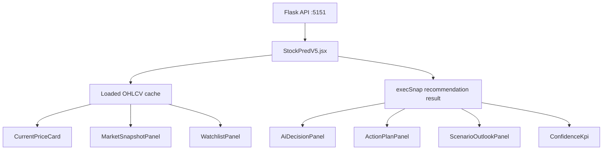

# Actual Dashboard Data Plan - 2026-05-30

## Phase 1: Business Review

### 1.1 Problem Definition

Current state: the Executive Dashboard v2.1 UI matches the Kraken-style mockup, but several panels still contain sample/mock values that can be mistaken for real market data.

Target state: every dashboard value must either come from the live API, the loaded OHLCV cache, or the recommendation snapshot; missing fields must render as unavailable instead of using sample data.

Impact scope: 1 React shell file, 8 executive dashboard components, and frontend build/smoke verification.

### 1.2 Options

| Option | Description | Effort (days) | Risk | Cost (AED) |
|---|---|---:|---|---:|
| A | Remove all mock fallbacks and render unavailable states when data is absent. | 0.5 | Some panels may look emptier until backend fields are available. | 0 |
| B | Compute additional values from OHLCV where safe, and render unavailable for fields not derivable from current data. | 0.75 | Derived values must be clearly limited to loaded OHLCV data. | 0 |
| C | Extend backend API to provide every missing fundamental/news/scenario field. | 2+ | Larger backend surface and test scope. | 0 |

### 1.3 Recommendation

Recommended option: B.

Reason: it removes false data immediately, preserves the current layout, and uses already-loaded OHLCV plus recommendation snapshot data without expanding backend scope.

Rollback: revert the executive dashboard component changes and restore the previous fallback-rendering behavior.

- [x] Phase 1 approved by direct user instruction to implement.

## Phase 2: Engineering Review

### 2.1 Module Relationship

### 2.2 File Change List

| File | Change type | Description |
|---|---|---|
| `root_folder_snapshot/stock-pred-v5/src/StockPredV5.jsx` | modify | Pass actual OHLCV/snapshot-derived values into executive components. |
| `root_folder_snapshot/stock-pred-v5/src/components/CurrentPriceCard.jsx` | modify | Use actual sparkline and actual as-of timestamp. |
| `root_folder_snapshot/stock-pred-v5/src/components/MarketSnapshotPanel.jsx` | modify | Derive open/high/low/close/volume/range from loaded OHLCV. |
| `root_folder_snapshot/stock-pred-v5/src/components/ConfidenceKpi.jsx` | modify | Remove 72% fallback. |
| `root_folder_snapshot/stock-pred-v5/src/components/RiskRewardKpi.jsx` | modify | Remove 2.36 fallback. |
| `root_folder_snapshot/stock-pred-v5/src/components/ModelScoresPanel.jsx` | modify | Render backend evidence only. |
| `root_folder_snapshot/stock-pred-v5/src/components/AiDecisionPanel.jsx` | modify | Remove default bullish rationale/BUY verdict. |
| `root_folder_snapshot/stock-pred-v5/src/components/NotebookNewsAnalysis.jsx` | modify | Remove sample Apple news fallback. |
| `root_folder_snapshot/stock-pred-v5/src/components/NewsTimelinePanel.jsx` | modify | Remove sample news timeline fallback. |
| `root_folder_snapshot/stock-pred-v5/src/components/ScenarioOutlookPanel.jsx` | modify | Remove sample scenario fallback. |
| `root_folder_snapshot/stock-pred-v5/src/components/WatchlistPanel.jsx` | modify | Remove sample watchlist rows and confidence fallback. |

### 2.3 Dependencies and Order

1. Patch display components to render actual-only values.
2. Patch `StockPredV5.jsx` to pass OHLCV, snapshot, and as-of fields.
3. Run static grep for removed mock values.
4. Run frontend build.
5. Run local browser/smoke verification.

Parallel checks already completed: `docs/LAYOUT.md`, root `COMPONENT_LAYOUT.md`, and source mock-value grep.

### 2.4 Test Strategy

Unit tests: no dedicated React test harness exists for these components.

Integration test: run `npm run build` in `root_folder_snapshot/stock-pred-v5`.

Runtime smoke test: load `http://127.0.0.1:5173/` and confirm core dashboard labels render.

Mock-data regression check: grep source for removed hardcoded sample values and sample news text.

### 2.5 Risks and Mitigation

Performance: derived OHLCV summaries operate on the already-loaded client array only.

Compatibility: missing backend fields now show `—` or unavailable text; this can change visual density.

Safety: report-only labels remain unchanged and no broker execution path is added.
