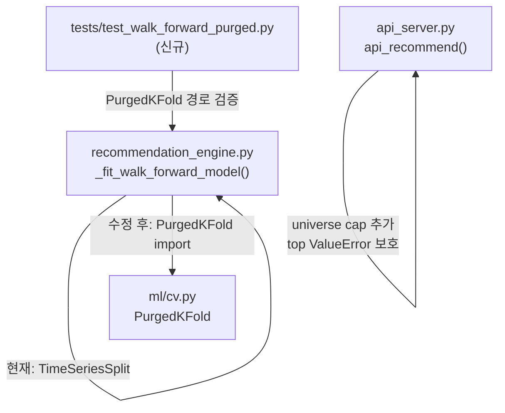

# Plan — P0 투자 가능성 수정 (2026-05-11)

> 출처: `/orchestrate 실제로 투자 가능한지 검증하라` 결과 → AMBER 판정 P0 항목 2개

---

## Phase 1 — CEO Review

### 1.1 문제 정의

현재 추천 엔진의 CV 분할기가 `TimeSeriesSplit`(레이블 정화 없음)으로 구현되어 있어
OOF AUC/accuracy가 낙관적으로 편향될 수 있으며, API endpoint가 임의 크기의 universe를
제한 없이 수용해 장시간 blocking 및 stack trace 노출 위험이 있다.
→ `PurgedKFold` 교체 + universe 크기 상한 추가로 연구 스크리닝 도구 신뢰성 확보.

**영향 범위**: 코드 2개 파일, 테스트 1개 파일(신규). 사용자 수 1명(로컬 개인). 다운타임 없음.

### 1.2 제안 옵션

| 옵션 | 설명 | 공수(일) | 리스크 | 비용 |
|------|------|---------|--------|------|
| **A (권장)** | `PurgedKFold` 교체 + API universe cap 30 + `top` 파싱 보호 | 0.5 | 낮음 — 기존 `PurgedKFold` 클래스 이미 존재 | 0 |
| B | `TimeSeriesSplit` 유지, 테스트 주석만 추가 | 0.1 | 문제 미해결, AMBER 지속 | 0 |

### 1.3 추천 & 근거

옵션 A 추천. `PurgedKFold`는 `src/stock_rtx4060/ml/cv.py`에 이미 구현되어 있고
`EnsemblePredictor`에서 이미 사용 중 — 교체 위험 최소. universe cap은 4줄 추가로 끝남.
롤백: `TimeSeriesSplit` 한 줄 복원으로 즉시 되돌릴 수 있음.

### 1.4 승인 요청

- [x] Phase 1 승인 ✅ Done (2026-05-11)

---

## Phase 2 — Engineering Review

### 2.1 아키텍처 다이어그램



### 2.2 파일 변경 목록

| 파일 | 변경 유형 | 설명 |
|------|----------|------|
| `src/stock_rtx4060/recommendation_engine.py` | modify | `TimeSeriesSplit` → `PurgedKFold`; `embargo_pct` = `horizon / len(X)` 클램프; `import` 추가 |
| `api_server.py` | modify | `universe` 파싱 후 크기 검증(>30 → 400); `top = int(...)` try 블록 안으로 이동 |
| `tests/test_walk_forward_purged.py` | create | `_fit_walk_forward_model` 호출 시 `PurgedKFold` 분기가 실행됨을 검증 |

> ⚠️ **파일명 충돌 체크**: `tests/test_walk_forward_purged.py` — 존재하지 않음(확인됨). 생성 가능.

### 2.3 의존성 & 순서

1. `recommendation_engine.py` 수정 (독립)
2. `api_server.py` 수정 (독립 — 1과 병렬 가능)
3. `tests/test_walk_forward_purged.py` 생성 (1 완료 후)
4. `pytest --cov-fail-under=85` 전체 실행

### 2.4 상세 변경 스펙

#### (A) `recommendation_engine.py` — `_fit_walk_forward_model()`

**현재 (line 20, 357):**
```python
from sklearn.model_selection import TimeSeriesSplit
...
splitter = TimeSeriesSplit(n_splits=n_splits, gap=gap)
for train_idx, test_idx in splitter.split(X):
```

**수정 후:**
```python
# line 20 근처 import 섹션에 추가
from .ml.cv import PurgedKFold
...
# line 354–363 교체
model_cfg = _model_config(cfg, horizon)
n_splits = min(cfg.xgb_splits, max(2, len(X) // 120))
# embargo_pct: horizon / total_rows, 최소 0.01 최대 0.10
embargo_pct = float(np.clip(horizon / max(len(X), 1), 0.01, 0.10))
splitter = PurgedKFold(n_splits=n_splits, embargo_pct=embargo_pct)
groups = np.arange(len(X), dtype=int) + horizon
oof = pd.Series(np.nan, index=X.index, dtype=float)
accs: list[float] = []
aucs: list[float] = []
models_used: list[str] = []

for train_idx, test_idx in splitter.split(X, groups=groups):
    ...  # 나머지 루프 내용 동일
```

> `gap` 변수 제거: `PurgedKFold`는 `embargo_pct`로 gap을 내부 처리함.
> `RecommendationConfig.xgb_splits` 기본값 미변경.
> `final_model`/`latest_prob` 계산 라인(373-374) 변경 없음.

#### (B) `api_server.py` — `api_recommend()`

**현재 (line 395–398):**
```python
universe = request.args.get("universe")
track = request.args.get("track", "BOTH")
period = request.args.get("period", "3y")
top = int(request.args.get("top", 5))   # ← try 바깥
```

**수정 후:**
```python
universe = request.args.get("universe")
track = request.args.get("track", "BOTH")
period = request.args.get("period", "3y")

# universe 크기 검증 (try 블록 진입 전)
_tickers = parse_universe(universe)
if len(_tickers) > 30:
    return jsonify({"error": f"universe too large: {len(_tickers)} tickers (max 30)"}), 400

try:
    top = int(request.args.get("top", 5))
    synthetic = ...
    ...
    config = RecommendationConfig(
        universe=_tickers,   # ← 이미 파싱된 리스트 재사용
        ...
    )
```

### 2.5 테스트 전략

**신규: `tests/test_walk_forward_purged.py`**
- `test_uses_purged_kfold()`: `_fit_walk_forward_model()` 호출 → 반환 dict에 `"oof_probs"` 키 존재 + `oof_coverage > 0` 검증
- `test_oof_no_lookahead()`: OOF probs의 첫 fold test-index가 모든 training index보다 크거나 같음을 검증 (look-ahead 부재 확인)
- `test_api_universe_cap()`: `/api/recommend?universe=` 31개 ticker → HTTP 400 반환 검증

**기존 테스트 깨질 가능성**:
- `test_purged_kfold.py` — 영향 없음 (cv.py 변경 없음)
- `test_ensemble_model_purged.py` — 영향 없음 (ensemble_model.py 변경 없음)
- `test_core.py` — `_fit_walk_forward_model` 내부 경로 변경; 반환 dict 키 동일하므로 영향 없음
- 커버리지 목표: 85% 유지 (신규 테스트 3개로 충분히 보완)

### 2.6 리스크 & 완화

| 리스크 | 완화 |
|--------|------|
| `PurgedKFold`가 소규모 데이터(~80행)에서 split 실패 | `n_splits = min(cfg.xgb_splits, max(2, len(X)//120))` 클램프 유지; `PurgedKFold`도 `n_splits<2` 시 ValueError — 기존 80행 체크가 먼저 걸림 |
| `embargo_pct` 변경으로 OOF coverage 하락 → `AMBER_WATCHLIST` 증가 | 0.10 상한으로 클램프; smoke test(`--synthetic`)로 SYNTH-A 결과 확인 필요 |
| `parse_universe()` 두 번 호출 | `_tickers` 변수에 저장 후 `RecommendationConfig(universe=_tickers)` 재사용 — 불필요한 이중 파싱 없음 |
| `gap` 변수 제거로 반환 dict의 `"gap"` 키 소멸 | 반환 dict에서 `"gap"` 제거; 수신측 코드에서 `.get("gap", 0)` 패턴 확인 필요 |

---

## 검증 명령 (구현 완료 후)

```bash
# 1. 문법 체크
PYTHONPATH=.:src python -m compileall src/stock_rtx4060 api_server.py

# 2. 전체 테스트 + 커버리지
PYTHONPATH=.:src pytest --cov=stock_rtx4060 --cov-fail-under=85 --tb=short -q

# 3. Offline smoke
PYTHONPATH=.:src python main.py --recommend --synthetic --universe SYNTH-A --track S --top 1 --output-dir reports/smoke_p0

# 4. API universe cap smoke
curl "http://localhost:5151/api/recommend?universe=AAPL,MSFT,NVDA,TSLA,AMZN,GOOGL,META,BABA,NFLX,DIS,BA,GE,GM,F,XOM,CVX,JPM,GS,MS,BAC,WMT,TGT,COST,HD,LOW,CAT,DE,MMM,UNH,PFE,MRK"
# → HTTP 400 expected
```

---

_Generated by /mstack-plan · 2026-05-11_
