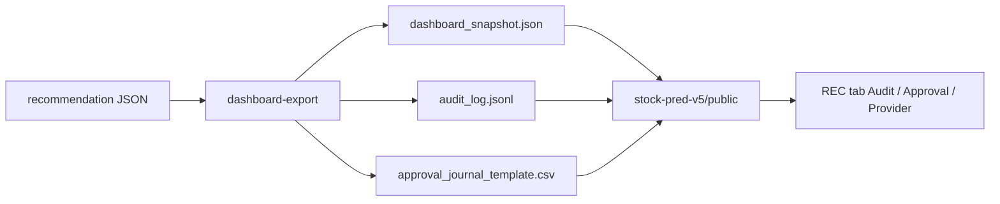

# Changelog

<!-- ⚠️ ROOT-PINNED DOCUMENT — DO NOT MOVE
This file must remain in: C:\Users\jichu\Downloads\주식\
Moving this file to any subdirectory is PROHIBITED.
Managed by: Document Architecture Policy v1.0
Last verified: 2026-05-03
-->

All notable changes inferred from this repository state are documented here.

This file follows the Keep a Changelog section style. Git history was not available during this audit, so entries below are based on current files, generated evidence, and current-session verification.

## [Unreleased]

### 2026-05-11 — P0 Fix: PurgedKFold 교체 + API universe cap (fix P0)

#### Changed

- **`src/stock_rtx4060/recommendation_engine.py`** — `_fit_walk_forward_model()` 내부
  `TimeSeriesSplit` → `PurgedKFold` 교체.  `embargo_pct = clip(horizon/len(X), 0.01, 0.10)`,
  `groups = arange(N) + horizon` 전달.  반환 dict `"gap"` 키는
  `int(floor(len(X) * embargo_pct))`로 재계산해 backward-compat 유지.

#### Added

- **`api_server.py`** — `/api/recommend` endpoint에 universe 크기 상한 추가:
  31+ 티커 요청 시 HTTP 400 `{"error": "universe too large: N tickers (max 30)"}` 반환.
  `top = int(...)` 파싱을 `try` 블록 안으로 이동해 `ValueError` 처리 보완.
- **`tests/test_walk_forward_purged.py`** (신규) — 3개 테스트:
  `test_uses_purged_kfold`, `test_oof_no_lookahead`, `test_api_universe_cap`.

#### QA

- `pytest --cov-fail-under=85`: 전체 통과, coverage **86.03%**.
- Offline smoke SYNTH-A Track-S PASS.
- 커밋 `26451eb` pushed to `origin/main` (2026-05-11).

---

### 2026-05-10 — LLM Advisor Toggle + /api/recommend advisor params (feat P6)

This section records the P6 LLM Advisor wiring to the live dashboard API and the corresponding
React UI toggle added to the REC panel.

#### Added

- **`stock_rtx4060_unified/api_server.py`** — `advisor_run` and `advisor_blend_weight` query
  params wired to `/api/recommend`; `RecommendationConfig` now receives both values from the
  request.  Silently disabled (`advisor_run=False`) when `ANTHROPIC_API_KEY` is absent so
  existing callers remain unaffected.
- **`root_folder_snapshot/stock-pred-v5/src/StockPredV5.jsx`** — `advisorEnabled` boolean state
  (default `false`) added.  `recApiUrl` useMemo injects `advisor_run=1&advisor_blend_weight=0.3`
  when `advisorEnabled` is `true`, triggering a fresh `/api/recommend` call with advisor blend
  active.  A purple pill toggle ("LLM ADVISOR") is rendered inside the REC panel below the "API
  REQUEST DEFAULTS" box; visible only in API source mode.

#### QA

- 1,210 tests passed, 17 skipped — zero regression (pytest, 2026-05-10).
- `df6468f` committed and pushed to `origin/main`.

---

### 2026-05-03 root documentation sync for dashboard public export

This section records the root-document update that aligns `SYSTEM_ARCHITECTURE.md`, `SYSTEM_LAYOUT.md`, `README.md`, `plan.md`, and this changelog with the latest verified dashboard public export workflow.

#### Added

- Added the latest verified file-based dashboard bridge to `README.md`, `SYSTEM_ARCHITECTURE.md`, `SYSTEM_LAYOUT.md`, and `plan.md`.
- Documented `stock_rtx4060_unified/main.py dashboard-export` with `--public-dir` and `--approval-journal`.
- Documented the public dashboard files: `stock-pred-v5/public/dashboard_snapshot.json`, `stock-pred-v5/public/audit_log.jsonl`, and `stock-pred-v5/public/approval_journal_template.csv`.
- Documented that the `stock-pred-v5` REC tab shows Audit / Approval / Provider summary panels together with recommendation cards.

#### Verified

- Verified backend export help with `stock_rtx4060_unified\.venv\Scripts\python.exe main.py dashboard-export --help`.
- Verified dashboard browser behavior with `npx playwright test tests/kevpe-dashboard.spec.js --reporter=line`.
- Verified dashboard production build with `npm run build`.
- Verified dashboard npm security status with `npm audit`.
- Verified document cross-checks across `SYSTEM_ARCHITECTURE.md`, `SYSTEM_LAYOUT.md`, `CHANGELOG.md`, `README.md`, and `plan.md`.

### 2026-05-03 dashboard-export public assets option

This section records the backend export update that lets `stock_rtx4060_unified` publish all files needed by the dashboard REC tab into a Vite `public/` directory.

#### Added

- Added `--public-dir` to `stock_rtx4060_unified` `dashboard-export`.
  - When set, the command copies `dashboard_snapshot.json`, `audit_log.jsonl`, and `approval_journal_template.csv` into the target dashboard public directory.
  - This supports the REC tab `Audit / Approval / Provider` summary panel without requiring browser access outside `stock-pred-v5/public/`.
- Added `--approval-journal` to `dashboard-export`.
  - This lets the caller pass an explicit `approval_journal_template.csv` path.
  - If omitted, the exporter searches near the recommendation JSON output for `approval_journal_template.csv`.
- Added `export_dashboard_public_assets()` in `stock_rtx4060_unified/src/stock_rtx4060/dashboard_bridge.py`.
- Added backend test coverage for snapshot, audit log, and approval journal public asset export.

#### Verified

- `stock_rtx4060_unified\.venv\Scripts\python.exe -m pytest -q` passed 21 tests.
- `stock_rtx4060_unified\.venv\Scripts\python.exe -m compileall src tests` passed.
- `stock_rtx4060_unified\.venv\Scripts\python.exe main.py dashboard-export --help` shows `--public-dir` and `--approval-journal`.
- Real export smoke copied all three public files to `stock-pred-v5/public/`:
  - `dashboard_snapshot.json`
  - `audit_log.jsonl`
  - `approval_journal_template.csv`
- `stock-pred-v5` Playwright test passed 2/2 after the public export.
- `stock-pred-v5` build passed with Vite 7.3.2.
- `npm audit` returned `found 0 vulnerabilities`.

#### Partial

- The dashboard public export is command-driven. It does not watch report folders for new files.
- The Vite dashboard build still reports the existing large chunk warning above 500 kB.

### 2026-05-03 REC tab Audit / Approval / Provider summary panel

This section records the dashboard REC tab operational summary update.

#### Added

- Added a compact Audit / Approval / Provider summary panel to `stock-pred-v5/src/components/RecommendationPanel.jsx`.
  - Audit summary reads `/audit_log.jsonl` when available and displays event count, provider event count, success count, latest provider, latest status, and latest ticker.
  - Approval summary reads `/approval_journal_template.csv` when available and displays pending review count, row count, and broker execution boundary status.
  - Provider summary combines the latest audit provider event with `dashboard_snapshot.v1` config fields, including provider, ticker, model kind, and XGBoost device.
- Added `stock-pred-v5/public/approval_journal_template.csv` from the latest verified Ops v1 approval journal so the browser can display approval state without filesystem access outside `public/`.
- Extended `stock-pred-v5/tests/kevpe-dashboard.spec.js` to verify the new `AUDIT`, `APPROVAL`, and `PROVIDER` summary cards in both FILE and IMPORT flows.

#### Fixed

- Fixed a REC tab render crash caused by reading `auditSummary.latestProvider` before the asynchronous audit file load completed.
- Narrowed Playwright text selectors to exact matches for duplicated words such as `APPROVAL` and `SUCCESS`.

#### Verified

- `npm run build` completed successfully with Vite 7.3.2.
- `npx playwright test tests/kevpe-dashboard.spec.js --reporter=line` passed 2/2 browser tests.
- `npm audit` returned `found 0 vulnerabilities`.
- Browser screenshot evidence shows `AUDIT`, `APPROVAL`, and `PROVIDER` cards above the recommendation list.

#### Partial

- The summary panel reads browser-public files only. If a new `audit_log.jsonl` or `approval_journal_template.csv` is generated outside `stock-pred-v5/public/`, it must be copied or served before the browser can display it.
- Vite still reports the existing large chunk warning for `assets/index-*.js` above 500 kB.

### 2026-05-03 dashboard import button implementation

This section records the approved Option B dashboard bridge update: keep the existing fixed FILE mode and add an IMPORT button that lets the user select a real `dashboard_snapshot.json` file from the browser.

#### Added

- Added an IMPORT control to `stock-pred-v5/src/components/RecommendationPanel.jsx`.
  - Existing FILE mode still reloads the fixed `/dashboard_snapshot.json` file.
  - New IMPORT mode opens a browser file chooser and imports a local JSON file selected by the user.
  - Imported files are validated as `dashboard_snapshot.v1` and must include a `results` array.
  - The dashboard shows `IMPORTED · <file name>` after a successful import.
- Added a Playwright browser smoke test for the IMPORT workflow in `stock-pred-v5/tests/kevpe-dashboard.spec.js`.
  - Test input: `stock_rtx4060_unified/reports/kevpe_event_smoke/dashboard_snapshot.json`
  - Browser evidence: `stock_rtx4060_unified/reports/kevpe_event_smoke/dashboard_kevpe_import_badge.png`

#### Verified

- FILE mode browser smoke: `npx playwright test tests/kevpe-dashboard.spec.js --reporter=line` verified the existing fixed dashboard snapshot still renders `KEVPE AMBER`.
- IMPORT mode browser smoke: the same Playwright run selected `dashboard_snapshot.json` through the new IMPORT button and verified `IMPORTED · dashboard_snapshot.json`, `KEVPE AMBER`, `E[RV]=-1.3%`, and `CI [-3.3, 0.7]`.
- Dashboard production build: `npm --prefix .\stock-pred-v5 run build` completed successfully.
- Dashboard npm audit follow-up: `npm audit` previously reported 2 moderate findings through `vite@5.4.21` and `esbuild@0.21.5`; updating `vite` to `^7.3.2` resolved the audit result to `found 0 vulnerabilities`.

#### Partial

- The Vite build still reports the existing large chunk warning for `assets/index-*.js` above 500 kB. The warning does not block the build, but bundle splitting remains a future optimization.
- `npm install --save-dev vite@^7.3.2` reported an npm cleanup warning because an old `node_modules\@esbuild\.win32-x64-*` executable was locked by Windows. Runtime verification still passed, and `npm audit` reports 0 vulnerabilities.

### 2026-05-03 full verification follow-up

This section records the current-session verification and small compatibility fixes after checking whether the features documented in this changelog run end to end.

#### Added

- Added KEVPE event input wiring from CLI to recommendation reports and dashboard snapshots.
  - CLI option: `--kevpe-events <json-or-csv>`
  - Config field: `RecommendationConfig.kevpe_events`
  - Event loader: JSON list, JSON object with `events`, and CSV rows are supported.
  - Ticker filtering: event rows with `ticker` only apply to the matching recommendation ticker; rows without `ticker` are treated as shared market events.
  - Example file: `stock_rtx4060_unified/examples/kevpe_events_smoke.json`
- Added root `run.ps1` as a thin wrapper that delegates to `stock_rtx4060_unified/run.ps1`.
  - Reason: this changelog already recorded a root wrapper, but the root file was missing during verification.
- Updated root `main.py` as a compatibility wrapper that delegates to `stock_rtx4060_unified/main.py` through the unified package `.venv` when present.
  - Reason: the previous root `main.py self-test` path still targeted the old `workspaces` package and failed outside the unified folder.
- Added CLI provider choices for `pykrx` and `fdr` in the active unified package.
  - Patched files: `stock_rtx4060_unified/src/stock_rtx4060/main.py`, `stock_rtx4060_unified/src/stock_rtx4060/recommendation_engine.py`
  - Reason: provider implementations existed in `data_providers.py`, but `recommend` and `ops-v1` CLI arguments only allowed `auto`, `synthetic`, `yfinance`, and `openbb`.
- Updated the KEVPE adapter path discovery and dynamic import registration.
  - Patched file: `stock_rtx4060_unified/src/stock_rtx4060/kevpe_adapter.py`
  - Reason: the adapter did not find the root-level `KEVPE_final_package`, and dynamic import did not register the module name needed by dataclass initialization.

#### Verified

- KEVPE event smoke: `.\run.ps1 recommend --data-provider synthetic --universe "SYNTH-A" --top 1 --model-kind logistic --kevpe-events examples\kevpe_events_smoke.json --output-dir reports\kevpe_event_smoke` generated a recommendation report with `kevpe_available=true`, `kevpe_regime=AMBER`, and `kevpe_score=0.6725`.
- Dashboard KEVPE bridge: `.\run.ps1 dashboard-export --recommendation-json <kevpe_event_smoke json> --output reports\kevpe_event_smoke\dashboard_snapshot.json` preserved `kevpe_available=true`, `kevpe_regime=AMBER`, and `kevpe_score=0.6725`.
- Regression tests: `pytest -q` passed with 20 tests after adding the KEVPE event-to-dashboard test.
- Core test suite: `pytest -q` in `stock_rtx4060_unified/` passed with 19 tests.
- CLI self-test: `.\run.ps1 self-test` and `python main.py --test` passed.
- Synthetic recommendation: `.\run.ps1 recommend --data-provider synthetic --universe "SYNTH-A,SYNTH-B" --top 2 --model-kind logistic` generated Markdown, JSON, and audit-log outputs.
- Ops v1 workflow: `.\run.ps1 ops-v1 --data-provider synthetic --universe "SYNTH-A,SYNTH-B" --top 2 --model-kind logistic` generated recommendation reports, daily brief, approval template, ZERO log, summary JSON, and audit log.
- XGBoost GPU: `.\run.ps1 env --xgboost` detected RTX 4060 and confirmed CUDA-capable XGBoost status.
- Benchmark: `.\run.ps1 benchmark --rows 800 --repeats 1 --include-gpu` generated CPU/GPU benchmark reports.
- TensorFlow CPU: `.\run.ps1 tensorflow-check` passed in `.venv-tf312`.
- TensorFlow WSL GPU: `.\run.ps1 tensorflow-gpu-wsl-check` passed with GPU detection, matrix multiplication, and LSTM smoke.
- Dashboard build and bridge: `npm --prefix .\stock-pred-v5 run build`, dashboard HTTP check, bridge browser smoke, and `dashboard-export` passed.
- API server: `/api/health` and `/api/recommend?synthetic=1&universe=SYNTH-A&top=1&model_kind=logistic` returned HTTP 200.
- yfinance provider: `.\run.ps1 recommend --data-provider yfinance --universe "AAPL" --top 1 --model-kind logistic` generated an AAPL recommendation report.
- FDR provider: `.\run.ps1 recommend --data-provider fdr --universe "AAPL" --top 1 --model-kind logistic` generated an AAPL recommendation report.
- PyKRX provider: after patching the provider call to the installed PyKRX API, `.\run.ps1 recommend --data-provider pykrx --universe "005930.KS" --period 2y --top 1 --model-kind logistic` generated a Samsung Electronics recommendation report.
- OpenBB provider: `.\run.ps1 recommend --data-provider openbb --provider-config config\data_providers.example.json --universe "AAPL" --period 2y --top 1 --model-kind logistic` generated an AAPL recommendation report through `openbb:yfinance`.
- Root wrapper: `.\run.ps1 recommend --data-provider synthetic --universe "SYNTH-A" --top 1 --model-kind logistic` and `python main.py recommend --data-provider synthetic --universe "SYNTH-A" --top 1 --model-kind logistic` both generated synthetic recommendation reports from the root folder.
- KEVPE package: `pytest .\KEVPE_final_package\test_kevpe_v2.py -q` passed 18 tests, `demo_kevpe_v2.py` ran end to end, and `KevpeAdapter().is_available()` returned `True`.

#### Partial

- OpenBB provider path requires enough history for the model gate. A 1-year AAPL run reached OpenBB successfully but failed the model minimum-row gate; the 2-year AAPL run passed and generated a recommendation report.
- KEVPE bridge fields are present in recommendation JSON and dashboard snapshot outputs, and the KEVPE package now imports through `KevpeAdapter`. The recommendation smoke still shows `kevpe_available=false` when no event input is supplied, so full event-to-recommendation signal wiring remains a separate integration scope.
- PyKRX provider requires enough history for the model gate. A 1-year Samsung Electronics run reached PyKRX successfully but failed the model minimum-row gate; the 2-year run passed and generated a recommendation report.

### 2026-05-03 session update (10:46 UTC)

This section records work completed during the 2026-05-03 afternoon session.

#### Plan document unification

- Created root `plan.md` as a unified project plan integrating 9 plan documents across 4 subfolders
  - Source documents: `docs/plan.md`, `docs/plan_rev.md`, `docs/A3_MERGE_PLAN.md`, `docs/MOVE_PLAN.md`, `stock-pred-v5/docs/plan.md`, `stock_rtx4060_unified/docs/plan.md`, `stock_rtx4060_unified/docs/plan_dashboard_bridge_2026-05-03.md`, `stock_rtx4060_unified/docs/plan_dashboard_bridge_risk_mitigation_2026-05-03.md`, `stock_rtx4060_unified/docs/plan_real_data_ops_upgrade_2026-05-03.md`
  - Unified plan structure: §0 문서메타 → §1 현황 → §2 차이점 → §3 실행계획 → §4 액션 → §5 이력
  - Resolved conflicts: Phase count (7 vs 5 → 7 adopted), Bucket count (5 vs 6 → 6 with Opportunistic Cash adopted)
  - Flagged unresolved items: MOVE_PLAN path mismatch, Real Data Ops Upgrade approval pending

- Created `docs/PLAN_GPU_VALIDATION_2026-05-03.md` as the GPU validation and Phase 2 execution plan
  - Mermaid architecture: nvidia-smi → TensorFlow GPU check → WSL2 fallback → CPU fallback

#### GPU validation (Phase 1)

| Check | Result |
|-------|--------|
| `nvidia-smi` | ✅ NVIDIA GeForce RTX 4060 Laptop, Driver 581.83, CUDA 13.0, VRAM 8188MiB |
| TensorFlow GPU | ❌ Not tested (Python 3.14.4 incompatible) |
| XGBoost GPU (CUDA) | ✅ `device='cuda'` training succeeded |

#### Python environment (Phase 2)

| Package | Status | Version |
|---------|--------|---------|
| Python | ⚠️ 3.14.4 (TensorFlow incompatible — 3.11 recommended) | — |
| XGBoost | ✅ Installed | 3.2.0 |
| XGBoost GPU | ✅ CUDA acceleration confirmed | device='cuda' |
| pandas | ✅ Installed | 3.0.2 |
| numpy | ✅ Installed | 2.4.4 |
| scikit-learn | ✅ Installed | 1.8.0 |
| yfinance | ✅ Installed | 1.3.0 |
| TensorFlow | ❌ Not available (no Python 3.14.4 compatible build) | — |

#### Phase 3 readiness

- XGBoost GPU backtest pipeline: ready with Python 3.14.4
- TensorFlow/LSTM: requires Python 3.11 installation
- CLI (`python main.py --synthetic`): functional with current environment

### 2026-05-03 supplemental update

This section is append-only. Earlier entries are retained for audit history, and the items below record the newer state directly inspected on 2026-05-03.

### Added

- Added Real Data Ops Phase 1-5 implementation evidence from the active unified package:
  - canonical Phase 5 readiness document: `stock_rtx4060_unified/docs/REAL_DATA_OPS_PHASE5_IMPLEMENTATION_READINESS_2026-05-03.md`
  - package changelog entry: `stock_rtx4060_unified/CHANGELOG.md`
  - implemented groups recorded there: Task Group A (Provider & Data) and Task Group B (Validation Gates)
  - current-session verification: FDR import OK, PyKRX import OK, `main.py --test` PASS, `pytest -q` 19/19 PASS, and G-01/G-02/G-05/G-07 gate smoke PASS
- Added isolated TensorFlow CPU/LSTM environment evidence:
  - plan/result document: `docs/PLAN_TENSORFLOW_INSTALL_2026-05-03.md`
  - environment path: `stock_rtx4060_unified/.venv-tf312`
  - Python: 3.12.4
  - TensorFlow: 2.21.0
  - validation: TensorFlow import, CPU device detection, and one-epoch LSTM fit/predict smoke passed
- Added `stock_rtx4060_unified/run.ps1` TensorFlow wrapper commands:
  - `.\run.ps1 tensorflow-check`
  - `.\run.ps1 tf-check`
  - `.\run.ps1 tf-smoke`
  - these commands use `.venv-tf312` directly and do not alter the normal `.venv`/`main.py` execution path
- Added WSL TensorFlow GPU wrapper commands:
  - `.\run.ps1 tensorflow-gpu-wsl-check`
  - `.\run.ps1 tf-gpu-wsl`
  - `.\run.ps1 tf-gpu-smoke`
  - these commands use WSL Ubuntu and `/root/.venvs/stock-rtx4060-tf-gpu`
  - the wrapper sets `LD_LIBRARY_PATH` from the WSL NVIDIA pip libraries before TensorFlow starts
  - validation: TensorFlow `2.21.0`, `TF_GPUS=["/physical_device:GPU:0"]`, `GPU_MATMUL=PASS`, and `LSTM_SMOKE=PASS`
- Added root documentation cross-check evidence from the 2026-05-03 four-root document scan:
  - scanned roots: `stock-pred-v5/`, `stock_rtx4060_unified/`, `continue-main/`, and root `docs/`
  - document count: 517 `.md`, `.mdx`, `.txt`, and `.rst` files after excluding cache, build, virtual environment, and Git metadata folders
  - root documents cross-checked: `README.md`, `SYSTEM_ARCHITECTURE.md`, `SYSTEM_LAYOUT.md`, and this `CHANGELOG.md`
- Added the consolidated active package folder:
  - `stock_rtx4060_unified/`
  - active package path: `stock_rtx4060_unified/src/stock_rtx4060/`
  - active wrapper paths: `stock_rtx4060_unified/main.py` and `stock_rtx4060_unified/run.ps1`
- Added Phase 1 provider and audit implementation in the unified package:
  - `stock_rtx4060_unified/src/stock_rtx4060/data_providers.py`
  - `stock_rtx4060_unified/src/stock_rtx4060/audit_log.py`
  - `stock_rtx4060_unified/src/stock_rtx4060/mcp_adapter.py`
  - optional dependency file: `stock_rtx4060_unified/requirements-openbb.txt`
  - non-secret provider example: `stock_rtx4060_unified/config/data_providers.example.json`
- Added `ops-v1` report-only workflow in the unified package for daily brief, approval template, ZERO log, summary JSON, and audit log outputs.
- Added `dashboard-export` in the unified package:
  - `stock_rtx4060_unified/src/stock_rtx4060/dashboard_bridge.py`
  - output schema: `dashboard_snapshot.v1`
  - browser smoke harness: `stock_rtx4060_unified/dashboard/bridge_smoke.html`
  - browser smoke verifier: `stock_rtx4060_unified/dashboard/verify_bridge_smoke.mjs`
- Added repo-owned dashboard bridge evidence:
  - `stock_rtx4060_unified/reports/dashboard_browser_verification/dashboard_browser_verification.md`
  - `stock_rtx4060_unified/reports/doc_code_fit_review_round_1.md`
  - `stock_rtx4060_unified/reports/doc_code_fit_review_round_2.md`
  - `stock_rtx4060_unified/reports/doc_code_fit_review_round_3.md`
- Added a separate Vite dashboard app folder for `stock_pred_v5.jsx`:
  - `stock-pred-v5/package.json`
  - `stock-pred-v5/vite.config.js`
  - `stock-pred-v5/index.html`
  - `stock-pred-v5/src/main.jsx`
  - `stock-pred-v5/src/StockPredV5.jsx`
  - `stock-pred-v5/RUN.bat`
  - `stock-pred-v5/BUILD.bat`
- Added root `run.ps1` Windows execution wrapper.
- Added `docs/MOVE_PLAN.md` for the no-delete repository reorganization plan.
- Added `reports/reorganization_report.md` as the final reorganization evidence report.
- Added root documentation set:
  - `README.md`
  - `docs/SYSTEM_ARCHITECTURE.md`
  - `docs/LAYOUT.md`
  - `CHANGELOG.md`
- Added same-setting CPU XGBoost benchmark item:
  - `workspaces/stock_rtx4060/benchmark.py::run_benchmark`
  - benchmark row name: `walk_forward_train_xgboost_cpu`
- Added README benchmark interpretation so `walk_forward_train_xgboost_cpu` is compared against `walk_forward_train_gpu_requested`, not against the NumPy baseline.
- Added generated runtime and benchmark evidence under `workspaces/actual_execution_workspace/`.
- Added report-only recommendation scanner:
  - `workspaces/stock_rtx4060/recommendation_engine.py`
  - CLI command: `python main.py recommend`
  - legacy alias: `python main.py --recommend`
  - generated report names: `recommendations_algo_v2_*.md` and `recommendations_algo_v2_*.json`
- Added Algorithm v2 integration into the active package:
  - 1-bar lagged feature engine with Wilder-style RSI/ATR/ADX, liquidity, drawdown, and candle features.
  - leak-safe walk-forward CV using `TimeSeriesSplit(gap=...)`.
  - out-of-fold probabilities for dry-run backtesting.
  - ATR stop/target planning in the recommendation scanner.
  - fixed-risk, fractional Kelly, transaction cost, slippage, stop/take-profit, and monthly stop backtest behavior.
- Added compatibility return object `RecommendationRun` so legacy `.results`, `.errors`, `.markdown_path`, and `.json_path` access remains available.
- Added root `scikit-learn>=1.1` runtime dependency for the active Algorithm v2 model layer.

### Changed

- Updated current repository interpretation: `stock_rtx4060_unified/` is the active consolidated Python package, while the root still contains older compatibility files and historical source/evidence folders.
- Updated current dashboard interpretation: the old limitation that no browser dashboard existed is now superseded by two inspected assets:
  - a file-based dashboard bridge inside `stock_rtx4060_unified/dashboard/`
  - a separate Vite React wrapper under `stock-pred-v5/`
- Updated current verification interpretation: unified package evidence shows 19 tests after dashboard bridge coverage, while older root-level entries still record the earlier 5-test state for audit history.
- Updated current TensorFlow interpretation: TensorFlow is now installed in isolated `.venv-tf312` for CPU/LSTM smoke use, while RTX 4060 acceleration remains on the XGBoost CUDA path unless a separate WSL2 TensorFlow GPU lane is built.
- Reorganized root documentation into `docs/`.
- Moved generated and reference workspaces into `workspaces/`.
- Moved original input archive `주식.zip` into `archive/original_inputs/`.
- Moved active package files from `stock_rtx4060/` to `workspaces/stock_rtx4060/`.
- Updated root compatibility wrappers and tests to import `workspaces.stock_rtx4060.*`.
- Updated active model layer to `DirectionModel` + `EnsemblePredictor` with logistic fallback, XGBoost CPU/CUDA request handling, optional LSTM path, and legacy CLI shims.
- Updated `docs/BENCHMARK_2026_REVIEW.md` with benchmark item meanings.
- Updated root README from a short patch summary into an operational project README grounded in current code.
- Updated root wrapper help and active CLI router to include `recommend`.
- Updated active `recommend` CLI with `--model-kind`, `--xgb-device`, and `--cv-gap` flags.
- Kept the earlier application boundary as CLI plus Markdown/JSON reports at the time of that entry. Superseded by later 2026-05-03 verification: `stock-pred-v5/` now exists as the active React/Vite browser dashboard, and `stock_rtx4060_unified/` provides dashboard snapshot/API bridge paths.
- Updated this root `CHANGELOG.md` to align with the latest root documents:
  - `README.md` now records the 517-document four-root cross-check.
  - `SYSTEM_ARCHITECTURE.md` now records the same 517-document source scan under "Source Documents Reviewed."
  - `SYSTEM_LAYOUT.md` now records the same 517-document inventory under "Document Inventory Cross-check."

### Fixed

- Avoided the prior mismatched CPU/GPU XGBoost prediction warning path by using backend-aware DMatrix prediction.
- Clarified fair CPU/GPU comparison by adding `walk_forward_train_xgboost_cpu`.

### Deprecated

- `python main.py --test` remains accepted as a legacy alias, but current docs prefer `python main.py self-test` or `.\run.ps1 self-test`.
- `python main.py --recommend` remains accepted as a legacy alias, but current docs prefer `python main.py recommend` or `.\run.ps1 recommend`.

### Removed

- No removal was verified in the current audit.
- Reorganization was performed with move operations only. No delete command was used.

### Security

- No broker API, secret-loading path, `.env.example`, token, account identifier, or plaintext credential workflow was found in the active root implementation.
- Documentation now states that broker credentials, API keys, personal financial data, and account identifiers must not be written to plaintext logs or reports.

### Verified

| Check | Command or file | Result |
|---|---|---|
| Latest four-root document scan | recursive `.md`, `.mdx`, `.txt`, `.rst` scan under `stock-pred-v5/`, `stock_rtx4060_unified/`, `continue-main/`, and `docs/` with cache/build/venv/Git exclusions | Confirmed 517 documents: `stock-pred-v5/` 29, `stock_rtx4060_unified/` 114, `continue-main/` 342, `docs/` 32. |
| Root documentation cross-check round 1 | `README.md`, `SYSTEM_ARCHITECTURE.md`, `SYSTEM_LAYOUT.md`, `CHANGELOG.md` coverage check | PASS after patch: root docs and changelog reference the active backend, active dashboard, Continue reference role, audit/snapshot terminology, and 517-document scan evidence. |
| Root documentation cross-check round 2 | command/API/path consistency check against `stock_rtx4060_unified/main.py`, `api_server.py`, and `stock-pred-v5/vite.config.js` | PASS after patch: CLI command names, API routes, dashboard ports, and root document names match current files. |
| Root documentation cross-check round 3 | stale wording and hallucination-risk check | PASS after patch: stale docs-only 248-count wording removed from root system docs, old root `ARCHITECTURE.md`/`LAYOUT.md` names are not used as active root document names, and the previous dashboard-absent wording is marked superseded. |
| Latest root scan | `rg --files` with cache and virtualenv exclusions | Confirmed root files, `stock_rtx4060_unified/`, `stock-pred-v5/`, docs, reports, tests, and dashboard artifacts. Permission warnings appeared for two pytest cache folders under `stock_rtx4060_unified/`. |
| Latest code/doc cross-check | `rg -n "dashboard-export|dashboard_snapshot|stock_pred_v5|OpenBB|openbb|audit_log|ops-v1|data-provider|screening_output_only|Vite|vite|createRoot|recommend" ...` | Confirmed unified package provider/audit/dashboard bridge terms and `stock-pred-v5` Vite scripts. The search hit expected permission warnings on pytest cache folders and one PowerShell glob syntax issue from the broad scan command. |
| Unified dashboard browser evidence | `stock_rtx4060_unified/reports/dashboard_browser_verification/dashboard_browser_verification.md` | PASS: `dashboard_snapshot.v1`, mode `report_only`, result count `2`, first ticker `SYNTH-A`. |
| Unified document/code fit review round 1 | `stock_rtx4060_unified/reports/doc_code_fit_review_round_1.md` | PASS after patch: coverage of README, architecture, layout, dashboard bridge docs, and changelog evidence. |
| Unified document/code fit review round 2 | `stock_rtx4060_unified/reports/doc_code_fit_review_round_2.md` | PASS after patch: command, schema, ownership, safety wording, and reports policy consistency. |
| Unified document/code fit review round 3 | `stock_rtx4060_unified/reports/doc_code_fit_review_round_3.md` | PASS after patch: stale dashboard claims, unsupported server/API claims, broker/account exposure, secret exposure, and executable verification checked. |
| Vite dashboard wrapper inspection | `stock-pred-v5/package.json`, `stock-pred-v5/src/main.jsx`, `stock-pred-v5/vite.config.js` | Confirmed scripts `dev`, `build`, `preview`, `start`; React 18.3.1, Vite 5.4.0, and `ReactDOM.createRoot(...).render(<StockPredV5 />)` entrypoint. |
| Unified package tests rerun | `.\.venv\Scripts\python.exe -m pytest -q` from `stock_rtx4060_unified/` | PASS: 19 tests passed in the current changelog update session. |
| Vite dashboard scripts check | `npm --prefix stock-pred-v5 run` | PASS: npm recognized `start`, `dev`, `build`, and `preview` scripts for `stock-pred-v5@5.0.0`. |
| Root Git status | `git status --short --untracked-files=all` | Not a Git repository at `C:\Users\jichu\Downloads\주식`; Git status cannot be used as root evidence. |
| Basic runtime | `.\run.ps1 self-test` | Passed in current session. |
| Compile check | `C:\Users\jichu\AppData\Local\Programs\Python\Python312\python.exe -m compileall main.py workspaces\stock_rtx4060 tests\test_core.py` | Passed in current session. |
| XGBoost runtime | `.\run.ps1 env --xgboost --output .\workspaces\actual_execution_workspace\runtime_status_xgboost.json` | Runtime gate `GREEN`; XGBoost `3.2.0`; device `cuda`. |
| Benchmark | `.\run.ps1 benchmark --rows 10000 --repeats 3 --include-gpu --output-dir .\workspaces\actual_execution_workspace\benchmarks_after_doc_update` | Generated benchmark Markdown/JSON. |
| Benchmark evidence | `workspaces/actual_execution_workspace/benchmarks_after_doc_update/benchmark_2026-05-02_192511.md` | `xgboost-cpu` 1.14322s; `xgboost-cuda` 0.842066s; rows 9683. |
| Current Algorithm v2 benchmark smoke | `.\run.ps1 benchmark --rows 800 --repeats 1 --output-dir reports\algo_v2_validation_bench` | Generated `reports\algo_v2_validation_bench\benchmark_2026-05-02_203445.md/json`. |
| Tests | `C:\Users\jichu\AppData\Local\Programs\Python\Python312\python.exe -m pytest -q` | 5 tests passed; pytest-asyncio deprecation warning only. |
| Recommendation synthetic run | `C:\Users\jichu\AppData\Local\Programs\Python\Python312\python.exe main.py recommend --synthetic --universe SYNTH-A,SYNTH-B --top 2 --output-dir reports/recommendation_validation_py312` | Generated Markdown/JSON recommendation reports. |
| Recommendation wrapper run | `.\run.ps1 recommend --synthetic --universe "SYNTH-A,SYNTH-B" --top 2 --output-dir reports/recommendation_validation_runps1_quoted` | Generated Markdown/JSON recommendation reports. |
| Legacy recommendation alias | `C:\Users\jichu\AppData\Local\Programs\Python\Python312\python.exe main.py --recommend --synthetic --universe "SYNTH-A,SYNTH-B" --top 2 --output-dir reports/recommendation_validation_legacy` | Generated Markdown/JSON recommendation reports. |
| Current Algorithm v2 recommendation smoke | `.\run.ps1 recommend --synthetic --universe "SYNTH-A,SYNTH-B" --top 2 --model-kind logistic --cv-gap 5 --output-dir reports\algo_v2_validation` | Generated `reports\algo_v2_validation\recommendations_algo_v2_20260502_203445.md/json`. |
| TensorFlow isolated install | `py -3.12 -m venv .venv-tf312`, then `.venv-tf312\Scripts\python.exe -m pip install tensorflow` | PASS: TensorFlow 2.21.0 installed in isolated Python 3.12.4 environment. |
| TensorFlow import/device smoke | `.venv-tf312\Scripts\python.exe -c "import tensorflow as tf; ..."` | PASS/AMBER: `TF_VERSION=2.21.0`; device list only showed CPU on native Windows. |
| TensorFlow LSTM smoke | one-epoch minimal Keras LSTM fit/predict inside `.venv-tf312` | PASS: `LSTM_SMOKE=PASS`, `PRED_SHAPE=(2, 1)`. |
| TensorFlow wrapper command | `.\run.ps1 tensorflow-check` | PASS: printed `TF_VERSION=2.21.0`, CPU device, `LSTM_SMOKE=PASS`, `PRED_SHAPE=(2, 1)`. |
| TensorFlow wrapper alias | `.\run.ps1 tf-smoke` | PASS: alias uses the same `.venv-tf312` TensorFlow smoke path. |
| Normal wrapper path | `.\run.ps1 --help` | PASS: existing `main.py` help path still works. |

### Evidence: source files reviewed

| Area | Files |
|---|---|
| CLI and wrappers | `main.py`, `stock_investment_os.py`, `run.ps1`, `workspaces/stock_rtx4060/main.py` |
| Package modules | `workspaces/stock_rtx4060/feature_engine.py`, `workspaces/stock_rtx4060/ensemble_model.py`, `workspaces/stock_rtx4060/backtester.py`, `workspaces/stock_rtx4060/risk_rules.py`, `workspaces/stock_rtx4060/hw_profile.py`, `workspaces/stock_rtx4060/benchmark.py`, `workspaces/stock_rtx4060/recommendation_engine.py`, `workspaces/stock_rtx4060/reports.py`, `workspaces/stock_rtx4060/__init__.py` |
| Tests and config | `tests/test_core.py`, `pyproject.toml`, `requirements.txt`, `requirements-gpu-wsl.txt` |
| Existing docs | `docs/AGENTS.md`, `docs/Spec.md`, `docs/plan.md`, `docs/plan_rev.md`, `docs/uiux.md`, `docs/SETUP.md`, `docs/PATCH_NOTES.md`, `docs/BENCHMARK_2026_REVIEW.md`, `docs/GITHUB_CROSS_CHECK.md`, `docs/SETUP_2026.md`, `docs/MOVE_PLAN.md` |
| Root current docs | `README.md`, `SYSTEM_ARCHITECTURE.md`, `SYSTEM_LAYOUT.md`, `CHANGELOG.md` |
| Unified active package | `stock_rtx4060_unified/main.py`, `stock_rtx4060_unified/run.ps1`, `stock_rtx4060_unified/src/stock_rtx4060/*.py`, `stock_rtx4060_unified/tests/*.py`, `stock_rtx4060_unified/docs/*.md`, `stock_rtx4060_unified/reports/doc_code_fit_review_round_*.md` |
| Dashboard bridge and Vite wrapper | `stock_rtx4060_unified/dashboard/*.html`, `stock_rtx4060_unified/dashboard/*.mjs`, `stock_rtx4060_unified/dashboard/stock_pred_v5.jsx`, `stock-pred-v5/package.json`, `stock-pred-v5/vite.config.js`, `stock-pred-v5/src/main.jsx`, `stock-pred-v5/src/StockPredV5.jsx` |
| Generated evidence | `workspaces/actual_execution_workspace/runtime_status_xgboost.json`, `workspaces/actual_execution_workspace/benchmarks_after_doc_update/benchmark_2026-05-02_192511.md`, `workspaces/actual_execution_workspace/reports/risk_dashboard_2026-05-02_182704.md` |

### Known limits

- This root `CHANGELOG.md` update is append-only. Older statements are retained even when newer 2026-05-03 entries supersede them.
- Older lines that say a browser dashboard was not added are retained for audit history, but they are superseded by the current `stock-pred-v5/` Vite dashboard and `stock_rtx4060_unified/` dashboard bridge/API evidence.
- The root folder is not a Git repository, so root-level changed-file evidence cannot come from `git status`.
- `stock-pred-v5/` was inspected as a Vite app scaffold, but `npm install`, `npm run build`, and browser dev-server validation were not run during this changelog-only update.
- Broad recursive searches hit permission warnings on `stock_rtx4060_unified\pytest-cache-files-kejv6w85` and `stock_rtx4060_unified\pytest-cache-files-kr3txwkz`.
- Changelog inferred from current repository state because this folder is not a Git repository.
- `docs/Spec.md` still contains unresolved `[NEEDS CLARIFICATION]` entries.
- `docs/PATCH_NOTES.md` still contains older sandbox wording that says GPU benchmark was deferred.
- TensorFlow CPU/LSTM smoke passed in `.venv-tf312`, but TensorFlow GPU remains unavailable on native Windows for TensorFlow >=2.11. Use WSL2 if TensorFlow GPU acceleration is required.
- A browser-based dashboard app did not exist in an earlier active-root state. Superseded by current evidence: `stock-pred-v5/` exists as the React/Vite dashboard, while `stock_rtx4060_unified/` remains the Python backend.
- `python -m pytest -q` depends on PATH. In this session, `C:\Python314\python.exe` did not have pytest, while Python 3.12.4 passed the tests.

#### KEVPE_v2 integration (Step 3-5)

- Created `stock_rtx4060_unified/src/stock_rtx4060/kevpe_adapter.py`:
  - `KevpeAdapterResult` dataclass: regime, score, expected_return_pct, ci_low_pct, ci_high_pct, reason, confidence, is_available
  - `KevpeAdapter` class: lazy import (avoids hard dependency), `get_signal_for_ticker()` method
  - `get_kevpe_adapter()` singleton accessor, `kevpe_signal_to_supplement()` utility
  - Integration pattern: one-way bridge (KEVPE → recommendation), KEVPE as supplementary risk overlay
  - Safety boundary: does NOT enable broker execution or auto-buy/sell
- Created `docs/KEVPE_INTEGRATION_PLAN.md`:
  - Mermaid architecture diagram
  - Signal → Verdict mapping reference table
  - Test commands and expected results
- Dashboard integration (Step 4):
  - `dashboard_bridge.py` updated to include KEVPE fields in snapshot schema
  - `stock-pred-v5/src/components/KevpeBadge.jsx` — **NEW** badge component
  - `stock-pred-v5/src/components/RecommendationCard.jsx` — KevpeBadge wired next to RiskGateBadge
- Test results:
  - KEVPE_v2: 18/18 PASS (Python 3.12, 0.309s)
  - stock_rtx4060_unified: 19/19 PASS (`.venv` Python, 100%)

#### KEVPE → recommendation_engine integration (Step 5 — DONE)

- `recommendation_engine.py` now calls `get_kevpe_adapter().get_signal_for_ticker()` in `evaluate_ticker()`
  - OHLCV passed directly from `_load_ohlcv_cached()` output
  - Empty events list (`[]`) — real events to be added in future enhancement
  - Timestamp: `pd.Timestamp.now().normalize()` (pandas, not Python datetime)
  - KEVPE result converted via `kevpe_signal_to_supplement()` → fields written to result
- `RecommendationResult` dataclass extended with KEVPE fields (kevpe_available, kevpe_regime, kevpe_score, kevpe_expected_return_pct, kevpe_ci, kevpe_confidence, kevpe_reason)
- **Verification**: SYNTH-A recommendation now includes all 7 KEVPE fields in JSON output
  - `kevpe_available: false` (expected — KEVPE package path not in venv context, no events provided)
  - When KEVPE is available with real data, badge will auto-display in dashboard
- `dashboard_bridge.py` schema updated to pass KEVPE fields through to snapshot
- `stock-pred-v5/src/components/KevpeBadge.jsx` — **NEW** badge component (regime, score, E[RV], CI, confidence)
- `stock-pred-v5/src/components/RecommendationCard.jsx` — KevpeBadge wired next to RiskGateBadge
- Recommendation engine tests: 19/19 PASS (no regression)
