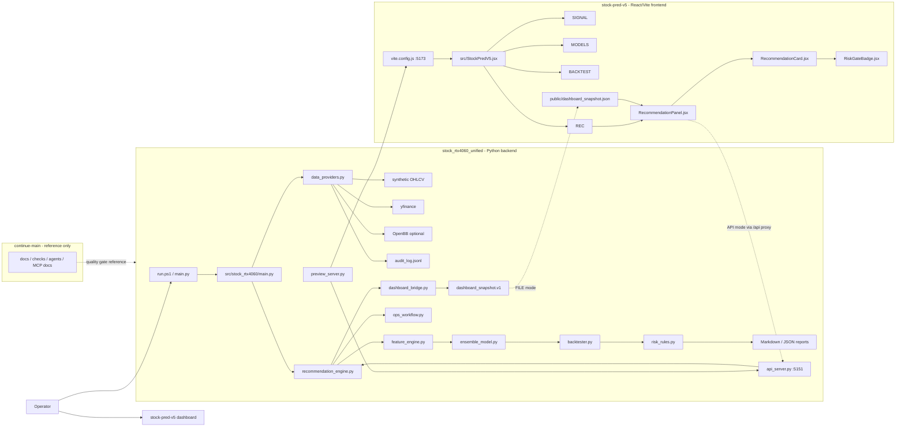
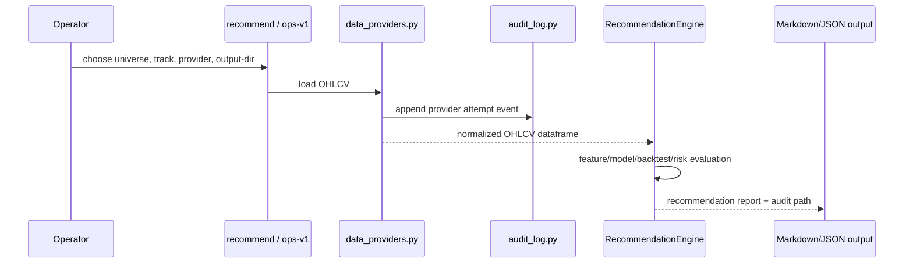
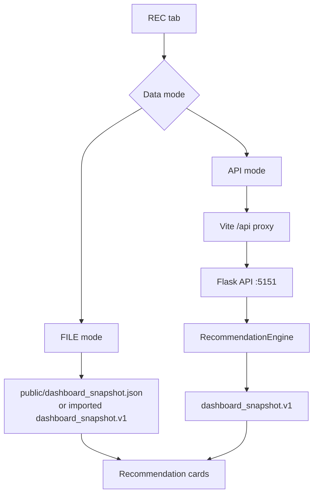
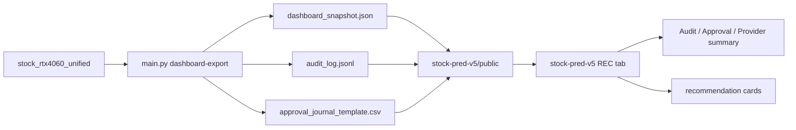

# Stock Research Workspace

<!-- root-pinned: keep this file at C:\Users\jichu\Downloads\주식\README.md -->

이 문서는 `C:\Users\jichu\Downloads\주식` 루트에 있는 주식 프로그램 전체를 처음 보는 사람이 한 번에 이해하도록 만든 시작 문서입니다.

하위 폴더 문서의 핵심 내용을 이 문서 안에 흡수했습니다. 하위 문서는 추가 근거와 세부 감사 기록으로 남아 있으며, 이 문서를 읽기 위해 하위 문서를 먼저 열 필요는 없습니다.

## 1. One-page Summary

| 질문 | 답 |
|---|---|
| 이 프로그램은 무엇인가 | 주식 후보를 분석하고, 추천 후보 리포트와 대시보드 표시용 snapshot을 만드는 로컬 주식 연구 시스템 |
| 실제 실행 중심은 어디인가 | `stock_rtx4060_unified/` Python 추천 엔진 |
| 화면은 어디에 있는가 | `stock-pred-v5/` React/Vite 대시보드 |
| 추천 결과는 어떻게 화면에 연결되는가 | `dashboard_snapshot.v1` 파일 또는 Flask API `/api/recommend` |
| 데이터는 어디서 오는가 | synthetic, yfinance, optional OpenBB provider |
| 감사 로그는 있는가 | provider 호출은 `audit_log.jsonl`로 남김 |
| 주문 실행이 있는가 | 없음. broker 주문, auto-buy, account write는 시스템 경계 밖 |
| Continue는 무엇인가 | `continue-main/`은 주식 runtime이 아니라 품질 게이트와 IDE/agent 참고 프로젝트 |

## 2. System Diagram



## 3. Root Folder Roles

| Path | Role | Details included here |
|---|---|---|
| `stock_rtx4060_unified/` | Active recommendation backend | CLI, providers, audit, reports, ops-v1, dashboard bridge, Flask API |
| `stock-pred-v5/` | Active dashboard frontend | React UI, Vite server, REC tab, FILE/API modes, build commands |
| `continue-main/` | Reference monorepo | Continue IDE/CLI architecture, checks, agents, MCP docs, not stock runtime |
| `docs/` | Root history and validation docs | Past move plans, root audits, Mermaid checks, setup notes |
| `reports/` | Root-generated evidence | Benchmarks, validations, recommendation reports, runtime outputs |
| `_consolidation_audit/` | Consolidation evidence | Historical copy/merge/exclusion evidence |
| `_delete_audit/` | Delete audit evidence | Approved deletion audit records |
| `archive/original_inputs/` | Original input archive | Original zip/input evidence |

## 4. Backend: `stock_rtx4060_unified`

`stock_rtx4060_unified` is a consolidated report-only stock screening and backtesting package. It keeps active source under `src/stock_rtx4060/`.

### Backend entry points

| Entry | Actual file | Purpose |
|---|---|---|
| Windows wrapper | `stock_rtx4060_unified/run.ps1` | Chooses `.venv\Scripts\python.exe` first, then Python 3.12, Python 3.11, global `python` |
| Root Python wrapper | `stock_rtx4060_unified/main.py` | Adds `src/` to import path and dispatches package CLI |
| Package CLI | `stock_rtx4060_unified/src/stock_rtx4060/main.py` | Defines all CLI commands |
| API server | `stock_rtx4060_unified/api_server.py` | Local Flask API on `127.0.0.1:5151` |
| Preview server | `stock_rtx4060_unified/preview_server.py` | Starts Flask API and Vite dashboard together |

### Backend commands

| Command | What it does | Main outputs |
|---|---|---|
| `env` | Runtime/GPU environment status | `reports/runtime_status.json` |
| `benchmark` | Synthetic CPU/GPU benchmark | benchmark Markdown/JSON |
| `report` | Daily brief/risk reports from CSV or synthetic data | Markdown/JSON reports |
| `predict` | Train/predict from CSV or yfinance | CLI JSON output |
| `recommend` | Track-S/Track-L recommendation scan | recommendation Markdown/JSON and `audit_log.jsonl` |
| `ops-v1` | Manual review workflow packet | recommendation, daily brief, approval template, ZERO log, summary JSON |
| `dashboard-export` | Convert recommendation JSON to dashboard snapshot | `dashboard_snapshot.json` |
| `demo` | Generate sample workspace data and reports | sample CSV and report files |
| `journal` | Append manual decision journal row | journal CSV |
| `self-test` | Internal smoke test | CLI PASS/diagnostic output |

### Backend modules

| Module | Responsibility |
|---|---|
| `feature_engine.py` | Builds technical indicator features such as moving averages, RSI/MACD/Bollinger-style indicators, and model inputs |
| `ensemble_model.py` | Runs model path with XGBoost/LogisticRegression-style backends and walk-forward validation behavior documented in package docs |
| `backtester.py` | Produces dry-run backtest evidence |
| `risk_rules.py` | Applies Track-S/Track-L risk and verdict gate logic |
| `recommendation_engine.py` | Orchestrates provider data, features, model evidence, backtest evidence, risk gates, ranking, and report writing |
| `data_providers.py` | Routes OHLCV loading through `auto`, `synthetic`, `yfinance`, or `openbb` |
| `audit_log.py` | Writes masked JSONL audit events |
| `dashboard_bridge.py` | Builds `dashboard_snapshot.v1` from recommendation JSON |
| `ops_workflow.py` | Writes daily brief, manual approval template, ZERO log, and workflow summary |
| `mcp_adapter.py` | Phase 1 read/report-only adapter contract; does not start an MCP server |
| `reports.py` | Shared Markdown/JSON/CSV report helpers |

## 5. Data Provider And Audit Flow



| Provider | Meaning | Dependency |
|---|---|---|
| `synthetic` | Deterministic local OHLCV for offline validation | No internet |
| `yfinance` | Existing direct market data path | `yfinance>=0.2.66` |
| `openbb` | Optional OpenBB historical equity endpoint using `provider="yfinance"` | `requirements-openbb.txt` |
| `auto` | Config/default provider mode where CLI can override config | `config/data_providers.example.json` when supplied |

The audit log records provider attempts, status, command, ticker, period, endpoint when applicable, duration/error metadata, and masked sensitive values.

## 6. Recommendation Contract

The backend is designed around report-only screening.

| Track | Meaning | Review boundary |
|---|---|---|
| Track-S | Shorter-term candidate screening | Requires score/risk/model/backtest gates and manual review |
| Track-L | Longer-term accumulation screening | Requires stronger score/evidence and manual thesis review |

Verdict families:

| Verdict family | Meaning |
|---|---|
| `ELIGIBLE_RECOMMENDATION` | Candidate passed the active screening gate but is still review-only |
| `ACCUMULATE_RECOMMENDATION` | Candidate passed accumulation-style screening but is still review-only |
| `AMBER_*` | Watchlist/review-only |
| `RED_*` | Blocked or not recommended |
| `ZERO_*` | Hard block, such as no data or failed risk plan |

Safety fields and behaviors:

| Field or behavior | Required meaning |
|---|---|
| `screening_output_only=True` | The output is not a trade instruction |
| `manual_approval_required=True` | Human review is required before action |
| `broker_order_execution=False` | No broker order path is active |
| ZERO log | Records blocked actions such as auto-buy or broker execution |

## 7. Dashboard: `stock-pred-v5`

`stock-pred-v5` is a Vite/React dashboard for US/KRX market visualization and backend recommendation display.

### Dashboard structure

| Area | File | Role |
|---|---|---|
| React mount | `stock-pred-v5/src/main.jsx` | Mounts the app |
| Main dashboard | `stock-pred-v5/src/StockPredV5.jsx` | Owns tabs, state, browser-side charts, REC tab placement |
| REC panel | `stock-pred-v5/src/components/RecommendationPanel.jsx` | Loads FILE/API recommendation snapshots, filters, sorts |
| Recommendation card | `stock-pred-v5/src/components/RecommendationCard.jsx` | Shows ticker, verdict, score, entry, stop, TP2, R/R, validation summary |
| Risk badge | `stock-pred-v5/src/components/RiskGateBadge.jsx` | Maps verdict labels to visual badges |
| Static sample | `stock-pred-v5/public/dashboard_snapshot.json` | FILE mode sample snapshot |
| Vite config | `stock-pred-v5/vite.config.js` | Runs on port `5173` and proxies `/api` to `127.0.0.1:5151` |

### Dashboard data modes



| Mode | How it works | When to use |
|---|---|---|
| FILE | Browser reads `dashboard_snapshot.json` | No backend server needed |
| API | Browser calls `/api/recommend`, Vite proxies to Flask `:5151` | Live local backend recommendation run |
| Preview | `preview_server.py` starts both API and Vite | One-command local preview |

## 8. API And Snapshot Contract

Flask API endpoints from `api_server.py`:

| Endpoint | Purpose |
|---|---|
| `GET /api/health` | Health check |
| `GET /api/recommend` | Runs recommendation engine and returns `dashboard_snapshot.v1` |
| `GET /api/snapshot?path=X` | Converts an existing recommendation JSON into a snapshot response |

`/api/recommend` query parameters (all optional):

| Parameter | Default | Description |
|---|---|---|
| `universe` | `AAPL,MSFT` | Comma-separated tickers |
| `track` | `BOTH` | `S`, `L`, or `BOTH` |
| `period` | `3y` | yfinance history period |
| `top` | `5` | Max candidates returned |
| `advisor_run` | `0` | `1` to enable P6 LLM Advisor blend (requires `ANTHROPIC_API_KEY`) |
| `advisor_blend_weight` | `0.3` | Blend weight when `advisor_run=1`; ignored otherwise |

> **Note**: when `ANTHROPIC_API_KEY` is absent, `api_server.py` silently forces `advisor_run=False` — the engine runs in deterministic mode and the response will not contain `advisor_score`.

`dashboard_bridge.py` requires these source result fields before building a dashboard snapshot:

| Group | Fields |
|---|---|
| Identity | `ticker`, `track`, `verdict` |
| Ranking/model | `recommendation_rank_score`, `direction_prob`, `expected_value_pct` |
| Risk plan | `entry`, `stop`, `tp2`, `risk_reward` |
| Safety/evidence | `screening_output_only`, `validations` |

Snapshot output includes rank, ticker, track, verdict, score, probability, expected value, entry, stop, TP1/TP2 where available, risk/reward, risk budget, max position, suggested quantity, model/backtest evidence, validation checks, reasons, source JSON path, and audit log path.

## 9. Continue Reference Role

`continue-main/` is not the stock program runtime. Its own architecture document describes:

| Continue area | Meaning |
|---|---|
| `core/` | TypeScript core runtime, config, indexing, diff, vendor integrations |
| `extensions/` | VS Code, JetBrains, and CLI surfaces |
| `gui/` | React chat UI |
| `binary/` | Rust/C++ autocomplete engine |
| `docs/` | Mintlify documentation |
| `.continue/` | agents, checks, prompts, and rules |

In this stock workspace, Continue is useful as a reference for quality gates and future review automation. It is not imported by `stock_rtx4060_unified` at runtime and it does not run the recommendation engine.

## 10. Setup And Run Commands

Python backend:

```powershell
cd C:\Users\jichu\Downloads\주식\stock_rtx4060_unified
py -3.12 -m venv .venv
.\.venv\Scripts\python.exe -m pip install --upgrade pip
.\.venv\Scripts\python.exe -m pip install -r requirements.txt
.\run.ps1 self-test
```

Optional OpenBB:

```powershell
cd C:\Users\jichu\Downloads\주식\stock_rtx4060_unified
.\.venv\Scripts\python.exe -m pip install -r requirements-openbb.txt
.\run.ps1 recommend --data-provider openbb --provider-config config/data_providers.example.json --universe "AAPL" --top 1 --output-dir reports\recommendations_openbb_cache_smoke
```

Recommendation and snapshot:

```powershell
cd C:\Users\jichu\Downloads\주식\stock_rtx4060_unified
.\run.ps1 recommend --data-provider synthetic --universe "SYNTH-A,SYNTH-B" --top 2 --model-kind logistic --cv-gap 5 --output-dir reports\recommendations
.\run.ps1 dashboard-export --recommendation-json reports\recommendations\recommendations_algo_v2_YYYYMMDD_HHMMSS.json --output reports\recommendations\dashboard_snapshot.json
```

Dashboard:

```powershell
cd C:\Users\jichu\Downloads\주식\stock-pred-v5
npm install
npm run dev
npm run build
```

Integrated preview:

```powershell
cd C:\Users\jichu\Downloads\주식\stock_rtx4060_unified
.\.venv\Scripts\python.exe preview_server.py
```

## 11. Outputs And Where They Go

| Output | Location |
|---|---|
| Recommendation Markdown/JSON | `stock_rtx4060_unified/reports/recommendations*/` |
| Provider audit log | `stock_rtx4060_unified/reports/**/audit_log.jsonl` |
| Ops v1 daily brief | `stock_rtx4060_unified/reports/ops_v1*/ops_v1_daily_brief_*.md` |
| Approval journal template | `stock_rtx4060_unified/reports/ops_v1*/approval_journal_template.csv` |
| ZERO log | `stock_rtx4060_unified/reports/ops_v1*/zero_log.md` and `.csv` |
| Dashboard snapshot | `dashboard_snapshot.json` from `dashboard-export` or API |
| Dashboard build | `stock-pred-v5/dist/` |
| Browser verification | `stock_rtx4060_unified/reports/dashboard_browser_verification/` |
| Consolidation evidence | `_consolidation_audit/` |
| Deletion audit evidence | `_delete_audit/` |

## 12. Safety And Security

| Boundary | Status |
|---|---|
| Broker API | Not part of active architecture |
| Auto buy/sell | ZERO / out of scope |
| Account write | Not present |
| Margin/options | ZERO / out of scope |
| Secrets in docs | Must not be printed |
| Provider credentials | Must stay outside committed docs/reports |
| Market/model output | Treated as data, not instructions |
| Human approval | Required before any real-world action |

## 13. Validation Commands

Use these before claiming the workspace is healthy:

```powershell
cd C:\Users\jichu\Downloads\주식\stock_rtx4060_unified
.\.venv\Scripts\python.exe main.py --help
.\.venv\Scripts\python.exe -m pytest -q
.\run.ps1 tensorflow-check
```

```powershell
cd C:\Users\jichu\Downloads\주식\stock-pred-v5
npm run build
```

Expected current baseline from local docs and recent verification:

| Check | Expected |
|---|---|
| Backend CLI help | Lists `env`, `benchmark`, `report`, `predict`, `recommend`, `ops-v1`, `dashboard-export`, `demo`, `journal`, `self-test` |
| Backend tests | 19 tests pass |
| TensorFlow CPU/LSTM smoke | `.\run.ps1 tensorflow-check` prints `TF_VERSION=2.21.0`, CPU device, `LSTM_SMOKE=PASS` |
| Dashboard build | Vite build succeeds; chunk-size warning may appear |

## 14. Root Documents

These three root documents intentionally overlap so each can be read on its own:

| Document | Main purpose |
|---|---|
| `README.md` | First-read operational overview |
| `SYSTEM_ARCHITECTURE.md` | Full component and data-flow architecture |
| `SYSTEM_LAYOUT.md` | Folder-by-folder and file-by-file map |

Latest document cross-check on 2026-05-03 read the documentation files under the four requested roots. Cache, build, virtual environment, and Git metadata folders were excluded from the scan.

| Root scanned | Documents read | Why it matters to this README |
|---|---:|---|
| `stock_rtx4060_unified/` | 114 | Confirms the active Python backend, CLI commands, reports, audit logs, OpenBB plan, and dashboard bridge |
| `stock-pred-v5/` | 29 | Confirms the active React/Vite dashboard, REC tab, FILE/API modes, snapshot sample, and build workflow |
| `continue-main/` | 342 | Confirms Continue is a separate IDE/CLI/MCP reference project, not the stock runtime |
| `docs/` | 32 | Confirms root-level historical plans, setup notes, layout notes, and architecture references |
| Total | 517 | The root overview, architecture, and layout documents were cross-checked against this scan |

## 15. Latest Dashboard Export Quick Start

The current verified dashboard connection is file based. The backend exports dashboard files, and the React/Vite dashboard reads those files from `stock-pred-v5/public/`.



Export backend files to the dashboard:

```powershell
cd C:\Users\jichu\Downloads\주식\stock_rtx4060_unified
.\.venv\Scripts\python.exe main.py dashboard-export --recommendation-json .\reports\full_verify_ops_v1\recommendations\recommendations_algo_v2_20260503_151612.json --output .\reports\dashboard_public_export_smoke\dashboard_snapshot.json --public-dir ..\stock-pred-v5\public --approval-journal .\reports\full_verify_ops_v1\approval_journal_template.csv
```

Expected public files:

| File | Meaning |
|---|---|
| `stock-pred-v5/public/dashboard_snapshot.json` | Recommendation snapshot used by the REC tab. |
| `stock-pred-v5/public/audit_log.jsonl` | Audit events summarized by the REC tab. |
| `stock-pred-v5/public/approval_journal_template.csv` | Approval queue data summarized by the REC tab. |

Verify the dashboard view:

```powershell
cd C:\Users\jichu\Downloads\주식\stock-pred-v5
npx playwright test tests/kevpe-dashboard.spec.js --reporter=line
npm run build
npm audit
```

The REC tab currently shows recommendation cards plus Audit / Approval / Provider summary panels. This dashboard is a review surface only. It does not send orders to a broker.
