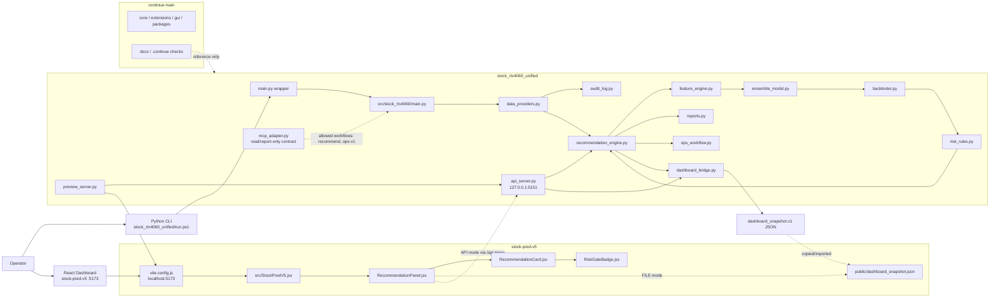
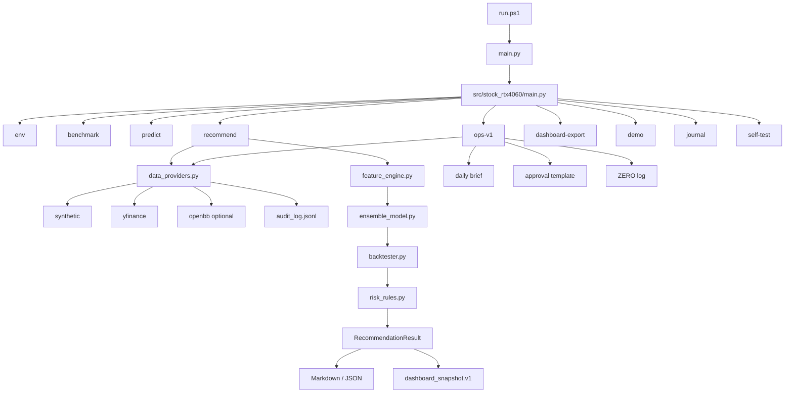
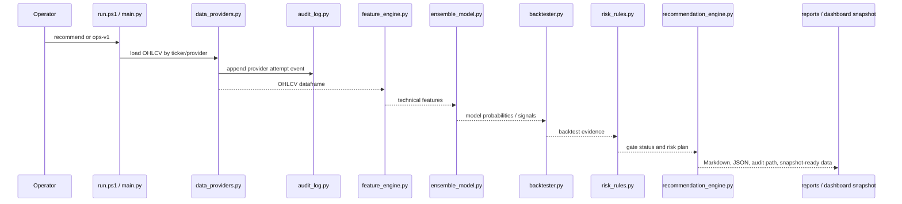
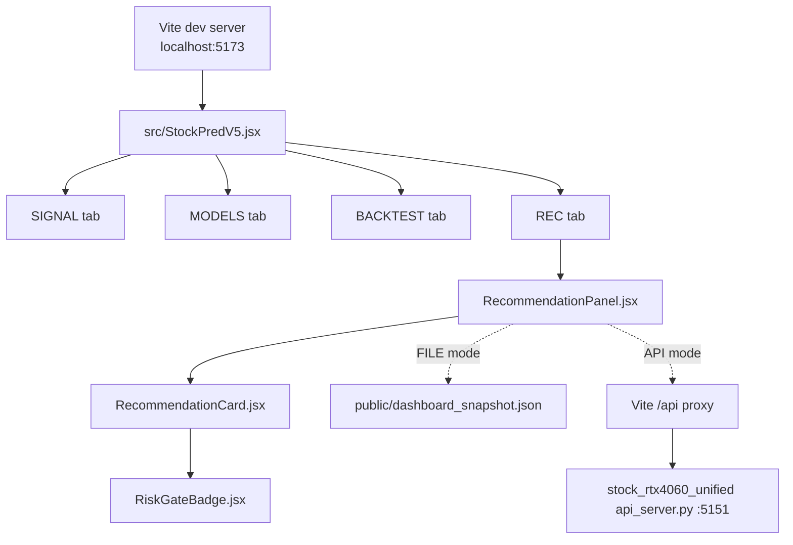
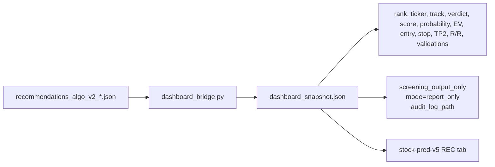
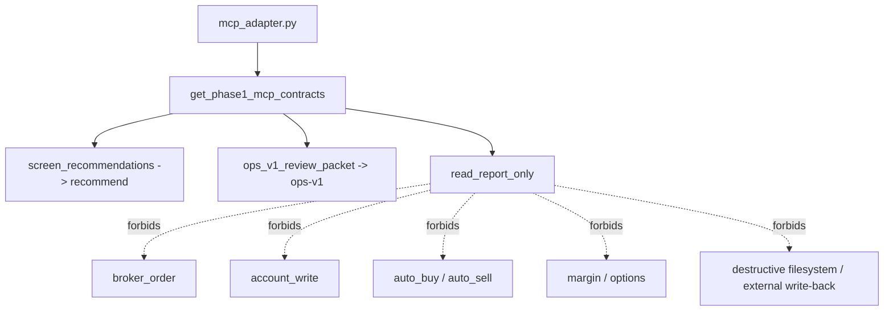
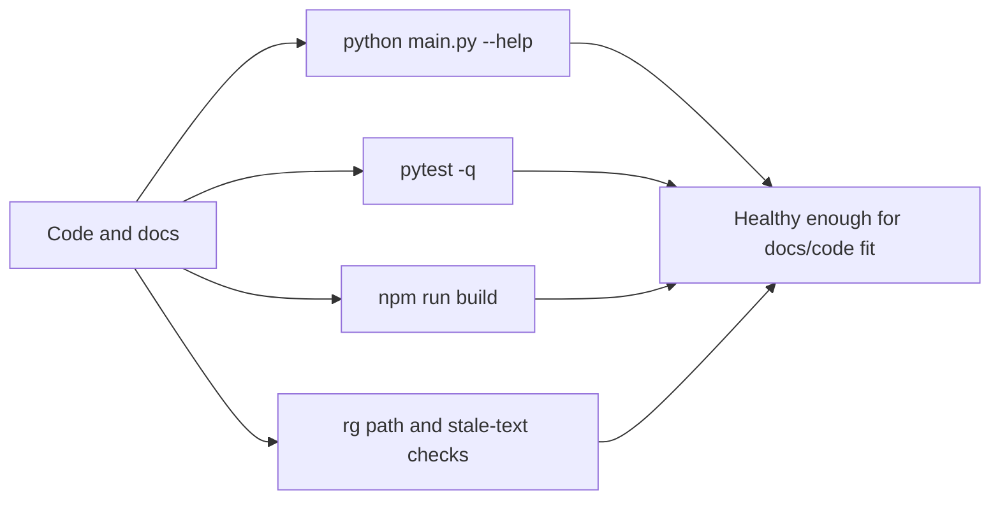
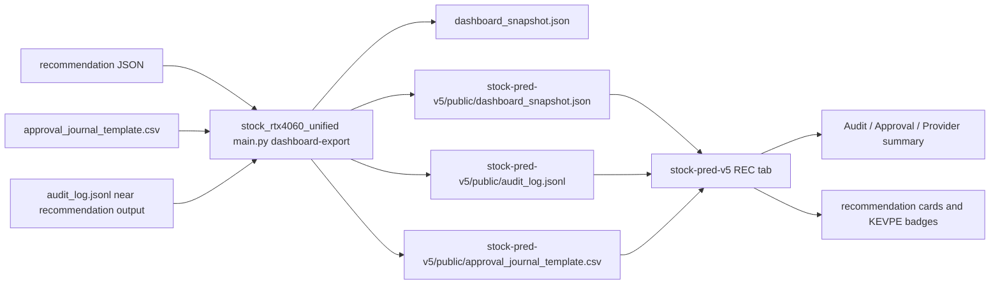

# System Architecture

<!-- root-pinned: keep this file at C:\Users\jichu\Downloads\주식\SYSTEM_ARCHITECTURE.md -->

이 문서는 `C:\Users\jichu\Downloads\주식` 아래 주식 프로그램 전체를 한 번에 이해하기 위한 시스템 아키텍처 문서입니다.

핵심 결론은 간단합니다.

| 핵심 | 설명 |
|---|---|
| 실행 중심 | `stock_rtx4060_unified/` Python 추천 엔진 |
| 화면 중심 | `stock-pred-v5/` React/Vite 대시보드 |
| 연결 방식 | 파일 snapshot 또는 Flask API |
| 검토/보조 | `continue-main/` Continue monorepo는 주식 runtime이 아니라 문서/품질 게이트 참고 |
| 투자 안전선 | 추천 결과는 `screening_output_only` 검토 자료이며 broker 주문 실행이 아님 |

이 문서는 하위 폴더 문서를 단순히 참조하라고 넘기지 않습니다. 하위 문서에서 확인한 핵심 구조, 실행 명령, 데이터 흐름, 출력물, 안전 경계를 이 문서 본문에 직접 포함합니다.

## 0. Architecture Reading Map

| 읽을 순서 | 여기서 이해할 내용 |
|---:|---|
| 1 | 루트 전체가 backend, dashboard, Continue reference로 나뉜다는 점 |
| 2 | Python backend가 provider, model, risk gate, report, audit, dashboard bridge를 실행한다는 점 |
| 3 | React dashboard가 브라우저 자체 예측 화면과 backend recommendation 화면을 함께 가진다는 점 |
| 4 | FILE mode와 API mode가 같은 `dashboard_snapshot.v1` 계약을 사용한다는 점 |
| 5 | MCP/OpenBB/audit는 Phase 1 범위이며 broker/account/write 동작이 아니라는 점 |
| 6 | reports, audit logs, ZERO logs, approval templates가 어디에 남는지 |

## 1. Whole System View



## 2. What Each Folder Means

| Folder | System role | Runtime status |
|---|---|---|
| `stock_rtx4060_unified/` | Active Python stock-candidate recommendation engine, provider router, audit writer, API server, dashboard snapshot exporter | Active |
| `stock-pred-v5/` | Active React/Vite dashboard with SIGNAL, MODELS, BACKTEST, and REC views | Active |
| `continue-main/` | Standalone Continue IDE/CLI monorepo; useful as reference for checks, agents, docs, and config patterns | Reference only |
| `docs/` | Root-level historical plans, validation notes, migration notes | Evidence/reference |
| `reports/` | Root-level generated benchmark, validation, recommendation, and review outputs | Generated evidence |
| `_consolidation_audit/`, `_delete_audit/` | Past consolidation/deletion evidence | Audit archive |

The folder split is intentional. Active source, generated evidence, historical audit files, and external reference code are not mixed:

| Category | Folders | Why it matters |
|---|---|---|
| Active backend | `stock_rtx4060_unified/` | This is the Python package to execute and test |
| Active frontend | `stock-pred-v5/` | This is the browser dashboard to build and run |
| Runtime output | `stock_rtx4060_unified/reports/**`, root `reports/**` | These files prove runs happened but are not the source of runtime behavior |
| Historical evidence | `_consolidation_audit/**`, `_delete_audit/**`, `docs/archive/**` | These explain previous consolidation decisions |
| Reference project | `continue-main/` | Large Continue monorepo, not imported by stock runtime |

## 3. Backend Runtime Architecture

`stock_rtx4060_unified/` is the executable backend.



### Backend command surface

Confirmed from `stock_rtx4060_unified/src/stock_rtx4060/main.py`.

| Command | Purpose |
|---|---|
| `env` | Runtime and GPU environment status |
| `benchmark` | Synthetic CPU/GPU benchmark |
| `report` | Daily brief and risk report generation |
| `predict` | Train/predict from CSV or yfinance |
| `recommend` | Rank Track-S/Track-L report-only candidates |
| `ops-v1` | Generate manual review packet: recommendation, brief, approval journal template, ZERO log, summary |
| `dashboard-export` | Convert recommendation JSON into `dashboard_snapshot.v1` |
| `demo` | Create sample data and reports |
| `journal` | Append decision journal row |
| `self-test` | Internal smoke test |

### Backend dependencies and environment

| File | Meaning |
|---|---|
| `requirements.txt` | Core runtime dependencies: numpy, pandas, scikit-learn, tabulate, yfinance, xgboost, Flask, flask-cors |
| `requirements-openbb.txt` | Optional OpenBB dependency for provider path validation |
| `requirements-gpu-wsl.txt` | WSL2/CUDA GPU dependency path; not required for basic self-test |
| `requirements-dev.txt` | Development dependencies such as pytest |
| `pyproject.toml` | pytest paths and formatter/linter settings |
| `.venv/` | Preferred local Python runtime; `run.ps1` tries this first |

The recommended execution path is `run.ps1`, because it selects the project `.venv` before global Python. Earlier docs mark global Python as AMBER when it is not explicitly prepared.

### Backend data providers

Confirmed from `stock_rtx4060_unified/docs/SPEC.md` and local source.

| Provider | Meaning | Runtime boundary |
|---|---|---|
| `synthetic` | Deterministic local OHLCV data | No internet required |
| `yfinance` | Current research/live market data path | External data dependency |
| `openbb` | Optional OpenBB endpoint `obb.equity.price.historical(..., provider="yfinance")` | Optional dependency in `requirements-openbb.txt` |
| `auto` | Provider config default, CLI flag can override | Must remain auditable |

Every provider attempt should be traceable through `audit_log.jsonl`.

### Provider failure behavior

| Situation | Expected architecture behavior |
|---|---|
| Synthetic provider selected | Run offline and write deterministic audit evidence |
| yfinance unavailable | Record visible failure/fallback evidence; do not silently claim a clean live-data recommendation |
| OpenBB not installed | Synthetic and yfinance paths must still work |
| OpenBB selected | Use optional dependency and approved historical equity endpoint |
| Provider config has sensitive fields | Audit writer masks secret-like values |

## 4. Recommendation Engine Flow



### Recommendation safety gates

The backend docs describe sequential validation for data, liquidity, market regime, model edge, out-of-fold coverage, backtest sanity, risk plan, track score, and automation boundary.

The output labels remain review-oriented:

| Label family | Meaning |
|---|---|
| `ELIGIBLE_RECOMMENDATION` | Candidate passed the active Track-S gate, still requires human review |
| `ACCUMULATE_RECOMMENDATION` | Candidate passed the active Track-L gate, still requires human review |
| `AMBER_*` | Review-only or watchlist |
| `RED_*` | Not recommended or blocked |
| `ZERO_*` | Hard block such as failed risk plan or no data |

### Track-specific meaning

| Track | Purpose | Typical output |
|---|---|---|
| Track-S | Short-term tactical candidate screening | `ELIGIBLE_RECOMMENDATION`, `AMBER_REVIEW_ONLY`, `RED_*`, `ZERO_*` |
| Track-L | Longer-term accumulation candidate screening | `ACCUMULATE_RECOMMENDATION`, `AMBER_WATCHLIST`, `RED_*`, `ZERO_*` |

The model probability alone must not be treated as a trade instruction. It is one evidence field inside a broader validation result that includes data sufficiency, model evidence, backtest sanity, risk plan, and automation boundary.

## 5. Dashboard Architecture

`stock-pred-v5/` is the browser UI.



### Dashboard modes

| Mode | Data source | What it means |
|---|---|---|
| Browser prediction UI | `StockPredV5.jsx` browser-side logic | Dashboard-side ML/signal display |
| FILE mode | `public/dashboard_snapshot.json` or imported snapshot | Uses existing backend recommendation output without running Flask |
| API mode | `/api/recommend` through Vite proxy | Calls local Flask API, which runs the backend recommendation engine |

### Dashboard UI surfaces

| Tab or surface | What it shows |
|---|---|
| SIGNAL | Browser-calculated indicator and ensemble-style signal view |
| MODELS | Browser model comparison and weight display |
| BACKTEST | Browser-side backtest chart/stat view |
| REC | Backend recommendation cards from FILE or API mode |
| RecommendationCard | Ticker, track, verdict, score, probability, expected value, entry, stop, TP2, risk/reward, position and validation summary |
| RiskGateBadge | Verdict badge for eligible, accumulate, AMBER, RED, ZERO, or fallback label |

### Dashboard API integration

Confirmed from `stock-pred-v5/vite.config.js` and `stock_rtx4060_unified/api_server.py`.

| Interface | Location | Detail |
|---|---|---|
| Vite dev server | `stock-pred-v5/vite.config.js` | port `5173`, `host: true`, opens browser |
| Proxy | `stock-pred-v5/vite.config.js` | `/api` -> `http://127.0.0.1:5151` |
| Flask recommend | `stock_rtx4060_unified/api_server.py` | `GET /api/recommend` |
| Flask snapshot | `stock_rtx4060_unified/api_server.py` | `GET /api/snapshot?path=X` |
| Flask health | `stock_rtx4060_unified/api_server.py` | `GET /api/health` |

## 6. Dashboard Snapshot Contract

`dashboard_bridge.py` converts backend recommendation JSON into `dashboard_snapshot.v1`.



Required result fields are checked in source:

| Field group | Examples |
|---|---|
| Candidate identity | `ticker`, `track`, `verdict` |
| Ranking and model evidence | `recommendation_rank_score`, `direction_prob`, `expected_value_pct` |
| Risk plan | `entry`, `stop`, `tp2`, `risk_reward` |
| Safety and audit | `screening_output_only`, `validations`, `audit_log_path` |

The bridge raises an error if required result fields are missing or `screening_output_only` is not preserved.

### Snapshot schema intent

The snapshot is not a second recommendation engine. It is a transport format for already-generated backend evidence.

| Snapshot field area | Purpose |
|---|---|
| `schema_version` / `source` / `mode` | Shows it is `dashboard_snapshot.v1` from `stock_rtx4060_unified` in report-only mode |
| `source_recommendation_json` | Links the dashboard payload back to the original recommendation report |
| `audit_log_path` | Links the dashboard payload to provider audit events |
| `config` | Preserves universe, track, period, synthetic flag, provider, model kind, XGBoost device, CV gap |
| `results[]` | Carries per-candidate verdict, score, probability, risk plan, model/backtest evidence, validation checks, and reasons |

## 7. API And Preview Execution

```mermaid
flowchart TD
    Preview[preview_server.py] --> Thread[Flask thread :5151]
    Preview --> Npm[npm --prefix stock-pred-v5 run dev]
    Npm --> Vite[Vite :5173]
    Preview --> Browser[webbrowser.open localhost:5173]

    Vite --> Proxy[/api]
    Proxy --> Flask[api_server.py]
    Flask --> Engine[RecommendationEngine]
    Engine --> Snapshot[dashboard_snapshot.v1]
```

### Verified local run commands

```powershell
cd C:\Users\jichu\Downloads\주식\stock_rtx4060_unified
.\run.ps1 self-test
.\run.ps1 recommend --data-provider synthetic --universe "SYNTH-A,SYNTH-B" --top 2 --output-dir reports\recommendations
.\run.ps1 dashboard-export --recommendation-json reports\recommendations\recommendations_algo_v2_YYYYMMDD_HHMMSS.json --output reports\recommendations\dashboard_snapshot.json
.\.venv\Scripts\python.exe api_server.py --port 5151
.\.venv\Scripts\python.exe preview_server.py
```

```powershell
cd C:\Users\jichu\Downloads\주식\stock-pred-v5
npm install
npm run dev
npm run build
```

## 8. MCP, OpenBB, And Audit Boundary

Confirmed from `stock_rtx4060_unified/docs/SPEC.md`, `mcp_adapter.py`, and source files.

| Area | Confirmed status |
|---|---|
| MCP | Phase 1 is adapter contract only. It does not start a local MCP server. |
| Allowed MCP workflows | `recommend`, `ops-v1` as `read_report_only` |
| Forbidden MCP capabilities | broker order, account write, auto buy/sell, margin, options, destructive filesystem, external write-back |
| OpenBB | Optional dependency, not required for synthetic validation |
| Audit log | JSONL provider events, secret masking expected by docs/tests |



## 9. Continue Role

`continue-main/` is not the stock trading system.

It is a standalone Continue IDE/CLI monorepo. Its docs describe VS Code/JetBrains extensions, TypeScript core, React GUI, autocomplete binary, providers, checks, agents, and MCP customization.

For this stock workspace, the useful role is:

| Continue area | How it relates here |
|---|---|
| `.continue/checks` concept | Quality gate reference for review workflows |
| agents/checks docs | Reference for future automated review style |
| MCP docs | Reference only; stock backend Phase 1 MCP remains adapter contract only |
| core/extensions/gui | Not imported by the stock recommendation runtime |

## 10. Storage And Outputs

| Output type | Location |
|---|---|
| Recommendation Markdown/JSON | `stock_rtx4060_unified/reports/**` |
| Provider audit JSONL | `stock_rtx4060_unified/reports/**/audit_log.jsonl` |
| Ops v1 daily brief | `stock_rtx4060_unified/reports/ops_v1*/` |
| Approval journal template | `stock_rtx4060_unified/reports/ops_v1*/approval_journal_template.csv` |
| ZERO log | `stock_rtx4060_unified/reports/ops_v1*/zero_log.*` |
| Dashboard snapshot | `dashboard_snapshot.json` generated by `dashboard-export` or Flask API |
| Dashboard static sample | `stock-pred-v5/public/dashboard_snapshot.json` |
| Browser build output | `stock-pred-v5/dist/` |
| Consolidation evidence | `_consolidation_audit/`, `stock_rtx4060_unified/reports/consolidation_report.md` |
| Deletion evidence | `_delete_audit/` |

## 11. Security And Financial Safety

| Rule | Reason |
|---|---|
| No broker order execution | The system is a screening/reporting tool |
| No account write | There is no verified account-action module in the active architecture |
| No auto buy/sell | Recommendation output requires manual review |
| No secrets in docs/reports | Provider keys, tokens, account IDs, and private URLs must stay out of repository outputs |
| Treat market/model data as data | Data files and model output must not become executable instructions |
| Keep fallback data visible | yfinance/OpenBB/synthetic provider use must remain auditable |

## 11.1 Error Handling And AMBER States

| Area | How failure is represented |
|---|---|
| Missing OHLCV | Red or ZERO-style blocked candidate evidence, not silent success |
| Data provider failure | Audit event plus visible provider failure reason |
| Missing dashboard snapshot fields | `dashboard_bridge.py` raises `DashboardBridgeError` |
| Flask API exception | API returns JSON error with exception type and HTTP 500 |
| Dashboard API fetch failure | REC panel shows API error and retry button |
| Dashboard FILE fetch failure | REC panel reports no configured or failed data source |
| Large frontend bundle | Vite build can pass with chunk-size warning; this is performance debt, not build failure |

## 11.2 Validation Architecture



Validation is split because this workspace has both Python and JavaScript runtime surfaces.

| Validation | What it proves |
|---|---|
| `.\.venv\Scripts\python.exe main.py --help` | Backend CLI commands still parse |
| `.\.venv\Scripts\python.exe -m pytest -q` | Backend unit/regression tests pass |
| `npm run build` in `stock-pred-v5` | Dashboard compiles through Vite |
| `rg` path checks | Root docs do not point to deleted root names or stale architecture names |

## 12. Extensibility Map

| Change needed | Add or update here | Required validation |
|---|---|---|
| New data provider | `stock_rtx4060_unified/src/stock_rtx4060/data_providers.py` | Provider unit tests, audit log test, docs update |
| New recommendation gate | `recommendation_engine.py` or `risk_rules.py` | Regression tests and report evidence |
| New dashboard field | `dashboard_bridge.py` and `stock-pred-v5/src/components/` | Snapshot test and `npm run build` |
| New API endpoint | `api_server.py`, Vite proxy docs if needed | API smoke and CORS check |
| Actual MCP server | New design/spec first | Explicit approval required; current MCP is contract only |
| Real-data approval state | Future implementation from `SPEC_REAL_DATA_OPS_UPGRADE_2026-05-03.md` | Open questions must be resolved first |

## 13. Source Documents Reviewed

This update read the document content under the four requested roots and used the architecture-relevant facts from them. Cache, build, virtual environment, and Git metadata folders were excluded.

| Folder | Documents read | Key documents used directly |
|---|---:|---|
| `stock_rtx4060_unified/` | 114 | `README.md`, `CHANGELOG.md`, `docs/SYSTEM_ARCHITECTURE.md`, `docs/LAYOUT.md`, `docs/SPEC.md`, `docs/SPEC_DASHBOARD_BRIDGE_2026-05-03.md`, `docs/SPEC_REAL_DATA_OPS_UPGRADE_2026-05-03.md`, `docs/SETUP.md`, `docs/REPORTS_POLICY.md`, `docs/UIUX.md` |
| `stock-pred-v5/` | 29 | `README.md`, `docs/SYSTEM_ARCHITECTURE.md`, `docs/system-architecture.md`, `docs/ARCHITECTURE.md`, `docs/LAYOUT.md`, `docs/RUNBOOK.md`, `docs/_review/FINAL_VALIDATION_REPORT.md` |
| `continue-main/` | 342 | `README.md`, `docs/README.md`, `docs/SYSTEM_ARCHITECTURE.md`, `extensions/cli/README.md`, `extensions/cli/spec/*.md`, `.continue/checks/*.md`, `.continue/agents/*.md` |
| `docs/` | 32 | `SYSTEM_ARCHITECTURE.md`, `LAYOUT.md`, `SETUP.md`, `Spec.md`, `plan.md`, `plan_rev.md`, `uiux.md`, `VALIDATION_R3_FINAL.md`, `A3_MERGE_PLAN.md` |
| Total | 517 | All `.md`, `.mdx`, `.txt`, and `.rst` files under the four requested roots were opened for title, section, keyword, and Mermaid extraction |

The architecture-relevant content absorbed from those documents is:

| Source document group | Content absorbed into this file |
|---|---|
| Unified backend architecture/layout/spec/setup | Active CLI, package modules, provider modes, OpenBB optional path, audit JSONL, MCP adapter contract, dashboard bridge, ops-v1 artifacts, validation commands |
| Dashboard architecture/layout/runbook/reviews | React/Vite runtime, port `5173`, `/api` proxy, REC tab components, FILE/API mode, build/preview commands, known chunk-size warning |
| Continue architecture/docs inventory | Continue is a separate IDE/CLI monorepo with TypeScript core, extensions, GUI, binary autocomplete, docs, agents, checks, and MCP references |
| Root docs and reports | Consolidation history, deletion audit evidence, report output policy, generated output boundaries |

## 14. Assumptions

- 가정: 문서 스캔에서 `.git`, `.venv`, `node_modules`, `dist`, cache/test-output directories are generated or tool-managed folders and are not source documentation.
- 가정: 루트 `SYSTEM_ARCHITECTURE.md`는 운영자가 이 한 파일만 봐도 전체 주식 프로그램 구조를 이해하는 개요 문서가 되어야 합니다.

## 15. 2026-05-03 Dashboard Public Export and REC Ops Summary

This section records the latest verified bridge between the recommendation backend and the React/Vite dashboard. It is additive and does not replace the deeper folder-level documents.



| Component | Verified path or command | Role |
|---|---|---|
| Dashboard export CLI | `stock_rtx4060_unified/main.py dashboard-export` | Converts recommendation JSON into dashboard snapshot output. |
| Public asset export option | `--public-dir` | Copies dashboard bridge files into the Vite dashboard `public` folder. |
| Approval journal option | `--approval-journal` | Adds the approval CSV file to the dashboard public export set. |
| Snapshot public file | `stock-pred-v5/public/dashboard_snapshot.json` | Main REC tab data input. |
| Audit public file | `stock-pred-v5/public/audit_log.jsonl` | REC tab audit summary input. |
| Approval public file | `stock-pred-v5/public/approval_journal_template.csv` | REC tab approval summary input. |
| Dashboard REC consumer | `stock-pred-v5/src/components/RecommendationPanel.jsx` | Displays recommendations plus Audit / Approval / Provider summary cards. |

Latest verified export command:

```powershell
cd C:\Users\jichu\Downloads\주식\stock_rtx4060_unified
.\.venv\Scripts\python.exe main.py dashboard-export --recommendation-json .\reports\full_verify_ops_v1\recommendations\recommendations_algo_v2_20260503_151612.json --output .\reports\dashboard_public_export_smoke\dashboard_snapshot.json --public-dir ..\stock-pred-v5\public --approval-journal .\reports\full_verify_ops_v1\approval_journal_template.csv
```

Latest dashboard validation commands:

```powershell
cd C:\Users\jichu\Downloads\주식\stock-pred-v5
npx playwright test tests/kevpe-dashboard.spec.js --reporter=line
npm run build
npm audit
```

The dashboard shows screening evidence, provider status, audit counts, approval status, and recommendation cards. It does not execute broker orders. Sensitive credentials, account identifiers, private URLs, and tokens must not be exported into `stock-pred-v5/public`.
