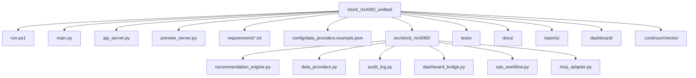
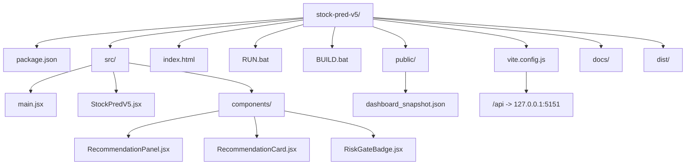
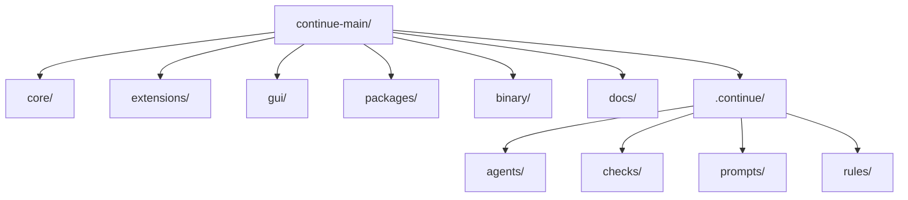
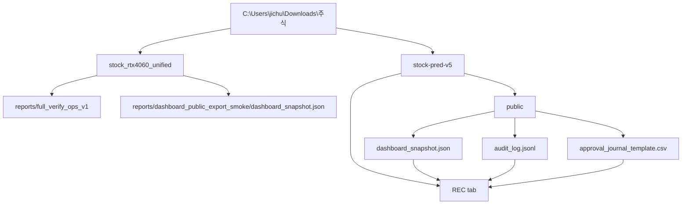

# System Layout

<!-- root-pinned: keep this file at C:\Users\jichu\Downloads\주식\SYSTEM_LAYOUT.md -->

이 문서는 `C:\Users\jichu\Downloads\주식` 루트 폴더의 전체 배치를 설명합니다. 이 파일만 읽어도 어떤 폴더가 실행 코드인지, 어떤 폴더가 대시보드인지, 어떤 파일이 증거/출력/보관 자료인지 알 수 있어야 합니다.

하위 폴더 문서의 내용을 단순히 참조하라고 넘기지 않고, 중요한 폴더와 파일의 의미를 이 문서에 직접 설명합니다.

## 1. Layout Summary

| 분류 | 경로 | 역할 |
|---|---|---|
| Root overview docs | `README.md`, `SYSTEM_ARCHITECTURE.md`, `SYSTEM_LAYOUT.md` | 전체 시스템을 설명하는 루트 3문서 |
| Active backend | `stock_rtx4060_unified/` | Python 추천 엔진, report writer, audit writer, Flask API |
| Active frontend | `stock-pred-v5/` | React/Vite dashboard, REC tab, FILE/API recommendation view |
| Reference monorepo | `continue-main/` | Continue IDE/CLI, docs/checks/agents reference |
| Root evidence | `docs/`, `reports/` | 과거 정리, 검증, benchmark, recommendation evidence |
| Historical audit | `_consolidation_audit/`, `_delete_audit/` | 통합/삭제 audit evidence |
| Archive/input | `archive/original_inputs/` | 원본 zip/input 보관 |

## 2. Root Folder Diagram

```mermaid
graph TD
    Root["C:/Users/jichu/Downloads/주식"] --> Readme["README.md"]
    Root --> Arch["SYSTEM_ARCHITECTURE.md"]
    Root --> Layout["SYSTEM_LAYOUT.md"]
    Root --> Backend["stock_rtx4060_unified/"]
    Root --> Frontend["stock-pred-v5/"]
    Root --> Continue["continue-main/"]
    Root --> Docs["docs/"]
    Root --> Reports["reports/"]
    Root --> Archive["archive/original_inputs/"]
    Root --> CAudit["_consolidation_audit/"]
    Root --> DAudit["_delete_audit/"]
    Root --> Compat["main.py / main_compat.py"]
    Root --> RootJSX["stock_pred_v5.jsx"]

    Backend --> BackendSrc["src/stock_rtx4060/"]
    Backend --> BackendTests["tests/"]
    Backend --> BackendDocs["docs/"]
    Backend --> BackendReports["reports/"]
    Backend --> BackendDashboard["dashboard/"]

    Frontend --> FrontendSrc["src/"]
    Frontend --> FrontendComponents["src/components/"]
    Frontend --> FrontendPublic["public/"]
    Frontend --> FrontendDocs["docs/"]
    Frontend --> FrontendDist["dist/"]

    Continue --> ContinueCore["core/"]
    Continue --> ContinueExt["extensions/"]
    Continue --> ContinueGui["gui/"]
    Continue --> ContinueDocs["docs/"]
    Continue --> ContinueConfig[".continue/"]
```



## 3. Current Root Tree

```text
C:\Users\jichu\Downloads\주식\
├── README.md
├── SYSTEM_ARCHITECTURE.md
├── SYSTEM_LAYOUT.md
├── CHANGELOG.md
├── AGENTS.md
├── CLAUDE.md
├── DOCUMENT_INDEX.md
├── CROSS_ANALYSIS.md
├── plan.md
├── main.py
├── main_compat.py
├── pyproject.toml
├── requirements.txt
├── requirements-gpu-wsl.txt
├── stock_pred_v5.jsx
├── stock_prediction_dashboard_1.jsx
├── screenshot_dashboard.png
├── stock_rtx4060_algo_v2_bundle.zip
├── stock_rtx4060_unified/
├── stock-pred-v5/
├── continue-main/
├── docs/
├── reports/
├── examples/
├── tests/
├── tools/
├── archive/original_inputs/
├── _consolidation_audit/
├── _delete_audit/
└── mnt/
```

## 4. Root Files

| File | Meaning | Active or evidence |
|---|---|---|
| `README.md` | First-read system overview with commands, workflows, safety boundary | Active doc |
| `SYSTEM_ARCHITECTURE.md` | Component/data-flow architecture for backend, dashboard, Continue reference | Active doc |
| `SYSTEM_LAYOUT.md` | This folder and file map | Active doc |
| `CHANGELOG.md` | Root-level history of current work | Active doc |
| `AGENTS.md` | Codex working instructions and project safety rules | Active guidance |
| `CLAUDE.md` | Claude-oriented guidance | Guidance |
| `DOCUMENT_INDEX.md` | Root document index | Evidence/doc |
| `CROSS_ANALYSIS.md` | Cross-analysis evidence | Evidence/doc |
| `plan.md` | Current or recent plan artifact | Plan/evidence |
| `main.py` | Root compatibility entry point retained from earlier layout | Legacy/compatibility |
| `main_compat.py` | Renamed compatibility file | Legacy/compatibility |
| `pyproject.toml` | Root legacy project metadata | Legacy/support |
| `requirements.txt` | Root legacy dependency file | Legacy/support |
| `requirements-gpu-wsl.txt` | Root legacy GPU dependency file | Legacy/support |
| `stock_pred_v5.jsx` | Root external dashboard JSX copy | Dashboard-related source copy |
| `stock_prediction_dashboard_1.jsx` | Additional dashboard JSX artifact | Evidence/source copy |
| `screenshot_dashboard.png` | Dashboard screenshot evidence | Evidence |
| `stock_rtx4060_algo_v2_bundle.zip` | Archived source bundle | Archive/evidence |

## 5. Active Backend Layout: `stock_rtx4060_unified/`



### Backend root files

| File | Role |
|---|---|
| `run.ps1` | Windows runner; chooses `.venv\Scripts\python.exe` first |
| `main.py` | Python wrapper that dispatches to package CLI |
| `api_server.py` | Flask server with `/api/health`, `/api/recommend`, `/api/snapshot?path=X` |
| `preview_server.py` | Starts Flask `:5151` and Vite dashboard `:5173` together |
| `requirements.txt` | Core runtime deps including yfinance, xgboost, Flask, flask-cors |
| `requirements-openbb.txt` | Optional OpenBB provider dependency |
| `requirements-gpu-wsl.txt` | Optional WSL2/CUDA GPU dependency path |
| `requirements-dev.txt` | Test/dev dependencies |
| `pyproject.toml` | pytest, ruff, black settings |

### Backend source modules

| Module | Role |
|---|---|
| `src/stock_rtx4060/main.py` | CLI parser and command dispatcher |
| `feature_engine.py` | Technical indicator feature generation |
| `ensemble_model.py` | Model training/prediction path |
| `backtester.py` | Dry-run backtest calculations |
| `risk_rules.py` | Track-S/Track-L risk and verdict gates |
| `recommendation_engine.py` | Candidate scoring, OHLCV caching, ranking, report writing |
| `data_providers.py` | OHLCV provider router: `auto`, `synthetic`, `yfinance`, `openbb` |
| `audit_log.py` | Masked append-only JSONL audit writer |
| `dashboard_bridge.py` | Converts recommendation JSON to `dashboard_snapshot.v1` |
| `ops_workflow.py` | Daily brief, approval template, ZERO log, summary |
| `mcp_adapter.py` | Read/report-only Phase 1 MCP adapter contract |
| `reports.py` | Shared report writer helpers |
| `hw_profile.py` | Runtime/GPU checks |
| `benchmark.py` | Benchmark runner |

### Backend tests

| Test file | Coverage |
|---|---|
| `tests/test_core.py` | Core CLI/package behavior and ops workflow regression |
| `tests/test_audit_log.py` | Audit masking and JSONL behavior |
| `tests/test_data_providers.py` | Provider selection and fallback behavior |
| `tests/test_mcp_adapter.py` | MCP read/report-only safety boundary |
| `tests/test_dashboard_bridge.py` | Snapshot conversion and required fields |

### Backend generated output

| Folder or pattern | Meaning |
|---|---|
| `reports/recommendations*/` | Recommendation Markdown/JSON and provider audit logs |
| `reports/ops_v1*/` | Ops v1 daily brief, approval template, ZERO log, summary |
| `reports/dashboard_bridge_smoke/` | Dashboard snapshot smoke output |
| `reports/dashboard_browser_verification/` | Browser bridge verification report and screenshot evidence |
| `reports/runtime_status.json` | Runtime/GPU probe output |
| `test-results/` | Playwright/runtime metadata |

## 6. Active Dashboard Layout: `stock-pred-v5/`



### Dashboard root files

| File | Role |
|---|---|
| `package.json` | npm scripts: `dev`, `build`, `preview`, `start`; React/Vite/recharts deps |
| `package-lock.json` | Locked npm dependency graph |
| `vite.config.js` | Dev server port `5173`, browser open, host mode, `/api` proxy |
| `index.html` | Browser entry HTML |
| `RUN.bat` | Windows double-click dev launcher |
| `BUILD.bat` | Windows build/preview helper |
| `README.md` | Dashboard-specific overview |
| `ANALYSIS_C.md` | Dashboard analysis evidence |
| `stock_pred_v5.jsx` | Dashboard source copy |

### Dashboard source files

| File | Role |
|---|---|
| `src/main.jsx` | React mount |
| `src/StockPredV5.jsx` | Main dashboard UI: SIGNAL, MODELS, BACKTEST, REC; `advisorEnabled` state + LLM ADVISOR purple pill toggle in REC panel (Updated: 2026-05-10) |
| `src/components/RecommendationPanel.jsx` | Loads dashboard snapshot through FILE / IMPORT / API mode; `recApiUrl` injects `advisor_run=1&advisor_blend_weight=0.3` when LLM Advisor toggle is ON |
| `src/components/RecommendationCard.jsx` | Renders ticker, track, score, probability, EV, entry, stop, TP2, R/R, validation count; LLM Advisor score gauge (Updated: 2026-05-10) |
| `src/components/RiskGateBadge.jsx` | Renders verdict badge for ELIGIBLE, ACCUMULATE, AMBER, RED, ZERO, fallback labels |

### Dashboard public and build output

| Path | Meaning |
|---|---|
| `public/dashboard_snapshot.json` | Static smoke-test snapshot for FILE mode |
| `public/audit_log.jsonl` | Public audit sample/evidence file |
| `public/recommendations_algo_v2_*.json` | Public recommendation sample |
| `public/recommendations_algo_v2_*.md` | Public recommendation Markdown sample |
| `dist/` | Vite production build output |
| `node_modules/` | Installed npm dependencies |

## 7. Continue Reference Layout: `continue-main/`



| Folder | Meaning |
|---|---|
| `core/` | TypeScript core runtime, config handling, indexing, diff, vendor integrations |
| `extensions/` | VS Code, JetBrains, and CLI entry points |
| `gui/` | Continue React GUI |
| `packages/` | Shared packages such as YAML config schema |
| `binary/` | Rust/C++ autocomplete engine |
| `docs/` | Mintlify docs, guides, provider docs, MCP docs, checks docs |
| `.continue/` | Continue agents, checks, prompts, and rules |

This folder is not part of the stock recommendation runtime. It is retained as a reference and documentation/checks source.

## 8. Root Evidence And Archive Layout

| Path | Meaning |
|---|---|
| `docs/` | Root historical docs, setup notes, validation notes, move plans, Mermaid checks, archive notes |
| `reports/` | Root-level benchmark, recommendation, validation, and review outputs |
| `_consolidation_audit/` | Historical consolidation tool outputs and pre-unified evidence |
| `_delete_audit/` | Approved deletion audit records |
| `archive/original_inputs/` | Original zipped/input artifacts |
| `examples/` | Sample CSV and example data |
| `tests/` | Root legacy tests |
| `tools/` | Root support tools |
| `mnt/` | Imported/extracted evidence path; not the active runtime package |

## 9. Where To Add New Work

| Work type | Add or update here |
|---|---|
| New backend CLI command | `stock_rtx4060_unified/src/stock_rtx4060/main.py` and tests |
| New data provider | `stock_rtx4060_unified/src/stock_rtx4060/data_providers.py` |
| New provider audit field | `stock_rtx4060_unified/src/stock_rtx4060/audit_log.py` |
| New recommendation gate | `recommendation_engine.py` or `risk_rules.py` |
| New dashboard snapshot field | `dashboard_bridge.py`, then `stock-pred-v5/src/components/` |
| New dashboard card UI | `stock-pred-v5/src/components/RecommendationCard.jsx` |
| New dashboard source mode | `RecommendationPanel.jsx` and `vite.config.js` if API proxy changes |
| New backend test | `stock_rtx4060_unified/tests/` |
| New dashboard doc | `stock-pred-v5/docs/` |
| New root overview | Update all three root docs if it affects the full system |

## 10. Generated Or Do-not-edit-by-default Areas

| Path | Default rule |
|---|---|
| `stock-pred-v5/node_modules/` | Do not edit manually |
| `stock-pred-v5/dist/` | Generated by `npm run build` |
| `stock_rtx4060_unified/.pytest_cache/`, `.ruff_cache/`, `__pycache__/` | Runtime/tool cache |
| `stock_rtx4060_unified/reports/**` | Generated evidence; do not delete without approval |
| root `reports/**` | Generated evidence; do not delete without approval |
| `_consolidation_audit/**` | Historical evidence |
| `_delete_audit/**` | Historical evidence |
| `archive/original_inputs/**` | Original input archive |

## 11. Naming Conventions

| Type | Convention |
|---|---|
| Root system docs | `README.md`, `SYSTEM_ARCHITECTURE.md`, `SYSTEM_LAYOUT.md` |
| Python modules | `snake_case.py` |
| React components | `PascalCase.jsx` for components |
| Recommendation reports | `recommendations_algo_v2_YYYYMMDD_HHMMSS.md/json` |
| Dashboard snapshot | `dashboard_snapshot.json` containing `dashboard_snapshot.v1` |
| Audit logs | `audit_log.jsonl` |
| Ops v1 brief | `ops_v1_daily_brief_*.md` |
| ZERO logs | `zero_log.md`, `zero_log.csv` |

## 12. Maintenance Rules

- Keep root docs self-contained. Do not replace important architecture details with "see subfolder docs."
- If backend command surface changes, update `README.md`, `SYSTEM_ARCHITECTURE.md`, and `SYSTEM_LAYOUT.md` together.
- If dashboard FILE/API mode changes, update both backend bridge docs and dashboard layout docs.
- If a generated report is useful evidence, keep it under `reports/`; do not move it into source folders.
- Do not move Python source files unless imports, `run.ps1`, tests, and docs are patched together.
- Do not document broker, account, order, margin, options, or auto-buy behavior unless actual approved source exists.
- Mark future-only design as `가정:` or keep it in plan/spec docs until implemented.

## 13. Document Inventory Cross-check

The latest document scan on 2026-05-03 read the documentation files under the four requested roots. This layout file uses that scan to keep root folder descriptions aligned with the actual documentation surface.

| Root scanned | Documents read | Mermaid blocks | Layout meaning |
|---|---:|---:|---|
| `stock_rtx4060_unified/` | 114 | 9 | Active backend package, reports, provider/audit docs, dashboard bridge docs, and validation evidence |
| `stock-pred-v5/` | 29 | 11 | Active dashboard app, dashboard docs, REC view docs, and Vite workflow docs |
| `continue-main/` | 342 | 5 | Separate Continue IDE/CLI/MCP reference project with docs, checks, agents, extensions, and package docs |
| `docs/` | 32 | 8 | Root-level historical plans, setup documents, layout documents, and validation notes |
| Total | 517 | 33 | The root `README.md`, `SYSTEM_ARCHITECTURE.md`, and `SYSTEM_LAYOUT.md` were cross-checked against this document set |

Excluded from the document scan: `.git`, `.venv`, `node_modules`, `dist`, `__pycache__`, `.pytest_cache`, `.ruff_cache`, `test-results`, and generated pytest cache folders.

## 14. Layout Validation Commands

```powershell
cd C:\Users\jichu\Downloads\주식
Test-Path .\README.md
Test-Path .\SYSTEM_ARCHITECTURE.md
Test-Path .\SYSTEM_LAYOUT.md
Test-Path .\stock_rtx4060_unified\src\stock_rtx4060\main.py
Test-Path .\stock-pred-v5\vite.config.js
Test-Path .\continue-main\docs\SYSTEM_ARCHITECTURE.md
```

Backend validation:

```powershell
cd C:\Users\jichu\Downloads\주식\stock_rtx4060_unified
.\.venv\Scripts\python.exe main.py --help
.\.venv\Scripts\python.exe -m pytest -q
```

Dashboard validation:

```powershell
cd C:\Users\jichu\Downloads\주식\stock-pred-v5
npm run build
```

## 15. 2026-05-03 Dashboard Public Export Layout

The latest verified dashboard bridge uses file-based public assets. The backend creates or copies the files. The React/Vite dashboard reads them from `stock-pred-v5/public/`.



| Public file | Source or export path | Purpose |
|---|---|---|
| `stock-pred-v5/public/dashboard_snapshot.json` | `dashboard-export --public-dir ..\stock-pred-v5\public` | Main recommendation snapshot for the dashboard REC tab. |
| `stock-pred-v5/public/audit_log.jsonl` | Audit log located beside the recommendation output when available | Supplies audit event counts and latest audit status. |
| `stock-pred-v5/public/approval_journal_template.csv` | `dashboard-export --approval-journal ...` | Supplies approval queue and pending-review summary. |

| Area | Path | Notes |
|---|---|---|
| Backend CLI | `stock_rtx4060_unified/main.py` | Exposes `dashboard-export`. |
| Dashboard bridge logic | `stock_rtx4060_unified/src/stock_rtx4060/dashboard_bridge.py` | Builds snapshot data and public export assets. |
| Dashboard app | `stock-pred-v5/` | Vite React app. |
| REC panel | `stock-pred-v5/src/components/RecommendationPanel.jsx` | Shows recommendations, KEVPE badge, Audit / Approval / Provider summary. |
| REC test | `stock-pred-v5/tests/kevpe-dashboard.spec.js` | Browser test for dashboard REC behavior. |

Latest validation commands:

```powershell
cd C:\Users\jichu\Downloads\주식\stock_rtx4060_unified
.\.venv\Scripts\python.exe main.py dashboard-export --help
```

```powershell
cd C:\Users\jichu\Downloads\주식\stock-pred-v5
npx playwright test tests/kevpe-dashboard.spec.js --reporter=line
npm run build
npm audit
```
