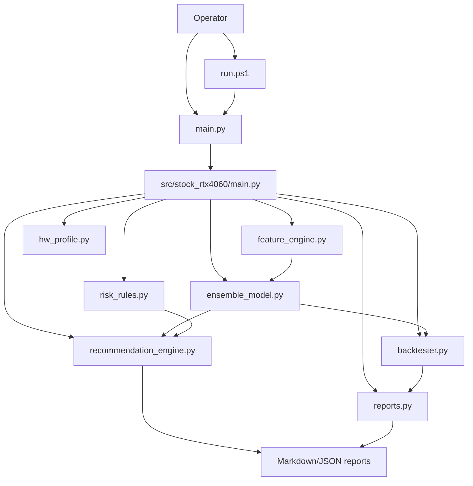
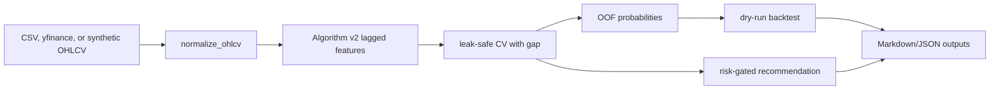

# SYSTEM_ARCHITECTURE

## Overview

`stock_rtx4060_unified` is a local Python CLI. It has no HTTP API, no web server, and no broker execution integration.

## Component Diagram

## Data Flow

## Boundaries

| Boundary | State |
|---|---|
| Broker orders | Not implemented. |
| Web dashboard | Not implemented. |
| Runtime state | Local reports only. |
| Secrets | No secret loader found in selected runtime path. |
