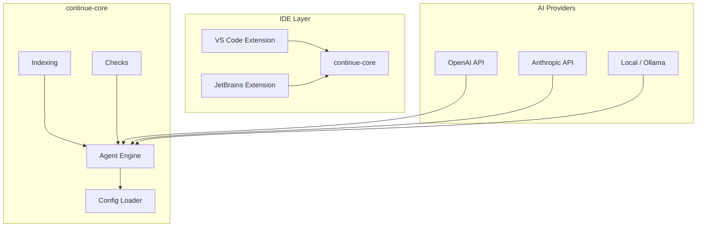

# System Architecture

## Purpose

Continue is an open-source AI coding assistant for VS Code and JetBrains. It provides context-aware autocomplete, chat, and task automation by connecting to LLMs (OpenAI, Anthropic, local models via Ollama, and others).

**Note: This project is NOT part of the stock trading system (stock_rtx4060_unified / stock-pred-v5). It is a standalone IDE extension and CLI monorepo.**

## Tech Stack

| Layer | Technology | Purpose |
|-------|------------|---------|
| IDE Plugins | TypeScript | VS Code + JetBrains extensions |
| Core Runtime | Node.js + TypeScript | Indexing, config, agent runtime |
| GUI | React | Chat UI (`gui/`) |
| Autocomplete Engine | Rust + C++ | Fast prefix-trie completion |
| Config | YAML / JSON | `.continue/config.yaml` |
| Testing | Vitest + Playwright | Unit + E2E tests |
| Linting | ESLint + Prettier | Code quality |

## Component Topology



## Module Structure

```
continue-main/
├── core/                      # Shared TypeScript library
│   ├── core.ts                # Main library entry point
│   ├── config/                # ConfigHandler, profile management
│   ├── indexing/              # Code indexing and embeddings
│   ├── diff/                  # PR diff parsing
│   ├── nextEdit/              # Edit suggestion logic
│   └── vendor/                # Third-party integrations
├── extensions/
│   ├── vscode/                # VS Code extension (TypeScript)
│   ├── intellij/              # JetBrains extension (Kotlin)
│   └── cli/                   # CLI binary (`cn` command)
├── gui/                       # React-based chat UI
├── docs/                      # Mintlify-hosted documentation site
├── packages/
│   └── config-yaml/           # YAML config schema and validation
├── binary/                    # Rust/C++ autocomplete engine
└── .continue/
    ├── agents/                # Agent markdown definitions
    ├── checks/                # PR check definitions (YAML markdown)
    ├── prompts/               # System prompt templates
    └── rules/                 # LLM instruction rules
```

## Technology Stack (by area)

| Area | Technology | Version | Purpose |
|------|------------|---------|---------|
| Runtime | Node.js | 18+ | Core engine |
| Language | TypeScript | 5.x | Type-safe codebase |
| IDE (VS Code) | TypeScript | — | VS Code extension |
| IDE (IntelliJ) | Kotlin | — | JetBrains extension |
| GUI | React | 18.x | Chat UI |
| Build | ESBuild | — | Fast bundling |
| Autocomplete | Rust + C++ | — | Low-latency prefix engine |
| Testing (unit) | Vitest | — | Unit tests |
| Testing (E2E) | Playwright | — | Browser/IDE E2E tests |
| Linting | ESLint + Prettier | — | Code quality |
| Config schema | Zod | — | Runtime config validation |

## Key Entry Points

| File | Role |
|------|------|
| `core/core.ts` | Main library entry point for core AI logic |
| `extensions/vscode/src/extension.ts` | VS Code extension activation entry point |
| `extensions/cli/src/index.ts` | CLI entry point (`cn` command) |
| `core/config/ConfigHandler.ts` | Configuration loading and profile management |
| `gui/` | React-based GUI frontend |

## AI Provider Support

Continue connects to multiple LLM backends:

- **OpenAI** (GPT-4, GPT-4o, etc.)
- **Anthropic** (Claude 3/4 via API key)
- **Local models** via Ollama, llama.cpp, etc.
- **Other providers**: DeepSeek, Mistral, Groq, Cerebras, and more via the `@continuedev/continue` provider API

Configuration is driven by `config.yaml` where users specify their chosen provider, model name, and API key.

## Monorepo Tooling

| Tool | Role |
|------|------|
| npm workspaces | Top-level package orchestration |
| TypeScript | Language across all packages |
| ESLint + Prettier | Linting and formatting |
| Vitest | Unit test runner |
| Playwright | E2E browser/IDE tests |
| ESBuild | Fast bundling for extensions and GUI |

## Data Flow

```
User Action (IDE/CLI)
  └─> Extension / CLI entry point
       └─> ConfigHandler loads .continue/config.yaml
            └─> Agent Engine runs LLM-powered check/agent
                 ├─> Checks: YAML-defined review tasks run as GitHub status checks
                 └─> Chat/Autocomplete: context from Indexing + Config
                      └─> LLM API (OpenAI / Anthropic / Local)
                           └─> Response streamed back to IDE
```

## Autocomplete Binary

The `binary/` directory contains a Rust/C++ component that provides a low-latency, prefix-trie-based autocomplete engine. This is separate from the TypeScript core and is used by the VS Code extension for fast inline completions without round-tripping to the LLM.

## Documentation

The `docs/` directory holds the Mintlify-hosted public documentation at [continue.dev](https://continue.dev). It includes guides for setup, customization, model providers, checks, and agents.
