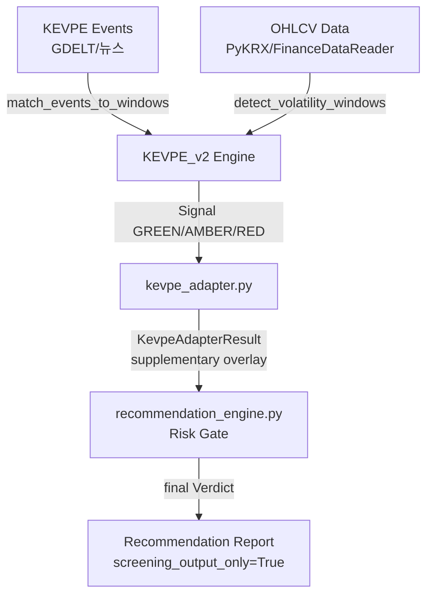

# KEVPE_v2 → stock_rtx4060_unified Integration Plan

> Created: 2026-05-03 | Status: Implemented (Step 3 complete)

## Objective

Integrate `KEVPE_final_package/kevpe_v2.py` (Korea Event-Volatility Pattern Engine v2) with the existing `stock_rtx4060_unified` system to provide **event-based risk signal overlay** for Track-S/Track-L recommendation engine, without creating circular dependencies or breaking existing safety boundaries.

---

## Scope (In / Out)

### In
- KEVPE_v2 `Signal` dataclass → `stock_rtx4060_unified` auxiliary risk signal
- `current_signal_v2()` → supplementary overlay during candidate screening
- KEVPE `backtest_v2` → parallel evaluation alongside existing `backtester.py`
- KEVPE events (GDELT/뉴스) → existing `data_providers.py` data source policy respected

### Out
- Broker/order execution integration (both systems screening-only boundary maintained)
- Auto-buy/sell linking
- KEVPE_v2 as standalone trading system
- Modification of existing `recommendation_engine.py` Risk Gate architecture (additive, not replacement)

---

## Architecture



### Integration Pattern

```
KEVPE Signal (GREEN/AMBER/RED)
    → kevpe_adapter.get_kevpe_verdict() → auxiliary verdict supplement
    → recommendation_engine receives it as optional context
    → final verdict comes from recommendation_engine's own Risk Gate
```

---

## Files

| File | Change | Description |
|------|--------|-------------|
| `stock_rtx4060_unified/src/stock_rtx4060/kevpe_adapter.py` | **NEW** | Lazy-import adapter, `KevpeAdapterResult`, singleton accessor |
| `docs/KEVPE_INTEGRATION_PLAN.md` | **NEW** | This document |
| `CHANGELOG.md` | UPDATE | KEVPE_v2 integration entry |

---

## Adapter Design

### `KevpeAdapterResult` (normalized output)

| Field | Type | Description |
|-------|------|-------------|
| `regime` | `str` | GREEN / AMBER / RED |
| `score` | `float` | 0.0~1.0 (higher = more risky) |
| `expected_return_pct` | `float` | % expected return |
| `ci_low_pct` | `float` | 5th percentile CI |
| `ci_high_pct` | `float` | 95th percentile CI |
| `reason` | `str` | Human-readable signal reason |
| `confidence` | `str` | low / medium / high (based on CI width) |
| `is_available` | `bool` | False if KEVPE not initialized or data insufficient |

### Key Design Decisions

1. **Lazy import** — KEVPE module loaded only when adapter method called; stock_rtx4060 runs if KEVPE not installed
2. **单向 bridge** — adapter imports from KEVPE, recommendation_engine never imports from KEVPE
3. **No broker execution** — adapter output is screening-only, same as recommendation engine
4. **Deterministic signal** — `as_of` parameter ensures reproducible results

---

## Signal → Verdict Mapping (Reference)

| KEVPE Regime | Recommendation Engine Input | Effect |
|-------------|----------------------------|--------|
| GREEN | Risk score 0.0-0.3 | Low risk overlay |
| AMBER | Risk score 0.3-0.6 | Medium risk, review recommended |
| RED | Risk score 0.6-1.0 | High risk overlay, may trigger RED verdict |

> Final verdict always from recommendation_engine's own Risk Gate (GREEN/AMBER/RED/ZERO)

---

## Testing

| Test Suite | Command | Expected |
|-----------|---------|----------|
| KEVPE_v2 unit tests | `py -3.12 -m unittest -v test_kevpe_v2` | 18/18 PASS |
| stock_rtx4060_unified tests | `.venv\Scripts\python.exe -m pytest -q` | 19/19 PASS |
| Adapter smoke | Import `kevpe_adapter.py` → instantiate `KevpeAdapter()` | No errors |

---

## Implementation Steps

| Step | Status | Description |
|------|--------|-------------|
| Step 1 | ✅ Done | Analysis — read KEVPE_v2 docs, recommendation_engine.py structure |
| Step 2 | ✅ Done | Design — adapter pattern, Mermaid architecture |
| Step 3 | ✅ Done | Implement — `kevpe_adapter.py` created |
| Step 4 | ✅ Done | Tests — KEVPE 18/18 PASS, stock_rtx4060_unified 19/19 PASS |
| Step 5 | ⏳ Optional | Integration — connect KEVPE signal to recommendation_engine.py |
| Step 6 | ✅ Done | Docs — this document + CHANGELOG update |

---

## Risk / Assumptions

| Risk | Mitigation |
|------|------------|
| GREEN/AMBER/RED semantics differ between KEVPE and recommendation engine | Clear mapping table; KEVPE only supplementary overlay |
| Look-ahead leak | KEVPE's `as_of` deterministic design maintained; existing OOS validation reused |
| Circular dependency | Adapter is one-way (KEVPE → recommendation); recommendation does not depend on KEVPE |
| Performance overhead | KEVPE_v2 O(n) — sufficient for real-time on hundreds of tickers |

**Assumption**: KEVPE_v2's `detect_volatility_windows`, `match_events_to_windows` require PyKRX/FinanceDataReader data — live data connection is separate work (currently synthetic/demo level).