# LAYOUT

## Repository Layout Tree

This tree reflects the root scan with build/cache artifacts excluded.

```mermaid
flowchart TB
    Root[Repository root] --> RootDocs[README.md / CHANGELOG.md]
    Root --> Entrypoints[main.py / run.ps1 / stock_investment_os.py]
    Root --> ActivePackage[workspaces/stock_rtx4060]
    Root --> Tests[tests/test_core.py]
    Root --> Docs[docs]
    Root --> Reports[reports]
    Root --> Workspaces[workspaces generated/reference areas]
    Root --> Archive[archive/original_inputs]

    ActivePackage --> CLI[main.py]
    ActivePackage --> Features[feature_engine.py]
    ActivePackage --> Models[ensemble_model.py]
    ActivePackage --> Risk[risk_rules.py]
    ActivePackage --> Backtest[backtester.py]
    ActivePackage --> Recommend[recommendation_engine.py]
    ActivePackage --> ReportWriter[reports.py]
    ActivePackage --> Runtime[hw_profile.py]
    ActivePackage --> Benchmarks[benchmark.py]

    Docs --> Setup[SETUP.md / SETUP_2026.md]
    Docs --> Architecture[SYSTEM_ARCHITECTURE.md]
    Docs --> LayoutDoc[LAYOUT.md]
    Docs --> Spec[Spec.md]
    Reports --> GeneratedEvidence[Generated Markdown / JSON / CSV]
    Workspaces --> Demo[demo_workspace]
    Workspaces --> RuntimeEvidence[actual_execution_workspace]
    Archive --> OriginalZip[주식.zip]
```



```text
.
├── CHANGELOG.md
├── README.md
├── main.py
├── stock_investment_os.py
├── run.ps1
├── requirements.txt
├── requirements-gpu-wsl.txt
├── pyproject.toml
├── tests/
│   └── test_core.py
├── docs/
│   ├── AGENTS.md
│   ├── BENCHMARK_2026_REVIEW.md
│   ├── GITHUB_CROSS_CHECK.md
│   ├── LAYOUT.md
│   ├── MOVE_PLAN.md
│   ├── PATCH_NOTES.md
│   ├── SETUP.md
│   ├── SETUP_2026.md
│   ├── SYSTEM_ARCHITECTURE.md
│   ├── Spec.md
│   ├── plan.md
│   ├── plan_rev.md
│   └── uiux.md
├── examples/
│   └── sample_ohlcv.csv
├── reports/
├── workspaces/
│   ├── actual_execution_workspace/
│   ├── actual_run_workspace/
│   ├── demo_workspace/
│   ├── run_wrapper_workspace/
│   ├── stock_rtx4060/
│   │   ├── __init__.py
│   │   ├── backtester.py
│   │   ├── benchmark.py
│   │   ├── ensemble_model.py
│   │   ├── feature_engine.py
│   │   ├── hw_profile.py
│   │   ├── main.py
│   │   ├── recommendation_engine.py
│   │   ├── reports.py
│   │   └── risk_rules.py
│   └── stock_rtx4060_patched/
├── archive/
│   └── original_inputs/
│       └── 주식.zip
├── 주식/
└── mnt/
```

## Folder-by-folder Purpose

| Path | Purpose | Maintenance note |
|---|---|---|
| `workspaces/stock_rtx4060/` | Active Python package. | Add core code here first. |
| `tests/` | Root pytest tests for active package behavior. | Add tests here for new root package behavior. |
| `docs/` | Supporting setup, benchmark, and cross-check notes. | Keep generated benchmark evidence paths current. |
| `examples/` | Sample data. | Keep small and reproducible. |
| `reports/` | Generated benchmark and validation reports. | Treat as generated evidence, not core source. |
| `workspaces/actual_execution_workspace/` | Current-session generated runtime reports and benchmark evidence. | Do not document as source code. |
| `workspaces/actual_run_workspace/` | Generated runtime workspace from prior runs. | Treat as evidence/archive. |
| `workspaces/run_wrapper_workspace/` | Generated workspace from wrapper checks. | Treat as evidence/archive. |
| `workspaces/demo_workspace/` | Generated sample data and reports from `demo`. | Recreate with `.\run.ps1 demo --workspace .\workspaces\demo_workspace`. |
| `workspaces/stock_rtx4060_patched/` | Older patched/reference package copy. | Do not treat as the active root implementation unless explicitly requested. |
| `주식/` | Nested copy/archive with duplicated project files. | Do not edit as the primary root unless explicitly requested. |
| `mnt/` | Imported/output copy area. | Treat as archive/generated material. |

## Important Files

| File | Purpose |
|---|---|
| `main.py` | Root compatibility wrapper for the active package CLI. |
| `stock_investment_os.py` | Backward-compatible old entrypoint name. |
| `run.ps1` | PowerShell runner that resolves Python and calls `main.py`. |
| `requirements.txt` | Base runtime dependencies. |
| `requirements-gpu-wsl.txt` | TensorFlow GPU dependency extension for WSL2/Linux path. |
| `pyproject.toml` | pytest, ruff, and black configuration. |
| `docs/AGENTS.md` | Agent working rules and project safety boundaries. |
| `docs/Spec.md` | Feature contract with unresolved approval blockers. |
| `docs/plan_rev.md` | Revised implementation plan. |
| `docs/uiux.md` | Report/output oriented UX notes. |
| `docs/SETUP.md` | Local setup and command notes. |
| `docs/PATCH_NOTES.md` | Older patch notes. Some benchmark wording is stale. |
| `README.md` | Operator-facing repository entrypoint. |
| `docs/SYSTEM_ARCHITECTURE.md` | System architecture and data flow. |
| `docs/LAYOUT.md` | Repository layout and maintenance guide. |
| `CHANGELOG.md` | Current inferred changelog and evidence list. |

## Active Package File Map

| File | Type | Important exports/functions/classes | Doc relevance |
|---|---|---|---|
| `workspaces/stock_rtx4060/__init__.py` | Package metadata | `__version__` | Current version string: `2026.05.02-patched`. |
| `workspaces/stock_rtx4060/main.py` | CLI/router | `build_parser`, `cmd_env`, `cmd_benchmark`, `cmd_report`, `cmd_predict`, `cmd_recommend`, `cmd_demo`, `cmd_journal`, `cmd_self_test` | Source of supported commands. |
| `workspaces/stock_rtx4060/recommendation_engine.py` | Recommendation scanner | `RecommendationConfig`, `RecommendationEngine`, `RecommendationRun`, `RecommendationResult`, `render_markdown`, `parse_universe` | Source of report-only Top-N Algorithm v2 candidate ranking. |
| `workspaces/stock_rtx4060/feature_engine.py` | Feature module | `TechnicalIndicators`, `normalize_ohlcv`, `make_synthetic_ohlcv`, `build_feature_frame`, `align_feature_columns` | Source of lagged OHLCV and Algorithm v2 indicator flow. |
| `workspaces/stock_rtx4060/ensemble_model.py` | Model module | `ModelConfig`, `DirectionModel`, `EnsemblePredictor`, `LSTMPredictor`, `xgb_params_for_device` | Source of leak-safe CV, OOF probabilities, and CPU/GPU model behavior. |
| `workspaces/stock_rtx4060/risk_rules.py` | Risk gate module | `RiskConfig`, `CandidateVerdict`, `evaluate_track_s_candidate`, `evaluate_track_l_candidate`, `position_size_by_risk` | Source of Track-S/Track-L gates. |
| `workspaces/stock_rtx4060/backtester.py` | Backtest module | `Backtester`, `BacktestConfig`, `BacktestResult`, `KellyCriterion` | Source of dry-run backtest, fixed-risk sizing, fractional Kelly, costs, slippage, and monthly stop metrics. |
| `workspaces/stock_rtx4060/hw_profile.py` | Runtime validation module | `runtime_status`, `xgboost_gpu_status`, `tensorflow_gpu_status`, `xgb_params` | Source of GPU/environment gates. |
| `workspaces/stock_rtx4060/benchmark.py` | Benchmark module | `run_benchmark`, `write_benchmark_report`, `BenchmarkItem`, `BenchmarkReport` | Source of benchmark row names. |
| `workspaces/stock_rtx4060/reports.py` | Report module | `ReportWriter` methods | Source of generated Markdown/JSON/CSV reports. |

## Naming Conventions

| Artifact | Convention |
|---|---|
| CLI commands | `env`, `benchmark`, `report`, `predict`, `recommend`, `demo`, `journal`, `self-test`. |
| Command handlers | `cmd_<command>` in `workspaces/stock_rtx4060/main.py`. |
| Generated reports | `daily_brief_*.md`, `risk_dashboard_*.md`, `track_l_thesis_*.md`, `monthly_scorecard_*.md`, `pipeline_result_*.json`, `recommendations_algo_v2_*.md`, `recommendations_algo_v2_*.json`. |
| Benchmark reports | `benchmark_*.md` and `benchmark_*.json`. |
| Journal | `decision_journal.csv`. |
| Tests | `test_*` functions under `tests/`. |

## Where to Add New Features

| Feature type | Add here |
|---|---|
| New CLI option or command | `workspaces/stock_rtx4060/main.py` |
| New candidate scanner behavior | `workspaces/stock_rtx4060/recommendation_engine.py` |
| New technical indicator | `workspaces/stock_rtx4060/feature_engine.py` |
| New model backend | `workspaces/stock_rtx4060/ensemble_model.py` |
| New risk gate rule | `workspaces/stock_rtx4060/risk_rules.py` |
| New benchmark row | `workspaces/stock_rtx4060/benchmark.py` |
| New Markdown/JSON report | `workspaces/stock_rtx4060/reports.py` |
| New environment validation | `workspaces/stock_rtx4060/hw_profile.py` |

## Where to Add Tests

Add root tests under `tests/`.

Current tests:

- `test_feature_engine_generates_targets`
- `test_model_fallback_and_backtester_run`
- `test_model_uses_gap_and_keeps_oof_partial`
- `test_track_s_risk_gate_and_position_sizing`
- `test_recommendation_engine_synthetic_run`

Risk gate changes should add or extend tests in `tests/test_core.py`.

## Where to Add Docs

| Doc type | Location |
|---|---|
| Operator setup and command docs | `README.md` and `docs/SETUP.md` |
| Architecture and data flow | `docs/SYSTEM_ARCHITECTURE.md` |
| Repository organization | `docs/LAYOUT.md` |
| Benchmark notes | `docs/BENCHMARK_2026_REVIEW.md` |
| Change record | `CHANGELOG.md` |
| Feature contract | `docs/Spec.md` |

## Generated / Ignored Files

Treat these as generated, archive, or evidence folders unless the task explicitly asks to edit them:

- `reports/`
- `workspaces/demo_workspace/`
- `workspaces/actual_execution_workspace/`
- `workspaces/actual_run_workspace/`
- `workspaces/run_wrapper_workspace/`
- `mnt/`
- `workspaces/stock_rtx4060_patched/`
- `주식/`
- `*.pyc`
- `__pycache__/`
- `.pytest_cache/`

## Maintenance Rules

- Keep active code changes inside `workspaces/stock_rtx4060/` unless wrappers, tests, docs, or config need updates.
- Keep root wrapper files small and compatibility-focused.
- Do not document browser dashboard, API server, broker execution, deployment, or ports unless matching files are added and verified.
- Do not place secrets, broker credentials, personal account data, or API keys in reports or logs.
- Prefer CSV input for reproducible report generation.
- Run `.\run.ps1 self-test` after code changes.
- Run `python -m pytest -q` for regression checks when tests are affected. If the default `python` lacks pytest, run the installed test environment directly, for example `C:\Users\jichu\AppData\Local\Programs\Python\Python312\python.exe -m pytest -q`.
- For GPU claims, record `nvidia-smi` and XGBoost/TensorFlow validation output.

