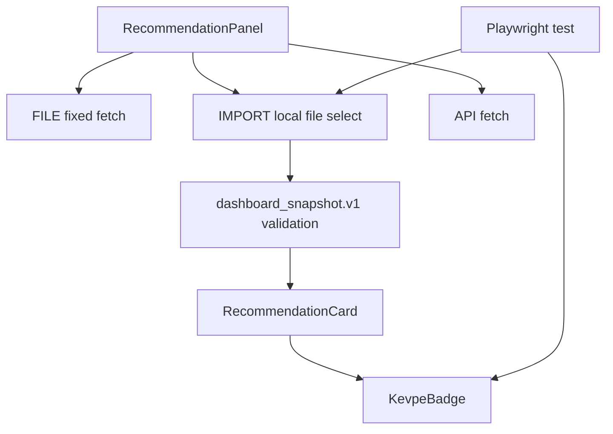

# PLAN_DASHBOARD_IMPORT_BUTTON_2026-05-03

## Phase 1: Business Review

### 1.1 문제 정의

현재 `stock-pred-v5` 대시보드의 `FILE` 모드는 실제 파일 선택이 아니라 `/dashboard_snapshot.json` 고정 경로를 fetch한다.
목표 상태는 기존 `FILE` 자동 로드를 유지하면서, 옆에 `IMPORT` 버튼을 추가해 사용자가 임의의 `dashboard_snapshot.json`을 직접 선택할 수 있게 하는 것이다.

영향 범위:
- UI 변경: `stock-pred-v5/src/components/RecommendationPanel.jsx`
- 검증 변경: `stock-pred-v5/tests/kevpe-dashboard.spec.js`
- 기존 FILE/API 동작은 유지해야 한다.

### 1.2 제안 옵션

| 옵션 | 설명 | 공수(일) | 리스크 | 비용(AED) |
|---|---|---:|---|---:|
| A | `FILE` 모드를 실제 파일 업로드로 바꾼다. | 0.5 | 기존 자동 demo와 Playwright 검증 경로가 깨질 수 있다. | 0 |
| B | 기존 `FILE`은 유지하고 `IMPORT` 버튼을 추가한다. | 0.5 | 버튼이 하나 늘지만 동작 경계가 명확하다. | 0 |
| C | `FILE` 버튼 클릭 시 자동 로드와 파일 선택을 메뉴로 분기한다. | 1.0 | UI 복잡도가 늘고 테스트도 늘어난다. | 0 |

### 1.3 추천 & 근거

추천 옵션: B.

이유:
- 현재 `/dashboard_snapshot.json` 기반 demo와 자동 검증을 깨지 않는다.
- 사용자는 `reports/.../dashboard_snapshot.json`을 직접 선택할 수 있다.
- 기존 `API` 모드와도 충돌하지 않는다.

롤백 전략:
- `IMPORT` 버튼, hidden file input, import handler, 관련 테스트만 되돌리면 기존 FILE/API 동작으로 복귀한다.

### 1.4 승인 요청

- [ ] Phase 1 승인

## Phase 2: Engineering Review

가정: 사용자가 Phase 1을 승인하면 아래 순서로 구현한다.

### 2.1 Mermaid 다이어그램

### 2.2 파일 변경 목록

| 파일 | 변경 유형 | 설명 |
|---|---|---|
| `stock-pred-v5/src/components/RecommendationPanel.jsx` | modify | `IMPORT` 버튼, hidden file input, JSON parse/validate/import 상태 처리 추가 |
| `stock-pred-v5/tests/kevpe-dashboard.spec.js` | modify | 실제 파일 선택으로 `reports/kevpe_event_smoke/dashboard_snapshot.json` import 후 `KEVPE AMBER` 표시 확인 |
| `CHANGELOG.md` | modify | IMPORT 버튼 추가와 브라우저 검증 결과 기록 |

### 2.3 의존성 & 순서

1. `RecommendationPanel.jsx`에 import handler를 추가한다.
2. `FILE`, `IMPORT`, `API` 버튼을 분리한다.
3. import한 snapshot은 기존 `snapshot` state에 넣어 `RecommendationCard`와 `KevpeBadge`가 그대로 쓰게 한다.
4. Playwright 테스트를 파일 선택 흐름으로 바꾼다.
5. Vite build와 Playwright 검증을 실행한다.

병렬 가능:
- UI handler 구현과 테스트 기대 문구 정리는 병렬 가능하다.
- 단, 최종 Playwright 검증은 UI 구현 후 실행해야 한다.

### 2.4 테스트 전략

단위/컴포넌트 수준:
- 별도 React unit test는 현재 프로젝트에 없다. 기존 방식에 맞춰 Playwright 브라우저 검증으로 확인한다.

통합 테스트:
- `npx playwright test tests/kevpe-dashboard.spec.js --reporter=line`
- 기대 결과:
  - 브라우저에서 대시보드가 열린다.
  - `IMPORT` 버튼이 보인다.
  - `dashboard_snapshot.json`을 선택한다.
  - 추천 카드에 `KEVPE AMBER`, `E[RV]=-1.3%`, `CI [-3.3, 0.7]`가 보인다.

빌드 테스트:
- `npm --prefix .\stock-pred-v5 run build`

기존 회귀 위험:
- `FILE` 버튼의 `/dashboard_snapshot.json` fetch 동작
- `API` 버튼의 `/api/recommend` fetch 동작
- 기존 recommendation card 정렬/필터 UI

### 2.5 리스크 & 완화

| 리스크 | 영향 | 완화 |
|---|---|---|
| 사용자가 잘못된 JSON을 고름 | 화면에 빈 데이터 또는 오류 발생 | `dashboard_snapshot.v1`와 `results` 배열 검증 후 오류 메시지 표시 |
| FILE과 IMPORT 의미 혼동 | 사용자가 버튼 역할을 헷갈릴 수 있음 | 버튼 라벨을 `FILE`과 `IMPORT`로 분리하고 FILE은 기존 고정 fetch로 유지 |
| Playwright 파일 경로 차이 | 테스트가 로컬 경로에서 실패 가능 | 절대 경로로 `dashboard_snapshot.json`을 지정 |
| 보안 민감정보 노출 | 로컬 JSON 내용이 화면에 표시될 수 있음 | provider config 같은 민감 경로는 dashboard snapshot에서 이미 제외된 필드만 사용 |

## Acceptance Criteria

| 기준 | 판정 방법 |
|---|---|
| 기존 FILE 동작 유지 | `/dashboard_snapshot.json` fetch로 카드 표시 |
| IMPORT 동작 추가 | 사용자가 선택한 `dashboard_snapshot.json`으로 카드 표시 |
| KEVPE badge 표시 | Playwright에서 `KEVPE AMBER` visible |
| 빌드 통과 | `npm run build` PASS |
| 문서/이력 반영 | `CHANGELOG.md`에 변경과 검증 결과 추가 |
