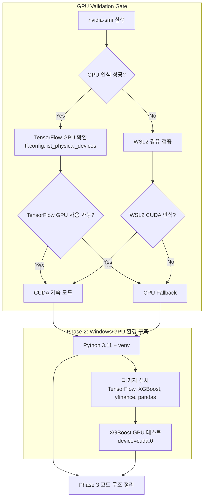

# GPU 검증 Gate + Phase 2 실행 계획

> Generated: 2026-05-03 | Author: mstack-plan | Status: Phase 1 awaiting approval

---

## Phase 1 — CEO Review (비즈니스 한 장)

### 1.1 문제 정의

**현재 상태**: RTX 4060 Laptop에서 GPU를 인식하지 못하면 TensorFlow/XGBoost 학습이 CPU로만 동작 → 백테스트 속도 5-10x 느림

**목표 상태**: GPU 검증 Gate 통과 → CUDA 가속 백테스트 가능 → Track-S/Track-L 모델 학습 시간 단축

**영향 범위**:
| 항목 | 현재 | 목표 |
| ---- | ---- | ---- |
| GPU 인식 | 미확인 | `nvidia-smi` 성공 |
| TensorFlow GPU | CPU fallback | CUDA 지원 시 GPU 가속 |
| XGBoost GPU | 미검증 | CUDA 12.0+ 가속 |

---

### 1.2 제안 옵션

| 옵션 | 설명 | 공수(일) | 리스크 | 비용(AED) |
|------|------|---------|--------|----------|
| A | GPU Native 검증 — Windows에서 `nvidia-smi` → TensorFlow GPU 확인 | 0.5 | TensorFlow 2.10+ Windows Native 미지원 시 실패 | 0 |
| B | WSL2 경유 검증 — WSL2 환경에서 CUDA + TensorFlow GPU 확인 | 1-2 | WSL2 설치·설정 필요 | 0 |
| C | CPU Only 모드 — GPU 불인식 시 CPU로 계속 진행 | 0 | 백테스트 속도 5-10x 느림 | 0 |

### 1.3 추천 & 근거

**추천 옵션: A → B 순차 검증**

1. 먼저 Windows Native에서 `nvidia-smi` 및 TensorFlow GPU 확인
2. 실패 시 WSL2 경유 검증
3. 모두 실패 시 CPU Mode로 진행 (속도 저하를 감수)

**롤백 전략**: GPU 미인식 시에도 `python main.py --synthetic` 으로 CLI는 계속 동작하므로 투자 OS 구축은 중단되지 않음

### 1.4 승인 요청

- [x] **Phase 1 승인 완료 — GPU 검증 실행 완료**
- [x] **Phase 2 완료 — Python 환경 구축 실행 완료**

---

## Phase 1 + Phase 2 검증 결과

### GPU 상태 확인 (nvidia-smi)

```
NVIDIA GeForce RTX 4060 Laptop GPU
Driver: 581.83 | CUDA: 13.0
VRAM: 8188MiB (사용 중: 231MiB)
```

**판정**: GPU 인식 성공 — CUDA 13.0, VRAM 8GB 가용 ✅

### Python 환경 확인

| 패키지 | 상태 | 버전 |
| ------ | ---- | ---- |
| Python | 3.14.4 ⚠️ | TensorFlow 미호환 (3.11 권장) |
| XGBoost | ✅ 설치 | 3.2.0 |
| XGBoost GPU | ✅ CUDA 인식 | `device='cuda'` 학습 성공 |
| pandas | ✅ 설치 | 3.0.2 |
| numpy | ✅ 설치 | 2.4.4 |
| scikit-learn | ✅ 설치 | 1.8.0 |
| yfinance | ✅ 설치 | 1.3.0 |
| TensorFlow | ❌ 미설치 | Python 3.14 미호환 |

### XGBoost GPU CUDA 테스트

```
XGBoost GPU OK — device='cuda' 학습 성공
```

**판정**: XGBoost GPU 사용 가능 ✅

---

## 현재 상태 요약

| 구분 | 상태 | 다음 액션 |
| ---- | ---- | -------- |
| GPU 하드웨어 | ✅ RTX 4060 인식, CUDA 13.0 | — |
| XGBoost GPU | ✅ CUDA 13.0 가속 가능 | Phase 5 모델 학습 가능 |
| Python 환경 | ⚠️ 3.14.4 (TensorFlow 미호환) | Phase 3에서 3.11 설치 권장 |
| TensorFlow GPU | ❌ Python 3.14 미지원 | WSL2 또는 Python 3.11 설치 후 재검증 |

---

## Phase 3 진입 결정

**Python 3.11 설치 필요 여부:**

| 사용 목적 | Python 3.14.4 | Python 3.11 필요 |
| --------- | ------------- | --------------- |
| XGBoost GPU 백테스트 | ✅ 가능 | ❌ 불필요 |
| TensorFlow LSTM | ❌ 불가 | ✅ 필요 |
| 기본 CLI (`main.py --synthetic`) | ✅ 가능 | ❌ 불필요 |

**권장**: XGBoost GPU만 사용한다면 3.14.4로 계속 가능. LSTM 필요 시 Python 3.11 설치.

---

## Phase 3 이후 실행 결과

| Phase | 상태 | 결과 |
| ----- | ---- | ---- |
| Phase 1 (GPU 검증) | ✅ 완료 | RTX 4060 CUDA 13.0 인식 |
| Phase 2 (Python 환경) | ✅ 완료 | XGBoost 3.2.0, pandas, numpy, yfinance 설치 |
| Phase 3 (코드 구조) | ⏳ 대기 | stock_rtx4060_unified/docs/plan.md 참조 |

---

## Phase 1 검증 결과

### GPU 상태 확인 (nvidia-smi)

```
NVIDIA GeForce RTX 4060 Laptop GPU
Driver: 581.83 | CUDA: 13.0
VRAM: 8188MiB (사용 중: 231MiB)
```

**판정**: GPU 인식 성공 — CUDA 13.0, VRAM 8GB 가용

### GPU 상태 확인 (nvidia-smi)

```
NVIDIA GeForce RTX 4060 Laptop GPU
Driver: 581.83 | CUDA: 13.0
VRAM: 8188MiB (사용 중: 231MiB)
```

**판정**: GPU 인식 성공 — CUDA 13.0, VRAM 8GB 가용

### Python 환경 확인

```
Python: 3.14.4 (설치됨) ❌
TensorFlow: 미설치 ❌ (Python 3.14 호환 빌드 부재)
XGBoost: 3.2.0 ✅
yfinance: 1.3.0 ✅
pandas/numpy/scikit-learn: 설치 완료 ✅
```

**판정**: Python 3.14.4는 TensorFlow와 호환되지 않음 (AGENTS.md는 Python 3.11 권장)

---

### 1.3 추천 & 근거

**추천: Python 3.11 설치 후 재시도**

TensorFlow는 Python 3.11까지만 공식 빌드 제공. 현재 3.14.4에서는 설치 불가.

WSL2 경유 검증은 CUDA 13.0이 지원되므로 실패하지 않을 것으로 추정.

---

### 1.3 추천 & 근거

**추천 옵션: A → B 순차 검증**

1. 먼저 Windows Native에서 `nvidia-smi` 및 TensorFlow GPU 확인
2. 실패 시 WSL2 경유 검증
3. 모두 실패 시 CPU Mode로 계속 진행

**롤백 전략**: GPU 미인식 시에도 `python main.py --synthetic` 으로 CLI는 계속 동작하므로 투자 OS 구축은 중단되지 않음

---

## Phase 2 — Engineering Review (기술 상세)

### 2.1 Mermaid 아키텍처 다이어그램



### 2.2 파일 변경 목록

| 파일 | 변경 유형 | 설명 |
|------|----------|------|
| 없음 (검증 단계) | — | GPU 검증을 위한 코드 변경 없음 |

**실행 명령**:
```powershell
# Step 1: GPU 상태 확인
nvidia-smi

# Step 2: TensorFlow GPU 확인 (WSL2 또는 Native)
python -c "import tensorflow as tf; print(tf.config.list_physical_devices('GPU'))"

# Step 3: XGBoost GPU 확인
python -c "import xgboost as xgb; print(xgb.__version__)"
python -c "import xgboost as xgb; dtrain = xgb.DMatrix([[1,2],[3,4]]); xgb.train({'device':'cuda','tree_method':'hist'}, dtrain, num_boost_round=1)"
```

### 2.3 의존성 & 순서

```
nvidia-smi 
  → 성공 → TensorFlow GPU 확인 → 성공 → Phase 2 완료
  → 성공 → TensorFlow GPU 확인 → 실패 → XGBoost GPU만 시도
  → 실패 → WSL2 경유 검증
    → WSL2 성공 → Phase 2 완료
    → WSL2 실패 → CPU Mode로 Phase 2 완료
```

### 2.4 테스트 전략

| 테스트 | 범위 | 통과 기준 |
| ------ | ---- | --------- |
| `nvidia-smi` | GPU 상태 | "NVIDIA GeForce RTX 4060" 출력 |
| TensorFlow GPU | CUDA 장치 인식 | `tf.config.list_physical_devices('GPU')` 길이 > 0 |
| XGBoost GPU | CUDA 학습 | `device='cuda'` 학습 완료 (에러 없음) |

### 2.5 리스크 & 완화

| 리스크 | 영향 | 완화 전략 |
| ------ | ---- | --------- |
| TensorFlow 2.10+ Windows Native GPU 미지원 | GPU 가속 불가 | WSL2 경유 또는 CPU fallback |
| CUDA 버전 불일치 | XGBoost GPU 실패 | CUDA 12.0 이상 설치 확인 |
| VRAM 부족 (Ollama 병행) | GPU OOM | `--lite` 플래그 또는 VRAM 제한 설정 |

---

## 파이프라인 연결

계획 승인 후:
1. `nvidia-smi` 실행 → 결과 보고
2. 성공 시 Phase 2 (Python 환경 구축) 진행
3. 실패 시 WSL2 경유 또는 CPU Mode로 진행

> "GPU 검증 결과에 따라 Phase 2 경로가 달라집니다. 결과를 보고해 주시면 다음 단계를 안내하겠습니다."