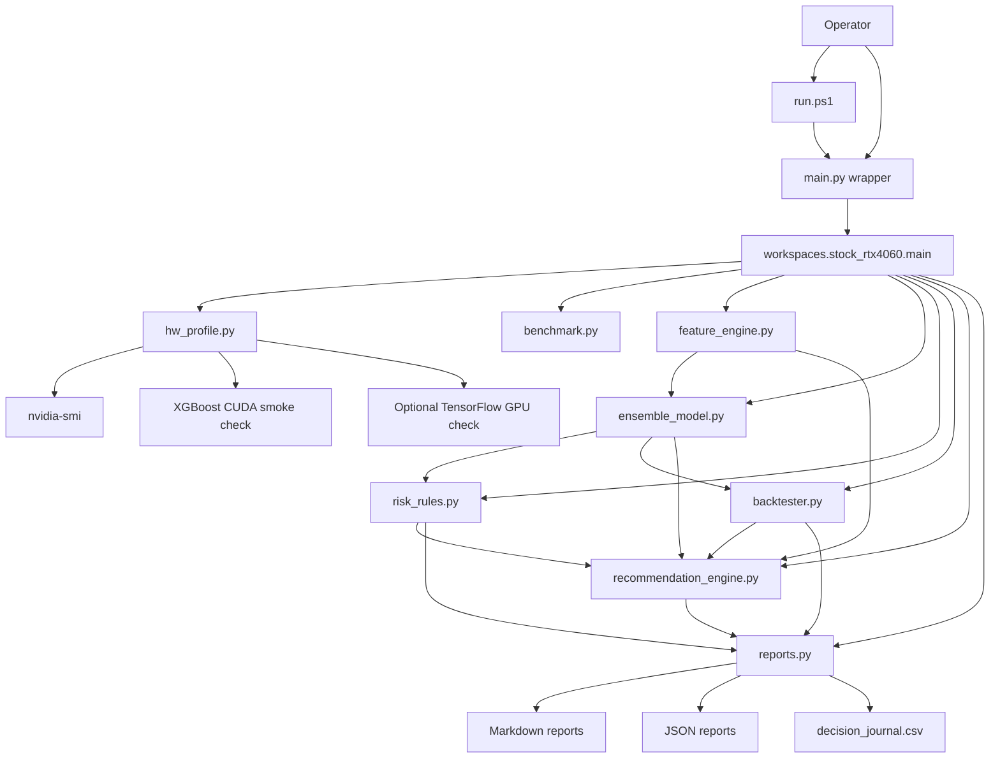
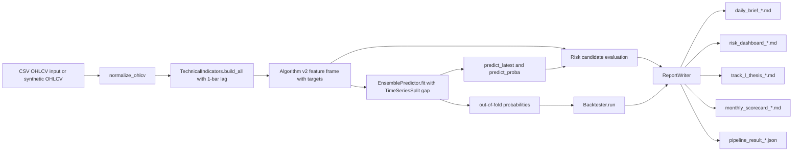
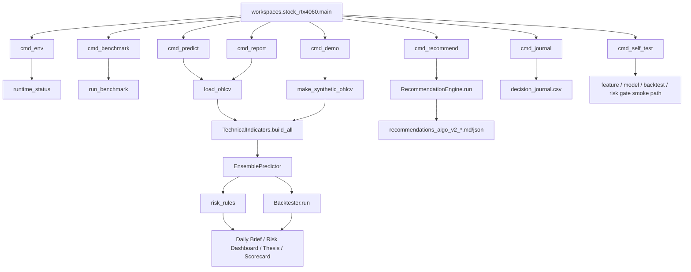

# SYSTEM_ARCHITECTURE

## Architecture Overview

`stock_rtx4060` is a local Python CLI package for stock screening, report-only recommendation ranking, risk-gated candidate evaluation, dry-run backtesting, and report generation.

The active package includes Algorithm v2 behavior: 1-bar lagged features, Wilder-style indicators, purged walk-forward CV through `TimeSeriesSplit(gap=...)`, out-of-fold probabilities, ATR risk plans, fixed-risk sizing, fractional Kelly sizing, transaction costs, slippage, and monthly stop logic.

The active implementation is centered on:

- `main.py`: root compatibility wrapper.
- `run.ps1`: Windows PowerShell runner.
- `workspaces/stock_rtx4060/main.py`: CLI command router.
- `workspaces/stock_rtx4060/`: package modules.
- `tests/test_core.py`: root smoke tests.

The system writes local Markdown, JSON, and CSV files. It does not expose an HTTP API. It does not run a web server. It does not submit broker orders.

## Component Diagram

## Data Flow Diagram

## CLI Command Graph

## Core Components

| Component | File | Important functions/classes | Purpose |
|---|---|---|---|
| Root wrapper | `main.py` | `cli()` | Imports `workspaces.stock_rtx4060.main.main` and prints dependency help on missing package errors. |
| Legacy wrapper | `stock_investment_os.py` | imports `cli` | Preserves earlier single-script entrypoint name. |
| Windows runner | `run.ps1` | PowerShell script | Finds Python and runs `main.py` with supplied arguments. |
| CLI router | `workspaces/stock_rtx4060/main.py` | `build_parser`, `cmd_env`, `cmd_benchmark`, `cmd_report`, `cmd_predict`, `cmd_recommend`, `cmd_demo`, `cmd_journal`, `cmd_self_test` | Defines command surface and runtime flow. |
| Recommendation scanner | `workspaces/stock_rtx4060/recommendation_engine.py` | `RecommendationConfig`, `RecommendationEngine`, `RecommendationRun`, `RecommendationResult`, `render_markdown`, `parse_universe` | Ranks Track-S / Track-L candidates and writes `screening_output_only` Algorithm v2 Markdown/JSON reports. |
| Feature engine | `workspaces/stock_rtx4060/feature_engine.py` | `TechnicalIndicators`, `normalize_ohlcv`, `make_synthetic_ohlcv`, `build_feature_frame`, `align_feature_columns` | Converts OHLCV data into lagged Algorithm v2 indicators and targets. |
| Model layer | `workspaces/stock_rtx4060/ensemble_model.py` | `ModelConfig`, `DirectionModel`, `LSTMPredictor`, `EnsemblePredictor`, `xgb_params_for_device` | Trains and predicts with leak-safe CV, logistic fallback, XGBoost CPU/CUDA request, optional LSTM, and OOF probabilities. |
| Risk gate | `workspaces/stock_rtx4060/risk_rules.py` | `RiskConfig`, `CandidateVerdict`, `evaluate_track_s_candidate`, `evaluate_track_l_candidate`, `position_size_by_risk` | Applies Track-S / Track-L scores, gates, and position sizing. |
| Backtester | `workspaces/stock_rtx4060/backtester.py` | `Backtester`, `BacktestConfig`, `BacktestResult`, `KellyCriterion` | Runs dry-run signal backtests with fixed-risk sizing, fractional Kelly, costs, slippage, stops, and monthly stop metrics. |
| Runtime profile | `workspaces/stock_rtx4060/hw_profile.py` | `runtime_status`, `detect_nvidia_smi`, `tensorflow_gpu_status`, `xgboost_gpu_status`, `xgb_params` | Validates local runtime, GPU, and model backend paths. |
| Benchmark | `workspaces/stock_rtx4060/benchmark.py` | `run_benchmark`, `write_benchmark_report`, `BenchmarkItem`, `BenchmarkReport` | Measures feature build, model train, GPU path, and backtest timing. |
| Report writer | `workspaces/stock_rtx4060/reports.py` | `ReportWriter`, `daily_brief`, `risk_dashboard`, `track_l_thesis`, `monthly_scorecard`, `journal_append`, `json_report` | Writes local Markdown, CSV, and JSON outputs. |
| Tests | `tests/test_core.py` | `test_feature_engine_generates_targets`, `test_model_fallback_and_backtester_run`, `test_model_uses_gap_and_keeps_oof_partial`, `test_track_s_risk_gate_and_position_sizing`, `test_recommendation_engine_synthetic_run` | Verifies core local behavior and Algorithm v2 compatibility. |

## Runtime Flow

### `self-test`

1. `run.ps1` or `python main.py self-test` calls the root wrapper.
2. Root wrapper imports `workspaces.stock_rtx4060.main.main`.
3. `cmd_self_test()` creates synthetic OHLCV data.
4. `TechnicalIndicators.build_all()` builds features and target columns.
5. `EnsemblePredictor` trains with the default lightweight model.
6. `Backtester.run()` verifies dry-run backtest output.
7. `evaluate_track_s_candidate()` verifies candidate gate output.

### `report`

1. `load_ohlcv()` loads CSV data or tries `yfinance`.
2. If `yfinance` fails or returns empty data, the code falls back to synthetic OHLCV data.
3. Features are built through `TechnicalIndicators`.
4. Model metrics and latest prediction are generated through `EnsemblePredictor`.
5. Track-S and Track-L candidates are evaluated.
6. Backtest result is calculated.
7. `ReportWriter` writes Daily Brief, Risk Dashboard, Track-L Thesis, Monthly Scorecard, and JSON pipeline result.

### `benchmark`

1. `runtime_status()` records runtime gate.
2. Synthetic OHLCV data is generated for the requested row count.
3. Feature generation is timed.
4. NumPy logistic baseline is timed as `walk_forward_train`.
5. When `--include-gpu` is used, CPU XGBoost is timed as `walk_forward_train_xgboost_cpu`.
6. GPU-requested XGBoost is timed as `walk_forward_train_gpu_requested`.
7. Backtest timing is recorded.
8. Markdown and JSON benchmark reports are written.

### `recommend`

1. `RecommendationEngine` loads `yfinance` data or deterministic synthetic OHLCV when `--synthetic` is used.
2. `TechnicalIndicators.build_all()` builds features for Track-S or Track-L horizons.
3. `EnsemblePredictor` trains with logistic fallback, XGBoost when selected, and `TimeSeriesSplit(gap=...)` for leak-safe walk-forward validation.
4. `evaluate_track_s_candidate()` or `evaluate_track_l_candidate()` applies the existing risk gate.
5. `Backtester.run()` calculates dry-run metrics from out-of-fold model probabilities when available.
6. Markdown and JSON files named `recommendations_algo_v2_*.md/json` are written under caller-supplied `--output-dir`.
7. Every result includes `screening_output_only=True`.

## Tool / Agent / API Boundaries

| Boundary | Current state |
|---|---|
| CLI | Implemented through `argparse` in `workspaces/stock_rtx4060/main.py`. |
| API server | Not implemented. No FastAPI, Flask, Dash, Gradio, Streamlit, or port binding was found in the active root package. |
| Browser dashboard | Not implemented. The current dashboard is a Markdown report named `risk_dashboard_*.md`. |
| Broker integration | Not implemented. No order routing or broker API module was found in the active root package. |
| Agent/tool integration | No runtime agent server or MCP tool implementation was found in the active root package. |
| External data | `yfinance` is optional in `load_ohlcv()`; CSV input is supported for reproducible runs. |

## Storage and State

| State type | Location | Notes |
|---|---|---|
| Runtime validation | `reports/runtime_status.json` or caller-supplied `--output` path | Written by `cmd_env`. |
| Benchmark reports | Caller-supplied `--output-dir`, default `reports/` | Markdown and JSON files named `benchmark_*.md/json`. |
| Pipeline reports | Caller-supplied report output directory | Daily Brief, Risk Dashboard, Track-L Thesis, Monthly Scorecard, and pipeline JSON. |
| Recommendation reports | Caller-supplied `recommend --output-dir`, default `reports/recommendations` | Markdown and JSON files named `recommendations_algo_v2_*.md/json`. |
| Journal | `decision_journal.csv` in report output directory | Appended by `cmd_journal`. |
| Demo data | `workspaces/demo_workspace/data/sample_ohlcv.csv` when demo is run | Generated sample OHLCV. |
| Generated evidence | `workspaces/actual_execution_workspace/` | Current-session runtime and benchmark artifacts. |

## Validation and Approval Gates

| Gate | Implementation or source |
|---|---|
| Runtime gate | `workspaces/stock_rtx4060/hw_profile.py::runtime_status` returns `GREEN`, `AMBER`, or `RED`. |
| XGBoost GPU gate | `xgboost_gpu_status()` verifies XGBoost import and CUDA training smoke path. |
| TensorFlow GPU gate | `tensorflow_gpu_status()` is optional and native Windows TensorFlow GPU is treated cautiously by project docs. |
| Track-S gate | `evaluate_track_s_candidate()` returns `GREEN`, `AMBER`, `RED`, or `ZERO` through `CandidateVerdict`. |
| Track-L gate | `evaluate_track_l_candidate()` evaluates Track-L score and reasons. |
| Recommendation boundary | `RecommendationResult.screening_output_only` is always `True`; no broker order path is called. |
| Report-only boundary | `docs/Spec.md`, `docs/AGENTS.md`, and code structure all keep broker execution out of scope. |

## Security / Secrets Handling

- No secret-loading code was found in the active root package.
- No `.env.example` file was found.
- No broker credential path was found.
- `docs/Spec.md` requires broker credentials, API keys, personal financial data, and account identifiers to stay out of plaintext logs and reports.
- Generated reports should not receive secrets through CSV fields or command arguments.

## Error Handling

| Case | Behavior |
|---|---|
| Missing Python package | Root `main.py` catches `ModuleNotFoundError` during import and prints install/run guidance. |
| CLI command error | `workspaces/stock_rtx4060/main.py::main` catches exceptions, prints `ERROR: <type>: <message>`, and returns `1`. |
| yfinance failure | `load_ohlcv()` prints a warning and uses synthetic data. |
| XGBoost unavailable or CUDA failure | `DirectionModel` tries the requested XGBoost path, falls back to CPU XGBoost where possible, and then to logistic behavior when `model_kind` allows fallback. |
| CPU-only environment | Benchmark records fallback behavior instead of silently claiming GPU speedup. |

## Extensibility Points

| Add this | Start here |
|---|---|
| New CLI command | `workspaces/stock_rtx4060/main.py::build_parser` and a matching `cmd_*` function. |
| New recommendation ranking rule | `workspaces/stock_rtx4060/recommendation_engine.py`, then add tests in `tests/test_core.py`. |
| New feature column | `workspaces/stock_rtx4060/feature_engine.py::TechnicalIndicators.build_all`. |
| New model backend | `workspaces/stock_rtx4060/ensemble_model.py` with backend reporting. |
| New risk rule | `workspaces/stock_rtx4060/risk_rules.py`, then add tests in `tests/test_core.py`. |
| New report | `workspaces/stock_rtx4060/reports.py::ReportWriter`, then call it from `cmd_report`. |
| New benchmark item | `workspaces/stock_rtx4060/benchmark.py::run_benchmark`. |
| Browser dashboard | 가정: add a new explicitly scoped app module and dependency file; no such app exists now. |

