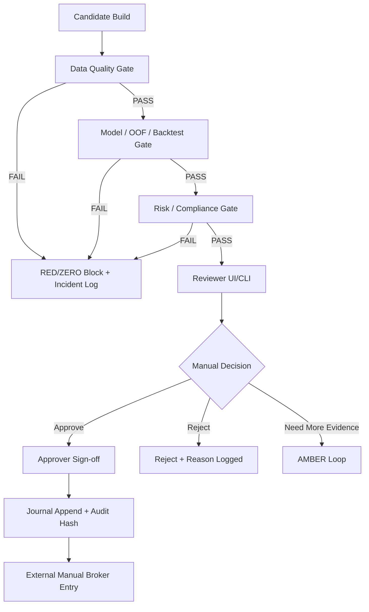

# 실데이터 기반 후보 추천·검증·승인·기록 시스템 업그레이드 기술문서

## Executive Summary

`macho715/stock_1901`는 이미 통합 CLI, 보고서 생성, 리스크 룰, 일지 기록, leak-safe feature engineering, purged walk-forward CV, OOF 확률, cost/slippage 반영 backtest를 갖춘 “연구·보고용” 기반선은 확보했다. 다만 현재 출력 경계는 `screening_output_only`이며 broker order 제출은 하지 않고, 데이터 계층도 synthetic 또는 `yfinance` 중심이라 “실데이터 운영 버전”으로 보기에는 공식 데이터 어댑터, 교차검증 Gate, 승인 DB, immutable audit log가 부족하다. fileciteturn4file0 fileciteturn8file0 fileciteturn9file0 fileciteturn24file0 fileciteturn25file0 fileciteturn26file0

권장 업그레이드 방향은 **기존 CLI/모델 코어는 유지**하고, 그 위에 **공식/primary 데이터 레이어(SEC EDGAR, OpenDART, KRX/거래소·브로커 시세 계약)**, **실데이터 검증 Gate**, **Human-in-the-loop 승인 워크플로우**, **append-only audit/journal**, **로컬/WSL2/Linux 공통 운영 체계**를 추가하는 것이다. 생산계 기본 모델은 `Logistic + XGBoost`로 두고, `TensorFlow/LSTM`은 공식 설치 제약상 WSL2 또는 Linux GPU에서만 “연구 옵션”으로 유지하는 편이 안전하다. TensorFlow 공식 문서는 Windows Native GPU 지원이 2.10에서 종료되었고 2.11 이후는 WSL2를 요구하며, 최신 pip 안내는 Python 3.10–3.13을 지원한다. XGBoost GPU 문서는 CUDA 12.0과 Compute Capability 5.0을 요구한다. FINRA는 2026 보고서에서 GenAI/AI agent 사용 시 supervisory process, testing, prompt/output log, human-in-the-loop, guardrail을 명시적으로 요구 수준으로 다루고 있다. citeturn9view0turn9view3turn8view3turn10view3turn10view4turn10view1

본 문서는 사용자 가정을 그대로 반영한다. **가정:** 총자금 미지정이므로 모든 sizing은 비율 기반으로 설계한다. 브로커 API는 미연동 상태이므로 **자동주문은 금지**한다. 운영환경은 `Windows/WSL2` 또는 `Linux server`다. 대상 저장소는 `macho715/stock_1901` 단일 저장소다. 또한 목표수익률은 **Track-S 월 +10%**, **Track-L 3년+ 누적 +20%**이지만, 이는 **운영 목표와 리스크/청산 기준**이지 수익 보장이 아니다. BlackRock과 Vanguard의 2026 공식 시각은 AI CapEx, 에너지·금리 충격, leverage, valuation/return 해석을 둘러싼 불확실성을 강조하며, Investor.gov는 소셜미디어 팁이나 “고수익·저위험” 약속만으로 투자 결정을 내리지 말라고 경고한다. 따라서 본 설계는 “고수익 약속”이 아니라 **증거 기반 screening → 검증 → 승인 → 기록** 체계로 설계해야 한다. citeturn7view0turn8view0turn8view4

| 항목 | 판정 |
|---|---|
| 현재 저장소 상태 | 연구·보고용 기준선 확보 |
| 실운영 업그레이드 필요성 | 높음 |
| 권장 생산계 기본 모델 | Logistic + XGBoost |
| TensorFlow 위치 | 선택적 연구 트랙 전용 |
| 자동매수/자동매도 | 금지 |
| 승인 방식 | Human-in-the-loop 필수 |

| 책임자 | 완료 기준 | 검증 방법 |
|---|---|---|
| Product Owner, Quant Lead | 본 문서 승인 및 범위 확정 | 문서 리뷰 승인, source mapping 확인 |

## 우선 참조 소스

아래 우선순위는 **공식성 → 운영 관련성 → 2026+ 최신성 → 한국 데이터 적합성** 순서로 정렬했다. 소스 선정 근거는 SEC, FINRA, TensorFlow, XGBoost, OpenDART, KRX, BlackRock, Vanguard, Investor.gov 공식 문서에 기반한다. citeturn16search2turn16search0turn14view0turn6search7turn10view3turn9view0turn8view3turn13search0turn13search9turn13search4turn7view0turn8view0turn8view4

| 우선순위 | 소스 | 분류 | 본 문서에서의 용도 |
|---|---|---|---|
| P1 | SEC EDGAR / data.sec.gov | 공식 primary API | 미국 상장사 공시, XBRL, filing timestamp, 기본 펀더멘털 |
| P2 | OpenDART | 공식 KR API | 한국 상장사 공시, 재무정보, corp_code 매핑 |
| P3 | KRX 정보데이터시스템 | 공식 KR 데이터 포털 | 한국 시세·지수·종목기본정보·통계 참조 |
| P4 | FINRA 2026 Regulatory Oversight Report | 공식 규제 가이드 | GenAI/감독/기록/승인/향후 broker 연계 시 best execution 기준 |
| P5 | SEC 2026 Examination Priorities / Cybersecurity | 공식 규제 가이드 | compliance program, AI·cyber 통제, 운영감사 기준 |
| P6 | TensorFlow install docs | 공식 기술 문서 | GPU/WSL2/Python 지원 범위 |
| P7 | XGBoost GPU docs | 공식 기술 문서 | CUDA/XGBoost GPU 실행 조건 |
| P8 | BlackRock Q2 2026 Outlook | 공식 투자 인사이트 | macro regime overlay와 active risk management 근거 |
| P9 | Vanguard 2026 forecasts / outlook | 공식 투자 인사이트 | valuation의 한계, 장기 return 해석, Track-L 설계 근거 |
| P10 | Investor.gov stock scam alert | 공식 투자자 보호 | 소셜미디어·고수익 약속 배제 규칙 |
| P11 | yfinance docs | 오픈소스 문서 | research fallback, personal-use-only 경계 |

| 책임자 | 완료 기준 | 검증 방법 |
|---|---|---|
| Research Lead | 우선 참조 소스 표 합의 | 소스별 official/primary 여부와 최신성 점검 |

## GitHub 기준선 진단

현재 저장소는 root wrapper `main.py`, 실행 헬퍼 `run.ps1`, 코어 패키지 `src/stock_rtx4060/`, 테스트 `tests/`, 문서형 리포트 출력 구조를 갖춘 단일 저장소다. `main.py`는 `env / benchmark / report / predict / recommend / demo / journal / self-test` 인터페이스를 노출하고, `run.ps1`는 `.venv`, Python 3.12, 3.11, 시스템 Python을 순차 선택한다. 저장소는 **보고서/스크리닝 중심**이며 투자 자문·자동주문을 경계로 제한한다. fileciteturn4file0 fileciteturn8file0 fileciteturn13file0

현행 엔진의 강점은 명확하다. `feature_engine.py`는 기본적으로 feature를 1 bar shift해 label origin과 동일 bar를 보지 않게 하고, label은 forward return으로 생성한다. `ensemble_model.py`는 `TimeSeriesSplit(gap=...)`와 OOF probability를 사용해 horizon leakage를 줄이고, XGBoost 실패 시 CPU fallback/logistic fallback을 가진다. `backtester.py`는 transaction cost, slippage, stop loss, take profit, monthly stop, fractional Kelly sizing을 구현한다. `reports.py`는 Daily Brief, Risk Dashboard, Track-L Thesis, Monthly Scorecard, decision journal을 파일로 남긴다. 즉, **모델/백테스트 코어의 생산계 전환 가능성은 높다**. fileciteturn26file0 fileciteturn24file0 fileciteturn25file0 fileciteturn20file0

약점도 분명하다. `requirements.txt`는 `yfinance`, `xgboost`, `scikit-learn`, `pandas` 중심이고, GPU WSL2 전용 extra는 `tensorflow[and-cuda]`를 별도 파일로 둔다. `pyproject.toml`은 `py311`을 기준으로 formatting/lint 설정이 존재한다. `hw_profile.py`는 TensorFlow GPU/WSL2를 권장하는 방향의 capability probe를 갖고 있다. 그러나 이 구성이 곧바로 **실데이터 운영**을 의미하지는 않는다. 부족한 것은 `공식 데이터 우선 ingestion`, `교차 소스 일치성 검증`, `승인/반려 상태 기계`, `불변 audit event store`, `실운영 smoke test`, `dry-run 운영 모드`, `real-data benchmark`다. fileciteturn10file0 fileciteturn11file0 fileciteturn14file0 fileciteturn15file0

아래 표는 현재 기준선과 업그레이드 포인트를 요약한다.

| 영역 | 현재 상태 | 강점 | 부족한 점 | 업그레이드 포인트 |
|---|---|---|---|---|
| CLI | 통합 wrapper 존재 | 기존 사용자 습관 유지 가능 | 승인/검증 명령 부족 | `sync/validate/approve/reconcile` 추가 |
| 데이터 | synthetic + `yfinance` 중심 | 빠른 prototyping | 공식 data-first 부재 | SEC/OpenDART/price provider adapter |
| 특징량 | leak-safe shift, OHLCV technicals | 재사용 가능 | filing/fundamental/event 부족 | 공시·펀더멘털·이벤트 feature 추가 |
| 모델 | logistic/XGB/optional LSTM | fallback 구조 양호 | calibration·real-data benchmark 부족 | calibrated production pipeline |
| 백테스트 | cost/slippage/risk stop 반영 | 실전성 높음 | universe-level portfolio simulation 부재 | multi-symbol portfolio backtest |
| 리포트 | Markdown/JSON/journal | 감사 흔적 기반 존재 | immutable audit log 아님 | event-sourced audit DB |
| 테스트 | core tests 존재 | smoke 기반 있음 | 실데이터 adapter test 없음 | source contract/gate test 추가 |
| 보안·컴플라이언스 | broker-free | 자동주문 위험 차단 | AI/approval log 제도화 부족 | HITL + signed approval |

| 책임자 | 완료 기준 | 검증 방법 |
|---|---|---|
| Repository Owner, Quant Lead | 기준선과 gap 목록 승인 | GitHub 파일 구조 리뷰, CLI smoke 확인 |

## 목표 운영 모델

운영 목표는 사용자 요청대로 **Track-S: 1개월 내 +10%**, **Track-L: 3년 이상 누적 +20%**다. 다만 시스템 설계상 이 목표는 **portfolio objective / take-profit discipline / stop discipline**이며, 모델 학습 label과 1:1 동일시하면 sample starvation과 과잉적합 위험이 커진다. Vanguard는 valuation이 단기·중기 성과의 poor predictor라고 명시하고 있고, BlackRock은 2026년 시장을 AI buildout, energy shock, leverage, pivot risk가 혼재된 “active decision” 환경으로 본다. 따라서 Track-S와 Track-L은 **서로 다른 의사결정 cadence, data freshness, label 설계, validation ceiling**을 가져야 한다. citeturn8view0turn7view0

또한 **월 +10%**와 **3년 누적 +20%**는 서로 다른 위험 프로파일을 의미한다. 후자는 연환산 약 6.27% 수준의 장기 누적 목표이므로, Track-L은 한 종목의 3년 예측모델보다 **월간/분기 리밸런스 가능한 thesis ranking 시스템**이 더 적절하다. 반대로 Track-S는 EOD 중심의 20거래일 horizon, price action, liquidity, catalyst, risk plan이 핵심이다.

| 항목 | Track-S | Track-L |
|---|---|---|
| 사용자 목표 | 월 +10% | 3년+ 누적 +20% |
| 운영 의미 | 20거래일 내 절대수익 추구 | 12개월 전망 기반의 장기 보유 후보 선별 |
| 의사결정 cadence | 일간 EOD | 월간/분기 |
| 재승인 주기 | 신규 진입 전 매회 | 월 1회, 또는 thesis 훼손 이벤트 발생 시 |
| 기본 우주 | 유동성 충분한 단일주/대형주/ETF | 대형주/우량 성장주/테마 핵심주/ETF |
| 주문 방식 | 외부 브로커 수동 입력 | 외부 브로커 수동 입력 |
| 청산 규율 | stop / take-profit / monthly stop 강제 | thesis break / valuation breach / drawdown gate |
| 수익률 주장 | 금지 | 금지 |

### 운영 원칙

첫째, **자동주문 금지**다. 둘째, **margin/options/short/leveraged ETF는 기본 금지**다. 셋째, **소셜미디어 캡처·채팅방 팁·“고수익 저위험” 표현은 단독 근거로 사용할 수 없다**. Investor.gov는 2026년 투자자 경고에서 소셜미디어 stock tip과 고수익 약속을 직접 red flag로 제시했다. citeturn8view4

둘째, LLM/GenAI는 **요약·문서 추출·리포트 보조 작성**에만 쓰고, **최종 점수/최종 승인/주문 결정을 대체하지 않는다**. FINRA는 2026 보고서에서 member firm의 최상위 GenAI use case가 “Summarization and Information Extraction”이라고 하면서도, hallucination, bias, prompt/output monitoring, log 보존, human-in-the-loop를 요구했다. 따라서 본 시스템의 LLM 경계는 **research assistant**이지 **trade authority**가 아니다. citeturn10view3turn10view4turn10view1

| 책임자 | 완료 기준 | 검증 방법 |
|---|---|---|
| Investment Owner, Risk Owner | Track-S/Track-L 운영원칙 승인 | 목표·제약 표 서명, prohibited instrument policy 점검 |

## 목표 아키텍처

생산계 아키텍처는 “데이터 신뢰성 → 신호 생성 → 모델 검증 → 리스크 Gate → 사람 승인 → 기록” 순서를 강제해야 한다. SEC는 2026 examination priorities를 통해 registrant가 강화된 compliance program을 준비해야 한다고 강조했고, SEC cyber priority는 2026 exam focus에 AI 관련 신규 리스크 통제를 포함한다고 밝힌다. FINRA는 GenAI/AI agent 문맥에서 기업 전사 감독체계, approval process, 테스트, 모니터링, auditability, human oversight를 요구한다. 따라서 **추천 이전**이 아니라 **추천 이후 승인 이전**에 가장 많은 통제가 배치되어야 한다. citeturn14view0turn6search7turn10view3turn10view4

```mermaid
flowchart LR
    subgraph Sources["Data Sources"]
        EDGAR["SEC EDGAR / data.sec.gov"]
        DART["OpenDART"]
        KRX["KRX / KR data portal"]
        PX["Primary price feed [가정: 계약형]"]
        YF["yfinance fallback"]
        IR["Issuer IR / earnings releases"]
    end

    Sources --> INGEST["Ingestion Adapters"]
    INGEST --> RAW["Raw Snapshot Store (Parquet)"]
    RAW --> NORM["Normalizer / As-Of Join / Corp Action Adjust"]
    NORM --> FEAT["Feature Store (DuckDB/Parquet)"]
    FEAT --> SIGNAL["Signal Engine (Track-S / Track-L)"]
    SIGNAL --> MODEL["Models (Logistic / XGBoost / Optional TensorFlow)"]
    MODEL --> GATE["Multi-Validation Gate"]
    GATE --> APPROVAL["Approval Service"]
    APPROVAL --> REPORT["Report / Journal / API / UI / CLI"]
    APPROVAL --> AUDIT["Immutable Audit Store"]
    REPORT --> HUMAN["External Manual Order Entry Only"]
```



| 레이어 | 필수 모듈 | 입력 | 출력 | 비고 |
|---|---|---|---|---|
| 데이터 레이어 | adapters, cache, schema, freshness check | 공식 API / 계약 시세 / fallback | normalized snapshot | source priority 강제 |
| 신호엔진 | universe builder, feature service, ranker | normalized snapshot | candidate list | Track-S/Track-L 분리 |
| 모델 레이어 | logistic, xgb, calibration, optional lstm | feature matrix | probability / uncertainty | prod 기본은 non-TF |
| 리스크 Gate | data/model/risk/compliance validation | candidate + evidence | PASS/AMBER/RED/ZERO | 승인 전 강제 |
| 승인 레이어 | review queue, roles, sign-off | gate-passed candidate | approved/rejected state | human-only |
| 기록/리포트 | journal, audit, markdown/json/api | decision state | audit log, reports | append-only |

승인 워크플로우는 아래와 같다.



### 승인 역할 정의

| 역할 | 권한 | 금지 행위 |
|---|---|---|
| Analyst | candidate 생성, evidence 첨부 | self-approval |
| Reviewer | data/model/risk review, AMBER 해소 요청 | 최종 승인 |
| Approver | 최종 승인/반려, override 사유 입력 | 데이터 수정 |
| Auditor | read-only, hash/trace 확인 | 상태 변경 |
| SysAdmin | 운영/배포/비밀관리 | 투자 승인 |

| 책임자 | 완료 기준 | 검증 방법 |
|---|---|---|
| Solution Architect, Compliance Owner | 아키텍처/역할 모델 승인 | mermaid 검토, role-permission matrix 테스트 |

## 데이터·알고리즘·검증 사양

### 데이터 소스 정책

생산계 데이터 우선순위는 **공식/primary → 계약형 공인 vendor → 공개 research fallback**이다. SEC EDGAR는 인증키 없이 JSON/XBRL API를 제공하고, 실시간에 가깝게 업데이트되며, fair access는 초당 10요청 이내를 권고한다. OpenDART는 JSON/XML API와 40자리 인증키를 사용하며 공시원문, 주요공시, 분기별 재무정보를 제공한다. KRX 정보데이터시스템은 한국 주식/지수/종목기본정보/통계를 제공한다. 반면 `yfinance`는 공개 Yahoo API를 활용하는 오픈소스이며, 공식 비제휴·연구/교육 목적·personal use only라는 경계를 명시한다. 즉, **운영 승인용 1차 데이터는 EDGAR/OpenDART/계약형 시세**, `yfinance`는 **연구 fallback**이어야 한다. citeturn16search2turn16search0turn13search0turn13search9turn13search4turn15search0

| 우선순위 | 소스 | 범위 | 인증/제약 | 운영 사용 정책 | 실패 시 동작 |
|---|---|---|---|---|---|
| 1 | SEC EDGAR / data.sec.gov | US filings, XBRL, metadata | 무인증, fair access 필요 | US fundamentals 1차 | throttle 후 재시도, 지속 실패 시 AMBER |
| 2 | OpenDART | KR filings, financials | 40-char key | KR fundamentals 1차 | key/응답 실패 시 RED |
| 3 | 계약형 price feed | OHLCV, split/dividend, possibly intraday | [가정] 계약 필요 | price 1차 | fallback cross-check, 불일치 시 ZERO |
| 4 | KRX data portal | KR reference/statistics | 웹/다운로드 중심 | KR reference 2차 | 결측 시 AMBER |
| 5 | issuer IR / earnings release | event catalyst | issuer별 상이 | catalyst 1차 | event score 0점 처리 |
| 6 | yfinance | OHLCV, 일부 fundamentals | 공개·개인용 | research fallback only | production approval 금지 |

### 특징량과 leakage 방지 규칙

저장소 기준선은 이미 **feature 1-bar lag**, **forward return label**, **purged gap**, **OOF probability**를 갖고 있다. 생산계는 이 원칙을 반드시 유지하고, filing/financial/event feature만 추가해야 한다. 즉, 업그레이드는 **feature set 확장**이지 **leak-safe 원칙의 완화**가 아니다. fileciteturn26file0 fileciteturn24file0

**공통 규칙**

| 규칙 | 사양 |
|---|---|
| As-of join | 모든 feature는 decision timestamp 이전 데이터만 사용 |
| Feature lag | 기본 1 bar |
| Adjusted prices | split/dividend 반영된 adjusted close 사용 |
| Label origin | same-bar close 사용 금지 |
| Cross-sectional leakage | 날짜 기준 split, random split 금지 |
| OOF | fold test 구간의 예측만 평가에 사용 |
| Embargo/gap | 최소 forecast horizon 이상 |

### Track-S 알고리즘 사양

Track-S는 **EOD 의사결정 + 20거래일 forecast horizon**을 기본으로 한다. 모델 label은 `next_20d_return > 0` 또는 `risk-adjusted threshold exceed`로 두고, score는 price action·liquidity·official catalyst·model edge·risk plan을 가중 합산한다. Vanguard가 단기 valuation 의존을 경고하고 BlackRock이 active pivot 필요성을 강조하므로, Track-S는 valuation보다 **regime, liquidity, catalyst, execution discipline**의 비중이 높아야 한다. citeturn8view0turn7view0

| Track-S 점수 항목 | 가중치 | PASS 기준 |
|---|---:|---|
| 시장 Regime | 15 | index/sector/candidate trend 정합 |
| Relative Strength | 15 | sector/beta 조정 후 상위권 |
| Liquidity / Dollar Volume | 10 | 최소 유동성 통과 |
| Breakout / Pullback Structure | 10 | 진입 구조 명확 |
| Official Catalyst | 10 | filing/earnings/IR 근거 존재 |
| Model Edge | 15 | OOF-calibrated prob 우위 |
| OOF / Calibration | 10 | AUC/Brier 최소 기준 통과 |
| Backtest Robustness | 10 | cost 반영 후 양수 기대값 |
| Risk Plan | 5 | stop, take-profit, invalidation 존재 |
| 합계 | 100 | production GREEN ≥ 78 |

**Track-S walk-forward CV**

| 항목 | 사양 |
|---|---|
| 샘플 간격 | 일간 EOD |
| Train window | 최소 504거래일, 권장 expanding |
| Test window | 20거래일 |
| Gap | 20거래일 이상 |
| 모델 | Logistic baseline, XGB primary |
| OOF coverage | 45% 이상 |
| Calibration | Platt 또는 isotonic, OOF 기반 |
| 리밸런스 | 일간 후보 업데이트, 승인 시만 진입 |

### Track-L 알고리즘 사양

Track-L은 사용자 목표가 “3년+ 누적 +20%”이므로, 학습 label도 3년 forward single-name return으로 두면 데이터가 지나치게 희소해진다. 따라서 **운영 목표와 학습 horizon을 분리**한다. 본 문서는 **월말 샘플링 + 12개월 excess return / drawdown-aware label**을 권장한다. 결과적으로 Track-L은 “3년을 버틸 수 있는 thesis”를 매달 재판정하는 엔진이 된다.

| Track-L 점수 항목 | 가중치 | PASS 기준 |
|---|---:|---|
| Business Quality | 20 | 매출/마진/ROIC/품질 우수 |
| Earnings & FCF | 15 | 이익/현금흐름 개선 |
| Balance Sheet | 15 | leverage/interest coverage 건전 |
| Valuation | 10 | peer 대비 과열 아님 |
| Structural Theme Fit | 10 | 장기 테마 부합 |
| Governance / Disclosure Quality | 10 | 공시 품질 양호 |
| Trend / Relative Strength | 10 | 6–12개월 추세 유지 |
| Filing / Revision Momentum | 5 | 신규 filing·가이던스·revision 우호 |
| Drawdown / Volatility Fit | 5 | 장기보유 허용 범위 |
| 합계 | 100 | production GREEN ≥ 80 |

**Track-L walk-forward CV**

| 항목 | 사양 |
|---|---|
| 샘플 간격 | 월말 |
| Label | next_12m excess return > 0 and drawdown within threshold |
| Train window | 최소 60개월 |
| Test window | 6–12개월 block |
| Embargo | 12개월 |
| OOF coverage | 60% 이상 |
| 리밸런스 | 월간, thesis 훼손 event 시 예외 재평가 |

### 모델 구성

저장소의 `DirectionModel`과 `EnsemblePredictor`는 그대로 유지하되, 생산계 기본은 `Logistic → XGBoost → calibrated XGB` 순서로 승격시키는 것이 낫다. TensorFlow path는 유지하되 기본값은 `False`로 두고, GPU 환경이 WSL2/Linux에서 검증되지 않으면 사용 금지한다. 이는 저장소의 optional LSTM 설계와 TensorFlow 공식 설치 정책에 모두 부합한다. fileciteturn24file0 citeturn9view0turn9view3

| 모델 | 용도 | 생산계 기본 여부 | 승격 조건 |
|---|---|---|---|
| Logistic Regression | baseline, explainability | 예 | 언제나 유지 |
| XGBoost CPU | 기본 생산계 모델 | 예 | CPU only 환경 |
| XGBoost CUDA | 고속 생산계 모델 | 예 | CUDA/XGB smoke 통과 |
| Calibrated XGB | 확률 안정화 | 예 | OOF calibration 개선 시 |
| Optional LSTM | 연구/보조 ensemble | 아니오 | WSL2/Linux GPU 검증 시만 |
| LLM Summarizer | report 보조 | 예 | scoring 권한 없음 |

### 다중검증 Gate

FINRA는 2026 보고서에서 supervisory process, testing, monitoring, logs, human validation을 요구한다. Investor.gov는 social-media-only tip을 red flag로 본다. 이를 시스템화하면 아래 Gate가 된다. citeturn10view3turn10view4turn8view4

| Gate | 체크 항목 | 기준 | 실패 동작 |
|---|---|---|---|
| DATA_FRESHNESS | price, filing, corporate action timestamp | source SLA 이내 | RED |
| PRICE_CROSSCHECK | 1차/2차 종가 차이 | 허용오차 이내 | ZERO |
| SCHEMA_COMPLETENESS | 필수 컬럼/키 | 100% | RED |
| CORP_ACTION_SANITY | split/dividend 반영 | 이상 없음 | ZERO |
| LIQUIDITY | avg dollar volume, 거래정지 여부 | 최소 기준 통과 | RED |
| FEATURE_LEAKAGE | as-of, lag, embargo | 모두 PASS | ZERO |
| MODEL_HEALTH | class balance, train rows, missing ratio | 기준 통과 | RED |
| OOF_QUALITY | coverage, AUC, Brier, calibration | 기준 통과 | AMBER 또는 RED |
| BACKTEST_ROBUSTNESS | costs/slippage stress | 양수 기대값 | AMBER 또는 RED |
| RISK_PLAN | stop, take-profit, invalidation | 존재 | ZERO |
| COMPLIANCE | 소셜미디어 단독근거, margin/options 여부 | 금지 위반 없음 | ZERO |
| APPROVAL | reviewer + approver sign-off | 모두 완료 | ZERO |
| AUDIT | snapshot hash, model version, report hash | 모두 존재 | ZERO |

**상태 전이 규칙**

| 상태 | 의미 | 허용 동작 |
|---|---|---|
| PASS | 승인 요청 가능 | reviewer queue 진입 |
| AMBER | 추가 증거 필요 | 자동 승인 금지, 재검토만 허용 |
| RED | 추천 비활성 | 저장만, 승인 요청 금지 |
| ZERO | 즉시 중단 | run abort + incident log |

### 테스트·벤치마크 계획

저장소는 이미 synthetic/core test를 갖고 있으나, 생산계 승격에는 반드시 **real-data adapter test + walk-forward benchmark + cost sensitivity**가 필요하다. `backtester.py`는 Sharpe, Sortino, Calmar, MDD, win rate, profit factor, expectancy, exposure를 계산하므로, 이를 promotion gate에 직접 연결하면 된다. fileciteturn12file0 fileciteturn25file0

| 벤치마크 | 설명 | 필수 지표 | 승격 기준 예시 |
|---|---|---|---|
| Rule-only baseline | 기존 score/risk_rules만 사용 | Sharpe, MDD, win rate | 비교 기준선 |
| Logistic baseline | 가장 단순한 leak-safe 모델 | OOF AUC, Sharpe | rule-only 이상 |
| XGB CPU | 생산계 최소 구성 | OOF AUC, cost-adjusted Sharpe | Logistic 이상 |
| XGB CUDA | GPU 가속 구성 | runtime, AUC, Sharpe | CPU 이상 |
| Calibrated XGB | 확률 품질 검증 | Brier, calibration | raw XGB 이상 |
| Optional LSTM ensemble | 연구 벤치마크 | AUC, runtime, stability | XGB 대비 명확한 우위 필요 |
| Buy & Hold benchmark | 무전략 비교 | CAGR, MDD | Track-L 비교 기준 |
| Sector/ETF momentum | 단순 모멘텀 비교 | Sharpe, turnover | Track-S/Track-L 비교 기준 |

**비용 민감도 시험**

| 시나리오 | 거래비용 + slippage | 목적 |
|---|---:|---|
| C1 | 5 bps + 2 bps | 낙관 시나리오 |
| C2 | 10 bps + 5 bps | 기준 시나리오 |
| C3 | 25 bps + 10 bps | 보수 시나리오 |
| C4 | 50 bps + 20 bps | 스트레스 시나리오 |

| 책임자 | 완료 기준 | 검증 방법 |
|---|---|---|
| Quant Lead, Data Lead, Risk Lead | score/CV/Gate/benchmark 표 승인 | OOF report, gate simulation, benchmark notebook 검증 |

## 운영·배포·산출물

### 요구 SW 및 환경

저장소는 이미 `py311` formatting target, `xgboost>=3.1`, `scikit-learn`, `pandas`, `yfinance`를 쓰고 있고, WSL2 GPU extra로 `tensorflow[and-cuda]`를 별도 관리한다. TensorFlow 공식 문서를 고려하면 생산계 기본 Python은 **3.11**이 가장 무난하고, **3.12**도 허용 가능하다. TensorFlow 최신 문서에서 Python 3.9는 2.21부터 더 이상 지원되지 않는다. 따라서 `3.11 default / 3.12 optional / 3.13 research-only`가 적절하다. fileciteturn10file0 fileciteturn11file0 fileciteturn14file0 citeturn9view3

| 항목 | 권장 값 | 이유 |
|---|---|---|
| Python | 3.11 default, 3.12 optional | repo target + package 안정성 |
| pandas | 2.2+ | repo 정합 |
| scikit-learn | 1.5+ 권장 | 최신 calibration/CV 안정성 |
| xgboost | 3.1.x–3.2.x | repo와 official docs 정합 |
| TensorFlow | 2.21 line optional | 연구 전용, WSL2/Linux GPU |
| 저장 포맷 | Parquet + DuckDB | snapshot/audit/report 재현성 |
| 승인 DB | SQLite(local), Postgres(server) | 운영 난이도/확장성 균형 |
| 패키지 실행 | `.venv` + `run.ps1` / `python -B main.py` | 기존 습관 존중 |

### GPU / TensorFlow / XGBoost 설정

TensorFlow는 **Windows Native GPU를 생산계 경로로 채택하면 안 된다**. 공식 문서가 2.11 이후 WSL2를 요구하고, 저장소 `hw_profile.py`도 TensorFlow/WSL2/GPU probe와 XGBoost validation을 분리한다. XGBoost는 CUDA 12.0/CC 5.0 이상이면 CUDA 가속이 가능하므로, **생산계 GPU는 XGBoost 우선**, TensorFlow는 “실험 켠다” 수준이 바람직하다. citeturn9view0turn9view2turn8view3 fileciteturn15file0

| 환경 | 권장 역할 | TensorFlow | XGBoost |
|---|---|---|---|
| Windows Native | 로컬 보고/CPU 연구 | CPU only | CPU 가능 |
| Windows + WSL2 | 로컬 GPU 연구/생산 후보 | 예 | 예 |
| Linux Server | 야간 배치/생산계 | 예 | 예 |
| GitHub Actions Linux CPU | CI 기본 | 아니오 | CPU smoke |
| Self-hosted GPU Runner | 선택 | 예 | 예 |

### 배포·운영 방식

| 배포 형태 | 용도 | 권장도 | 메모 |
|---|---|---|---|
| Local Windows CPU | 개발·리뷰 | 높음 | 가장 간단 |
| Local WSL2 GPU | 연구·성능시험 | 매우 높음 | TF/XGB GPU 모두 가능 |
| Linux Server | 야간 스케줄·공유 운영 | 매우 높음 | production anchor |
| CI CPU | 품질 게이트 | 필수 | fast smoke/test |
| GPU CI | 선택 | 중간 | 비용/운영 복잡도 고려 |

### 추천 코드/파일 변경 목록

현행 `src/stock_rtx4060/` 구조를 유지하면서 아래 파일을 추가·수정하는 방식이 가장 낮은 마이그레이션 리스크를 가진다. 기준선 구조는 저장소 README/CLI/package layout에 부합한다. fileciteturn4file0 fileciteturn8file0

| No | 파일 | 구분 | 목적 |
|---:|---|---|---|
| 1 | `src/stock_rtx4060/data/contracts.py` | 신규 | source schema, freshness SLA, provider enum |
| 2 | `src/stock_rtx4060/data/adapters/sec_edgar.py` | 신규 | EDGAR filings/XBRL adapter |
| 3 | `src/stock_rtx4060/data/adapters/opendart.py` | 신규 | OpenDART adapter |
| 4 | `src/stock_rtx4060/data/adapters/krx_ref.py` | 신규 | KRX reference/stat export bridge |
| 5 | `src/stock_rtx4060/data/adapters/price_primary.py` | 신규 | 1차 시세 provider interface |
| 6 | `src/stock_rtx4060/data/adapters/yfinance_fallback.py` | 신규 | research fallback only |
| 7 | `src/stock_rtx4060/services/universe_builder.py` | 신규 | Track-S/Track-L universe 생성 |
| 8 | `src/stock_rtx4060/services/candidate_pipeline.py` | 신규 | build → score → validate orchestration |
| 9 | `src/stock_rtx4060/gates/validation.py` | 신규 | PASS/AMBER/RED/ZERO gate engine |
| 10 | `src/stock_rtx4060/approval/workflow.py` | 신규 | reviewer/approver 상태기계 |
| 11 | `src/stock_rtx4060/journal/audit_store.py` | 신규 | append-only audit DB |
| 12 | `src/stock_rtx4060/api/server.py` | 신규 | local FastAPI approval API |
| 13 | `src/stock_rtx4060/ui/templates/*` | 신규 | reviewer/approver HTML |
| 14 | `src/stock_rtx4060/recommendation_engine.py` | 수정 | official-source ingest + gate 연결 |
| 15 | `src/stock_rtx4060/reports.py` | 수정 | approval/audit hash 포함 |
| 16 | `main.py` | 수정 | `sync/validate/approve/reconcile` 명령 추가 |
| 17 | `tests/test_data_adapters.py` | 신규 | source contract tests |
| 18 | `tests/test_validation_gate.py` | 신규 | hard/soft gate tests |
| 19 | `tests/test_approval_workflow.py` | 신규 | state transition tests |
| 20 | `docs/OPERATIONS_REALDATA.md` | 신규 | 운영 runbook |

### 최소 API 명세

| 메서드 | 경로 | 용도 | 입력 | 출력 |
|---|---|---|---|---|
| POST | `/runs/build` | 후보 생성 | universe, track, asof | run_id |
| POST | `/runs/validate` | 검증 수행 | run_id | gate summary |
| GET | `/runs/{run_id}` | 실행 결과 조회 | path param | full JSON |
| POST | `/approvals/request` | 승인 요청 | run_id, actor | approval_id |
| POST | `/approvals/{id}/decision` | 승인/반려 | decision, reason | final state |
| POST | `/journal/append` | 수동 실행 결과 기록 | position, fill, note | journal_id |
| GET | `/reports/{run_id}.md` | Markdown report | path param | markdown |
| GET | `/reports/{run_id}.json` | structured report | path param | JSON |

### CLI 명령 예시

```bash
# 환경 점검
python -B main.py env

# 공식 데이터 동기화
python -B main.py sync --track S --symbols "AAPL,MSFT,NVDA,005930.KS" --providers "SEC,OPENDART,PRIMARY"

# 후보 생성
python -B main.py recommend --track S --universe "AAPL,MSFT,NVDA" --data-mode LIVE --top 5

# 검증 게이트 실행
python -B main.py validate --run-id 2026-05-02_S_AAPL

# 승인 요청
python -B main.py approve --run-id 2026-05-02_S_AAPL --actor reviewer01 --decision REQUEST_APPROVAL

# 최종 승인
python -B main.py approve --run-id 2026-05-02_S_AAPL --actor approver01 --decision APPROVE --reason "Gate PASS, catalyst confirmed"

# 체결 후 일지 기록
python -B main.py journal --run-id 2026-05-02_S_AAPL --status FILLED --entry 188.20 --stop 180.40 --tp 206.50
```

### 테스트 스크립트 목록

| 스크립트 | 목적 |
|---|---|
| `pytest -q` | 전체 단위테스트 |
| `pytest -q tests/test_data_adapters.py` | source adapter contract |
| `pytest -q tests/test_validation_gate.py` | gate failure behavior |
| `pytest -q tests/test_approval_workflow.py` | approval state machine |
| `python -B main.py self-test` | CLI smoke |
| `python -B main.py benchmark --track S` | Track-S benchmark |
| `python -B main.py benchmark --track L` | Track-L benchmark |
| `python -B main.py env` | runtime/env check |
| `ruff check .` | lint |
| `black --check .` | formatting |

### 샘플 JSON 리포트 템플릿

```json
{
  "run_id": "2026-05-02_S_AAPL",
  "track": "S",
  "ticker": "AAPL",
  "asof": "2026-05-02",
  "data_sources": [
    {"name": "SEC_EDGAR", "status": "PASS"},
    {"name": "PRIMARY_PRICE", "status": "PASS"},
    {"name": "YFINANCE_FALLBACK", "status": "NOT_USED"}
  ],
  "freshness": {
    "price_ts": "2026-05-01T20:05:00Z",
    "filing_ts": "2026-04-30T21:10:00Z"
  },
  "scores": {
    "track_score": 81.4,
    "regime": 13.0,
    "liquidity": 9.5,
    "model_edge": 12.2
  },
  "model": {
    "kind": "xgb-cuda",
    "oof_auc": 0.561,
    "brier": 0.214,
    "oof_coverage_pct": 52.0
  },
  "backtest": {
    "sharpe": 1.06,
    "cagr_pct": 14.8,
    "mdd_pct": 11.4,
    "win_rate_pct": 47.2
  },
  "risk_plan": {
    "entry": 188.20,
    "stop": 180.40,
    "take_profit": 206.50,
    "risk_reward": 2.29,
    "position_pct": 0.08
  },
  "validations": [
    {"name": "PRICE_CROSSCHECK", "status": "PASS"},
    {"name": "FEATURE_LEAKAGE", "status": "PASS"},
    {"name": "APPROVAL", "status": "PENDING"}
  ],
  "approval": {
    "state": "PENDING",
    "required_roles": ["reviewer", "approver"]
  },
  "screening_output_only": true,
  "audit_hash": "sha256:REPLACE_ME"
}
```

### 샘플 Markdown 리포트 템플릿

```markdown
# Recommendation Report

## Summary
- Run ID: {{ run_id }}
- Track: {{ track }}
- Ticker: {{ ticker }}
- Status: {{ approval.state }}

## Data Freshness
- Price: {{ freshness.price_ts }}
- Filing: {{ freshness.filing_ts }}

## Scorecard
| Item | Value |
|---|---:|
| Track Score | {{ scores.track_score }} |
| OOF AUC | {{ model.oof_auc }} |
| Sharpe | {{ backtest.sharpe }} |
| MDD | {{ backtest.mdd_pct }}% |

## Risk Plan
- Entry: {{ risk_plan.entry }}
- Stop: {{ risk_plan.stop }}
- Take Profit: {{ risk_plan.take_profit }}
- Position: {{ risk_plan.position_pct * 100 }}%

## Validation Gate

- {{ g.name }}: {{ g.status }}


## Approval
- Reviewer:
- Approver:
- Reason:

## Audit
- Audit Hash: {{ audit_hash }}
```

| 책임자 | 완료 기준 | 검증 방법 |
|---|---|---|
| Engineering Lead, DevOps Lead | 환경/파일/API/CLI 명세 승인 | env check, endpoint smoke, template render 확인 |

## 롤아웃·위험·권고

### 마이그레이션·롤아웃 단계

| 단계 | 내용 | 완료 기준 | smoke test |
|---:|---|---|---|
| 0 | baseline freeze | 현재 저장소 태그 고정 | `pytest -q` |
| 1 | 공식 데이터 adapter 추가 | SEC/OpenDART/price stub 동작 | `main.py sync` |
| 2 | validation gate 추가 | PASS/AMBER/RED/ZERO 구현 | `test_validation_gate.py` |
| 3 | approval/audit DB 도입 | 상태기계 + hash 저장 | `test_approval_workflow.py` |
| 4 | real-data candidate report | Markdown/JSON 실데이터 출력 | `main.py recommend --data-mode LIVE` |
| 5 | dry-run 4~8주 | 승인-기록-사후평가 cycle 완료 | weekly review |
| 6 | limited production | 소수 종목/소액/manual execution | monthly postmortem |
| 7 | Track-L thesis production | 월간 리밸런스 운영 개시 | quarterly audit |

### 운영 smoke tests

```bash
# 1. 환경
python -B main.py env

# 2. 공식 데이터 접근
python -B main.py sync --track L --symbols "AAPL,005930.KS" --providers "SEC,OPENDART"

# 3. 후보 생성
python -B main.py recommend --track BOTH --data-mode LIVE --top 3

# 4. 게이트 실행
python -B main.py validate --run-id <RUN_ID>

# 5. 승인 상태 전이
python -B main.py approve --run-id <RUN_ID> --actor reviewer01 --decision REQUEST_APPROVAL
python -B main.py approve --run-id <RUN_ID> --actor approver01 --decision APPROVE --reason "validated"

# 6. 보고서 산출
python -B main.py report --run-id <RUN_ID>
```

### 위험·제한사항

Investor.gov와 SEC/FINRA 문서를 종합하면, “추천 자동화”에서 가장 위험한 지점은 **출처 불명 데이터**, **AI 요약의 hallucination**, **소셜미디어 기반 허위 catalyst**, **권한 없는 자동행동**이다. FINRA는 AI agent의 autonomy, scope overreach, auditability 문제를 지적했고, SEC는 2026 cyber exam focus에 AI 리스크 통제를 포함했다. 따라서 본 시스템은 **자동매수 차단**, **HITL 강제**, **prompt/output log 저장**, **approval reason 필수화**, **social-media-only ZERO 처리**를 기본값으로 둔다. citeturn10view1turn10view4turn6search7turn8view4

또한 향후 broker API를 붙일 계획이 생기더라도, 그 순간부터는 FINRA best execution 및 order routing 검토 의무가 아키텍처에 추가된다. 현재는 broker-free/manual-entry 구조이므로 이 의무가 즉시 적용되지는 않지만, future-phase 설계에는 order-routing review, venue disclosure, execution quality review가 필요하다. citeturn3search0

| 리스크 | 내용 | 기본 통제 |
|---|---|---|
| 자동주문 리스크 | 잘못된 추천이 즉시 체결될 위험 | broker API 금지 |
| margin/options 리스크 | 비선형 손실·규제 복잡도 | 기본 금지 |
| 데이터 라이선스 리스크 | 공개 소스 사용권 제한 | primary 계약 우선, yfinance research-only |
| AI hallucination | 잘못된 filing/news 요약 | prompt/output log + human review |
| 모델 과최적화 | CV leak, 비용 미반영 | purged CV + cost stress |
| single-name concentration | 변동성 과대 | position cap, bucket cap |
| 환경 리스크 | Windows Native TF GPU 오판 | WSL2/Linux만 GPU production |
| 규제 리스크 | 향후 broker/광고/권유 오인 | screening/report-only 고지, audit 보존 |

### 최종 권고

가장 현실적인 실행안은 다음이다.

1. **생산계 기본 스택은 Python 3.11 + XGBoost/logistic + SQLite/Postgres + Parquet/DuckDB**로 고정한다.  
2. **TensorFlow는 WSL2/Linux에서만 optional research path**로 남기고, production KPI 승격 기준을 통과하기 전까지 점수 산정권을 주지 않는다.  
3. **SEC EDGAR + OpenDART + 계약형 시세 + KRX 참조 + yfinance fallback**의 5계층 데이터 정책을 도입한다.  
4. **추천 전이 아니라 승인 전**에 다중 Gate를 집중 배치한다.  
5. **자동주문은 계속 금지**하고, 승인된 recommendation은 외부 브로커에 수동 입력한 뒤 journal로 체결 결과만 회수한다.  

이렇게 하면 현재 저장소의 강점인 leak-safe model/backtest/report 코어를 훼손하지 않으면서, 실데이터 기반 후보 추천·검증·승인·기록 시스템으로 가장 낮은 리스크로 승격할 수 있다. 저장소 기준선이 이미 이 방향의 골격을 갖고 있기 때문에, 본 업그레이드는 “새 시스템 재작성”보다 **현행 코어 위에 공식 데이터·승인·감사 레이어를 추가하는 증분 작업**으로 보는 것이 맞다. fileciteturn24file0 fileciteturn25file0 fileciteturn20file0

| 책임자 | 완료 기준 | 검증 방법 |
|---|---|---|
| Program Manager, Compliance Owner, Quant Lead | 단계별 rollout 승인 | phase gate review, dry-run 결과, audit sample 확인 |