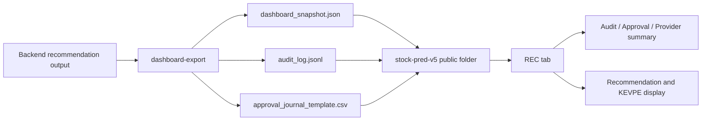

# Project Plan — Unified

> Generated: 2026-05-03 | Source: 8 plan documents across 4 subfolders

## § 0. 문서 메타 정보

| 파일 경로 | 버전/날짜 | 상태 | 비고 |
| --------- | --------- | ---- | ---- |
| docs/plan.md | 2026-05-02 | 완결 | 투자 OS 구축, Phase 1-7, Windows/GPU 환경 |
| docs/plan_rev.md | 2026-05-03 | 초안 | 투자 운영 구조, Phase 1-5 |
| docs/A3_MERGE_PLAN.md | 2026-05-03 | 완료 | 문서 병합/보관 계획 (orphan JSX 아카이브) |
| docs/MOVE_PLAN.md | 2026-05-03 | 대기 | 파일 이동 계획 (stock_rtx4060/ → workspaces/) |
| stock-pred-v5/docs/plan.md | 2026-05-03 | 완료 | REC Tab 통합 (stock-pred-v5 + stock_rtx4060_unified) |
| stock_rtx4060_unified/docs/plan.md | 2026-05-02 | 구현완료 | MCP+OpenBB+Audit Phase 1 (19 tests 통과) |
| stock_rtx4060_unified/docs/plan_dashboard_bridge_2026-05-03.md | 2026-05-03 | 구현완료 | Dashboard Report Bridge (Option A) |
| stock_rtx4060_unified/docs/plan_dashboard_bridge_risk_mitigation_2026-05-03.md | 2026-05-03 | 구현완료 | Dashboard Bridge Risk Mitigation (Option B) |
| stock_rtx4060_unified/docs/plan_real_data_ops_upgrade_2026-05-03.md | 2026-05-03 | Draft | Real Data Ops Upgrade (Phase 0-5) |

---

## § 1. 통합 현황 (Status Dashboard)

### ✅ 완료 항목

**루트 `docs/` (2건)**
- `docs/plan.md` (2026-05-02): 완결 — 투자 OS 구축, Phase 1-7, Windows/GPU 환경
- `docs/plan_rev.md` (2026-05-03): 초안 — 투자 운영 구조, Phase 1-5
- `docs/A3_MERGE_PLAN.md` (2026-05-03): 완료 — 7개 쌍 평가, 0 중복 발견, orphan JSX 아카이브 계획
- `docs/MOVE_PLAN.md` (2026-05-03): 대기 — stock_rtx4060/ → workspaces/ 파일 이동 (Import patch 필요)

**`stock-pred-v5/docs/` (1건)**
- REC Tab 통합 완료: Vite:5173 ↔ Flask:5151 프록시, RecommendationPanel/Panel/Card/Badge 3개 컴포넌트

**`stock_rtx4060_unified/docs/` (4건)**
- `plan.md` (2026-05-02): Phase 1 구현완료 — data_providers.py, audit_log.py, mcp_adapter.py, 19 tests 통과
- `plan_dashboard_bridge_2026-05-03.md`: Option A 파일기반 bridge 완료 (dashboard_snapshot.json)
- `plan_dashboard_bridge_risk_mitigation_2026-05-03.md`: Option B 구현완료 — dashboard/stock_pred_v5.jsx, bridge_smoke.html
- `plan_real_data_ops_upgrade_2026-05-03.md`: Phase 0-5 Draft — approval 준비 상태 (provider 미선정, thresholds 미승정)

**Phase 2A 실행 결과 (1건)**
- XGBoost GPU 추천 smoke 완료: `stock_rtx4060_unified/reports/recommendations_xgb_gpu_smoke/recommendations_algo_v2_20260503_110741.md/json`, `audit_log.jsonl`

### 🔄 진행중 항목

- **Real Data Ops Upgrade**: Phase 0 baseline 확인 대기, provider selection/open 问题未解決
- **MOVE_PLAN 실행**: Import patch 필요 — main.py, feature_engine.py, ensemble_model.py, backtester.py, hw_profile.py 경로 업데이트 후 파일 이동
- **A3_MERGE_PLAN Group 3 아카이브**: user_confirmation 대기 중 (stock_pred_v5.jsx, stock_prediction_dashboard_1.jsx → archive/)

### ⏳ 미착수 항목

**루트 plan.md 기준 (기존 Phase 2-7)**
- Phase 2: 기존 "Python 3.11 + venv + TensorFlow/XGBoost 설치 + GPU 검증 Gate"는 2026-05-03 검증 결과에 따라 Phase 2A/2B로 분리됨
  - Phase 2A: XGBoost GPU 추천 smoke 실행
    - 2026-05-03 완료: `SYNTH-A`, `--model-kind xgb`, `--xgb-device cuda`
  - Phase 2B: TensorFlow/LSTM 선택 확장
- Phase 3: `stock_rtx4060/` 폴더 → `workspaces/stock_rtx4060/` 이동 (MOVE_PLAN 완료 후)
- Phase 4: Track-S/Track-L Rule 코드화
- Phase 5: 모델/백테스트 파이프라인 (30종 지표, XGBoost-GPU 우선, LSTM-FP16은 Phase 2B 성공 시 확장, Walk-Forward CV)
- Phase 6: 리포트 출력 (Daily Brief, Risk Dashboard, Journal, Monthly Scorecard)
- Phase 7: 운영 전환 검증 (`python main.py self-test`)

**stock_rtx4060_unified Real Data Ops Upgrade (Phase 1-5)**
- Phase 1: Source contract design (provider priority, metadata, freshness rules)
- Phase 2: Validation gate design (PASS/AMBER/RED/ZERO)
- Phase 3: Approval and audit design (state machine, role permissions, append-only events)
- Phase 4: Report and dashboard contract (gate status, approval evidence)
- Phase 5: Implementation readiness review

### ⚠️ 충돌·누락 발견 항목

| 항목 | 출처 | 판정 |
| ---- | ---- | ---- |
| Phase 수 (7 vs 5) | docs/plan.md (7), docs/plan_rev.md (5) | **충돌** → plan.md 채택 (더 완결) |
| Bucket 수 (5 vs 6) | docs/plan.md (5), docs/plan_rev.md (6+Opportunistic Cash) | **중복+확장** → plan_rev.md 채택 |
| Real Data Ops Upgrade 상태 | plan_real_data_ops_upgrade_2026-05-03.md (Draft, approval 미완료) | **미승정** → Phase 0-5 진행 전 approval 필요 |
| Dashboard JSX 외부 위치 | stock_pred_v5.jsx (root), dashboard/stock_pred_v5.jsx (repo-owned) | **중복** → Risk Mitigation plan으로 해소됨 |
| MOVE_PLAN vs 실제 폴더 구조 | MOVE_PLAN은 `stock_rtx4060/` → `workspaces/`, 실제 repo는 `stock_rtx4060_unified/` | **불일치** → 실제 구조 확인 필요 |
| Phase 2 상태 | GPU/XGBoost는 완료, TensorFlow/LSTM은 Python 3.14 미호환 | **C안 채택** → Phase 2A(XGBoost smoke)와 Phase 2B(TensorFlow/LSTM 선택 확장)로 분리 |

---

## § 2. 발견된 차이점 및 해소 결정

| 충돌/누락 내용 | 출처 문서 | 채택 결정 | 근거 |
| -------------- | --------- | -------- | ---- |
| Phase 수 (7 vs 5) | docs/plan.md (7 phases), docs/plan_rev.md (5 phases) | **plan.md 기준** | plan.md가 환경 구축(GPU), 코드 구조, 백테스트, 리포트, 운영 전환까지 포함하여 더 완결 |
| Bucket 수 (5 vs 6) | docs/plan.md (5), docs/plan_rev.md (6 with Opportunistic Cash) | **plan_rev.md 기준** | Opportunistic Cash 5%는 급락 시 분할매수 기화로 유용 |
| GPU 환경 검증 절차 | docs/plan.md only | **plan.md 기준** | WSL2/CUDA 검증 Gate는 실제 환경에서 필수 |
| Dashboard JSX 분산 | stock_pred_v5.jsx (root) vs dashboard/stock_pred_v5.jsx (repo) | **plan_dashboard_bridge_risk_mitigation** | Option B로 repo-owned copy 생성, 외부 파일 유지 |
| MOVE_PLAN 경로 불일치 | MOVE_PLAN은 `stock_rtx4060/`, 실제 repo는 `stock_rtx4060_unified/` | **불명확** → User 확인 필요 | 실제 구조와 MOVE_PLAN 충돌 확인 필요 |
| Phase 2 환경 구축 상태 | GPU/XGBoost 검증 완료, TensorFlow CPU/LSTM smoke 완료 | **C안 채택** | XGBoost GPU 추천 smoke와 TensorFlow CPU/LSTM 환경을 서로 분리 |
| Real Data Ops Upgrade approval | plan_real_data_ops_upgrade는 Draft 상태 | **보류** | Phase 0-5 진행 전 approval 필요 (provider, thresholds 미승정) |
| REC Tab 통합 범위 | stock-pred-v5/docs/plan.md | **완료** | Vite:5173 ↔ Flask:5151 프록시 및 3개 컴포넌트 구현 완료 |

---

## § 3. 통합 실행 계획

### Phase 0 — 병렬 프로젝트 상태 확인 (즉시)

| 프로젝트 | 상태 | 다음 액션 |
| -------- | ---- | -------- |
| `stock_rtx4060_unified` (MCP+OpenBB+Audit Phase 1) | ✅ 완료 (19 tests 통과) | Real Data Ops Upgrade Phase 1로 진입 |
| `stock-pred-v5` REC Tab Integration | ✅ 완료 | dashboard/stock_pred_v5.jsx 브라우저 검증 완료 확인 |
| `stock_rtx4060_unified` Dashboard Bridge | ✅ 완료 (Option A) | Reports policy + .gitignore 적용 확인 |
| `stock_rtx4060_unified` Dashboard Risk Mitigation | ✅ 완료 (Option B) | browser verification report 확인 |
| `docs/A3_MERGE_PLAN.md` Group 3 아카이브 | ⏳ 대기 | User confirmation required |
| `docs/MOVE_PLAN.md` | ⏳ 대기 | Import patch + User confirmation required |

### Phase 1 — 계좌·자금 분리 및 기준선 확정
| 항목 | 내용 |
| ---- | ---- |
| 산출물 |资金배분표 (Track-S 20%/Track-L 75%/Cash 5%) |

### Phase 2 — Python 환경 구축 및 GPU 검증 (2A/2B 분리)
| 항목 | 내용 |
| ---- | ---- |
| 전체 판정 | GREEN/AMBER — XGBoost GPU 경로는 실행 가능, TensorFlow CPU/LSTM smoke는 별도 Python 3.12 환경에서 완료, TensorFlow GPU는 WSL2 경로에서 검증 완료. native Windows TensorFlow GPU는 미지원 |
| Python | 3.14.4 (TensorFlow 미호환 — 3.11 권장) |
| XGBoost | 3.2.0 ✅, GPU CUDA 가속 ✅ |
| pandas/numpy/yfinance/scikit-learn | 설치 완료 ✅ |
| TensorFlow | 2.21.0 설치 완료 (`.venv-tf312`, CPU device only) |

#### Phase 2A — XGBoost GPU 추천 smoke 실행

| 항목 | 내용 |
| ---- | ---- |
| 상태 | DONE |
| 목적 | 현재 검증된 RTX 4060 + XGBoost CUDA 경로로 실제 추천 리포트가 생성되는지 확인 |
| 적용 범위 | `stock_rtx4060_unified/` active backend |
| TensorFlow 의존성 | 없음 |

권장 명령:

```powershell
cd C:\Users\jichu\Downloads\주식\stock_rtx4060_unified
.\run.ps1 recommend --data-provider synthetic --universe "SYNTH-A" --top 1 --model-kind xgb --xgb-device cuda --output-dir reports\recommendations_xgb_gpu_smoke
```

성공 기준:

| 기준 | 기대 결과 |
| ---- | --------- |
| CLI 종료 | 오류 없이 종료 |
| Markdown 리포트 | `reports\recommendations_xgb_gpu_smoke\recommendations_algo_v2_*.md` 생성 |
| JSON 리포트 | `reports\recommendations_xgb_gpu_smoke\recommendations_algo_v2_*.json` 생성 |
| 안전 경계 | `screening_output_only` 유지 |
| GPU 경로 | XGBoost CUDA 요청이 실패하면 실패/CPU fallback 여부를 리포트 또는 로그에 명시 |

실행 결과:

| 항목 | 결과 |
| ---- | ---- |
| 실행 시각 | 2026-05-03 |
| 명령 | `.\run.ps1 recommend --data-provider synthetic --universe "SYNTH-A" --top 1 --model-kind xgb --xgb-device cuda --output-dir reports\recommendations_xgb_gpu_smoke` |
| Markdown 리포트 | `reports\recommendations_xgb_gpu_smoke\recommendations_algo_v2_20260503_110741.md` |
| JSON 리포트 | `reports\recommendations_xgb_gpu_smoke\recommendations_algo_v2_20260503_110741.json` |
| Audit log | `reports\recommendations_xgb_gpu_smoke\audit_log.jsonl` |
| Verdict | `ELIGIBLE_RECOMMENDATION` |
| Model evidence | `models=xgb-cuda` |
| 안전 경계 | `screening_output_only=True`, `broker_order_execution=False` |
| Audit event | 1 event, `provider_used=synthetic`, `status=SUCCESS`, `ticker=SYNTH-A` |

#### Phase 2B — TensorFlow/LSTM 선택 확장

| 항목 | 내용 |
| ---- | ---- |
| 상태 | DONE for CPU LSTM smoke / DONE for WSL2 TensorFlow GPU smoke |
| 목적 | LSTM-FP16이 실제로 필요한 경우를 대비해 TensorFlow 호환 환경을 분리 구축 |
| 적용 범위 | `.venv-tf312` Python 3.12 전용 환경 |
| 기존 경로 영향 | 기존 XGBoost GPU 실행 환경을 변경하지 않음 |

실행 명령:

```powershell
cd C:\Users\jichu\Downloads\주식\stock_rtx4060_unified
py -3.12 -m venv .venv-tf312
.\.venv-tf312\Scripts\python.exe -m pip install --upgrade pip
.\.venv-tf312\Scripts\python.exe -m pip install tensorflow
.\.venv-tf312\Scripts\python.exe -c "import tensorflow as tf; print(tf.__version__); print(tf.config.list_physical_devices())"
```

재검증 명령:

```powershell
cd C:\Users\jichu\Downloads\주식\stock_rtx4060_unified
.\run.ps1 tensorflow-check
.\run.ps1 tensorflow-gpu-wsl-check
```

검증 결과:

| 기준 | 결과 |
| ---- | --------- |
| Python 3.12 venv | `.venv-tf312` 생성 |
| TensorFlow install | `tensorflow-2.21.0` 설치 |
| TensorFlow import | `TF_VERSION=2.21.0` |
| Device check | CPU device only: `/physical_device:CPU:0` |
| LSTM smoke | PASS: one-epoch minimal LSTM fit/predict, `PRED_SHAPE=(2, 1)` |
| run.ps1 wrapper | `tensorflow-check`, `tf-check`, `tf-smoke` aliases PASS |
| 격리성 | 기존 `.venv` 또는 XGBoost GPU smoke 경로가 깨지지 않음 |
| TensorFlow GPU | WSL2 PASS: `tensorflow-gpu-wsl-check` detected `/physical_device:GPU:0`, GPU matmul PASS, LSTM smoke PASS |
| Windows TensorFlow GPU | native Windows TensorFlow >=2.11 GPU 미지원. Windows `.venv-tf312`는 CPU-only 유지 |

### Phase 3 — 코드 구조 정리 (MOVE_PLAN 완료 후)
| 항목 | 내용 |
| ---- | ---- |
| 파일 | hw_profile.py, feature_engine.py, ensemble_model.py, backtester.py, main.py → `workspaces/stock_rtx4060/` |

### Phase 4 — Track-S / Track-L Rule 코드화
| 항목 | 내용 |
| ---- | ---- |
| Track-S | Score ≥75, Stop -4%, TP1 +5%, TP2 +10%, 月間 -5%中断 |
| Track-L | Score ≥80, 6 Bucket (Core 40%/Quality 20%/AI 15%/Commodity 10%/Bonds 10%/Opportunistic 5%) |
| 공통 | Green/Amber/Red/ZERO Risk Gate |

### Phase 5 — 모델·백테스트 파이프라인
| 항목 | 내용 |
| ---- | ---- |
| 피처 | 30종 지표, 16 워커 병렬 |
| 모델 | XGBoost-GPU 우선, LSTM-FP16은 Phase 2B 성공 후 선택 확장 |
| 검증 | Walk-Forward CV, Kelly sizing |

### Phase 6 — 리포트 출력
| 항목 | 내용 |
| ---- | ---- |
| 출력 | Daily Brief, Risk Dashboard, Track-S Journal, Track-L Thesis Report, Monthly Scorecard |

### Phase 7 — 운영 전환 검증
| 항목 | 내용 |
| ---- | ---- |
| 기준 명령 | `python main.py self-test` |
| 샘플 실행 | AAPL, 005930.KS, NVDA, TSLA 예측 |

### Phase 8 — Real Data Ops Upgrade (stock_rtx4060_unified)
| Phase | 내용 | 상태 |
| ----- | ---- | ---- |
| 0 | Baseline confirmation | ⏳ 대기 |
| 1 | Source contract design | ⏳ 대기 (provider 미선정) |
| 2 | Validation gate design | ⏳ 대기 (thresholds 미승정) |
| 3 | Approval and audit design | ⏳ 대기 |
| 4 | Report and dashboard contract | ⏳ 대기 |
| 5 | Implementation readiness review | ⏳ 대기 |

---

## § 4. 다음 액션 아이템

| 항목 | 담당 | 기한 | 우선순위 |
| ---- | ---- | ---- | -------- |
| GPU 검증 Gate 결과 문서 유지 (`nvidia-smi`, XGBoost CUDA) | Agent | 즉시 | HIGH |
| TensorFlow GPU/WSL2 경로 검토 | User/Agent | TensorFlow GPU가 실제로 필요할 때 | OPTIONAL |
| Real Data Ops Upgrade — provider selection & thresholds approval | User | 다음 세션 | HIGH |
| A3_MERGE_PLAN Group 3 아카이브 confirmation (stock_pred_v5.jsx, stock_prediction_dashboard_1.jsx) | User | 다음 세션 | MEDIUM |
| MOVE_PLAN vs stock_rtx4060_unified 폴더 구조 불일치 해소 | User | 다음 세션 | MEDIUM |
| `stock_rtx4060/` → `workspaces/stock_rtx4060/` 이동 (Import patch 후) | Agent | 다음 세션 | MEDIUM |
| dashboard/stock_pred_v5.jsx 브라우저 검증 완료 확인 | User | 다음 세션 | LOW |
| docs/plan.md 와 docs/plan_rev.md 병합 후 기존 문서 삭제 여부 확인 | User | 다음 세션 | LOW |

---

## § 5. 변경 이력

- 2026-05-03: 확장 통합본 생성
  - Source: 8개 plan documents (docs/plan.md, docs/plan_rev.md, docs/A3_MERGE_PLAN.md, docs/MOVE_PLAN.md, stock-pred-v5/docs/plan.md, stock_rtx4060_unified/docs/plan.md, plan_dashboard_bridge_2026-05-03.md, plan_dashboard_bridge_risk_mitigation_2026-05-03.md)
  - Phase 구조: docs/plan.md 7 Phase 채택 + stock_rtx4060_unified Real Data Ops Upgrade Phase 0-5 추가
  - Bucket 배분: plan_rev.md 6 Bucket (Opportunistic Cash 포함) 채택
  - 완료 항목: MCP+OpenBB+Audit Phase 1, REC Tab Integration, Dashboard Bridge, Dashboard Risk Mitigation
  - 보류 항목: Real Data Ops Upgrade approval, A3_MERGE_PLAN Group 3 아카이브, MOVE_PLAN 실행
  - 불명확 항목: MOVE_PLAN 경로와 실제 stock_rtx4060_unified 구조 불일치 → User 확인 필요
- 2026-05-03: Scenario C 패치
  - Phase 2를 `Phase 2A — XGBoost GPU 추천 smoke 실행`과 `Phase 2B — TensorFlow/LSTM 선택 확장`으로 분리
  - XGBoost GPU 경로는 즉시 실행 가능한 READY 상태로 정리
  - TensorFlow/LSTM은 Python 3.14 미호환 때문에 OPTIONAL/DEFERRED로 분리
  - Phase 5 모델 설명을 XGBoost-GPU 우선, LSTM-FP16 선택 확장으로 수정
- 2026-05-03: Phase 2A 실행 완료
  - `stock_rtx4060_unified`에서 XGBoost GPU 추천 smoke 실행
  - 첫 실행은 CLI가 허용하지 않는 긴 model-kind 값을 사용해 실패했고, 허용값인 `--model-kind xgb`로 계획 명령을 수정
  - 수정 후 `SYNTH-A` 추천 리포트 Markdown/JSON과 `audit_log.jsonl` 생성
  - JSON 검증 결과 `screening_output_only=True`, `MODEL_EDGE=models=xgb-cuda`, `AUTOMATION_BOUNDARY=screening_output_only; broker_order_execution=False`
- 2026-05-03: Phase 2B TensorFlow 설치 완료
  - 기존 `.venv`를 건드리지 않고 `stock_rtx4060_unified/.venv-tf312` 생성
  - Python 3.12.4 전용 환경에 `tensorflow-2.21.0` 설치
  - TensorFlow import 및 CPU device 확인 완료
  - 최소 LSTM one-epoch fit/predict smoke 통과, `PRED_SHAPE=(2, 1)`
- native Windows TensorFlow GPU는 미지원 상태로 기록. TensorFlow GPU는 WSL2 경로에서 별도 검증 완료
- 2026-05-03: `run.ps1` TensorFlow wrapper 검증 명령 추가
- `.\run.ps1 tensorflow-check`는 `.venv-tf312`만 사용해 TensorFlow import, device check, LSTM smoke를 실행
- aliases: `.\run.ps1 tf-check`, `.\run.ps1 tf-smoke`
- 2026-05-03: WSL TensorFlow GPU wrapper 검증 명령 추가
- `.\run.ps1 tensorflow-gpu-wsl-check`는 WSL Ubuntu의 `/root/.venvs/stock-rtx4060-tf-gpu`를 사용하고, NVIDIA pip library 경로를 `LD_LIBRARY_PATH`에 자동 설정
- aliases: `.\run.ps1 tf-gpu-wsl`, `.\run.ps1 tf-gpu-smoke`
- 검증 결과: TensorFlow `2.21.0`, `TF_GPUS=["/physical_device:GPU:0"]`, `GPU_MATMUL=PASS`, `LSTM_SMOKE=PASS`
  - 기존 `.\run.ps1 --help`는 계속 `main.py` help 경로로 동작

## § 6. 2026-05-03 Dashboard Public Export Completion Addendum

This addendum records the latest completed dashboard bridge work. It is additive and does not remove earlier plan history.



| Item | Status | Evidence |
|---|---|---|
| Backend dashboard export | Complete | `stock_rtx4060_unified/main.py dashboard-export` accepts `--public-dir` and `--approval-journal`. |
| Public file bridge | Complete | `dashboard_snapshot.json`, `audit_log.jsonl`, and `approval_journal_template.csv` are exported to `stock-pred-v5/public/`. |
| REC tab operational summary | Complete | `stock-pred-v5` REC tab shows Audit / Approval / Provider summary panels. |
| Browser verification | Complete | `npx playwright test tests/kevpe-dashboard.spec.js --reporter=line` passed in the dashboard app. |
| Build and security check | Complete | `npm run build` passed and `npm audit` reported no vulnerabilities in the dashboard app. |

Public dashboard files:

| File | Purpose |
|---|---|
| `stock-pred-v5/public/dashboard_snapshot.json` | REC tab recommendation snapshot input. |
| `stock-pred-v5/public/audit_log.jsonl` | REC tab audit summary input. |
| `stock-pred-v5/public/approval_journal_template.csv` | REC tab approval summary input. |

Verified command set:

```powershell
cd C:\Users\jichu\Downloads\주식\stock_rtx4060_unified
.\.venv\Scripts\python.exe main.py dashboard-export --recommendation-json .\reports\full_verify_ops_v1\recommendations\recommendations_algo_v2_20260503_151612.json --output .\reports\dashboard_public_export_smoke\dashboard_snapshot.json --public-dir ..\stock-pred-v5\public --approval-journal .\reports\full_verify_ops_v1\approval_journal_template.csv
```

```powershell
cd C:\Users\jichu\Downloads\주식\stock-pred-v5
npx playwright test tests/kevpe-dashboard.spec.js --reporter=line
npm run build
npm audit
```

The current bridge is a file-based dashboard bridge. A live API bridge, broker integration, or automatic trading workflow is outside this completed scope and must require a separate plan and approval gate.
