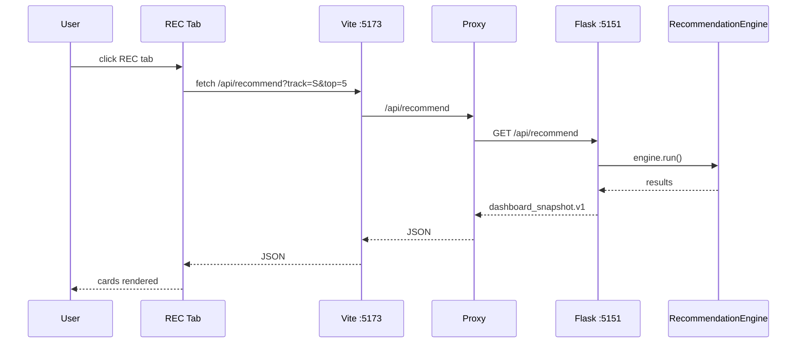

# Architecture — stock-pred-v5 REC Tab + stock_rtx4060_unified Integration

## Purpose

Single-pane dashboard combining ML price predictions (stock-pred-v5) with algorithm-ranked stock-candidate recommendations (stock_rtx4060_unified), rendered in a REC tab without broker execution.

---

## Runtime Components

| Component | Location | Role |
|-----------|----------|------|
| Vite Dev Server | `localhost:5173` | React dashboard + HMR |
| Flask API | `127.0.0.1:5151` | Recommendation engine API |
| RecommendationEngine | `stock_rtx4060_unified/src/` | Scoring, ranking, risk gate |
| dashboard_bridge | `stock_rtx4060_unified/src/` | Converts results → `dashboard_snapshot.v1` schema |
| React REC tab | `src/components/RecommendationPanel.jsx` | Fetches + renders recommendations |

### Entry Point

| File | Lines | Role |
|------|-------|------|
| `src/StockPredV5.jsx` | ~1,700 | Main React component — US/KRX tab, sidebar, SIGNAL/MODELS/BACKTEST/REC tab bar |

The `StockPredV5.jsx` entry point:
1. Manages all React state (`cache`, `loading`, `tab`, `recSource`, `bench`, `clock`)
2. Houses the right sidebar with tab navigation
3. Owns the `RecommendationPanel` integration (rendered when `tab === "REC"`)
4. Coordinates Vite proxy for `/api/recommend` → Flask backend

---

## Component Topology

```mermaid
flowchart TD
  subgraph Backend["stock_rtx4060_unified"]
    RE[RecommendationEngine] --> DB[dashboard_bridge]
    DB --> SNAP[dashboard_snapshot.json]
    RE --> API[Flask :5151]
  end
  subgraph Frontend["stock-pred-v5"]
    Vite --> Proxy[/api proxy]
    Proxy --> API
    Vite --> REC[REC tab]
    REC --> RP[RecommendationPanel]
    RP --> RC[RecommendationCard]
    RC --> RGB[RiskGateBadge]
  end
  SNAP -.-> RP
  API -.-> RP
```

---

## Request Sequence



---

## Technology Stack

| Layer | Technology | Purpose |
|-------|------------|---------|
| Frontend | React 18.3 + Vite 5.4 | UI framework + HMR |
| Charts | recharts 2.12 | ML signal visualization |
| API | Flask 3 + flask-cors | Recommendation REST API |
| ML Engine | stock_rtx4060_unified | Recommendation scoring |
| Data format | dashboard_snapshot.v1 JSON | Schema |

---

## Integration Points

| Direction | Detail |
|-----------|--------|
| Vite → Flask | `vite.config.js` proxy: `/api` → `127.0.0.1:5151` |
| Flask → React | CORS allowed for `localhost:5173` only |
| Data schema | `dashboard_snapshot.v1` — `version`, `generated_at`, `results[]` with ticker/track/verdict/score/probability/expected_value/entry/stop/TP2/RR/risk_budget/max_position/validations |

---

## Constraints

- **No broker execution** — recommendations are screening outputs only; no order routing, no auto buy/sell
- **Recommendations are screening outputs** for manual review, not guaranteed investment advice
- **CORS hardcoded** to `localhost:5173` — must update if Vite port changes
- **No auth** on Flask API — local-only use assumed
- **GPU validation** lives in `stock_rtx4060_unified`, not in this package