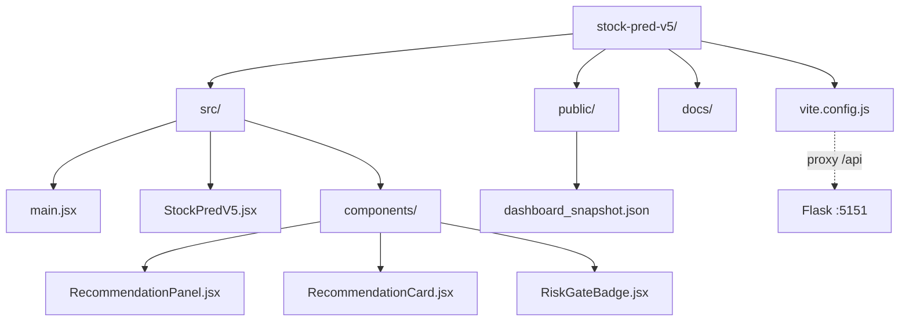

# Layout

## Source Tree

```
stock-pred-v5/
├── src/
│   ├── main.jsx                     # React mount
│   ├── StockPredV5.jsx              # Main dashboard (US + KRX ML)
│   └── components/
│       ├── RecommendationPanel.jsx  # REC tab: FILE/API fetch, filter, sort
│       ├── RecommendationCard.jsx   # Card: entry/stop/TP2/RR/position
│       └── RiskGateBadge.jsx        # Verdict badge: ELIGIBLE/AMBER/RED/ZERO
├── public/
│   └── dashboard_snapshot.json      # Static smoke-test data (dashboard_snapshot.v1)
├── docs/
│   ├── SYSTEM_ARCHITECTURE.md       # Architecture + Mermaids
│   ├── LAYOUT.md                    # This file
│   └── ...
├── vite.config.js                   # /api proxy → 127.0.0.1:5151
└── package.json
```

## Folder Hierarchy



## Configuration Files

| File | Controls | Format |
|------|---------|--------|
| package.json | npm scripts, React/Vite/recharts deps | JSON |
| vite.config.js | Port 5173, /api proxy → :5151 | ES module |
| .env (optional) | VITE_API_URL, VITE_DEFAULT_CURRENCY | key=val |

## Key Entry Points

| Entry | Command | Purpose |
|-------|---------|---------|
| Dev server | `npm run dev` | Start Vite :5173 |
| Prod build | `npm run build` | Bundle to dist/ |
| Preview | `npm run preview` | Serve dist/ on :4173 |
| Unified | `preview_server.py` in stock_rtx4060_unified | Flask + Vite together |
