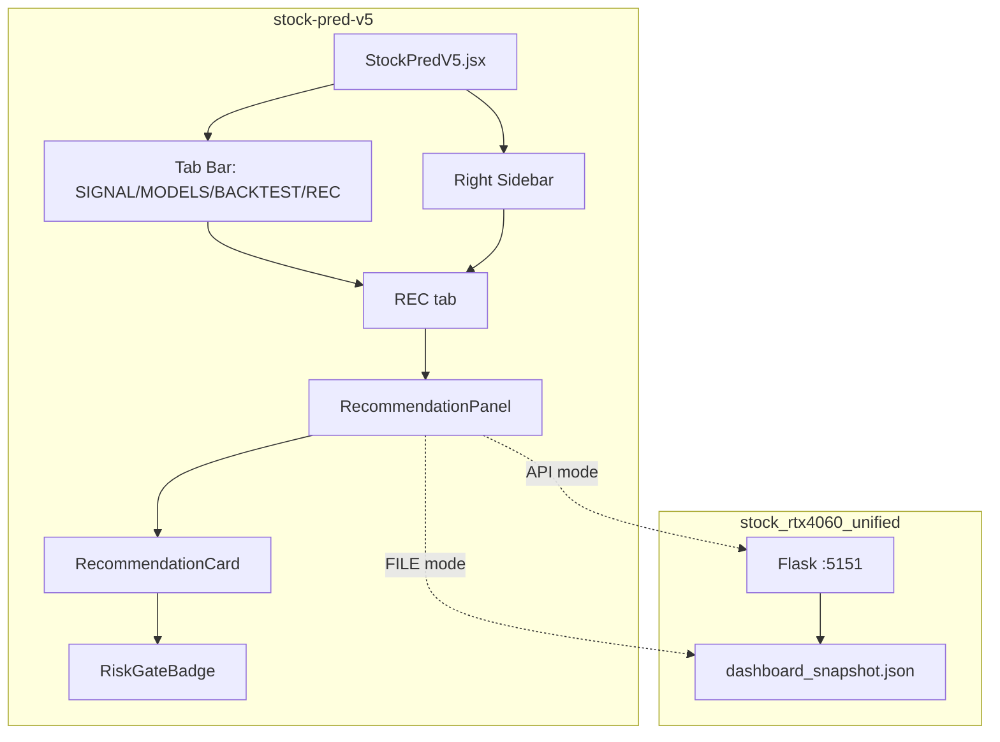
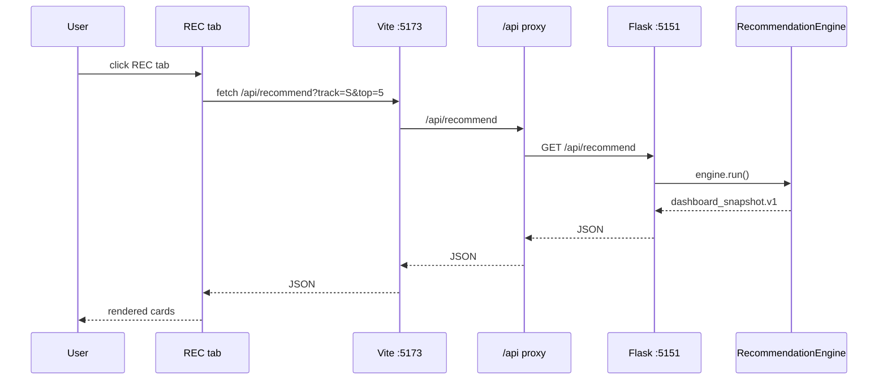

# System Architecture

## Purpose

stock-pred-v5 is a **dual-market (US + KRX) client-side ML stock dashboard** with a REC (Recommendation) tab that displays stock-candidate screening results from stock_rtx4060_unified. All ML inference runs in-browser; no server-side prediction.

## Runtime Components

| Component | File | Role |
|-----------|------|------|
| Main Dashboard | src/StockPredV5.jsx | State, tab bar, sidebar, REC integration |
| REC Panel | src/components/RecommendationPanel.jsx | FILE/API fetch, filter tabs, sort |
| REC Card | src/components/RecommendationCard.jsx | Entry/stop/TP2/RR rendering |
| Verdict Badge | src/components/RiskGateBadge.jsx | Color-coded verdict label |
| Build Config | vite.config.js | Vite port, /api proxy |
| Dashboard Data | public/dashboard_snapshot.json | Static smoke-test snapshot |

## Component Topology



## Request Flow (REC tab API mode)



## Module Dependency Map

```mermaid
graph TD
    StockPredV5.jsx --> RecommendationPanel
    RecommendationPanel --> RecommendationCard
    RecommendationCard --> RiskGateBadge
    vite.config.js --> Proxy[/api → 127.0.0.1:5151]
```

## Technology Stack

| Layer | Technology | Version | Purpose |
|-------|------------|---------|---------|
| Framework | React | 18.3 | UI components |
| Build | Vite | 5.4 | Dev server + HMR |
| Charts | recharts | 2.12 | Signal/MODELS/BACKTEST |
| API | Flask | 3+ | REC recommendation API |
| API | flask-cors | 4+ | CORS for localhost:5173 |
| Fonts | JetBrains Mono | CDN | Monospace aesthetic |

## Cross-Project Interface

| Upstream | Interface | Purpose |
|----------|-----------|---------|
| stock_rtx4060_unified | Flask API :5151 or dashboard_snapshot.json | Stock-candidate screening results |
| Vite proxy | /api → 127.0.0.1:5151 | Routes REC tab fetch to Flask |
