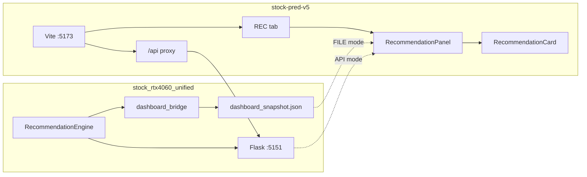

# Plan — stock-pred-v5 REC Tab Integration

## Objective

Add a **REC (Recommendation) tab** to the stock-pred-v5 dashboard that displays stock-candidate recommendation results sourced from `stock_rtx4060_unified`, either via a static JSON file or a live Flask API.

## Current State

- `stock-pred-v5`: Vite + React dashboard (US + KRX ML predictions), port 5173
- `stock_rtx4060_unified`: Python recommendation engine + Flask API, port 5151
- No integration between the two packages existed

## Scope
- In scope:
  - Add REC tab to right sidebar of `StockPredV5.jsx`
  - Create `RiskGateBadge.jsx`, `RecommendationCard.jsx`, `RecommendationPanel.jsx`
  - Static file mode: serve `dashboard_snapshot.json` from `public/`
  - API mode: Flask `/api/recommend` → Vite proxy → `/api/recommend`
  - Vite proxy configuration for `/api` → `127.0.0.1:5151`
  - Unified `preview_server.py` launching both servers + browser
  - Docs: `docs/CONTRIB.md`, `docs/RUNBOOK.md`, this doc set
- Out of scope:
  - Broker execution, order routing, auto buy/sell
  - Real-time WebSocket streaming
  - User authentication / auth0 integration
  - Mobile-specific UI

## Milestones
| No | Milestone | Output | Risk | Evidence |
|---|---|---|---|---|
| 1 | Discovery + plan | This document set | LOW | CHANGELOG.md, package.json read |
| 2 | Component authoring | 3 new JSX components | LOW | Files created |
| 3 | API server + proxy | `api_server.py`, `vite.config.js` proxy | LOW | `curl localhost:5151/api/health` |
| 4 | Preview launcher | `preview_server.py` | LOW | Both servers start |
| 5 | Smoke test | Browser REC tab | MEDIUM | Manual browser verification pending |
| 6 | Documentation | `docs/` full set | LOW | Files written |

## Risks and Mitigations

| Risk | Likelihood | Impact | Mitigation |
|------|-----------|--------|------------|
| Browser cache shows stale JSON | MEDIUM | LOW | Add cache-bust query param or fetch API |
| Flask CORS blocks Vite origin | LOW | MEDIUM | Already configured for `localhost:5173` |
| Vite `npm.cmd` not found on some machines | MEDIUM | LOW | Fallback to `shutil.which("npm")` |
| API server startup race with Vite | LOW | LOW | `time.sleep(1.5)` before opening browser |

## Validation Plan

1. `curl http://127.0.0.1:5151/api/health` → `{"status":"ok"}`
2. `curl http://localhost:5173` → HTML loads
3. REC tab in browser → cards render with verdicts (GREEN/AMBER/RED)
4. FILE/API toggle → both sources return data
5. `python -m py_compile` on all Python files → 0 errors

## Code Evidence Anchors

- `src/StockPredV5.jsx:17` — `import RecommendationPanel`
- `src/components/RecommendationPanel.jsx` — FILE/API fetch logic
- `src/components/RecommendationCard.jsx` — card rendering
- `src/components/RiskGateBadge.jsx` — verdict color map
- `vite.config.js:11-15` — `/api` proxy to `127.0.0.1:5151`
- `stock_rtx4060_unified/api_server.py` — Flask endpoints
- `stock_rtx4060_unified/preview_server.py` — unified launcher
- `public/dashboard_snapshot.json` — static smoke-test data

## Mermaid

