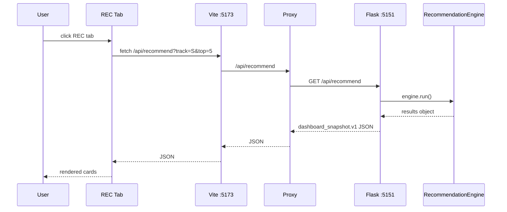

# System Architecture

## Purpose

Render stock-candidate recommendation results from `stock_rtx4060_unified` on the `stock-pred-v5` dashboard, giving users a single pane of glass for both ML price prediction and algorithm-ranked investment candidates.

## Runtime Components

| Component | Location | Role |
|-----------|----------|------|
| Vite Dev Server | `localhost:5173` | Serves React dashboard + HMR |
| Flask API | `127.0.0.1:5151` | Runs recommendation engine, returns `dashboard_snapshot.v1` JSON |
| RecommendationEngine | `stock_rtx4060_unified/src/` | Scoring, ranking, risk gate validation |
| `dashboard_bridge` | `stock_rtx4060_unified/src/` | Converts recommendation JSON → `dashboard_snapshot.v1` |
| React REC tab | `src/components/RecommendationPanel.jsx` | Fetches and renders recommendations |

## Data / Request Flow

**API Mode (default for live data)**:
```
User clicks REC tab
  → RecommendationPanel (API mode)
    → fetch /api/recommend?universe=...&track=S&top=5
      → Vite proxy /api → 127.0.0.1:5151
        → Flask /api/recommend
          → RecommendationEngine.run()
            → dashboard_bridge.build_dashboard_snapshot()
              → JSON response (dashboard_snapshot.v1)
    → React renders RecommendationCard list
```

**FILE Mode (static JSON, no server required)**:
```
User toggles FILE mode
  → RecommendationPanel (jsonPath prop)
    → fetch /dashboard_snapshot.json
      → dashboard_snapshot.v1
    → React renders RecommendationCard list
```

**Preview Server (Option C)**:
```
python preview_server.py
  → Thread: Flask :5151
  → Subprocess: npm --prefix stock-pred-v5 run dev  (→ Vite :5173)
  → webbrowser.open(:5173)
```

## External Interfaces

| Interface | Protocol | Notes |
|-----------|----------|-------|
| `/api/recommend` | HTTP GET | Query params: `universe`, `track`, `period`, `top`, `synthetic`, `model_kind` |
| `/api/snapshot?path=X` | HTTP GET | Serves existing recommendation JSON as snapshot |
| `/api/health` | HTTP GET | Health check |
| `dashboard_snapshot.v1` | JSON | Schema: `version`, `generated_at`, `results[]` with ticker/track/verdict/score/entry/stop/tp2/risk_reward/validations |
| Vite `/api/*` proxy | HTTP | Rewrites `/api` → `127.0.0.1:5151` |

## Constraints and Tech Debt

- **No broker execution**: Recommendations are screening outputs only; no order routing, no auto buy/sell
- **CORS**: Flask CORS hardcoded to `localhost:5173` origins — update if Vite port changes
- **Windows npm path**: `preview_server.py` has a hardcoded `C:\nvm4w\nodejs\npm.cmd` path — mitigated with `shutil.which` fallback
- **No GPU validation in this package**: GPU/XGBoost CUDA checks live in `stock_rtx4060_unified`
- **No auth**: No authentication on Flask API (local-only use assumed)

## Mermaid 1 — Component Topology
```mermaid
flowchart TD
  subgraph Backend["stock_rtx4060_unified"]
    RE[RecommendationEngine] --> DB[dashboard_bridge]
    DB --> JSON[dashboard_snapshot.json]
    RE --> API[Flask :5151]
  end
  subgraph Frontend["stock-pred-v5 Vite"]
    Vite[Vite :5173] --> Proxy[/api proxy]
    Proxy --> API
    Vite --> REC[REC tab]
    REC --> RP[RecommendationPanel]
    RP --> RC[RecommendationCard]
    RC --> RGB[RiskGateBadge]
  end
  JSON -.-> RP
```

## Mermaid 2 — Request Sequence

